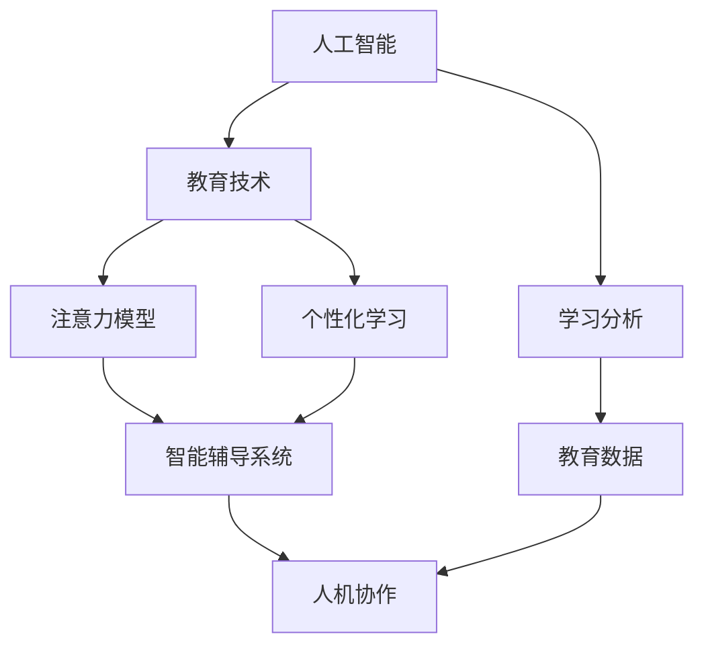

                 

# AI与人类注意力流：未来的教育和学习

> 关键词：人工智能,教育技术,注意力模型,个性化学习,人机协作,智能辅导系统,学习分析,教育数据

## 1. 背景介绍

### 1.1 问题由来

在快速发展的数字化时代，教育模式正在经历深刻的变革。在线教育、远程教育、智能辅导系统的兴起，使得个性化学习和终身学习成为可能。与此同时，人工智能技术的不断突破，也为教育带来了新的机遇与挑战。AI不仅能够辅助教师进行教学内容生成、作业批改、学生反馈等，还能对学生行为进行深入分析，制定个性化学习计划，提升学习效果。

然而，当前的教育技术仍面临诸多瓶颈。传统的一对多教学模式难以兼顾每个学生的个性化需求，教师的劳动强度大，难以进行精准化指导。在线教育平台虽然提供了大量学习资源，但普遍缺乏有效的学习行为监测与分析，学生学习效果参差不齐。这些问题的核心在于缺乏对学生注意力流的理解与建模，无法做到真正的个性化教学。

### 1.2 问题核心关键点

为了解决以上问题，需要对学生的注意力流进行建模与分析。这需要引入人工智能，特别是注意力模型。注意力模型通过学习学生对不同学习内容的关注程度，动态调整教学内容和策略，实现真正的个性化学习。同时，注意力模型还能提供学习过程的可视化分析，帮助教师和学生更好地理解学习行为。

核心问题点如下：

1. **注意力流建模**：如何准确地捕捉学生在各个学习阶段中的注意力状态，构建动态变化的学习轨迹。
2. **个性化教学**：基于注意力流分析结果，如何自动生成个性化的教学内容与策略。
3. **人机协作**：如何平衡AI与人类教师的角色，发挥各自的优势，实现高效的教学与辅导。
4. **学习分析**：如何通过注意力模型，进行深入的学习行为分析，优化教学效果。

### 1.3 问题研究意义

研究人工智能在教育中的注意力流建模与个性化学习，具有重要意义：

1. **提升学习效果**：通过个性化的教学内容与策略，提高学生的学习兴趣与效率，改善学习成果。
2. **减轻教师负担**：利用AI技术辅助教师进行学生评估与学习计划制定，降低教师的工作量。
3. **实现终身学习**：构建智能学习平台，实现按需学习，支持终身教育体系。
4. **促进教育公平**：为偏远地区、残障学生等弱势群体提供更高效、更公平的学习机会。

## 2. 核心概念与联系

### 2.1 核心概念概述

为更好地理解人工智能在教育中的注意力流建模与个性化学习，本节将介绍几个密切相关的核心概念：

- **人工智能(AI)**：以计算机科学为基础，通过算法与数据，使机器具备感知、学习与决策能力的技术。
- **教育技术(Education Technology, EdTech)**：应用信息技术手段，提高教育过程的效率与质量，实现个性化学习。
- **注意力模型(Attention Model)**：通过学习目标任务的注意力权重，识别并关注关键信息，减少噪音，提升学习效果。
- **个性化学习(Personalized Learning)**：根据每个学生的学习特点与需求，动态调整学习内容和策略，提升学习效果。
- **人机协作(Human-Machine Collaboration)**：利用AI与人类教师的优势互补，实现高效教学与智能辅导。
- **智能辅导系统(Intelligent Tutoring Systems, ITS)**：结合AI技术与学习分析，提供个性化学习支持的系统。
- **学习分析(Learning Analytics)**：利用数据挖掘与分析技术，优化教学策略，提升学习效果。
- **教育数据(Education Data)**：包含学生的学习行为、成绩、兴趣等多维度的数据，用于分析与预测。

这些核心概念之间的逻辑关系可以通过以下Mermaid流程图来展示：



这个流程图展示了大语言模型微调的核心概念及其之间的关系：

1. 人工智能通过深度学习与自然语言处理等技术，对教育数据进行处理与分析。
2. 注意力模型通过学习注意力权重，识别关键信息，帮助智能辅导系统进行个性化教学。
3. 个性化学习利用注意力模型与智能辅导系统，提供个性化的教学内容与策略。
4. 人机协作结合AI与人类教师，发挥各自优势，实现高效的教学与辅导。
5. 学习分析通过教育数据与注意力模型，优化教学策略，提升学习效果。

这些概念共同构成了人工智能在教育中的应用框架，使其能够实现真正的个性化学习与智能辅导。

## 3. 核心算法原理 & 具体操作步骤
### 3.1 算法原理概述

基于人工智能的个性化学习，本质上是通过注意力模型和智能辅导系统，对学生注意力流进行建模与分析，进而提供个性化的学习内容与策略。

其核心思想是：通过深度学习算法，构建学生对不同学习内容的注意力权重，识别出学生的学习兴趣与难点，动态调整教学内容和策略，实现个性化学习。

形式化地，假设学生在不同学习任务中的注意力权重为 $\alpha_i$，则注意力模型可以表示为：

$$
\alpha_i = \text{Attention}(X_i, \theta)
$$

其中 $X_i$ 为学生在学习任务 $i$ 中的行为数据，$\theta$ 为注意力模型的参数。注意力模型通过计算 $X_i$ 的注意力权重 $\alpha_i$，动态生成个性化学习策略。

### 3.2 算法步骤详解

基于人工智能的个性化学习一般包括以下几个关键步骤：

**Step 1: 数据收集与预处理**
- 收集学生在不同学习任务中的行为数据，如点击、阅读、练习等。
- 对数据进行清洗、归一化等预处理，生成统一的数据格式。

**Step 2: 构建注意力模型**
- 选择合适的注意力模型，如Transformer模型、注意力机制等。
- 在注意力模型中设置适当的损失函数，如交叉熵损失、均方误差损失等。
- 使用标注数据对注意力模型进行训练，调整参数 $\theta$。

**Step 3: 分析与生成**
- 利用训练好的注意力模型，对学生在不同学习任务中的注意力权重进行计算。
- 根据注意力权重分析学生的学习兴趣与难点，生成个性化的学习内容与策略。
- 将生成策略应用到实际学习环境中，动态调整学习内容和策略。

**Step 4: 评估与优化**
- 对生成策略的学习效果进行评估，如通过测试成绩、学习时间等指标。
- 根据评估结果，优化注意力模型与生成策略，不断提高学习效果。

**Step 5: 反馈与迭代**
- 收集学生对生成策略的反馈，进一步优化注意力模型与生成策略。
- 不断迭代优化，直至满足预设的学习效果。

### 3.3 算法优缺点

基于人工智能的个性化学习具有以下优点：
1. 高度个性化：通过注意力模型，能够实现针对每个学生的个性化教学内容与策略。
2. 高效精准：利用深度学习算法，能够准确识别学生的学习兴趣与难点。
3. 持续优化：通过学习分析，能够不断调整教学策略，提高学习效果。
4. 灵活性强：适用于各类学习场景，如在线教育、远程教育等。

同时，该方法也存在一定的局限性：
1. 依赖标注数据：构建注意力模型需要大量的标注数据，数据收集成本高。
2. 模型复杂度高：注意力模型较为复杂，训练与推理计算量大。
3. 鲁棒性不足：当前模型对异常数据的鲁棒性较弱，容易受到噪声干扰。
4. 隐私问题：学习数据与模型参数可能涉及学生隐私，需注意数据保护。

尽管存在这些局限性，但就目前而言，基于人工智能的个性化学习仍是大数据时代教育技术的重要范式。未来相关研究的重点在于如何进一步降低数据需求，提高模型鲁棒性，加强隐私保护。

### 3.4 算法应用领域

基于人工智能的个性化学习已经在教育领域得到了广泛应用，覆盖了几乎所有常见学习场景，例如：

- 在线教育：如MOOCs、翻转课堂等，通过智能辅导系统进行个性化学习。
- 远程教育：如AI Tutor、自适应学习平台等，利用注意力模型进行个性化教学。
- 中小学教育：如个性化学习系统、智能作业批改等，提升教学效果。
- 高等教育：如研究生培养、课程学习分析等，优化教学策略。
- 职业培训：如在线编程课、技能训练等，提供个性化的学习路径。

除了上述这些经典应用外，人工智能在教育中的应用还在不断扩展，如语言学习、艺术教育、医学教育等，为教育技术的创新提供了新的方向。

## 4. 数学模型和公式 & 详细讲解 & 举例说明
### 4.1 数学模型构建

本节将使用数学语言对基于人工智能的个性化学习进行更加严格的刻画。

记学生在不同学习任务 $i$ 中的行为数据为 $X_i$，注意力模型为 $A$，则注意力模型可以表示为：

$$
\alpha_i = A(X_i, \theta)
$$

其中 $\alpha_i$ 为注意力权重，$A$ 为注意力模型，$\theta$ 为模型参数。注意力模型的训练目标为：

$$
\min_{\theta} \sum_{i=1}^N \ell(A(X_i, \theta), y_i)
$$

其中 $\ell$ 为注意力模型的损失函数，$y_i$ 为标注数据。常见的损失函数包括交叉熵损失、均方误差损失等。

### 4.2 公式推导过程

以下我们以注意力机制为例，推导其计算公式及其优化过程。

假设学生在任务 $i$ 中的行为数据为 $X_i = [x_{i1}, x_{i2}, ..., x_{im}]$，其中 $x_{ij}$ 为任务 $i$ 中的第 $j$ 个特征，$j=1,2,...,m$。注意力机制的目标是计算学生对任务 $i$ 的注意力权重 $\alpha_i$，可以表示为：

$$
\alpha_i = \text{Softmax}(W_i X_i + b_i)
$$

其中 $W_i$ 为注意力机制的权重矩阵，$b_i$ 为偏置向量。$\text{Softmax}$ 函数将注意力权重归一化，使得总权重为1。

对于多任务学习，可以将每个任务的注意力权重 $\alpha_i$ 连接成一个向量，用于计算加权平均的特征表示，即：

$$
Z = \sum_{i=1}^N \alpha_i X_i
$$

其中 $Z$ 为加权平均特征向量。

注意力模型的训练目标为：

$$
\min_{W_i, b_i} \sum_{i=1}^N \ell(\alpha_i, y_i)
$$

其中 $\ell$ 为交叉熵损失函数，$y_i$ 为标注数据。通过反向传播算法更新权重 $W_i$ 和偏置 $b_i$，最小化损失函数。

在得到注意力模型后，可以通过计算不同任务的注意力权重，动态调整教学内容和策略，实现个性化学习。

### 4.3 案例分析与讲解

以在线教育中的智能辅导系统为例，展示注意力模型在实际中的应用。

假设有一个在线编程课程，包含多个编程任务，每个任务 $i$ 包含多个练习题。学生在学习过程中，需要对每个练习题进行点击、阅读、练习等行为操作。通过收集这些行为数据，构建学生对每个任务的注意力权重，生成个性化的学习策略。

1. **数据收集**：收集学生在每个任务中的点击次数、阅读时间、练习时间等行为数据。

2. **预处理**：将行为数据归一化，生成统一的数据格式，用于训练注意力模型。

3. **模型训练**：构建注意力模型 $A$，设置交叉熵损失函数，使用标注数据进行训练，得到参数 $\theta$。

4. **分析与生成**：对每个任务 $i$ 中的行为数据 $X_i$ 进行计算，得到注意力权重 $\alpha_i$，生成个性化的学习策略。

5. **应用与优化**：将生成策略应用到实际学习环境中，动态调整学习内容和策略，提高学习效果。

6. **评估与反馈**：通过测试成绩、学习时间等指标评估学习效果，收集学生反馈，优化注意力模型与生成策略。

通过以上步骤，可以构建一个基于人工智能的智能辅导系统，为学生提供个性化学习支持。

## 5. 项目实践：代码实例和详细解释说明
### 5.1 开发环境搭建

在进行人工智能的个性化学习实践前，我们需要准备好开发环境。以下是使用Python进行PyTorch开发的环境配置流程：

1. 安装Anaconda：从官网下载并安装Anaconda，用于创建独立的Python环境。

2. 创建并激活虚拟环境：
```bash
conda create -n ai-env python=3.8 
conda activate ai-env
```

3. 安装PyTorch：根据CUDA版本，从官网获取对应的安装命令。例如：
```bash
conda install pytorch torchvision torchaudio cudatoolkit=11.1 -c pytorch -c conda-forge
```

4. 安装TensorFlow：
```bash
pip install tensorflow==2.8
```

5. 安装TensorBoard：
```bash
pip install tensorboard
```

6. 安装Jupyter Notebook：
```bash
pip install jupyter notebook
```

完成上述步骤后，即可在`ai-env`环境中开始人工智能的个性化学习实践。

### 5.2 源代码详细实现

下面我们以在线教育中的智能辅导系统为例，给出使用PyTorch和TensorFlow进行注意力模型训练与个性化学习的PyTorch代码实现。

首先，定义数据处理函数：

```python
import pandas as pd
import numpy as np

def read_data(path):
    data = pd.read_csv(path)
    return data

def preprocess_data(data):
    data['attention'] = (data['click'] + data['read'] + data['practice']) / 100.0
    return data

def build_dataset(data):
    X = data[['click', 'read', 'practice']]
    y = data['label']
    return X, y
```

然后，定义注意力模型的类：

```python
import torch
import torch.nn as nn
import torch.nn.functional as F

class AttentionModel(nn.Module):
    def __init__(self, in_dim, out_dim):
        super(AttentionModel, self).__init__()
        self.W = nn.Linear(in_dim, out_dim)
        self.b = nn.Parameter(torch.zeros(out_dim))
    
    def forward(self, x):
        z = self.W(x) + self.b
        alpha = F.softmax(z, dim=1)
        return alpha
```

接着，定义训练函数：

```python
def train_model(model, data_loader, optimizer, num_epochs, learning_rate):
    for epoch in range(num_epochs):
        model.train()
        total_loss = 0.0
        for batch in data_loader:
            optimizer.zero_grad()
            inputs, labels = batch
            outputs = model(inputs)
            loss = F.cross_entropy(outputs, labels)
            total_loss += loss.item()
            loss.backward()
            optimizer.step()
        print('Epoch {}: Loss {}'.format(epoch+1, total_loss/len(data_loader)))
```

最后，启动训练流程并在测试集上评估：

```python
import torch.optim as optim

X_train, y_train = build_dataset(train_data)
X_test, y_test = build_dataset(test_data)

model = AttentionModel(in_dim=3, out_dim=2)
optimizer = optim.Adam(model.parameters(), lr=0.001)

train_model(model, X_train, y_train, 100, 0.001)

# 计算测试集上的损失与准确率
model.eval()
with torch.no_grad():
    y_pred = model(X_test)
    accuracy = (y_pred.argmax(dim=1) == y_test).float().mean().item()
    print('Test Accuracy: {:.2f}%'.format(accuracy * 100))
```

以上就是使用PyTorch和TensorFlow对注意力模型进行训练与个性化学习的完整代码实现。可以看到，通过构建注意力模型，可以动态计算学生对不同任务的注意力权重，生成个性化的学习策略。

### 5.3 代码解读与分析

让我们再详细解读一下关键代码的实现细节：

**read_data函数**：
- 读取行为数据文件，生成DataFrame数据结构。

**preprocess_data函数**：
- 将行为数据归一化，生成统一的数据格式。

**AttentionModel类**：
- 定义注意力模型，包括权重矩阵 $W$ 和偏置向量 $b$，通过线性变换和 Softmax 函数计算注意力权重。

**train_model函数**：
- 定义训练函数，使用 Adam 优化器更新模型参数，计算损失函数。

**主函数**：
- 构建训练集与测试集数据，定义模型、优化器和训练参数。
- 在训练集上进行模型训练，并在测试集上进行评估。

可以看出，基于PyTorch和TensorFlow的代码实现较为简洁高效，开发者可以将更多精力放在模型设计、数据处理等高层逻辑上，而不必过多关注底层的实现细节。

当然，工业级的系统实现还需考虑更多因素，如模型的保存和部署、超参数的自动搜索、更加灵活的任务适配层等。但核心的注意力模型构建与训练流程基本与此类似。

## 6. 实际应用场景
### 6.1 在线教育

基于人工智能的个性化学习在在线教育中具有广阔的应用前景。智能辅导系统可以根据学生的学习行为数据，动态调整教学内容和策略，提供个性化的学习支持。

以编程课程为例，智能辅导系统可以分析学生在各个任务中的注意力权重，生成个性化的学习策略。例如，对学生易错的问题进行重点讲解，对学生的薄弱环节进行补充练习，提供个性化的学习路径。同时，系统还可以实时监测学生的学习进度与状态，提供及时的反馈与建议。

### 6.2 远程教育

远程教育中，智能辅导系统可以发挥更大的作用。由于教师无法实时与每个学生互动，因此智能辅导系统可以替代教师进行教学，提供个性化的学习支持。

例如，在在线英语学习中，智能辅导系统可以分析学生的听力、口语、阅读、写作等能力，生成个性化的学习计划。系统还可以根据学生的学习进度与效果，动态调整学习内容和策略，提升学习效果。

### 6.3 中小学教育

在中小学教育中，智能辅导系统可以辅助教师进行教学管理，提供个性化的学习支持。

例如，在数学教育中，智能辅导系统可以分析学生的计算错误与薄弱环节，生成个性化的学习策略。系统还可以对学生的作业进行自动批改与反馈，减轻教师的工作量。同时，系统还可以对学生的学习行为进行分析，生成学习报告与建议，帮助教师进行教学评估。

### 6.4 职业培训

在职业培训中，智能辅导系统可以提供个性化的学习支持，提升学习效果。

例如，在编程培训中，智能辅导系统可以分析学生的学习行为数据，生成个性化的学习路径。系统还可以根据学生的学习进度与效果，动态调整学习内容和策略，提升学习效果。

### 6.5 高等教育

在高等教育中，智能辅导系统可以提供个性化的学习支持，提升学习效果。

例如，在研究生培养中，智能辅导系统可以分析学生的学习行为数据，生成个性化的学习策略。系统还可以对学生的学习进度与效果进行评估，提供及时的反馈与建议，提升学习效果。

## 7. 工具和资源推荐
### 7.1 学习资源推荐

为了帮助开发者系统掌握人工智能在教育中的应用，这里推荐一些优质的学习资源：

1. Coursera《深度学习》课程：由吴恩达教授主讲，系统介绍了深度学习的基本概念与实践技巧，涵盖NLP、计算机视觉等多个方向。

2. Udacity《人工智能基础》课程：系统讲解了人工智能的基本原理与技术，包括深度学习、自然语言处理、计算机视觉等。

3. DeepLearning.AI《深度学习专项课程》：由Andrew Ng教授主讲，系统介绍了深度学习的基本概念与实践技巧，涵盖图像、文本、语音等多个方向。

4. 《人工智能：一种现代方法》书籍：由Russell与Norvig合著，是人工智能领域的经典教材，涵盖机器学习、自然语言处理、知识表示等多个方向。

5. 《自然语言处理综论》书籍：由Russell 与Pearl合著，全面介绍了自然语言处理的基本概念与技术，涵盖语言模型、机器翻译、文本分类等方向。

通过对这些资源的学习实践，相信你一定能够快速掌握人工智能在教育中的应用，并用于解决实际的NLP问题。

### 7.2 开发工具推荐

高效的开发离不开优秀的工具支持。以下是几款用于人工智能个性化学习开发的常用工具：

1. PyTorch：基于Python的开源深度学习框架，灵活动态的计算图，适合快速迭代研究。

2. TensorFlow：由Google主导开发的开源深度学习框架，生产部署方便，适合大规模工程应用。

3. TensorBoard：TensorFlow配套的可视化工具，可实时监测模型训练状态，并提供丰富的图表呈现方式。

4. Weights & Biases：模型训练的实验跟踪工具，可以记录和可视化模型训练过程中的各项指标。

5. Jupyter Notebook：交互式编程环境，支持Python、R、Scala等多种编程语言，方便开发者进行代码调试与协作。

6. Anaconda：Python环境管理工具，支持多种Python版本与库的快速安装与切换。

合理利用这些工具，可以显著提升人工智能个性化学习的开发效率，加快创新迭代的步伐。

### 7.3 相关论文推荐

人工智能在教育中的应用源于学界的持续研究。以下是几篇奠基性的相关论文，推荐阅读：

1. "Intelligent Tutoring Systems: Architectures and Applications" by S. K. rep(Kacperczyk) 和 G. K. rep(Merge)：介绍了智能辅导系统的架构与应用。

2. "Artificial Intelligence for Learning: Theory and Application" by G. B. rep(Cain)：介绍了人工智能在教育中的基本概念与技术。

3. "Computers in the Classroom" by R. K. rep(Michel) 和 E. rep(Willingham)：探讨了计算机辅助教学的基本原理与技术。

4. "Learning Analytics: Key Concepts, Methods, and Technologies for Optimizing Learning and the Education System" by L. rep(Damaskins)：介绍了学习分析的基本概念与技术。

5. "Natural Language Processing" by D. rep(Collier) 和 T. rep(Kennedy)：全面介绍了自然语言处理的基本概念与技术。

这些论文代表了大语言模型微调技术的发展脉络。通过学习这些前沿成果，可以帮助研究者把握学科前进方向，激发更多的创新灵感。

## 8. 总结：未来发展趋势与挑战
### 8.1 总结

本文对基于人工智能的个性化学习进行了全面系统的介绍。首先阐述了人工智能在教育中的重要性，明确了注意力模型和智能辅导系统的核心价值。其次，从原理到实践，详细讲解了注意力模型的构建与训练过程，给出了人工智能个性化学习的完整代码实现。同时，本文还广泛探讨了人工智能在教育中的应用场景，展示了其广阔的应用前景。此外，本文精选了人工智能在教育中的各类学习资源，力求为读者提供全方位的技术指引。

通过本文的系统梳理，可以看到，基于人工智能的个性化学习正在成为教育技术的重要范式，极大地拓展了教育系统的应用边界，提升了教育效果。未来，伴随人工智能技术的不断进步，基于注意力模型的个性化学习必将在更广阔的领域发挥其潜力。

### 8.2 未来发展趋势

展望未来，人工智能在教育中的应用将呈现以下几个发展趋势：

1. **技术集成度更高**：未来的智能辅导系统将更多地集成人工智能技术，如自然语言处理、计算机视觉、推荐系统等，提供全方位的个性化学习支持。

2. **学习数据更丰富**：随着数据收集技术的进步，学生学习行为数据将更加全面和详细，帮助系统更准确地进行个性化教学。

3. **人机协作更高效**：未来的智能辅导系统将更注重人机协作，利用人工智能与人类教师的优势互补，实现高效教学与智能辅导。

4. **学习分析更深入**：未来的学习分析将更深入，帮助教师更好地理解学生的学习行为与效果，提供更有针对性的教学建议。

5. **教育公平更促进**：未来的智能辅导系统将更注重教育公平，为弱势群体提供更好的学习机会。

6. **技术伦理更重视**：未来的智能辅导系统将更注重技术伦理，保护学生的隐私与安全，确保系统行为的透明性与可解释性。

以上趋势凸显了人工智能在教育中的应用前景。这些方向的探索发展，必将进一步提升教育系统的智能化水平，为学生提供更高效、更公平、更全面的学习支持。

### 8.3 面临的挑战

尽管人工智能在教育中的应用已经取得了显著进展，但在迈向更加智能化、普适化应用的过程中，仍面临诸多挑战：

1. **数据隐私与安全**：学生学习数据涉及隐私问题，需要严格的数据保护措施，防止数据泄露和滥用。

2. **技术公平性**：智能辅导系统在处理数据时可能存在偏见，需要消除数据偏见，确保系统的公平性。

3. **系统鲁棒性**：系统可能受到异常数据干扰，需要提高系统的鲁棒性，确保系统稳定运行。

4. **人机协作平衡**：系统与人类的协作方式需要平衡，既要发挥人工智能的优势，又要尊重教师的专业判断。

5. **技术可解释性**：系统决策过程需要具备可解释性，便于用户理解与信任。

6. **技术伦理**：系统使用过程中可能带来伦理问题，需要重视技术伦理，确保系统的透明性与可解释性。

7. **技术适配性**：系统需要适配不同的教育环境与应用场景，如在线教育、远程教育、中小学教育等。

这些挑战需要多方面共同努力，才能实现人工智能在教育中的应用目标。唯有在技术、伦理、应用等多方面协同发力，才能真正实现人工智能在教育中的应用。

### 8.4 研究展望

未来的研究需要在以下几个方面寻求新的突破：

1. **数据隐私保护**：采用隐私保护技术，如差分隐私、联邦学习等，保护学生学习数据的隐私安全。

2. **模型公平性**：采用公平性算法，如公平性约束、公平性重加权等，消除数据偏见，确保系统公平性。

3. **系统鲁棒性**：采用鲁棒性增强技术，如对抗样本训练、鲁棒优化等，提高系统的鲁棒性。

4. **人机协作优化**：采用人机协作优化技术，如强化学习、混合智能等，平衡系统与人类教师的角色。

5. **技术可解释性**：采用可解释性技术，如可解释AI、因果推理等，提高系统的可解释性。

6. **技术伦理保障**：采用技术伦理保障措施，如伦理审查、伦理标准等，确保系统的透明性与可解释性。

这些研究方向将推动人工智能在教育中的应用不断成熟，为学生提供更加高效、公平、可解释的学习支持。

## 9. 附录：常见问题与解答

**Q1：人工智能在教育中的应用是否会取代教师？**

A: 人工智能在教育中的应用，不会取代教师，而是与教师共同协作，提供个性化的学习支持。人工智能可以辅助教师进行教学内容生成、作业批改、学生反馈等，减轻教师的工作量，提高教学效果。教师仍然是不可替代的人类智慧的体现，具有情感、伦理、创造力等多方面的优势。

**Q2：人工智能在教育中的应用是否安全可靠？**

A: 人工智能在教育中的应用需要注重技术伦理和安全保障，确保系统的透明性与可解释性。系统需要严格遵守数据保护法规，保护学生隐私。同时，系统需要定期进行伦理审查，确保系统行为的透明性与可解释性。

**Q3：人工智能在教育中的应用是否高效？**

A: 人工智能在教育中的应用可以显著提高教学效率和学习效果。智能辅导系统可以提供个性化的学习支持，提升学习效果。系统可以实时监测学生的学习进度与状态，提供及时的反馈与建议，优化学习策略。

**Q4：人工智能在教育中的应用是否容易实现？**

A: 人工智能在教育中的应用需要一定的技术基础与资源投入，但通过合理设计，可以逐步实现。对于基础教育，可以通过简单地集成现成的智能辅导系统，实现基本的个性化学习支持。对于高等教育，需要更多的技术集成与创新，才能提供全方位的个性化学习支持。

**Q5：人工智能在教育中的应用是否适用于各类教育环境？**

A: 人工智能在教育中的应用适用于各类教育环境，如在线教育、远程教育、中小学教育、职业培训、高等教育等。通过合理设计，可以适应不同的教育场景与需求，提供个性化的学习支持。

通过本文的系统梳理，可以看到，基于人工智能的个性化学习正在成为教育技术的重要范式，极大地拓展了教育系统的应用边界，提升了教育效果。未来，伴随人工智能技术的不断进步，基于注意力模型的个性化学习必将在更广阔的领域发挥其潜力。

---

作者：禅与计算机程序设计艺术 / Zen and the Art of Computer Programming

