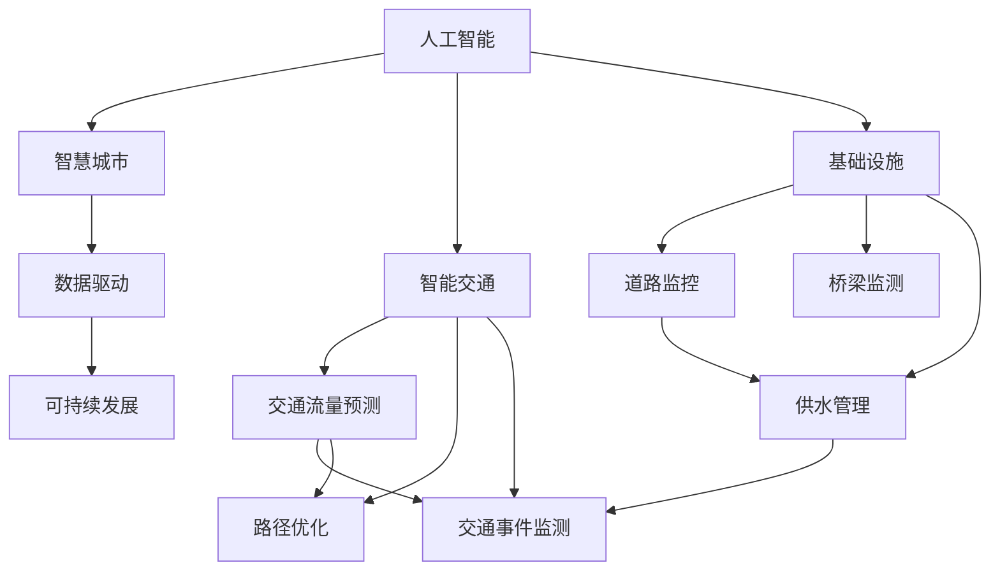

                 

# AI与人类计算：打造可持续发展的城市交通与基础设施

> 关键词：人工智能,智慧城市,智能交通,基础设施,数据驱动,可持续发展

## 1. 背景介绍

随着城市化进程的不断加快，如何打造高效、便捷、可持续发展的城市交通与基础设施成为了全球各大城市亟待解决的重要问题。作为新一代技术革命的重要组成部分，人工智能（AI）正在为解决这一问题提供强有力的支持。借助AI技术，城市交通与基础设施系统有望在智能管理、实时监控、精确决策等方面取得显著提升，从而实现更高质量的可持续发展。

## 2. 核心概念与联系

### 2.1 核心概念概述

为深入理解AI在城市交通与基础设施中的作用，本节将介绍几个核心概念及其相互联系：

- **人工智能（AI）**：一种模拟人类智能的机器学习技术，涵盖机器学习、深度学习、强化学习等方法。通过处理大量数据，AI可以自动学习任务模式，提供决策支持。

- **智慧城市**：利用AI、大数据、物联网等技术，实现城市各类资源高效管理和智能服务的城市发展模式。智慧城市涉及交通、能源、环境、公共服务等诸多领域。

- **智能交通**：运用AI技术优化交通系统，提升交通管理和控制水平。包括交通流量预测、路径优化、交通事件监测等功能。

- **基础设施**：城市运行的基础，包括道路、桥梁、供水、供电等，是支撑城市发展的重要组成部分。

- **数据驱动**：通过收集、分析各类交通和基础设施数据，实时监控城市运行状态，辅助决策。

- **可持续发展**：考虑环境保护、资源节约、社会公平等维度，推动城市长期稳定发展。

这些核心概念通过某种方式相互联系，构成了AI在城市交通与基础设施领域的整体框架。

### 2.2 核心概念原理和架构的 Mermaid 流程图



这个流程图展示了AI技术在城市交通与基础设施中的作用：

1. **人工智能**通过处理**数据驱动**中的各类交通和基础设施数据，辅助**智能交通**和**基础设施**的优化与管理。
2. **智能交通**中的**交通流量预测**、**路径优化**、**交通事件监测**等功能，通过AI技术实现更精确、实时的决策支持。
3. **基础设施**的**道路监控**、**桥梁监测**、**供水管理**等功能，也能通过AI技术实现智能监控与高效管理。
4. **可持续发展**与**数据驱动**紧密相关，通过分析数据，AI可以帮助实现资源的合理配置与环境保护。

## 3. 核心算法原理 & 具体操作步骤

### 3.1 算法原理概述

基于AI的智能交通与基础设施管理，其核心算法包括：

- **数据预处理与清洗**：通过清洗和规范化数据，确保数据质量，提高模型训练效果。
- **特征工程**：从原始数据中提取有意义的特征，提高模型的泛化能力和精度。
- **模型训练与评估**：选择合适的算法和模型，利用标注数据进行训练，评估模型性能。
- **实时预测与优化**：在实际应用中，实时输入新数据，预测未来交通流量或基础设施状态，进行优化决策。

### 3.2 算法步骤详解

#### 3.2.1 数据预处理与清洗

数据预处理与清洗是AI算法实现的基础。主要步骤如下：

1. **数据收集**：收集各类交通和基础设施数据，包括交通流量、事故记录、环境参数等。
2. **数据清洗**：删除或修正缺失值、异常值，保证数据的质量和完整性。
3. **数据标准化**：对数据进行归一化或标准化处理，便于算法模型训练。

#### 3.2.2 特征工程

特征工程是提升模型性能的关键步骤，主要包括以下内容：

1. **特征提取**：从原始数据中提取有意义的特征，如时间、天气、地理位置等。
2. **特征变换**：对提取的特征进行变换，如对时间特征进行周期性变换，生成时序数据。
3. **特征选择**：从提取的特征中筛选出对预测目标有影响的特征，减少冗余信息。

#### 3.2.3 模型训练与评估

模型训练与评估主要涉及以下步骤：

1. **选择合适的算法**：如决策树、随机森林、深度学习等。
2. **划分训练集与测试集**：将数据集分为训练集和测试集，以评估模型性能。
3. **模型训练**：利用训练集数据进行模型训练，调整模型参数。
4. **模型评估**：利用测试集数据评估模型性能，选取最优模型。

#### 3.2.4 实时预测与优化

在实际应用中，实时预测与优化是提升城市交通与基础设施管理效率的重要手段。主要步骤包括：

1. **实时数据输入**：将最新的交通流量、环境参数等数据输入模型。
2. **实时预测**：利用训练好的模型进行实时预测，输出未来交通流量或基础设施状态。
3. **优化决策**：根据预测结果，调整交通信号、供水系统等基础设施，实现优化决策。

### 3.3 算法优缺点

**优点：**

- **高效性**：AI算法可以快速处理大量数据，实时进行预测与优化，提高城市交通与基础设施管理效率。
- **精度高**：通过选择合适的算法和模型，AI可以提供高精度的预测结果，辅助决策。
- **适应性强**：AI算法可以适应不同环境下的数据变化，提升系统鲁棒性。

**缺点：**

- **数据依赖性高**：AI算法的性能很大程度上依赖于数据质量与数据量。数据偏差可能导致模型预测错误。
- **模型复杂度高**：高复杂度的模型需要大量计算资源，可能导致系统响应速度慢。
- **维护难度大**：AI模型需要定期维护与更新，以适应数据变化和性能要求。

### 3.4 算法应用领域

基于AI的智能交通与基础设施管理技术，已经在多个领域得到了广泛应用：

- **交通流量预测**：利用AI算法对交通流量进行预测，辅助交通信号灯优化，提高道路通行效率。
- **路径优化**：通过AI算法分析交通数据，推荐最优路径，减少交通拥堵。
- **交通事件监测**：利用AI算法实时监测交通事件，如事故、道路施工等，及时调整交通管理策略。
- **基础设施管理**：通过AI算法实时监测供水、供电等基础设施状态，及时预警和处理问题。
- **环境监测**：利用AI算法分析环境数据，实时监测空气质量、噪音等，辅助城市规划与管理。

这些应用领域展示了AI技术在城市交通与基础设施中的强大潜力。

## 4. 数学模型和公式 & 详细讲解 & 举例说明

### 4.1 数学模型构建

基于AI的智能交通与基础设施管理，通常涉及以下数学模型：

- **回归模型**：用于预测连续值，如交通流量、温度等。
- **分类模型**：用于预测离散值，如交通事件类型、道路状态等。
- **时序模型**：用于处理时间序列数据，如交通流量变化、气温变化等。

### 4.2 公式推导过程

以**回归模型**为例，常用的数学模型为线性回归模型：

$$
y = w_0 + w_1x_1 + w_2x_2 + ... + w_nx_n + \epsilon
$$

其中，$y$为预测值，$x_1, x_2, ..., x_n$为特征向量，$w_0, w_1, ..., w_n$为模型参数，$\epsilon$为误差项。

### 4.3 案例分析与讲解

假设我们要预测某一时刻的交通流量，可以收集该时刻的前n个时间点的交通流量数据，以及天气、节假日等特征，建立线性回归模型进行预测。具体步骤包括：

1. **数据收集**：收集交通流量数据和相应特征数据。
2. **特征提取**：提取时间、天气、节假日等特征。
3. **模型训练**：利用训练集数据，训练线性回归模型，得到最优参数$w_0, w_1, ..., w_n$。
4. **模型评估**：利用测试集数据评估模型性能，计算误差$\epsilon$。
5. **实时预测**：将当前时间点的特征数据输入模型，得到预测流量值$y$。

## 5. 项目实践：代码实例和详细解释说明

### 5.1 开发环境搭建

在进行AI项目实践前，我们需要准备好开发环境。以下是使用Python进行TensorFlow开发的环境配置流程：

1. 安装Anaconda：从官网下载并安装Anaconda，用于创建独立的Python环境。

2. 创建并激活虚拟环境：
```bash
conda create -n tensorflow-env python=3.8 
conda activate tensorflow-env
```

3. 安装TensorFlow：根据CUDA版本，从官网获取对应的安装命令。例如：
```bash
conda install tensorflow tensorflow-gpu==2.7 -c pytorch -c conda-forge
```

4. 安装各类工具包：
```bash
pip install numpy pandas scikit-learn matplotlib tensorflow-datasets
```

完成上述步骤后，即可在`tensorflow-env`环境中开始AI项目开发。

### 5.2 源代码详细实现

下面我们以交通流量预测为例，给出使用TensorFlow进行线性回归模型的PyTorch代码实现。

首先，定义模型和优化器：

```python
import tensorflow as tf

model = tf.keras.Sequential([
    tf.keras.layers.Dense(units=1, input_shape=(5,))
])

optimizer = tf.keras.optimizers.SGD(learning_rate=0.01)
```

接着，定义训练和评估函数：

```python
@tf.function
def train_step(inputs, targets):
    with tf.GradientTape() as tape:
        predictions = model(inputs)
        loss = tf.reduce_mean(tf.square(predictions - targets))
    gradients = tape.gradient(loss, model.trainable_variables)
    optimizer.apply_gradients(zip(gradients, model.trainable_variables))
    return loss

@tf.function
def evaluate(inputs, targets):
    predictions = model(inputs)
    loss = tf.reduce_mean(tf.square(predictions - targets))
    return loss
```

然后，启动训练流程并在测试集上评估：

```python
epochs = 100
batch_size = 32

for epoch in range(epochs):
    for (inputs, targets) in train_dataset:
        loss = train_step(inputs, targets)
        if (epoch+1) % 10 == 0:
            print(f'Epoch {epoch+1}, Loss: {loss.numpy():.4f}')

    test_loss = evaluate(test_inputs, test_targets)
    print(f'Test Loss: {test_loss.numpy():.4f}')
```

以上就是使用TensorFlow进行线性回归模型预测交通流量的完整代码实现。可以看到，借助TensorFlow的高效计算图和自动微分功能，模型训练和评估变得简单高效。

### 5.3 代码解读与分析

让我们再详细解读一下关键代码的实现细节：

**模型定义**：
- `Sequential`模型：通过逐层堆叠构建模型，适用于线性回归等简单模型。
- `Dense`层：全连接层，实现输入特征到输出预测值的映射。
- `input_shape`：输入数据的形状，这里我们输入5个特征。

**优化器选择**：
- `SGD`：随机梯度下降优化器，常用的线性回归模型优化器。

**训练函数`train_step`**：
- 使用`tf.GradientTape`记录梯度，计算损失函数并更新模型参数。
- 通过`apply_gradients`方法更新模型参数，`tf.square(predictions - targets)`计算预测值与真实值之间的平方误差，得到损失函数。

**评估函数`evaluate`**：
- 计算模型在测试集上的平均预测误差，`tf.reduce_mean`计算损失函数。

**训练流程**：
- 循环迭代，每个epoch训练数据集一次。
- 每10个epoch输出一次损失值，监控训练效果。
- 在全部epoch后，输出测试集上的平均预测误差，评估模型性能。

可以看到，TensorFlow的计算图和自动微分功能，使得模型训练和评估过程变得高效、简洁。开发者可以将更多精力放在模型选择和优化上，而不必过多关注底层的实现细节。

当然，工业级的系统实现还需考虑更多因素，如模型的保存和部署、超参数的自动搜索、更灵活的任务适配层等。但核心的模型训练和评估范式基本与此类似。

## 6. 实际应用场景

### 6.1 智慧城市

基于AI的智能交通与基础设施管理技术，可以广泛应用于智慧城市的构建。传统城市管理往往依赖人工调度和手动监控，难以高效应对复杂的城市运行状况。智慧城市通过AI技术，可以实现城市各类资源的智能化管理和优化。

在实际应用中，AI技术可以用于以下方面：

- **智能交通管理**：通过AI算法分析交通数据，实时调整交通信号灯、优化交通路径，提高道路通行效率，减少交通拥堵。
- **智能环境监测**：利用AI算法实时监测空气质量、噪音等环境参数，辅助城市规划与管理。
- **智能能源管理**：通过AI算法分析能源数据，实时调整供电、供水系统，优化资源配置。

智慧城市利用AI技术，可以实现高效、智能、可持续的城市管理模式，提升城市运行效率和居民生活质量。

### 6.2 智能交通

智能交通是AI在城市交通领域的重要应用之一，其核心在于通过AI技术优化交通系统，提升交通管理和控制水平。具体应用包括：

- **交通流量预测**：利用AI算法对交通流量进行预测，辅助交通信号灯优化，提高道路通行效率。
- **路径优化**：通过AI算法分析交通数据，推荐最优路径，减少交通拥堵。
- **交通事件监测**：利用AI算法实时监测交通事件，如事故、道路施工等，及时调整交通管理策略。

智能交通技术可以提高交通系统的智能化水平，提升交通安全性和效率。

### 6.3 基础设施管理

基础设施是城市运行的基础，AI技术可以在基础设施管理中发挥重要作用。具体应用包括：

- **道路监控**：利用AI算法实时监测道路状态，及时预警和处理问题。
- **桥梁监测**：通过AI算法分析桥梁数据，实时监测桥梁结构健康，预测维护需求。
- **供水管理**：利用AI算法分析供水数据，实时监测供水系统状态，优化供水管理。

基础设施管理通过AI技术，可以实现智能化、实时化的管理模式，提高城市运行效率和安全性。

### 6.4 未来应用展望

随着AI技术的发展，未来智能交通与基础设施管理将呈现以下几个发展趋势：

1. **智能运维**：通过AI算法实时监测基础设施状态，预测维护需求，提升基础设施运维效率。
2. **自动驾驶**：利用AI技术实现自动驾驶汽车，提高交通安全性和道路通行效率。
3. **环境感知**：通过AI算法实时监测环境参数，实现智能交通管理和城市规划。
4. **多模态融合**：将AI技术与物联网、传感器等技术融合，实现多模态数据协同管理。
5. **实时决策**：利用AI算法进行实时决策，优化交通流量、供水系统等，提高系统响应速度。

这些趋势将进一步推动城市交通与基础设施管理的智能化、高效化、可持续发展。

## 7. 工具和资源推荐

### 7.1 学习资源推荐

为了帮助开发者系统掌握AI在城市交通与基础设施中的应用，这里推荐一些优质的学习资源：

1. **《AI城市交通与基础设施》系列博文**：由AI专家撰写，深入浅出地介绍了AI在智慧城市、智能交通、基础设施等领域的应用。

2. **Stanford CS223N《AI for Everyone》课程**：斯坦福大学开设的AI入门课程，有Lecture视频和配套作业，带你快速掌握AI基本概念和应用。

3. **《AI in Smart Cities》书籍**：全面介绍了AI在智慧城市中的应用，涵盖智能交通、智能环境、智能能源等多个领域。

4. **OpenAI、TensorFlow、PyTorch等官方文档**：提供了海量预训练模型和完整的AI开发样例代码，是上手实践的必备资料。

5. **arXiv、IEEE Xplore等学术资源**：提供大量最新的AI相关论文，涵盖智能交通、基础设施管理等多个方向。

通过对这些资源的学习实践，相信你一定能够快速掌握AI在城市交通与基础设施中的应用，并用于解决实际的智能管理问题。

### 7.2 开发工具推荐

高效的开发离不开优秀的工具支持。以下是几款用于AI开发常用的工具：

1. **TensorFlow**：由Google主导开发的开源深度学习框架，生产部署方便，适合大规模工程应用。
2. **PyTorch**：基于Python的开源深度学习框架，灵活动态的计算图，适合快速迭代研究。
3. **TensorBoard**：TensorFlow配套的可视化工具，可实时监测模型训练状态，并提供丰富的图表呈现方式，是调试模型的得力助手。
4. **Weights & Biases**：模型训练的实验跟踪工具，可以记录和可视化模型训练过程中的各项指标，方便对比和调优。
5. **Jupyter Notebook**：交互式编程环境，便于分享学习笔记和代码。

合理利用这些工具，可以显著提升AI项目开发效率，加快创新迭代的步伐。

### 7.3 相关论文推荐

AI在城市交通与基础设施管理领域的研究源于学界的持续研究。以下是几篇奠基性的相关论文，推荐阅读：

1. **"Building Urban Traffic Management Systems with AI and Big Data"**：介绍基于AI和大数据的城市交通管理系统，涵盖了交通流量预测、路径优化等功能。
2. **"Intelligent Infrastructure Management using IoT and AI"**：介绍基于物联网和AI的城市基础设施管理系统，涵盖道路监控、桥梁监测等功能。
3. **"Deep Learning for Smart City Applications"**：全面介绍了深度学习在智慧城市中的应用，涵盖智能交通、智能环境、智能能源等多个领域。
4. **"Real-time Traffic Flow Prediction using LSTM Neural Networks"**：介绍基于LSTM神经网络的城市交通流量预测方法，展示了AI在交通管理中的应用。
5. **"Smart Infrastructure Maintenance using AI and Big Data"**：介绍基于AI和大数据的城市基础设施维护方法，展示了AI在基础设施管理中的应用。

这些论文代表了大数据、AI在城市交通与基础设施领域的发展脉络。通过学习这些前沿成果，可以帮助研究者把握学科前进方向，激发更多的创新灵感。

## 8. 总结：未来发展趋势与挑战

### 8.1 总结

本文对AI在城市交通与基础设施中的作用进行了全面系统的介绍。首先阐述了AI在智慧城市、智能交通、基础设施管理等领域的核心概念，明确了AI技术在提升城市智能化水平、提升交通效率、优化基础设施管理等方面的独特价值。其次，从原理到实践，详细讲解了AI技术的数学模型和核心算法，给出了AI项目开发的完整代码实例。同时，本文还广泛探讨了AI技术在智慧城市、智能交通、基础设施等诸多领域的应用前景，展示了AI技术的巨大潜力。

通过本文的系统梳理，可以看到，AI技术在城市交通与基础设施管理中的应用，正在开启新的发展阶段。随着AI技术的不断演进，城市交通与基础设施管理将实现更高水平的智能化、高效化、可持续发展。

### 8.2 未来发展趋势

展望未来，AI在城市交通与基础设施管理将呈现以下几个发展趋势：

1. **智能化水平提升**：AI技术将进一步提升城市交通与基础设施管理的智能化水平，实现更高质量的城市运行。
2. **数据驱动决策**：通过大量数据和AI算法，实现实时、智能、精确的决策支持。
3. **多模态融合**：将AI技术与物联网、传感器等技术融合，实现多模态数据协同管理。
4. **实时优化**：利用AI技术进行实时优化，提升交通流量、供水系统等资源配置效率。
5. **自动驾驶**：实现自动驾驶汽车，提高交通安全性和道路通行效率。

这些趋势将进一步推动城市交通与基础设施管理的智能化、高效化、可持续发展。

### 8.3 面临的挑战

尽管AI技术在城市交通与基础设施管理中取得了显著成效，但在迈向更加智能化、普适化应用的过程中，仍面临诸多挑战：

1. **数据质量与多样性**：数据质量与多样性直接影响AI模型的性能。如何获取高质量、多样化数据，是未来面临的重要挑战。
2. **模型复杂度**：高复杂度的AI模型需要大量计算资源，可能导致系统响应速度慢，如何优化模型结构，降低复杂度，是重要的优化方向。
3. **模型可解释性**：AI模型通常是"黑盒"系统，难以解释其内部工作机制和决策逻辑，如何提升模型的可解释性，是亟待解决的问题。
4. **安全性与隐私**：AI模型可能学习到有偏见、有害的信息，如何确保数据和模型的安全性，避免恶意用途，是重要的研究课题。

### 8.4 研究展望

面对AI在城市交通与基础设施管理所面临的挑战，未来的研究需要在以下几个方面寻求新的突破：

1. **数据增强与预处理**：通过数据增强和预处理技术，提升数据质量和多样性，改善AI模型性能。
2. **模型优化与压缩**：开发更加参数高效的AI模型，减少计算资源消耗，提升系统响应速度。
3. **模型解释性与可解释性**：研究可解释的AI模型，提高模型的可解释性和可解释性。
4. **数据隐私保护**：开发数据隐私保护技术，确保数据和模型的安全性。

这些研究方向的探索，将引领AI在城市交通与基础设施管理的不断发展，为构建安全、可靠、可解释、可控的智能系统铺平道路。面向未来，AI技术需要在数据质量、模型复杂度、可解释性、安全性等多个维度进行优化，方能实现更加智能化、高效化、可持续发展的城市交通与基础设施管理。

## 9. 附录：常见问题与解答

**Q1：AI在城市交通与基础设施管理中是否适用于所有领域？**

A: AI在城市交通与基础设施管理中的应用非常广泛，涵盖智能交通、智能环境、智能能源等多个领域。但对于一些特定领域，如医疗、军事等，AI技术的应用还存在一定的局限性。需要根据具体应用场景，选择合适的AI技术和方法。

**Q2：AI在城市交通与基础设施管理中是否需要大量标注数据？**

A: 部分AI应用需要大量标注数据，但许多应用可以通过无监督学习、半监督学习等方式，减少对标注数据的依赖。对于交通流量预测、路径优化等任务，可以通过历史数据进行训练，无需标注数据。

**Q3：AI在城市交通与基础设施管理中如何处理数据多样性？**

A: 数据多样性是AI应用的重要挑战之一。可以通过数据清洗、特征工程等手段，提升数据质量和多样性。例如，在交通流量预测中，可以收集不同类型的交通数据，如车辆数量、行人数量、自行车数量等，提高预测精度。

**Q4：AI在城市交通与基础设施管理中是否存在过拟合问题？**

A: 数据量和质量直接影响AI模型的泛化能力。在实际应用中，需要合理选择模型复杂度和训练策略，避免过拟合。例如，在交通流量预测中，可以通过数据增强、正则化等技术，减少过拟合风险。

**Q5：AI在城市交通与基础设施管理中如何确保数据安全性？**

A: 数据安全性是AI应用的重要保障。可以通过数据加密、访问控制等技术，确保数据的安全性。例如，在智能交通管理中，可以通过数据脱敏、匿名化等手段，保护用户隐私。

通过以上问题的解答，可以看到，AI技术在城市交通与基础设施管理中的应用前景广阔，但还需要在数据质量、模型复杂度、可解释性、安全性等多个维度进行优化，才能实现更加智能化、高效化、可持续发展的城市管理模式。

---

作者：禅与计算机程序设计艺术 / Zen and the Art of Computer Programming

