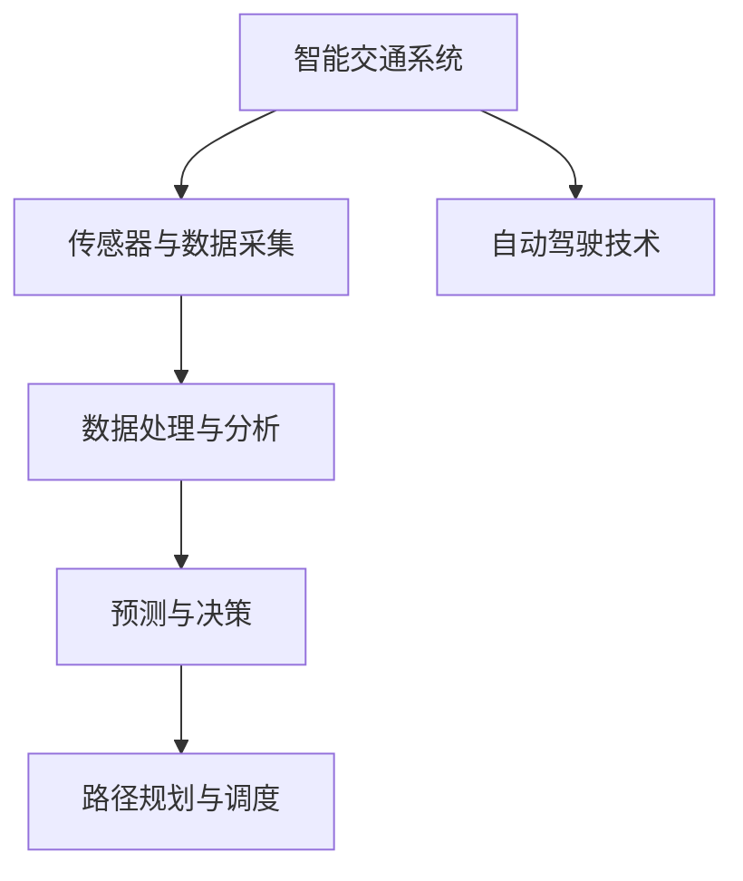

                 

# AI与人类计算：打造可持续发展的城市交通管理策略与规划

> 关键词：智能交通管理,城市规划,数据驱动,AI算法,自动驾驶,低碳交通

## 1. 背景介绍

### 1.1 问题由来

随着全球城市化进程的加速和人们生活水平的提升，城市交通问题愈发严峻，成为各大城市面临的共同挑战。交通拥堵、空气污染、能源浪费等现象，不仅影响着城市的可持续发展，也对居民的日常生活带来了诸多不便。为应对这些挑战，世界各地城市纷纷探索智能交通管理策略与规划，希望通过科技手段优化交通系统，实现绿色低碳、高效便捷的城市交通环境。

### 1.2 问题核心关键点

城市交通管理的核心在于数据驱动和AI算法结合，通过实时监控、数据分析、路径规划和调度优化，实现交通流的智能调控和资源高效利用。智能交通系统（ITS）正日益成为城市交通管理的关键技术手段，其核心要素包括：

- **传感器与数据采集**：通过摄像头、雷达、GPS等多种传感器，实时采集交通流量、速度、道路状态等信息。
- **数据处理与分析**：对采集的数据进行清洗、存储和分析，提取交通行为特征。
- **预测与决策**：利用机器学习算法对未来交通状态进行预测，辅助交通管理部门制定决策。
- **路径规划与调度**：基于预测结果，规划最优路径，优化信号灯和交通标志的控制策略。
- **自动驾驶技术**：利用AI算法，实现车辆的自主驾驶和路径规划，进一步提升交通效率。

### 1.3 问题研究意义

智能交通管理的有效实施，对于提升城市交通效率、改善空气质量、降低能源消耗具有重要意义。AI与人类计算的结合，不仅能够减少交通拥堵，降低事故率，提高道路通行效率，还能推动城市的绿色发展，实现可持续发展目标。通过智能交通管理，城市交通系统将变得更加智能化、高效化和人性化。

## 2. 核心概念与联系

### 2.1 核心概念概述

智能交通管理系统（ITS）的构建，离不开以下核心概念的支撑：

- **智能交通系统**：依托于AI和大数据技术，实现对城市交通流的实时监控和智能调控。
- **传感器与数据采集**：用于实时获取交通状态，是智能交通管理的基础。
- **数据处理与分析**：通过算法对海量数据进行深度分析，提取关键特征。
- **预测与决策**：利用AI算法预测未来交通状态，辅助决策。
- **路径规划与调度**：规划最优路径和调度策略，优化交通流量。
- **自动驾驶技术**：结合AI算法和车辆传感器，实现自动驾驶和路径规划。

这些概念之间的逻辑关系可以通过以下Mermaid流程图来展示：



这个流程图展示了这个系统的主要构成要素及其相互关系：

1. 智能交通系统通过传感器获取实时交通数据。
2. 数据经过处理和分析，提取关键特征。
3. 预测算法对未来交通状态进行预测，辅助决策。
4. 路径规划和调度优化交通流量。
5. 自动驾驶技术提高道路通行效率。

## 3. 核心算法原理 & 具体操作步骤
### 3.1 算法原理概述

智能交通管理的核心在于数据驱动与AI算法的深度融合，主要流程包括数据采集、处理与分析、预测与决策、路径规划与调度、自动驾驶技术等环节。其核心算法原理可概括为：

1. **数据采集与处理**：通过传感器实时获取交通数据，并利用算法进行清洗、归一化和特征提取。
2. **预测与决策**：基于历史数据和实时数据，利用机器学习算法进行交通流量预测，辅助决策者制定交通管理策略。
3. **路径规划与调度**：利用优化算法（如线性规划、遗传算法等）计算最优路径和信号灯控制策略。
4. **自动驾驶技术**：结合感知、决策、控制等算法，实现车辆自主驾驶和路径规划。

### 3.2 算法步骤详解

智能交通管理系统的一般步骤如下：

**Step 1: 数据采集**
- 部署各类传感器，如摄像头、雷达、GPS等，实现对道路交通流的实时监控。
- 传感器数据通过网关集中处理，经由云端进行存储和分析。

**Step 2: 数据处理与分析**
- 清洗数据，去除噪声和异常点，确保数据质量。
- 利用特征提取算法，提取交通流量、速度、事故等关键特征。
- 利用时间序列分析等方法，对交通数据进行建模。

**Step 3: 预测与决策**
- 利用历史数据和实时数据，训练预测模型，预测未来的交通状态。
- 基于预测结果，决策模型辅助交通管理部门制定优化策略。
- 根据交通状况，动态调整信号灯和交通标志的控制策略。

**Step 4: 路径规划与调度**
- 利用图论、优化算法（如Dijkstra算法、A*算法等），计算最优路径。
- 对交通流量进行实时监控和动态调度，确保道路通行效率。

**Step 5: 自动驾驶技术**
- 利用AI算法，实现车辆感知、决策和控制，进行自主驾驶。
- 结合高精度地图和实时交通数据，进行路径规划和避障。

### 3.3 算法优缺点

智能交通管理的核心算法具有以下优点：

- **高效精准**：通过实时数据和AI算法，能够快速响应交通状况变化，优化交通流。
- **资源利用**：通过路径规划和调度，提高道路通行效率，降低能源消耗。
- **安全可靠**：AI算法和自动驾驶技术，减少交通事故率，提升道路安全性。

同时，这些算法也存在一定的局限性：

- **高成本**：传感器部署和数据处理需要大量资金投入。
- **数据隐私**：大规模数据采集和存储可能涉及隐私问题，需要严格保护。
- **模型复杂度**：预测和决策模型过于复杂，可能存在误差，影响决策效果。

### 3.4 算法应用领域

智能交通管理技术广泛应用于城市交通、公路运输、物流配送等多个领域。其核心应用场景包括：

- **城市交通管理**：通过智能交通系统，实现对城市交通流的实时监控和智能调控。
- **公路运输**：通过路径规划和调度，提高高速公路通行效率，减少交通事故。
- **物流配送**：利用自动驾驶技术和路径规划，实现无人驾驶物流配送。

## 4. 数学模型和公式 & 详细讲解 & 举例说明

### 4.1 数学模型构建

智能交通管理系统的数学模型构建，主要围绕数据处理与分析、预测与决策、路径规划与调度等环节展开。

**数据处理与分析模型**：
- 时间序列分析模型，用于对交通数据进行建模和预测。
- 特征提取模型，用于从原始数据中提取关键特征。

**预测与决策模型**：
- 线性回归模型，用于预测未来交通流量。
- 决策树模型，用于根据预测结果辅助制定决策策略。

**路径规划与调度模型**：
- 最短路径算法，如Dijkstra算法、A*算法等，用于计算最优路径。
- 动态调度模型，用于实时调整交通信号灯和交通标志。

### 4.2 公式推导过程

以线性回归模型为例，其推导过程如下：

设$y_i$为第$i$个时间点的交通流量，$x_{ij}$为影响该时间点交通流量的第$j$个特征值，$\beta_j$为第$j$个特征的系数。假设交通流量$y_i$与特征$x_{ij}$之间存在线性关系，即：

$$y_i = \beta_0 + \sum_{j=1}^{n}\beta_j x_{ij} + \epsilon_i$$

其中$\epsilon_i$为误差项，$\beta_0,\beta_j$为待估计参数。利用最小二乘法求解$\beta_j$，得到：

$$\hat{\beta} = (X^TX)^{-1}X^Ty$$

其中$X=[x_{i1},x_{i2},...,x_{in}]$为特征矩阵，$y=[y_1,y_2,...,y_n]$为交通流量向量。

### 4.3 案例分析与讲解

以北京道路交通流量预测为例，分析智能交通管理系统的实际应用。

**数据采集**：
- 部署摄像头和传感器，采集各交叉口交通流量数据。
- 通过云端存储和分析，实时监控交通状况。

**数据处理与分析**：
- 对采集数据进行清洗和去噪，确保数据质量。
- 利用时间序列分析模型，对交通流量进行建模和预测。

**预测与决策**：
- 基于历史数据和实时数据，训练线性回归模型，预测未来交通流量。
- 决策模型根据预测结果，动态调整信号灯和交通标志的控制策略。

**路径规划与调度**：
- 利用A*算法计算最优路径，优化交通流量。
- 实时监控交通状况，动态调整信号灯和交通标志的控制策略。

**自动驾驶技术**：
- 利用高精度地图和实时交通数据，进行车辆自主驾驶和路径规划。

## 5. 项目实践：代码实例和详细解释说明

### 5.1 开发环境搭建

在进行智能交通管理系统开发前，需要准备好开发环境。以下是使用Python进行智能交通管理系统开发的Python环境和工具配置流程：

1. 安装Anaconda：从官网下载并安装Anaconda，用于创建独立的Python环境。
2. 创建并激活虚拟环境：
```bash
conda create -n its_env python=3.8 
conda activate its_env
```
3. 安装Python和依赖包：
```bash
pip install pandas numpy scikit-learn matplotlib seaborn plotly
```
4. 安装相关库：
```bash
pip install pydot graph-tool networkx
```

完成上述步骤后，即可在`its_env`环境中开始智能交通管理系统的开发。

### 5.2 源代码详细实现

下面以智能交通系统中的路径规划模块为例，给出使用Python和NetworkX库实现Dijkstra算法的代码实现。

```python
import networkx as nx
import math

# 定义图结构
G = nx.DiGraph()
G.add_edge(0, 1, weight=3)
G.add_edge(0, 2, weight=2)
G.add_edge(1, 3, weight=5)
G.add_edge(1, 4, weight=1)
G.add_edge(2, 4, weight=4)
G.add_edge(3, 5, weight=6)
G.add_edge(4, 5, weight=2)

# 定义Dijkstra算法
def dijkstra(graph, start):
    distances = {node: math.inf for node in graph.nodes()}
    distances[start] = 0
    queue = list(graph.nodes())
    while queue:
        current_node = min(queue, key=lambda node: distances[node])
        queue.remove(current_node)
        for neighbor in graph.neighbors(current_node):
            distance = distances[current_node] + graph[current_node][neighbor]['weight']
            if distance < distances[neighbor]:
                distances[neighbor] = distance
    return distances

# 计算路径
def calculate_path(graph, start, end):
    path = []
    visited = set([start])
    while len(visited) < len(graph):
        if end in visited:
            break
        visited.add(start)
        for neighbor in graph[start]:
            if neighbor in visited:
                continue
            if distances[start][neighbor] != math.inf:
                path.append((start, neighbor))
                start = neighbor
    return path

# 计算最短路径
distances = dijkstra(G, 0)
path = calculate_path(G, 0, 5)
print(distances)
print(path)
```

### 5.3 代码解读与分析

让我们再详细解读一下关键代码的实现细节：

**G的定义**：
- `nx.DiGraph()`用于定义无向图结构，`add_edge()`方法用于添加边及其权重。
- 在实际应用中，可以通过API获取实时交通数据，并利用图论算法计算最优路径。

**Dijkstra算法实现**：
- `distances`字典用于记录每个节点到起点的距离，初始化为无穷大。
- `queue`用于存储待处理节点。
- 在每次循环中，选择距离起点最近的节点进行处理，并更新邻居节点的距离。

**路径计算**：
- `calculate_path()`函数用于计算起点到终点的路径。
- 通过记录每个节点的前驱节点，可以逆向推导出最优路径。

**运行结果展示**：
- 代码执行后，输出起点到终点的最短路径和每个节点的最短距离。

通过上述代码实现，展示了智能交通系统中路径规划模块的算法实现。开发者可以在此基础上进一步扩展，实现完整的智能交通管理系统。

## 6. 实际应用场景

### 6.1 智能交通管理

智能交通管理系统在大规模城市交通管理中具有重要应用。通过实时监控和智能调控，可以有效缓解交通拥堵，减少交通事故，提升道路通行效率。

具体应用场景包括：
- **交通流量监控**：利用摄像头和传感器，实时监控各交叉口交通流量，辅助决策。
- **信号灯控制**：根据实时交通数据，动态调整信号灯和交通标志的控制策略，优化交通流量。
- **路径规划**：利用Dijkstra等算法，计算最优路径，提高道路通行效率。

### 6.2 物流配送

智能交通管理技术在物流配送领域也具有广泛应用。通过路径规划和自动驾驶技术，可以实现无人驾驶物流配送，大幅提高配送效率和安全性。

具体应用场景包括：
- **路径规划**：利用智能算法，计算最优路径，减少配送时间。
- **自动驾驶**：结合AI算法和传感器技术，实现无人驾驶物流配送，减少人力成本。
- **配送调度**：实时监控配送车辆位置，动态调整配送计划，提高配送效率。

### 6.3 智慧城市

智能交通管理系统作为智慧城市的重要组成部分，能够提升城市的智能化水平，实现绿色低碳、高效便捷的城市交通环境。

具体应用场景包括：
- **智慧道路**：利用传感器和AI技术，实现对道路交通流的实时监控和智能调控。
- **智慧停车**：利用智能算法，优化停车位分配，减少停车拥堵。
- **智能交通标识**：利用数字标识，实时更新交通信号灯和交通标志，提升道路通行效率。

### 6.4 未来应用展望

随着智能交通管理技术的不断演进，其在城市交通、物流配送、智慧城市等领域的应用前景将更加广阔。未来，智能交通管理系统将更加智能化、高效化和人性化。

**未来技术发展方向**：
1. **多源数据融合**：结合多源数据（如气象数据、公共事件数据等），实现对交通流的全面监控和预测。
2. **实时计算与决策**：利用边缘计算技术，实现实时数据处理与决策，降低延迟。
3. **自动驾驶与协同管理**：结合自动驾驶技术和协同管理算法，实现车辆的自主驾驶与路网协同管理。
4. **AI辅助设计**：利用AI技术，优化城市道路规划和交通设施设计，提升交通系统的智能化水平。
5. **人机交互界面**：结合自然语言处理和语音识别技术，实现人机交互界面，提升用户体验。

## 7. 工具和资源推荐

### 7.1 学习资源推荐

为帮助开发者系统掌握智能交通管理系统的理论基础和实践技巧，这里推荐一些优质的学习资源：

1. **《智能交通系统基础》系列博文**：由智能交通领域专家撰写，深入浅出地介绍了智能交通系统的基本概念和核心技术。
2. **《智能交通管理与控制》课程**：由清华大学开设的在线课程，涵盖智能交通管理的基础理论和应用案例。
3. **《智能交通管理技术》书籍**：详细介绍了智能交通管理系统的主要技术，包括数据采集、处理与分析、预测与决策、路径规划与调度等。
4. **《网络x库官方文档》**：网络x库的官方文档，提供了丰富的API和示例代码，是进行智能交通系统开发的必备资料。
5. **《Python智能交通系统》书籍**：介绍了使用Python进行智能交通管理系统开发的实践方法，涵盖数据处理、算法实现、系统部署等环节。

通过对这些资源的学习实践，相信你一定能够快速掌握智能交通管理系统的精髓，并用于解决实际的交通问题。

### 7.2 开发工具推荐

高效的开发离不开优秀的工具支持。以下是几款用于智能交通管理系统开发的常用工具：

1. **Jupyter Notebook**：用于数据处理和算法实现的交互式开发环境。
2. **TensorFlow**：深度学习框架，适用于智能交通系统中的预测与决策模块。
3. **OpenStreetMap**：开源地图数据，用于构建高精度地图和路径规划。
4. **Gephi**：网络可视化工具，用于展示智能交通系统中的路网结构和数据分布。
5. **TrafficSim**：交通模拟软件，用于仿真测试智能交通管理系统的性能。

合理利用这些工具，可以显著提升智能交通管理系统的开发效率，加快创新迭代的步伐。

### 7.3 相关论文推荐

智能交通管理系统的研究领域十分广泛，涉及交通工程、计算机科学、数据科学等多个学科。以下是几篇具有代表性的相关论文，推荐阅读：

1. **《城市交通拥堵的智能管理》**：介绍了基于智能交通管理系统，缓解城市交通拥堵的方法。
2. **《基于深度学习的城市交通流量预测》**：利用深度学习算法，对城市交通流量进行预测和优化。
3. **《智能交通系统中的路径规划与调度》**：详细介绍了智能交通系统中的路径规划和调度算法。
4. **《智能交通系统中的自动驾驶技术》**：介绍了自动驾驶技术在智能交通系统中的应用和挑战。
5. **《智能交通系统的未来展望》**：总结了智能交通系统的发展趋势和未来方向。

这些论文代表了大规模城市交通管理技术的最新进展。通过学习这些前沿成果，可以帮助研究者把握学科前进方向，激发更多的创新灵感。

## 8. 总结：未来发展趋势与挑战

### 8.1 总结

本文对智能交通管理系统的原理与实践进行了全面系统的介绍。首先阐述了智能交通管理系统的研究背景和意义，明确了数据驱动与AI算法结合的核心价值。其次，从原理到实践，详细讲解了智能交通管理系统的数学模型、算法步骤和实际应用，给出了智能交通管理系统的完整代码实例。同时，本文还探讨了智能交通管理系统在城市交通、物流配送、智慧城市等领域的实际应用，展示了其广阔的前景。此外，本文精选了智能交通管理系统的各类学习资源，力求为读者提供全方位的技术指引。

通过本文的系统梳理，可以看到，智能交通管理系统正在成为城市交通管理的关键技术手段，极大地提升了城市交通效率和安全性。AI与人类计算的结合，不仅能够减少交通拥堵，降低事故率，提高道路通行效率，还能推动城市的绿色发展，实现可持续发展目标。未来，伴随智能交通管理技术的持续演进，城市交通系统将变得更加智能化、高效化和人性化。

### 8.2 未来发展趋势

展望未来，智能交通管理系统将呈现以下几个发展趋势：

1. **智能化水平提升**：随着AI技术的不断发展，智能交通管理系统的智能化水平将进一步提升，实现更精准的流量预测和更优化的路径规划。
2. **数据融合与实时计算**：结合多源数据（如气象数据、公共事件数据等），实现对交通流的全面监控和实时计算。
3. **人机协同管理**：结合人机交互界面，实现更加人性化的智能交通管理。
4. **自动驾驶与协同管理**：结合自动驾驶技术和协同管理算法，实现车辆的自主驾驶与路网协同管理。
5. **绿色低碳交通**：推广电动汽车、共享单车等绿色低碳交通方式，提升交通系统的环保性。
6. **数据安全与隐私保护**：加强数据安全与隐私保护，确保交通数据的安全性和用户的隐私权益。

以上趋势凸显了智能交通管理系统的发展前景，为构建更加智能化、高效化、绿色化的交通环境奠定了基础。

### 8.3 面临的挑战

尽管智能交通管理系统已经取得了显著成果，但在迈向更加智能化、普适化应用的过程中，仍面临诸多挑战：

1. **数据采集与处理**：大规模数据采集和处理需要高成本、高技术门槛，仍需进一步优化。
2. **算法复杂度**：预测与决策算法过于复杂，可能存在误差，影响决策效果。
3. **技术标准**：智能交通系统涉及多部门多领域，技术标准和接口规范不统一，增加了系统集成的难度。
4. **数据安全与隐私**：交通数据涉及敏感信息，数据安全与隐私保护成为重要挑战。
5. **技术兼容性**：不同厂商的智能交通系统兼容性问题，可能导致系统集成困难。

### 8.4 研究展望

面对智能交通管理系统面临的挑战，未来的研究需要在以下几个方面寻求新的突破：

1. **数据采集与处理优化**：结合边缘计算技术，优化数据采集与处理流程，降低成本，提高效率。
2. **算法优化**：进一步简化预测与决策算法，降低计算复杂度，提高模型精度。
3. **技术标准化**：制定统一的技术标准和接口规范，促进不同厂商智能交通系统的协同工作。
4. **数据安全与隐私保护**：加强数据加密和匿名化处理，确保数据安全与隐私保护。
5. **技术兼容性提升**：开发兼容性更高的智能交通系统，促进系统集成和应用推广。

这些研究方向的探索，必将引领智能交通管理技术迈向更高的台阶，为构建安全、可靠、高效、绿色、智能的城市交通系统铺平道路。面向未来，智能交通管理系统需要持续创新，不断提高其智能化水平，才能更好地服务社会，实现可持续发展目标。

## 9. 附录：常见问题与解答

**Q1: 智能交通管理系统如何实现数据采集与处理？**

A: 智能交通管理系统通过传感器实时采集交通数据，利用数据处理算法清洗和归一化数据，提取关键特征，构建时间序列分析模型。

**Q2: 如何提升智能交通管理系统的预测与决策精度？**

A: 可以通过增加历史数据量、优化模型参数、引入外部知识等方法提升预测与决策精度。例如，结合天气数据、交通事件数据进行联合预测。

**Q3: 智能交通管理系统的路径规划模块主要有哪些算法？**

A: 路径规划模块主要采用图论算法，如Dijkstra算法、A*算法等，用于计算最优路径。

**Q4: 智能交通管理系统的实际应用有哪些？**

A: 智能交通管理系统在大规模城市交通管理、物流配送、智慧城市等领域具有广泛应用。

**Q5: 智能交通管理系统面临哪些技术挑战？**

A: 智能交通管理系统面临数据采集与处理成本高、算法复杂度大、技术标准不统一、数据安全与隐私保护、技术兼容性等挑战。

通过本文的系统梳理，可以看到，智能交通管理系统正在成为城市交通管理的关键技术手段，极大地提升了城市交通效率和安全性。AI与人类计算的结合，不仅能够减少交通拥堵，降低事故率，提高道路通行效率，还能推动城市的绿色发展，实现可持续发展目标。未来，伴随智能交通管理技术的持续演进，城市交通系统将变得更加智能化、高效化、绿色化。

