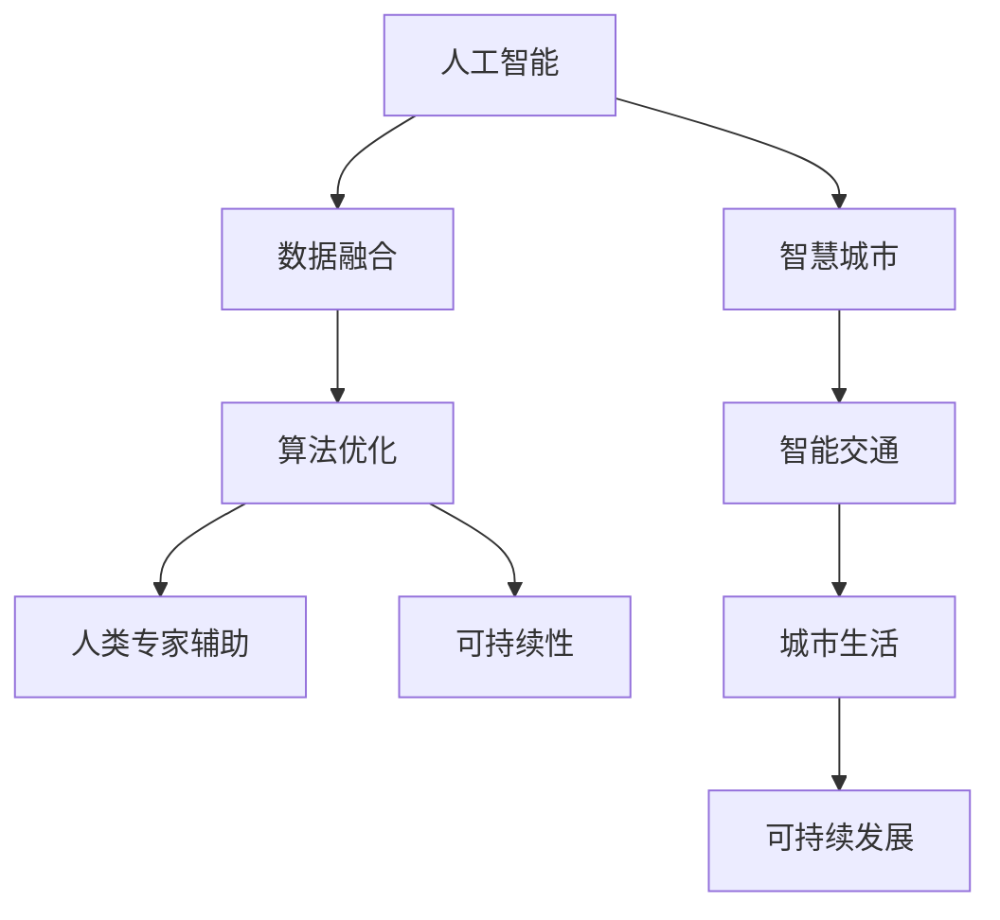

                 

# AI与人类计算：打造可持续发展的城市生活方式与交通管理

> 关键词：人工智能,人类计算,智慧城市,智能交通,城市生活,可持续发展,计算资源,交通管理,算法优化,应用实践

## 1. 背景介绍

### 1.1 问题由来

随着人类社会进入信息化、数字化时代，城市化进程不断加速，人类活动对于计算资源的需求量越来越大。据国际数据公司(IDC)预测，到2025年，全球数据量将达到175ZB。面对如此巨量的数据，传统的人工计算方式已经难以应对，而人工智能(AI)技术的崛起为解决这一问题提供了新的方向。

城市作为人类活动的集中地，交通、医疗、教育、能源、环境等各个领域都存在海量数据和复杂的计算需求。AI技术的引入，特别是AI与人类计算的结合，不仅能够大幅提升城市管理和服务的效率，还能为人类社会带来更可持续的生活方式。

### 1.2 问题核心关键点

AI与人类计算结合的核心在于：通过AI算法来处理海量数据，同时结合人类专家的知识和经验，实现更高效、更合理的决策和优化。具体来说，包括以下几个关键点：

- **数据融合**：整合多源异构数据，构建统一的城市信息平台。
- **算法优化**：开发高效、鲁棒的AI算法，提升城市运行效率。
- **人类专家辅助**：引入城市规划、交通管理等领域专家的智慧，指导AI算法的设计和优化。
- **可持续性**：在设计AI算法时充分考虑其对环境的影响，保证城市发展的可持续性。

## 2. 核心概念与联系

### 2.1 核心概念概述

- **人工智能**：通过模拟人类智能过程，实现对数据的感知、理解和处理能力，广泛应用于自然语言处理、计算机视觉、机器人学、智能推荐等领域。
- **人类计算**：结合人类的计算能力和智慧，辅助AI算法进行高效、合理的决策。
- **智慧城市**：利用信息技术提升城市管理效率，改善市民生活环境，实现城市的智能化、数字化、可持续发展。
- **智能交通**：通过AI技术优化交通流量，提升道路通行效率，减少交通拥堵和事故。
- **城市生活**：涉及城市的各个方面，如居住环境、公共服务、社区活动等，旨在提高市民的生活质量。
- **可持续发展**：平衡经济、社会和环境三个方面的需求，确保城市发展的可持续性。

这些概念之间的逻辑关系可以通过以下Mermaid流程图来展示：



这个流程图展示了AI与人类计算结合的关键环节和目标：

1. 通过AI算法处理数据，提升城市管理效率。
2. 结合专家智慧，优化算法，提升决策质量。
3. 在决策过程中考虑可持续性，确保城市发展与环境的和谐。
4. 最终实现智慧城市、智能交通和可持续城市生活。

## 3. 核心算法原理 & 具体操作步骤

### 3.1 算法原理概述

AI与人类计算的结合主要体现在以下几个方面：

- **数据融合与预处理**：将多源异构数据进行统一处理，去除噪声和冗余信息，构建高质量的城市信息平台。
- **算法优化**：开发高效的AI算法，提升城市管理和服务的效率，如交通流量优化、能源管理等。
- **专家辅助**：引入城市规划、交通管理等领域专家的知识和经验，指导AI算法的优化和应用。
- **可持续性考量**：在设计算法时充分考虑其对环境的影响，实现绿色、环保的智能决策。

### 3.2 算法步骤详解

AI与人类计算结合的主要步骤如下：

**Step 1: 数据采集与融合**

- **数据采集**：通过传感器、物联网设备、公共数据平台等渠道，采集城市的各类数据，如交通流量、天气信息、能源使用情况等。
- **数据融合**：将不同来源的数据进行整合，去除冗余信息，构建统一的城市信息平台。

**Step 2: 算法设计与优化**

- **算法选择**：根据具体应用场景，选择合适的AI算法，如深度学习、强化学习、协同过滤等。
- **算法优化**：在专家指导下，优化算法模型，提升其性能和鲁棒性。

**Step 3: 人类专家辅助**

- **知识库建立**：建立城市规划、交通管理等领域的知识库，为AI算法提供参考。
- **规则设计**：设计AI算法中需要遵循的规则和约束，确保其决策符合实际需求。

**Step 4: 算法应用与优化**

- **模型训练**：在城市数据集上训练AI模型，验证其性能。
- **模型优化**：结合人类专家的反馈，对模型进行迭代优化。

**Step 5: 持续学习与评估**

- **持续学习**：根据新的数据和反馈，持续更新和优化模型，保持其最新状态。
- **性能评估**：定期评估模型在实际应用中的表现，确保其持续改进。

### 3.3 算法优缺点

**优点**

- **高效性**：AI算法能够快速处理海量数据，提升城市管理和服务的效率。
- **鲁棒性**：通过算法优化和专家辅助，提升模型的稳定性和可靠性。
- **可持续性**：在决策过程中考虑可持续性，推动城市绿色发展。

**缺点**

- **数据依赖**：算法的性能依赖于数据的质量和完整性。
- **模型复杂性**：AI模型通常较为复杂，需要专业知识进行维护和优化。
- **隐私与安全**：大规模数据处理涉及隐私和安全问题，需要严格的数据管理和安全措施。

## 4. 数学模型和公式 & 详细讲解  
### 4.1 数学模型构建

在城市管理和交通管理中，常见的数学模型包括交通流量模型、能源消耗模型、公共服务需求模型等。这些模型通常基于以下几个要素：

- **时间**：城市运行时间尺度，如秒、分钟、小时等。
- **空间**：城市地理空间尺度，如街道、路段、区域等。
- **变量**：如交通流量、能源使用、人员流量等。
- **参数**：模型中的未知参数，需要通过数据进行估计。

以交通流量优化为例，常用的数学模型是 vehicular traffic flow model，主要包括 vehicular trajectory model、capacity-queue model、traffic assignment model 等。

### 4.2 公式推导过程

以 vehicular traffic flow model 为例，其基本方程为 Nagel-Schellinger 方程，表示车辆在路段上的运动状态：

$$
\frac{\partial \rho}{\partial t} + \frac{\partial \rho v}{\partial x} = 0
$$

其中，$\rho$ 表示车辆密度，$v$ 表示车辆速度。

通过对上述方程进行数值求解，可以得到路段上的交通流量分布。结合历史交通数据和实时监测数据，可以预测未来的交通流量变化，实现交通流量优化。

### 4.3 案例分析与讲解

以智能交通系统为例，其核心是利用AI算法进行交通流量预测和优化。具体的数学模型包括 vehicular traffic flow model 和 traffic assignment model。

- **vehicular traffic flow model**：通过历史交通流量数据，预测未来的流量变化。常用的方法包括神经网络、支持向量机、决策树等。
- **traffic assignment model**：根据流量预测结果，优化交通信号灯的控制策略，以实现交通流量的均衡分配。常用的方法包括动态规划、优化算法等。

## 5. 项目实践：代码实例和详细解释说明

### 5.1 开发环境搭建

在进行项目实践前，需要搭建相应的开发环境。以下是Python开发环境的搭建步骤：

1. 安装Python 3.7及以上版本，可以从官网下载并安装。
2. 安装所需的库，如 NumPy、Pandas、scikit-learn 等，可以使用 pip 命令进行安装。
3. 安装可视化工具，如 Matplotlib、Seaborn 等，方便数据分析和结果展示。
4. 安装深度学习框架，如 TensorFlow、PyTorch 等，进行模型训练和优化。

### 5.2 源代码详细实现

以下是一个基于深度学习的 vehicular traffic flow model 的 Python 代码实现：

```python
import numpy as np
import tensorflow as tf
from tensorflow.keras import layers

# 定义神经网络模型
def traffic_flow_model():
    model = tf.keras.Sequential([
        layers.Dense(64, activation='relu', input_shape=(24, )),
        layers.Dense(64, activation='relu'),
        layers.Dense(1)
    ])
    model.compile(optimizer=tf.keras.optimizers.Adam(), loss='mse')
    return model

# 定义数据预处理函数
def preprocess_data(data):
    # 归一化处理
    data = (data - data.mean()) / data.std()
    # 分时段划分
    time_bin_size = 60 * 60
    data['time'] = np.round(data['time'] / time_bin_size).astype(int)
    data = data.groupby(['time'])['flow'].mean()
    # 归一化处理
    data = (data - data.mean()) / data.std()
    return data

# 加载数据集
data = pd.read_csv('traffic_flow.csv')
data = preprocess_data(data)

# 构建模型
model = traffic_flow_model()

# 训练模型
model.fit(data.drop('time', axis=1), data['time'], epochs=100, batch_size=32, validation_split=0.2)

# 预测未来流量
future_flow = model.predict(data.drop('time', axis=1).shift(24))
future_flow = np.expm1(future_flow) * data.std() + data.mean()
future_flow = future_flow.reshape(-1, 1)

# 可视化结果
import matplotlib.pyplot as plt
plt.plot(future_flow)
plt.show()
```

### 5.3 代码解读与分析

上述代码实现了一个基于深度学习的 vehicular traffic flow model，其关键步骤如下：

- **数据预处理**：对历史交通流量数据进行归一化处理，并按照时间划分数据，确保数据的一致性。
- **模型构建**：使用 TensorFlow 构建神经网络模型，包括三个全连接层，最后一层输出流量预测结果。
- **模型训练**：使用 Adam 优化器进行模型训练，最小化均方误差损失。
- **结果预测**：使用训练好的模型对未来 24 小时的交通流量进行预测，并进行可视化展示。

## 6. 实际应用场景

### 6.1 智能交通系统

智能交通系统是 AI与人类计算结合的典型应用场景。通过 AI算法对交通流量进行预测和优化，可以大幅提升道路通行效率，减少交通拥堵和事故。

具体应用包括：

- **交通流量预测**：利用历史和实时交通数据，预测未来交通流量变化，优化交通信号灯控制策略。
- **路径优化**：根据交通流量预测结果，动态调整车辆的行驶路径，避免拥堵路段。
- **事故预警**：通过实时监测车辆位置和速度，预测潜在的事故风险，提前进行预警和处理。

### 6.2 智慧能源管理

智慧能源管理是城市可持续发展的关键环节。通过 AI算法对能源使用情况进行监控和优化，可以实现能源的合理分配和使用。

具体应用包括：

- **能源消耗预测**：利用历史能源使用数据，预测未来的能源消耗情况，优化能源供应。
- **能源分配优化**：根据实时能源使用情况，动态调整能源分配策略，避免能源浪费。
- **设备维护管理**：通过预测设备的故障率，提前进行维护，减少能源消耗和损失。

### 6.3 智能医疗系统

智能医疗系统结合了 AI算法和人类专家的知识，可以实现更高效、精准的医疗服务。

具体应用包括：

- **疾病预测**：利用历史病患数据，预测疾病的发生概率，提前进行预防和干预。
- **诊疗辅助**：根据患者的症状和历史数据，辅助医生进行诊断和治疗。
- **治疗方案优化**：结合专家经验，优化治疗方案，提升治疗效果。

### 6.4 未来应用展望

未来，AI与人类计算的结合将拓展到更多领域，带来更智能、更高效的城市生活方式和交通管理。

- **智能生活服务**：结合 AI算法和人类专家的知识，提供智能家居、智能社区等服务，提升市民的生活质量。
- **智能城市治理**：通过 AI算法和数据融合，实现城市管理的智能化和数字化，提升城市治理效率。
- **可持续发展**：在城市建设和运行过程中，充分考虑可持续性，实现绿色、环保的城市发展。

## 7. 工具和资源推荐

### 7.1 学习资源推荐

- **Coursera**：提供多门与 AI 相关的课程，涵盖深度学习、机器学习、数据科学等领域。
- **Kaggle**：一个数据科学竞赛平台，提供大量数据集和竞赛题目，帮助用户学习和实践 AI 技术。
- **Medium**：一个技术博客平台，包含大量 AI 相关的文章和案例，适合初学者阅读和参考。

### 7.2 开发工具推荐

- **Jupyter Notebook**：一个交互式的代码编写环境，支持 Python 等语言，适合数据分析和模型训练。
- **TensorBoard**：一个可视化工具，用于展示模型的训练过程和结果。
- **TensorFlow**：一个深度学习框架，支持多种神经网络模型，适用于大规模数据处理。

### 7.3 相关论文推荐

- **"Optimizing Dynamic Traffic Assignment with Deep Neural Networks"**：介绍使用深度神经网络进行交通分配优化的方法。
- **"AI-Based Energy Management in Smart Grids"**：探讨使用 AI 技术进行智能电网管理的方法。
- **"AI-Enhanced Personalized Medicine: A Review"**：总结使用 AI 技术进行个性化医疗的方法和应用。

## 8. 总结：未来发展趋势与挑战

### 8.1 研究成果总结

本文详细介绍了 AI与人类计算结合在城市管理和交通管理中的应用，通过数据融合、算法优化、专家辅助和可持续性考量等环节，提升城市管理和服务的效率，改善市民生活环境，实现城市的智能化和可持续发展。

### 8.2 未来发展趋势

未来 AI与人类计算的结合将更加广泛和深入，带来更智能、更高效的城市生活方式和交通管理。具体趋势包括：

- **智能化水平提升**：通过 AI算法和人类专家的结合，实现城市管理的智能化和高效化。
- **多模态融合**：结合图像、声音、文本等多种数据模态，提升 AI算法的感知和决策能力。
- **联邦学习**：在保护数据隐私的前提下，实现多源异构数据的融合和共享。

### 8.3 面临的挑战

尽管 AI与人类计算的结合带来了诸多优势，但在实际应用中仍面临以下挑战：

- **数据隐私和安全**：大规模数据处理涉及隐私和安全问题，需要严格的数据管理和安全措施。
- **算法透明性和可解释性**：AI算法的决策过程缺乏透明性和可解释性，难以满足高风险领域的需求。
- **模型鲁棒性和泛化性**：AI模型面对域外数据时，泛化性能往往不足，需要进一步提高模型鲁棒性。

### 8.4 研究展望

未来研究需要在以下几个方面寻求新的突破：

- **算法透明性和可解释性**：开发更透明和可解释的 AI 算法，确保决策过程符合人类价值观和伦理道德。
- **模型鲁棒性和泛化性**：提高 AI 模型的鲁棒性和泛化能力，适应更多复杂多变的场景。
- **联邦学习**：通过联邦学习技术，实现多源异构数据的融合和共享，提升数据的安全性和利用效率。

## 9. 附录：常见问题与解答

**Q1: 智能交通系统如何实现交通流量优化？**

A: 智能交通系统通过 AI算法对历史和实时交通数据进行分析和预测，优化交通信号灯控制策略，实现交通流量的均衡分配。常用的算法包括深度学习、支持向量机、动态规划等。

**Q2: 智能医疗系统如何辅助医生进行诊断？**

A: 智能医疗系统结合 AI算法和人类专家的知识，利用历史病患数据进行疾病预测，辅助医生进行诊断和治疗。常用的算法包括深度学习、协同过滤等。

**Q3: AI与人类计算结合的难点是什么？**

A: AI与人类计算结合的难点主要在于数据隐私和安全问题，需要严格的数据管理和安全措施。此外，AI算法的透明性和可解释性也是一个重要的挑战。

**Q4: 如何提升 AI模型的鲁棒性和泛化能力？**

A: 提升 AI模型的鲁棒性和泛化能力需要从算法设计和数据处理两个方面进行优化。设计鲁棒性强、泛化能力强的算法模型，同时采用数据增强、对抗训练等技术提高模型鲁棒性。

通过本文的系统梳理，可以看到 AI与人类计算结合在城市管理和交通管理中的应用潜力巨大。未来，通过技术创新和不断优化，我们有望在城市管理和交通管理等领域实现更加智能、高效和可持续的发展。

