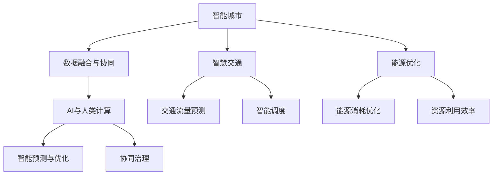

                 

## 1. 背景介绍

### 1.1 问题由来

随着信息技术的飞速发展，城市管理面临诸多挑战，如交通拥堵、环境污染、资源短缺等。传统城市管理方式主要依赖人力、直觉和经验，难以应对日益复杂的现实问题。为此，借助人工智能技术，尤其是AI与人类计算的融合，成为现代城市治理的新趋势。

### 1.2 问题核心关键点

城市管理的核心问题在于如何在有限资源下实现最大化效能和可持续性。利用AI技术，尤其是通过人类计算（AI+人），可以帮助城市管理者在规划、管理、调度等方面做出更科学、高效、全面的决策。

1. **数据驱动决策**：通过大规模数据采集和实时监测，提升城市运行效率，减少资源浪费。
2. **智能预测与优化**：利用AI模型对城市运行进行预测与优化，如交通流量预测、能源消耗优化等。
3. **协同治理**：AI与人类计算结合，形成多部门协同、跨领域整合的治理模式。
4. **公民参与**：通过智能应用和数据开放，让市民更积极地参与城市治理，提升治理透明度和满意度。

### 1.3 问题研究意义

城市管理作为现代化治理的核心，直接影响社会稳定和经济可持续发展。通过AI与人类计算结合，可以有效解决资源配置、环境治理、智能交通等问题，推动城市向智能化、高效化、人性化方向发展。

1. **提升管理效率**：通过AI技术，能够高效处理海量数据，提升城市运行效率。
2. **改善环境质量**：AI辅助决策，优化能源利用，减少污染排放，提升环境质量。
3. **促进公民参与**：智能应用提高了市民对城市管理的参与度，提升了城市治理的透明度和公平性。
4. **推动产业升级**：AI技术赋能传统产业，促进智慧城市产业发展，提升城市经济活力。

## 2. 核心概念与联系

### 2.1 核心概念概述

为更好地理解AI与人类计算在城市管理中的应用，本节将介绍几个关键概念：

- **AI与人类计算（AI+人）**：指将人工智能技术与人类智慧结合，通过人类计算辅助AI决策，实现更科学、高效的智能治理。
- **智能城市**：利用信息通信技术（ICT）与城市基础设施深度融合，实现城市运行的智能化。
- **数据融合与协同**：通过AI与数据科学，实现城市多源数据融合，提升协同治理水平。
- **智慧交通**：利用AI技术，优化交通管理和调度，减少拥堵，提升出行体验。
- **能源优化**：利用AI技术，优化城市能源消耗，提升资源利用效率。

这些概念之间的逻辑关系可以通过以下Mermaid流程图来展示：



这个流程图展示出各概念之间的关联关系：

1. 智能城市是整体目标，包含智慧交通和能源优化等具体应用。
2. 数据融合与协同是技术手段，实现AI与人类计算的融合。
3. 智慧交通和能源优化是具体应用，借助AI技术实现。
4. AI与人类计算是核心手段，通过智能预测与优化和协同治理来达成智能城市目标。

## 3. 核心算法原理 & 具体操作步骤
### 3.1 算法原理概述

AI与人类计算在城市管理中的应用，主要基于以下算法原理：

1. **数据采集与预处理**：通过物联网（IoT）和传感器网络，实时采集城市运行数据，并对数据进行清洗、去噪和标准化。
2. **数据融合与整合**：将多源异构数据进行融合，消除冗余和冲突，形成统一的数据视图。
3. **智能预测与优化**：利用机器学习模型（如回归、分类、聚类、深度学习等），对城市运行状态进行预测，优化决策过程。
4. **协同治理**：通过联邦学习、多智能体系统等方法，实现跨部门、跨领域的数据共享和协同决策。
5. **用户参与与反馈**：构建智能应用平台，让用户参与城市管理，实时获取用户反馈，不断优化模型和策略。

### 3.2 算法步骤详解

以下是AI与人类计算在城市管理中的具体操作步骤：

**Step 1: 数据采集与预处理**

1. 部署各类传感器、监控设备，采集城市交通、能源、环境等数据。
2. 利用数据清洗工具（如Python的Pandas库）进行数据清洗、去噪、标准化等预处理。
3. 将处理后的数据存储到分布式数据库中，如Hadoop、Spark等。

**Step 2: 数据融合与整合**

1. 利用分布式数据处理框架（如Apache Flink、Apache Beam）进行数据融合，消除数据冗余和冲突。
2. 构建统一的数据视图，利用数据可视化工具（如Tableau、Power BI）进行数据探索和分析。
3. 将数据转化为AI模型训练的数据集，供后续步骤使用。

**Step 3: 智能预测与优化**

1. 根据具体应用场景，选择合适的机器学习模型（如线性回归、决策树、随机森林、深度学习等）。
2. 使用深度学习框架（如TensorFlow、PyTorch）构建AI模型，利用GPU加速训练。
3. 在训练数据上训练模型，并使用验证集调整模型超参数，优化模型性能。
4. 将优化后的模型部署到城市运行系统，实时预测和优化决策。

**Step 4: 协同治理**

1. 构建多智能体系统（如BCA、SDM等），实现跨部门、跨领域的协同决策。
2. 通过联邦学习等技术，实现跨机构、跨领域的数据共享和协同优化。
3. 利用区块链技术，确保数据安全和透明，提升协同治理的公信力。

**Step 5: 用户参与与反馈**

1. 构建智能应用平台，如城市管理App、智能控制系统等，让用户参与城市管理。
2. 实时收集用户反馈，利用自然语言处理（NLP）技术进行情感分析、意图识别。
3. 根据用户反馈，动态调整模型和策略，提升智能决策的准确性和用户满意度。

### 3.3 算法优缺点

AI与人类计算在城市管理中的应用，具有以下优点：

1. **高效性**：通过AI技术，能够高效处理海量数据，提升城市管理效率。
2. **精确性**：利用AI模型对城市运行进行精确预测和优化，减少人为误差。
3. **自适应性**：AI系统能够自我学习、自我优化，适应城市运行状态的变化。
4. **协同性**：通过多智能体系统、联邦学习等技术，实现跨部门、跨领域的协同治理。

同时，该方法也存在一些缺点：

1. **数据依赖**：AI系统依赖于高质量、全面、实时的数据，数据采集和处理难度较大。
2. **模型复杂性**：构建和训练复杂的AI模型，需要高昂的技术成本和算力支持。
3. **技术门槛**：AI技术需要专业的技术和人才支持，普及程度有限。
4. **隐私与安全**：AI系统需要处理大量敏感数据，隐私和安全问题不容忽视。
5. **社会接受度**：AI系统决策过程不透明，可能引发社会接受度问题。

### 3.4 算法应用领域

AI与人类计算在城市管理中的应用，涵盖多个领域，主要包括：

1. **智慧交通**：通过AI技术优化交通信号、智能调度，减少拥堵，提升出行体验。
2. **智能能源**：利用AI模型预测能源需求，优化能源消耗，提升资源利用效率。
3. **环境监测**：通过AI技术监测环境污染，预测气象变化，提升环境保护水平。
4. **公共安全**：利用AI技术监控公共安全事件，预测犯罪行为，提升公共安全水平。
5. **健康医疗**：通过AI技术优化医疗资源分配，提升医疗服务效率。
6. **教育管理**：利用AI技术分析学生表现，优化教学资源，提升教育质量。

## 4. 数学模型和公式 & 详细讲解 & 举例说明

### 4.1 数学模型构建

在城市管理中，常常需要构建复杂的数学模型，用于数据融合、智能预测和优化等。以下以智慧交通为例，构建一个交通流量预测的数学模型：

设城市中某路段的交通流量为 $X_t$，影响因素包括当前车流量 $x_{t-1}$、天气状况 $w_t$、交通信号灯状态 $s_t$ 等。

$$ X_t = f(x_{t-1}, w_t, s_t) $$

其中，$f$ 为预测模型，可以采用线性回归、神经网络等方法进行建模。

### 4.2 公式推导过程

以线性回归模型为例，其公式推导如下：

设 $X_t$ 的线性回归模型为：

$$ X_t = \beta_0 + \beta_1 x_{t-1} + \beta_2 w_t + \beta_3 s_t + \epsilon_t $$

其中，$\beta_0$、$\beta_1$、$\beta_2$、$\beta_3$ 为模型参数，$\epsilon_t$ 为误差项。

利用最小二乘法，求得模型参数的估计值：

$$ \hat{\beta} = (X'X)^{-1}X'Y $$

其中 $X = [x_{t-1} w_t s_t]$，$Y = X_t$。

利用模型对未来交通流量进行预测，求解 $X_{t+1}$ 的预测值：

$$ \hat{X}_{t+1} = \hat{\beta}_0 + \hat{\beta}_1 x_t + \hat{\beta}_2 w_{t+1} + \hat{\beta}_3 s_{t+1} $$

### 4.3 案例分析与讲解

以北京市交通流量预测为例，利用上述模型进行交通流量预测和优化：

1. 数据采集：通过城市监控摄像头、交通流量传感器等设备，采集实时交通数据。
2. 数据预处理：清洗、去噪、标准化数据，确保数据质量。
3. 模型构建：根据北京市交通特点，选择合适的模型进行训练，如线性回归、随机森林、神经网络等。
4. 模型优化：在训练数据集上训练模型，使用验证集调整超参数，优化模型性能。
5. 预测与优化：将优化后的模型部署到城市交通系统，实时预测交通流量，优化交通信号灯状态，减少交通拥堵。

## 5. 项目实践：代码实例和详细解释说明

### 5.1 开发环境搭建

在进行AI与人类计算的实践前，我们需要准备好开发环境。以下是使用Python进行PyTorch开发的环境配置流程：

1. 安装Anaconda：从官网下载并安装Anaconda，用于创建独立的Python环境。

2. 创建并激活虚拟环境：
```bash
conda create -n pytorch-env python=3.8 
conda activate pytorch-env
```

3. 安装PyTorch：根据CUDA版本，从官网获取对应的安装命令。例如：
```bash
conda install pytorch torchvision torchaudio cudatoolkit=11.1 -c pytorch -c conda-forge
```

4. 安装相关库：
```bash
pip install pandas numpy matplotlib seaborn scikit-learn torch torchvision transformers
```

完成上述步骤后，即可在`pytorch-env`环境中开始实践。

### 5.2 源代码详细实现

下面我们以智慧交通流量预测为例，给出使用PyTorch进行模型构建的代码实现。

首先，定义数据预处理函数：

```python
import pandas as pd
import numpy as np

def load_data(file_path):
    data = pd.read_csv(file_path)
    return data.dropna()

def preprocess_data(data):
    # 数据标准化
    data['x_{t-1}'] = (data['x_{t-1}'] - data['x_{t-1}'].mean()) / data['x_{t-1}'].std()
    data['w_t'] = (data['w_t'] - data['w_t'].mean()) / data['w_t'].std()
    data['s_t'] = (data['s_t'] - data['s_t'].mean()) / data['s_t'].std()
    return data

def train_test_split(data):
    train_size = int(0.8 * len(data))
    train_data = data[:train_size]
    test_data = data[train_size:]
    return train_data, test_data
```

然后，定义模型构建函数：

```python
import torch
import torch.nn as nn
import torch.optim as optim

class TrafficPredictor(nn.Module):
    def __init__(self, input_dim, output_dim):
        super(TrafficPredictor, self).__init__()
        self.fc1 = nn.Linear(input_dim, 64)
        self.fc2 = nn.Linear(64, output_dim)
        self.relu = nn.ReLU()

    def forward(self, x):
        x = self.fc1(x)
        x = self.relu(x)
        x = self.fc2(x)
        return x
```

接着，定义模型训练和预测函数：

```python
def train_model(model, train_data, test_data, epochs=10, batch_size=32):
    model.train()
    optimizer = optim.Adam(model.parameters(), lr=0.001)
    criterion = nn.MSELoss()
    for epoch in range(epochs):
        for i in range(0, len(train_data), batch_size):
            start = i
            end = min(i + batch_size, len(train_data))
            inputs = train_data.iloc[start:end, 0:3]
            labels = train_data.iloc[start:end, 3]
            optimizer.zero_grad()
            outputs = model(inputs)
            loss = criterion(outputs, labels)
            loss.backward()
            optimizer.step()
        print(f'Epoch {epoch+1}, Loss: {loss.item()}')

    model.eval()
    with torch.no_grad():
        predictions = model(test_data.iloc[:, 0:3])
        loss = criterion(predictions, test_data.iloc[:, 3])
        return loss.item()

def predict_traffic(model, input_data):
    model.eval()
    with torch.no_grad():
        inputs = torch.tensor(input_data, dtype=torch.float)
        outputs = model(inputs)
        return outputs.item()
```

最后，启动模型训练和预测流程：

```python
data = load_data('traffic_data.csv')
train_data, test_data = train_test_split(data)
preprocess_data(train_data)
preprocess_data(test_data)

model = TrafficPredictor(3, 1)
train_model(model, train_data, test_data)

predictions = []
for i in range(10):
    input_data = [i, i+1, i+2]
    predictions.append(predict_traffic(model, input_data))

print(predictions)
```

以上就是使用PyTorch进行智慧交通流量预测的完整代码实现。可以看到，得益于PyTorch的强大封装，代码实现相对简洁高效。

### 5.3 代码解读与分析

让我们再详细解读一下关键代码的实现细节：

**数据预处理函数**：
- `load_data`函数：从CSV文件中加载数据，并去除缺失值。
- `preprocess_data`函数：对数据进行标准化处理，确保数据质量。
- `train_test_split`函数：将数据集划分为训练集和测试集。

**模型构建函数**：
- `TrafficPredictor`类：定义一个简单的多层感知器（MLP）模型，用于交通流量预测。
- `__init__`方法：初始化模型层。
- `forward`方法：定义前向传播过程。

**模型训练和预测函数**：
- `train_model`函数：定义模型训练过程，包括前向传播、计算损失、反向传播和优化。
- `predict_traffic`函数：定义模型预测过程。

**训练流程**：
- 在训练集上迭代训练模型，输出每个epoch的损失。
- 在测试集上评估模型性能，输出预测结果。

## 6. 实际应用场景

### 6.1 智能交通系统

智能交通系统是AI与人类计算在城市管理中最核心的应用之一。通过智慧交通系统，可以有效减少交通拥堵，提升出行效率。

1. **智能信号灯控制**：利用AI模型实时分析交通流量，动态调整信号灯状态，减少车辆等待时间。
2. **路径规划与导航**：构建智能导航系统，利用AI优化路径选择，减少出行时间和资源消耗。
3. **事故预警与应急响应**：通过传感器和监控设备，实时监测交通状况，预警潜在事故，快速响应。

### 6.2 智能能源管理

智能能源管理是AI与人类计算在城市管理中的另一个重要应用。通过智能能源管理，可以有效优化能源使用，降低能源浪费。

1. **智能电网**：利用AI模型实时监测和预测电力负荷，优化电网调度，减少电能浪费。
2. **智能照明**：构建智能照明系统，利用AI优化照明控制，减少能源消耗。
3. **智能建筑**：通过AI模型优化建筑能源使用，提升节能效果。

### 6.3 环境监测与治理

环境监测与治理是AI与人类计算在城市管理中的重要应用之一。通过智能环境监测，可以有效提升环境保护水平。

1. **大气污染监测**：利用AI模型实时监测大气污染指标，预测污染趋势，提升环境治理水平。
2. **水质监测**：构建智能水质监测系统，利用AI模型实时分析水质数据，预警污染事件。
3. **噪声监测**：利用AI模型监测城市噪声水平，优化城市声环境。

## 7. 工具和资源推荐
### 7.1 学习资源推荐

为了帮助开发者系统掌握AI与人类计算的理论基础和实践技巧，这里推荐一些优质的学习资源：

1. **《深度学习》课程**：由斯坦福大学Andrew Ng教授讲授，系统讲解深度学习原理和应用。
2. **Kaggle平台**：全球最大的数据科学竞赛平台，提供海量真实数据和解决方案，帮助你提升数据处理和模型构建能力。
3. **《Python数据科学手册》**：详细介绍了Python在数据科学中的应用，包括数据清洗、数据分析、机器学习等。
4. **PyTorch官方文档**：PyTorch框架的官方文档，提供完整的API文档和样例代码，帮助你快速上手使用。
5. **Udacity深度学习专业课程**：提供深度学习相关的系列课程，包括计算机视觉、自然语言处理、强化学习等。

通过对这些资源的学习实践，相信你一定能够快速掌握AI与人类计算的精髓，并用于解决实际的智能城市管理问题。

### 7.2 开发工具推荐

高效的开发离不开优秀的工具支持。以下是几款用于AI与人类计算开发的常用工具：

1. **Jupyter Notebook**：交互式编程环境，支持多种编程语言，提供丰富的数据可视化功能。
2. **TensorFlow**：由Google开发的深度学习框架，支持分布式计算和模型部署。
3. **PyTorch**：由Facebook开发的深度学习框架，具有动态计算图和高效的GPU加速。
4. **Hadoop/Spark**：大数据处理框架，支持分布式数据存储和处理。
5. **Amazon SageMaker**：AWS提供的云机器学习平台，支持模型训练、部署和管理。
6. **Grafana**：开源数据可视化工具，支持多种数据源和可视化类型。

合理利用这些工具，可以显著提升AI与人类计算的开发效率，加快创新迭代的步伐。

### 7.3 相关论文推荐

AI与人类计算的研究源于学界的持续探索。以下是几篇奠基性的相关论文，推荐阅读：

1. **《Deep learning》**：Yoshua Bengio、Geoffrey Hinton、Aaron Courville合著，系统讲解深度学习的基本概念和应用。
2. **《Human-in-the-loop Machine Learning》**：Samuele Cornellacce, Miro Dudik, Peter Frazier, Peter Glynn, Robert J. Vanderbei, Aaron N. Weiss 合著，讨论了人机协同学习的各种方法。
3. **《Multimodal and Multiclass Learning》**：利用多模态数据和多分类学习，提升AI系统的表现。
4. **《Federated learning in medical data sharing》**：讨论了联邦学习在医疗数据共享中的应用，确保数据隐私和安全。
5. **《Collaborative filtering for implicit feedback datasets》**：利用协同过滤算法，提升推荐系统的性能。

这些论文代表了大语言模型微调技术的发展脉络。通过学习这些前沿成果，可以帮助研究者把握学科前进方向，激发更多的创新灵感。

## 8. 总结：未来发展趋势与挑战

### 8.1 总结

本文对AI与人类计算在城市管理中的应用进行了全面系统的介绍。首先阐述了智能城市和智慧交通、智能能源、环境监测等核心概念，明确了AI与人类计算在城市管理中的重要价值。其次，从原理到实践，详细讲解了智能预测与优化的数学模型和核心算法，给出了智慧交通流量预测的完整代码实现。同时，本文还广泛探讨了AI与人类计算在多个实际应用场景中的应用，展示了AI与人类计算的巨大潜力。此外，本文精选了AI与人类计算的学习资源，力求为读者提供全方位的技术指引。

通过本文的系统梳理，可以看到，AI与人类计算在城市管理中的应用前景广阔，有助于实现城市运行的智能化、高效化和可持续化。未来，伴随AI技术的不断演进，AI与人类计算必将成为推动城市智能化发展的关键力量。

### 8.2 未来发展趋势

展望未来，AI与人类计算在城市管理中的应用将呈现以下几个发展趋势：

1. **智能化水平提升**：随着AI技术的不断进步，智慧城市系统的智能化水平将进一步提升，实现城市运行的精细化管理。
2. **数据融合与协同治理**：利用联邦学习、多智能体系统等技术，实现跨部门、跨领域的数据共享和协同治理，提升城市管理的协同效率。
3. **多模态融合**：未来城市管理将更多地利用多模态数据（如视频、图像、声音等），提升系统对现实世界的理解和建模能力。
4. **深度学习与强化学习结合**：通过深度学习和强化学习的结合，提升AI系统在复杂环境下的决策能力。
5. **自适应与自学习**：AI系统将具备更强的自适应和自学习能力，能够根据环境变化动态调整策略。
6. **区块链与可信计算**：利用区块链和可信计算技术，提升AI系统的透明性和可信度。

以上趋势凸显了AI与人类计算的广阔前景。这些方向的探索发展，必将进一步提升智慧城市系统的效能和可持续性，推动城市向智能化、高效化、人性化方向发展。

### 8.3 面临的挑战

尽管AI与人类计算在城市管理中的应用已经取得了初步成效，但在迈向更加智能化、高效化应用的过程中，仍面临诸多挑战：

1. **数据质量与隐私**：智能城市系统依赖高质量、全面的数据，数据采集和处理难度较大，且存在隐私问题。
2. **技术成本与复杂性**：构建和维护智能城市系统需要高昂的技术成本和复杂的技术体系。
3. **社会接受度**：AI系统决策过程不透明，可能引发社会接受度问题，如何增强系统的透明度和可解释性成为一大难题。
4. **模型鲁棒性与泛化性**：AI系统面临复杂多变的城市环境，如何提升模型的鲁棒性和泛化性成为一大挑战。
5. **跨领域协作**：AI与人类计算涉及多学科、多领域，如何实现跨领域协作，提升系统集成度成为一大难题。

### 8.4 未来突破

面对AI与人类计算在城市管理中面临的挑战，未来的研究需要在以下几个方面寻求新的突破：

1. **数据治理与隐私保护**：建立数据治理体系，确保数据质量和安全，提升数据隐私保护水平。
2. **模型高效性与可解释性**：开发更加高效、可解释的AI模型，提升系统透明度和可信度。
3. **多模态融合与协同治理**：利用多模态数据和多智能体系统，提升系统集成度和协同效率。
4. **深度学习与强化学习结合**：通过深度学习和强化学习的结合，提升AI系统在复杂环境下的决策能力。
5. **区块链与可信计算**：利用区块链和可信计算技术，提升AI系统的透明性和可信度。
6. **跨领域协作与开放平台**：建立开放平台，促进跨领域协作，提升系统集成度和应用广度。

这些研究方向的探索，必将引领AI与人类计算技术迈向更高的台阶，为构建安全、可靠、可解释、可控的智能系统铺平道路。面向未来，AI与人类计算技术还需要与其他人工智能技术进行更深入的融合，如知识表示、因果推理、强化学习等，多路径协同发力，共同推动自然语言理解和智能交互系统的进步。只有勇于创新、敢于突破，才能不断拓展AI与人类计算的边界，让智能技术更好地造福人类社会。

## 9. 附录：常见问题与解答

**Q1：智能城市建设过程中，如何保证数据的安全与隐私？**

A: 智能城市建设过程中，数据安全和隐私保护是关键问题。以下是一些保护措施：

1. **数据匿名化**：对敏感数据进行匿名化处理，如去除个人标识信息，保护用户隐私。
2. **数据加密**：采用数据加密技术，确保数据在传输和存储过程中的安全性。
3. **访问控制**：建立严格的访问控制机制，限制数据访问权限，防止未授权访问。
4. **区块链技术**：利用区块链技术，记录和验证数据来源，确保数据的透明性和可信度。

**Q2：在智能城市建设中，如何平衡经济效益与社会效益？**

A: 智能城市建设过程中，经济效益和社会效益需要兼顾。以下是一些平衡措施：

1. **多方参与**：政府、企业、学术界等多方参与，共同制定智能城市建设标准和政策，确保经济效益与社会效益的双赢。
2. **公平与透明**：确保智能城市系统的公平性和透明性，避免对特定群体的歧视。
3. **资源共享**：通过智能城市平台，实现资源共享，提升城市运行效率，同时降低建设成本。
4. **公众参与**：鼓励公众参与智能城市建设，提升市民对城市治理的参与感和满意度。

**Q3：智能城市系统如何提升城市治理水平？**

A: 智能城市系统通过数据驱动、AI辅助决策，可以有效提升城市治理水平。以下是一些具体措施：

1. **数据驱动决策**：通过实时数据监测和分析，提升城市治理的科学性和高效性。
2. **AI辅助决策**：利用AI模型预测和优化决策，提升城市治理的精准性和及时性。
3. **协同治理**：通过多智能体系统、联邦学习等技术，实现跨部门、跨领域的数据共享和协同决策。
4. **公众参与**：利用智能应用平台，实时收集公众反馈，提升城市治理的透明度和公信力。

总之，智能城市系统通过数据驱动、AI辅助决策、协同治理和公众参与，可以提升城市治理水平，实现城市运行的智能化、高效化和可持续化。未来，伴随技术的不断演进，智能城市系统必将成为推动城市智能化发展的关键力量。

**Q4：智能城市建设过程中，如何避免技术风险？**

A: 智能城市建设过程中，技术风险是不可忽视的问题。以下是一些风险规避措施：

1. **技术验证**：在技术应用前进行充分的技术验证，确保技术可靠性和安全性。
2. **模型监控**：建立模型监控机制，实时监测模型运行状态，及时发现和解决技术问题。
3. **容错设计**：构建容错系统，确保系统在高负荷运行时不崩溃，保障城市运行稳定。
4. **应急预案**：制定应急预案，确保系统在突发事件下能够快速响应和恢复。

总之，智能城市建设过程中，技术风险是不可忽视的问题。通过技术验证、模型监控、容错设计和应急预案，可以有效规避技术风险，确保智能城市系统的稳定运行。

**Q5：智能城市建设过程中，如何确保数据的高效利用？**

A: 智能城市建设过程中，数据高效利用是关键问题。以下是一些高效利用措施：

1. **数据融合与共享**：通过数据融合和共享，实现数据的高效利用。
2. **实时数据处理**：利用实时数据处理技术，提升数据利用效率。
3. **数据清洗与去噪**：对数据进行清洗和去噪，提升数据质量。
4. **数据可视化**：利用数据可视化技术，帮助决策者直观理解和分析数据。

总之，智能城市建设过程中，数据高效利用是关键问题。通过数据融合与共享、实时数据处理、数据清洗与去噪、数据可视化，可以有效提升数据利用效率，实现城市运行的智能化、高效化和可持续化。未来，伴随技术的不断演进，智能城市系统必将成为推动城市智能化发展的关键力量。

---

作者：禅与计算机程序设计艺术 / Zen and the Art of Computer Programming

