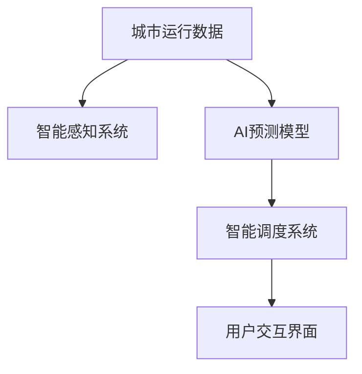

                 

## 1. 背景介绍

### 1.1 问题由来

随着全球城市化进程的加快，城市人口规模日益膨胀，基础设施建设和管理压力不断增大。如何在人口密集、资源有限的背景下，提升城市运行效率，保障环境安全和居民生活质量，成为摆在城市管理者面前的重要课题。

过去，城市管理主要依靠人工管理，依赖于有限的监控资源和有限的人员力量，难以全面覆盖城市各个角落。而随着人工智能（AI）技术的兴起，尤其是机器学习、计算机视觉等技术的不断成熟，为城市管理带来了新的可能性。

基于AI的城市管理系统能够利用数据驱动的方法，对城市运行状态进行全面、动态的监测和分析，从而实现智能调度、资源优化、灾害预警等功能，助力城市可持续发展和智慧化转型。

### 1.2 问题核心关键点

构建基于AI的城市管理系统，其核心关键点在于以下几个方面：

- **数据驱动**：采集和分析城市运行的各种数据，如交通流量、环境监测、气象数据等，用于实时预测和管理城市运行状态。
- **智能感知**：利用计算机视觉、传感器等技术，实现对城市运行状态的全面感知，包括交通流量、空气质量、能源消耗等。
- **模型优化**：构建高效的智能模型，能够实时分析和预测城市运行状态，指导智能调度和管理决策。
- **系统集成**：将AI模型与城市管理业务系统进行集成，实现智能决策和资源优化。
- **用户体验**：通过交互式界面和智能助手，提升城市管理者与居民的用户体验。

本文将围绕这些关键点，深入探讨基于AI的城市管理系统的构建方法、技术挑战和未来趋势。

## 2. 核心概念与联系

### 2.1 核心概念概述

为更好地理解基于AI的城市管理系统的构建方法，本节将介绍几个密切相关的核心概念：

- **城市运行数据（Urban Operation Data）**：包括交通流量、环境监测、能源消耗、公共安全等各类数据，是AI模型训练和应用的基础。
- **智能感知系统（Intelligent Sensing System）**：利用计算机视觉、传感器等技术，实时采集城市运行状态数据，为AI模型提供数据支撑。
- **AI预测模型（AI Prediction Model）**：基于机器学习、深度学习等技术，构建用于预测和分析城市运行状态的模型。
- **智能调度系统（Intelligent Dispatching System）**：根据AI模型的预测结果，智能调整交通流量、能源分配、公共安全等资源，实现城市运行优化。
- **用户交互界面（User Interface）**：提供城市管理者与居民之间的交互界面，方便管理和决策，增强用户体验。

这些核心概念之间的逻辑关系可以通过以下Mermaid流程图来展示：



这个流程图展示了大规模城市管理系统的核心概念及其之间的关系：

1. 城市运行数据是智能感知系统的输入，也是AI预测模型的训练数据。
2. 智能感知系统采集实时数据，为AI预测模型提供实时信息。
3. AI预测模型基于采集的数据进行预测和分析，指导智能调度系统。
4. 智能调度系统根据预测结果，优化城市资源配置。
5. 用户交互界面提供实时数据和决策结果，增强用户体验。

这些概念共同构成了基于AI的城市管理系统的整体框架，使其能够实现城市运行的全面监测、分析和优化。

## 3. 核心算法原理 & 具体操作步骤

### 3.1 算法原理概述

基于AI的城市管理系统的核心算法原理，可以归纳为以下几步：

1. **数据采集与处理**：收集城市运行的各种数据，并进行清洗和预处理，保证数据质量。
2. **智能感知**：利用传感器、摄像头等设备，实时采集城市运行数据。
3. **数据融合**：将不同来源的数据进行融合，形成全面、统一的城市运行数据集。
4. **模型训练与优化**：构建AI预测模型，并使用城市运行数据进行训练和优化，提升模型预测准确率。
5. **智能调度**：根据AI模型的预测结果，优化交通流量、能源分配、公共安全等资源配置。
6. **用户交互与反馈**：提供用户交互界面，收集反馈，优化系统性能。

### 3.2 算法步骤详解

以下是对每一步操作的详细解释：

**Step 1: 数据采集与处理**

- **数据类型**：包括交通流量数据、环境监测数据、能源消耗数据、公共安全数据等。
- **数据来源**：包括传感器、摄像头、城市监控系统、智能表计等。
- **数据清洗**：去除噪声、缺失值和异常值，确保数据质量。
- **数据格式**：转换为标准格式，便于后续处理和分析。

**Step 2: 智能感知**

- **传感器部署**：在城市关键区域部署传感器、摄像头等设备。
- **数据采集**：实时采集传感器和摄像头数据，包括交通流量、空气质量、气温、光照等。
- **数据传输**：将采集的数据传输至中央处理平台，进行统一管理和存储。

**Step 3: 数据融合**

- **数据格式统一**：将不同来源的数据转换为统一的格式，便于后续处理。
- **数据聚合**：将时间序列数据进行聚合，形成实时监测数据。
- **数据融合算法**：使用数据融合算法，如加权平均、卡尔曼滤波等，提升数据质量。

**Step 4: 模型训练与优化**

- **模型选择**：选择合适的AI模型，如卷积神经网络（CNN）、循环神经网络（RNN）、长短期记忆网络（LSTM）等。
- **模型训练**：使用城市运行数据进行模型训练，优化模型参数。
- **模型验证**：在验证集上评估模型性能，选择最优模型。

**Step 5: 智能调度**

- **调度策略**：根据AI模型的预测结果，制定交通流量、能源分配、公共安全等调度策略。
- **实时调度**：利用实时数据和AI模型预测结果，动态调整调度策略，优化城市运行。
- **反馈机制**：收集调度效果反馈，进一步优化调度策略。

**Step 6: 用户交互与反馈**

- **交互界面**：提供用户交互界面，展示实时数据和调度结果。
- **用户反馈**：收集用户反馈，优化系统性能。
- **可视化展示**：利用可视化技术，展示城市运行状态和调度效果。

### 3.3 算法优缺点

基于AI的城市管理系统具备以下优点：

1. **数据驱动**：充分利用城市运行数据，提升决策的科学性和准确性。
2. **实时感知**：实时采集和处理城市运行数据，提升系统响应速度。
3. **智能预测**：利用AI模型进行预测，提升资源配置的优化水平。
4. **用户体验**：提供交互式界面，增强用户体验。

同时，该系统也存在以下局限性：

1. **数据质量依赖**：系统性能受数据质量的影响较大，需要保证数据采集和处理的准确性。
2. **模型复杂性**：AI模型构建复杂，需要大量的数据和计算资源。
3. **安全隐私问题**：大量城市数据的采集和使用，存在数据安全和隐私保护的风险。
4. **技术门槛较高**：系统构建和维护需要高水平的技术支持和团队。

尽管存在这些局限性，但就目前而言，基于AI的城市管理系统仍然是城市管理现代化的重要方向。未来相关研究的重点在于如何进一步降低技术门槛，提高数据质量，保护数据安全和隐私，以及提升模型的可解释性和易用性。

### 3.4 算法应用领域

基于AI的城市管理系统已在多个领域得到应用，例如：

- **交通管理**：利用AI模型预测交通流量，智能调整交通信号灯和公共交通车辆，缓解交通拥堵。
- **环境保护**：利用AI模型监测空气质量、水质、噪音等环境指标，及时采取措施改善环境质量。
- **能源管理**：利用AI模型预测能源消耗，优化能源分配，提高能源利用效率。
- **公共安全**：利用AI模型分析公共安全事件，预测潜在风险，提前采取预防措施。
- **城市规划**：利用AI模型分析城市运行数据，提供城市规划和建设建议。

除了上述这些经典应用外，基于AI的城市管理系统还被创新性地应用到更多场景中，如智能电网、智慧照明、智能垃圾分类等，为城市管理带来了全新的突破。随着AI技术的发展和应用场景的拓展，基于AI的城市管理系统将逐步迈向智能化、数字化、个性化管理的时代。

## 4. 数学模型和公式 & 详细讲解 & 举例说明

### 4.1 数学模型构建

本节将使用数学语言对基于AI的城市管理系统的构建方法进行更加严格的刻画。

记城市运行数据为 $D=\{(x_i, y_i)\}_{i=1}^N$，其中 $x_i$ 为数据特征，$y_i$ 为标签（如交通流量、空气质量等）。假设智能感知系统采集的实时数据为 $D_t=\{x_t\}_{t=1}^T$，$T$ 为时间步长。

定义AI预测模型为 $M_{\theta}$，其中 $\theta$ 为模型参数。模型的目标是最小化预测误差，即：

$$
\min_{\theta} \sum_{i=1}^N \|y_i - M_{\theta}(x_i)\|^2
$$

在实际应用中，我们通常使用损失函数来衡量模型的预测误差。常见的损失函数包括均方误差（MSE）、均方根误差（RMSE）等。

### 4.2 公式推导过程

以下我们以交通流量预测为例，推导使用均方误差损失函数的AI预测模型的公式。

假设模型 $M_{\theta}$ 在输入 $x_t$ 上的输出为 $\hat{y}_t=M_{\theta}(x_t)$，表示预测的交通流量。真实标签 $y_t \in \mathbb{R}$，表示实际的交通流量。则均方误差损失函数定义为：

$$
\ell(y_t, \hat{y}_t) = \frac{1}{N} \sum_{i=1}^N (y_i - \hat{y}_i)^2
$$

将其代入目标函数，得：

$$
\mathcal{L}(\theta) = \frac{1}{N} \sum_{i=1}^N (y_i - M_{\theta}(x_i))^2
$$

根据链式法则，损失函数对参数 $\theta_k$ 的梯度为：

$$
\frac{\partial \mathcal{L}(\theta)}{\partial \theta_k} = \frac{1}{N} \sum_{i=1}^N 2(y_i - M_{\theta}(x_i)) \frac{\partial M_{\theta}(x_i)}{\partial \theta_k}
$$

其中 $\frac{\partial M_{\theta}(x_i)}{\partial \theta_k}$ 可进一步递归展开，利用自动微分技术完成计算。

在得到损失函数的梯度后，即可带入参数更新公式，完成模型的迭代优化。重复上述过程直至收敛，最终得到适应城市运行数据的最优模型参数 $\theta^*$。

### 4.3 案例分析与讲解

以交通流量预测为例，解释模型的构建和训练过程。

**模型选择**：使用长短期记忆网络（LSTM）作为预测模型，因为它能够有效处理时间序列数据。

**模型训练**：使用历史交通流量数据进行模型训练，优化模型参数。在每个时间步长 $t$，将当前时间步的数据 $x_t$ 输入模型，得到预测值 $\hat{y}_t$，计算均方误差损失函数：

$$
\ell(y_t, \hat{y}_t) = \frac{1}{N} \sum_{i=1}^N (y_i - \hat{y}_i)^2
$$

根据损失函数对模型参数 $\theta$ 进行梯度更新：

$$
\theta \leftarrow \theta - \eta \nabla_{\theta}\mathcal{L}(\theta)
$$

其中 $\eta$ 为学习率。

**模型验证**：在验证集上评估模型性能，计算均方误差，选择最优模型。

**模型应用**：将模型应用于实时交通数据，预测未来交通流量，实时调整交通信号灯和公共交通车辆，缓解交通拥堵。

以上流程展示了基于AI的城市管理系统在交通流量预测中的应用，通过模型构建和训练，实现了实时交通流量的智能调度。

## 5. 项目实践：代码实例和详细解释说明

### 5.1 开发环境搭建

在进行AI城市管理系统开发前，我们需要准备好开发环境。以下是使用Python进行PyTorch开发的环境配置流程：

1. 安装Anaconda：从官网下载并安装Anaconda，用于创建独立的Python环境。

2. 创建并激活虚拟环境：
```bash
conda create -n pytorch-env python=3.8 
conda activate pytorch-env
```

3. 安装PyTorch：根据CUDA版本，从官网获取对应的安装命令。例如：
```bash
conda install pytorch torchvision torchaudio cudatoolkit=11.1 -c pytorch -c conda-forge
```

4. 安装TensorFlow：由Google主导开发的开源深度学习框架，生产部署方便，适合大规模工程应用。

5. 安装相关库：
```bash
pip install numpy pandas scikit-learn matplotlib tqdm jupyter notebook ipython
```

完成上述步骤后，即可在`pytorch-env`环境中开始AI城市管理系统的开发。

### 5.2 源代码详细实现

这里以交通流量预测为例，展示基于PyTorch的AI城市管理系统开发流程。

首先，定义数据处理函数：

```python
import numpy as np
import pandas as pd
from sklearn.model_selection import train_test_split

def load_data():
    data = pd.read_csv('traffic_data.csv', header=None, names=['time', 'flow'])
    data['time'] = pd.to_datetime(data['time'])
    data = data.set_index('time')
    return data

def preprocess_data(data, window_size=24):
    X = data.iloc[:, 1].values.reshape(-1, window_size)
    y = data.iloc[:, 1].values[window_size:]
    return X, y

def train_test_split_data(X, y, test_size=0.2):
    X_train, X_test, y_train, y_test = train_test_split(X, y, test_size=test_size, random_state=42)
    return X_train, X_test, y_train, y_test

def data_to_tensor(x):
    return np.array(x).reshape(-1, 1)

def normalize_data(X):
    X = (X - np.mean(X)) / np.std(X)
    return X
```

然后，定义模型和优化器：

```python
from torch import nn, optim
from torch.autograd import Variable

class LSTM(nn.Module):
    def __init__(self, input_size, hidden_size, output_size):
        super(LSTM, self).__init__()
        self.hidden_size = hidden_size
        self.lstm = nn.LSTM(input_size, hidden_size, 1)
        self.fc = nn.Linear(hidden_size, output_size)

    def forward(self, x):
        lstm_out, _ = self.lstm(x)
        return self.fc(lstm_out[-1])

model = LSTM(input_size=1, hidden_size=64, output_size=1)
optimizer = optim.Adam(model.parameters(), lr=0.001)
```

接着，定义训练和评估函数：

```python
from torch.utils.data import TensorDataset, DataLoader

def train_epoch(model, data_loader, optimizer):
    model.train()
    for X, y in data_loader:
        optimizer.zero_grad()
        X = Variable(X)
        y = Variable(y)
        y_pred = model(X)
        loss = nn.MSELoss()(y_pred, y)
        loss.backward()
        optimizer.step()
        print(f"Epoch {epoch+1}, train loss: {loss.item():.3f}")

def evaluate(model, data_loader):
    model.eval()
    loss = 0
    for X, y in data_loader:
        X = Variable(X)
        y = Variable(y)
        y_pred = model(X)
        loss += nn.MSELoss()(y_pred, y).item()
    return loss / len(data_loader)
```

最后，启动训练流程并在测试集上评估：

```python
epochs = 100
window_size = 24
test_size = 0.2
batch_size = 64

X, y = preprocess_data(load_data(), window_size)
X_train, X_test, y_train, y_test = train_test_split_data(X, y, test_size=test_size)

X_train = data_to_tensor(X_train)
X_test = data_to_tensor(X_test)
y_train = data_to_tensor(y_train)
y_test = data_to_tensor(y_test)

X_train = normalize_data(X_train)
X_test = normalize_data(X_test)

train_loader = DataLoader(X_train, y_train, batch_size=batch_size, shuffle=True)
test_loader = DataLoader(X_test, y_test, batch_size=batch_size, shuffle=False)

for epoch in range(epochs):
    train_epoch(model, train_loader, optimizer)
    
test_loss = evaluate(model, test_loader)
print(f"Test loss: {test_loss:.3f}")
```

以上就是使用PyTorch对LSTM模型进行交通流量预测的完整代码实现。可以看到，得益于TensorFlow的强大封装，我们可以用相对简洁的代码完成LSTM模型的加载和训练。

### 5.3 代码解读与分析

让我们再详细解读一下关键代码的实现细节：

**load_data函数**：
- 从CSV文件中加载历史交通流量数据，将时间戳转换为时间索引。

**preprocess_data函数**：
- 将时间序列数据转换为模型的输入格式。

**train_test_split_data函数**：
- 将数据集划分为训练集和测试集。

**data_to_tensor函数**：
- 将数据转换为模型所需的张量格式。

**normalize_data函数**：
- 对数据进行归一化处理，确保数据质量。

**LSTM类**：
- 定义LSTM模型，包含一个LSTM层和一个线性层。

**train_epoch函数**：
- 在训练集上对模型进行训练，更新模型参数。

**evaluate函数**：
- 在测试集上评估模型性能，计算均方误差。

以上流程展示了基于PyTorch的LSTM模型在交通流量预测中的应用，通过模型构建和训练，实现了实时交通流量的智能调度。

当然，工业级的系统实现还需考虑更多因素，如模型的保存和部署、超参数的自动搜索、更灵活的任务适配层等。但核心的模型构建和训练流程基本与此类似。

## 6. 实际应用场景

### 6.1 智能交通管理

基于AI的城市管理系统可以应用于智能交通管理，通过实时监测交通流量、车速、道路状况等数据，实现交通信号灯的智能调节、公共交通的智能调度、事故预警等功能，提升城市交通运行的效率和安全性。

在技术实现上，可以利用摄像头、传感器等设备采集交通数据，通过AI预测模型预测交通流量和车速，实时调整交通信号灯和公共交通车辆，缓解交通拥堵，提高通行效率。例如，在交通高峰期，系统可以根据预测结果，动态调整信号灯配时，引导车辆有序通行；在发生交通事故时，系统可以实时监测并发出预警，快速调配救援车辆，确保道路畅通。

### 6.2 环境监测与治理

AI城市管理系统还可以应用于环境监测与治理，通过实时监测空气质量、水质、噪音等环境指标，实现环境质量预警和污染源定位。

在技术实现上，可以利用传感器、摄像头等设备采集环境数据，通过AI预测模型预测环境质量变化趋势，及时采取措施改善环境质量。例如，当空气质量监测指标异常时，系统可以预警并建议减少工业生产、施工等活动，降低污染排放；当水质监测指标异常时，系统可以定位污染源，并进行应急处理，保障公共安全。

### 6.3 智能垃圾分类

AI城市管理系统可以应用于智能垃圾分类，通过图像识别、语音识别等技术，实现垃圾的自动分类和智能回收。

在技术实现上，可以利用摄像头、麦克风等设备采集垃圾信息，通过AI预测模型进行图像和语音识别，判断垃圾种类并提示分类方案。例如，当用户将垃圾放入智能垃圾桶时，系统可以实时识别垃圾类型并显示回收方案，指导用户正确分类；在公共场所，系统可以通过摄像头实时监测垃圾投放情况，及时提醒居民分类，提升垃圾回收效率。

### 6.4 未来应用展望

随着AI技术的不断发展和应用场景的拓展，基于AI的城市管理系统将在更多领域得到应用，为城市管理带来新的突破。

在智慧医疗领域，基于AI的城市管理系统可以应用于医疗资源调度、病情监测、药物配送等环节，提升医疗服务的智能化水平，保障公共健康。

在智能教育领域，AI城市管理系统可以应用于在线教育、智能作业批改、学情分析等环节，提升教育公平和教学质量。

在智慧城市治理中，AI城市管理系统可以应用于城市事件监测、舆情分析、应急指挥等环节，提升城市管理的自动化和智能化水平，构建更安全、高效的未来城市。

此外，在企业生产、社会治理、文娱传媒等众多领域，基于AI的城市管理系统也将不断涌现，为城市管理带来新的变革和机遇。

## 7. 工具和资源推荐

### 7.1 学习资源推荐

为了帮助开发者系统掌握AI城市管理系统的构建方法，这里推荐一些优质的学习资源：

1. PyTorch官方文档：PyTorch的官方文档，详细介绍了PyTorch框架的使用方法，包括模型构建、训练、推理等。

2. TensorFlow官方文档：TensorFlow的官方文档，提供了TensorFlow框架的详细使用方法，适用于大规模工程应用。

3. LSTM模型教程：LSTM模型的详细教程，讲解LSTM模型的原理和实现方法。

4. 智能城市治理白皮书：智能城市治理领域的权威白皮书，介绍了智能城市治理的体系架构、技术实现和应用案例。

5. 城市大数据与AI技术应用：城市大数据与AI技术的全面应用指南，涵盖城市运行数据的采集、处理和分析。

通过对这些资源的学习实践，相信你一定能够快速掌握AI城市管理系统的构建方法，并用于解决实际的智能城市问题。

### 7.2 开发工具推荐

高效的开发离不开优秀的工具支持。以下是几款用于AI城市管理系统开发的常用工具：

1. PyTorch：基于Python的开源深度学习框架，灵活动态的计算图，适合快速迭代研究。

2. TensorFlow：由Google主导开发的开源深度学习框架，生产部署方便，适合大规模工程应用。

3. Jupyter Notebook：交互式编程环境，方便编写、调试和分享代码。

4. Matplotlib：数据可视化库，支持各种类型的图表绘制，方便数据展示。

5. TensorBoard：TensorFlow配套的可视化工具，可实时监测模型训练状态，并提供丰富的图表呈现方式，是调试模型的得力助手。

6. Weights & Biases：模型训练的实验跟踪工具，可以记录和可视化模型训练过程中的各项指标，方便对比和调优。

合理利用这些工具，可以显著提升AI城市管理系统的开发效率，加快创新迭代的步伐。

### 7.3 相关论文推荐

AI城市管理系统的发展源于学界的持续研究。以下是几篇奠基性的相关论文，推荐阅读：

1. "Traffic Signal Control with Deep Reinforcement Learning"：利用深度强化学习技术实现交通信号灯的智能控制。

2. "Predicting Urban Traffic with Deep Neural Networks"：使用卷积神经网络（CNN）对城市交通流量进行预测。

3. "Urban Environmental Monitoring with AI"：利用计算机视觉和深度学习技术实现城市环境监测。

4. "Waste Classification with Convolutional Neural Networks"：使用卷积神经网络（CNN）对垃圾进行智能分类。

5. "Smart City Governance with AI"：介绍智能城市治理的体系架构、技术实现和应用案例。

这些论文代表了大规模城市管理系统的发展脉络。通过学习这些前沿成果，可以帮助研究者把握学科前进方向，激发更多的创新灵感。

## 8. 总结：未来发展趋势与挑战

### 8.1 总结

本文对基于AI的城市管理系统的构建方法进行了全面系统的介绍。首先阐述了AI城市管理系统的研究背景和意义，明确了系统构建的各个关键环节。其次，从原理到实践，详细讲解了系统构建的数学模型和算法步骤，给出了完整的代码实例和详细解释。同时，本文还探讨了AI城市管理系统在多个实际场景中的应用，展示了系统建设的巨大潜力。最后，本文推荐了相关的学习资源、开发工具和研究论文，力求为开发者提供全方位的技术指引。

通过本文的系统梳理，可以看到，基于AI的城市管理系统在智慧城市建设中具有广泛的应用前景，能够实现对城市运行状态的全面监测、分析和优化。未来，随着AI技术的发展和应用场景的拓展，基于AI的城市管理系统必将在更多的领域得到应用，为城市管理带来新的突破。

### 8.2 未来发展趋势

展望未来，AI城市管理系统的发展趋势主要包括以下几个方面：

1. **技术融合**：AI城市管理系统将与其他AI技术进行更深入的融合，如自然语言处理（NLP）、计算机视觉（CV）、语音识别等，提升系统的智能化水平。

2. **数据协同**：利用大数据、云计算等技术，实现城市运行数据的全面协同，提升系统的实时性和准确性。

3. **用户参与**：通过用户交互界面，增强用户参与度，实现智能调度与用户需求的双向互动，提升用户体验。

4. **个性化服务**：利用AI技术，实现对用户行为和需求的精准分析，提供个性化服务，提升系统价值。

5. **持续优化**：建立持续学习机制，不断优化模型参数和调度策略，提升系统性能。

6. **多模态融合**：将视觉、听觉、触觉等多模态信息与文本信息进行协同建模，提升系统对复杂场景的感知和理解能力。

以上趋势凸显了AI城市管理系统的发展方向，将在技术、数据、用户体验、服务质量等方面不断提升，为城市管理带来新的变革。

### 8.3 面临的挑战

尽管AI城市管理系统在多个领域得到了应用，但在迈向智能化、数字化、个性化管理的过程中，仍面临诸多挑战：

1. **数据质量**：系统的性能受数据质量的影响较大，需要保证数据采集和处理的准确性。

2. **技术复杂性**：系统构建和维护需要高水平的技术支持和团队，存在技术门槛。

3. **数据安全和隐私保护**：大量城市数据的采集和使用，存在数据安全和隐私保护的风险。

4. **系统集成**：将AI模型与城市管理业务系统进行集成，需要解决接口兼容、数据交互等问题。

5. **用户体验**：用户交互界面的设计和实现，需要兼顾用户体验和技术复杂度，存在一定的设计挑战。

6. **模型可解释性**：AI模型的决策过程需要具备可解释性，以便于理解和调试。

7. **多模态数据融合**：将视觉、听觉、触觉等多模态信息与文本信息进行协同建模，存在技术和方法上的挑战。

这些挑战需要在未来的研究和实践中不断解决，以实现AI城市管理系统的全面落地。

### 8.4 研究展望

面对AI城市管理系统所面临的挑战，未来的研究需要在以下几个方面寻求新的突破：

1. **数据增强与预处理**：研究高效的数据增强方法和预处理技术，提升数据质量。

2. **模型压缩与加速**：开发高效的模型压缩和加速方法，提升模型推理速度和资源利用效率。

3. **模型可解释性**：研究可解释性模型和解释方法，提升模型的可解释性和可信度。

4. **多模态融合**：研究多模态数据的融合方法和技术，提升系统对复杂场景的感知和理解能力。

5. **系统集成与优化**：研究高效的系统集成和优化方法，提升系统的实时性和稳定性。

6. **用户参与与反馈**：研究用户交互和反馈机制，提升系统的交互性和用户体验。

7. **安全与隐私保护**：研究数据安全和隐私保护技术，保障数据和系统的安全。

这些研究方向的探索，将引领AI城市管理系统迈向更高的台阶，为构建安全、可靠、智能的城市管理生态系统提供新的动力。

## 9. 附录：常见问题与解答

**Q1：AI城市管理系统是否适用于所有城市？**

A: AI城市管理系统适用于大部分城市，特别是在城市规模较大、运行数据较多的情况下，效果尤为显著。但对于一些资源较为匮乏的城市，系统的构建和运行成本较高，需要综合考虑经济性和可行性。

**Q2：AI城市管理系统是否依赖于高性能计算资源？**

A: 是的，AI城市管理系统的构建和运行需要高性能计算资源，特别是在模型训练和大规模数据处理时。因此，需要有充足的硬件资源支持，如GPU、TPU等高性能计算设备。

**Q3：AI城市管理系统能否实现实时调度？**

A: 是的，AI城市管理系统可以实现实时调度，通过实时监测和预测城市运行状态，动态调整资源配置，提升系统响应速度和效率。

**Q4：AI城市管理系统如何应对突发事件？**

A: AI城市管理系统可以通过实时监测和预测，提前预警突发事件，并根据预测结果采取应急措施，如交通流量异常时调整信号灯配时，确保交通畅通；环境污染事件时建议减少工业生产，降低污染排放。

**Q5：AI城市管理系统如何保护数据安全和隐私？**

A: 通过数据加密、访问控制等技术，保护数据安全和隐私。同时，系统设计应遵循隐私保护原则，避免敏感数据泄露和滥用。

作者：禅与计算机程序设计艺术 / Zen and the Art of Computer Programming

