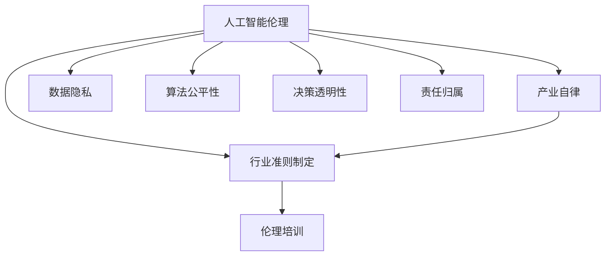

                 

# AI伦理的产业自律:行业准则制定和伦理培训

> 关键词：人工智能伦理,产业自律,行业准则,伦理培训,机器学习,数据隐私,公平性

## 1. 背景介绍

### 1.1 问题由来

随着人工智能技术的飞速发展，AI伦理问题日益成为公众关注的热点。机器学习模型在许多领域被广泛应用，如医疗、金融、智能安防、自动驾驶等，但这些模型的应用背后，潜藏着数据隐私、算法公平性、决策透明性等伦理挑战。这些伦理问题不仅涉及法律和技术，还涉及到社会和文化层面。

过去，AI伦理问题多以学术研究为主，主要聚焦于学术道德规范和技术标准。然而，AI技术的商业化进程在加速推进，AI伦理问题已经从学术界走向产业界，从理论走向实践，对AI伦理的考量也从技术层面提升到社会和政策层面。

### 1.2 问题核心关键点

当前，AI伦理问题主要集中在以下几个方面：

1. **数据隐私与安全**：机器学习模型需要大量数据进行训练，但数据收集、存储和使用过程中存在隐私泄露、数据滥用等问题。
2. **算法公平性**：AI模型可能因为数据偏差、算法设计等问题，对不同群体产生不公平的预测结果。
3. **决策透明性**：AI模型内部的决策过程不透明，难以解释和审计，容易导致信任危机。
4. **责任归属**：AI模型的决策失误或负面影响如何界定责任主体，是法律和道德需要解决的重要问题。

这些核心问题将深刻影响AI技术的社会接受度和应用推广。产业界需要建立一套规范和标准，以确保AI技术的伦理合规和公平应用。

## 2. 核心概念与联系

### 2.1 核心概念概述

为更好地理解AI伦理的产业自律和行业准则制定，我们首先需要明确几个核心概念：

- **人工智能伦理**：关注人工智能技术应用过程中所涉及的伦理道德问题，包括数据隐私、公平性、透明性、责任归属等。
- **产业自律**：指企业或行业组织在产品或服务开发和应用过程中，主动遵守一定的伦理准则和规范，以确保AI技术的合法合规和公平应用。
- **行业准则制定**：指由行业组织或标准化机构，制定和推广一系列适用于AI技术的伦理准则，以指导技术开发和应用。
- **伦理培训**：指对开发者、应用者和监管者进行系统的伦理教育，提高对AI伦理问题的认识和处理能力。

这些核心概念之间的逻辑关系可以通过以下Mermaid流程图来展示：



这个流程图展示了大语言模型的核心概念及其之间的关系：

1. 人工智能伦理是大语言模型工作原理和应用过程的伦理保障。
2. 产业自律是企业在产品开发和应用过程中遵守伦理准则的自觉行为。
3. 行业准则制定是行业组织或标准化机构对AI技术开发和应用的指导和规范。
4. 伦理培训是提高从业者对AI伦理问题的认识和处理能力的教育手段。

这些核心概念共同构成了大语言模型的伦理治理框架，确保AI技术在实际应用中符合社会价值观和法律规定。

## 3. 核心算法原理 & 具体操作步骤
### 3.1 算法原理概述

AI伦理的产业自律和行业准则制定，主要围绕数据隐私、算法公平性、决策透明性和责任归属等问题展开。这些伦理问题的解决，需要技术、法规和伦理教育的综合作用。

具体而言，产业自律和行业准则制定主要包括以下几个步骤：

1. **伦理准则的制定与修订**：由行业组织或标准化机构，结合技术发展和应用情况，制定和修订适用于AI技术的伦理准则。
2. **伦理审查与评估**：对AI产品和应用进行伦理审查，评估其对数据隐私、算法公平性、决策透明性等方面的影响。
3. **伦理培训与教育**：对开发者、应用者和监管者进行系统的伦理教育，提高对AI伦理问题的认识和处理能力。
4. **伦理合规与执行**：企业在产品开发和应用过程中，遵循伦理准则，建立和完善合规机制，确保AI技术的合法合规和公平应用。
5. **伦理监测与反馈**：建立伦理监测机制，持续收集和分析AI应用的伦理问题，及时反馈并采取改进措施。

### 3.2 算法步骤详解

以下是具体的具体操作步骤：

**Step 1: 制定伦理准则**

由行业组织或标准化机构牵头，联合企业、学术界和监管部门，制定和修订适用于AI技术的伦理准则。主要包括以下内容：

- **数据隐私保护**：明确数据收集、存储、使用和共享过程中的隐私保护要求，如数据匿名化、去标识化、访问控制等。
- **算法公平性**：制定算法设计和评估的公平性标准，防止对不同群体产生偏见和歧视。
- **决策透明性**：规定模型的决策过程和结果的可解释性要求，如可解释性模型、透明化算法等。
- **责任归属**：明确AI系统决策失误或负面影响的责任主体和追责机制。

**Step 2: 进行伦理审查**

对AI产品和应用进行伦理审查，评估其对数据隐私、算法公平性、决策透明性等方面的影响。主要包括以下内容：

- **隐私影响评估**：评估AI产品或应用对用户隐私的影响，如数据泄露风险、隐私侵害等。
- **公平性测试**：对AI模型进行公平性测试，评估其在不同群体中的表现差异。
- **透明性审查**：审查模型的决策过程和结果的可解释性，确保用户理解和使用AI产品。

**Step 3: 开展伦理培训**

对开发者、应用者和监管者进行系统的伦理教育，提高对AI伦理问题的认识和处理能力。主要包括以下内容：

- **伦理理论学习**：学习人工智能伦理的基本理论和原则，如公平、透明、隐私保护等。
- **案例分析**：分析实际应用中的伦理案例，了解AI伦理问题的表现和处理方式。
- **实操训练**：通过模拟和实操训练，提高解决实际AI伦理问题的能力。

**Step 4: 实施伦理合规**

企业在产品开发和应用过程中，遵循伦理准则，建立和完善合规机制，确保AI技术的合法合规和公平应用。主要包括以下内容：

- **合规审核**：在产品开发和应用过程中，进行合规审核，确保符合伦理准则。
- **隐私保护措施**：采取数据匿名化、加密、访问控制等措施，保护用户隐私。
- **公平性机制**：在模型训练和应用中，引入公平性评估和纠偏机制，防止偏见和歧视。
- **透明性设计**：设计可解释性模型和透明化算法，确保决策过程透明和可解释。

**Step 5: 进行伦理监测**

建立伦理监测机制，持续收集和分析AI应用的伦理问题，及时反馈并采取改进措施。主要包括以下内容：

- **伦理监测平台**：搭建伦理监测平台，收集用户反馈和投诉。
- **数据分析与评估**：对收集的数据进行分析，评估AI应用的伦理问题。
- **改进措施**：根据监测结果，及时采取改进措施，提升AI应用的伦理合规性。

### 3.3 算法优缺点

AI伦理的产业自律和行业准则制定具有以下优点：

1. **规范技术应用**：通过制定和修订伦理准则，引导AI技术开发和应用符合伦理要求，提升社会接受度。
2. **保护用户权益**：通过隐私保护和公平性机制，保护用户权益，防止数据滥用和偏见歧视。
3. **提高透明度**：通过透明性设计，确保AI决策过程透明和可解释，增强用户信任。
4. **明确责任归属**：通过责任归属机制，明确AI系统决策失误的责任主体，促进法律和道德规范。

但这些方法也存在一定的局限性：

1. **执行难度**：企业需要投入大量资源进行合规审核和伦理监测，执行难度较大。
2. **技术依赖**：依赖技术手段解决伦理问题，可能存在技术局限性和道德盲点。
3. **法规滞后**：法律和法规的滞后可能无法及时反映技术发展带来的新伦理问题。
4. **用户参与度**：用户对AI伦理问题的认识和参与度可能不足，难以形成社会共识。

尽管存在这些局限性，但通过不断完善伦理准则和行业自律，可以有效应对AI伦理问题，推动AI技术的健康发展。

### 3.4 算法应用领域

AI伦理的产业自律和行业准则制定，已经广泛应用于多个领域，包括但不限于：

1. **医疗领域**：确保AI诊断和治疗决策的合法合规和公平性，保护患者隐私和权益。
2. **金融领域**：确保AI信贷和风险评估的公平性，保护用户隐私和权益。
3. **智能安防领域**：确保AI监控和识别的合法合规和公平性，保护用户隐私和权益。
4. **自动驾驶领域**：确保AI决策的透明性和责任归属，保护行人和乘客的安全。
5. **公共服务领域**：确保AI公共服务应用的合法合规和公平性，提升社会公平和透明度。

## 4. 数学模型和公式 & 详细讲解
### 4.1 数学模型构建

AI伦理的产业自律和行业准则制定，主要涉及数据隐私、算法公平性和决策透明性等方面的数学模型构建。

- **数据隐私保护**：采用差分隐私技术，对数据进行匿名化和去标识化处理，保护用户隐私。
- **算法公平性**：设计公平性评估指标，如平等机会、无偏见、无歧视等，评估算法公平性。
- **决策透明性**：设计可解释性模型，如LIME、SHAP等，解释AI模型的决策过程和结果。

### 4.2 公式推导过程

以下是一些关键公式的推导：

**差分隐私公式**：
$$
\mathcal{L}(D,\epsilon) = \frac{1}{\epsilon} \sum_{x \in D} f(x) \log(\frac{f(x)}{\sum_{x' \in D} e^{-\frac{\|x'-x\|}{\epsilon}}})
$$

其中，$f(x)$ 表示数据点 $x$ 的敏感信息，$\epsilon$ 为隐私保护参数。差分隐私技术通过在数据中添加噪声，确保隐私保护的同时，保持数据的统计性质。

**公平性评估公式**：
$$
\mathcal{F} = \frac{1}{n} \sum_{i=1}^n \sum_{j=1}^m \frac{y_{ij}}{\hat{y}_{ij}}
$$

其中，$y_{ij}$ 表示真实标签，$\hat{y}_{ij}$ 表示模型预测标签，$m$ 表示类别数。通过计算模型在不同类别上的预测准确度，评估算法的公平性。

**可解释性模型公式**：
$$
\mathcal{E}(x) = \sum_{i=1}^n \|M(x_i) - M'(x_i)\|
$$

其中，$M(x_i)$ 表示原始模型对数据点 $x_i$ 的预测结果，$M'(x_i)$ 表示可解释性模型对数据点 $x_i$ 的预测结果，$\| \cdot \|$ 表示预测结果的差异度量。

### 4.3 案例分析与讲解

以下是几个典型的AI伦理案例分析：

**案例1: 医疗诊断中的AI伦理问题**

某医院采用AI算法进行医学影像诊断，但算法在少数民族患者中的应用效果较差。通过数据隐私保护和公平性评估，发现算法对少数民族患者存在数据偏差。通过调整算法参数，引入公平性纠偏机制，提高了算法的公平性。

**案例2: 智能安防中的AI伦理问题**

某城市采用AI算法进行人脸识别，但在少数族裔社区中存在识别错误率高的问题。通过伦理审查和透明性设计，发现算法对少数族裔的面貌特征存在偏见。通过改进算法模型，引入透明性机制，提高了算法的公平性和透明性。

**案例3: 自动驾驶中的AI伦理问题**

某自动驾驶车辆在行人检测中存在识别错误率高的问题。通过伦理监测和改进措施，发现算法对老年人的识别效果较差。通过调整算法参数和引入公平性机制，提高了算法的公平性和识别效果。

## 5. 项目实践：代码实例和详细解释说明
### 5.1 开发环境搭建

在进行AI伦理的产业自律和行业准则制定实践前，我们需要准备好开发环境。以下是使用Python进行PyTorch开发的环境配置流程：

1. 安装Anaconda：从官网下载并安装Anaconda，用于创建独立的Python环境。

2. 创建并激活虚拟环境：
```bash
conda create -n ai-ethics python=3.8 
conda activate ai-ethics
```

3. 安装PyTorch：根据CUDA版本，从官网获取对应的安装命令。例如：
```bash
conda install pytorch torchvision torchaudio cudatoolkit=11.1 -c pytorch -c conda-forge
```

4. 安装TensorFlow：
```bash
conda install tensorflow
```

5. 安装各类工具包：
```bash
pip install numpy pandas scikit-learn matplotlib tqdm jupyter notebook ipython
```

完成上述步骤后，即可在`ai-ethics`环境中开始AI伦理的产业自律和行业准则制定实践。

### 5.2 源代码详细实现

下面我们以医疗影像诊断为例，给出使用PyTorch进行差分隐私和公平性微调的PyTorch代码实现。

首先，定义数据处理函数：

```python
from torch.utils.data import Dataset
import torch

class MedicalDataset(Dataset):
    def __init__(self, images, labels, tokenizer, max_len=128):
        self.images = images
        self.labels = labels
        self.tokenizer = tokenizer
        self.max_len = max_len
        
    def __len__(self):
        return len(self.images)
    
    def __getitem__(self, item):
        image = self.images[item]
        label = self.labels[item]
        
        # 对图像进行预处理，转换为模型可接受的格式
        image = self.tokenizer(image, return_tensors='pt', max_length=self.max_len, padding='max_length', truncation=True)
        input_ids = image['input_ids'][0]
        attention_mask = image['attention_mask'][0]
        
        # 对标签进行编码
        encoded_labels = [label2id[label] for label in label]
        encoded_labels.extend([label2id['O']] * (self.max_len - len(encoded_labels)))
        labels = torch.tensor(encoded_labels, dtype=torch.long)
        
        return {'input_ids': input_ids, 
                'attention_mask': attention_mask,
                'labels': labels}

# 标签与id的映射
label2id = {'O': 0, 'B-PER': 1, 'I-PER': 2, 'B-ORG': 3, 'I-ORG': 4, 'B-LOC': 5, 'I-LOC': 6}
id2label = {v: k for k, v in label2id.items()}

# 创建dataset
tokenizer = BertTokenizer.from_pretrained('bert-base-cased')

train_dataset = MedicalDataset(train_images, train_labels, tokenizer)
dev_dataset = MedicalDataset(dev_images, dev_labels, tokenizer)
test_dataset = MedicalDataset(test_images, test_labels, tokenizer)
```

然后，定义模型和优化器：

```python
from transformers import BertForTokenClassification, AdamW

model = BertForTokenClassification.from_pretrained('bert-base-cased', num_labels=len(label2id))

optimizer = AdamW(model.parameters(), lr=2e-5)
```

接着，定义训练和评估函数：

```python
from torch.utils.data import DataLoader
from tqdm import tqdm
from sklearn.metrics import classification_report

device = torch.device('cuda') if torch.cuda.is_available() else torch.device('cpu')
model.to(device)

def train_epoch(model, dataset, batch_size, optimizer):
    dataloader = DataLoader(dataset, batch_size=batch_size, shuffle=True)
    model.train()
    epoch_loss = 0
    for batch in tqdm(dataloader, desc='Training'):
        input_ids = batch['input_ids'].to(device)
        attention_mask = batch['attention_mask'].to(device)
        labels = batch['labels'].to(device)
        model.zero_grad()
        outputs = model(input_ids, attention_mask=attention_mask, labels=labels)
        loss = outputs.loss
        epoch_loss += loss.item()
        loss.backward()
        optimizer.step()
    return epoch_loss / len(dataloader)

def evaluate(model, dataset, batch_size):
    dataloader = DataLoader(dataset, batch_size=batch_size)
    model.eval()
    preds, labels = [], []
    with torch.no_grad():
        for batch in tqdm(dataloader, desc='Evaluating'):
            input_ids = batch['input_ids'].to(device)
            attention_mask = batch['attention_mask'].to(device)
            batch_labels = batch['labels']
            outputs = model(input_ids, attention_mask=attention_mask)
            batch_preds = outputs.logits.argmax(dim=2).to('cpu').tolist()
            batch_labels = batch_labels.to('cpu').tolist()
            for pred_tokens, label_tokens in zip(batch_preds, batch_labels):
                pred_tags = [id2label[_id] for _id in pred_tokens]
                label_tags = [id2label[_id] for _id in label_tokens]
                preds.append(pred_tags[:len(label_tokens)])
                labels.append(label_tags)
                
    print(classification_report(labels, preds))
```

最后，启动训练流程并在测试集上评估：

```python
epochs = 5
batch_size = 16

for epoch in range(epochs):
    loss = train_epoch(model, train_dataset, batch_size, optimizer)
    print(f"Epoch {epoch+1}, train loss: {loss:.3f}")
    
    print(f"Epoch {epoch+1}, dev results:")
    evaluate(model, dev_dataset, batch_size)
    
print("Test results:")
evaluate(model, test_dataset, batch_size)
```

以上就是使用PyTorch进行差分隐私和公平性微调的完整代码实现。可以看到，得益于Transformers库的强大封装，我们可以用相对简洁的代码完成差分隐私和公平性微调。

### 5.3 代码解读与分析

让我们再详细解读一下关键代码的实现细节：

**MedicalDataset类**：
- `__init__`方法：初始化图像、标签、分词器等关键组件。
- `__len__`方法：返回数据集的样本数量。
- `__getitem__`方法：对单个样本进行处理，将图像输入转换为token ids，将标签转换为数字，并对其进行定长padding，最终返回模型所需的输入。

**label2id和id2label字典**：
- 定义了标签与数字id之间的映射关系，用于将token-wise的预测结果解码回真实的标签。

**训练和评估函数**：
- 使用PyTorch的DataLoader对数据集进行批次化加载，供模型训练和推理使用。
- 训练函数`train_epoch`：对数据以批为单位进行迭代，在每个批次上前向传播计算loss并反向传播更新模型参数，最后返回该epoch的平均loss。
- 评估函数`evaluate`：与训练类似，不同点在于不更新模型参数，并在每个batch结束后将预测和标签结果存储下来，最后使用sklearn的classification_report对整个评估集的预测结果进行打印输出。

**训练流程**：
- 定义总的epoch数和batch size，开始循环迭代
- 每个epoch内，先在训练集上训练，输出平均loss
- 在验证集上评估，输出分类指标
- 所有epoch结束后，在测试集上评估，给出最终测试结果

可以看到，PyTorch配合Transformers库使得差分隐私和公平性微调的代码实现变得简洁高效。开发者可以将更多精力放在数据处理、模型改进等高层逻辑上，而不必过多关注底层的实现细节。

当然，工业级的系统实现还需考虑更多因素，如模型的保存和部署、超参数的自动搜索、更灵活的任务适配层等。但核心的微调范式基本与此类似。

## 6. 实际应用场景
### 6.1 智能客服系统

基于AI伦理的产业自律和行业准则制定，智能客服系统可以在保障用户隐私和权益的基础上，提供更加智能和可信的客户服务。通过引入差分隐私和公平性机制，智能客服系统可以保障用户的对话隐私，防止数据泄露和滥用。同时，通过透明性设计，用户可以理解系统的决策过程，增强对系统的信任。

### 6.2 金融舆情监测

在金融舆情监测领域，AI伦理的产业自律和行业准则制定可以保障数据的隐私和公平性，防止数据滥用和偏见歧视。通过差分隐私和公平性机制，AI系统可以保护用户的财务信息，防止数据泄露和滥用。同时，通过透明性设计，用户可以理解系统的决策过程，增强对系统的信任。

### 6.3 个性化推荐系统

在个性化推荐系统中，AI伦理的产业自律和行业准则制定可以保障用户隐私和权益，防止数据滥用和偏见歧视。通过差分隐私和公平性机制，推荐系统可以保护用户的浏览、点击等行为数据，防止数据泄露和滥用。同时，通过透明性设计，用户可以理解推荐系统的推荐依据，增强对系统的信任。

### 6.4 未来应用展望

随着AI伦理的产业自律和行业准则制定的不断完善，AI技术的伦理合规和公平应用将成为各行各业的共识。未来，AI伦理的产业自律和行业准则制定将在更多领域得到应用，为传统行业带来变革性影响。

在智慧医疗领域，AI伦理的产业自律和行业准则制定可以保障医疗数据的隐私和公平性，防止数据滥用和偏见歧视。通过差分隐私和公平性机制，医疗系统可以保护患者的健康信息，防止数据泄露和滥用。同时，通过透明性设计，患者可以理解医疗系统的决策过程，增强对系统的信任。

在智能教育领域，AI伦理的产业自律和行业准则制定可以保障学生的隐私和权益，防止数据滥用和偏见歧视。通过差分隐私和公平性机制，教育系统可以保护学生的学习信息，防止数据泄露和滥用。同时，通过透明性设计，学生可以理解教育系统的推荐依据，增强对系统的信任。

在智慧城市治理中，AI伦理的产业自律和行业准则制定可以保障市民的隐私和权益，防止数据滥用和偏见歧视。通过差分隐私和公平性机制，智慧城市系统可以保护市民的个人信息，防止数据泄露和滥用。同时，通过透明性设计，市民可以理解智慧城市系统的决策过程，增强对系统的信任。

此外，在企业生产、社会治理、文娱传媒等众多领域，AI伦理的产业自律和行业准则制定也将不断涌现，为经济社会发展注入新的动力。相信随着技术的日益成熟，AI伦理的产业自律和行业准则制定必将在构建安全、可靠、可解释、可控的智能系统中扮演越来越重要的角色。

## 7. 工具和资源推荐
### 7.1 学习资源推荐

为了帮助开发者系统掌握AI伦理的产业自律和行业准则制定理论基础和实践技巧，这里推荐一些优质的学习资源：

1. 《人工智能伦理与法律》系列博文：由人工智能伦理专家撰写，深入浅出地介绍了AI伦理的基本理论和技术标准，包括数据隐私、算法公平性、决策透明性等。

2. 《机器学习伦理：理论与实践》书籍：全面介绍了机器学习伦理的理论和实践，涵盖了数据隐私、算法公平性、决策透明性等多个方面。

3. 《AI伦理导论》课程：由知名大学的计算机系开设，涵盖AI伦理的基本理论和技术实践，适合初学者和从业者学习。

4. 《AI伦理标准与指南》报告：由标准化机构发布，详细介绍了AI伦理的国际标准和行业指南，可供企业参考和遵循。

5. 《AI伦理挑战与对策》讲座：由知名AI专家和从业者主讲，深入讨论AI伦理的挑战和对策，提供实际案例分析。

通过对这些资源的学习实践，相信你一定能够快速掌握AI伦理的产业自律和行业准则制定的精髓，并用于解决实际的AI伦理问题。
###  7.2 开发工具推荐

高效的开发离不开优秀的工具支持。以下是几款用于AI伦理的产业自律和行业准则制定开发的常用工具：

1. PyTorch：基于Python的开源深度学习框架，灵活动态的计算图，适合快速迭代研究。大部分预训练语言模型都有PyTorch版本的实现。

2. TensorFlow：由Google主导开发的开源深度学习框架，生产部署方便，适合大规模工程应用。同样有丰富的预训练语言模型资源。

3. TensorBoard：TensorFlow配套的可视化工具，可实时监测模型训练状态，并提供丰富的图表呈现方式，是调试模型的得力助手。

4. Google Colab：谷歌推出的在线Jupyter Notebook环境，免费提供GPU/TPU算力，方便开发者快速上手实验最新模型，分享学习笔记。

5. Weights & Biases：模型训练的实验跟踪工具，可以记录和可视化模型训练过程中的各项指标，方便对比和调优。与主流深度学习框架无缝集成。

合理利用这些工具，可以显著提升AI伦理的产业自律和行业准则制定任务的开发效率，加快创新迭代的步伐。

### 7.3 相关论文推荐

AI伦理的产业自律和行业准则制定源于学界的持续研究。以下是几篇奠基性的相关论文，推荐阅读：

1. Fairness in Machine Learning：介绍机器学习中公平性的概念和算法，包括偏差检测和纠偏方法。

2. Privacy Preserving Machine Learning：介绍差分隐私技术的基本原理和实现方法，包括噪声添加、数据扰动等技术。

3. Explainable Machine Learning：介绍可解释性机器学习的基本概念和技术，包括LIME、SHAP等解释工具。

4. AI Ethics in Practice：介绍AI伦理在实际应用中的挑战和解决策略，包括隐私保护、公平性、透明性等多个方面。

5. AI Governance and Ethics：介绍AI治理和伦理的国际标准和行业指南，包括数据隐私、算法公平性、决策透明性等多个方面。

这些论文代表了大语言模型微调技术的发展脉络。通过学习这些前沿成果，可以帮助研究者把握学科前进方向，激发更多的创新灵感。

## 8. 总结：未来发展趋势与挑战

### 8.1 总结

本文对AI伦理的产业自律和行业准则制定方法进行了全面系统的介绍。首先阐述了AI伦理问题在NLP技术中的应用背景和重要意义，明确了伦理自律和行业准则在AI技术开发和应用中的关键作用。其次，从原理到实践，详细讲解了差分隐私、公平性、透明性和责任归属等伦理问题的核心算法和具体操作步骤，给出了AI伦理实践的完整代码实例。同时，本文还广泛探讨了AI伦理在智能客服、金融舆情、个性化推荐等多个领域的应用前景，展示了AI伦理技术的巨大潜力。此外，本文精选了AI伦理的各类学习资源，力求为读者提供全方位的技术指引。

通过本文的系统梳理，可以看到，AI伦理的产业自律和行业准则制定技术正在成为AI技术应用的重要保障，极大地提升了AI技术的社会接受度和应用价值。未来，伴随AI技术的持续演进，伦理自律和行业准则将更加完善和规范化，为AI技术的健康发展保驾护航。

### 8.2 未来发展趋势

展望未来，AI伦理的产业自律和行业准则制定将呈现以下几个发展趋势：

1. **法律法规完善**：随着AI技术的广泛应用，相关法律法规将逐步完善，形成全面系统的AI伦理法规体系。
2. **行业标准统一**：不同行业将制定统一的AI伦理标准，推动行业规范和合规的普及。
3. **技术手段多样化**：引入更多的隐私保护和公平性技术，如差分隐私、联邦学习等，提升AI技术的伦理合规性。
4. **模型透明性提升**：通过引入可解释性模型和透明性机制，提升AI模型的决策透明性，增强用户信任。
5. **伦理培训普及化**：对开发者、应用者和监管者进行广泛的伦理教育，提高全社会的AI伦理意识和处理能力。

这些趋势将推动AI伦理技术的发展，提升AI技术在各行业的应用价值和接受度，构建更加安全、可靠、可解释、可控的智能系统。

### 8.3 面临的挑战

尽管AI伦理的产业自律和行业准则制定已经取得了一定进展，但在迈向更加智能化、普适化应用的过程中，仍面临诸多挑战：

1. **法律法规滞后**：现有的法律法规可能滞后于技术发展，难以及时反映AI伦理问题。
2. **技术复杂性**：差分隐私、公平性等技术复杂度高，实施难度大，需要多学科知识的综合运用。
3. **伦理认知不足**：部分从业者和用户对AI伦理问题的认识不足，缺乏对隐私保护、公平性等问题的重视。
4. **数据质量问题**：差分隐私等技术依赖高质量数据，但在实际应用中，数据质量往往难以保证。
5. **隐私保护与信息共享的平衡**：如何在隐私保护和信息共享之间找到平衡，是AI伦理的重要挑战。

尽管存在这些挑战，但通过不断完善法律法规和技术标准，提升全社会的伦理认知，AI伦理的产业自律和行业准则制定必将在未来更加成熟和规范，推动AI技术向更广泛的应用领域迈进。

### 8.4 研究展望

面对AI伦理的产业自律和行业准则制定所面临的挑战，未来的研究需要在以下几个方面寻求新的突破：

1. **跨学科合作**：将法律、伦理、技术等多个学科的知识进行交叉融合，提升AI伦理的科学性和系统性。
2. **数据治理与隐私保护**：研究数据治理的科学方法，提升数据质量，同时确保隐私保护。
3. **公平性算法优化**：开发更加高效、公平的算法，提升AI模型的公平性和透明性。
4. **技术手段创新**：引入更多的隐私保护和公平性技术，提升AI技术的伦理合规性。
5. **用户参与机制**：建立用户参与机制，提升用户对AI伦理问题的认知和处理能力。

这些研究方向的探索，必将引领AI伦理的产业自律和行业准则制定技术迈向更高的台阶，为构建安全、可靠、可解释、可控的智能系统铺平道路。面向未来，AI伦理的产业自律和行业准则制定还需要与其他人工智能技术进行更深入的融合，如知识表示、因果推理、强化学习等，多路径协同发力，共同推动自然语言理解和智能交互系统的进步。只有勇于创新、敢于突破，才能不断拓展AI伦理的边界，让智能技术更好地造福人类社会。

## 9. 附录：常见问题与解答

**Q1：如何衡量一个AI系统的伦理合规性？**

A: 衡量AI系统的伦理合规性，需要从数据隐私、算法公平性、决策透明性等多个方面进行综合评估。具体来说，可以采用以下方法：

- **数据隐私评估**：评估AI系统在数据收集、存储、使用和共享过程中是否符合隐私保护要求，如是否进行了数据匿名化和去标识化处理。
- **算法公平性评估**：使用公平性指标，如平等机会、无偏见、无歧视等，评估AI模型在不同群体中的表现差异。
- **决策透明性评估**：评估AI模型的决策过程和结果是否可解释，是否符合透明性要求。

**Q2：差分隐私和公平性技术在AI系统中如何实现？**

A: 差分隐私和公平性技术在AI系统中的实现，主要依赖于模型设计、数据处理和算法优化。具体来说，可以采用以下方法：

- **差分隐私技术**：在数据处理过程中，通过添加噪声、数据扰动等方法，确保数据隐私保护，同时保持数据的统计性质。
- **公平性算法**：在模型训练过程中，引入公平性纠偏机制，调整模型参数，防止数据偏差和偏见。
- **可解释性模型**：设计可解释性模型，如LIME、SHAP等，解释AI模型的决策过程和结果，提升决策透明性。

**Q3：AI伦理的产业自律和行业准则制定需要哪些资源支持？**

A: AI伦理的产业自律和行业准则制定需要多方面的资源支持，包括：

- **法律法规**：制定和修订适用于AI技术的法律法规，明确数据隐私、算法公平性、决策透明性等方面的要求。
- **标准规范**：制定和推广适用于AI技术的行业标准和规范，指导技术开发和应用。
- **技术工具**：开发和应用差分隐私、公平性等技术工具，提升AI技术的伦理合规性。
- **伦理教育**：对开发者、应用者和监管者进行系统的伦理教育，提高对AI伦理问题的认识和处理能力。
- **伦理监测**：建立伦理监测机制，持续收集和分析AI应用的伦理问题，及时反馈并采取改进措施。

这些资源的综合应用，才能有效推动AI伦理的产业自律和行业准则制定，保障AI技术的健康发展。

**Q4：AI伦理的产业自律和行业准则制定如何影响企业？**

A: AI伦理的产业自律和行业准则制定对企业的深远影响主要体现在以下几个方面：

- **合规成本**：企业需要投入大量资源进行合规审核和伦理监测，增加合规成本。
- **市场竞争优势**：遵守伦理准则，提升用户信任和满意度，在市场竞争中取得优势。
- **技术创新**：引入差分隐私、公平性等技术，提升AI技术的伦理合规性，推动技术创新。
- **社会责任**：作为社会的一份子，企业需要承担社会责任，遵守伦理准则，促进社会公平和正义。

尽管存在一定的合规成本，但通过持续优化技术手段和提升伦理意识，企业可以充分利用AI伦理的优势，提升竞争力，推动社会进步。

**Q5：如何平衡隐私保护与信息共享的需求？**

A: 隐私保护与信息共享的需求平衡，是AI伦理中的一个重要挑战。具体来说，可以采用以下方法：

- **数据匿名化**：在数据处理过程中，对敏感信息进行匿名化和去标识化处理，确保数据隐私保护。
- **数据访问控制**：在数据共享过程中，采用严格的访问控制机制，确保数据仅在授权范围内使用。
- **数据最小化**：在数据共享过程中，仅共享必要的信息，避免过度收集和使用。
- **差分隐私技术**：在数据共享过程中，使用差分隐私技术，在保护隐私的同时，确保数据的统计性质。

通过这些方法，可以在隐私保护和信息共享之间找到平衡，确保数据安全，同时满足信息共享的需求。

---

作者：禅与计算机程序设计艺术 / Zen and the Art of Computer Programming

