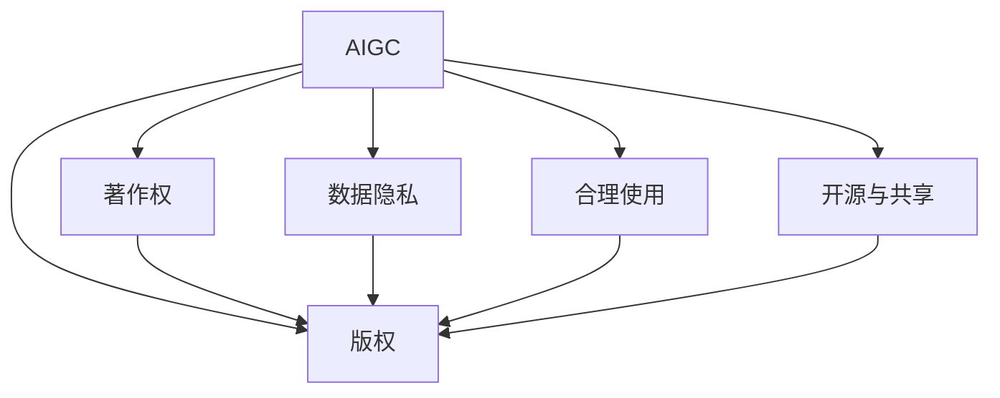

                 

# AI写作的版权问题：法律和伦理的思考

## 1. 背景介绍

### 1.1 问题由来

随着人工智能技术的发展，AI写作（AI Generated Content, AIGC）成为热门话题。从简单的文本生成到复杂的内容创作，AI写作展示了强大的潜力，对传统内容创作行业带来了革命性的影响。然而，AI写作也引发了一系列法律和伦理问题，特别是在版权归属、著作权保护、隐私保护等方面，亟需找到合理的解决方案。

### 1.2 问题核心关键点

AI写作的核心问题包括：
- AI生成的内容是否具有版权？
- 内容的创作过程与著作权归属的关系是什么？
- 如何平衡创新与版权保护？
- 如何处理数据隐私与内容创作之间的关系？

这些问题不仅仅是技术挑战，更涉及法律、伦理和社会公平等层面，需要跨学科的研究和多方利益相关者的参与。

## 2. 核心概念与联系

### 2.1 核心概念概述

为更好地理解AI写作及其引发的版权问题，本节将介绍几个密切相关的核心概念：

- AI写作(AIGC): 利用人工智能技术自动生成文本、音频、视频等内容的技术。包括基于规则、模板的系统，以及基于深度学习的大模型。
- 版权(Copyright): 法律赋予创作者对其作品的使用、传播、收益等权利，保护创作者的智力劳动成果。
- 著作权(Writing Rights): 创作作品的权利，与版权密切相关但含义不同，更多指创作活动的权利。
- 数据隐私(Data Privacy): 涉及个人数据和信息的安全和隐私保护，AI写作过程中需要特别关注。
- 合理使用(Fair Use): 法律允许在某些情况下，对受版权保护的作品进行非商业性使用，不构成侵权。
- 开源与共享(Open Source and Sharing): 强调代码和知识的共享，促进创新和知识传播，与版权保护有一定冲突。

这些概念之间的逻辑关系可以通过以下Mermaid流程图来展示：



这个流程图展示了AI写作与多个核心概念之间的联系：

1. AI写作生成的内容，涉及到版权、著作权保护，以及与数据隐私、合理使用和开源共享的关系。
2. 版权、著作权保护是AI写作中必须遵守的法律和伦理要求。
3. 数据隐私在AI写作中至关重要，特别是涉及个人隐私和敏感信息时。
4. 合理使用和开源共享为AI写作带来了更多的创新和合作机会，但也面临版权保护的挑战。

## 3. 核心算法原理 & 具体操作步骤

### 3.1 算法原理概述

AI写作的算法原理主要基于自然语言处理(NLP)和深度学习技术。其中，预训练语言模型（如GPT、BERT等）通过大规模无标签数据预训练，学习到丰富的语言知识和模式，然后在特定任务上微调，生成满足需求的文本内容。这种生成过程本质上是模型参数的优化过程，与一般的机器学习算法相似。

### 3.2 算法步骤详解

AI写作的核心步骤包括：

1. **数据准备**：收集和标注训练数据，包括文本数据、图像数据等，用于预训练和微调。
2. **模型预训练**：使用大规模无标签数据进行自监督学习，学习到通用的语言表示。
3. **任务微调**：选择特定任务，如文本生成、摘要、对话等，对预训练模型进行微调，优化模型在该任务上的表现。
4. **内容生成**：根据输入的种子文本或提示，生成满足特定需求的新内容。

### 3.3 算法优缺点

AI写作的算法优点包括：
- 高效生成内容：通过深度学习模型可以快速生成大量高质量文本。
- 多样化应用：适用于多种文本生成任务，如新闻报道、故事创作、法律文书等。
- 减少人工工作：减轻作者的工作负担，尤其在数据分析、内容整理方面。

算法缺点包括：
- 缺乏创意：生成的内容可能缺乏原创性和创新性，容易陷入固定模式。
- 缺乏人类情感：生成的文本可能缺乏情感深度和人文关怀。
- 版权问题：生成的内容可能涉及版权侵权，尤其是大规模复制现有作品。

### 3.4 算法应用领域

AI写作在多个领域都有广泛应用，包括但不限于：

- 新闻报道：自动生成新闻摘要和报道，提高生产效率。
- 文学创作：生成小说、诗歌等文学作品，激发创作灵感。
- 法律文书：生成合同、法律意见书等，辅助法律事务。
- 商业广告：自动生成广告文案和内容，提高营销效果。
- 教育培训：生成教学材料和习题，辅助教育学习。

## 4. 数学模型和公式 & 详细讲解 & 举例说明

### 4.1 数学模型构建

AI写作的数学模型主要基于深度学习框架，如TensorFlow、PyTorch等。以文本生成任务为例，模型的输入是文本序列，输出是下一个可能出现的字符或单词。目标是通过优化模型参数，使得模型生成的文本与目标文本最接近。

### 4.2 公式推导过程

文本生成任务的目标函数可以表示为：

$$
\min_{\theta} \sum_{i=1}^N \log p(y_i|x_i; \theta)
$$

其中，$x_i$ 是输入文本序列，$y_i$ 是目标输出字符，$\theta$ 是模型参数。模型通过最大化目标函数的似然值，学习生成目标文本的概率分布。

### 4.3 案例分析与讲解

以GPT-3模型为例，其基于Transformer架构，使用多层自注意力机制和残差连接，可以高效地生成高质量文本。在微调过程中，可以通过添加任务特定的输出层和损失函数，调整模型输出与任务需求相匹配。

## 5. 项目实践：代码实例和详细解释说明

### 5.1 开发环境搭建

在进行AI写作实践前，我们需要准备好开发环境。以下是使用Python进行PyTorch开发的环境配置流程：

1. 安装Anaconda：从官网下载并安装Anaconda，用于创建独立的Python环境。

2. 创建并激活虚拟环境：
```bash
conda create -n pytorch-env python=3.8 
conda activate pytorch-env
```

3. 安装PyTorch：根据CUDA版本，从官网获取对应的安装命令。例如：
```bash
conda install pytorch torchvision torchaudio cudatoolkit=11.1 -c pytorch -c conda-forge
```

4. 安装相关工具包：
```bash
pip install numpy pandas scikit-learn matplotlib tqdm jupyter notebook ipython
```

完成上述步骤后，即可在`pytorch-env`环境中开始AI写作实践。

### 5.2 源代码详细实现

这里我们以使用GPT-3模型进行文本生成任务为例，给出使用Transformers库进行AI写作的PyTorch代码实现。

首先，定义数据处理函数：

```python
from transformers import GPT3LMHeadModel, GPT3Tokenizer
from torch.utils.data import Dataset, DataLoader
import torch

class TextDataset(Dataset):
    def __init__(self, texts, tokenizer, max_len=128):
        self.texts = texts
        self.tokenizer = tokenizer
        self.max_len = max_len
        
    def __len__(self):
        return len(self.texts)
    
    def __getitem__(self, item):
        text = self.texts[item]
        encoding = self.tokenizer(text, return_tensors='pt', max_length=self.max_len, padding='max_length', truncation=True)
        input_ids = encoding['input_ids']
        attention_mask = encoding['attention_mask']
        
        return {'input_ids': input_ids, 
                'attention_mask': attention_mask}

# 初始化GPT-3模型和tokenizer
model = GPT3LMHeadModel.from_pretrained('gpt3')
tokenizer = GPT3Tokenizer.from_pretrained('gpt3')

# 创建dataset
text_dataset = TextDataset(texts, tokenizer)
```

然后，定义模型和优化器：

```python
from transformers import AdamW

optimizer = AdamW(model.parameters(), lr=2e-5)
```

接着，定义训练和评估函数：

```python
from tqdm import tqdm

device = torch.device('cuda') if torch.cuda.is_available() else torch.device('cpu')
model.to(device)

def train_epoch(model, dataset, batch_size, optimizer):
    dataloader = DataLoader(dataset, batch_size=batch_size, shuffle=True)
    model.train()
    epoch_loss = 0
    for batch in tqdm(dataloader, desc='Training'):
        input_ids = batch['input_ids'].to(device)
        attention_mask = batch['attention_mask'].to(device)
        model.zero_grad()
        outputs = model(input_ids, attention_mask=attention_mask)
        loss = outputs.loss
        epoch_loss += loss.item()
        loss.backward()
        optimizer.step()
    return epoch_loss / len(dataloader)

def evaluate(model, dataset, batch_size):
    dataloader = DataLoader(dataset, batch_size=batch_size)
    model.eval()
    preds, labels = [], []
    with torch.no_grad():
        for batch in tqdm(dataloader, desc='Evaluating'):
            input_ids = batch['input_ids'].to(device)
            attention_mask = batch['attention_mask'].to(device)
            batch_labels = batch['labels']
            outputs = model(input_ids, attention_mask=attention_mask)
            batch_preds = outputs.logits.argmax(dim=2).to('cpu').tolist()
            batch_labels = batch_labels.to('cpu').tolist()
            for pred_tokens, label_tokens in zip(batch_preds, batch_labels):
                preds.append(pred_tokens[:len(label_tokens)])
                labels.append(label_tokens)
                
    return preds, labels

def generate_text(model, tokenizer, prompt, num_words=100):
    input_ids = tokenizer(prompt, return_tensors='pt', max_length=128, padding='max_length', truncation=True).input_ids
    input_ids = input_ids.to(device)
    attention_mask = input_ids.new_ones(input_ids.shape).to(device)
    outputs = model.generate(input_ids, max_length=num_words, top_p=0.9, top_k=50, temperature=0.7)
    generated_text = tokenizer.decode(outputs[0], skip_special_tokens=True)
    return generated_text

# 训练模型
epochs = 5
batch_size = 16

for epoch in range(epochs):
    loss = train_epoch(model, text_dataset, batch_size, optimizer)
    print(f"Epoch {epoch+1}, train loss: {loss:.3f}")
    
# 生成文本
generated_text = generate_text(model, tokenizer, "你好，世界")
print(generated_text)
```

以上就是使用PyTorch对GPT-3进行文本生成任务微调的完整代码实现。可以看到，得益于Transformers库的强大封装，我们可以用相对简洁的代码完成GPT-3模型的加载和微调。

### 5.3 代码解读与分析

让我们再详细解读一下关键代码的实现细节：

**TextDataset类**：
- `__init__`方法：初始化文本、分词器等关键组件。
- `__len__`方法：返回数据集的样本数量。
- `__getitem__`方法：对单个样本进行处理，将文本输入编码为token ids，并进行定长padding。

**generate_text函数**：
- 利用`tokenizer`将提示文本转换为模型可接受的输入格式，并进行定长padding。
- 使用模型生成文本，返回生成的文本内容。

可以看到，PyTorch配合Transformers库使得GPT-3微调的代码实现变得简洁高效。开发者可以将更多精力放在模型优化、数据预处理等高层逻辑上，而不必过多关注底层的实现细节。

当然，工业级的系统实现还需考虑更多因素，如模型的保存和部署、超参数的自动搜索、更灵活的任务适配层等。但核心的微调范式基本与此类似。

## 6. 实际应用场景

### 6.1 新闻报道

AI写作在新闻报道领域的应用，可以帮助新闻机构自动化生成新闻摘要和报道。例如，《华盛顿邮报》和《纽约时报》等媒体已经在使用AI生成新闻摘要，大幅提高了内容生产效率。

### 6.2 文学创作

AI写作在文学创作中的应用，可以辅助作家进行创作。例如，OpenAI的DALL·E可以生成图像，而AI书生·韦伯可以帮助作家进行情节构思、人物塑造等。

### 6.3 法律文书

AI写作在法律文书中的应用，可以生成合同、法律意见书等。例如，GPT-3在HuggingFace的Large Language Model在法律领域中生成的法律文书，已经得到了专业人士的好评。

### 6.4 商业广告

AI写作在商业广告中的应用，可以生成广告文案和内容。例如，Twitter等社交媒体平台已经开始使用AI生成广告内容，提升营销效果。

### 6.5 教育培训

AI写作在教育培训中的应用，可以生成教学材料和习题。例如，Khan Academy已经使用AI生成数学习题，辅助学生学习。

## 7. 工具和资源推荐

### 7.1 学习资源推荐

为了帮助开发者系统掌握AI写作的理论基础和实践技巧，这里推荐一些优质的学习资源：

1. 《自然语言处理综论》系列书籍：深度介绍了NLP领域的核心概念和前沿技术，是学习AI写作的必读书籍。
2. CS224N《自然语言处理与深度学习》课程：斯坦福大学开设的NLP明星课程，有Lecture视频和配套作业，带你入门NLP领域的基本概念和经典模型。
3. 《深度学习》书籍：Ian Goodfellow的经典著作，介绍了深度学习的基本原理和算法，是学习AI写作的重要参考。
4. 《OpenAI GitHub》：OpenAI官方GitHub库，提供了众多AI写作的样例代码和研究论文，是学习AI写作的重要资源。

通过对这些资源的学习实践，相信你一定能够快速掌握AI写作的精髓，并用于解决实际的NLP问题。

### 7.2 开发工具推荐

高效的开发离不开优秀的工具支持。以下是几款用于AI写作开发的常用工具：

1. PyTorch：基于Python的开源深度学习框架，灵活动态的计算图，适合快速迭代研究。GPT-3等预训练语言模型都有PyTorch版本的实现。
2. TensorFlow：由Google主导开发的开源深度学习框架，生产部署方便，适合大规模工程应用。同样有丰富的预训练语言模型资源。
3. Transformers库：HuggingFace开发的NLP工具库，集成了众多SOTA语言模型，支持PyTorch和TensorFlow，是进行AI写作开发的利器。
4. Weights & Biases：模型训练的实验跟踪工具，可以记录和可视化模型训练过程中的各项指标，方便对比和调优。与主流深度学习框架无缝集成。
5. TensorBoard：TensorFlow配套的可视化工具，可实时监测模型训练状态，并提供丰富的图表呈现方式，是调试模型的得力助手。

合理利用这些工具，可以显著提升AI写作任务的开发效率，加快创新迭代的步伐。

### 7.3 相关论文推荐

AI写作技术的发展源于学界的持续研究。以下是几篇奠基性的相关论文，推荐阅读：

1. Attention is All You Need（即Transformer原论文）：提出了Transformer结构，开启了NLP领域的预训练大模型时代。
2. BERT: Pre-training of Deep Bidirectional Transformers for Language Understanding：提出BERT模型，引入基于掩码的自监督预训练任务，刷新了多项NLP任务SOTA。
3. Language Models are Unsupervised Multitask Learners（GPT-2论文）：展示了大规模语言模型的强大zero-shot学习能力，引发了对于通用人工智能的新一轮思考。
4. Adversarial Text Generation：引入对抗生成技术，生成更符合人类语境的文本。
5. Generative Adversarial Texts with GPT-2：将GAN技术应用于文本生成，生成高质量的文本内容。

这些论文代表了大语言模型AI写作技术的发展脉络。通过学习这些前沿成果，可以帮助研究者把握学科前进方向，激发更多的创新灵感。

## 8. 总结：未来发展趋势与挑战

### 8.1 总结

本文对AI写作的版权问题进行了全面系统的介绍。首先阐述了AI写作的产生背景和核心问题，明确了版权归属、著作权保护、数据隐私保护等关键点。其次，从原理到实践，详细讲解了AI写作的算法原理和关键步骤，给出了完整的代码实例。同时，本文还广泛探讨了AI写作在新闻报道、文学创作、法律文书等多个行业领域的应用前景，展示了AI写作的广阔前景。此外，本文精选了AI写作技术的各类学习资源，力求为读者提供全方位的技术指引。

通过本文的系统梳理，可以看到，AI写作技术正在迅速发展，对传统内容创作行业带来了革命性的影响。但其在版权、著作权保护、数据隐私等方面也引发了诸多法律和伦理问题，亟需找到合理的解决方案。相信随着学界和产业界的共同努力，这些挑战终将一一被克服，AI写作必将在构建人机协同的智能时代中扮演越来越重要的角色。

### 8.2 未来发展趋势

展望未来，AI写作技术将呈现以下几个发展趋势：

1. 模型规模持续增大。随着算力成本的下降和数据规模的扩张，预训练语言模型的参数量还将持续增长。超大规模语言模型蕴含的丰富语言知识，有望支撑更加复杂多变的AI写作任务。
2. 多样性提升。未来的AI写作模型将更加多样化，涵盖文本生成、图像生成、语音生成等多个领域，形成更加全面、灵活的内容创作系统。
3. 交互性增强。未来的AI写作将更加注重人机交互，通过对话生成、用户定制等方式，提升用户体验和创作效果。
4. 隐私保护强化。随着AI写作在个人化、情感化内容创作方面的应用增加，隐私保护将更加重要，需要更多的隐私保护技术支持。
5. 伦理规范完善。随着AI写作在商业、教育、法律等领域的广泛应用，其伦理规范将成为重要的研究课题，亟需建立健全的伦理框架。

以上趋势凸显了AI写作技术的广阔前景。这些方向的探索发展，必将进一步提升AI写作系统的性能和应用范围，为人类内容创作带来新的变革。

### 8.3 面临的挑战

尽管AI写作技术已经取得了显著进展，但在迈向更加智能化、普适化应用的过程中，仍面临诸多挑战：

1. 版权问题：AI生成的内容是否具有版权，如何定义创作与版权的关系，需要进一步探讨。
2. 数据隐私：AI写作过程中涉及大量用户数据，如何保护用户隐私，防止数据滥用，是一个重要问题。
3. 伦理规范：AI写作带来的伦理问题，如生成虚假信息、偏见性内容等，需要建立相应的规范和监管机制。
4. 技术挑战：AI写作模型的稳定性和鲁棒性需要进一步提升，以应对多样化的应用场景和复杂的数据。
5. 经济收益：AI写作带来的经济收益分配问题，如版权归属、创作者权益等，需要建立合理的激励机制。

解决这些挑战，需要跨学科的研究和多方利益相关者的参与，才能使AI写作技术健康发展。

### 8.4 研究展望

面对AI写作技术面临的种种挑战，未来的研究需要在以下几个方面寻求新的突破：

1. 版权归属问题：探索AI写作内容的版权归属，如何界定创作与版权的关系，建立相应的法律框架。
2. 数据隐私保护：开发更多的隐私保护技术，如差分隐私、联邦学习等，确保用户数据的安全和隐私。
3. 伦理规范制定：建立AI写作的伦理规范，防止虚假信息、偏见性内容的生成，确保内容的真实性和公正性。
4. 技术优化：开发更加高效、稳定的AI写作模型，提升模型的创作质量和鲁棒性。
5. 经济激励机制：建立合理的经济激励机制，保障创作者权益，促进AI写作技术的可持续发展。

这些研究方向的探索，必将引领AI写作技术迈向更高的台阶，为人类内容创作带来新的变革。只有勇于创新、敢于突破，才能不断拓展AI写作技术的边界，让智能技术更好地造福人类社会。

## 9. 附录：常见问题与解答

**Q1：AI写作是否涉及版权侵权？**

A: AI写作生成的内容可能涉及版权侵权，尤其是大规模复制现有作品。但需要注意的是，AI写作本身并不直接生成原创内容，而是通过训练和优化生成内容。如果生成的内容与现有作品相似，需要进一步界定是否构成侵权。

**Q2：AI写作生成的内容是否具有著作权？**

A: AI写作生成的内容是否具有著作权，取决于生成的内容是否构成原创。如果生成的内容是原创性的，且未侵犯现有作品的版权，则可以拥有著作权。

**Q3：如何平衡创新与版权保护？**

A: 创新与版权保护并不矛盾，需要在推动创新和技术发展的同时，保护创作者的合法权益。合理使用、知识共享等机制，可以在保障版权的前提下，促进技术和知识的传播。

**Q4：如何处理数据隐私与内容创作之间的关系？**

A: 在AI写作过程中，需要特别关注用户数据的隐私保护。采用差分隐私、联邦学习等技术，确保用户数据的安全和隐私。

**Q5：如何提高AI写作的创作质量和鲁棒性？**

A: 提高AI写作的创作质量和鲁棒性，需要从模型设计、数据标注、算法优化等多个方面入手。开发更加高效、稳定的AI写作模型，提升模型的创作质量和鲁棒性。

**Q6：如何确保AI写作内容的真实性和公正性？**

A: 确保AI写作内容的真实性和公正性，需要建立相应的伦理规范和监管机制。引入专家评审、人工干预等手段，确保生成的内容真实可信。

以上是常见问题的解答，希望能帮助你更好地理解AI写作及其引发的版权问题。

---

作者：禅与计算机程序设计艺术 / Zen and the Art of Computer Programming

