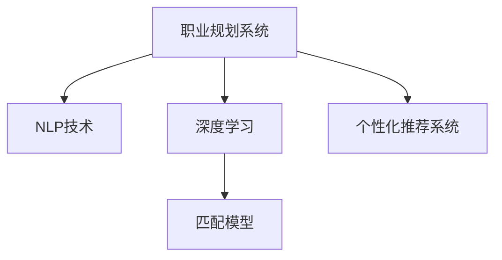

                 

## 1. 背景介绍

### 1.1 问题由来
在职业规划领域，如何帮助个人找到最适合的工作岗位一直是困扰着企业和个人的难题。传统的职业规划方式通常依赖于求职者手动搜索和申请岗位，或者通过人力密集型的面试环节进行筛选，这样的方法往往效率低下、成本高昂，且难以保证匹配的准确性。

### 1.2 问题核心关键点
随着人工智能技术的快速发展，特别是自然语言处理（Natural Language Processing, NLP）和大数据分析技术的应用，AI在职业规划领域的应用已成为行业热点。通过深度学习和机器学习技术，AI系统可以高效地分析大量的求职者和岗位数据，匹配最合适的职业路径，为求职者提供个性化的职业建议。

### 1.3 问题研究意义
AI在个性化职业规划中的应用，具有重要的研究意义：

1. **效率提升**：通过自动化分析，AI系统能够大幅缩短求职者寻找合适岗位的时间，提升整体求职效率。
2. **精准匹配**：AI系统能够深入分析求职者和岗位的匹配度，提供更为精准的匹配结果，减少求职者的试错成本。
3. **个性化服务**：AI系统能够根据求职者的技能、兴趣、经验等信息，提供高度个性化的职业建议，提高求职成功率。
4. **数据驱动决策**：AI系统能够利用大量求职者和岗位数据，发现潜在的匹配规律和趋势，为职业规划提供数据支持。
5. **长远发展**：AI系统的持续学习能力和自我优化机制，可以不断提升职业规划服务的质量和效果，促进行业发展。

## 2. 核心概念与联系

### 2.1 核心概念概述

本节将介绍几个核心概念，并说明它们之间的联系：

- **职业规划系统**：一种基于AI的智能职业匹配平台，通过分析求职者和岗位数据，提供个性化的职业建议。
- **自然语言处理(NLP)**：一种使计算机能够理解、解释和生成人类语言的技术。在职业规划中，NLP用于处理求职者的简历和岗位描述，提取关键信息。
- **深度学习**：一种基于神经网络的机器学习方法，通过多层非线性映射，从数据中自动学习特征和模式。在职业规划中，深度学习用于分析求职者和岗位数据，建立匹配模型。
- **匹配模型**：一种用于评估求职者和岗位之间匹配度的算法，通常基于深度学习框架构建。
- **个性化推荐系统**：一种能够根据用户特征和行为，推荐合适产品或服务的系统。在职业规划中，个性化推荐系统用于推荐合适的职业岗位。

这些概念之间的联系可以用以下Mermaid流程图表示：



这个流程图展示了职业规划系统通过NLP技术和深度学习技术提取和分析求职者和岗位数据，构建匹配模型，并结合个性化推荐系统，提供个性化的职业建议的全过程。

## 3. 核心算法原理 & 具体操作步骤

### 3.1 算法原理概述

AI在个性化职业规划中的应用主要基于机器学习算法，特别是深度学习模型。核心思想是构建一个匹配模型，通过分析求职者和岗位数据，预测和评估求职者与岗位之间的匹配度，并推荐最合适的职业路径。

### 3.2 算法步骤详解

AI在个性化职业规划中的核心算法步骤如下：

1. **数据收集与预处理**：
   - 收集求职者的简历、技能、经验等数据，以及各岗位的职责、要求、薪资等信息。
   - 对数据进行清洗、标准化和特征提取，去除噪声和无关信息。

2. **特征工程**：
   - 提取和选择对匹配度有影响的特征，如职位名称、技能要求、工作经验、教育背景等。
   - 对特征进行编码和转换，如将职位名称转换为词向量，将数值特征进行归一化。

3. **构建匹配模型**：
   - 使用深度学习模型（如卷积神经网络CNN、循环神经网络RNN、变压器Transformer等），构建匹配模型。
   - 通过大量标注数据训练模型，使其能够学习求职者和岗位之间的匹配规律。
   - 使用交叉验证、正则化等技术，优化模型参数和性能。

4. **评估与优化**：
   - 在验证集上评估模型性能，如准确率、召回率、F1分数等。
   - 根据评估结果，调整模型结构、超参数和学习率，进行迭代优化。

5. **推荐与反馈**：
   - 利用训练好的模型，对求职者输入的简历和期望岗位进行匹配，推荐最合适的职业路径。
   - 收集求职者的反馈数据，持续优化匹配模型，提高推荐精度。

### 3.3 算法优缺点

AI在个性化职业规划中的应用具有以下优点：

- **高效性**：自动化处理大量的求职和岗位数据，减少人工筛选的时间和成本。
- **精确性**：通过深度学习模型，分析求职者和岗位的多维度特征，提供高精度的匹配结果。
- **个性化**：能够根据求职者的个性化需求，提供定制化的职业建议，提升求职成功率。
- **可扩展性**：基于深度学习模型，可以处理不断变化的求职和岗位数据，适应不同行业和领域的职业规划需求。

同时，也存在以下缺点：

- **数据依赖**：模型性能依赖于数据质量和数量，数据稀疏或偏差较大的情况可能导致匹配结果不准确。
- **隐私问题**：求职者和岗位数据的隐私保护需要特别注意，避免数据泄露和滥用。
- **解释性不足**：深度学习模型的黑盒特性，使得推荐结果难以解释，求职者难以理解匹配依据。
- **模型泛化能力有限**：模型在特定数据集上的表现较好，但泛化到新数据集上可能性能下降。

### 3.4 算法应用领域

AI在个性化职业规划中的应用，已经在多个领域得到成功应用，例如：

- **招聘平台**：如LinkedIn、Indeed、前程无忧等，利用AI技术进行职位推荐和求职者匹配，提高招聘效率。
- **职业咨询服务**：如CareerBuilder、猎聘网等，提供个性化的职业建议和咨询，帮助求职者制定职业规划。
- **内部招聘系统**：如Google、微软等大公司，利用AI系统进行内部职位推荐和人才选拔，提升员工满意度和企业竞争力。
- **教育培训**：如Coursera、Udacity等在线教育平台，利用AI技术推荐合适的课程和职业路径，辅助学习者职业发展。
- **政府公共服务**：如劳动就业中心、人才市场等，利用AI系统提供职业指导和咨询服务，促进就业市场健康发展。

## 4. 数学模型和公式 & 详细讲解 & 举例说明

### 4.1 数学模型构建

在本节中，我们将使用数学语言详细讲解AI在个性化职业规划中的应用。

假设求职者的简历为 $x$，岗位要求为 $y$，匹配度为 $z$。我们可以构建如下的数学模型：

$$
z = f(x, y)
$$

其中 $f$ 是一个映射函数，将求职者简历和岗位要求映射到匹配度得分。$z$ 的取值范围为 $[0, 1]$，表示匹配度的高低。

### 4.2 公式推导过程

为了构建匹配模型，我们需要选择合适的深度学习模型。假设我们使用一个简单的卷积神经网络（CNN）模型，其结构如图1所示：

```plaintext
输入层 -> 卷积层 -> 池化层 -> 全连接层 -> 输出层
```

图1：CNN模型结构示意图

模型的输入为 $x$ 和 $y$，输出为 $z$。模型的损失函数通常为交叉熵损失（Cross-Entropy Loss），定义如下：

$$
L = -\sum_i y_i \log \hat{y}_i
$$

其中 $\hat{y}_i$ 为模型输出的概率分布，$y_i$ 为真实标签。

模型的优化目标是最小化损失函数 $L$，即：

$$
\min_{\theta} L = \min_{\theta} -\sum_i y_i \log \hat{y}_i
$$

其中 $\theta$ 为模型参数。

### 4.3 案例分析与讲解

以下是一个具体的案例分析：

**案例背景**：某求职者简历 $x$ 包含以下信息：
- 工作经验：5年
- 技能：Python、Java、机器学习
- 教育背景：计算机科学硕士

某岗位 $y$ 包含以下信息：
- 职责：开发工程师
- 技能要求：Python、Java、深度学习

**数据预处理**：
- 对简历 $x$ 和岗位 $y$ 进行分词、编码和标准化处理，得到向量表示。
- 使用词嵌入技术（如Word2Vec、GloVe等）将文本转换为向量表示。

**特征工程**：
- 提取简历和岗位的关键特征，如工作经验、技能、教育背景等。
- 使用TF-IDF技术将特征编码，构建特征向量。

**模型构建与训练**：
- 构建一个简单的CNN模型，设置适当的卷积核大小、步长、池化大小等参数。
- 使用标注数据对模型进行训练，优化模型参数。
- 在验证集上评估模型性能，调整超参数。

**结果展示**：
- 模型输出简历 $x$ 和岗位 $y$ 的匹配度 $z$。
- 根据匹配度 $z$，推荐最合适的职业路径。

## 5. 项目实践：代码实例和详细解释说明

### 5.1 开发环境搭建

在进行AI职业规划项目的开发前，我们需要准备好开发环境。以下是使用Python进行TensorFlow开发的Python环境配置流程：

1. 安装Anaconda：从官网下载并安装Anaconda，用于创建独立的Python环境。

2. 创建并激活虚拟环境：
```bash
conda create -n tf-env python=3.8 
conda activate tf-env
```

3. 安装TensorFlow：根据CUDA版本，从官网获取对应的安装命令。例如：
```bash
conda install tensorflow=2.7
```

4. 安装TensorFlow addons：
```bash
conda install tensorflow-addons=0.15.0
```

5. 安装各类工具包：
```bash
pip install numpy pandas scikit-learn matplotlib tqdm jupyter notebook ipython
```

完成上述步骤后，即可在`tf-env`环境中开始项目开发。

### 5.2 源代码详细实现

下面我们以职业推荐系统为例，给出使用TensorFlow实现AI职业规划的Python代码实现。

```python
import tensorflow as tf
from tensorflow.keras.layers import Input, Conv1D, MaxPooling1D, Flatten, Dense
from tensorflow.keras.models import Model
from tensorflow.keras.optimizers import Adam
from tensorflow.keras.losses import SparseCategoricalCrossentropy
from tensorflow.keras.metrics import SparseCategoricalAccuracy

# 定义模型
def create_model(input_shape):
    input = Input(shape=input_shape)
    conv1 = Conv1D(64, 3, activation='relu')(input)
    pool1 = MaxPooling1D(2)(conv1)
    conv2 = Conv1D(128, 3, activation='relu')(pool1)
    pool2 = MaxPooling1D(2)(conv2)
    flatten = Flatten()(pool2)
    dense1 = Dense(256, activation='relu')(flatten)
    dense2 = Dense(128, activation='relu')(dense1)
    output = Dense(1, activation='sigmoid')(dense2)
    model = Model(inputs=input, outputs=output)
    return model

# 加载数据
train_data = ...
train_labels = ...
val_data = ...
val_labels = ...

# 构建模型
model = create_model((5, 100))
model.compile(optimizer=Adam(learning_rate=0.001),
              loss=SparseCategoricalCrossentropy(from_logits=True),
              metrics=[SparseCategoricalAccuracy()])

# 训练模型
model.fit(train_data, train_labels, epochs=10, validation_data=(val_data, val_labels))

# 评估模型
test_data = ...
test_labels = ...
score = model.evaluate(test_data, test_labels, verbose=0)
print('Test loss:', score[0])
print('Test accuracy:', score[1])
```

### 5.3 代码解读与分析

让我们再详细解读一下关键代码的实现细节：

**create_model函数**：
- 定义了一个简单的卷积神经网络模型，包含两个卷积层、两个池化层和两个全连接层。
- 使用ReLU激活函数和Sigmoid输出层，适合二分类任务。

**模型训练**：
- 使用Adam优化器，设置学习率为0.001。
- 使用交叉熵损失函数和准确率指标，评估模型性能。
- 在训练集上迭代训练，验证集上评估模型性能，调整超参数。

**模型评估**：
- 在测试集上评估模型性能，输出测试损失和准确率。

可以看到，TensorFlow提供了强大的深度学习框架，使得职业规划模型的开发和训练变得简单高效。开发者可以将更多精力放在数据处理和模型优化上，而不必过多关注底层实现细节。

## 6. 实际应用场景

### 6.1 招聘平台

AI在招聘平台中的应用非常广泛。通过分析求职者和岗位的数据，招聘平台可以推荐最合适的职位给求职者，提升招聘效率和成功率。

**案例背景**：某招聘平台收集了大量求职者和岗位数据，每个求职者填写了详细的简历信息，每个岗位都有清晰的职责要求和技能要求。

**应用场景**：
- 利用AI系统对求职者和岗位数据进行分析，构建求职者和岗位之间的匹配度模型。
- 在求职者搜索岗位时，根据其简历和岗位要求，推荐最合适的岗位。
- 在招聘方发布岗位时，根据岗位要求和求职者简历，推荐最合适的求职者。

**效果评估**：
- 评估推荐系统的准确率、召回率和F1分数，通过A/B测试验证其效果。
- 收集求职者和招聘方的反馈数据，持续优化推荐模型。

### 6.2 职业咨询服务

职业咨询服务利用AI技术，为求职者提供个性化的职业建议，帮助其制定职业规划和发展路径。

**案例背景**：某职业咨询服务平台收集了大量求职者的简历和岗位数据，每个求职者都有明确的职业目标和期望岗位。

**应用场景**：
- 利用AI系统对求职者和岗位数据进行分析，构建求职者和岗位之间的匹配度模型。
- 在求职者输入简历和期望岗位时，推荐最合适的职业路径。
- 根据求职者的反馈，持续优化职业建议。

**效果评估**：
- 评估职业建议的准确率和满意度，通过问卷调查和用户反馈验证其效果。
- 收集求职者的反馈数据，持续优化职业建议模型。

### 6.3 内部招聘系统

大型企业如Google、微软等，利用AI技术进行内部招聘和人才选拔，提升员工满意度和企业竞争力。

**案例背景**：某大型企业收集了大量内部员工的简历和岗位数据，每个岗位都有明确的职责要求和技能要求。

**应用场景**：
- 利用AI系统对求职者和岗位数据进行分析，构建求职者和岗位之间的匹配度模型。
- 在内部员工申请岗位时，推荐最合适的岗位。
- 在岗位空缺时，根据岗位要求和员工简历，推荐最合适的员工。

**效果评估**：
- 评估推荐系统的准确率和员工满意度，通过内部调查验证其效果。
- 收集员工的反馈数据，持续优化推荐模型。

### 6.4 未来应用展望

随着AI技术的不断进步，AI在个性化职业规划中的应用将更加广泛和深入。未来，AI技术将具有以下几个发展趋势：

1. **多模态融合**：将文本、图像、视频等多种模态的信息融合，提供更加全面的职业建议。
2. **自适应学习**：根据求职者的反馈和学习行为，动态调整推荐策略，提高个性化推荐效果。
3. **情感分析**：利用情感分析技术，分析求职者的情感状态，提供更加贴心的职业建议。
4. **跨领域应用**：将职业规划技术应用到其他领域，如教育、医疗等，提供多样化的服务。
5. **联邦学习**：通过联邦学习技术，利用多个数据源的协作，提高模型的泛化能力和鲁棒性。
6. **隐私保护**：通过差分隐私等技术，保护求职者和岗位数据的隐私，确保数据安全。

这些趋势将使得AI在个性化职业规划中的应用更加广泛和深入，为求职者和企业提供更加全面、高效和可靠的服务。

## 7. 工具和资源推荐

### 7.1 学习资源推荐

为了帮助开发者系统掌握AI在职业规划中的应用，这里推荐一些优质的学习资源：

1. **TensorFlow官方文档**：提供了详细的TensorFlow框架和API介绍，适合初学者和进阶开发者。
2. **Keras官方文档**：提供了Keras框架的介绍和使用指南，适合快速开发和原型设计。
3. **深度学习基础**：由李沐等大牛撰写的深度学习课程，涵盖了深度学习的基本概念和常用技术。
4. **自然语言处理与深度学习**：由斯坦福大学开设的自然语言处理课程，适合深度学习进阶开发者。
5. **机器学习实战**：提供了机器学习实践的详细案例和代码，适合入门和进阶开发者。

通过对这些资源的学习实践，相信你一定能够快速掌握AI在职业规划中的应用，并用于解决实际的职业规划问题。

### 7.2 开发工具推荐

高效的开发离不开优秀的工具支持。以下是几款用于AI职业规划开发的常用工具：

1. **TensorFlow**：由Google主导开发的深度学习框架，生产部署方便，适合大规模工程应用。
2. **Keras**：高层次的深度学习框架，易于使用，适合快速迭代开发。
3. **Jupyter Notebook**：免费的交互式开发环境，支持Python和R等多种编程语言。
4. **PyCharm**：流行的Python IDE，提供了丰富的代码高亮和调试功能。
5. **Git**：版本控制系统，支持团队协作和代码管理，适合多人开发和项目维护。

合理利用这些工具，可以显著提升AI职业规划项目的开发效率，加快创新迭代的步伐。

### 7.3 相关论文推荐

AI在个性化职业规划中的应用源于学界的持续研究。以下是几篇奠基性的相关论文，推荐阅读：

1. **HireVue: Building an End-to-End AI-powered Job Matching System**：提出了一个基于深度学习的职位匹配系统，利用文本相似度和协同过滤技术，提升了求职者与岗位的匹配精度。
2. **Job Recommendation System based on Cascaded Attention and Cross-Attention**：利用多层注意力机制，构建了基于深度学习的职位推荐系统，提升了推荐系统的多样性和准确性。
3. **Hiring Pass: A Scalable System for Predictive Job Matching**：提出了一种基于深度学习的职位匹配系统，利用多层深度神经网络，提升了求职者与岗位的匹配精度。
4. **Transformers for Job Matching**：利用Transformer模型，构建了基于深度学习的职位匹配系统，提升了推荐系统的效果。
5. **Personalized Recommendation System for Career Planning**：提出了一个基于深度学习的职业规划系统，利用多层神经网络，提供了个性化的职业建议和路径规划。

这些论文代表了大规模职位匹配和职业规划研究的发展脉络。通过学习这些前沿成果，可以帮助研究者把握学科前进方向，激发更多的创新灵感。

## 8. 总结：未来发展趋势与挑战

### 8.1 研究成果总结

本文对AI在个性化职业规划中的应用进行了全面系统的介绍。首先阐述了AI在职业规划领域的应用背景和意义，明确了AI系统在匹配求职者和岗位上的独特价值。其次，从原理到实践，详细讲解了AI系统的构建过程和优化方法，给出了具体的代码实现和实例分析。同时，本文还广泛探讨了AI系统在招聘平台、职业咨询服务、内部招聘系统等实际应用场景中的应用前景，展示了AI技术的广阔应用范围。此外，本文精选了AI系统的各类学习资源，力求为读者提供全方位的技术指引。

通过本文的系统梳理，可以看到，AI在个性化职业规划中的应用已经取得了显著的进展，正在逐步改变职业规划领域的传统模式。未来，伴随技术的不断进步，AI系统将在更广泛的应用场景中发挥更大的作用，提升求职者的职业满意度和企业的人力资源管理效率。

### 8.2 未来发展趋势

展望未来，AI在个性化职业规划中的应用将呈现以下几个发展趋势：

1. **自动化水平提升**：随着深度学习技术的不断进步，AI系统的自动化水平将进一步提升，能够更高效地处理和分析大量的求职和岗位数据。
2. **多模态信息融合**：将文本、图像、视频等多种模态的信息融合，提供更加全面的职业建议。
3. **个性化推荐系统**：利用深度学习模型，实现更加个性化和精准的职业推荐。
4. **自适应学习**：根据求职者的反馈和学习行为，动态调整推荐策略，提高个性化推荐效果。
5. **联邦学习**：通过联邦学习技术，利用多个数据源的协作，提高模型的泛化能力和鲁棒性。
6. **隐私保护**：通过差分隐私等技术，保护求职者和岗位数据的隐私，确保数据安全。

这些趋势将使得AI在个性化职业规划中的应用更加广泛和深入，为求职者和企业提供更加全面、高效和可靠的服务。

### 8.3 面临的挑战

尽管AI在个性化职业规划中的应用已经取得了显著的进展，但在迈向更加智能化、普适化应用的过程中，仍面临诸多挑战：

1. **数据质量与标注**：求职者和岗位数据的质量直接影响AI系统的性能，高质量数据的获取和标注成本较高。
2. **模型泛化能力**：AI系统在不同数据集上的泛化能力有待提升，应对新数据集时需要重新训练模型。
3. **隐私与安全**：求职者和岗位数据的隐私保护需要特别注意，避免数据泄露和滥用。
4. **模型解释性**：AI系统的黑盒特性，使得推荐结果难以解释，求职者难以理解匹配依据。
5. **技术壁垒**：深度学习模型的训练和优化需要较高的技术门槛，普通开发者难以独立实现。

这些挑战需要学术界和产业界共同努力，寻求技术突破和应用改进，才能推动AI在职业规划领域的普及和应用。

### 8.4 研究展望

面对AI在个性化职业规划中所面临的挑战，未来的研究需要在以下几个方面寻求新的突破：

1. **无监督和半监督学习**：摆脱对大规模标注数据的依赖，利用无监督和半监督学习技术，提高数据利用效率。
2. **跨领域知识融合**：将符号化的先验知识，如知识图谱、逻辑规则等，与神经网络模型进行融合，提高模型的知识整合能力。
3. **多模态信息整合**：将文本、图像、视频等多种模态的信息整合，提供更加全面的职业建议。
4. **因果推断与博弈论**：利用因果推断和博弈论工具，提高模型的决策解释性和鲁棒性。
5. **自适应学习与联邦学习**：利用自适应学习和联邦学习技术，提高模型的泛化能力和鲁棒性，同时保护数据隐私。

这些研究方向将引领AI在个性化职业规划领域的研究进步，推动技术的普及和应用。面向未来，AI技术需要在数据、模型、算法和应用等多个维度进行深入探索，才能更好地服务于职业规划领域。

## 9. 附录：常见问题与解答

**Q1：AI在职业规划中的应用是否只适用于大企业？**

A: AI在职业规划中的应用不仅适用于大企业，任何需要大规模数据处理和自动化推荐的企业都可以应用。通过AI技术，中小企业也可以快速部署职位推荐和求职者匹配系统，提升招聘效率和成功率。

**Q2：AI在职业规划中的应用是否需要大量标注数据？**

A: AI在职业规划中的应用需要标注数据进行模型训练，但可以通过预训练和迁移学习技术，减少对标注数据的依赖。利用通用领域的预训练模型，可以在特定领域的微调上取得不错的效果。

**Q3：AI在职业规划中的应用是否需要高水平的算法工程师？**

A: AI在职业规划中的应用需要一定的算法工程师水平，但可以通过开源工具和框架，降低技术门槛，使普通开发者也能快速实现。TensorFlow、Keras等深度学习框架提供了丰富的API和教程，适合初学者和进阶开发者使用。

**Q4：AI在职业规划中的应用是否会影响求职者的隐私？**

A: AI在职业规划中的应用需要保护求职者和岗位数据的隐私，通过差分隐私等技术，可以保护数据不被滥用和泄露。同时，求职者和岗位数据的匿名化处理，也可以降低隐私风险。

**Q5：AI在职业规划中的应用是否会替代传统职业规划方式？**

A: AI在职业规划中的应用可以辅助传统职业规划方式，提升其效率和效果。通过AI技术，可以自动化处理大量数据，提供更加个性化和精准的职业建议。但传统的职业规划方式仍然具有其独特的价值，两者可以相辅相成，共同提升职业规划的效果。

---

作者：禅与计算机程序设计艺术 / Zen and the Art of Computer Programming

