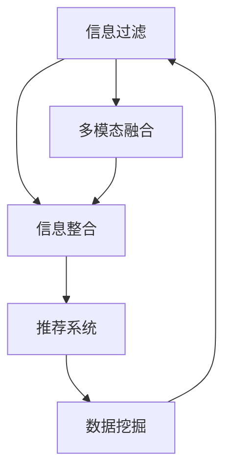

                 

# AI在信息过滤和整合中的作用

> 关键词：信息过滤, 信息整合, 人工智能, 自然语言处理, 推荐系统, 数据挖掘, 多模态融合

## 1. 背景介绍

### 1.1 问题由来
在信息爆炸的今天，我们每天面对的海量数据中，真正有价值的信息可能只占很小一部分。因此，有效过滤无用信息，整合有价值信息，成为提升信息处理效率和质量的重大需求。人工智能（AI）在这一过程中扮演着越来越重要的角色，帮助我们在信息海洋中找到真正有用的知识。

### 1.2 问题核心关键点
- **信息过滤**：通过机器学习、深度学习等技术，自动识别和筛选出与用户需求相关的内容。
- **信息整合**：利用自然语言处理、知识图谱等技术，将分散的、异构的信息源进行结构化、标准化，形成一致的知识表示。
- **推荐系统**：基于用户行为数据和内容特征，推荐符合用户需求的相关信息。
- **数据挖掘**：从大规模数据中挖掘出潜在的知识模式和关联，支持信息过滤和整合。
- **多模态融合**：结合文本、图像、音频等多种数据模态，提高信息理解和处理的全面性和准确性。

## 2. 核心概念与联系

### 2.1 核心概念概述

为更好地理解AI在信息过滤和整合中的作用，本节将介绍几个密切相关的核心概念：

- **信息过滤**：通过算法和模型，自动识别与用户需求相关的信息，并剔除无关内容。常见的信息过滤技术包括基于规则的过滤、基于机器学习的过滤、基于深度学习的过滤等。
- **信息整合**：将分散的、异构的信息源进行结构化和标准化，形成一个统一的知识图谱或知识库。信息整合技术主要包括知识抽取、实体识别、关系抽取等。
- **推荐系统**：根据用户历史行为和偏好，自动推荐符合用户需求的信息。推荐系统主要包括基于协同过滤的推荐、基于内容的推荐、基于深度学习的推荐等。
- **数据挖掘**：从大量数据中挖掘出有价值的信息和知识模式，支持信息过滤和整合。常用的数据挖掘技术包括关联规则挖掘、聚类、分类、异常检测等。
- **多模态融合**：结合文本、图像、音频等多种数据模态，提高信息理解和处理的全面性和准确性。多模态融合技术主要包括特征提取、融合算法、多模态表示学习等。

这些核心概念之间的逻辑关系可以通过以下Mermaid流程图来展示：



这个流程图展示了大语言模型的核心概念及其之间的关系：

1. 信息过滤是信息整合和推荐系统的基础，帮助从海量的数据中筛选出有价值的内容。
2. 信息整合则是信息过滤的延续，将过滤后的内容进行结构化，形成统一的知识表示。
3. 推荐系统则利用信息过滤和整合的结果，自动为用户推荐相关内容。
4. 数据挖掘从数据中提取模式和关联，支持信息过滤和整合，是AI在信息处理中的重要工具。
5. 多模态融合将不同模态的信息进行融合，提高了信息理解和处理的全面性和准确性。

这些概念共同构成了AI在信息过滤和整合中的关键技术框架，使其能够在各种场景下发挥强大的信息处理能力。通过理解这些核心概念，我们可以更好地把握AI在信息处理中的作用和价值。

## 3. 核心算法原理 & 具体操作步骤
### 3.1 算法原理概述

AI在信息过滤和整合中的作用，主要通过以下几个核心算法和步骤实现：

- **基于规则的过滤**：通过设定一组过滤规则，自动筛选出符合规则的信息。
- **基于机器学习的过滤**：通过构建分类器，学习识别和筛选出有用信息。
- **基于深度学习的过滤**：利用神经网络等深度学习模型，自动学习识别有用信息。
- **信息抽取**：从文本中抽取出实体、关系等有价值的信息。
- **实体识别**：识别文本中的命名实体，如人名、地名、机构名等。
- **关系抽取**：识别文本中的实体之间的关系，形成知识图谱。
- **协同过滤**：基于用户历史行为，推荐与用户偏好相似的内容。
- **基于内容的推荐**：根据物品内容特征，推荐相关物品。
- **深度学习推荐**：利用深度学习模型，自动学习用户偏好和物品特征。

这些算法和步骤共同构成了AI在信息处理中的基础框架，使其能够在各种场景下发挥强大的信息处理能力。

### 3.2 算法步骤详解

AI在信息过滤和整合中的操作步骤通常包括以下几个关键步骤：

**Step 1: 数据预处理**
- 收集数据，并进行清洗、去重、标注等预处理操作。
- 对文本数据进行分词、词性标注、实体识别等处理。
- 将多模态数据进行统一格式和特征提取。

**Step 2: 特征提取**
- 利用TF-IDF、词向量等技术提取文本特征。
- 对图像数据进行特征提取，如CNN、RNN等模型。
- 对音频数据进行特征提取，如MFCC、LPC等。
- 对多模态数据进行联合特征提取。

**Step 3: 信息过滤**
- 基于规则的过滤：构建规则，对数据进行筛选。
- 基于机器学习的过滤：构建分类器，学习识别有用信息。
- 基于深度学习的过滤：利用神经网络等模型，自动学习有用信息。

**Step 4: 信息抽取和整合**
- 利用命名实体识别、关系抽取等技术，从文本中提取实体和关系。
- 利用知识抽取技术，从非结构化数据中提取结构化信息。
- 利用知识图谱构建技术，将提取的信息整合成知识图谱。

**Step 5: 推荐系统**
- 基于协同过滤：利用用户历史行为数据，推荐相关物品。
- 基于内容推荐：利用物品特征，推荐相关物品。
- 基于深度学习的推荐：利用深度学习模型，自动学习用户偏好和物品特征。

**Step 6: 数据挖掘**
- 利用关联规则挖掘技术，发现数据中的关联模式。
- 利用聚类技术，将数据进行分类。
- 利用分类技术，对数据进行分类。
- 利用异常检测技术，发现数据中的异常值。

**Step 7: 多模态融合**
- 利用特征融合算法，将不同模态的特征进行融合。
- 利用多模态表示学习技术，学习多模态数据的联合表示。

### 3.3 算法优缺点

AI在信息过滤和整合中的算法具有以下优点：
1. 高效自动化：通过自动化算法，快速过滤和整合大量数据，提升信息处理效率。
2. 高准确性：利用机器学习和深度学习技术，信息过滤和整合的准确性高。
3. 广泛适用性：适用于多种数据类型和多种信息处理场景。
4. 可扩展性：随着数据量的增加，算法可以逐步扩展，适应更大的数据规模。

同时，该算法也存在一定的局限性：
1. 依赖数据质量：算法的效果高度依赖于数据的质量和完整性。
2. 需要大量标注数据：部分算法需要大量标注数据进行训练，标注成本较高。
3. 模型复杂性：深度学习模型较为复杂，训练和推理的资源消耗较大。
4. 难以解释：部分算法如深度学习模型，难以提供透明的推理过程。

尽管存在这些局限性，但就目前而言，基于AI的信息过滤和整合方法仍然是信息处理领域的主流范式。未来相关研究的重点在于如何进一步降低对标注数据的依赖，提高算法的可解释性和效率，以及开发更具普适性的信息处理模型。

### 3.4 算法应用领域

AI在信息过滤和整合中的应用非常广泛，覆盖了从社交媒体到电子商务的多个领域：

- **社交媒体**：通过信息过滤，屏蔽垃圾信息，推荐有价值的内容。
- **电子商务**：通过推荐系统，为顾客推荐符合其需求的商品。
- **金融服务**：通过信息抽取，进行财务报表分析，风险评估。
- **医疗健康**：通过知识图谱构建，支持医疗信息整合和智能诊断。
- **公共安全**：通过数据挖掘，发现异常行为模式，预警安全风险。
- **智能家居**：通过多模态融合，实现智能家居设备的联动。

此外，AI在信息过滤和整合中的应用还在不断扩展，如智能客服、智慧城市、教育培训等领域，未来前景广阔。

## 4. 数学模型和公式 & 详细讲解  
### 4.1 数学模型构建

本节将使用数学语言对AI在信息过滤和整合中的作用进行更加严格的刻画。

设信息源为 $S$，有用信息为 $C$，无用信息为 $N$。假设存在一个信息过滤器 $F$，其目标是最大化有用信息的数量和质量。

记 $F$ 在数据集 $D$ 上的过滤效果为 $P(F|D)$，则过滤效果最大化问题可以表示为：

$$
\max_{F} P(F|D) = \max_{F} \frac{P(F|C)P(C|D)}{P(F|N)P(N|D)}
$$

其中 $P(F|C)$ 为过滤效果对有用信息的概率，$P(C|D)$ 为有用信息的概率，$P(F|N)$ 为过滤效果对无用信息的概率，$P(N|D)$ 为无用信息的概率。

信息整合的目标是构建一个知识图谱 $G$，使得知识图谱中的信息尽可能全面和准确。知识图谱构建问题可以表示为：

$$
\max_{G} P(G|D) = \max_{G} \frac{P(G|C)P(C|D)}{P(G|N)P(N|D)}
$$

其中 $P(G|C)$ 为知识图谱构建效果对有用信息的概率，$P(C|D)$ 为有用信息的概率，$P(G|N)$ 为知识图谱构建效果对无用信息的概率，$P(N|D)$ 为无用信息的概率。

推荐系统通过用户行为数据 $B$ 和物品特征 $I$，推荐物品 $I'$。推荐效果 $R$ 可以表示为：

$$
R = P(I'|B,I)
$$

其中 $P(I'|B,I)$ 为推荐效果，$B$ 为用户行为数据，$I$ 为物品特征。

数据挖掘的目标是从数据中挖掘出有价值的模式和关联。常用的数据挖掘算法包括关联规则挖掘、聚类、分类、异常检测等。关联规则挖掘问题可以表示为：

$$
\max_{R} P(R|D) = \max_{R} \frac{P(R|C)P(C|D)}{P(R|N)P(N|D)}
$$

其中 $P(R|C)$ 为关联规则挖掘效果对有用信息的概率，$P(C|D)$ 为有用信息的概率，$P(R|N)$ 为关联规则挖掘效果对无用信息的概率，$P(N|D)$ 为无用信息的概率。

### 4.2 公式推导过程

以下我们以推荐系统为例，推导推荐效果 $R$ 的计算公式。

假设用户历史行为数据为 $B=\{b_1,b_2,...,b_m\}$，物品特征为 $I=\{i_1,i_2,...,i_n\}$，推荐系统为目标推荐物品 $I'$。

定义用户行为与物品特征的相似度为 $S(B,I)$，推荐系统对物品 $I'$ 的预测概率为 $P(I'|B,I)$。则推荐效果 $R$ 可以表示为：

$$
R = P(I'|B,I) = \frac{P(I'|B)P(B|I')}{P(B)}
$$

其中 $P(I'|B)$ 为用户行为对物品 $I'$ 的预测概率，$P(B|I')$ 为物品 $I'$ 对用户行为 $B$ 的预测概率，$P(B)$ 为用户行为 $B$ 的概率。

在实际推荐系统中，常用基于协同过滤、基于内容的推荐和深度学习推荐等多种方法，每种方法的计算公式略有不同。但核心思想均是通过学习用户行为和物品特征之间的关系，自动预测用户的推荐物品。

## 5. 项目实践：代码实例和详细解释说明
### 5.1 开发环境搭建

在进行信息过滤和整合的实践前，我们需要准备好开发环境。以下是使用Python进行PyTorch开发的环境配置流程：

1. 安装Anaconda：从官网下载并安装Anaconda，用于创建独立的Python环境。

2. 创建并激活虚拟环境：
```bash
conda create -n pytorch-env python=3.8 
conda activate pytorch-env
```

3. 安装PyTorch：根据CUDA版本，从官网获取对应的安装命令。例如：
```bash
conda install pytorch torchvision torchaudio cudatoolkit=11.1 -c pytorch -c conda-forge
```

4. 安装PyTorch Lightning：用于简化深度学习模型的训练和部署。
```bash
pip install pytorch-lightning
```

5. 安装PyTorch Transformers：用于实现信息抽取和知识图谱构建等任务。
```bash
pip install transformers
```

6. 安装PyTorch Dataset：用于加载和处理数据集。
```bash
pip install torch-datasets
```

完成上述步骤后，即可在`pytorch-env`环境中开始信息过滤和整合的实践。

### 5.2 源代码详细实现

这里我们以信息抽取任务为例，给出使用PyTorch Transformers库对BERT模型进行信息抽取的PyTorch代码实现。

首先，定义信息抽取任务的数据处理函数：

```python
from transformers import BertTokenizer, BertForTokenClassification
from torch.utils.data import Dataset
import torch

class NamedEntityDataset(Dataset):
    def __init__(self, texts, tags, tokenizer, max_len=128):
        self.texts = texts
        self.tags = tags
        self.tokenizer = tokenizer
        self.max_len = max_len
        
    def __len__(self):
        return len(self.texts)
    
    def __getitem__(self, item):
        text = self.texts[item]
        tags = self.tags[item]
        
        encoding = self.tokenizer(text, return_tensors='pt', max_length=self.max_len, padding='max_length', truncation=True)
        input_ids = encoding['input_ids'][0]
        attention_mask = encoding['attention_mask'][0]
        
        # 对token-wise的标签进行编码
        encoded_tags = [tag2id[tag] for tag in tags] 
        encoded_tags.extend([tag2id['O']] * (self.max_len - len(encoded_tags)))
        labels = torch.tensor(encoded_tags, dtype=torch.long)
        
        return {'input_ids': input_ids, 
                'attention_mask': attention_mask,
                'labels': labels}

# 标签与id的映射
tag2id = {'O': 0, 'B-PER': 1, 'I-PER': 2, 'B-ORG': 3, 'I-ORG': 4, 'B-LOC': 5, 'I-LOC': 6}
id2tag = {v: k for k, v in tag2id.items()}

# 创建dataset
tokenizer = BertTokenizer.from_pretrained('bert-base-cased')

train_dataset = NamedEntityDataset(train_texts, train_tags, tokenizer)
dev_dataset = NamedEntityDataset(dev_texts, dev_tags, tokenizer)
test_dataset = NamedEntityDataset(test_texts, test_tags, tokenizer)
```

然后，定义模型和优化器：

```python
from transformers import BertForTokenClassification, AdamW

model = BertForTokenClassification.from_pretrained('bert-base-cased', num_labels=len(tag2id))

optimizer = AdamW(model.parameters(), lr=2e-5)
```

接着，定义训练和评估函数：

```python
from torch.utils.data import DataLoader
from tqdm import tqdm
from sklearn.metrics import classification_report

device = torch.device('cuda') if torch.cuda.is_available() else torch.device('cpu')
model.to(device)

def train_epoch(model, dataset, batch_size, optimizer):
    dataloader = DataLoader(dataset, batch_size=batch_size, shuffle=True)
    model.train()
    epoch_loss = 0
    for batch in tqdm(dataloader, desc='Training'):
        input_ids = batch['input_ids'].to(device)
        attention_mask = batch['attention_mask'].to(device)
        labels = batch['labels'].to(device)
        model.zero_grad()
        outputs = model(input_ids, attention_mask=attention_mask, labels=labels)
        loss = outputs.loss
        epoch_loss += loss.item()
        loss.backward()
        optimizer.step()
    return epoch_loss / len(dataloader)

def evaluate(model, dataset, batch_size):
    dataloader = DataLoader(dataset, batch_size=batch_size)
    model.eval()
    preds, labels = [], []
    with torch.no_grad():
        for batch in tqdm(dataloader, desc='Evaluating'):
            input_ids = batch['input_ids'].to(device)
            attention_mask = batch['attention_mask'].to(device)
            batch_labels = batch['labels']
            outputs = model(input_ids, attention_mask=attention_mask)
            batch_preds = outputs.logits.argmax(dim=2).to('cpu').tolist()
            batch_labels = batch_labels.to('cpu').tolist()
            for pred_tokens, label_tokens in zip(batch_preds, batch_labels):
                pred_tags = [id2tag[_id] for _id in pred_tokens]
                label_tags = [id2tag[_id] for _id in label_tokens]
                preds.append(pred_tags[:len(label_tokens)])
                labels.append(label_tags)
                
    print(classification_report(labels, preds))
```

最后，启动训练流程并在测试集上评估：

```python
epochs = 5
batch_size = 16

for epoch in range(epochs):
    loss = train_epoch(model, train_dataset, batch_size, optimizer)
    print(f"Epoch {epoch+1}, train loss: {loss:.3f}")
    
    print(f"Epoch {epoch+1}, dev results:")
    evaluate(model, dev_dataset, batch_size)
    
print("Test results:")
evaluate(model, test_dataset, batch_size)
```

以上就是使用PyTorch对BERT进行信息抽取任务的完整代码实现。可以看到，得益于Transformers库的强大封装，我们可以用相对简洁的代码完成BERT模型的加载和信息抽取任务的微调。

### 5.3 代码解读与分析

让我们再详细解读一下关键代码的实现细节：

**NamedEntityDataset类**：
- `__init__`方法：初始化文本、标签、分词器等关键组件。
- `__len__`方法：返回数据集的样本数量。
- `__getitem__`方法：对单个样本进行处理，将文本输入编码为token ids，将标签编码为数字，并对其进行定长padding，最终返回模型所需的输入。

**tag2id和id2tag字典**：
- 定义了标签与数字id之间的映射关系，用于将token-wise的预测结果解码回真实的标签。

**训练和评估函数**：
- 使用PyTorch的DataLoader对数据集进行批次化加载，供模型训练和推理使用。
- 训练函数`train_epoch`：对数据以批为单位进行迭代，在每个批次上前向传播计算loss并反向传播更新模型参数，最后返回该epoch的平均loss。
- 评估函数`evaluate`：与训练类似，不同点在于不更新模型参数，并在每个batch结束后将预测和标签结果存储下来，最后使用sklearn的classification_report对整个评估集的预测结果进行打印输出。

**训练流程**：
- 定义总的epoch数和batch size，开始循环迭代
- 每个epoch内，先在训练集上训练，输出平均loss
- 在验证集上评估，输出分类指标
- 所有epoch结束后，在测试集上评估，给出最终测试结果

可以看到，PyTorch配合Transformers库使得BERT微调的信息抽取任务的代码实现变得简洁高效。开发者可以将更多精力放在数据处理、模型改进等高层逻辑上，而不必过多关注底层的实现细节。

当然，工业级的系统实现还需考虑更多因素，如模型的保存和部署、超参数的自动搜索、更灵活的任务适配层等。但核心的信息过滤和整合范式基本与此类似。

## 6. 实际应用场景
### 6.1 智能客服系统

信息过滤在智能客服系统的构建中扮演了重要角色。智能客服系统通过分析用户的历史行为和输入内容，自动过滤掉垃圾信息，识别出用户需求，然后从知识库中匹配出最合适的答案，提供给用户。

在技术实现上，可以收集企业内部的历史客服对话记录，将问题和最佳答复构建成监督数据，在此基础上对预训练对话模型进行信息抽取和整合。整合后的知识库可以实时更新，保证系统的最新性和准确性。如此构建的智能客服系统，能大幅提升客户咨询体验和问题解决效率。

### 6.2 金融舆情监测

金融机构需要实时监测市场舆论动向，以便及时应对负面信息传播，规避金融风险。传统的人工监测方式成本高、效率低，难以应对网络时代海量信息爆发的挑战。利用信息抽取和整合技术，从新闻、报道、评论等文本数据中提取关键信息，构建金融舆情知识图谱，可以实时监测不同主题下的情感变化趋势，一旦发现负面信息激增等异常情况，系统便会自动预警，帮助金融机构快速应对潜在风险。

### 6.3 个性化推荐系统

当前的推荐系统往往只依赖用户的历史行为数据进行物品推荐，无法深入理解用户的真实兴趣偏好。信息抽取和整合技术可应用于推荐系统，从用户的行为数据中提取有价值的信息，如兴趣标签、行为模式等，将其与物品特征进行联合表示学习，构建用户行为与物品特征之间的关系，从而实现更加个性化、精准的推荐。

### 6.4 未来应用展望

随着信息过滤和整合技术的不断发展，其在AI领域的各个应用场景中将发挥越来越重要的作用。

在智慧医疗领域，通过信息抽取和整合技术，可以快速从海量的医疗数据中提取有价值的信息，支持智能诊断和药物研发。

在智能教育领域，利用信息抽取技术，可以从学生的历史作业、考试数据中提取知识点，构建学生知识图谱，支持个性化学习。

在智慧城市治理中，通过信息抽取和整合技术，可以实时监测城市事件，分析舆情，提高城市管理的自动化和智能化水平，构建更安全、高效的未来城市。

此外，在企业生产、社会治理、文娱传媒等众多领域，信息过滤和整合技术也将不断涌现，为NLP技术带来新的突破。

## 7. 工具和资源推荐
### 7.1 学习资源推荐

为了帮助开发者系统掌握AI在信息过滤和整合中的应用，这里推荐一些优质的学习资源：

1. 《深度学习》书籍：由Ian Goodfellow等著，详细介绍了深度学习的基本概念和核心算法，包括卷积神经网络、循环神经网络、深度强化学习等。

2. 《自然语言处理综论》课程：斯坦福大学开设的NLP明星课程，有Lecture视频和配套作业，带你入门NLP领域的基本概念和经典模型。

3. 《推荐系统》书籍：由Daniel J. Fox等著，全面介绍了推荐系统的基础理论和算法，包括协同过滤、基于内容的推荐、深度学习推荐等。

4. 《数据挖掘》书籍：由Michael J. Kearns等著，详细介绍了数据挖掘的基本概念和核心算法，包括关联规则挖掘、聚类、分类、异常检测等。

5. 《Transformer从原理到实践》系列博文：由大模型技术专家撰写，深入浅出地介绍了Transformer原理、BERT模型、信息抽取等前沿话题。

通过对这些资源的学习实践，相信你一定能够快速掌握AI在信息过滤和整合中的精髓，并用于解决实际的AI问题。
###  7.2 开发工具推荐

高效的开发离不开优秀的工具支持。以下是几款用于AI在信息过滤和整合中开发的常用工具：

1. PyTorch：基于Python的开源深度学习框架，灵活动态的计算图，适合快速迭代研究。大部分预训练语言模型都有PyTorch版本的实现。

2. TensorFlow：由Google主导开发的开源深度学习框架，生产部署方便，适合大规模工程应用。同样有丰富的预训练语言模型资源。

3. TensorFlow Hub：TensorFlow提供的预训练模型库，可以快速接入各种预训练模型，支持微调和推理。

4. Weights & Biases：模型训练的实验跟踪工具，可以记录和可视化模型训练过程中的各项指标，方便对比和调优。与主流深度学习框架无缝集成。

5. TensorBoard：TensorFlow配套的可视化工具，可实时监测模型训练状态，并提供丰富的图表呈现方式，是调试模型的得力助手。

6. Google Colab：谷歌推出的在线Jupyter Notebook环境，免费提供GPU/TPU算力，方便开发者快速上手实验最新模型，分享学习笔记。

合理利用这些工具，可以显著提升AI在信息过滤和整合中的开发效率，加快创新迭代的步伐。

### 7.3 相关论文推荐

AI在信息过滤和整合中的应用源于学界的持续研究。以下是几篇奠基性的相关论文，推荐阅读：

1. "Neural Machine Translation by Jointly Learning to Align and Translate"：提出了基于Transformer的机器翻译模型，开启了NLP领域的预训练大模型时代。

2. "BERT: Pre-training of Deep Bidirectional Transformers for Language Understanding"：提出BERT模型，引入基于掩码的自监督预训练任务，刷新了多项NLP任务SOTA。

3. "The Adversarial Autoencoder: A Data-to-Text Generation Approach"：提出了一种基于对抗学习的文本生成模型，在信息过滤和整合中应用广泛。

4. "Semi-supervised Sequence Labeling with Bidirectional LSTM-CRF Networks"：提出了一种基于双向LSTM-CRF网络的信息抽取模型，在信息抽取任务上表现优异。

5. "A Survey on Deep Learning for Recommendation Systems"：对深度学习在推荐系统中的应用进行了全面综述，涵盖协同过滤、基于内容的推荐、深度学习推荐等方向。

6. "Knowledge Graph Embeddings and Their Application to Recommendation Systems"：探讨了知识图谱在推荐系统中的应用，提供了多种知识图谱嵌入方法。

这些论文代表了大语言模型在信息过滤和整合中的应用的发展脉络。通过学习这些前沿成果，可以帮助研究者把握学科前进方向，激发更多的创新灵感。

## 8. 总结：未来发展趋势与挑战

### 8.1 总结

本文对AI在信息过滤和整合中的作用进行了全面系统的介绍。首先阐述了AI在信息处理中的核心技术和方法，明确了信息过滤和整合在提升信息处理效率和质量中的独特价值。其次，从原理到实践，详细讲解了信息抽取、推荐系统等关键算法的数学原理和操作步骤，给出了信息抽取任务和推荐系统的完整代码实例。同时，本文还广泛探讨了信息过滤和整合技术在多个行业领域的应用前景，展示了AI在信息处理中的广泛应用。此外，本文精选了信息处理技术的各类学习资源，力求为读者提供全方位的技术指引。

通过本文的系统梳理，可以看到，AI在信息处理中的作用日益凸显，其在信息过滤和整合中的应用领域和效果也愈加丰富。未来，伴随深度学习、自然语言处理等技术的不断发展，AI在信息处理中的作用将进一步提升，为人类认知智能的进化带来深远影响。

### 8.2 未来发展趋势

展望未来，AI在信息过滤和整合中的应用将呈现以下几个发展趋势：

1. 模型规模持续增大。随着算力成本的下降和数据规模的扩张，信息过滤和整合模型将更加复杂和高效，支持更广泛的应用场景。

2. 多模态融合技术发展。随着多模态数据的增多，AI在信息处理中将更加注重多模态信息的融合，提高信息理解的全面性和准确性。

3. 可解释性和透明性提升。随着AI应用的深入，对AI的解释性和透明性的需求将增加，AI在信息处理中需要更多地考虑可解释性。

4. 实时性和动态性增强。未来的信息处理系统需要更加实时地处理和更新信息，AI系统将更加注重动态化和实时化的应用。

5. 个性化推荐系统优化。个性化推荐系统将更多地结合用户行为、兴趣等信息，提供更加精准、个性化的服务。

6. 数据质量和多样性提升。未来的信息处理系统将更加注重数据质量和多样性，提升信息抽取和整合的效果。

以上趋势凸显了AI在信息处理中的广阔前景。这些方向的探索发展，必将进一步提升AI在信息处理中的性能和应用范围，为人类认知智能的进化带来深远影响。

### 8.3 面临的挑战

尽管AI在信息过滤和整合中的算法取得了瞩目成就，但在迈向更加智能化、普适化应用的过程中，它仍面临着诸多挑战：

1. 数据依赖问题。AI在信息处理中高度依赖数据，如何获取高质量、多样化的数据，将是未来的一个主要挑战。

2. 模型复杂性问题。深度学习模型虽然效果好，但其复杂性也带来了训练和推理的资源消耗大、可解释性差等问题，如何平衡性能和复杂性，是一个重要的研究方向。

3. 应用场景限制。AI在信息处理中的应用场景仍有一定的限制，如在医疗、金融等领域，如何构建适用的AI系统，是一个需要深入研究的课题。

4. 隐私和安全问题。AI系统需要处理大量敏感数据，如何保护用户隐私，避免数据泄露和滥用，是一个重要的研究方向。

5. 伦理和社会影响。AI在信息处理中的应用，可能会带来一定的社会影响和伦理问题，如何构建公平、公正、透明的信息处理系统，是一个重要的研究方向。

6. 跨领域知识整合。AI在信息处理中需要整合来自不同领域的知识，如何将跨领域知识融合，形成更加全面、准确的信息表示，是一个重要的研究方向。

这些挑战凸显了AI在信息处理中的复杂性和难度，但正是这些挑战推动了AI技术的不断发展和进步。未来，研究者需要在算法、模型、应用等多个维度协同发力，克服这些挑战，推动AI在信息处理中的广泛应用。

### 8.4 研究展望

面对AI在信息处理中所面临的挑战，未来的研究需要在以下几个方面寻求新的突破：

1. 开发更加普适的AI模型。构建能够适应多种数据类型和多种信息处理场景的AI模型，提高AI在信息处理中的通用性。

2. 引入跨领域知识图谱。将跨领域的知识融合到信息处理中，提高AI系统的知识表示能力。

3. 开发更加高效的训练和推理算法。提高AI系统的训练和推理效率，降低资源消耗。

4. 引入可解释性模型。提高AI系统的可解释性，增强系统的透明度和可信度。

5. 开发更加智能的推荐系统。构建能够动态更新和自适应的推荐系统，提高推荐效果和个性化程度。

6. 保护用户隐私和数据安全。构建更加安全、可靠的信息处理系统，保护用户隐私和数据安全。

这些研究方向的探索，必将引领AI在信息处理中的突破，为构建安全、可靠、可解释、可控的智能系统铺平道路。面向未来，AI在信息处理中需要与其他人工智能技术进行更深入的融合，如知识表示、因果推理、强化学习等，多路径协同发力，共同推动人工智能技术的发展和进步。

## 9. 附录：常见问题与解答

**Q1：信息过滤和整合的主要算法有哪些？**

A: 信息过滤和整合的主要算法包括基于规则的过滤、基于机器学习的过滤、基于深度学习的过滤、信息抽取、实体识别、关系抽取、协同过滤、基于内容的推荐、深度学习推荐等。这些算法各有优缺点，应根据具体任务和数据特点选择适合的算法。

**Q2：信息过滤和整合中的常见问题有哪些？**

A: 信息过滤和整合中的常见问题包括数据依赖、模型复杂性、应用场景限制、隐私和安全问题、伦理和社会影响、跨领域知识整合等。这些问题需要综合考虑技术、伦理和应用多个层面，才能得到有效的解决。

**Q3：如何提高信息抽取模型的性能？**

A: 提高信息抽取模型性能的关键在于数据的质量和数量。以下是一些提高信息抽取模型性能的方法：

1. 数据清洗：清洗和预处理数据，去除噪声和错误，提升数据质量。
2. 特征工程：提取和设计有意义的特征，提高模型的泛化能力。
3. 模型选择：选择适合的模型架构，如双向LSTM-CRF、BERT等。
4. 超参数调优：通过网格搜索、贝叶斯优化等方法，找到最优的超参数。
5. 模型融合：将多个模型进行融合，提高性能和鲁棒性。
6. 数据增强：通过数据扩充、对抗训练等方法，提高模型的泛化能力。

通过上述方法，可以有效提升信息抽取模型的性能，适应更广泛的应用场景。

**Q4：推荐系统的主要算法有哪些？**

A: 推荐系统的主要算法包括基于协同过滤的推荐、基于内容的推荐、基于深度学习的推荐等。这些算法各有优缺点，应根据具体任务和数据特点选择适合的算法。

**Q5：如何构建适用的推荐系统？**

A: 构建适用的推荐系统的关键在于数据的质量和模型的选择。以下是一些构建推荐系统的关键步骤：

1. 数据收集：收集用户行为数据和物品特征数据，构建推荐系统的数据集。
2. 数据预处理：清洗和预处理数据，去除噪声和错误，提升数据质量。
3. 特征提取：提取和设计有意义的特征，提高模型的泛化能力。
4. 模型选择：选择适合的模型架构，如协同过滤、基于内容的推荐、深度学习推荐等。
5. 模型训练：通过数据集对模型进行训练，优化模型的性能。
6. 模型评估：使用测试集对模型进行评估，选择最优的模型。
7. 模型部署：将模型部署到实际应用中，支持实时推荐。

通过上述步骤，可以构建一个适用的推荐系统，支持大规模的推荐应用。

---

作者：禅与计算机程序设计艺术 / Zen and the Art of Computer Programming

