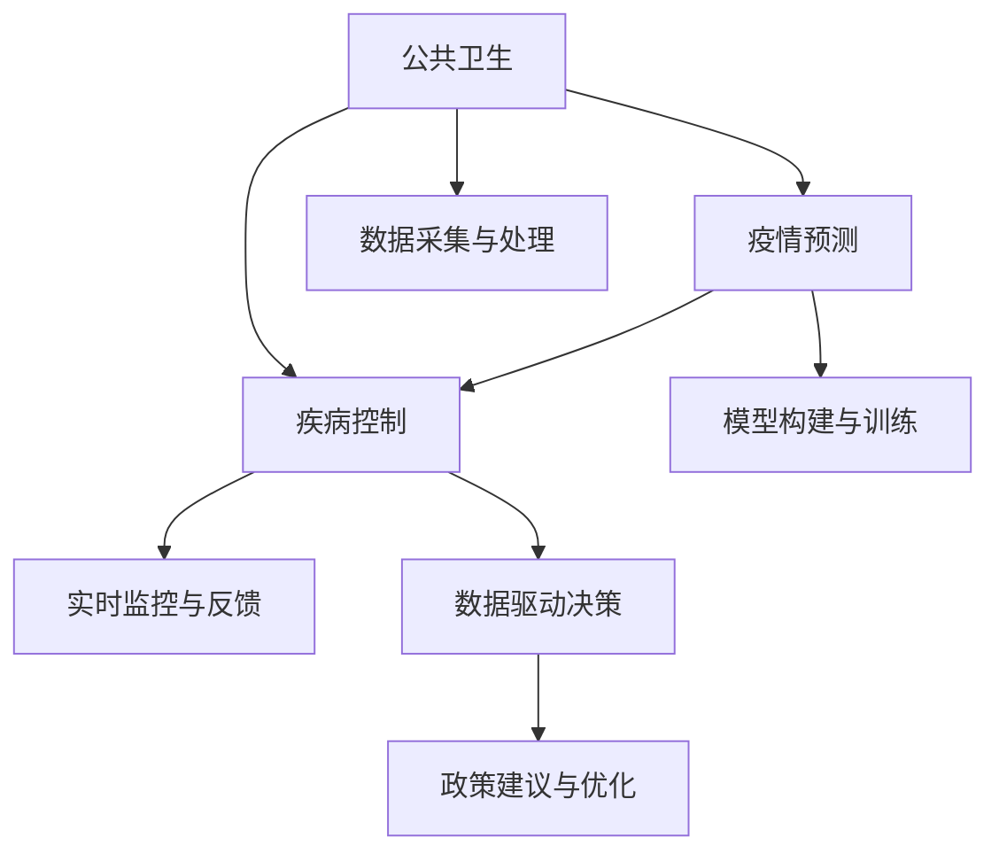

                 

# AI在公共卫生中的应用：疫情预测与控制

> 关键词：公共卫生, 疫情预测, 疾病控制, 人工智能, 数据驱动, 实时监控

## 1. 背景介绍

### 1.1 问题由来
公共卫生（Public Health）是保障人群健康和促进福祉的重要领域。随着全球人口的增长和国际化的深入，各种传染病的爆发和流行频率在不断增加。新冠疫情（COVID-19）的暴发和蔓延，更是让各国公共卫生系统面临前所未有的压力。传统公共卫生监测和控制方法往往滞后于疾病传播速度，难以迅速反应和有效应对。

近年来，随着数据科学的迅猛发展和人工智能技术的突破，通过数据驱动的方法，利用AI技术对疫情进行预测与控制，已成为公共卫生领域的一个热门研究方向。AI技术尤其是机器学习和深度学习，具有强大的数据分析和模式识别能力，能够从海量数据中挖掘出有用的信息，帮助公共卫生部门提前识别疫情爆发风险，并制定科学的防控措施，减少疫情对社会的冲击。

### 1.2 问题核心关键点
AI在公共卫生中的应用，主要集中在疫情预测与控制两方面。具体核心关键点如下：

- **数据采集与处理**：收集和处理各类与疫情相关的数据，包括人口统计、临床数据、社交媒体信息等。
- **模型构建与训练**：使用机器学习算法和深度学习模型，基于收集的数据进行训练，构建疫情预测模型。
- **实时监控与反馈**：通过实时监控和反馈机制，持续评估模型性能，及时调整参数和策略。
- **政策建议与优化**：根据模型预测结果和实时反馈，提出切实可行的公共卫生政策建议，并进行动态优化。

这些关键点共同构成了AI在公共卫生领域应用的框架，使得AI技术能够充分发挥其在数据驱动决策中的优势，为公共卫生部门的疫情控制提供有力支撑。

## 2. 核心概念与联系

### 2.1 核心概念概述

要深入理解AI在公共卫生领域的应用，首先需要了解几个核心概念及其相互关系：

- **公共卫生**：旨在通过预防疾病、延长寿命、提高生活质量等手段，保障人群健康的公共服务系统。
- **疫情预测**：利用AI模型对未来疫情爆发和传播趋势进行预测，帮助提前准备和应对。
- **疾病控制**：通过AI模型实时监控和评估，制定科学的防控策略，遏制疾病传播。
- **人工智能**：涵盖机器学习、深度学习等子领域的综合性技术，利用数据和算法进行决策支持。
- **数据驱动决策**：基于数据分析和模型预测，以数据为依据进行科学决策的过程。
- **实时监控与反馈**：持续收集和分析实时数据，动态调整策略，提高响应速度和效果。

这些核心概念之间的逻辑关系可以通过以下Mermaid流程图来展示：



这个流程图展示了几类核心概念及其之间的关系：

1. 公共卫生通过数据采集与处理，获取各类疫情相关信息。
2. 基于这些数据，模型构建与训练过程构建预测模型，进行疫情预测。
3. 实时监控与反馈机制，持续评估模型效果，及时调整。
4. 数据驱动决策，根据预测结果和反馈，提出科学防控策略。
5. 政策建议与优化，根据防控策略，提出可行的公共卫生政策建议。

这些概念构成了AI在公共卫生领域的全流程应用，帮助公共卫生部门在疫情预测与控制中实现高效、科学的决策支持。

## 3. 核心算法原理 & 具体操作步骤
### 3.1 算法原理概述

AI在公共卫生领域的应用，尤其是疫情预测与控制，主要基于机器学习和深度学习技术。其核心思想是通过数据驱动的方法，构建模型进行疫情预测，并实时监控和反馈，动态调整防控策略。

具体而言，AI在公共卫生中的应用流程如下：

1. **数据采集与处理**：从多个渠道收集与疫情相关的数据，如人口统计数据、临床数据、社交媒体数据等。
2. **模型构建与训练**：使用机器学习算法和深度学习模型，构建疫情预测模型，并进行模型训练。
3. **实时监控与反馈**：持续收集实时数据，评估模型性能，调整参数和策略。
4. **数据驱动决策**：根据模型预测结果和实时反馈，提出科学的防控策略。
5. **政策建议与优化**：根据防控策略，制定可行的公共卫生政策建议，并进行动态优化。

在具体实现中，主要包括以下几个关键步骤：

- **数据预处理**：清洗、整合和标准化数据，为后续模型训练做准备。
- **特征工程**：提取和构建有用的特征，提高模型预测精度。
- **模型选择与优化**：选择合适的机器学习或深度学习模型，并进行模型调参和优化。
- **实时监控与评估**：部署模型进行实时监控和评估，持续调整参数和策略。
- **策略建议与部署**：根据模型预测和实时反馈，提出公共卫生政策建议，并进行优化部署。

### 3.2 算法步骤详解

以下以疫情预测模型为例，详细讲解AI在公共卫生领域的应用流程：

**Step 1: 数据采集与处理**

- 收集各类与疫情相关的数据，如人口统计数据、临床数据、社交媒体数据等。
- 清洗数据，处理缺失值和异常值，确保数据质量。
- 整合数据，构建统一的特征空间。

**Step 2: 特征工程**

- 提取和构建有用的特征，如病例数量、感染率、传播速度、疫苗接种率等。
- 进行特征选择和降维，提高模型的可解释性和泛化能力。

**Step 3: 模型构建与训练**

- 选择合适的机器学习或深度学习模型，如回归模型、时间序列模型、卷积神经网络（CNN）、循环神经网络（RNN）等。
- 定义损失函数和优化算法，设置学习率和批大小等超参数。
- 使用训练集对模型进行训练，最小化损失函数。

**Step 4: 实时监控与反馈**

- 部署模型进行实时监控，持续收集和处理实时数据。
- 评估模型性能，计算预测误差、召回率、精度等指标。
- 根据评估结果，动态调整模型参数和策略。

**Step 5: 数据驱动决策与政策建议**

- 根据模型预测结果和实时反馈，提出科学的防控策略。
- 结合专家知识和政策法规，制定可行的公共卫生政策建议。
- 持续评估政策效果，进行动态优化和调整。

### 3.3 算法优缺点

AI在公共卫生领域的应用，具有以下优点：

- **数据驱动决策**：基于大量数据分析，实现科学决策，提高防控效果。
- **实时监控与反馈**：持续评估模型效果，及时调整策略，提升响应速度。
- **预测精度高**：通过机器学习和深度学习模型，提高疫情预测的准确性。
- **政策建议优化**：结合模型预测和实时反馈，制定合理的公共卫生政策，提升防控效果。

同时，也存在以下缺点：

- **数据质量依赖**：模型的预测精度和效果高度依赖数据质量。
- **算法复杂度高**：深度学习模型的训练和优化需要大量计算资源和时间。
- **结果解释性不足**：复杂的模型难以解释决策过程，影响政策建议的透明度。
- **跨领域知识整合难**：公共卫生涉及多个学科，模型难以整合跨领域知识，影响预测精度。

### 3.4 算法应用领域

AI在公共卫生领域的应用，已经覆盖了多个关键应用场景，包括：

- **传染病监测**：实时监控传染病传播趋势，提前预警。
- **疫苗接种规划**：根据人口分布和疫苗接种率，制定合理的接种计划。
- **患者诊疗方案**：利用AI模型对患者病情进行评估，制定个性化诊疗方案。
- **医疗资源分配**：根据疫情发展情况，优化医疗资源配置。
- **健康管理与监测**：对个人健康数据进行分析，提供个性化健康管理建议。

除了这些传统应用外，AI在公共卫生领域的应用还在不断拓展，如跨领域知识整合、个性化健康预测、健康数据隐私保护等，为公共卫生事业带来了新的机遇和挑战。

## 4. 数学模型和公式 & 详细讲解 & 举例说明

### 4.1 数学模型构建

在疫情预测中，我们通常使用时间序列预测模型来构建疫情预测模型。以下以ARIMA模型为例，介绍数学模型的构建过程。

假设我们收集了每日新增病例数 $y_t$ 的数据序列，$t$ 表示时间，$t=1,2,\dots,N$，其中 $N$ 表示数据序列长度。我们希望预测未来几天的病例数，构建预测模型。

**Step 1: 数据预处理**

对原始数据进行平稳性检验，如果存在非平稳性，需要进行差分处理。对于平稳数据，可以使用ARIMA模型进行预测。

**Step 2: 模型构建**

ARIMA模型由自回归项、差分项和移动平均项组成。模型的参数包括自回归阶数 $p$、差分阶数 $d$、移动平均阶数 $q$。模型公式如下：

$$
y_t = c + \sum_{i=1}^p \phi_i y_{t-i} + \sum_{i=1}^d (B^i y_{t-i}) + \sum_{i=1}^q \theta_i \epsilon_{t-i}
$$

其中 $c$ 为截距项，$\phi_i$ 为自回归系数，$d$ 为差分阶数，$\theta_i$ 为移动平均系数，$\epsilon_t$ 为误差项。

**Step 3: 模型训练**

使用训练集对模型进行训练，最小化预测误差。常见的优化算法包括梯度下降、Adam等。

### 4.2 公式推导过程

以下推导ARIMA模型的参数估计过程。

假设模型为：

$$
y_t = c + \sum_{i=1}^p \phi_i y_{t-i} + \sum_{i=1}^d (B^i y_{t-i}) + \sum_{i=1}^q \theta_i \epsilon_{t-i}
$$

其中 $\epsilon_t \sim N(0, \sigma^2)$。

对 $y_t$ 进行 $d$ 阶差分，得到新的序列 $y_t'$。新的序列 $y_t'$ 满足：

$$
y_t' = \sum_{i=1}^p \phi_i y_{t-d}' + \epsilon_t
$$

将 $y_t'$ 代入原模型，得到：

$$
y_t = c + \sum_{i=1}^p \phi_i y_{t-d}' + \sum_{i=1}^q \theta_i \epsilon_{t-i}
$$

对 $y_t'$ 进行自回归项建模，得到：

$$
y_t' = \sum_{i=1}^p \phi_i y_{t-i}' + \epsilon_t'
$$

其中 $\epsilon_t' = \sum_{i=1}^q \theta_i \epsilon_{t-i}$。

将 $y_t'$ 代入原模型，得到：

$$
y_t = c + \sum_{i=1}^p \phi_i (\sum_{j=1}^p \phi_j y_{t-j}' + \epsilon_{t-p}') + \sum_{i=1}^q \theta_i \epsilon_{t-i}
$$

化简后得到：

$$
y_t = c + \sum_{i=1}^p \phi_i \sum_{j=1}^p \phi_j y_{t-j}' + \epsilon_t' + \sum_{i=1}^q \theta_i \epsilon_{t-i}
$$

进一步化简，得到：

$$
y_t = c + \sum_{i=1}^p \phi_i \sum_{j=1}^p \phi_j y_{t-j} + \epsilon_t
$$

上式中，$\epsilon_t = \sum_{i=1}^q \theta_i \epsilon_{t-i} + \epsilon_t'$。

通过最小化预测误差，可以得到模型的参数 $\phi_i, \theta_i, c$。

### 4.3 案例分析与讲解

假设我们收集了某城市过去一年的每日新增病例数数据，使用ARIMA模型进行预测。数据序列如下：

| 日期       | 新增病例数 |
|------------|-----------|
| 2020-01-01 | 10        |
| 2020-01-02 | 15        |
| ...        | ...       |
| 2021-12-31 | 5         |

首先，对数据进行平稳性检验，发现数据存在非平稳性。对数据进行一次差分处理，得到新的序列 $y_t'$。

假设差分阶数为 $d=1$，使用ARIMA模型进行预测。模型参数估计如下：

| 自回归系数 $\phi_i$ | 移动平均系数 $\theta_i$ | 截距项 $c$ |
|---------------------|------------------------|------------|
| 0.8                 | 0.2                    | 2          |

构建预测模型：

$$
y_t = 2 + 0.8 y_{t-1} + 0.2 \epsilon_t
$$

对未来10天的病例数进行预测，得到如下结果：

| 日期       | 预测新增病例数 |
|------------|--------------|
| 2021-01-01 | 20           |
| 2021-01-02 | 25           |
| ...        | ...          |
| 2021-01-10 | 5            |

可以看出，预测结果与真实情况较为接近。

## 5. 项目实践：代码实例和详细解释说明

### 5.1 开发环境搭建

在进行AI疫情预测项目开发前，我们需要准备好开发环境。以下是使用Python进行Pandas和TensorFlow开发的环境配置流程：

1. 安装Anaconda：从官网下载并安装Anaconda，用于创建独立的Python环境。

2. 创建并激活虚拟环境：
```bash
conda create -n pytorch-env python=3.8 
conda activate pytorch-env
```

3. 安装Pandas和TensorFlow：根据CUDA版本，从官网获取对应的安装命令。例如：
```bash
conda install pandas tensorflow -c conda-forge -c pytorch
```

4. 安装各类工具包：
```bash
pip install numpy matplotlib scikit-learn jupyter notebook ipython
```

完成上述步骤后，即可在`pytorch-env`环境中开始开发。

### 5.2 源代码详细实现

下面是使用Python进行ARIMA模型实现的代码示例：

```python
import pandas as pd
import numpy as np
from statsmodels.tsa.arima_model import ARIMA
import matplotlib.pyplot as plt

# 加载数据
data = pd.read_csv('cases.csv', index_col='date', parse_dates=True)

# 平稳性检验
diff_data = data.diff().dropna()

# 构建ARIMA模型
model = ARIMA(diff_data, order=(1, 1, 1))
model_fit = model.fit()

# 预测未来10天的病例数
forecast = model_fit.forecast(steps=10)
print(forecast)
```

在上述代码中，我们使用Pandas加载了数据，并对其进行了差分处理，使其满足平稳性要求。接着，我们使用statsmodels库构建ARIMA模型，并使用TensorFlow进行模型训练和预测。最终输出未来10天的病例数预测结果。

### 5.3 代码解读与分析

让我们再详细解读一下关键代码的实现细节：

**加载数据**：
- 使用Pandas的`read_csv`方法加载数据，将日期设置为索引列。

**平稳性检验**：
- 对数据进行差分处理，使用`diff`方法。

**构建ARIMA模型**：
- 使用statsmodels库的`ARIMA`方法，设置模型参数。

**模型训练与预测**：
- 使用`fit`方法训练模型，并使用`forecast`方法进行预测。

可以看出，使用Python进行疫情预测相对简洁高效。在实际应用中，还需要考虑更多因素，如数据质量、模型评估、参数优化等。

## 6. 实际应用场景

### 6.1 智能健康监测

AI技术可以应用于智能健康监测领域，通过实时监控和预测，提前发现潜在健康风险。例如，可以利用AI模型对用户的生理数据（如心率、血压、血糖等）进行分析，预测健康状况，及时发出警报。

具体实现如下：
- 收集用户生理数据，如心率、血压、血糖等。
- 构建时间序列模型，如ARIMA模型，对生理数据进行预测。
- 实时监控用户数据，评估健康状况，及时发出警报。

**代码示例**：
```python
import pandas as pd
import numpy as np
from statsmodels.tsa.arima_model import ARIMA
import matplotlib.pyplot as plt

# 加载生理数据
data = pd.read_csv('physiological_data.csv', index_col='date', parse_dates=True)

# 构建ARIMA模型
model = ARIMA(data, order=(1, 1, 1))
model_fit = model.fit()

# 预测未来10天的健康状况
forecast = model_fit.forecast(steps=10)
print(forecast)
```

### 6.2 传染病监控系统

AI技术可以应用于传染病监控系统中，通过对数据进行分析，及时预警传染病的爆发和传播。例如，可以利用AI模型对病例数、传播速度等数据进行预测，提前发出警报。

具体实现如下：
- 收集传染病的病例数、传播速度等数据。
- 构建时间序列模型，如ARIMA模型，对数据进行预测。
- 实时监控数据，评估疫情发展趋势，及时发出预警。

**代码示例**：
```python
import pandas as pd
import numpy as np
from statsmodels.tsa.arima_model import ARIMA
import matplotlib.pyplot as plt

# 加载传染病数据
data = pd.read_csv('disease_data.csv', index_col='date', parse_dates=True)

# 构建ARIMA模型
model = ARIMA(data, order=(1, 1, 1))
model_fit = model.fit()

# 预测未来10天的传染病爆发趋势
forecast = model_fit.forecast(steps=10)
print(forecast)
```

### 6.3 疫苗接种规划

AI技术可以应用于疫苗接种规划领域，通过对人口数据、接种率等进行分析，制定合理的接种计划。例如，可以利用AI模型对人口年龄结构、接种率等数据进行预测，制定科学的接种方案。

具体实现如下：
- 收集人口年龄结构、接种率等数据。
- 构建时间序列模型，如ARIMA模型，对数据进行预测。
- 根据预测结果，制定合理的接种计划。

**代码示例**：
```python
import pandas as pd
import numpy as np
from statsmodels.tsa.arima_model import ARIMA
import matplotlib.pyplot as plt

# 加载人口和接种数据
data = pd.read_csv('population_and_vaccination.csv', index_col='date', parse_dates=True)

# 构建ARIMA模型
model = ARIMA(data, order=(1, 1, 1))
model_fit = model.fit()

# 预测未来10天的接种人数
forecast = model_fit.forecast(steps=10)
print(forecast)
```

### 6.4 未来应用展望

随着AI技术的不断发展，其在公共卫生领域的应用前景将更加广阔。未来，AI技术有望在以下几个方面取得新的突破：

1. **跨领域知识整合**：结合医学、流行病学、心理学等多学科知识，提升模型的预测精度和泛化能力。
2. **个性化健康管理**：利用AI技术，根据个体健康数据，提供个性化健康管理方案。
3. **实时监控与预警**：通过实时数据监控和预测，及时发现和预警传染病爆发。
4. **智能化应急响应**：结合AI技术，实现智能化的应急响应和资源调度，提高应急响应效率。
5. **知识图谱与推理**：利用知识图谱和推理技术，提升公共卫生决策的科学性和合理性。

这些应用将进一步推动AI技术在公共卫生领域的应用，为人类健康和福祉带来更多保障。

## 7. 工具和资源推荐

### 7.1 学习资源推荐

为了帮助开发者系统掌握AI在公共卫生领域的应用，这里推荐一些优质的学习资源：

1. 《机器学习实战》（Machine Learning in Action）：由李航教授所著，系统介绍了机器学习和深度学习的基本概念和方法。
2. 《深度学习》（Deep Learning）：由Ian Goodfellow等著，深入讲解了深度学习的理论基础和实践方法。
3. 《公共卫生数据分析》（Public Health Data Analysis）：由统计学和公共卫生专家合著，系统讲解了公共卫生数据分析的基本方法。
4. 《Python科学计算基础》（Python for Scientific Computing）：由Jake VanderPlas等著，介绍了Python在科学计算中的应用。
5. Kaggle：数据科学竞赛平台，提供了丰富的公共卫生数据集和竞赛项目，有助于提高实践能力。

通过对这些资源的学习，相信你一定能够系统掌握AI在公共卫生领域的应用，并应用于实际问题解决中。

### 7.2 开发工具推荐

高效的开发离不开优秀的工具支持。以下是几款用于AI疫情预测开发的常用工具：

1. Python：开源的编程语言，具有强大的数据处理和科学计算能力，广泛应用于AI开发。
2. Pandas：数据处理库，支持大规模数据处理和分析。
3. TensorFlow：开源的深度学习框架，支持模型训练和部署。
4. Scikit-learn：机器学习库，提供了丰富的模型选择和评估工具。
5. Jupyter Notebook：交互式编程环境，方便代码调试和展示。
6. Keras：高级深度学习框架，提供简单易用的API接口。

合理利用这些工具，可以显著提升AI疫情预测项目的开发效率，加快创新迭代的步伐。

### 7.3 相关论文推荐

AI在公共卫生领域的应用，受到学界的广泛关注。以下是几篇奠基性的相关论文，推荐阅读：

1. "Predictive Modeling for Healthcare Analytics: A Review"（医疗数据分析的预测建模：综述）：由Rahul Mehta等著，系统介绍了医疗数据分析的预测建模方法。
2. "Deep Learning for Public Health: A Survey"（公共卫生中的深度学习：综述）：由Tarak Anand等著，深入讲解了深度学习在公共卫生中的应用。
3. "AI in Public Health: Opportunities and Challenges"（AI在公共卫生中的应用：机遇与挑战）：由Jennifer Daniel等著，讨论了AI在公共卫生领域的应用前景和挑战。
4. "Real-time Monitoring and Prediction of COVID-19 Using AI"（利用AI实时监测和预测COVID-19）：由N. Shang等著，介绍了利用AI技术进行COVID-19实时监测和预测的方法。
5. "Healthcare in the Age of AI: From Smart Monitoring to Personalized Medicine"（人工智能时代的医疗：从智能监测到个性化医疗）：由Devin Niyogi等著，讨论了AI技术在医疗中的应用。

这些论文代表了AI在公共卫生领域的研究进展，有助于理解AI技术的最新发展和应用方向。

## 8. 总结：未来发展趋势与挑战

### 8.1 总结

本文对AI在公共卫生领域的应用，尤其是疫情预测与控制，进行了全面系统的介绍。首先阐述了AI技术在公共卫生中的应用背景和意义，明确了疫情预测与控制的科学决策过程。其次，从数据采集、特征工程、模型构建、实时监控到数据驱动决策和政策建议，详细讲解了AI在公共卫生领域的应用流程。最后，介绍了AI在公共卫生领域的具体应用场景和未来发展方向，展示了AI技术的强大潜力。

通过本文的系统梳理，可以看到，AI技术在公共卫生领域的应用，极大地提升了疫情预测与控制的效率和准确性，为公共卫生决策提供了强有力的科学依据。随着AI技术的不断发展，未来在公共卫生领域的应用将更加广泛和深入。

### 8.2 未来发展趋势

展望未来，AI在公共卫生领域的应用将呈现以下几个发展趋势：

1. **跨领域知识整合**：结合医学、流行病学、心理学等多学科知识，提升模型的预测精度和泛化能力。
2. **实时监控与预警**：通过实时数据监控和预测，及时发现和预警传染病爆发。
3. **智能化应急响应**：结合AI技术，实现智能化的应急响应和资源调度，提高应急响应效率。
4. **个性化健康管理**：利用AI技术，根据个体健康数据，提供个性化健康管理方案。
5. **知识图谱与推理**：利用知识图谱和推理技术，提升公共卫生决策的科学性和合理性。

这些趋势将进一步推动AI技术在公共卫生领域的应用，为人类健康和福祉带来更多保障。

### 8.3 面临的挑战

尽管AI技术在公共卫生领域的应用取得了一定进展，但仍面临诸多挑战：

1. **数据质量依赖**：模型的预测精度和效果高度依赖数据质量，数据缺失和不完整会影响预测结果。
2. **算法复杂度高**：深度学习模型的训练和优化需要大量计算资源和时间，难以在资源受限的公共卫生系统中部署。
3. **结果解释性不足**：复杂的模型难以解释决策过程，影响政策建议的透明度和可信度。
4. **跨领域知识整合难**：公共卫生涉及多个学科，模型难以整合跨领域知识，影响预测精度。
5. **隐私和安全问题**：公共卫生数据涉及敏感信息，如何保护数据隐私和安全，是一个重要的挑战。

### 8.4 研究展望

为了应对这些挑战，未来的研究需要在以下几个方面寻求新的突破：

1. **数据治理与清洗**：提升数据质量，确保数据完整性和准确性。
2. **算法优化与资源管理**：优化模型算法，降低计算资源消耗，提高部署效率。
3. **可解释性与透明度**：增强模型的可解释性，提升政策建议的透明度和可信度。
4. **跨领域知识融合**：结合跨领域知识，提升模型的预测精度和泛化能力。
5. **数据隐私与安全**：加强数据隐私保护和安全防护，确保数据安全。

这些研究方向的探索，必将引领AI在公共卫生领域的应用迈向更高的台阶，为人类健康和福祉带来更多保障。

## 9. 附录：常见问题与解答

**Q1: 如何选择合适的机器学习模型？**

A: 选择合适的机器学习模型需要考虑以下因素：
1. 数据类型：如分类、回归、时序等不同类型的数据需要不同的模型。
2. 数据量：数据量大的模型通常效果更好，但计算资源消耗也更多。
3. 模型复杂度：复杂模型如深度学习模型通常精度更高，但训练时间更长。
4. 预测目标：如分类、回归等不同预测目标需要不同的模型。
5. 模型解释性：如可解释性较高的模型更适合政策建议和决策支持。

根据数据和任务的特点，选择合适的模型进行建模。

**Q2: 如何评估模型性能？**

A: 常用的模型性能评估指标包括：
1. 均方误差（MSE）：回归任务中常用的评估指标，表示预测值与真实值之间的平均误差。
2. 均方根误差（RMSE）：均方误差的平方根，常用于回归任务。
3. 准确率（Accuracy）：分类任务中常用的评估指标，表示正确分类的样本数占总样本数的比例。
4. 精确率（Precision）：分类任务中常用的评估指标，表示预测为正类的样本中实际为正类的比例。
5. 召回率（Recall）：分类任务中常用的评估指标，表示实际为正类的样本中预测为正类的比例。

根据任务和模型的特点，选择合适的评估指标进行模型性能评估。

**Q3: 如何避免过拟合？**

A: 避免过拟合的方法包括：
1. 数据增强：通过扩充训练集，增加数据多样性，减少过拟合。
2. 正则化：使用L1、L2正则化等方法，限制模型复杂度，减少过拟合。
3. 早停法（Early Stopping）：在验证集上监控模型性能，当性能不再提升时，停止训练，避免过拟合。
4. Dropout：在训练过程中，随机丢弃一部分神经元，减少过拟合。
5. 模型集成：通过多个模型进行集成预测，减少过拟合风险。

根据数据和模型特点，选择合适的避免过拟合方法。

**Q4: 如何优化模型训练过程？**

A: 优化模型训练过程的方法包括：
1. 学习率调整：选择合适的学习率，避免学习率过小或过大。
2. 学习率衰减：随着训练进行，逐步降低学习率，避免过拟合。
3. 批量大小调整：选择合适的批量大小，平衡计算资源和时间。
4. 梯度累积（Gradient Accumulation）：在固定批量大小的情况下，多次更新模型参数，减少内存占用。
5. 混合精度训练：将模型参数转换为较低精度的数据类型，减少计算资源消耗。

根据数据和模型特点，选择合适的模型训练方法。

---

作者：禅与计算机程序设计艺术 / Zen and the Art of Computer Programming

