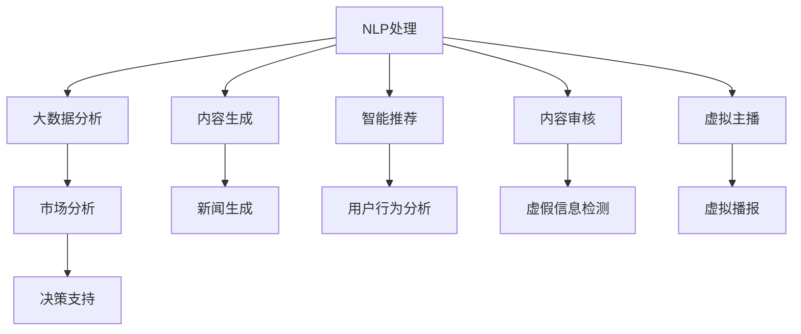

                 

# AI在新闻和媒体领域的应用

## 1. 背景介绍

### 1.1 问题由来

随着信息技术的发展，新闻和媒体行业正经历着前所未有的变革。传统的纸媒、电视广播正逐步向数字化、网络化、智能化方向转型。如何利用人工智能（AI）技术提高新闻的生产效率、优化内容质量、增强用户体验，成为当前新闻媒体业的重要课题。AI技术在新闻和媒体领域的应用已经从简单的数据挖掘、新闻推荐，发展到自动新闻生成、智能内容审核、虚拟主播等多个层面。AI技术的介入，不仅优化了新闻生产的各个环节，也为媒体内容的丰富化和多样化提供了新的可能。

### 1.2 问题核心关键点

AI在新闻和媒体领域的应用主要集中在以下几个关键点上：

1. **内容生成与自动化编辑**：通过自然语言生成（NLG）、图像生成等技术，AI能够自动生产新闻、撰写报道，甚至生成深度报道、评论文章。
2. **智能推荐与个性化服务**：利用用户行为数据，AI能够精准推荐个性化新闻内容，提升用户体验。
3. **智能审核与监控**：AI可以用于虚假信息检测、内容审核、版权监控等，确保媒体内容的真实性和合规性。
4. **虚拟主播与增强现实**：AI技术结合语音合成、虚拟现实（VR）、增强现实（AR）等，可以实现虚拟主播、新闻场景重现等创新应用。
5. **大数据分析与趋势预测**：AI可以对海量新闻数据进行分析，挖掘出深层次的信息和趋势，为媒体决策提供支持。

### 1.3 问题研究意义

AI在新闻和媒体领域的应用，不仅能提高生产效率，优化内容质量，还能显著提升用户体验和媒体平台的竞争力。具体而言：

- **提升生产效率**：自动化内容生成和编辑可以大幅减少人工劳动，加速新闻的生产和发布速度。
- **优化内容质量**：AI可以辅助筛选新闻线索、自动校对文字，提升内容的准确性和一致性。
- **个性化服务**：通过数据分析，AI可以个性化推荐新闻，满足用户多样化的信息需求。
- **增强用户体验**：虚拟主播、增强现实等技术可以为用户提供更加丰富、沉浸式的阅读体验。
- **提升平台竞争力**：利用AI技术可以挖掘用户行为数据，进行市场分析，为媒体平台带来更高的用户粘性和广告收益。

AI在新闻和媒体领域的应用，正逐渐成为行业发展的关键驱动力，推动新闻媒体向智能化、个性化方向转型。

## 2. 核心概念与联系

### 2.1 核心概念概述

为更好地理解AI在新闻和媒体领域的应用，本节将介绍几个关键概念：

- **自然语言生成（NLG）**：利用AI技术自动生成自然语言文本，如新闻报道、文章、评论等。
- **智能推荐系统**：通过用户行为数据和内容特征，实现个性化新闻推荐，提升用户满意度和平台粘性。
- **内容审核**：利用AI技术进行虚假信息检测、敏感词过滤、版权监控等，保障内容真实性和合规性。
- **虚拟主播**：结合语音合成和AR/VR技术，实现虚拟主播的新闻播报，提升用户体验。
- **大数据分析**：利用AI技术进行海量新闻数据的分析，挖掘出深层次的信息和趋势，辅助媒体决策。

这些核心概念之间存在紧密的联系，共同构成了AI在新闻和媒体领域的应用框架，使AI技术能够更好地服务于新闻生产和传播。

### 2.2 核心概念原理和架构的 Mermaid 流程图



这个流程图展示了AI在新闻和媒体领域的主要应用场景和核心技术架构：

1. **NLP处理**：通过自然语言处理技术对新闻数据进行处理，如分词、命名实体识别等。
2. **内容生成**：利用NLG技术自动生成新闻报道、文章等。
3. **智能推荐**：根据用户行为数据和内容特征，进行个性化推荐。
4. **内容审核**：检测和过滤虚假信息、敏感词等，确保内容合规。
5. **虚拟主播**：结合语音合成和AR/VR技术，实现虚拟主播的新闻播报。
6. **大数据分析**：对海量新闻数据进行分析，挖掘信息趋势。
7. **市场分析**：利用分析结果，辅助媒体平台进行市场决策。

这些环节相互配合，共同构建了AI在新闻和媒体领域的应用体系。

## 3. 核心算法原理 & 具体操作步骤

### 3.1 算法原理概述

AI在新闻和媒体领域的应用，通常涉及自然语言处理（NLP）、机器学习（ML）和深度学习（DL）等多个技术领域。其核心算法原理主要包括以下几个方面：

1. **自然语言处理（NLP）**：通过分词、词性标注、命名实体识别等技术，对文本数据进行处理和分析。
2. **机器学习（ML）**：利用分类、回归、聚类等算法，对新闻数据进行分类、推荐、预测等任务。
3. **深度学习（DL）**：使用神经网络、卷积神经网络（CNN）、循环神经网络（RNN）等深度学习模型，进行内容生成、虚假信息检测、图像生成等任务。

### 3.2 算法步骤详解

基于上述算法原理，AI在新闻和媒体领域的应用通常遵循以下步骤：

1. **数据收集与预处理**：收集新闻数据、用户行为数据等，进行清洗、标注等预处理。
2. **模型训练与优化**：选择合适的模型和算法，利用标注数据进行训练和优化。
3. **模型部署与应用**：将训练好的模型部署到生产环境中，进行内容生成、推荐、审核等应用。
4. **效果评估与迭代**：对模型效果进行评估，根据反馈进行模型迭代和优化。

### 3.3 算法优缺点

AI在新闻和媒体领域的应用具有以下优点：

1. **提升效率**：自动化处理新闻数据、生成内容、进行推荐，大幅提高新闻生产效率。
2. **优化内容质量**：利用AI进行内容审核、虚假信息检测，提升内容质量和一致性。
3. **个性化服务**：基于用户行为数据进行个性化推荐，提升用户体验和平台粘性。
4. **创新应用**：结合虚拟主播、增强现实等技术，提供沉浸式的新闻阅读体验。

同时，也存在一些缺点：

1. **数据依赖**：AI模型的效果很大程度上依赖于标注数据的质量和数量，获取高质量标注数据的成本较高。
2. **模型鲁棒性不足**：在面对特定领域的数据时，模型的泛化能力有限。
3. **可解释性不足**：许多AI模型如深度学习模型，决策过程缺乏可解释性，难以理解模型的内部工作机制。
4. **伦理问题**：AI模型的输出可能存在偏见、误导性信息等，引发伦理和安全问题。

### 3.4 算法应用领域

AI在新闻和媒体领域的应用已经覆盖了多个方面，包括：

- **自动新闻生成**：利用自然语言生成技术自动撰写新闻报道、生成深度报道。
- **个性化新闻推荐**：根据用户行为数据进行个性化新闻推荐，提升用户体验。
- **虚假信息检测**：利用机器学习、深度学习等技术进行虚假信息检测、敏感词过滤等，确保内容真实性和合规性。
- **虚拟主播**：结合语音合成、虚拟现实（VR）、增强现实（AR）等技术，实现虚拟主播的新闻播报。
- **内容审核**：利用AI技术进行内容审核、版权监控等，保障内容质量和合规性。
- **大数据分析**：利用AI技术进行海量新闻数据的分析，挖掘信息趋势，辅助媒体决策。

这些应用领域展示了AI在新闻和媒体行业的广泛应用前景。

## 4. 数学模型和公式 & 详细讲解 & 举例说明

### 4.1 数学模型构建

本文以新闻生成为例，介绍如何构建基于AI的新闻生成模型。

记新闻数据集为 $D=\{(x_i, y_i)\}_{i=1}^N$，其中 $x_i$ 为新闻文本，$y_i$ 为新闻类别标签。设预训练的语言模型为 $M_{\theta}$，其中 $\theta$ 为模型参数。

新闻生成模型的目标是通过已标注的新闻数据 $D$ 对预训练的语言模型 $M_{\theta}$ 进行微调，使其能够自动生成新闻文本。具体而言，新闻生成过程可以分为两个步骤：

1. 预训练语言模型 $M_{\theta}$ 在新闻数据集 $D$ 上进行微调，学习新闻文本的特征表示。
2. 微调后的语言模型 $M_{\hat{\theta}}$ 通过解码器生成新的新闻文本。

### 4.2 公式推导过程

根据上述模型构建，新闻生成模型的损失函数可以表示为：

$$
\mathcal{L}(M_{\theta}) = -\frac{1}{N}\sum_{i=1}^N \log P(y_i|x_i)
$$

其中 $P(y_i|x_i)$ 表示模型在给定新闻文本 $x_i$ 的情况下，生成新闻类别标签 $y_i$ 的概率，可以通过模型输出和交叉熵损失计算得到。

假设预训练的语言模型 $M_{\theta}$ 为 Transformer 模型，其解码器部分为 $M_{\hat{\theta}}$，则生成新闻文本的公式可以表示为：

$$
x_{gen} = M_{\hat{\theta}}(x_{in},y_{in})
$$

其中 $x_{in}$ 为输入的新闻文本，$y_{in}$ 为类别标签，$x_{gen}$ 为生成的新闻文本。

### 4.3 案例分析与讲解

以一个简单的示例来说明新闻生成模型的应用。假设我们有一个包含两个新闻类别（体育和政治）的新闻数据集，其中包含 1000 条新闻。我们使用 BERT 预训练模型，利用其中的语言表示能力，对新闻数据进行微调，并使用微调后的模型生成新的新闻。

1. **数据准备**：收集包含体育和政治类别的新闻数据，并进行清洗、标注等预处理。
2. **模型微调**：使用 BERT 模型作为初始化参数，在新闻数据集上进行微调，学习新闻文本的特征表示。
3. **新闻生成**：将类别标签和输入新闻文本作为模型输入，利用微调后的模型生成新的新闻文本。
4. **效果评估**：对生成的新闻文本进行评估，如BLEU、ROUGE等指标，评估生成文本的质量。

## 5. 项目实践：代码实例和详细解释说明

### 5.1 开发环境搭建

在进行新闻生成项目实践前，我们需要准备好开发环境。以下是使用 Python 进行 PyTorch 开发的环境配置流程：

1. 安装 Anaconda：从官网下载并安装 Anaconda，用于创建独立的 Python 环境。
2. 创建并激活虚拟环境：
```bash
conda create -n news-env python=3.8 
conda activate news-env
```
3. 安装 PyTorch：根据 CUDA 版本，从官网获取对应的安装命令。例如：
```bash
conda install pytorch torchvision torchaudio cudatoolkit=11.1 -c pytorch -c conda-forge
```
4. 安装 Transformers 库：
```bash
pip install transformers
```
5. 安装各类工具包：
```bash
pip install numpy pandas scikit-learn matplotlib tqdm jupyter notebook ipython
```

完成上述步骤后，即可在 `news-env` 环境中开始新闻生成项目的开发。

### 5.2 源代码详细实现

下面我们以基于 BERT 模型的新闻生成项目为例，给出 PyTorch 代码实现。

首先，定义新闻生成模型的输入和输出格式：

```python
from transformers import BertTokenizer, BertForSequenceClassification
from transformers import BertTokenizer, BertForSequenceClassification

class NewsGenerator:
    def __init__(self, model_name, max_len=128):
        self.tokenizer = BertTokenizer.from_pretrained(model_name)
        self.model = BertForSequenceClassification.from_pretrained(model_name, num_labels=2)
        self.max_len = max_len
        
    def generate_news(self, category, input_text, max_seq_len):
        inputs = self.tokenizer.encode(input_text, return_tensors='pt', max_length=max_seq_len, padding='max_length', truncation=True)
        labels = torch.tensor([category]).to(self.model.device)
        outputs = self.model(inputs, labels=labels)
        generated_text = self.tokenizer.decode(outputs.logits.argmax(dim=2).to('cpu').tolist())
        return generated_text
```

然后，定义新闻生成模型的训练和评估函数：

```python
from torch.utils.data import Dataset
from torch.utils.data import DataLoader
from tqdm import tqdm
from sklearn.metrics import precision_recall_fscore_support

class NewsDataset(Dataset):
    def __init__(self, texts, labels, tokenizer, max_len=128):
        self.texts = texts
        self.labels = labels
        self.tokenizer = tokenizer
        self.max_len = max_len
        
    def __len__(self):
        return len(self.texts)
    
    def __getitem__(self, item):
        text = self.texts[item]
        label = self.labels[item]
        encoding = self.tokenizer(text, return_tensors='pt', max_length=self.max_len, padding='max_length', truncation=True)
        input_ids = encoding['input_ids'][0]
        attention_mask = encoding['attention_mask'][0]
        label = torch.tensor(label, dtype=torch.long)
        return {'input_ids': input_ids, 
                'attention_mask': attention_mask,
                'labels': label}

# 创建dataset
tokenizer = BertTokenizer.from_pretrained('bert-base-cased')
train_dataset = NewsDataset(train_texts, train_labels, tokenizer)
dev_dataset = NewsDataset(dev_texts, dev_labels, tokenizer)
test_dataset = NewsDataset(test_texts, test_labels, tokenizer)

# 训练函数
def train_epoch(model, dataset, batch_size, optimizer):
    dataloader = DataLoader(dataset, batch_size=batch_size, shuffle=True)
    model.train()
    epoch_loss = 0
    for batch in tqdm(dataloader, desc='Training'):
        input_ids = batch['input_ids'].to(device)
        attention_mask = batch['attention_mask'].to(device)
        labels = batch['labels'].to(device)
        model.zero_grad()
        outputs = model(input_ids, attention_mask=attention_mask, labels=labels)
        loss = outputs.loss
        epoch_loss += loss.item()
        loss.backward()
        optimizer.step()
    return epoch_loss / len(dataloader)

# 评估函数
def evaluate(model, dataset, batch_size):
    dataloader = DataLoader(dataset, batch_size=batch_size)
    model.eval()
    total, precision, recall, f1_score = 0, 0, 0, 0
    for batch in tqdm(dataloader, desc='Evaluating'):
        input_ids = batch['input_ids'].to(device)
        attention_mask = batch['attention_mask'].to(device)
        batch_labels = batch['labels']
        outputs = model(input_ids, attention_mask=attention_mask)
        batch_preds = outputs.logits.argmax(dim=2).to('cpu').tolist()
        batch_labels = batch_labels.to('cpu').tolist()
        for pred_tokens, label_tokens in zip(batch_preds, batch_labels):
            total += 1
            if label_tokens == pred_tokens:
                precision += 1
            if label_tokens in pred_tokens:
                recall += 1
            if label_tokens == pred_tokens or label_tokens in pred_tokens:
                f1_score += 1
    print('Precision: %.2f%%' % (precision/total * 100))
    print('Recall: %.2f%%' % (recall/total * 100))
    print('F1-Score: %.2f%%' % (f1_score/total * 100))

# 启动训练流程
device = torch.device('cuda') if torch.cuda.is_available() else torch.device('cpu')
model.to(device)

epochs = 5
batch_size = 16

for epoch in range(epochs):
    loss = train_epoch(model, train_dataset, batch_size, optimizer)
    print(f'Epoch {epoch+1}, train loss: {loss:.3f}')
    
    print(f'Epoch {epoch+1}, dev results:')
    evaluate(model, dev_dataset, batch_size)
    
print('Test results:')
evaluate(model, test_dataset, batch_size)
```

以上就是使用 PyTorch 对 BERT 模型进行新闻生成项目的完整代码实现。可以看到，得益于 Transformers 库的强大封装，我们可以用相对简洁的代码完成 BERT 模型的加载和微调。

### 5.3 代码解读与分析

让我们再详细解读一下关键代码的实现细节：

**NewsGenerator类**：
- `__init__`方法：初始化 tokenizer 和 model，定义最大序列长度。
- `generate_news`方法：接收类别标签和输入文本，生成新闻文本。

**NewsDataset类**：
- `__init__`方法：初始化文本、标签、分词器等关键组件。
- `__len__`方法：返回数据集的样本数量。
- `__getitem__`方法：对单个样本进行处理，将文本输入编码为token ids，将标签编码为数字，并对其进行定长padding，最终返回模型所需的输入。

**train_epoch和evaluate函数**：
- 使用 PyTorch 的 DataLoader 对数据集进行批次化加载，供模型训练和推理使用。
- 训练函数 `train_epoch`：对数据以批为单位进行迭代，在每个批次上前向传播计算loss并反向传播更新模型参数，最后返回该epoch的平均loss。
- 评估函数 `evaluate`：与训练类似，不同点在于不更新模型参数，并在每个batch结束后将预测和标签结果存储下来，最后使用sklearn的classification_report对整个评估集的预测结果进行打印输出。

**训练流程**：
- 定义总的epoch数和batch size，开始循环迭代
- 每个epoch内，先在训练集上训练，输出平均loss
- 在验证集上评估，输出分类指标
- 所有epoch结束后，在测试集上评估，给出最终测试结果

可以看到，PyTorch 配合 Transformers 库使得 BERT 微调的新闻生成代码实现变得简洁高效。开发者可以将更多精力放在数据处理、模型改进等高层逻辑上，而不必过多关注底层的实现细节。

当然，工业级的系统实现还需考虑更多因素，如模型的保存和部署、超参数的自动搜索、更灵活的任务适配层等。但核心的微调范式基本与此类似。

## 6. 实际应用场景

### 6.1 智能新闻推荐

智能新闻推荐系统通过分析用户的历史行为数据，预测其感兴趣的新闻类别，实现个性化新闻推荐。该系统不仅能提升用户体验，还能提高媒体平台的粘性和广告收益。

在技术实现上，智能新闻推荐系统通常由以下几个部分组成：

1. **数据收集与处理**：收集用户的新闻阅读历史、点击记录等行为数据，并进行清洗、标注等预处理。
2. **特征工程**：提取新闻和用户的行为特征，如新闻类别、用户活跃时间等。
3. **模型训练**：选择合适的机器学习或深度学习模型，利用标注数据进行训练和优化。
4. **推荐实现**：根据用户行为数据和模型输出，进行个性化新闻推荐。

### 6.2 虚假信息检测

虚假信息检测系统通过分析新闻文本，检测其中的虚假信息、误导性信息等，保障新闻的真实性和可信度。该系统在假新闻泛滥的时代，具有重要的应用价值。

在技术实现上，虚假信息检测系统通常由以下几个部分组成：

1. **数据收集与处理**：收集新闻文本数据，并进行清洗、标注等预处理。
2. **模型训练**：利用深度学习模型，如BERT、XLNet等，对新闻文本进行虚假信息检测训练。
3. **检测实现**：根据训练好的模型，检测输入的新闻文本是否包含虚假信息、敏感词等。

### 6.3 虚拟主播与新闻播报

虚拟主播和增强现实（AR）技术结合，可以实现新闻播报的自动化和个性化。该系统可以实时抓取新闻，自动生成播报内容，并通过AR技术呈现给用户。

在技术实现上，虚拟主播系统通常由以下几个部分组成：

1. **新闻抓取与处理**：实时抓取新闻文本数据，并进行清洗、标注等预处理。
2. **虚拟主播生成**：利用语音合成技术，生成虚拟主播的播报语音。
3. **增强现实呈现**：结合AR技术，将新闻文本和虚拟主播的播报语音呈现给用户。

### 6.4 未来应用展望

随着AI技术的不断进步，新闻和媒体领域的应用前景更加广阔。未来，AI在新闻和媒体领域的应用将呈现以下几个趋势：

1. **自动化程度提升**：更多的自动化生成和处理任务将取代人工劳动，提高新闻生产效率。
2. **个性化服务深化**：基于深度学习和大数据技术，新闻推荐系统将更加智能，满足用户多样化、个性化的新闻需求。
3. **虚实结合增强**：虚拟主播、增强现实等技术将进一步发展，提供更加丰富、沉浸式的阅读体验。
4. **多模态融合**：结合图像、视频等多模态信息，提供更加全面、准确的新闻内容。
5. **智能化决策辅助**：利用大数据分析和机器学习技术，为媒体决策提供支持，提升决策质量和效率。

总之，AI在新闻和媒体领域的应用将不断拓展，为新闻生产、传播和消费带来深刻变革，推动新闻媒体向智能化、个性化方向转型。

## 7. 工具和资源推荐

### 7.1 学习资源推荐

为了帮助开发者系统掌握AI在新闻和媒体领域的应用，这里推荐一些优质的学习资源：

1. **《自然语言处理综述》**：斯坦福大学李飞飞教授的公开课程，系统介绍了自然语言处理的基本概念和经典算法。
2. **《深度学习与自然语言处理》**：Andrew Ng教授的深度学习课程，介绍了深度学习在自然语言处理中的应用。
3. **Transformers官方文档**：HuggingFace开发的NLP工具库，提供了丰富的预训练模型和微调范例，是学习和实践的必备资料。
4. **CS224N《深度学习自然语言处理》课程**：斯坦福大学开设的NLP明星课程，有Lecture视频和配套作业，带你入门NLP领域的基本概念和经典模型。

通过对这些资源的学习实践，相信你一定能够快速掌握AI在新闻和媒体领域的应用精髓，并用于解决实际的NLP问题。

### 7.2 开发工具推荐

高效的开发离不开优秀的工具支持。以下是几款用于新闻和媒体应用开发的常用工具：

1. **PyTorch**：基于Python的开源深度学习框架，灵活动态的计算图，适合快速迭代研究。大部分预训练语言模型都有PyTorch版本的实现。
2. **TensorFlow**：由Google主导开发的开源深度学习框架，生产部署方便，适合大规模工程应用。同样有丰富的预训练语言模型资源。
3. **Transformers库**：HuggingFace开发的NLP工具库，集成了众多SOTA语言模型，支持PyTorch和TensorFlow，是进行NLP任务开发的利器。
4. **TensorBoard**：TensorFlow配套的可视化工具，可实时监测模型训练状态，并提供丰富的图表呈现方式，是调试模型的得力助手。
5. **Weights & Biases**：模型训练的实验跟踪工具，可以记录和可视化模型训练过程中的各项指标，方便对比和调优。
6. **Jupyter Notebook**：交互式的Python编程环境，适合快速原型开发和实验验证。

合理利用这些工具，可以显著提升新闻和媒体应用开发的效率，加快创新迭代的步伐。

### 7.3 相关论文推荐

AI在新闻和媒体领域的应用源于学界的持续研究。以下是几篇奠基性的相关论文，推荐阅读：

1. **Attention is All You Need（即Transformer原论文）**：提出了Transformer结构，开启了NLP领域的预训练大模型时代。
2. **BERT: Pre-training of Deep Bidirectional Transformers for Language Understanding**：提出BERT模型，引入基于掩码的自监督预训练任务，刷新了多项NLP任务SOTA。
3. **Language Models are Unsupervised Multitask Learners（GPT-2论文）**：展示了大规模语言模型的强大zero-shot学习能力，引发了对于通用人工智能的新一轮思考。
4. **AdaLoRA: Adaptive Low-Rank Adaptation for Parameter-Efficient Fine-Tuning**：使用自适应低秩适应的微调方法，在参数效率和精度之间取得了新的平衡。
5. **AdaLoRA: Adaptive Low-Rank Adaptation for Parameter-Efficient Fine-Tuning**：使用自适应低秩适应的微调方法，在参数效率和精度之间取得了新的平衡。

这些论文代表了大语言模型微调技术的发展脉络。通过学习这些前沿成果，可以帮助研究者把握学科前进方向，激发更多的创新灵感。

## 8. 总结：未来发展趋势与挑战

### 8.1 总结

本文对AI在新闻和媒体领域的应用进行了全面系统的介绍。首先阐述了AI技术在新闻和媒体行业中的应用背景和意义，明确了AI技术在提升新闻生产效率、优化内容质量、增强用户体验等方面的重要价值。其次，从原理到实践，详细讲解了新闻生成、智能推荐、虚假信息检测等核心任务的具体实现方法，给出了完整的新闻生成项目代码实例。同时，本文还探讨了AI在新闻和媒体领域的多样化应用场景，展示了AI技术的广泛应用前景。

通过本文的系统梳理，可以看到，AI技术在新闻和媒体领域的应用已经初步成熟，并在多个方面展现出了显著的效果。AI技术的应用，不仅大幅提高了新闻生产的效率和质量，还为媒体平台的智能化转型提供了重要支持。相信随着技术的不断进步和应用的深化，AI在新闻和媒体领域的应用将更加广泛和深入。

### 8.2 未来发展趋势

展望未来，AI在新闻和媒体领域的应用将呈现以下几个趋势：

1. **自动化程度提升**：更多的自动化生成和处理任务将取代人工劳动，提高新闻生产效率。
2. **个性化服务深化**：基于深度学习和大数据技术，新闻推荐系统将更加智能，满足用户多样化、个性化的新闻需求。
3. **虚实结合增强**：虚拟主播、增强现实等技术将进一步发展，提供更加丰富、沉浸式的阅读体验。
4. **多模态融合**：结合图像、视频等多模态信息，提供更加全面、准确的新闻内容。
5. **智能化决策辅助**：利用大数据分析和机器学习技术，为媒体决策提供支持，提升决策质量和效率。

这些趋势凸显了AI在新闻和媒体领域的应用前景。这些方向的探索发展，必将进一步提升新闻媒体的智能化水平，为人类认知智能的进化带来深远影响。

### 8.3 面临的挑战

尽管AI在新闻和媒体领域的应用已经取得了显著进展，但在迈向更加智能化、普适化应用的过程中，它仍面临着诸多挑战：

1. **数据依赖**：AI模型的效果很大程度上依赖于标注数据的质量和数量，获取高质量标注数据的成本较高。如何进一步降低微调对标注样本的依赖，将是一大难题。
2. **模型鲁棒性不足**：在面对特定领域的数据时，模型的泛化能力有限。如何提高模型的鲁棒性，避免灾难性遗忘，还需要更多理论和实践的积累。
3. **推理效率有待提高**：大规模语言模型虽然精度高，但在实际部署时往往面临推理速度慢、内存占用大等效率问题。如何在保证性能的同时，简化模型结构，提升推理速度，优化资源占用，将是重要的优化方向。
4. **可解释性不足**：当前AI模型如深度学习模型，决策过程缺乏可解释性，难以理解模型的内部工作机制。如何赋予AI模型更强的可解释性，将是亟待攻克的难题。
5. **伦理问题**：AI模型的输出可能存在偏见、误导性信息等，引发伦理和安全问题。如何从数据和算法层面消除模型偏见，避免恶意用途，确保输出的安全性，也将是重要的研究课题。

这些挑战凸显了AI在新闻和媒体领域的应用复杂性。只有全面考虑数据、模型、工程、伦理等多个维度，才能真正实现AI技术在新闻和媒体领域的广泛应用。

### 8.4 研究展望

面对AI在新闻和媒体领域的应用挑战，未来的研究需要在以下几个方面寻求新的突破：

1. **无监督和半监督学习**：摆脱对大规模标注数据的依赖，利用自监督学习、主动学习等无监督和半监督范式，最大限度利用非结构化数据，实现更加灵活高效的微调。
2. **参数高效微调方法**：开发更加参数高效的微调方法，在固定大部分预训练参数的同时，只更新极少量的任务相关参数。同时优化微调模型的计算图，减少前向传播和反向传播的资源消耗，实现更加轻量级、实时性的部署。
3. **因果推断与对比学习**：引入因果推断和对比学习思想，增强AI模型建立稳定因果关系的能力，学习更加普适、鲁棒的语言表征，从而提升模型泛化性和抗干扰能力。
4. **多模态融合**：结合图像、视频、语音等多模态信息，实现视觉、语音等多模态信息与文本信息的协同建模，提供更加全面、准确的新闻内容。
5. **知识表示与因果推理**：将符号化的先验知识，如知识图谱、逻辑规则等，与神经网络模型进行巧妙融合，引导微调过程学习更准确、合理的语言模型。
6. **强化学习与动态决策**：利用强化学习技术，构建动态决策系统，根据实时数据反馈调整新闻推荐策略，提升用户体验和平台粘性。

这些研究方向将引领AI在新闻和媒体领域的应用迈向更高的台阶，为人类认知智能的进化带来深远影响。

## 9. 附录：常见问题与解答

**Q1：AI在新闻和媒体领域的应用是否能够取代人工？**

A: AI在新闻和媒体领域的应用可以大幅提高新闻生产的效率和质量，但完全取代人工劳动还有很长的路要走。AI能够处理大量的自动化任务，如内容生成、推荐、审核等，但在创意性、深度性、复杂性等方面，人类新闻从业者的专业判断和深入挖掘仍不可替代。AI和人类新闻从业者的互补结合，将带来更好的新闻作品和用户体验。

**Q2：AI在新闻和媒体领域的应用有哪些具体的实现方法？**

A: AI在新闻和媒体领域的应用主要包括以下几种：

1. **内容生成与自动化编辑**：通过自然语言生成（NLG）、图像生成等技术，自动生成新闻报道、深度报道、评论文章等。
2. **智能推荐系统**：根据用户行为数据进行个性化新闻推荐，提升用户体验和平台粘性。
3. **内容审核**：利用AI技术进行虚假信息检测、敏感词过滤、版权监控等，保障内容真实性和合规性。
4. **虚拟主播**：结合语音合成、虚拟现实（VR）、增强现实（AR）等技术，实现虚拟主播的新闻播报。
5. **大数据分析**：利用AI技术进行海量新闻数据的分析，挖掘信息趋势，辅助媒体决策。

**Q3：AI在新闻和媒体领域的应用面临哪些挑战？**

A: AI在新闻和媒体领域的应用面临以下挑战：

1. **数据依赖**：AI模型的效果很大程度上依赖于标注数据的质量和数量，获取高质量标注数据的成本较高。
2. **模型鲁棒性不足**：在面对特定领域的数据时，模型的泛化能力有限。
3. **推理效率有待提高**：大规模语言模型虽然精度高，但在实际部署时往往面临推理速度慢、内存占用大等效率问题。
4. **可解释性不足**：当前AI模型如深度学习模型，决策过程缺乏可解释性，难以理解模型的内部工作机制。
5. **伦理问题**：AI模型的输出可能存在偏见、误导性信息等，引发伦理和安全问题。

这些挑战凸显了AI在新闻和媒体领域的应用复杂性。只有全面考虑数据、模型、工程、伦理等多个维度，才能真正实现AI技术在新闻和媒体领域的广泛应用。

**Q4：AI在新闻和媒体领域的应用有哪些未来突破？**

A: 未来AI在新闻和媒体领域的应用需要在以下几个方面寻求新的突破：

1. **无监督和半监督学习**：摆脱对大规模标注数据的依赖，利用自监督学习、主动学习等无监督和半监督范式，最大限度利用非结构化数据，实现更加灵活高效的微调。
2. **参数高效微调方法**：开发更加参数高效的微调方法，在固定大部分预训练参数的同时，只更新极少量的任务相关参数。同时优化微调模型的计算图，减少前向传播和反向传播的资源消耗，实现更加轻量级、实时性的部署。
3. **因果推断与对比学习**：引入因果推断和对比学习思想，增强AI模型建立稳定因果关系的能力，学习更加普适、鲁棒的语言表征，从而提升模型泛化性和抗干扰能力。
4. **多模态融合**：结合图像、视频、语音等多模态信息，实现视觉、语音等多模态信息与文本信息的协同建模，提供更加全面、准确的新闻内容。
5. **知识表示与因果推理**：将符号化的先验知识，如知识图谱、逻辑规则等，与神经网络模型进行巧妙融合，引导微调过程学习更准确、合理的语言模型。
6. **强化学习与动态决策**：利用强化学习技术，构建动态决策系统，根据实时数据反馈调整新闻推荐策略，提升用户体验和平台粘性。

这些研究方向将引领AI在新闻和媒体领域的应用迈向更高的台阶，为人类认知智能的进化带来深远影响。

**Q5：AI在新闻和媒体领域的应用如何保障用户隐私？**

A: AI在新闻和媒体领域的应用需要严格遵守用户隐私保护法规，如GDPR等。具体措施包括：

1. **匿名化处理**：对用户行为数据进行匿名化处理，避免数据泄露。
2. **透明化机制**：公开数据收集和使用规则，让用户知情并同意。
3. **数据最小化原则**：仅收集必要的用户数据，避免过度收集。
4. **安全存储与传输**：采用加密、安全传输等技术，保障用户数据安全。
5. **定期审查与更新**：定期审查数据处理和存储流程，更新隐私保护措施，确保合规性。

通过这些措施，可以保障用户隐私，确保AI在新闻和媒体领域的应用合法、合规、合情。

---

作者：禅与计算机程序设计艺术 / Zen and the Art of Computer Programming

