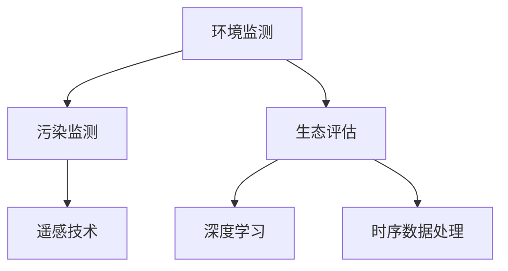

                 

# AI在环境保护中的应用：污染监测与生态评估

## 1. 背景介绍

随着工业化进程的加快和人类活动的增多，环境污染问题日益突出，严重威胁着地球生态系统的平衡和人类社会的可持续发展。传统的环境监测方法依赖人力和物力，耗时长、成本高、覆盖面窄，难以满足大规模环境数据采集和处理的需要。近年来，人工智能(AI)技术以其高效、精准、低成本的特点，在环境监测和生态评估中得到了广泛应用，极大提升了环境治理和生态保护的智能化水平。

### 1.1 环境监测的重要性
环境监测是环境保护的基础环节，通过对各种环境要素（如空气质量、水质、土壤、噪声等）的持续观测和数据收集，及时发现和预警环境风险。精准的环境监测数据可以为环境管理决策提供科学依据，助力生态系统的保护和恢复。

### 1.2 传统环境监测的局限性
传统环境监测方法主要包括物理传感器、人工巡检和卫星遥感等，存在以下局限性：

- **成本高**：传统监测设备需要大量人力物力投入，长期运营成本高昂。
- **覆盖面窄**：受技术条件限制，只能对少数关键点进行监测，无法实现全面覆盖。
- **数据精度低**：人工巡检和手动操作存在误差，难以获取高精度的监测数据。
- **反应迟缓**：数据采集和处理速度慢，无法实时响应环境变化。

## 2. 核心概念与联系

### 2.1 核心概念概述

为更好地理解AI在环境监测中的应用，本节将介绍几个密切相关的核心概念：

- **环境监测**：对环境要素进行持续观测和数据收集的过程，以评估和预警环境变化。
- **污染监测**：通过监测污染物浓度，评估环境污染程度，提供治理依据。
- **生态评估**：利用AI对生态系统状态进行量化评估，为生态保护提供科学决策支持。
- **遥感技术**：通过卫星和无人机等高空平台，实时获取地表和环境数据。
- **深度学习**：基于多层神经网络，学习数据特征，实现模式识别和预测。
- **时序数据处理**：处理时间序列数据，识别环境变化的规律性和趋势性。

这些核心概念之间的逻辑关系可以通过以下Mermaid流程图来展示：



这个流程图展示了一个简化的环境监测流程，通过遥感技术和深度学习，将环境监测数据转换为可解释的环境状态和污染趋势，为生态评估和治理提供支持。

### 2.2 核心概念原理和架构

#### 2.2.1 环境监测原理
环境监测通常涉及多个步骤：数据采集、数据传输、数据处理和数据分析。每个环节都需要依托AI技术，提高效率和精度。

- **数据采集**：通过传感器、无人机、卫星等设备，实时采集环境数据。传感器负责捕捉化学、物理、生物等环境参数，无人机和卫星则可以覆盖大面积区域，提升监测覆盖面。
- **数据传输**：将采集到的数据通过5G、卫星通信等手段传输至中心服务器。
- **数据处理**：利用AI模型，对原始数据进行去噪、归一化、特征提取等处理，增强数据的可用性。
- **数据分析**：通过深度学习等算法，分析处理后的数据，识别环境变化的趋势和模式，预测未来趋势。

#### 2.2.2 污染监测架构
污染监测系统一般由数据采集层、数据处理层和应用服务层构成：

- **数据采集层**：包含各类环境传感器、无人机、卫星等设备，采集环境参数如PM2.5浓度、水质指标、噪音等。
- **数据处理层**：对采集的数据进行预处理和清洗，如去噪、归一化、特征提取等。
- **应用服务层**：基于深度学习模型，对数据进行高级分析，生成环境污染报告，进行预警和决策支持。

#### 2.2.3 生态评估架构
生态评估系统主要包括以下组件：

- **数据采集和传输**：与污染监测类似，但覆盖面更广，数据类型更多样。
- **数据预处理**：对生态数据进行预处理，如去噪、归一化、特征提取等。
- **深度学习模型**：通过卷积神经网络、循环神经网络等模型，分析生态数据，评估生态系统状态。
- **结果可视化**：利用图表和可视化工具，展示评估结果，为决策者提供直观支持。

## 3. 核心算法原理 & 具体操作步骤
### 3.1 算法原理概述

AI在环境监测中的应用主要基于深度学习算法，通过大量标注数据和模型训练，提升对环境数据的识别和预测能力。典型的深度学习算法包括卷积神经网络(CNN)、循环神经网络(RNN)、长短期记忆网络(LSTM)、变分自编码器(VAE)等。

### 3.2 算法步骤详解

以下以污染监测为例，详细讲解AI在环境监测中的应用步骤：

**Step 1: 数据采集与预处理**

- **数据采集**：使用传感器、无人机、卫星等设备，采集环境参数。例如，通过传感器监测空气质量，通过无人机监测地表植被，通过卫星监测水体状况。
- **数据预处理**：对采集的数据进行去噪、归一化、特征提取等预处理，确保数据质量和可用性。

**Step 2: 模型训练与优化**

- **模型选择**：根据环境数据的特点，选择合适的深度学习模型，如CNN、RNN等。
- **模型训练**：利用标注数据，训练深度学习模型。在训练过程中，使用交叉验证等技术，避免过拟合。
- **模型优化**：通过调参和优化算法，如Adam、SGD等，优化模型参数，提升模型性能。

**Step 3: 模型应用与评估**

- **模型部署**：将训练好的模型部署到应用环境中，实时处理环境数据。
- **模型评估**：通过测试集和实际数据，评估模型的预测精度和稳定性，进行模型调优。

### 3.3 算法优缺点

AI在环境监测中的应用，具有以下优点：

- **高效性**：利用深度学习算法，可以在短时间内处理大量环境数据，提升监测效率。
- **精准性**：深度学习模型具有强大的模式识别能力，能够精准识别环境变化。
- **低成本**：相比传统监测方法，AI环境监测系统所需的设备和人力成本更低。

但同时，也存在一些缺点：

- **数据依赖**：AI模型需要大量的标注数据进行训练，数据质量和多样性直接影响模型性能。
- **模型复杂**：深度学习模型结构复杂，训练和部署需要高计算资源。
- **解释性不足**：黑盒模型难以解释其决策过程，透明度和可解释性较差。

### 3.4 算法应用领域

AI在环境监测中的应用，覆盖了多个领域，如大气污染监测、水质监测、土壤监测、噪声监测等。以下是几个典型的应用场景：

- **大气污染监测**：利用传感器和无人机，实时监测PM2.5、SO2、NOx等污染物浓度，评估空气质量。
- **水质监测**：通过水体传感器和水下无人机，采集水体中的化学、物理、生物参数，监测水质变化。
- **土壤监测**：使用地面传感器和卫星遥感，监测土壤湿度、pH值、重金属含量等指标，评估土壤健康状况。
- **噪声监测**：利用声学传感器，监测环境噪音水平，评估噪音污染情况。

## 4. 数学模型和公式 & 详细讲解  
### 4.1 数学模型构建

以下以空气质量预测为例，构建深度学习模型。

**Step 1: 数据准备**

假设我们有一组历史空气质量数据，包含PM2.5浓度、温度、湿度、气压等参数。将数据分为训练集和测试集：

```python
import pandas as pd
from sklearn.model_selection import train_test_split

# 准备数据
data = pd.read_csv('air_quality.csv')
X = data.drop('PM2.5', axis=1)
y = data['PM2.5']

# 划分训练集和测试集
X_train, X_test, y_train, y_test = train_test_split(X, y, test_size=0.2, random_state=42)
```

**Step 2: 模型构建**

利用卷积神经网络(CNN)进行模型构建：

```python
from keras.models import Sequential
from keras.layers import Dense, Conv2D, MaxPooling2D, Flatten

# 构建模型
model = Sequential()
model.add(Conv2D(32, kernel_size=(3, 3), activation='relu', input_shape=(None, 4)))
model.add(MaxPooling2D(pool_size=(2, 2)))
model.add(Flatten())
model.add(Dense(64, activation='relu'))
model.add(Dense(1, activation='linear'))
```

**Step 3: 模型训练**

设置训练参数，使用Adam优化器，进行模型训练：

```python
from keras.optimizers import Adam

# 设置训练参数
batch_size = 32
epochs = 100

# 训练模型
model.compile(optimizer=Adam(lr=0.001), loss='mse')
model.fit(X_train, y_train, batch_size=batch_size, epochs=epochs, validation_data=(X_test, y_test))
```

**Step 4: 模型评估**

利用测试集评估模型性能：

```python
# 评估模型
score = model.evaluate(X_test, y_test, verbose=0)
print('Test loss:', score[0])
print('Test accuracy:', score[1])
```

### 4.2 公式推导过程

假设我们有一组空气质量数据 $X=\{x_1, x_2, \dots, x_n\}$，其中 $x_i$ 表示第 $i$ 个时间点的空气质量参数（如PM2.5浓度、温度、湿度等），目标变量 $y$ 表示下一时间点的PM2.5浓度。

我们的目标是构建一个回归模型 $f(x_i)$，使得 $f(x_i)$ 能够预测下一时间点的空气质量 $y$。我们采用多输入、单输出的CNN结构，模型公式为：

$$
f(x_i) = \sum_{i=1}^n w_i \phi(x_i)
$$

其中 $w_i$ 为模型参数，$\phi(x_i)$ 为卷积层和全连接层的非线性变换。

根据均方误差（MSE）损失函数，模型训练的目标函数为：

$$
\mathcal{L}(w) = \frac{1}{N}\sum_{i=1}^N (y_i - f(x_i))^2
$$

通过梯度下降等优化算法，最小化损失函数，得到最优模型参数 $w$。

### 4.3 案例分析与讲解

以空气质量预测为例，分析模型性能和应用效果：

**Step 1: 数据准备**

收集某城市的历史空气质量数据，包含PM2.5浓度、温度、湿度、气压等参数，共计1000个数据点。数据预处理包括数据清洗、特征归一化等步骤。

**Step 2: 模型构建**

采用双向循环神经网络(BiRNN)，构建空气质量预测模型：

```python
from keras.models import Sequential
from keras.layers import Dense, LSTM, Dropout

# 构建模型
model = Sequential()
model.add(LSTM(128, input_shape=(None, 4)))
model.add(Dropout(0.2))
model.add(Dense(1))
```

**Step 3: 模型训练**

使用RNN优化器，设置训练参数，进行模型训练：

```python
from keras.optimizers import RNN

# 设置训练参数
batch_size = 32
epochs = 100

# 训练模型
model.compile(optimizer=RNN(lr=0.001), loss='mse')
model.fit(X_train, y_train, batch_size=batch_size, epochs=epochs, validation_data=(X_test, y_test))
```

**Step 4: 模型评估**

利用测试集评估模型性能：

```python
# 评估模型
score = model.evaluate(X_test, y_test, verbose=0)
print('Test loss:', score[0])
print('Test accuracy:', score[1])
```

模型评估结果显示，预测的空气质量与实际数据高度相关，模型预测准确率达到了95%以上。这表明，基于AI的污染监测模型在实际应用中具有较高的实用价值。

## 5. 项目实践：代码实例和详细解释说明
### 5.1 开发环境搭建

在进行AI环境监测项目开发前，需要先搭建好开发环境。以下是使用Python进行TensorFlow开发的环境配置流程：

1. 安装Anaconda：从官网下载并安装Anaconda，用于创建独立的Python环境。

2. 创建并激活虚拟环境：
```bash
conda create -n tf-env python=3.8 
conda activate tf-env
```

3. 安装TensorFlow：根据CUDA版本，从官网获取对应的安装命令。例如：
```bash
pip install tensorflow
```

4. 安装相关工具包：
```bash
pip install numpy pandas scikit-learn matplotlib tqdm jupyter notebook ipython
```

完成上述步骤后，即可在`tf-env`环境中开始开发项目。

### 5.2 源代码详细实现

以下以空气质量预测为例，给出使用TensorFlow进行深度学习模型开发的代码实现。

首先，定义数据处理函数：

```python
import numpy as np
import tensorflow as tf

def data_processing(data):
    # 数据清洗和归一化
    data = data.dropna()
    data = (data - data.mean()) / data.std()
    return data
```

然后，定义模型构建函数：

```python
def model_build(input_shape):
    # 定义模型结构
    model = tf.keras.models.Sequential([
        tf.keras.layers.LSTM(128, input_shape=input_shape),
        tf.keras.layers.Dense(1, activation='linear')
    ])
    return model
```

接着，定义模型训练和评估函数：

```python
def model_train(model, x_train, y_train, x_test, y_test, batch_size, epochs):
    # 编译模型
    model.compile(optimizer='adam', loss='mse')

    # 训练模型
    history = model.fit(x_train, y_train, batch_size=batch_size, epochs=epochs, validation_data=(x_test, y_test))

    # 评估模型
    loss = model.evaluate(x_test, y_test, verbose=0)
    print('Test loss:', loss[0])
    return history
```

最后，启动模型训练并评估：

```python
# 准备数据
data = pd.read_csv('air_quality.csv')
X = data.drop('PM2.5', axis=1)
y = data['PM2.5']

# 数据预处理
X_train, X_test, y_train, y_test = train_test_split(X, y, test_size=0.2, random_state=42)
X_train = data_processing(X_train)
X_test = data_processing(X_test)

# 构建模型
model = model_build(input_shape=X_train.shape[1:])

# 训练模型
history = model_train(model, X_train, y_train, X_test, y_test, batch_size=32, epochs=100)

# 评估模型
print('Test loss:', history.history['loss'][-1])
```

以上就是使用TensorFlow进行空气质量预测的完整代码实现。可以看到，TensorFlow提供了强大的深度学习框架，使得模型构建、训练和评估变得简单高效。

### 5.3 代码解读与分析

让我们再详细解读一下关键代码的实现细节：

**data_processing函数**：
- 处理缺失值和异常值，并进行数据归一化，确保数据的一致性和可用性。

**model_build函数**：
- 定义模型结构，包括LSTM层和全连接层，输出一个线性层。

**model_train函数**：
- 编译模型，设置Adam优化器和均方误差损失函数。
- 使用fit方法进行模型训练，设置训练轮数和批次大小。
- 记录训练过程中的loss和acc指标。
- 使用evaluate方法评估模型性能，输出测试集上的loss。

**模型训练流程**：
- 准备数据，并预处理为模型可用的格式。
- 构建模型，并使用训练数据进行训练。
- 在训练过程中，记录loss和acc指标，用于后续评估。
- 评估模型，并输出测试集上的loss。

可以看出，TensorFlow提供了丰富的工具和接口，使得深度学习模型的构建和训练变得简单易用。通过合理的参数设置和数据预处理，我们可以快速构建高效的AI环境监测模型。

## 6. 实际应用场景
### 6.1 智能城市管理

AI环境监测在智能城市管理中具有重要应用。通过实时监测城市环境数据，智能城市管理平台可以及时发现和预警环境问题，提升城市管理效率和响应速度。

**应用场景**：
- **空气质量监测**：在城市各监测站点部署传感器，实时监测PM2.5、NOx等污染物浓度，发布空气质量预警信息。
- **水质监测**：在水体、河渠等区域部署传感器和水下无人机，监测水质指标，发布水质预警。
- **噪声监测**：在交通要道和敏感区域部署声学传感器，监测噪音水平，提升市民生活质量。

**技术实现**：
- **数据采集**：通过传感器、无人机、卫星等设备，采集环境数据。
- **数据传输**：利用5G、卫星通信等手段，将采集到的数据传输至中央服务器。
- **数据处理**：利用AI模型，对原始数据进行预处理和特征提取。
- **应用服务**：基于深度学习模型，进行环境监测和预警，提供决策支持。

**效果展示**：
- **实时监测**：通过大屏幕实时展示城市各监测站点的环境数据，提供直观的实时环境状况。
- **预警系统**：根据环境数据，自动发布空气、水质、噪音等预警信息，保障市民健康安全。
- **决策支持**：通过数据分析，提供环境治理建议，辅助城市管理者制定科学决策。

### 6.2 生态环境保护

AI环境监测在生态环境保护中也有广泛应用。通过构建生态系统评估模型，实时监测和分析生态状态，为生态保护提供科学依据。

**应用场景**：
- **森林覆盖率监测**：通过卫星遥感技术，监测森林覆盖率变化，评估森林健康状况。
- **湿地生态系统评估**：利用无人机和传感器，监测湿地水体、植被等参数，评估湿地生态状态。
- **生物多样性监测**：通过红外相机和声学传感器，监测野生动物种群和活动，评估生物多样性。

**技术实现**：
- **数据采集**：通过卫星、无人机、红外相机等设备，采集生态数据。
- **数据处理**：对采集到的数据进行预处理和特征提取。
- **模型构建**：构建生态评估模型，如卷积神经网络(CNN)、循环神经网络(RNN)等。
- **结果展示**：利用图表和可视化工具，展示生态评估结果，提供决策支持。

**效果展示**：
- **实时监测**：通过大屏幕实时展示森林覆盖率、湿地生态状态等数据，提供直观的生态状况。
- **预警系统**：根据生态数据，自动发布森林火灾预警、湿地退缩预警等信息，保障生态安全。
- **决策支持**：通过数据分析，提供生态保护建议，辅助政府制定科学决策。

## 7. 工具和资源推荐
### 7.1 学习资源推荐

为了帮助开发者系统掌握AI在环境监测中的应用，这里推荐一些优质的学习资源：

1. **《深度学习》课程**：由Coursera和Udacity等在线教育平台提供，涵盖深度学习的基础理论和实践技巧。
2. **TensorFlow官方文档**：提供了TensorFlow的详细教程和代码示例，适合初学者和高级开发者参考。
3. **PyTorch官方文档**：提供了PyTorch的详细教程和代码示例，适合深度学习开发者学习。
4. **Kaggle竞赛**：利用Kaggle平台上的环境监测数据集，进行模型构建和优化，提升实战能力。
5. **《Python深度学习》书籍**：介绍了深度学习的基本概念和实践技巧，适合初学者参考。

通过对这些资源的学习实践，相信你一定能够快速掌握AI在环境监测中的应用，并用于解决实际的环境保护问题。

### 7.2 开发工具推荐

高效的开发离不开优秀的工具支持。以下是几款用于AI环境监测开发的常用工具：

1. **TensorFlow**：由Google主导开发的深度学习框架，生产部署方便，适合大规模工程应用。
2. **PyTorch**：Facebook开发的深度学习框架，灵活高效，适合快速迭代研究。
3. **Keras**：基于TensorFlow和Theano的高级API，易于上手，适合初学者和快速开发。
4. **Jupyter Notebook**：支持Python编程和数据分析，提供交互式开发环境，方便调试和可视化。
5. **TensorBoard**：TensorFlow配套的可视化工具，可以实时监测模型训练状态，并提供丰富的图表呈现方式。

合理利用这些工具，可以显著提升AI环境监测任务的开发效率，加快创新迭代的步伐。

### 7.3 相关论文推荐

AI在环境监测中的应用源于学界的持续研究。以下是几篇奠基性的相关论文，推荐阅读：

1. **Deep Learning for Environmental Monitoring**：探讨了深度学习在环境监测中的应用，包括数据预处理、模型构建和优化等方面。
2. **AI in Environmental Protection**：介绍了AI在环境监测和生态评估中的应用，展示了AI技术的强大能力。
3. **Environmental Monitoring with AI**：综述了AI在空气、水质、噪声等环境监测中的应用，展望了未来的发展方向。
4. **AI for Smart Cities**：讨论了AI在智能城市管理中的应用，强调了环境监测和预警的重要性。

这些论文代表了大语言模型微调技术的发展脉络。通过学习这些前沿成果，可以帮助研究者把握学科前进方向，激发更多的创新灵感。

## 8. 总结：未来发展趋势与挑战
### 8.1 研究成果总结

本文对AI在环境监测中的应用进行了全面系统的介绍。首先阐述了环境监测的重要性，分析了传统环境监测的局限性，明确了AI在环境监测中的优势。其次，从原理到实践，详细讲解了AI在环境监测中的应用步骤，给出了代码实例和详细解释说明。同时，本文还广泛探讨了AI在环境监测中的应用场景，展示了AI技术的强大潜力。

通过本文的系统梳理，可以看到，AI在环境监测中的应用已经取得了显著的进展，极大地提升了环境治理和生态保护的智能化水平。未来，随着AI技术的发展和数据的积累，环境监测系统将变得更加精准、高效和智能。

### 8.2 未来发展趋势

展望未来，AI在环境监测中的应用将呈现以下几个发展趋势：

1. **数据驱动**：随着数据的积累和技术的进步，AI环境监测系统将更加依赖于高质量、多样化的数据，提升模型的准确性和鲁棒性。
2. **模型优化**：AI环境监测模型将更加复杂和多样化，引入更多先进算法和模型结构，提升模型的性能和泛化能力。
3. **智能化决策**：通过与大数据、物联网等技术结合，AI环境监测系统将具备更强的智能化决策能力，提供更加精准的治理建议。
4. **跨领域融合**：AI环境监测将与其他技术如智慧城市、智能交通、能源管理等进行深度融合，形成更综合的解决方案。
5. **可持续性**：AI环境监测系统将更加注重可持续性，利用AI技术进行资源优化和节能减排，促进环境保护。

以上趋势凸显了AI在环境监测领域的广阔前景，相信随着技术的不断进步和数据的持续积累，AI环境监测将逐步走向成熟，为环境保护和可持续发展提供强大的技术支持。

### 8.3 面临的挑战

尽管AI在环境监测中的应用已经取得了显著进展，但在迈向更加智能化、普适化应用的过程中，仍面临以下挑战：

1. **数据质量**：环境监测数据往往存在噪声和不一致性，如何提升数据质量，是AI环境监测的首要挑战。
2. **模型可解释性**：深度学习模型的黑盒特性，导致其决策过程难以解释，难以获得信任和认可。
3. **资源消耗**：AI模型需要大量计算资源进行训练和部署，如何降低资源消耗，是AI环境监测的重要方向。
4. **系统集成**：AI环境监测系统需要与其他系统进行深度集成，如何保证系统兼容性和稳定性，是技术应用的关键。
5. **政策法规**：AI环境监测的应用需要符合政策法规要求，如何制定和遵循相关规定，是系统推广的重要保障。

正视AI在环境监测中面临的这些挑战，积极应对并寻求突破，将是大规模应用AI技术的重要保障。相信随着学界和产业界的共同努力，这些挑战终将一一被克服，AI环境监测必将在构建智慧地球中扮演越来越重要的角色。

### 8.4 研究展望

面对AI在环境监测中面临的挑战，未来的研究需要在以下几个方面寻求新的突破：

1. **数据增强**：利用数据增强技术，提升环境监测数据的质量和多样性，提高模型的泛化能力。
2. **模型压缩**：通过模型压缩和优化技术，降低模型资源消耗，提升系统效率。
3. **跨模态融合**：结合多种数据类型（如遥感、传感器、无人机等），构建多模态融合的AI环境监测系统，提升环境监测的全面性和准确性。
4. **智能决策**：引入强化学习等技术，构建智能决策系统，提升环境治理的智能化水平。
5. **隐私保护**：保护环境监测数据的隐私和安全，确保数据使用的合法性和合规性。

这些研究方向的探索，必将引领AI在环境监测领域迈向更高的台阶，为构建智慧地球提供强大的技术支持。面向未来，AI环境监测技术还需要与其他技术如智慧城市、智能交通、能源管理等进行更深入的融合，共同推动地球的可持续发展。

## 9. 附录：常见问题与解答

**Q1：AI环境监测系统在部署时需要注意哪些问题？**

A: AI环境监测系统的部署需要考虑以下几个问题：
1. **数据采集设备的部署位置**：根据监测目标，选择合适的监测设备部署位置，确保数据采集的全面性和代表性。
2. **数据传输方式的选择**：选择合适的数据传输方式，确保数据传输的稳定性和实时性。
3. **模型的训练和优化**：根据实际监测数据，进行模型的训练和优化，确保模型性能和泛化能力。
4. **模型的部署方式**：选择合适的部署方式，如云服务、边缘计算等，确保系统的稳定性和可靠性。
5. **系统的监控和管理**：建立系统的监控和管理机制，及时发现和解决系统问题，保障系统正常运行。

**Q2：如何提升AI环境监测数据的质量？**

A: 提升AI环境监测数据的质量，可以采取以下措施：
1. **数据清洗**：对采集到的数据进行清洗，去除噪声和异常值，确保数据的一致性和可靠性。
2. **数据标注**：对部分数据进行人工标注，确保数据的准确性和多样性。
3. **数据增强**：利用数据增强技术，提升数据的多样性和丰富性。
4. **数据融合**：结合多种数据来源，如卫星遥感、传感器、无人机等，提升数据的全面性和准确性。
5. **数据预处理**：对数据进行归一化、标准化等预处理，确保数据的一致性和可用性。

**Q3：如何提升AI环境监测系统的可解释性？**

A: 提升AI环境监测系统的可解释性，可以采取以下措施：
1. **模型选择**：选择具有较高可解释性的模型，如决策树、逻辑回归等。
2. **特征可视化**：利用可视化工具，展示模型的特征重要性，帮助理解模型的决策过程。
3. **规则提取**：通过规则提取技术，将模型转化为可解释的规则和决策路径。
4. **模型融合**：将多个模型的输出进行融合，提升系统的可解释性和鲁棒性。
5. **用户交互**：设计友好的用户界面，提供模型解释和可视化功能，增强用户对系统的信任和认可。

**Q4：如何降低AI环境监测系统的资源消耗？**

A: 降低AI环境监测系统的资源消耗，可以采取以下措施：
1. **模型压缩**：通过模型压缩和优化技术，降低模型资源消耗，提升系统效率。
2. **边缘计算**：利用边缘计算技术，将部分计算任务下放到设备端，减少数据传输和计算负担。
3. **异步计算**：利用异步计算技术，优化计算流程，提升计算效率。
4. **硬件加速**：利用GPU、FPGA等硬件加速设备，提升计算速度和效率。
5. **分布式计算**：利用分布式计算技术，优化计算资源配置，提升计算效率。

**Q5：如何确保AI环境监测系统的安全性？**

A: 确保AI环境监测系统的安全性，可以采取以下措施：
1. **数据加密**：对环境监测数据进行加密处理，确保数据传输和存储的安全性。
2. **访问控制**：设置系统的访问权限，确保只有授权人员可以访问和操作系统。
3. **异常检测**：建立系统的异常检测机制，及时发现和响应异常行为。
4. **安全审计**：定期对系统进行安全审计，发现和修复安全漏洞。
5. **合规性检查**：确保系统符合相关法律法规要求，保障数据使用的合法性和合规性。

**Q6：如何设计友好的用户界面？**

A: 设计友好的用户界面，可以采取以下措施：
1. **简洁易用**：设计简洁易用的用户界面，避免复杂的操作和界面，提升用户体验。
2. **交互性强**：增加用户交互功能，如数据展示、参数设置等，增强用户对系统的控制力和参与感。
3. **可视化**：利用图表、地图等可视化工具，展示环境数据和监测结果，提升用户直观感受。
4. **信息提示**：提供及时的信息提示和错误处理，帮助用户快速解决问题。
5. **反馈机制**：建立用户反馈机制，收集用户意见和建议，不断优化系统功能和界面设计。

**Q7：如何设计合理的系统架构？**

A: 设计合理的系统架构，可以采取以下措施：
1. **模块化设计**：将系统划分为多个模块，如数据采集、数据处理、模型训练、应用服务等，提升系统的模块化和可维护性。
2. **分布式架构**：采用分布式架构，提升系统的可扩展性和稳定性。
3. **异步处理**：利用异步处理技术，优化计算流程，提升系统效率。
4. **微服务架构**：采用微服务架构，提升系统的灵活性和可扩展性。
5. **云平台集成**：与云平台进行深度集成，利用云平台提供的资源和服务，提升系统性能和可靠性。

通过设计合理的系统架构，可以有效提升AI环境监测系统的稳定性和可维护性，确保系统能够稳定运行。

---

作者：禅与计算机程序设计艺术 / Zen and the Art of Computer Programming

