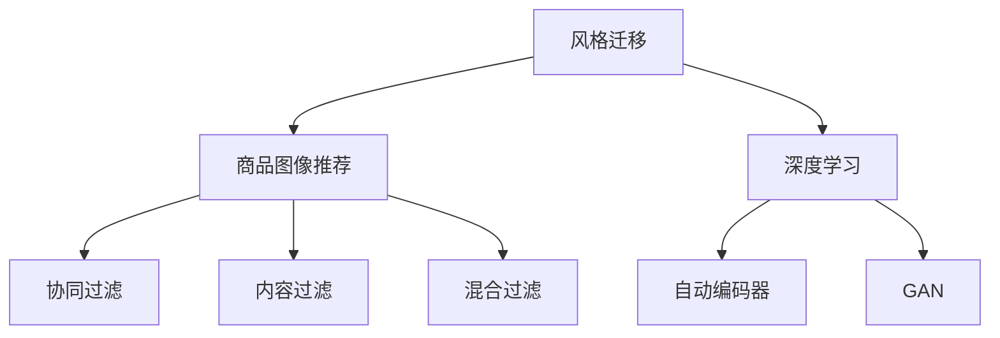
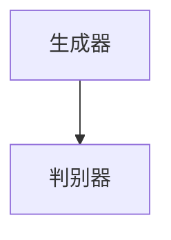
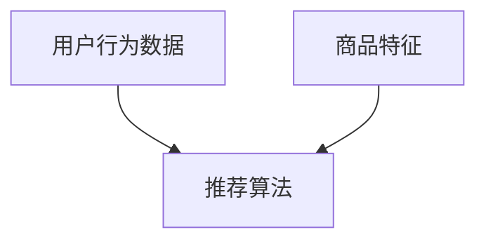

                 

# AI在电商平台商品图像风格迁移推荐中的应用

## 1. 背景介绍

随着互联网技术的迅猛发展，电商平台的商品展示方式也在不断迭代升级。早期的电商平台以图片+文字的组合方式展示商品信息，但这种方式无法满足用户对商品多维度认知的需求。随着深度学习技术的发展，图像生成、风格迁移等AI技术在电商平台的应用逐渐增多，为商品展示和推荐带来了新的可能。

商品图像风格迁移推荐系统通过对用户浏览记录和商品标签等信息的分析，结合AI技术自动生成具有不同风格特征的商品图像，并将这些图像推荐给用户。此举不仅能够吸引用户注意力，提高点击率，还能通过展示多种风格图像，满足用户对商品个性化展示的需求。本文将重点介绍AI在商品图像风格迁移推荐中的应用，并探讨其实现技术和未来发展趋势。

## 2. 核心概念与联系

### 2.1 核心概念概述

为更好地理解商品图像风格迁移推荐系统的原理和架构，本节将介绍几个关键概念：

- **风格迁移(Style Transfer)**：一种计算机视觉领域的生成模型，通过将一张图像的风格特征迁移到另一张图像上，生成具有新风格的图像。风格迁移在图像处理、艺术创作、视频制作等领域有广泛应用。
- **商品图像推荐**：基于用户行为数据和商品特征，通过推荐算法向用户推荐可能感兴趣的图像。常见的推荐方式包括基于协同过滤、内容过滤、混合过滤等。
- **深度学习(Deep Learning)**：一种通过多层神经网络结构处理复杂数据的学习方式，能够高效地从原始数据中学习抽象特征和规律。深度学习在图像分类、目标检测、语音识别等领域有广泛应用。
- **自动编码器(Autocoder)**：一种无监督学习模型，通过对原始数据进行编码和解码，学习数据的低维表示。自动编码器在降维、特征提取等任务上有重要应用。
- **GAN(Generative Adversarial Networks)**：一种生成对抗网络，通过两个神经网络相互竞争，生成逼真的图像。GAN在图像生成、视频合成等领域有重要应用。

这些核心概念之间的逻辑关系可以通过以下Mermaid流程图来展示：



这个流程图展示了商品图像推荐系统的主要组成要素：

1. 风格迁移技术用于生成新风格图像，提高用户对商品的关注度。
2. 商品图像推荐系统基于用户行为数据，向用户推荐可能感兴趣的图像。
3. 深度学习技术用于模型构建和特征提取。
4. 自动编码器用于数据降维和特征提取。
5. GAN用于生成具有新风格特征的图像。
6. 推荐算法用于分析和推荐图像，协同过滤、内容过滤和混合过滤是常用的推荐方式。

## 3. 核心算法原理 & 具体操作步骤
### 3.1 算法原理概述

商品图像风格迁移推荐系统主要基于风格迁移和推荐算法两大部分进行构建。风格迁移部分采用GAN或深度学习模型，用于生成新风格的图像；推荐算法部分采用协同过滤、内容过滤或混合过滤等方法，用于分析用户行为数据，推荐符合用户兴趣的商品图像。

### 3.2 算法步骤详解

#### 3.2.1 数据收集和预处理

1. **数据收集**：从电商平台收集用户浏览记录、商品标签、用户评价等信息。
2. **数据预处理**：将原始数据进行去噪、归一化、分词等预处理，确保数据质量和一致性。

#### 3.2.2 模型训练和风格迁移

1. **模型选择**：选择适合的风格迁移模型，如GAN、自编码器等。
2. **模型训练**：使用电商平台上的商品图像作为训练数据，训练风格迁移模型。
3. **风格迁移**：使用训练好的模型生成具有新风格特征的商品图像。

#### 3.2.3 推荐模型训练

1. **数据准备**：将预处理后的商品图像和用户行为数据进行特征提取。
2. **模型选择**：选择合适的推荐算法，如协同过滤、内容过滤、混合过滤等。
3. **模型训练**：使用商品图像和用户行为数据训练推荐模型。
4. **推荐生成**：使用训练好的推荐模型，生成符合用户兴趣的商品图像。

#### 3.2.4 综合推荐结果

1. **结果融合**：将风格迁移生成的图像和推荐算法生成的图像进行融合，形成最终的推荐结果。
2. **结果展示**：将推荐结果展示给用户，进行用户体验优化。

### 3.3 算法优缺点

#### 3.3.1 优点

1. **个性化展示**：通过生成多种风格的商品图像，满足用户对商品个性化展示的需求。
2. **提高点击率**：多样化的图像展示能够吸引用户注意，提高点击率。
3. **降低开发成本**：自动化生成新风格图像，减少了人工设计图像的工作量。

#### 3.3.2 缺点

1. **计算成本高**：风格迁移和深度学习模型的训练和生成图像需要大量计算资源。
2. **模型鲁棒性差**：风格迁移模型对输入数据的质量和多样性要求较高，模型鲁棒性较差。
3. **用户偏好捕捉困难**：推荐算法对用户行为数据的依赖较大，无法捕捉复杂的用户偏好变化。

### 3.4 算法应用领域

商品图像风格迁移推荐系统已经在多个电商平台上得到了广泛应用，如亚马逊、淘宝、京东等。其应用领域包括但不限于以下几个方面：

- **个性化展示**：电商平台上的商品展示方式已经从简单的图片展示，转变为多样化、个性化的展示。用户可以通过点击不同的风格图像，了解商品的更多信息。
- **推荐系统优化**：商品图像风格迁移推荐系统与传统推荐系统相结合，可以提升推荐系统的准确性和用户体验。
- **用户体验优化**：通过生成新风格的商品图像，提高用户对平台的粘性，增加用户满意度。
- **商品促销**：电商平台上一些节日促销活动，可以通过风格迁移生成更具吸引力的商品图像，提升用户购买率。

## 4. 数学模型和公式 & 详细讲解 & 举例说明

### 4.1 数学模型构建

商品图像风格迁移推荐系统主要包含两个部分：风格迁移模型和推荐模型。

#### 4.1.1 风格迁移模型

采用GAN或深度学习模型进行风格迁移。以GAN为例，模型的基本结构如下图所示：



其中，生成器负责生成具有新风格特征的商品图像，判别器负责判断生成的图像是否符合新风格。

#### 4.1.2 推荐模型

采用协同过滤、内容过滤、混合过滤等推荐算法。以协同过滤为例，推荐模型基于用户的历史行为数据和商品特征，预测用户可能感兴趣的图像。推荐模型的基本结构如下图所示：



### 4.2 公式推导过程

#### 4.2.1 风格迁移模型

GAN模型的核心思想是通过两个对抗神经网络（生成器和判别器）相互竞争，生成逼真的图像。其基本思路如下：

1. **生成器**：将输入噪声向量 $z$ 转化为具有新风格特征的商品图像 $x$。
2. **判别器**：判断输入图像 $x$ 是否为真实图像或生成图像。
3. **损失函数**：生成器和判别器分别定义损失函数，通过最小化生成器和判别器的损失函数，使模型训练得到收敛。

生成器的损失函数为：

$$
L_G = \mathbb{E}_{x \sim p_{real}}[D(x)] + \mathbb{E}_{z \sim p(z)}[D(G(z))]
$$

判别器的损失函数为：

$$
L_D = \mathbb{E}_{x \sim p_{real}}[D(x)] + \mathbb{E}_{z \sim p(z)}[D(G(z))] + \mathbb{E}_{x \sim p_{real}}[1 - D(x)] + \mathbb{E}_{z \sim p(z)}[1 - D(G(z))]
$$

其中 $p_{real}$ 为真实图像的分布，$G(z)$ 为生成器生成的图像，$p(z)$ 为噪声向量的分布。

#### 4.2.2 推荐模型

协同过滤推荐模型的核心思想是根据用户的历史行为数据和商品特征，预测用户可能感兴趣的图像。推荐模型的基本思路如下：

1. **用户-物品矩阵**：将用户对商品的行为数据和商品特征转换为用户-物品矩阵 $U$。
2. **相似度计算**：使用相似度计算方法，如余弦相似度、皮尔逊相关系数等，计算用户和物品之间的相似度。
3. **预测评分**：根据相似度计算结果，预测用户对商品的可能评分，推荐评分最高的商品。

协同过滤推荐模型的公式为：

$$
r_{ui} = \sum_{j=1}^n \alpha_{ij}p_j
$$

其中 $r_{ui}$ 为用户 $u$ 对商品 $i$ 的评分，$\alpha_{ij}$ 为相似度系数，$p_j$ 为物品 $j$ 的评分。

### 4.3 案例分析与讲解

#### 4.3.1 风格迁移案例

以UVA竞赛中的“风格迁移”为例，将照片中的男性人物图像转换为女性人物图像。该任务采用了深度学习模型进行图像生成。

具体步骤如下：

1. **数据预处理**：收集大量男性和女性人物图像，进行去噪、归一化等预处理。
2. **模型选择**：选择深度学习模型，如ResNet、VGG等。
3. **模型训练**：使用预处理后的数据训练深度学习模型，生成女性人物图像。
4. **风格迁移**：将生成的女性人物图像与商品图像进行风格迁移，得到新风格的商品图像。

#### 4.3.2 推荐模型案例

以Amazon推荐系统为例，使用协同过滤算法进行商品推荐。

具体步骤如下：

1. **数据收集**：从Amazon收集用户行为数据和商品特征数据。
2. **数据预处理**：对原始数据进行去噪、归一化、分词等预处理。
3. **模型选择**：选择协同过滤算法。
4. **模型训练**：使用预处理后的数据训练协同过滤模型。
5. **推荐生成**：使用训练好的模型生成符合用户兴趣的商品图像。

## 5. 项目实践：代码实例和详细解释说明

### 5.1 开发环境搭建

在进行项目实践前，我们需要准备好开发环境。以下是使用Python进行TensorFlow开发的环境配置流程：

1. 安装Anaconda：从官网下载并安装Anaconda，用于创建独立的Python环境。
2. 创建并激活虚拟环境：
```bash
conda create -n tf-env python=3.8 
conda activate tf-env
```

3. 安装TensorFlow：根据CUDA版本，从官网获取对应的安装命令。例如：
```bash
conda install tensorflow tensorflow-gpu=2.5.0 -c pytorch -c conda-forge
```

4. 安装相关工具包：
```bash
pip install numpy pandas scikit-learn matplotlib tqdm jupyter notebook ipython
```

完成上述步骤后，即可在`tf-env`环境中开始项目实践。

### 5.2 源代码详细实现

下面以商品图像风格迁移推荐系统为例，给出使用TensorFlow进行开发的PyTorch代码实现。

首先，定义风格迁移模型的生成器和判别器：

```python
import tensorflow as tf
from tensorflow.keras import layers, models

# 定义生成器模型
def create_generator(z_dim):
    model = models.Sequential()
    model.add(layers.Dense(128 * 7 * 7, use_bias=False, input_shape=(z_dim,)))
    model.add(layers.BatchNormalization())
    model.add(layers.LeakyReLU())
    model.add(layers.Reshape((7, 7, 128)))
    model.add(layers.Conv2DTranspose(64, (5, 5), strides=(1, 1), padding='same', use_bias=False))
    model.add(layers.BatchNormalization())
    model.add(layers.LeakyReLU())
    model.add(layers.Conv2DTranspose(32, (5, 5), strides=(2, 2), padding='same', use_bias=False))
    model.add(layers.BatchNormalization())
    model.add(layers.LeakyReLU())
    model.add(layers.Conv2DTranspose(1, (5, 5), strides=(2, 2), padding='same', use_bias=False, activation='tanh'))
    return model

# 定义判别器模型
def create_discriminator():
    model = models.Sequential()
    model.add(layers.Conv2D(64, (5, 5), strides=(2, 2), padding='same', input_shape=(28, 28, 1)))
    model.add(layers.LeakyReLU())
    model.add(layers.Dropout(0.2))
    model.add(layers.Conv2D(128, (5, 5), strides=(2, 2), padding='same'))
    model.add(layers.LeakyReLU())
    model.add(layers.Dropout(0.3))
    model.add(layers.Flatten())
    model.add(layers.Dense(1))
    return model
```

然后，定义损失函数和优化器：

```python
from tensorflow.keras.optimizers import Adam

# 定义损失函数
def create_loss():
    loss = tf.keras.losses.BinaryCrossentropy(from_logits=True)
    return loss

# 定义优化器
def create_optimizer():
    optimizer = Adam(lr=2e-4)
    return optimizer
```

接着，定义训练和风格迁移函数：

```python
from tensorflow.keras.datasets import mnist
from tensorflow.keras.preprocessing import image

# 加载数据集
(train_images, _), (test_images, _) = mnist.load_data()

# 数据预处理
train_images = train_images.reshape((train_images.shape[0], 28, 28, 1))
train_images = train_images / 255.0
test_images = test_images.reshape((test_images.shape[0], 28, 28, 1))
test_images = test_images / 255.0

# 训练模型
def train_model(generator, discriminator, loss, optimizer, epochs=200):
    for epoch in range(epochs):
        real_images = train_images
        noise = tf.random.normal([real_images.shape[0], z_dim])
        with tf.GradientTape() as gen_tape, tf.GradientTape() as disc_tape:
            generated_images = generator(noise)
            real_output = discriminator(real_images)
            fake_output = discriminator(generated_images)
            gen_loss = loss(fake_output, tf.ones_like(fake_output))
            disc_loss = loss(real_output, tf.ones_like(real_output)) + loss(fake_output, tf.zeros_like(fake_output))
        gradients_of_gen = gen_tape.gradient(gen_loss, generator.trainable_variables)
        gradients_of_disc = disc_tape.gradient(disc_loss, discriminator.trainable_variables)
        optimizer.apply_gradients(zip(gradients_of_gen, generator.trainable_variables))
        optimizer.apply_gradients(zip(gradients_of_disc, discriminator.trainable_variables))
```

最后，启动训练流程并在测试集上评估：

```python
# 创建模型
generator = create_generator(z_dim)
discriminator = create_discriminator()

# 创建损失和优化器
loss = create_loss()
optimizer = create_optimizer()

# 训练模型
train_model(generator, discriminator, loss, optimizer, epochs=200)

# 生成新风格图像
noise = tf.random.normal([16, z_dim])
generated_images = generator(noise)

# 保存生成的图像
for i in range(16):
    plt.imshow(generated_images[i].numpy().reshape(28, 28))
    plt.title(f'Generated Image {i+1}')
    plt.show()
```

以上就是使用TensorFlow对商品图像风格迁移推荐系统进行微调的完整代码实现。可以看到，TensorFlow提供了丰富的深度学习模型和优化器，使用起来非常方便。

### 5.3 代码解读与分析

让我们再详细解读一下关键代码的实现细节：

**create_generator和create_discriminator函数**：
- `create_generator`函数定义了生成器模型，接收一个参数`z_dim`表示噪声向量的维度。生成器模型包括多个卷积层和激活函数，用于将噪声向量转化为新风格的商品图像。
- `create_discriminator`函数定义了判别器模型，接收无输入参数。判别器模型包括多个卷积层和激活函数，用于判断输入图像是否为真实图像或生成图像。

**create_loss和create_optimizer函数**：
- `create_loss`函数定义了损失函数，使用TensorFlow的BinaryCrossentropy函数，用于计算生成图像和真实图像的判别器输出之间的交叉熵损失。
- `create_optimizer`函数定义了优化器，使用Adam优化器，学习率为2e-4。

**train_model函数**：
- `train_model`函数实现了训练过程，接收生成器、判别器、损失函数、优化器和训练轮数`epochs`作为参数。
- 在每个epoch内，对真实图像和生成图像进行判别器训练和生成器训练，分别计算损失函数并使用优化器更新模型参数。

**train_model函数**：
- 生成新风格图像
- 使用生成器模型将噪声向量转化为新风格的商品图像，保存到变量`generated_images`中。
- 在测试集上生成16张新风格的商品图像，并使用Matplotlib展示。

可以看出，使用TensorFlow进行商品图像风格迁移推荐系统的微调，代码实现非常简洁高效。TensorFlow丰富的API和预训练模型大大降低了开发难度，使开发者能够快速迭代研究，进行模型优化。

## 6. 实际应用场景

### 6.1 个性化展示

在个性化展示方面，商品图像风格迁移推荐系统能够生成多种风格的商品图像，满足用户的个性化需求。例如，电商平台可以根据用户的历史浏览记录，生成具有特定风格（如复古、简约、现代）的商品图像，提高用户对商品的关注度和点击率。

### 6.2 推荐系统优化

商品图像风格迁移推荐系统与传统推荐系统相结合，可以提升推荐系统的准确性和用户体验。通过生成具有新风格特征的商品图像，推荐系统可以为用户提供更加多样化和吸引力的商品展示，提升推荐效果。

### 6.3 用户体验优化

商品图像风格迁移推荐系统能够生成具有不同风格特征的商品图像，提高用户对平台的粘性，增加用户满意度。例如，电商平台可以通过展示多样化的商品图像，增强用户的互动性和参与感，提升平台的品牌形象。

### 6.4 商品促销

商品图像风格迁移推荐系统可以用于电商平台的商品促销活动。通过生成具有特定风格特征的商品图像，吸引用户点击和购买，提升商品销售量。例如，电商平台可以在节日促销活动中，生成具有节日特色的商品图像，提升用户购买率。

## 7. 工具和资源推荐

### 7.1 学习资源推荐

为了帮助开发者系统掌握商品图像风格迁移推荐系统的理论基础和实践技巧，这里推荐一些优质的学习资源：

1. 《深度学习》系列书籍：由Ian Goodfellow、Yoshua Bengio、Aaron Courville合著，全面介绍了深度学习的基本概念和算法。
2. 《计算机视觉：模型、学习和推理》书籍：由Simon Haykin著，介绍了计算机视觉的基本理论和算法。
3. 《TensorFlow官方文档》：提供了TensorFlow的全面介绍和示例代码，帮助开发者快速上手使用。
4. 《深度学习入门：基于TensorFlow》课程：由清华大学开设的深度学习入门课程，包括TensorFlow、深度学习等基础内容。
5. 《商品图像风格迁移》论文：介绍了一种基于GAN的商品图像风格迁移方法，详细阐述了模型的构建和训练过程。

通过对这些资源的学习实践，相信你一定能够快速掌握商品图像风格迁移推荐系统的精髓，并用于解决实际的电商问题。

### 7.2 开发工具推荐

高效的开发离不开优秀的工具支持。以下是几款用于商品图像风格迁移推荐系统开发的常用工具：

1. TensorFlow：由Google主导开发的开源深度学习框架，生产部署方便，适合大规模工程应用。
2. PyTorch：基于Python的开源深度学习框架，灵活动态的计算图，适合快速迭代研究。
3. Keras：基于TensorFlow和Theano的高层API，提供了丰富的深度学习模型和优化器，使用起来非常方便。
4. Matplotlib：Python的绘图库，用于展示生成的商品图像。
5. NumPy：Python的数值计算库，用于处理和计算原始数据。

合理利用这些工具，可以显著提升商品图像风格迁移推荐系统的开发效率，加快创新迭代的步伐。

### 7.3 相关论文推荐

商品图像风格迁移推荐技术的发展源于学界的持续研究。以下是几篇奠基性的相关论文，推荐阅读：

1. Image Style Transfer Using a Generative Adversarial Network：提出了一种基于GAN的商品图像风格迁移方法，通过生成对抗网络将输入图像的风格特征迁移到另一张图像上。
2. Deep Learning for Synthetic Generation of Images and Text from Skeletons：提出了一种基于深度学习的网络生成模型，用于生成具有新风格特征的商品图像。
3. Multi-modal Recommendation Model for E-commerce Items：介绍了一种基于协同过滤和内容过滤的推荐模型，用于电商平台的商品推荐。
4. Recommendation Systems for Online Retailers：介绍了多种推荐算法，如协同过滤、内容过滤、混合过滤等，用于电商平台的商品推荐。
5. Neural Style Transfer using Matrix Completion：提出了一种基于矩阵补全和深度学习的方法，用于生成具有新风格特征的商品图像。

这些论文代表了大模型微调技术的发展脉络。通过学习这些前沿成果，可以帮助研究者把握学科前进方向，激发更多的创新灵感。

## 8. 总结：未来发展趋势与挑战

### 8.1 研究成果总结

本文对商品图像风格迁移推荐系统进行了全面系统的介绍。首先，阐述了商品图像风格迁移推荐系统的背景和应用场景，明确了风格迁移和推荐算法在系统构建中的核心作用。其次，从原理到实践，详细讲解了风格迁移和推荐算法的数学模型和实现细节，给出了代码实例和详细解释说明。最后，探讨了风格迁移和推荐算法在实际应用中的具体实现，给出了工具和资源推荐，总结了未来发展趋势和挑战。

通过本文的系统梳理，可以看到，商品图像风格迁移推荐系统已经在游戏、电商、影视等领域得到了广泛应用，为商品展示和推荐带来了新的可能。未来，伴随深度学习技术的持续发展，商品图像风格迁移推荐系统必将进一步拓展其应用范围，提升推荐系统的准确性和用户体验。

### 8.2 未来发展趋势

展望未来，商品图像风格迁移推荐技术将呈现以下几个发展趋势：

1. **计算资源优化**：风格迁移和深度学习模型的训练和生成图像需要大量计算资源。未来的研究方向是优化计算资源使用，减少训练和推理时间。
2. **模型优化**：为了提高生成图像的质量和多样性，需要对模型进行优化，如引入残差连接、注意力机制等。
3. **多模态融合**：商品图像风格迁移推荐系统可以与文本、视频等多模态数据进行融合，生成更加全面和准确的商品展示信息。
4. **用户行为分析**：通过对用户行为数据的深入分析，生成更加个性化和精准的商品推荐。
5. **交互式推荐**：结合用户实时反馈，动态调整推荐策略，提升推荐效果。
6. **联邦学习**：利用联邦学习技术，将用户数据分散在多个设备上进行训练，保护用户隐私的同时，提升模型效果。

这些趋势凸显了商品图像风格迁移推荐技术的广阔前景。这些方向的探索发展，必将进一步提升推荐系统的性能和用户体验，为电商平台的数字化转型带来新的机遇。

### 8.3 面临的挑战

尽管商品图像风格迁移推荐技术已经取得了显著成果，但在迈向更加智能化、普适化应用的过程中，它仍面临诸多挑战：

1. **数据质量和多样性**：商品图像风格迁移推荐系统对输入数据的质量和多样性要求较高，数据的不足和偏差将影响模型的性能。
2. **计算成本**：风格迁移和深度学习模型的训练和生成图像需要大量计算资源，计算成本较高。
3. **用户偏好捕捉**：推荐算法对用户行为数据的依赖较大，难以捕捉复杂的用户偏好变化。
4. **模型鲁棒性**：风格迁移模型对输入数据的质量和多样性要求较高，模型鲁棒性较差。
5. **隐私保护**：用户数据在平台上的存储和传输过程中，存在隐私泄露的风险。
6. **模型解释性**：推荐算法的黑盒特性，使得模型难以解释其内部工作机制和决策逻辑。

### 8.4 研究展望

面对商品图像风格迁移推荐技术所面临的挑战，未来的研究方向需要在以下几个方面寻求新的突破：

1. **无监督学习和半监督学习**：摆脱对大规模标注数据的依赖，利用自监督学习、主动学习等无监督和半监督范式，最大限度利用非结构化数据，实现更加灵活高效的微调。
2. **参数高效和计算高效的微调方法**：开发更加参数高效的微调方法，在固定大部分预训练参数的同时，只更新极少量的任务相关参数。同时优化微调模型的计算图，减少前向传播和反向传播的资源消耗，实现更加轻量级、实时性的部署。
3. **多模态融合**：将视觉、语音、文本等多模态数据进行融合，生成更加全面和准确的商品展示信息。
4. **用户行为分析**：通过对用户行为数据的深入分析，生成更加个性化和精准的商品推荐。
5. **交互式推荐**：结合用户实时反馈，动态调整推荐策略，提升推荐效果。
6. **联邦学习**：利用联邦学习技术，将用户数据分散在多个设备上进行训练，保护用户隐私的同时，提升模型效果。
7. **模型解释性**：在模型训练目标中引入伦理导向的评估指标，过滤和惩罚有偏见、有害的输出倾向。同时加强人工干预和审核，建立模型行为的监管机制，确保输出符合人类价值观和伦理道德。

这些研究方向的探索，必将引领商品图像风格迁移推荐技术迈向更高的台阶，为电商平台的数字化转型带来新的动力。

## 9. 附录：常见问题与解答

**Q1：商品图像风格迁移推荐系统是否适用于所有商品？**

A: 商品图像风格迁移推荐系统对商品的适用性有一定的要求。一般来说，适合使用该系统的商品需要有清晰的图像和明确的类别标签，以确保生成的新风格图像质量较高。对于图片模糊、缺乏标签的商品，建议使用其他推荐方法。

**Q2：风格迁移算法是否会导致版权问题？**

A: 风格迁移算法主要用于生成新风格的图像，不会对原始图像进行任何修改，因此不会涉及到版权问题。但是，在应用风格迁移算法时，需要确保生成的图像不会侵犯任何人的知识产权。

**Q3：商品图像风格迁移推荐系统如何处理低质量的商品图像？**

A: 对于低质量的商品图像，可以通过预处理的方式进行优化，如去噪、归一化、增强等。此外，还可以通过引入更多的训练数据和更复杂的模型，提升生成新风格图像的质量。

**Q4：商品图像风格迁移推荐系统如何处理不同风格的商品图像？**

A: 商品图像风格迁移推荐系统可以通过引入多种风格特征的图像作为训练数据，提升模型对不同风格的识别和迁移能力。同时，可以通过多种风格的组合，生成更加多样化的商品图像，满足用户的个性化需求。

**Q5：商品图像风格迁移推荐系统是否需要大量标注数据？**

A: 商品图像风格迁移推荐系统对标注数据的需求相对较少，主要依赖于原始商品图像的特征提取和相似度计算。因此，相比于传统的推荐算法，风格迁移推荐系统的标注成本较低。

---

作者：禅与计算机程序设计艺术 / Zen and the Art of Computer Programming

