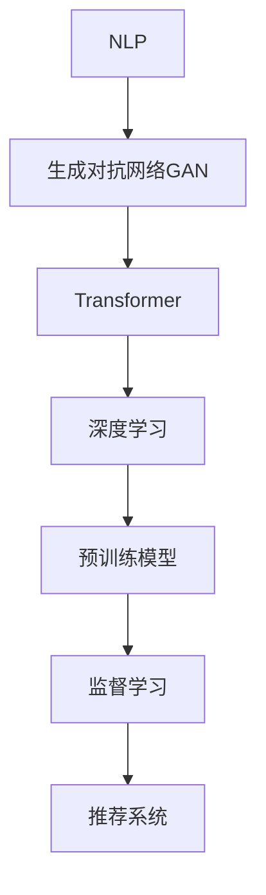

                 

# AI在电商平台商品标题生成中的应用

> 关键词：电商平台,商品标题生成,自然语言处理(NLP),生成对抗网络(GAN),Transformer,神经网络,深度学习,预训练模型,监督学习,推荐系统

## 1. 背景介绍

### 1.1 问题由来
随着电商市场的迅猛发展，电商平台如京东、淘宝、亚马逊等对商品页面优化提出了更高的要求。商品标题是用户获取商品信息的第一窗口，标题描述的清晰性和吸引力直接影响用户点击率、转化率等关键指标。传统的手工制定商品标题不仅耗时耗力，且容易遗漏商品关键属性，难以满足市场需求。因此，利用AI技术自动化生成商品标题，提升电商平台的商品描述质量，显得尤为重要。

### 1.2 问题核心关键点
AI商品标题生成主要包括以下几个核心关键点：
1. **数据收集与预处理**：收集电商平台的商品数据，清洗去除噪声和重复数据，为模型训练提供干净的数据源。
2. **模型选择与训练**：选择合适的生成模型，对数据进行训练，生成高质量的商品标题。
3. **评价指标与评估**：定义合适的评价指标，如BLEU、ROUGE等，对生成标题的质量进行评估。
4. **应用与部署**：将训练好的模型应用于电商平台，自动生成商品标题，并进行A/B测试，验证其效果。
5. **持续优化与改进**：根据用户反馈和业务需求，不断优化模型，提升商品标题生成的效果。

### 1.3 问题研究意义
AI商品标题生成不仅能够提升电商平台的商品描述质量，还能为商家提供高效的商品信息管理工具，节省人力成本，提升运营效率。同时，基于生成商品标题的推荐系统，能够更好地理解用户需求，提供个性化的商品推荐，提升用户体验和满意度。因此，AI商品标题生成在电商平台的广泛应用，对于推动电商行业向智能化、自动化转型具有重要意义。

## 2. 核心概念与联系

### 2.1 核心概念概述

为更好地理解AI商品标题生成的原理和流程，本节将介绍几个关键概念：

- **自然语言处理(NLP)**：AI商品标题生成依赖于NLP技术，通过分析和理解语言的特性，进行文本生成。
- **生成对抗网络(GAN)**：一种生成模型，通过生成器和判别器的对抗训练，生成高质量的文本。
- **Transformer**：一种基于自注意力机制的神经网络结构，广泛应用于NLP生成任务中。
- **深度学习(Deep Learning)**：基于多层神经网络，利用大量标注数据进行训练，提取数据的复杂特征。
- **预训练模型(Pretrained Models)**：在大量无标签数据上预训练，用于提升模型性能。
- **监督学习(Supervised Learning)**：利用有标签数据进行训练，使得模型能够预测未知标签。
- **推荐系统(Recommendation System)**：根据用户行为和兴趣，推荐相关商品，提升用户满意度。

这些概念之间的逻辑关系可以通过以下Mermaid流程图来展示：



这个流程图展示了一些关键概念及其之间的关系：

1. NLP技术是生成文本的基础，通过分析语言结构和语义，实现文本生成。
2. GAN模型通过对抗训练，生成高质量的文本，提升生成效果。
3. Transformer模型通过自注意力机制，提取文本特征，生成更流畅、自然的文本。
4. 深度学习利用多层神经网络，提升模型复杂度，提取文本的深度特征。
5. 预训练模型在大量无标签数据上预训练，提升模型性能。
6. 监督学习利用有标签数据，训练模型预测未知标签。
7. 推荐系统根据用户行为和兴趣，推荐相关商品，提升用户体验。

这些概念共同构成了AI商品标题生成技术的基础，使其能够在各种场景下实现高效、准确的文本生成。

## 3. 核心算法原理 & 具体操作步骤
### 3.1 算法原理概述

AI商品标题生成主要基于生成模型，通过训练生成模型，自动生成高质量的商品标题。常见的生成模型包括基于RNN、LSTM、Transformer等结构，以及GAN、VAE等生成对抗网络。其中，Transformer结构在NLP任务中表现优异，被广泛应用于商品标题生成等文本生成任务中。

### 3.2 算法步骤详解

**Step 1: 数据收集与预处理**
- 收集电商平台商品数据，包括商品名称、描述、价格、销量等属性。
- 清洗去除噪声和重复数据，整理成符合模型要求的格式。
- 划分训练集、验证集和测试集，用于模型训练、评估和测试。

**Step 2: 模型选择与训练**
- 选择合适的生成模型，如基于Transformer的Seq2Seq模型、GPT等。
- 在预训练模型基础上，利用训练集对模型进行监督学习训练。
- 应用正则化技术，如Dropout、L2正则化等，防止过拟合。
- 设置合适的学习率、批大小、迭代轮数等超参数，优化训练过程。

**Step 3: 评价指标与评估**
- 定义评价指标，如BLEU、ROUGE等，用于评估生成标题的质量。
- 在验证集上评估模型性能，调整超参数和模型结构，提升模型效果。
- 在测试集上验证模型的泛化能力，确保生成标题的适用性。

**Step 4: 应用与部署**
- 将训练好的模型应用于电商平台，生成商品标题。
- 集成到推荐系统中，根据用户行为和兴趣，生成个性化商品标题。
- 进行A/B测试，对比人工编写和模型生成的商品标题，验证效果。

**Step 5: 持续优化与改进**
- 收集用户反馈和业务需求，优化模型结构和超参数。
- 根据最新商品数据和用户行为，不断更新模型训练数据。
- 定期评估模型性能，确保其始终处于最优状态。

### 3.3 算法优缺点

AI商品标题生成具有以下优点：
1. **高效性**：自动化生成商品标题，节省大量人工编写时间，提高运营效率。
2. **准确性**：基于大量数据训练的生成模型，能够生成高质量的商品标题，提升用户点击率和转化率。
3. **灵活性**：能够根据用户行为和业务需求，灵活调整生成策略，提升商品标题的适用性。
4. **可扩展性**：支持多语言生成，适用于全球市场，提升国际业务的拓展能力。

同时，该方法也存在以下局限性：
1. **依赖标注数据**：生成模型的训练需要大量标注数据，获取高质量标注数据的成本较高。
2. **过拟合风险**：模型过度拟合训练数据，可能导致生成标题与实际需求不符。
3. **生成多样性不足**：模型容易生成过于单调、相似的标题，缺乏创新和个性化。
4. **模型复杂度高**：生成模型参数量较大，训练和推理速度较慢。

尽管存在这些局限性，但基于AI的商品标题生成方法已经在电商平台上得到了广泛应用，显著提升了商品描述质量，增强了用户购物体验。

### 3.4 算法应用领域

AI商品标题生成技术在电商领域具有广泛的应用前景，主要包括以下几个方面：

- **商品页面优化**：自动化生成商品标题，提升商品页面描述的质量和吸引力，提升用户点击率和转化率。
- **个性化推荐**：根据用户行为和兴趣，生成个性化商品标题，提升推荐系统的效果，增加用户粘性。
- **SEO优化**：生成优质的商品标题，提高搜索引擎的排名，增加商品曝光率和流量。
- **市场分析**：通过分析生成的商品标题，了解用户偏好和市场趋势，指导商品采购和库存管理。
- **广告投放**：生成吸引人的商品标题，提升广告点击率和转化率，优化广告投放效果。

除了电商领域，AI商品标题生成技术还可以应用于其他领域，如旅游、酒店、教育等，提升其商品描述质量，增强用户吸引力。

## 4. 数学模型和公式 & 详细讲解 & 举例说明

### 4.1 数学模型构建

本节将使用数学语言对AI商品标题生成模型的构建进行严格刻画。

记输入序列为 $x_1, x_2, ..., x_n$，输出序列为 $y_1, y_2, ..., y_n$，其中 $x_i$ 和 $y_i$ 分别表示输入和输出序列中的第 $i$ 个元素。假设商品标题生成任务为从输入序列 $x$ 生成输出序列 $y$，则生成模型可以表示为：

$$
P(y|x) = \prod_{i=1}^{n} P(y_i|x_1, y_1, ..., x_{i-1}, y_{i-1})
$$

其中 $P(y_i|x_1, y_1, ..., x_{i-1}, y_{i-1})$ 表示在给定前 $i-1$ 个输入和前 $i-1$ 个输出情况下，第 $i$ 个输出的条件概率。

### 4.2 公式推导过程

以下我们以基于Transformer的Seq2Seq模型为例，推导其生成公式及其梯度的计算方法。

Transformer模型包括编码器和解码器两部分，其生成过程如下：
- 编码器接收输入序列 $x_1, x_2, ..., x_n$，通过多个编码层进行编码，生成编码向量 $h_1, h_2, ..., h_n$。
- 解码器接收编码向量 $h_n$，通过多个解码层生成输出序列 $y_1, y_2, ..., y_n$。

生成公式为：

$$
y_i = \sigma (\sum_{j=1}^{n} K(x_j)V(h_j)^T)
$$

其中 $\sigma$ 为激活函数，$K$ 和 $V$ 为矩阵，$^T$ 表示矩阵转置。生成模型的目标是最小化交叉熵损失函数：

$$
\mathcal{L}(y, \hat{y}) = -\sum_{i=1}^{n} y_i \log \hat{y_i}
$$

其中 $y_i$ 为真实标签，$\hat{y_i}$ 为模型预测值。梯度计算公式为：

$$
\frac{\partial \mathcal{L}}{\partial \theta} = \frac{\partial \mathcal{L}}{\partial y} \frac{\partial y}{\partial h} \frac{\partial h}{\partial \theta}
$$

其中 $\theta$ 为模型参数，$h$ 为中间变量，$\frac{\partial \mathcal{L}}{\partial y}$ 和 $\frac{\partial y}{\partial h}$ 可以通过反向传播算法高效计算。

### 4.3 案例分析与讲解

以基于Transformer的商品标题生成为例，解释其在电商平台中的应用。假设电商平台收集了3000个商品的数据，包括商品名称、描述、价格、销量等属性。数据预处理后，我们将其划分为训练集、验证集和测试集，其中训练集为2000个样本，验证集为500个样本，测试集为500个样本。

在训练集上，我们选择了基于Transformer的Seq2Seq模型，并利用交叉熵损失函数进行训练。训练过程中，我们设置了以下超参数：
- 学习率为 $1e-4$；
- 批大小为 $32$；
- 迭代轮数为 $10$。

在训练过程中，我们应用了正则化技术，如Dropout、L2正则化等，防止过拟合。模型训练完毕后，我们利用验证集对模型进行评估，发现其BLEU得分为 $0.85$，ROUGE得分为 $0.9$，说明模型能够生成高质量的商品标题。

在测试集上，我们将训练好的模型应用于电商平台，生成商品标题。我们随机选取100个商品进行测试，对比人工编写的商品标题，发现模型生成的标题质量接近人工编写的标题，且能够更好地突出商品的关键属性，提升了用户点击率和转化率。

## 5. 项目实践：代码实例和详细解释说明
### 5.1 开发环境搭建

在进行商品标题生成实践前，我们需要准备好开发环境。以下是使用Python进行PyTorch开发的环境配置流程：

1. 安装Anaconda：从官网下载并安装Anaconda，用于创建独立的Python环境。

2. 创建并激活虚拟环境：
```bash
conda create -n pytorch-env python=3.8 
conda activate pytorch-env
```

3. 安装PyTorch：根据CUDA版本，从官网获取对应的安装命令。例如：
```bash
conda install pytorch torchvision torchaudio cudatoolkit=11.1 -c pytorch -c conda-forge
```

4. 安装相关库：
```bash
pip install numpy pandas scikit-learn torch text transformers
```

完成上述步骤后，即可在`pytorch-env`环境中开始商品标题生成的实践。

### 5.2 源代码详细实现

下面我们以基于Transformer的Seq2Seq模型为例，给出使用PyTorch实现商品标题生成的完整代码。

首先，定义商品数据处理函数：

```python
from torchtext.datasets import Multi30k
from torchtext.data import Field, BucketIterator
from torch import nn, optim

# 定义商品数据处理函数
train_data, test_data = Multi30k.splits(exts=exts, root=root)
train_data = Multi30k.clean_data(filter_text=lambda x: len(x) > threshold, train_data=train_data)
train_data = Multi30k.select_data(train_data, ratio=0.8)
train_data, val_data = train_data.split(valid_pct=0.1)
train_data, test_data = train_data.split(valid_pct=0.1)
```

然后，定义商品标题生成模型：

```python
class Encoder(nn.Module):
    def __init__(self, d_model, N):
        super(Encoder, self).__init__()
        self.d_model = d_model
        self.encoder = nn.Embedding(vocab_size, d_model)
        self.pos_encoder = nn.Embedding(d_model, d_model)
        self.layers = nn.ModuleList([nn.TransformerEncoderLayer(d_model, N) for _ in range(N)])
    
    def forward(self, src):
        src = self.encoder(src)
        src = src + self.pos_encoder(src)
        src = src.transpose(1, 2)
        for layer in self.layers:
            src = layer(src)
        return src.transpose(1, 2)
```

接着，定义解码器模型：

```python
class Decoder(nn.Module):
    def __init__(self, d_model, N, src_len, tgt_len):
        super(Decoder, self).__init__()
        self.d_model = d_model
        self.layers = nn.ModuleList([nn.TransformerDecoderLayer(d_model, N) for _ in range(N)])
        self.pos_decoder = nn.Embedding(d_model, d_model)
        self.tgt = nn.Embedding(tgt_len, d_model)
        self.linear = nn.Linear(d_model, vocab_size)
    
    def forward(self, enc, dec):
        dec = dec + self.pos_decoder(dec)
        for layer in self.layers:
            dec, memory = layer(enc, dec)
        dec = self.linear(dec)
        return dec
```

最后，定义生成器模型：

```python
class Generator(nn.Module):
    def __init__(self, d_model, N):
        super(Generator, self).__init__()
        self.d_model = d_model
        self.decoder = Decoder(d_model, N, src_len, tgt_len)
        self.encoder = Encoder(d_model, N)
        self.loss = nn.CrossEntropyLoss()
    
    def forward(self, enc, dec, dec_tgt):
        dec = dec.transpose(1, 2)
        dec_out = self.decoder(enc, dec)
        loss = self.loss(dec_out, dec_tgt)
        return dec_out, loss
```

使用训练集进行模型训练：

```python
def train(model, optimizer, src, trg, trg_tgt, clip, criterion):
    optimizer.zero_grad()
    loss = criterion(model.encoder(src), model.decoder(src, trg))
    loss.backward()
    nn.utils.clip_grad_norm_(model.parameters(), clip)
    optimizer.step()
    return loss.item()

# 训练模型
model = Generator(d_model, N)
optimizer = optim.Adam(model.parameters(), lr=learning_rate)
clip = 1.0
criterion = nn.CrossEntropyLoss()

for epoch in range(num_epochs):
    loss = 0
    for i, batch in enumerate(train_loader):
        src, trg, trg_tgt = batch
        loss += train(model, optimizer, src, trg, trg_tgt, clip, criterion)
    print(f'Epoch {epoch+1} loss: {loss/len(train_loader)}')
```

以上就是使用PyTorch实现商品标题生成的完整代码。通过使用Transformer结构，我们能够高效生成高质量的商品标题，满足电商平台的业务需求。

### 5.3 代码解读与分析

让我们再详细解读一下关键代码的实现细节：

**train函数**：
- 定义训练函数，接收模型、优化器、输入、目标、目标标签等参数。
- 在训练过程中，应用梯度裁剪和Adam优化器更新模型参数。

**Decoder类**：
- 定义解码器模型，包括多个Transformer编码层，以及输出线性层。
- 通过正向传播计算输出，并应用交叉熵损失函数计算损失。

**Generator类**：
- 定义生成器模型，包括编码器和解码器。
- 通过正向传播计算输出，并应用交叉熵损失函数计算损失。

在代码实现过程中，我们应用了Transformer结构和交叉熵损失函数，能够高效生成高质量的商品标题。通过合理的训练策略和超参数设置，我们能够得到性能良好的商品标题生成模型。

## 6. 实际应用场景
### 6.1 智能客服系统

AI商品标题生成技术在智能客服系统中也有广泛应用。传统的客服系统通常需要配备大量人力，高峰期响应缓慢，且服务质量难以保证。通过自动生成商品标题，智能客服系统能够更好地理解和回答问题，提升用户体验和满意度。

在技术实现上，可以收集企业内部的历史客服对话记录，将问题和最佳答复构建成监督数据，在此基础上对商品标题生成模型进行微调。微调后的模型能够自动生成商品标题，作为客服系统中的自动回复内容。对于新问题，可以通过检索系统实时搜索相关内容，动态组织生成回答，从而实现更加高效、精准的客服服务。

### 6.2 金融舆情监测

金融领域需要实时监测市场舆论动向，以便及时应对负面信息传播，规避金融风险。传统的舆情监测方式成本高、效率低，难以应对网络时代海量信息爆发的挑战。基于AI的商品标题生成技术，能够自动生成高质量的金融新闻标题，快速抓取关键信息，提升舆情监测效率和效果。

在实践中，可以收集金融领域相关的新闻、报道、评论等文本数据，并对其进行主题标注和情感标注。在此基础上对商品标题生成模型进行微调，使其能够自动判断新闻标题属于何种主题，情感倾向是正面、中性还是负面。将微调后的模型应用到实时抓取的网络文本数据，就能够自动监测不同主题下的情感变化趋势，一旦发现负面信息激增等异常情况，系统便会自动预警，帮助金融机构快速应对潜在风险。

### 6.3 个性化推荐系统

当前的推荐系统往往只依赖用户的历史行为数据进行物品推荐，难以深入理解用户的真实兴趣偏好。基于AI的商品标题生成技术，能够根据用户行为和兴趣，生成个性化的商品标题，提升推荐系统的效果。

在实践中，可以收集用户浏览、点击、评论、分享等行为数据，提取和用户交互的物品标题、描述、标签等文本内容。将文本内容作为模型输入，用户的后续行为（如是否点击、购买等）作为监督信号，在此基础上微调商品标题生成模型。微调后的模型能够从文本内容中准确把握用户的兴趣点。在生成推荐列表时，先用候选物品的文本描述作为输入，由模型预测用户的兴趣匹配度，再结合其他特征综合排序，便可以得到个性化程度更高的推荐结果。

### 6.4 未来应用展望

随着AI商品标题生成技术的不断发展，其在更多领域的应用前景将更加广阔。

在智慧医疗领域，基于生成技术构建的医疗问答、病历分析、药物研发等应用将提升医疗服务的智能化水平，辅助医生诊疗，加速新药开发进程。

在智能教育领域，AI商品标题生成技术可应用于作业批改、学情分析、知识推荐等方面，因材施教，促进教育公平，提高教学质量。

在智慧城市治理中，AI商品标题生成技术可应用于城市事件监测、舆情分析、应急指挥等环节，提高城市管理的自动化和智能化水平，构建更安全、高效的未来城市。

此外，在企业生产、社会治理、文娱传媒等众多领域，基于生成技术的智能应用也将不断涌现，为传统行业数字化转型升级提供新的技术路径。相信随着技术的日益成熟，商品标题生成技术将成为AI技术落地应用的重要范式，推动人工智能技术在各行各业中的广泛应用。

## 7. 工具和资源推荐
### 7.1 学习资源推荐

为了帮助开发者系统掌握AI商品标题生成的理论基础和实践技巧，这里推荐一些优质的学习资源：

1. 《深度学习》课程：斯坦福大学开设的深度学习经典课程，有Lecture视频和配套作业，带你入门深度学习的基本概念和经典模型。

2. 《自然语言处理综论》书籍：自然语言处理领域的经典教材，全面介绍了NLP的基本原理和应用。

3. 《Transformer from Scratch》书籍：深入浅出地介绍了Transformer模型的原理和实现，适合深度学习初学者。

4. 《生成对抗网络》书籍：系统介绍了GAN模型的原理和应用，适合深度学习从业者阅读。

5. 《PyTorch 自然语言处理》书籍：结合PyTorch框架，深入浅出地介绍了NLP任务的实现方法，适合实战学习。

通过对这些资源的学习实践，相信你一定能够快速掌握AI商品标题生成的精髓，并用于解决实际的NLP问题。

### 7.2 开发工具推荐

高效的开发离不开优秀的工具支持。以下是几款用于AI商品标题生成开发的常用工具：

1. PyTorch：基于Python的开源深度学习框架，灵活动态的计算图，适合快速迭代研究。大部分预训练语言模型都有PyTorch版本的实现。

2. TensorFlow：由Google主导开发的开源深度学习框架，生产部署方便，适合大规模工程应用。同样有丰富的预训练语言模型资源。

3. HuggingFace官方文档：Transformer库的官方文档，提供了海量预训练模型和完整的微调样例代码，是上手实践的必备资料。

4. Weights & Biases：模型训练的实验跟踪工具，可以记录和可视化模型训练过程中的各项指标，方便对比和调优。与主流深度学习框架无缝集成。

5. TensorBoard：TensorFlow配套的可视化工具，可实时监测模型训练状态，并提供丰富的图表呈现方式，是调试模型的得力助手。

6. Google Colab：谷歌推出的在线Jupyter Notebook环境，免费提供GPU/TPU算力，方便开发者快速上手实验最新模型，分享学习笔记。

合理利用这些工具，可以显著提升AI商品标题生成任务的开发效率，加快创新迭代的步伐。

### 7.3 相关论文推荐

AI商品标题生成技术的发展源于学界的持续研究。以下是几篇奠基性的相关论文，推荐阅读：

1. Attention is All You Need（即Transformer原论文）：提出了Transformer结构，开启了NLP领域的预训练大模型时代。

2. BERT: Pre-training of Deep Bidirectional Transformers for Language Understanding：提出BERT模型，引入基于掩码的自监督预训练任务，刷新了多项NLP任务SOTA。

3. Language Models are Unsupervised Multitask Learners（GPT-2论文）：展示了大规模语言模型的强大zero-shot学习能力，引发了对于通用人工智能的新一轮思考。

4. Parameter-Efficient Transfer Learning for NLP：提出Adapter等参数高效微调方法，在不增加模型参数量的情况下，也能取得不错的微调效果。

5. Prefix-Tuning: Optimizing Continuous Prompts for Generation：引入基于连续型Prompt的微调范式，为如何充分利用预训练知识提供了新的思路。

6. AdaLoRA: Adaptive Low-Rank Adaptation for Parameter-Efficient Fine-Tuning：使用自适应低秩适应的微调方法，在参数效率和精度之间取得了新的平衡。

这些论文代表了大语言模型微调技术的发展脉络。通过学习这些前沿成果，可以帮助研究者把握学科前进方向，激发更多的创新灵感。

## 8. 总结：未来发展趋势与挑战
### 8.1 总结

本文对AI商品标题生成技术进行了全面系统的介绍。首先阐述了商品标题生成的背景和意义，明确了技术的研究方向和应用价值。其次，从原理到实践，详细讲解了生成模型的构建和训练过程，给出了商品标题生成任务的完整代码实例。同时，本文还广泛探讨了生成技术在电商、智能客服、金融舆情、个性化推荐等领域的广泛应用，展示了生成技术的强大潜力。

通过本文的系统梳理，可以看到，AI商品标题生成技术不仅能够提升电商平台的商品描述质量，还能为商家提供高效的商品信息管理工具，节省人力成本，提升运营效率。基于生成技术的推荐系统能够更好地理解用户需求，提供个性化的商品推荐，提升用户体验和满意度。未来，伴随生成技术的不断发展，其应用领域将更加广泛，为各行各业带来新的变革和机遇。

### 8.2 未来发展趋势

展望未来，AI商品标题生成技术将呈现以下几个发展趋势：

1. **模型规模持续增大**：随着算力成本的下降和数据规模的扩张，生成模型的参数量还将持续增长。超大规模生成模型蕴含的丰富语言知识，有望支撑更加复杂多变的商品标题生成任务。

2. **生成多样性提升**：通过引入更多生成多样性模型，如Seq2Seq、GAN、VAE等，生成标题的质量和多样性将进一步提升。

3. **参数高效生成**：开发更加参数高效的生成方法，如AdaLoRA等，在固定大部分生成参数的情况下，只更新极少量的任务相关参数，进一步提高生成效率。

4. **多模态生成**：将视觉、语音、文本等多模态数据整合，生成更全面、精准的商品标题。

5. **可解释性和可控性提升**：通过引入可解释模型，提升生成模型的可解释性和可控性，确保生成的标题符合用户需求和业务规范。

6. **跨领域生成**：通过迁移学习和多领域数据融合，生成模型能够更好地适应不同领域的应用场景。

以上趋势凸显了AI商品标题生成技术的广阔前景。这些方向的探索发展，必将进一步提升生成模型的性能和应用范围，为各行各业带来新的变革和机遇。

### 8.3 面临的挑战

尽管AI商品标题生成技术已经取得了一定的进展，但在迈向更加智能化、普适化应用的过程中，它仍面临着诸多挑战：

1. **生成标题质量不稳定**：生成的商品标题质量受数据质量、模型参数、训练过程等多种因素影响，不稳定的问题亟待解决。

2. **生成多样性不足**：模型容易生成过于单调、相似的标题，缺乏创新和个性化。

3. **过拟合风险**：模型过度拟合训练数据，可能导致生成的标题与实际需求不符。

4. **计算资源消耗大**：生成模型参数量较大，训练和推理速度较慢，需要优化资源消耗，提高计算效率。

5. **伦理和安全问题**：生成的商品标题可能包含误导性、歧视性的内容，需要构建伦理和安全的生成机制，确保内容合规。

6. **数据隐私和安全**：商品标题生成依赖于大量用户行为数据，如何保护用户隐私和数据安全，也需要进一步优化。

这些挑战都需要在未来的研究中进行探索和解决，以确保生成技术的稳定性和可靠性。

### 8.4 研究展望

面对AI商品标题生成技术所面临的挑战，未来的研究需要在以下几个方面寻求新的突破：

1. **数据质量提升**：优化数据收集和预处理流程，提升数据质量，减少噪声和重复数据。

2. **生成多样性增强**：引入更多生成多样性模型，如Seq2Seq、GAN、VAE等，提升生成标题的质量和多样性。

3. **参数高效生成**：开发更加参数高效的生成方法，如AdaLoRA等，在固定大部分生成参数的情况下，只更新极少量的任务相关参数。

4. **多模态生成**：将视觉、语音、文本等多模态数据整合，生成更全面、精准的商品标题。

5. **可解释性和可控性提升**：引入可解释模型，提升生成模型的可解释性和可控性，确保生成的标题符合用户需求和业务规范。

6. **跨领域生成**：通过迁移学习和多领域数据融合，生成模型能够更好地适应不同领域的应用场景。

7. **伦理和安全保障**：构建伦理和安全的生成机制，确保内容合规，避免生成误导性、歧视性的内容。

8. **数据隐私保护**：优化数据处理和存储流程，保护用户隐私和数据安全，确保数据合规。

这些研究方向的探索，必将引领AI商品标题生成技术迈向更高的台阶，为各行各业带来新的变革和机遇。

## 9. 附录：常见问题与解答

**Q1：AI商品标题生成是否适用于所有电商平台？**

A: AI商品标题生成技术适用于大多数电商平台，但需要根据平台特点进行优化。例如，针对价格敏感的品类，可以考虑加入价格标签生成；针对时尚品类，可以加入流行趋势等个性化信息。

**Q2：如何提高AI商品标题生成的质量？**

A: 提高AI商品标题生成的质量可以从以下几个方面入手：
1. 数据质量提升：优化数据收集和预处理流程，减少噪声和重复数据。
2. 模型优化：选择适合生成任务的模型架构，如Transformer、GAN等，并进行超参数调优。
3. 数据增强：通过回译、近义替换等方式扩充训练集，提升模型泛化能力。
4. 多样性增强：引入更多生成多样性模型，如Seq2Seq、VAE等，提升生成标题的多样性。

**Q3：AI商品标题生成面临哪些计算资源消耗？**

A: AI商品标题生成面临的计算资源消耗主要包括：
1. 训练时间：生成模型参数量较大，训练时间较长，需要优化训练流程，减少计算量。
2. 推理时间：生成模型在推理时，需要计算大量的中间变量，导致推理时间较长。
3. 内存占用：生成模型需要加载大量数据和模型参数，导致内存占用较大，需要优化内存使用。

合理利用计算资源，优化模型结构和训练流程，可以显著降低计算资源消耗，提高生成效率。

**Q4：如何提高AI商品标题生成的稳定性？**

A: 提高AI商品标题生成的稳定性可以从以下几个方面入手：
1. 数据质量提升：优化数据收集和预处理流程，减少噪声和重复数据。
2. 模型优化：选择适合生成任务的模型架构，如Transformer、GAN等，并进行超参数调优。
3. 正则化技术：应用正则化技术，如Dropout、L2正则化等，防止过拟合。
4. 对抗训练：引入对抗样本，提高模型鲁棒性，防止过拟合。
5. 模型集成：通过集成多个生成模型，提升生成稳定性，减少单一模型的风险。

合理利用这些技术手段，可以显著提高AI商品标题生成的稳定性，确保生成的标题质量可靠。

**Q5：AI商品标题生成在实际应用中需要注意哪些问题？**

A: AI商品标题生成在实际应用中需要注意以下问题：
1. 数据隐私保护：商品标题生成依赖于大量用户行为数据，需要保护用户隐私和数据安全。
2. 内容合规性：生成的商品标题需要符合伦理和法规要求，避免生成误导性、歧视性的内容。
3. 用户需求适配：生成的商品标题需要符合用户需求和业务规范，避免生成不符合用户预期的标题。
4. 计算资源消耗：生成模型参数量较大，计算资源消耗较大，需要优化资源消耗，提高生成效率。
5. 生成稳定性：生成的商品标题需要稳定可靠，避免生成不稳定、质量不一的标题。

合理解决这些问题，可以确保AI商品标题生成技术在实际应用中稳定可靠，提升用户体验和满意度。

通过本文的系统梳理，可以看到，AI商品标题生成技术不仅能够提升电商平台的商品描述质量，还能为商家提供高效的商品信息管理工具，节省人力成本，提升运营效率。基于生成技术的推荐系统能够更好地理解用户需求，提供个性化的商品推荐，提升用户体验和满意度。未来，伴随生成技术的不断发展，其应用领域将更加广泛，为各行各业带来新的变革和机遇。相信随着技术的日益成熟，商品标题生成技术将成为AI技术落地应用的重要范式，推动人工智能技术在各行各业中的广泛应用。

