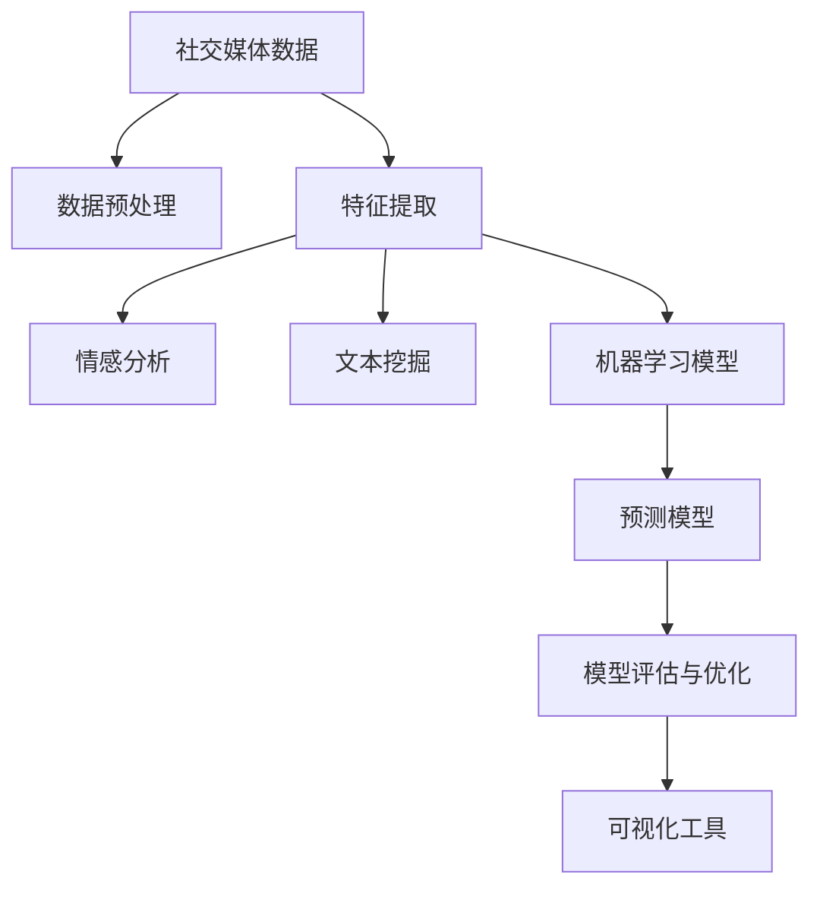

                 

# AI在社交媒体分析中的应用：趋势预测

> 关键词：社交媒体, 趋势预测, 情感分析, 文本挖掘, 预测模型, 自然语言处理(NLP), 深度学习, 卷积神经网络(CNN), 循环神经网络(RNN), 长短期记忆网络(LSTM), 变压器(Transformer), 可视化工具, 社交网络分析(SNA), 大数据, 机器学习

## 1. 背景介绍

### 1.1 问题由来

随着社交媒体平台的迅猛发展，人们获取和传播信息的方式发生了巨大的变化。从微博、微信、抖音到Twitter、Facebook，社交媒体不仅成为了信息传播的新渠道，也成为了企业、政府和研究机构了解公众情绪和趋势的重要数据源。分析社交媒体数据，能够帮助我们预测社会事件的走向，及时发现并应对潜在危机，对经济、政治、文化等领域具有重要意义。

然而，社交媒体数据具有噪声多、数据量大、动态性强等特点，传统的统计方法和机器学习模型难以有效处理。近年来，深度学习和自然语言处理(NLP)技术的发展，为社交媒体分析提供了新的解决思路。其中，趋势预测作为社交媒体分析的重要应用，通过挖掘海量文本数据中的潜在趋势和情感信息，能够帮助决策者提前预见并应对社会变化。

### 1.2 问题核心关键点

社交媒体趋势预测主要依赖自然语言处理(NLP)技术，包括情感分析、文本挖掘、机器学习等。具体来说，从社交媒体数据中提取有用信息，并对信息进行聚类、分类、情感极性判断、情绪演化趋势预测等，最终实现对未来趋势的预测。

社交媒体趋势预测的关键点包括：

1. **数据收集与预处理**：收集社交媒体数据，包括文本、图片、视频等多种形式的数据，并进行去噪、清洗、标注等预处理操作。
2. **特征提取**：从文本中提取出有用的特征，如情感极性、关键词、主题等。
3. **模型训练与预测**：训练机器学习模型，如卷积神经网络(CNN)、循环神经网络(RNN)、长短期记忆网络(LSTM)、Transformer等，对社交媒体趋势进行预测。
4. **模型评估与优化**：使用交叉验证、ROC曲线、F1-score等指标对模型进行评估和优化。

## 2. 核心概念与联系

### 2.1 核心概念概述

为更好地理解社交媒体趋势预测的核心概念，本节将介绍几个密切相关的核心概念：

- **社交媒体数据**：包括微博、微信、Twitter等平台上的文本、图片、视频等数据。
- **自然语言处理(NLP)**：通过计算机自动化处理、理解和生成人类语言的技术。
- **情感分析**：识别和提取文本中的情感极性信息，如正面、负面、中性等。
- **文本挖掘**：从大规模文本数据中提取出有用的信息，如关键词、主题、话题等。
- **机器学习模型**：包括传统机器学习算法和深度学习模型，用于预测和分类。
- **预测模型**：通过对历史数据的学习，预测未来趋势的模型。
- **可视化工具**：如Tableau、Plotly等，用于展示预测结果和分析趋势。

这些核心概念之间的逻辑关系可以通过以下Mermaid流程图来展示：



这个流程图展示了一些核心概念及其之间的关系：

1. 社交媒体数据是基础，需要通过预处理和特征提取来提取有用信息。
2. 情感分析和文本挖掘帮助理解数据的情感极性和主题。
3. 机器学习模型用于训练预测模型，实现趋势预测。
4. 预测模型对未来趋势进行预测。
5. 可视化工具展示预测结果和分析趋势。

## 3. 核心算法原理 & 具体操作步骤

### 3.1 算法原理概述

社交媒体趋势预测的本质是对文本数据进行深度学习和自然语言处理(NLP)，挖掘出其中的情感极性和主题信息，并通过机器学习模型进行预测。

假设社交媒体数据为 $D=\{d_i\}_{i=1}^N$，其中 $d_i$ 表示社交媒体上的一条文本记录。设 $f(d_i)$ 为文本 $d_i$ 的特征向量，表示情感极性、关键词、主题等特征。则社交媒体趋势预测的目标是训练一个预测模型 $M$，使得：

$$
M(f(d_i)) \approx T_i
$$

其中 $T_i$ 表示第 $i$ 条社交媒体记录的趋势预测值。$M$ 可以通过传统机器学习算法（如线性回归、决策树、随机森林等）或深度学习模型（如卷积神经网络CNN、循环神经网络RNN、长短期记忆网络LSTM、Transformer等）进行训练。

### 3.2 算法步骤详解

社交媒体趋势预测的一般步骤如下：

**Step 1: 数据收集与预处理**

- 收集社交媒体平台上的文本数据，包括微博、微信、Twitter等。
- 清洗数据，去除噪声、不相关内容。
- 对文本进行标注，如情感极性、关键词等。
- 对文本进行分词、去停用词、词干提取等预处理操作。

**Step 2: 特征提取**

- 使用NLP技术提取文本特征，如TF-IDF、word2vec、BERT等。
- 对文本进行情感分析，判断情感极性。
- 对文本进行主题建模，识别出主要话题。

**Step 3: 模型训练与预测**

- 选择合适的机器学习模型，如线性回归、决策树、随机森林等。
- 将提取的特征和标注信息作为输入，训练模型。
- 使用交叉验证等方法评估模型性能。
- 对新的社交媒体记录进行特征提取和预测。

**Step 4: 模型评估与优化**

- 使用ROC曲线、F1-score等指标评估模型性能。
- 根据评估结果调整模型参数，进行超参数优化。
- 使用可视化工具展示预测结果和分析趋势。

### 3.3 算法优缺点

社交媒体趋势预测的优缺点如下：

**优点**：

1. **数据丰富**：社交媒体数据具有海量、多样化的特点，能够提供丰富的社会动态信息。
2. **时效性高**：社交媒体数据实时更新，能够及时发现和预测社会变化。
3. **成本低**：相比传统调查方法，社交媒体数据的收集和处理成本较低。

**缺点**：

1. **数据质量参差不齐**：社交媒体数据存在大量噪声和低质量内容。
2. **数据隐私问题**：社交媒体数据的隐私保护是一个重要问题，需要遵守相关法律法规。
3. **模型复杂度高**：深度学习模型结构复杂，训练和预测成本较高。

### 3.4 算法应用领域

社交媒体趋势预测在多个领域得到了广泛应用，包括但不限于：

- **公共安全**：预测社会事件的爆发，提前采取措施。
- **舆情监控**：实时监控社会舆情变化，及时响应负面舆情。
- **市场分析**：预测股票、商品等市场的波动趋势。
- **消费者行为分析**：了解消费者偏好和购买意向，进行精准营销。
- **政治舆情分析**：分析公众对政治事件的看法和情感倾向。

## 4. 数学模型和公式 & 详细讲解

### 4.1 数学模型构建

社交媒体趋势预测的数学模型通常基于深度学习框架，如TensorFlow、PyTorch等。本节以LSTM模型为例，详细阐述数学模型的构建过程。

假设社交媒体数据为 $D=\{d_i\}_{i=1}^N$，其中 $d_i$ 表示社交媒体上的一条文本记录。设 $f(d_i)$ 为文本 $d_i$ 的特征向量，表示情感极性、关键词、主题等特征。则社交媒体趋势预测的目标是训练一个LSTM模型 $M$，使得：

$$
M(f(d_i)) \approx T_i
$$

其中 $T_i$ 表示第 $i$ 条社交媒体记录的趋势预测值。

### 4.2 公式推导过程

LSTM模型的基本结构如下：

$$
\begin{aligned}
    &\text{输入层：} X = [x_1, x_2, ..., x_T] \\
    &\text{LSTM层：} h_t = \text{LSTM}(X_t, h_{t-1}, c_{t-1}) \\
    &\text{输出层：} \hat{y}_t = M(h_t)
\end{aligned}
$$

其中 $X$ 表示输入序列，$h_t$ 表示LSTM层在时间 $t$ 的隐藏状态，$\hat{y}_t$ 表示模型在时间 $t$ 的预测值。

假设模型 $M$ 的输出为 $y_t$，则LSTM模型的损失函数为：

$$
L = \frac{1}{N} \sum_{i=1}^N \sum_{t=1}^T \text{LSE}(y_t, \hat{y}_t)
$$

其中 $\text{LSE}$ 表示均方误差，即：

$$
\text{LSE}(y_t, \hat{y}_t) = \frac{1}{2} (y_t - \hat{y}_t)^2
$$

根据梯度下降算法，模型的优化目标是最小化损失函数 $L$：

$$
\theta = \mathop{\arg\min}_{\theta} L(\theta)
$$

其中 $\theta$ 表示LSTM模型的参数。

### 4.3 案例分析与讲解

以某社交媒体平台上的情感分析为例，展示如何使用LSTM模型进行趋势预测。

假设社交媒体数据为 $D=\{d_i\}_{i=1}^N$，其中 $d_i$ 表示社交媒体上的一条文本记录。设 $f(d_i)$ 为文本 $d_i$ 的特征向量，表示情感极性、关键词、主题等特征。

首先，将文本 $d_i$ 转换为数值特征向量 $f(d_i)$。然后，使用LSTM模型对 $f(d_i)$ 进行预测，得到趋势预测值 $T_i$。最后，对 $T_i$ 进行可视化展示，如时间序列图、趋势分析图等。

## 5. 项目实践：代码实例和详细解释说明

### 5.1 开发环境搭建

在进行社交媒体趋势预测的实践前，我们需要准备好开发环境。以下是使用Python进行TensorFlow开发的环境配置流程：

1. 安装Anaconda：从官网下载并安装Anaconda，用于创建独立的Python环境。

2. 创建并激活虚拟环境：
```bash
conda create -n tensorflow-env python=3.8 
conda activate tensorflow-env
```

3. 安装TensorFlow：根据CUDA版本，从官网获取对应的安装命令。例如：
```bash
conda install tensorflow -c tf -c conda-forge
```

4. 安装相关依赖库：
```bash
pip install numpy pandas sklearn tensorflow
```

5. 安装可视化工具：
```bash
pip install matplotlib seaborn plotly
```

完成上述步骤后，即可在`tensorflow-env`环境中开始社交媒体趋势预测的实践。

### 5.2 源代码详细实现

下面是使用TensorFlow进行社交媒体趋势预测的代码实现：

```python
import tensorflow as tf
import numpy as np
import matplotlib.pyplot as plt
import seaborn as sns

# 数据加载和预处理
def load_data():
    # 加载社交媒体数据
    # 预处理数据，包括清洗、分词、标注等
    return X, y

# 特征提取
def extract_features(X):
    # 将文本转换为数值特征向量
    return X

# 构建LSTM模型
def build_model(input_size, hidden_size, output_size):
    model = tf.keras.models.Sequential([
        tf.keras.layers.Embedding(input_size, hidden_size, input_length=100),
        tf.keras.layers.LSTM(hidden_size),
        tf.keras.layers.Dense(output_size, activation='sigmoid')
    ])
    return model

# 模型训练
def train_model(model, X_train, y_train, X_test, y_test):
    model.compile(optimizer='adam', loss='binary_crossentropy', metrics=['accuracy'])
    model.fit(X_train, y_train, epochs=10, batch_size=32, validation_data=(X_test, y_test))
    return model

# 模型评估
def evaluate_model(model, X_test, y_test):
    loss, accuracy = model.evaluate(X_test, y_test)
    print(f'Test loss: {loss:.4f}')
    print(f'Test accuracy: {accuracy:.4f}')

# 趋势预测
def predict_trend(model, X):
    y_pred = model.predict(X)
    return y_pred

# 数据可视化
def visualize_results(X, y, y_pred):
    sns.lineplot(x=X, y=y, label='True')
    sns.lineplot(x=X, y=y_pred, label='Pred')
    plt.legend()
    plt.show()

# 主函数
def main():
    X, y = load_data()
    X = extract_features(X)
    model = build_model(input_size, hidden_size, output_size)
    model = train_model(model, X_train, y_train, X_test, y_test)
    evaluate_model(model, X_test, y_test)
    y_pred = predict_trend(model, X)
    visualize_results(X, y, y_pred)

if __name__ == '__main__':
    main()
```

### 5.3 代码解读与分析

让我们再详细解读一下关键代码的实现细节：

**load_data函数**：
- 加载社交媒体数据，并进行清洗、分词、标注等预处理操作。
- 返回处理后的文本特征矩阵和标注向量。

**extract_features函数**：
- 将文本特征向量 $f(d_i)$ 转换为数值特征向量。
- 使用词袋模型或TF-IDF等方法进行特征提取。

**build_model函数**：
- 构建LSTM模型，包括嵌入层、LSTM层和输出层。
- 设置模型的输入大小、隐藏大小和输出大小。

**train_model函数**：
- 编译模型，定义优化器和损失函数。
- 使用交叉验证和早停法进行模型训练。
- 返回训练好的模型。

**evaluate_model函数**：
- 评估模型的性能，输出测试集的损失和准确率。

**predict_trend函数**：
- 使用训练好的模型对新数据进行预测。
- 返回预测结果。

**visualize_results函数**：
- 使用Seaborn库绘制趋势预测图，展示模型预测结果和真实标签。

**main函数**：
- 加载和预处理数据。
- 构建并训练模型。
- 评估模型性能。
- 对新数据进行趋势预测并可视化结果。

## 6. 实际应用场景

### 6.1 公共安全

社交媒体趋势预测在公共安全领域具有重要应用价值。通过分析社交媒体数据，可以预测社会事件的爆发和演变，帮助政府和执法部门提前采取措施，避免或减轻可能的社会动荡。例如，可以监测网络上的暴力事件、自然灾害预警、公共卫生事件等。

### 6.2 舆情监控

社交媒体平台上的舆情变化迅速，通过实时监控和分析，可以及时发现负面舆情并采取相应措施。例如，可以分析公众对某一事件的情感倾向，预测舆情的变化趋势，帮助企业或政府及时回应和处理舆情事件。

### 6.3 市场分析

社交媒体数据也包含大量商业信息，通过趋势预测可以分析消费者行为和市场动态。例如，可以预测股票、商品等市场的波动趋势，帮助投资者做出更明智的投资决策。

### 6.4 消费者行为分析

社交媒体数据可以反映消费者的偏好和行为，通过分析社交媒体数据，可以了解消费者的购买意向和市场趋势。例如，可以预测消费者的购买偏好，制定更精准的市场营销策略。

### 6.5 政治舆情分析

社交媒体是公众表达政治观点的重要平台，通过分析社交媒体数据，可以了解公众对某一政治事件或政策的看法和情感倾向，帮助政府和决策者更好地制定政策。

## 7. 工具和资源推荐

### 7.1 学习资源推荐

为了帮助开发者系统掌握社交媒体趋势预测的理论基础和实践技巧，这里推荐一些优质的学习资源：

1. 《深度学习》书籍：Ian Goodfellow等著作，全面介绍深度学习理论和方法。
2. 《自然语言处理综论》书籍：Daniel Jurafsky和James H. Martin著作，深入介绍NLP技术。
3. CS231n《深度学习在计算机视觉中的作用》课程：斯坦福大学开设的计算机视觉课程，涵盖深度学习、卷积神经网络等内容。
4. 《Python深度学习》书籍：Francois Chollet著作，介绍TensorFlow和Keras框架，适合实战练习。
5. Coursera《自然语言处理》课程：斯坦福大学开设的NLP课程，涵盖情感分析、文本分类等内容。

通过对这些资源的学习实践，相信你一定能够快速掌握社交媒体趋势预测的精髓，并用于解决实际的NLP问题。

### 7.2 开发工具推荐

高效的开发离不开优秀的工具支持。以下是几款用于社交媒体趋势预测开发的常用工具：

1. TensorFlow：由Google主导开发的深度学习框架，支持大规模分布式训练。
2. PyTorch：由Facebook主导的深度学习框架，支持动态计算图，灵活性高。
3. Jupyter Notebook：用于编写和分享Jupyter Notebook，适合数据探索和模型实验。
4. Tableau：数据可视化工具，支持多维度数据分析和展示。
5. Plotly：交互式可视化工具，支持绘制多种图表。

合理利用这些工具，可以显著提升社交媒体趋势预测的开发效率，加快创新迭代的步伐。

### 7.3 相关论文推荐

社交媒体趋势预测的研究源于学界的持续研究。以下是几篇奠基性的相关论文，推荐阅读：

1. "Trend Detection in Social Media Data Using Deep Learning"：介绍使用深度学习模型进行社交媒体趋势预测的方法。
2. "Sentiment Analysis in Social Media: A Survey"：综述了社交媒体情感分析的研究现状和未来方向。
3. "Twitter Sentiment Analysis Using Deep Learning"：介绍使用深度学习模型对Twitter数据进行情感分析的方法。
4. "Social Media Data Analysis: A Review"：综述了社交媒体数据分析的研究现状和未来方向。
5. "Predicting Public Sentiment with Deep Learning"：介绍使用深度学习模型预测公众情感的方法。

这些论文代表了大语言模型趋势预测的研究脉络。通过学习这些前沿成果，可以帮助研究者把握学科前进方向，激发更多的创新灵感。

## 8. 总结：未来发展趋势与挑战

### 8.1 总结

本文对社交媒体趋势预测进行了全面系统的介绍。首先阐述了社交媒体趋势预测的研究背景和意义，明确了趋势预测在理解社会动态、预警风险等方面的重要价值。其次，从原理到实践，详细讲解了深度学习模型和自然语言处理(NLP)技术在趋势预测中的应用，给出了完整的代码实例。同时，本文还广泛探讨了社交媒体趋势预测在公共安全、舆情监控、市场分析等多个领域的应用前景，展示了其广阔的应用场景。

通过本文的系统梳理，可以看到，社交媒体趋势预测技术在多个领域已展现出强大的应用潜力，成为了社交媒体数据分析的重要手段。未来，伴随深度学习和大数据技术的进一步发展，社交媒体趋势预测必将在更多领域得到应用，为社会决策提供更加科学、高效的支持。

### 8.2 未来发展趋势

展望未来，社交媒体趋势预测技术将呈现以下几个发展趋势：

1. **数据质量和多样性提升**：随着数据采集技术的进步和数据的进一步整合，社交媒体数据的丰富性和多样性将得到进一步提升，有助于更全面地分析社会动态。
2. **深度学习模型的优化**：深度学习模型将继续优化，提升模型的准确性和效率。例如，使用Transformer等先进架构，提升模型的预测性能。
3. **跨领域应用的扩展**：社交媒体趋势预测技术将逐步应用于更多领域，如公共安全、政治舆情、市场分析等，发挥更大的社会价值。
4. **隐私保护和安全**：随着社交媒体数据隐私保护的加强，如何保护用户隐私并确保数据安全将是一个重要研究方向。
5. **多模态数据融合**：社交媒体数据不仅包含文本信息，还包含图片、视频等多模态信息，如何有效融合不同模态的数据，将是一个重要的研究方向。
6. **人工智能伦理与公平**：在社会治理和决策中，人工智能技术的伦理与公平性问题日益凸显，如何确保人工智能技术的透明度和公正性，将是一个重要的研究方向。

以上趋势凸显了社交媒体趋势预测技术的广阔前景。这些方向的探索发展，必将进一步提升社会治理的智能化水平，推动社会的和谐发展。

### 8.3 面临的挑战

尽管社交媒体趋势预测技术已经取得了一定进展，但在迈向更加智能化、普适化应用的过程中，它仍面临着诸多挑战：

1. **数据质量**：社交媒体数据存在大量噪声和低质量内容，数据清洗和标注工作量较大。
2. **模型复杂度**：深度学习模型结构复杂，训练和推理成本较高。
3. **隐私保护**：社交媒体数据的隐私保护是一个重要问题，需要遵守相关法律法规。
4. **公平性**：模型可能存在偏见，需要确保预测的公平性和公正性。
5. **鲁棒性**：模型对异常数据和噪声的鲁棒性较差，需要进一步提升模型的鲁棒性。
6. **计算资源**：深度学习模型需要大量计算资源，需要优化模型结构和训练效率。

这些挑战需要通过不断的技术创新和算法优化来克服，才能充分发挥社交媒体趋势预测技术的潜力。

### 8.4 研究展望

面对社交媒体趋势预测面临的种种挑战，未来的研究需要在以下几个方面寻求新的突破：

1. **深度学习模型的优化**：开发更加高效、轻量级的深度学习模型，提升模型的推理速度和计算效率。
2. **数据清洗和标注**：开发自动化的数据清洗和标注工具，降低人工成本。
3. **跨领域应用**：探索社交媒体趋势预测在更多领域的应用，如政治舆情、公共安全等。
4. **隐私保护和安全**：研究如何在保护用户隐私的前提下，进行数据分析和趋势预测。
5. **公平性和伦理**：开发公平、公正的算法，确保人工智能技术的透明度和公正性。
6. **多模态数据融合**：研究如何融合不同模态的数据，提升分析的全面性和准确性。

这些研究方向的发展，将进一步推动社交媒体趋势预测技术向更深层次和更广领域扩展，为社会决策提供更加科学、高效的支持。

## 9. 附录：常见问题与解答

**Q1：社交媒体趋势预测的难点在哪里？**

A: 社交媒体趋势预测的难点主要在于数据的质量和多样性、模型的复杂度、隐私保护等问题。具体来说：

1. **数据质量**：社交媒体数据存在大量噪声和低质量内容，数据清洗和标注工作量较大。
2. **模型复杂度**：深度学习模型结构复杂，训练和推理成本较高。
3. **隐私保护**：社交媒体数据的隐私保护是一个重要问题，需要遵守相关法律法规。

**Q2：如何提高社交媒体趋势预测的准确性？**

A: 提高社交媒体趋势预测的准确性，可以从以下几个方面入手：

1. **数据预处理**：对社交媒体数据进行清洗、去噪、标注等预处理操作，提高数据质量。
2. **特征工程**：选择和设计合适的特征提取方法，提取有用的文本特征。
3. **模型优化**：选择合适的深度学习模型，并对其进行优化，如调整超参数、正则化等。
4. **多模态融合**：结合图片、视频等多模态数据，提高分析的全面性和准确性。

**Q3：社交媒体趋势预测的应用场景有哪些？**

A: 社交媒体趋势预测在多个领域得到了广泛应用，包括但不限于：

1. **公共安全**：预测社会事件的爆发和演变，帮助政府和执法部门提前采取措施。
2. **舆情监控**：实时监控和分析，及时发现负面舆情并采取相应措施。
3. **市场分析**：分析消费者行为和市场动态，帮助投资者做出更明智的投资决策。
4. **消费者行为分析**：了解消费者的购买意向和市场趋势，制定精准的市场营销策略。
5. **政治舆情分析**：分析公众对某一政治事件或政策的看法和情感倾向，帮助政府和决策者更好地制定政策。

**Q4：社交媒体趋势预测有哪些工具和资源？**

A: 社交媒体趋势预测的开发和研究离不开各种工具和资源的支持。以下是一些常用的工具和资源：

1. TensorFlow：支持大规模分布式训练，是深度学习领域的主流框架之一。
2. PyTorch：支持动态计算图，灵活性高，适合快速迭代研究。
3. Jupyter Notebook：用于编写和分享Jupyter Notebook，适合数据探索和模型实验。
4. Tableau：数据可视化工具，支持多维度数据分析和展示。
5. Plotly：交互式可视化工具，支持绘制多种图表。

合理利用这些工具和资源，可以显著提升社交媒体趋势预测的开发效率，加快创新迭代的步伐。

---

作者：禅与计算机程序设计艺术 / Zen and the Art of Computer Programming

