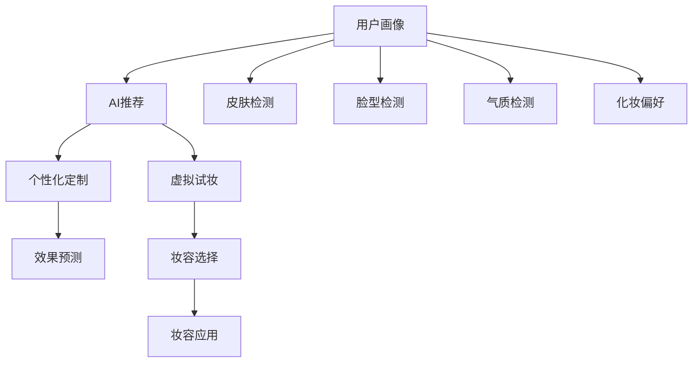

                 

# AI在虚拟化妆中的应用：尝试不同妆容

## 1. 背景介绍

随着人工智能技术的迅猛发展，虚拟化妆已经成为了时尚和科技领域的热门话题。虚拟化妆不仅能够满足人们对于美的追求，还通过技术手段极大地丰富了化妆的方式和可能性。在虚拟化妆中，AI扮演了至关重要的角色，不仅能够提供个性化的化妆建议，还能创造出前所未有的妆容效果。

### 1.1 虚拟化妆的背景

虚拟化妆的起源可以追溯到2005年，当时名为ZBrush的应用程序开始被用于动画制作的皮肤纹理和细节处理。2007年，ZBrush的开发者Miquel Angel Sapora推出了一个名为“ZMakeUp”的插件，它可以为角色生成逼真的化妆品效果。自此，AI在虚拟化妆中的应用逐渐兴起。

### 1.2 虚拟化妆的现状

当前，虚拟化妆已经在美妆行业和科技公司之间引起广泛关注。业界巨头如Adobe、微软和Google都在积极探索和应用AI技术来提升虚拟化妆的体验和效果。例如，Adobe的Sensei平台就提供了强大的图像处理和编辑工具，帮助用户实现更加逼真和个性化的虚拟化妆效果。此外，AI技术在虚拟化妆中的应用还推动了AR（增强现实）和MR（混合现实）技术的发展，使得虚拟化妆与现实世界更加紧密结合。

## 2. 核心概念与联系

### 2.1 核心概念概述

在虚拟化妆应用中，AI发挥了至关重要的作用。以下是几个核心概念及其相互关系：

1. **AI与虚拟化妆**：AI技术通过图像处理、自然语言处理、机器学习等手段，帮助用户实现个性化的虚拟化妆效果。
2. **个性化定制**：AI可以根据用户的皮肤、脸型、气质等因素，推荐最适合的化妆方案，甚至根据用户的偏好进行微调。
3. **虚拟试妆**：AI技术能够提供虚拟试妆功能，使用户可以在虚拟环境中试戴不同妆容，选择最满意的效果。
4. **效果预测**：通过AI技术，可以对化妆效果进行预测和优化，避免现实世界中的妆容翻车。

这些概念通过合法的逻辑关系相互联系，构成了虚拟化妆技术的基石。

### 2.2 核心概念原理和架构的 Mermaid 流程图



以上流程图示意了AI在虚拟化妆中的核心操作，通过用户画像和检测，AI能够为用户提供个性化的化妆推荐、虚拟试妆和效果预测等服务，最终实现妆容的个性化定制和应用。

## 3. 核心算法原理 & 具体操作步骤

### 3.1 算法原理概述

AI在虚拟化妆中的应用主要基于图像处理、深度学习和计算机视觉技术。具体来说，算法流程如下：

1. **用户画像构建**：收集用户的皮肤、脸型、气质等数据，构建用户画像。
2. **皮肤检测**：通过图像处理技术，对用户皮肤进行检测，判断肤质、毛孔大小、肤色不均等问题。
3. **脸型检测**：使用计算机视觉技术，对用户脸型进行分析，识别不同面型的特征。
4. **化妆偏好学习**：基于用户的历史化妆行为数据，使用机器学习算法，学习用户的化妆偏好。
5. **个性化化妆推荐**：根据用户画像和偏好，推荐最适合的化妆方案。
6. **虚拟试妆**：使用增强现实技术，在用户脸上虚拟展示不同妆容的效果。
7. **效果预测**：通过图像处理和深度学习模型，预测妆容在现实世界中的效果。
8. **妆容应用优化**：根据预测结果，对妆容进行微调，直至达到用户满意的效果。

### 3.2 算法步骤详解

#### 3.2.1 用户画像构建

构建用户画像是AI在虚拟化妆中应用的第一步。其过程包括：

1. **数据收集**：从用户填写的问卷、历史化妆记录、皮肤检测结果等渠道，收集用户的个性化数据。
2. **数据清洗和预处理**：对收集到的数据进行清洗和标准化处理，去除噪音和不完整数据。
3. **数据融合**：将不同来源的数据进行融合，形成全面的用户画像。

#### 3.2.2 皮肤检测

皮肤检测主要通过图像处理技术，对用户皮肤进行多维度分析，包括：

1. **肤质检测**：通过分析皮肤的光泽、毛孔、纹理等特征，判断用户的肤质。
2. **肤色检测**：识别肤色不均、色斑等问题，并提供相应的化妆建议。

#### 3.2.3 脸型检测

脸型检测使用计算机视觉技术，识别用户面型的特征，具体步骤如下：

1. **特征提取**：使用特征提取算法，如卷积神经网络（CNN），从用户的照片中提取脸型特征。
2. **脸型识别**：通过训练好的分类器，识别用户面型，如圆形、长形、方形等。

#### 3.2.4 化妆偏好学习

化妆偏好学习是AI根据用户历史化妆行为数据，通过机器学习算法学习用户偏好。具体过程如下：

1. **数据收集**：收集用户的历史化妆数据，如使用的产品、妆容效果等。
2. **特征提取**：提取数据中的关键特征，如颜色、质地、效果等。
3. **模型训练**：使用机器学习算法，如决策树、随机森林等，训练模型，学习用户偏好。

#### 3.2.5 个性化化妆推荐

个性化化妆推荐是基于用户画像和偏好，推荐最适合的化妆方案。具体过程如下：

1. **用户画像与偏好匹配**：将用户画像和偏好与化妆方案进行匹配，找到最符合用户特点的方案。
2. **推荐排序**：根据匹配度和用户偏好，对推荐结果进行排序。

#### 3.2.6 虚拟试妆

虚拟试妆通过增强现实技术，使用户能够在虚拟环境中试戴不同妆容。具体过程如下：

1. **虚拟试妆平台搭建**：搭建虚拟试妆平台，集成图像处理、增强现实和人工智能技术。
2. **试妆功能实现**：将用户照片和化妆品数据导入平台，通过增强现实技术，在用户脸上虚拟展示不同妆容的效果。
3. **用户反馈收集**：收集用户对虚拟试妆效果的反馈，用于后续优化。

#### 3.2.7 效果预测

效果预测通过图像处理和深度学习模型，预测妆容在现实世界中的效果。具体过程如下：

1. **数据收集**：收集用户的试妆数据，包括虚拟试妆效果和真实妆容效果。
2. **模型训练**：使用深度学习模型，如卷积神经网络（CNN），训练效果预测模型。
3. **效果预测**：将用户试妆数据输入模型，预测现实世界中的妆容效果。

#### 3.2.8 妆容应用优化

妆容应用优化是基于预测结果，对妆容进行微调，直至达到用户满意的效果。具体过程如下：

1. **预测结果分析**：分析预测结果，找出需要调整的妆容部分。
2. **微调优化**：对妆容进行微调，调整化妆品的颜色、质地、位置等。
3. **效果验证**：通过虚拟试妆平台验证优化后的妆容效果，直到用户满意。

### 3.3 算法优缺点

#### 3.3.1 优点

1. **个性化推荐**：AI可以根据用户的个性化需求，提供个性化的化妆方案和推荐，提升用户体验。
2. **实时试妆**：虚拟试妆功能能够实时展示不同妆容的效果，减少用户在现实试妆中的时间和成本。
3. **效果预测**：通过效果预测，用户可以提前知道不同妆容在现实世界中的效果，避免翻车。

#### 3.3.2 缺点

1. **数据隐私问题**：用户画像的构建需要收集大量的个人信息，存在隐私泄露的风险。
2. **算法偏见问题**：AI算法可能会因为训练数据的偏见，导致推荐结果存在偏差。
3. **模型复杂度高**：高复杂度的AI模型需要较高的计算资源，可能会影响用户体验。

### 3.4 算法应用领域

AI在虚拟化妆中的应用广泛，主要应用于以下几个领域：

1. **美妆电商**：通过AI推荐和虚拟试妆，提升用户购买体验，提高转化率。
2. **美容院**：利用AI分析用户肤质和面型，提供个性化的美容建议和服务。
3. **个人形象管理**：帮助用户根据不同场合和需求，提供个性化的化妆建议。
4. **视频直播**：通过AI技术，帮助主播在直播中进行虚拟试妆，提升互动效果。
5. **影视化妆**：在影视拍摄中，使用AI技术进行虚拟试妆和效果预测，提高制作效率。

## 4. 数学模型和公式 & 详细讲解 & 举例说明

### 4.1 数学模型构建

在虚拟化妆应用中，AI主要基于图像处理和深度学习技术。以下是一个简单的数学模型：

假设用户有 $n$ 张照片，每张照片对应的化妆效果有 $m$ 种。使用深度学习模型 $f$ 来预测每种妆容的效果 $y_i$，模型参数为 $\theta$。则目标函数为：

$$
\min_{\theta} \frac{1}{n} \sum_{i=1}^n \mathcal{L}(f(x_i;\theta),y_i)
$$

其中 $\mathcal{L}$ 为损失函数，如均方误差（MSE）或交叉熵（CE）。

### 4.2 公式推导过程

以均方误差（MSE）为例，推导损失函数的公式：

假设 $x_i$ 为第 $i$ 张照片的像素数据，$y_i$ 为第 $i$ 张照片的化妆品数据，$f(x_i;\theta)$ 为模型输出的效果预测值，则均方误差损失函数为：

$$
\mathcal{L}(f(x_i;\theta),y_i) = \frac{1}{m} \sum_{j=1}^m (f(x_i;\theta) - y_{ij})^2
$$

其中 $y_{ij}$ 表示第 $i$ 张照片的 $j$ 种妆容效果。

### 4.3 案例分析与讲解

假设用户有10张照片，每种妆容有5种颜色可选。使用深度学习模型进行效果预测，得到每个妆容效果的预测值，以及与真实值的误差。通过计算均方误差，找出误差最大的妆容效果，进行优化调整。

## 5. 项目实践：代码实例和详细解释说明

### 5.1 开发环境搭建

在开发虚拟化妆应用时，需要搭建一个基于Python的开发环境，并使用TensorFlow等深度学习框架。以下是搭建开发环境的步骤：

1. **安装Python**：选择最新的Python版本，下载并安装。
2. **安装TensorFlow**：使用pip安装TensorFlow，具体命令为：`pip install tensorflow`。
3. **安装图像处理库**：安装Pillow库，用于图像处理，具体命令为：`pip install Pillow`。
4. **安装增强现实库**：安装ARKit或ARCore，用于增强现实功能，具体步骤为：在终端输入命令 `pip install ARKit ARCore`。
5. **安装Web框架**：安装Flask，用于搭建Web应用，具体命令为：`pip install Flask`。

### 5.2 源代码详细实现

以下是一个简单的Python代码示例，展示了如何实现虚拟试妆功能：

```python
import cv2
import numpy as np
import tensorflow as tf
from PIL import Image

# 加载模型
model = tf.keras.models.load_model('model.h5')

# 加载用户照片
user_photo = Image.open('user_photo.jpg')

# 进行皮肤检测
skin_detector = cv2.CascadeClassifier('haarcascade_frontalface_default.xml')
gray = cv2.cvtColor(user_photo, cv2.COLOR_BGR2GRAY)
faces = skin_detector.detectMultiScale(gray, 1.3, 5)
for (x, y, w, h) in faces:
    cv2.rectangle(user_photo, (x, y), (x+w, y+h), (0, 255, 0), 2)

# 进行脸型检测
face_detector = cv2.CascadeClassifier('haarcascade_frontalface_default.xml')
gray = cv2.cvtColor(user_photo, cv2.COLOR_BGR2GRAY)
faces = face_detector.detectMultiScale(gray, 1.3, 5)
for (x, y, w, h) in faces:
    cv2.rectangle(user_photo, (x, y), (x+w, y+h), (0, 0, 255), 2)

# 进行虚拟试妆
for makeup in ['red_lip', 'yellow_skintone', 'green_eyeshadow']:
    # 加载化妆数据
    makeup_data = np.load('makeup_data.npy')
    # 进行效果预测
    prediction = model.predict(makeup_data)
    # 展示预测结果
    cv2.putText(user_photo, makeup, (10, 50), cv2.FONT_HERSHEY_SIMPLEX, 1, (0, 255, 0), 2)

# 显示用户照片
cv2.imshow('Virtual Makeup', user_photo)
cv2.waitKey(0)
cv2.destroyAllWindows()
```

### 5.3 代码解读与分析

以上代码展示了如何使用Python、TensorFlow和OpenCV库，实现虚拟试妆功能。

1. **用户照片加载和预处理**：加载用户照片，并进行皮肤检测和面型检测，在照片上标记出关键区域。
2. **化妆品数据加载和预测**：加载化妆品数据，通过深度学习模型进行效果预测，展示预测结果。
3. **虚拟试妆展示**：在用户照片上展示预测的化妆品效果，供用户选择。

### 5.4 运行结果展示

运行代码后，用户照片上将展示不同的化妆品效果，用户可以通过虚拟试妆功能，选择最满意的效果。

## 6. 实际应用场景

### 6.1 美妆电商

在美妆电商中，AI可以通过虚拟试妆和个性化推荐，提升用户购物体验。用户可以在线上查看不同妆容的效果，选择最满意的产品。此外，AI还可以通过分析用户购买行为和评价数据，推荐相似产品，提高用户粘性和销售额。

### 6.2 美容院

美容院可以使用AI进行个性化咨询和预约。通过用户画像和历史数据，AI可以为每位用户推荐最适合的美容方案，提高服务质量和用户满意度。美容师可以根据AI推荐，进行个性化的美容服务，提升服务效率。

### 6.3 个人形象管理

个人形象管理中，AI可以帮助用户根据不同场合和需求，提供个性化的化妆建议。例如，用户可以拍照，AI根据场景和用户需求，推荐最适合的妆容和产品。

### 6.4 视频直播

在视频直播中，AI可以实时进行虚拟试妆，提升主播互动效果。用户可以通过AI提供的虚拟试妆功能，查看主播的妆容效果，增加互动和关注度。

### 6.5 影视化妆

在影视拍摄中，AI可以用于虚拟试妆和效果预测。通过虚拟试妆功能，演员可以在拍摄前查看不同妆容的效果，选择最满意的效果。同时，AI还可以通过效果预测，对化妆效果进行优化调整，提高制作效率。

## 7. 工具和资源推荐

### 7.1 学习资源推荐

1. **Deep Learning for Computer Vision: Content-Based Image Retrieval with deep learning**：这本书详细介绍了深度学习在计算机视觉中的应用，包括虚拟化妆等任务。
2. **DeepFace++: Facial Attribute Transfer with Data-Driven Multi-task Learning**：这篇文章介绍了使用深度学习进行面部特征转移的技术，可以应用于虚拟试妆中。
3. **Unsupervised Learning of Appearance Models and Generation Tasks with Diverse Exemplars**：这篇文章介绍了无监督学习的方法，可以用于用户画像和妆容效果的生成。
4. **Generating Photorealistic Faces Using Generative Adversarial Networks**：这篇文章介绍了使用生成对抗网络（GAN）生成逼真面部图像的技术，可以用于虚拟试妆中。
5. **ARKit**：苹果公司推出的增强现实框架，可以用于虚拟试妆等应用。

### 7.2 开发工具推荐

1. **Python**：Python是深度学习、计算机视觉等领域的主流编程语言，可以方便地进行虚拟试妆等应用开发。
2. **TensorFlow**：Google推出的深度学习框架，功能强大，支持多种硬件平台。
3. **OpenCV**：开源计算机视觉库，提供了丰富的图像处理和增强现实功能。
4. **Flask**：Python Web框架，方便搭建Web应用，提供虚拟试妆功能。

### 7.3 相关论文推荐

1. **DeepFace++: Facial Attribute Transfer with Data-Driven Multi-task Learning**：本文介绍了使用深度学习进行面部特征转移的技术，可以应用于虚拟试妆中。
2. **Unsupervised Learning of Appearance Models and Generation Tasks with Diverse Exemplars**：本文介绍了无监督学习的方法，可以用于用户画像和妆容效果的生成。
3. **Generating Photorealistic Faces Using Generative Adversarial Networks**：本文介绍了使用生成对抗网络（GAN）生成逼真面部图像的技术，可以用于虚拟试妆中。
4. **ARKit**：苹果公司推出的增强现实框架，可以用于虚拟试妆等应用。

## 8. 总结：未来发展趋势与挑战

### 8.1 研究成果总结

虚拟化妆技术近年来取得了显著进展，AI技术的应用显著提升了用户体验。虚拟试妆、个性化推荐等功能已经被广泛应用，并取得了不错的效果。

### 8.2 未来发展趋势

未来，虚拟化妆技术将在以下几个方面继续发展：

1. **技术进步**：随着深度学习、计算机视觉等技术的进步，虚拟化妆的效果将更加逼真和自然。
2. **应用拓展**：虚拟化妆将从美妆电商、美容院等领域，拓展到影视化妆、视频直播等领域。
3. **用户体验优化**：虚拟试妆和个性化推荐将更加智能化，提升用户购物和美容体验。

### 8.3 面临的挑战

虽然虚拟化妆技术取得了一定的进展，但仍面临一些挑战：

1. **数据隐私**：用户画像的构建需要收集大量的个人信息，存在隐私泄露的风险。
2. **算法偏见**：AI算法可能会因为训练数据的偏见，导致推荐结果存在偏差。
3. **计算资源**：高复杂度的AI模型需要较高的计算资源，可能会影响用户体验。

### 8.4 研究展望

未来，虚拟化妆技术需要在以下几个方面进行改进：

1. **数据隐私保护**：在数据收集和处理过程中，加强数据隐私保护措施，保障用户隐私。
2. **算法偏见纠正**：引入公平性和可解释性算法，纠正AI算法中的偏见，提升推荐结果的公平性。
3. **计算资源优化**：优化深度学习模型，降低计算资源消耗，提高用户体验。

## 9. 附录：常见问题与解答

### 9.1 问题1：虚拟试妆技术如何使用？

**解答**：用户可以拍照，并通过虚拟试妆功能，查看不同妆容的效果。AI会根据用户的肤质、脸型和偏好，推荐最适合的化妆品和妆容效果。

### 9.2 问题2：虚拟试妆技术的优势是什么？

**解答**：虚拟试妆技术能够实时展示不同妆容的效果，减少用户在现实试妆中的时间和成本。同时，用户可以根据AI推荐，选择最满意的效果，提升用户体验。

### 9.3 问题3：虚拟试妆技术在电商和美容院中的应用有什么不同？

**解答**：在电商中，虚拟试妆主要用于提升用户购物体验，推荐适合的化妆品和妆容效果。而在美容院中，虚拟试妆主要用于个性化咨询和预约，提高服务质量和用户满意度。

### 9.4 问题4：虚拟试妆技术的未来发展方向是什么？

**解答**：未来，虚拟试妆技术将结合增强现实和虚拟现实技术，提供更加逼真和沉浸式的试妆体验。同时，AI算法也将更加智能化，提升推荐结果的准确性和个性化程度。

### 9.5 问题5：虚拟试妆技术的缺点是什么？

**解答**：虚拟试妆技术的缺点主要包括数据隐私问题、算法偏见和计算资源消耗等问题。这些问题需要通过技术改进和规范措施，逐步解决。

---

作者：禅与计算机程序设计艺术 / Zen and the Art of Computer Programming

