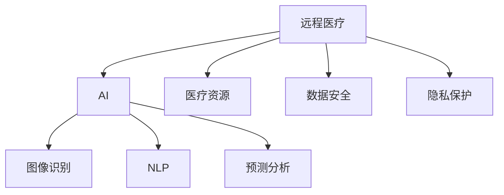
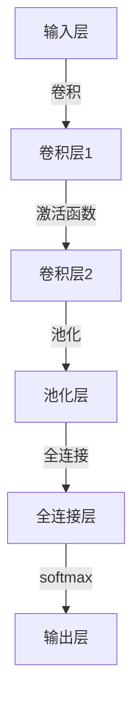
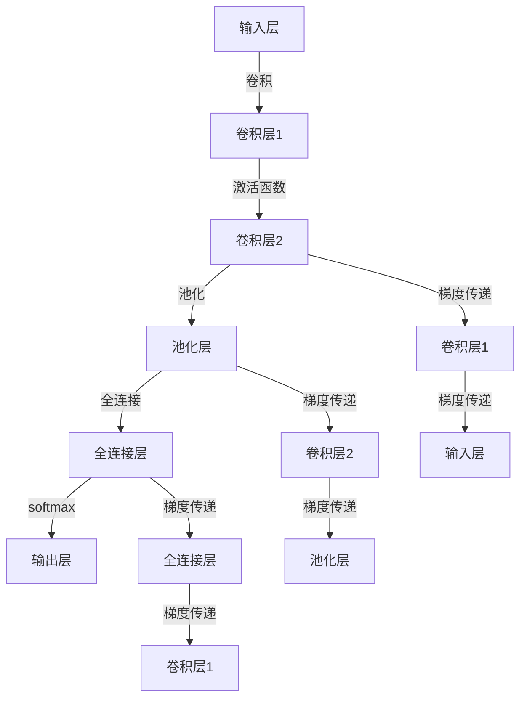

                 

# AI在远程医疗中的应用：扩大医疗覆盖

## 1. 背景介绍

### 1.1 问题由来
随着科技的迅猛发展，AI技术在医疗领域的应用日益增多，其中远程医疗成为了一个热点话题。远程医疗利用AI技术，尤其是AI在图像识别、自然语言处理、预测分析等方面的强大能力，为医疗资源短缺的地区提供了新的解决途径，尤其是在当前新冠疫情等公共卫生事件的背景下，远程医疗的需求更是空前高涨。

然而，尽管远程医疗在提高医疗资源利用效率、改善医疗服务质量方面有着显著优势，但现实中仍存在许多挑战。例如，技术普及度不够、医生与患者的互动体验不足、数据安全和隐私保护等问题都需要得到有效解决。AI技术，尤其是基于深度学习的模型，在提升远程医疗系统的诊断和治疗能力方面有着巨大潜力，但要实现广泛应用，还需深入研究和多方协作。

### 1.2 问题核心关键点
本节的关键词包括：
- 远程医疗
- AI（人工智能）
- 图像识别
- 自然语言处理
- 预测分析
- 医疗资源
- 数据安全
- 隐私保护

## 2. 核心概念与联系

### 2.1 核心概念概述

为了更好地理解AI在远程医疗中的应用，本节将介绍几个核心概念及其相互联系：

- **远程医疗**：指通过通信技术和网络平台，医生可以为远程的患者提供医疗诊断和治疗方案，包括但不限于影像诊断、电子病历、远程咨询等。
- **AI（人工智能）**：利用计算机技术模拟人类智能过程，包括学习、推理、自我修正等能力。
- **图像识别**：指通过深度学习模型对图像数据进行分析和分类，广泛应用于医学影像的自动诊断。
- **自然语言处理**（NLP）：使计算机能够理解和生成人类语言，包括语音识别、文本分类、语义理解等，用于处理医生和患者的沟通和交流。
- **预测分析**：利用历史数据和机器学习模型，对未来趋势进行预测和分析，应用于疾病风险评估、药物效果预测等场景。
- **医疗资源**：包括但不限于医疗设施、医护人员、医疗设备等，是远程医疗系统的基础。
- **数据安全**：保护医疗数据不被未授权访问、泄露或篡改，是远程医疗系统的核心要求之一。
- **隐私保护**：在医疗数据处理和使用过程中，保护患者个人信息不被泄露，是远程医疗系统的法律和伦理要求。

这些核心概念之间的逻辑关系可以通过以下Mermaid流程图来展示：



这个流程图展示了远程医疗与AI技术的相互关系：

1. 远程医疗应用AI技术，通过图像识别和自然语言处理提升诊断和治疗能力。
2. 医疗资源、数据安全和隐私保护是远程医疗的基础保障。
3. 预测分析模型用于医疗数据的挖掘和应用，辅助医生决策。

## 3. 核心算法原理 & 具体操作步骤

### 3.1 算法原理概述

AI在远程医疗中的应用，本质上是通过数据驱动的方法，提升医疗服务的效率和质量。核心算法包括但不限于图像识别、自然语言处理、预测分析等，其原理和实现流程如下：

- **图像识别**：基于深度学习模型，如卷积神经网络（CNN），对医学影像进行分析和分类，如CT、MRI等。
- **自然语言处理**：使用预训练语言模型，如BERT、GPT等，对医生和患者的对话进行理解和生成。
- **预测分析**：通过构建机器学习模型，如随机森林、神经网络等，对疾病发展趋势、药物效果等进行预测和分析。

### 3.2 算法步骤详解

#### 3.2.1 图像识别算法步骤

1. **数据准备**：收集和整理医学影像数据，包括标准标注的训练数据和测试数据。
2. **模型选择**：选择适合图像识别任务的深度学习模型，如卷积神经网络（CNN）。
3. **模型训练**：使用训练数据集对模型进行训练，调整超参数以获得最佳性能。
4. **模型评估**：在测试数据集上评估模型性能，如准确率、召回率、F1分数等。
5. **模型应用**：将训练好的模型应用于新的医学影像数据，进行实时诊断和治疗决策。

#### 3.2.2 自然语言处理算法步骤

1. **数据预处理**：对医生和患者的对话数据进行清洗和标注。
2. **模型选择**：选择适合NLP任务的深度学习模型，如BERT、GPT等。
3. **模型训练**：使用标注数据集对模型进行训练，调整超参数以获得最佳性能。
4. **模型评估**：在测试数据集上评估模型性能，如BLEU、ROUGE等。
5. **模型应用**：将训练好的模型应用于医生和患者的对话，进行自然语言理解、生成等任务。

#### 3.2.3 预测分析算法步骤

1. **数据准备**：收集和整理历史医疗数据，包括患者的病历、检查结果等。
2. **模型选择**：选择适合预测分析任务的机器学习模型，如随机森林、神经网络等。
3. **模型训练**：使用历史数据集对模型进行训练，调整超参数以获得最佳性能。
4. **模型评估**：在验证数据集上评估模型性能，如准确率、AUC等。
5. **模型应用**：将训练好的模型应用于新的医疗数据，进行疾病风险评估、药物效果预测等任务。

### 3.3 算法优缺点

AI在远程医疗中的应用具有以下优点：
- **提升效率**：自动化处理医疗影像和对话数据，减少医生和患者的等待时间。
- **改善质量**：通过深度学习和预测分析，提升诊断和治疗的准确性。
- **降低成本**：减少对医疗资源的依赖，降低远程医疗系统的运营成本。

同时，这些算法也存在一些局限性：
- **数据依赖**：AI模型的效果很大程度上依赖于数据的质量和数量，获取高质量医疗数据的成本较高。
- **模型泛化**：模型的预测能力可能受到数据分布的影响，面对新情况时的泛化能力有限。
- **隐私风险**：医疗数据的敏感性使得数据安全和隐私保护成为重要的挑战。

### 3.4 算法应用领域

AI在远程医疗中的应用涵盖了以下几个主要领域：

- **医学影像识别**：应用于X光片、CT扫描、MRI等医学影像的自动识别和分类，辅助医生诊断。
- **电子病历管理**：自动分析和整理患者的电子病历，减少医生的工作负担。
- **自然语言理解**：应用于医生和患者之间的对话，进行自然语言处理和生成，改善沟通体验。
- **疾病预测**：利用历史数据进行疾病发展趋势和风险评估，为治疗提供决策支持。
- **药物效果预测**：预测不同药物对患者的治疗效果，优化用药方案。

## 4. 数学模型和公式 & 详细讲解

### 4.1 数学模型构建

为了更加系统地介绍AI在远程医疗中的应用，本节将使用数学语言对相关模型进行详细讲解。

设医疗影像数据为 $X = \{x_1, x_2, ..., x_n\}$，其中 $x_i$ 为第 $i$ 个影像样本，其标签为 $y_i \in \{1, 2, ..., k\}$，$k$ 为分类数量。

图像识别模型的输入为医疗影像 $x_i$，输出为类别 $y_i$。模型 $M_{\theta}$ 的损失函数 $\mathcal{L}$ 为交叉熵损失函数，其表达式为：

$$
\mathcal{L}(M_{\theta}, X, Y) = -\frac{1}{n} \sum_{i=1}^n \sum_{j=1}^k y_{ij} \log M_{\theta}(x_i, j)
$$

其中 $M_{\theta}(x_i, j)$ 为模型对样本 $x_i$ 属于类别 $j$ 的概率估计，$y_{ij}$ 为样本 $x_i$ 的真实标签。

模型 $M_{\theta}$ 的优化目标是最小化损失函数 $\mathcal{L}$，即：

$$
\theta^* = \mathop{\arg\min}_{\theta} \mathcal{L}(M_{\theta}, X, Y)
$$

通过反向传播算法，可以计算出参数 $\theta$ 的梯度，进行优化更新。

### 4.2 公式推导过程

以卷积神经网络（CNN）为例，其基本结构如图：



卷积层通过卷积操作提取特征，池化层通过下采样减少特征图尺寸，全连接层将特征映射到输出类别，softmax层进行多分类预测。

CNN的反向传播过程如图：



梯度从输出层通过softmax层、全连接层、池化层、卷积层逐层传递，更新模型参数。

### 4.3 案例分析与讲解

以医学影像识别为例，具体分析步骤如下：

1. **数据准备**：收集和整理包含肺结节、肿块等标注的CT扫描图像数据，分为训练集和测试集。
2. **模型选择**：选择基于VGG、ResNet等架构的卷积神经网络。
3. **模型训练**：在训练集上对模型进行前向传播和反向传播，调整卷积核大小、步幅、通道数等超参数。
4. **模型评估**：在测试集上计算准确率、召回率、F1分数等指标，评估模型性能。
5. **模型应用**：将训练好的模型应用于新的CT扫描图像，进行实时肺结节识别。

## 5. 项目实践：代码实例和详细解释说明

### 5.1 开发环境搭建

在进行AI在远程医疗中的应用实践前，我们需要准备好开发环境。以下是使用Python进行TensorFlow开发的环境配置流程：

1. 安装Anaconda：从官网下载并安装Anaconda，用于创建独立的Python环境。

2. 创建并激活虚拟环境：
```bash
conda create -n tensorflow-env python=3.7 
conda activate tensorflow-env
```

3. 安装TensorFlow：根据CUDA版本，从官网获取对应的安装命令。例如：
```bash
conda install tensorflow tensorflow-cpu -c conda-forge
```

4. 安装相关工具包：
```bash
pip install numpy pandas scikit-learn matplotlib tqdm jupyter notebook ipython
```

完成上述步骤后，即可在`tensorflow-env`环境中开始实践。

### 5.2 源代码详细实现

这里以医学影像识别的项目为例，给出使用TensorFlow进行卷积神经网络模型的PyTorch代码实现。

```python
import tensorflow as tf
from tensorflow.keras import layers

# 定义模型
model = tf.keras.Sequential([
    layers.Conv2D(32, (3, 3), activation='relu', input_shape=(256, 256, 3)),
    layers.MaxPooling2D((2, 2)),
    layers.Conv2D(64, (3, 3), activation='relu'),
    layers.MaxPooling2D((2, 2)),
    layers.Flatten(),
    layers.Dense(64, activation='relu'),
    layers.Dense(10, activation='softmax')
])

# 编译模型
model.compile(optimizer='adam', loss='categorical_crossentropy', metrics=['accuracy'])

# 加载数据
train_dataset = tf.data.Dataset.from_tensor_slices((train_images, train_labels))
train_dataset = train_dataset.batch(32).repeat()

test_dataset = tf.data.Dataset.from_tensor_slices((test_images, test_labels))
test_dataset = test_dataset.batch(32)

# 训练模型
model.fit(train_dataset, epochs=10, validation_data=test_dataset)
```

以上就是使用TensorFlow对卷积神经网络进行医学影像识别的完整代码实现。可以看到，使用TensorFlow构建和训练模型非常简单高效。

### 5.3 代码解读与分析

让我们再详细解读一下关键代码的实现细节：

- `tf.keras.Sequential`：使用TensorFlow Keras API搭建卷积神经网络模型。
- `Conv2D`、`MaxPooling2D`、`Flatten`、`Dense`：定义卷积层、池化层、全连接层等基本组件。
- `compile`：编译模型，指定优化器、损失函数、评价指标。
- `Dataset.from_tensor_slices`：将原始数据转化为TensorFlow数据集。
- `batch`：对数据集进行批处理。
- `fit`：训练模型，指定训练轮数、验证集等参数。

## 6. 实际应用场景

### 6.1 电子病历管理

电子病历管理系统是远程医疗的核心应用之一，AI可以大幅提升其效率和准确性。AI可以自动化整理病历信息，提取关键数据，生成诊断报告，辅助医生决策。

- **自然语言处理**：使用预训练语言模型，如BERT、GPT等，对电子病历文本进行理解和生成。
- **数据分析**：通过构建机器学习模型，对电子病历数据进行分析和挖掘，发现潜在问题。
- **报告生成**：生成结构化的诊断报告，辅助医生进行决策和诊断。

### 6.2 远程咨询

远程咨询是远程医疗的重要组成部分，AI在提升咨询效率和质量方面有着显著效果。AI可以通过图像识别和自然语言处理，辅助医生进行诊断和治疗。

- **图像识别**：通过深度学习模型对医学影像进行自动识别和分类，辅助医生诊断。
- **自然语言处理**：使用预训练语言模型，如BERT、GPT等，对医生和患者的对话进行理解和生成。
- **咨询系统**：构建基于NLP和机器学习的智能咨询系统，提升医生和患者的互动体验。

### 6.3 疾病预测

疾病预测是远程医疗的重要应用方向之一，AI可以通过预测分析模型，提升预测的准确性和及时性。

- **数据收集**：收集和整理患者的电子病历、检查结果等数据。
- **模型训练**：使用历史数据集，构建机器学习模型，如随机森林、神经网络等。
- **预测应用**：利用训练好的模型对新患者进行疾病风险评估和预测，辅助医生决策。

### 6.4 未来应用展望

随着AI技术的发展，远程医疗的应用场景将更加广泛，其未来发展趋势如下：

- **多模态融合**：将图像、语音、文本等多种模态数据融合，构建更全面、准确的健康管理系统。
- **个性化医疗**：通过AI技术，结合患者基因信息、生活环境等个性化因素，提供量身定制的医疗方案。
- **远程监测**：利用AI技术，实时监测患者的健康状况，预警潜在的健康问题。
- **跨学科协作**：将AI与大数据、物联网等技术结合，实现医疗数据的跨学科应用和协同创新。
- **智能辅助**：构建智能辅助系统，提升医疗服务质量和效率，减轻医生的负担。

## 7. 工具和资源推荐

### 7.1 学习资源推荐

为了帮助开发者系统掌握AI在远程医疗中的应用，这里推荐一些优质的学习资源：

1. **《深度学习》（Ian Goodfellow等著）**：深度学习领域的经典教材，系统介绍了深度学习的理论和应用。
2. **CS231n《深度学习计算机视觉》课程**：斯坦福大学开设的计算机视觉课程，涵盖深度学习在图像识别中的应用。
3. **CS224n《自然语言处理》课程**：斯坦福大学开设的自然语言处理课程，涵盖NLP的理论和应用。
4. **ArXiv预印本**：收集和发布深度学习相关论文的开放平台，是学习前沿技术的绝佳资源。
5. **Kaggle竞赛平台**：提供大量医疗数据集和竞赛任务，通过实践学习深度学习和AI在医疗中的应用。

通过对这些资源的学习实践，相信你一定能够快速掌握AI在远程医疗中的应用精髓，并用于解决实际的医疗问题。

### 7.2 开发工具推荐

高效的开发离不开优秀的工具支持。以下是几款用于AI在远程医疗开发开发的常用工具：

1. **TensorFlow**：由Google主导开发的深度学习框架，生产部署方便，适合大规模工程应用。
2. **PyTorch**：基于Python的开源深度学习框架，灵活动态的计算图，适合快速迭代研究。
3. **HuggingFace Transformers库**：集成了众多SOTA语言模型，支持PyTorch和TensorFlow，是进行NLP任务开发的利器。
4. **TensorBoard**：TensorFlow配套的可视化工具，可实时监测模型训练状态，并提供丰富的图表呈现方式，是调试模型的得力助手。
5. **Weights & Biases**：模型训练的实验跟踪工具，可以记录和可视化模型训练过程中的各项指标，方便对比和调优。
6. **Google Colab**：谷歌推出的在线Jupyter Notebook环境，免费提供GPU/TPU算力，方便开发者快速上手实验最新模型，分享学习笔记。

合理利用这些工具，可以显著提升AI在远程医疗系统的开发效率，加快创新迭代的步伐。

### 7.3 相关论文推荐

AI在远程医疗中的应用源于学界的持续研究。以下是几篇奠基性的相关论文，推荐阅读：

1. **“Deep Residual Learning for Image Recognition”**（He等著）：提出深度残差网络（ResNet），提升了深度学习模型的性能。
2. **“Contributions of ICT in NCDR Care: A Longitudinal Study”**（Otto等著）：探讨了信息通信技术（ICT）在非传染性疾病（NCDR）护理中的应用。
3. **“Predictive Analytics for Patient-Centered Medical Home”**（Clinical and Aging Research, 2018）：利用预测分析模型，提升医疗服务质量。
4. **“Natural Language Processing in the Tumor Electronic Health Record”**（JAMA Oncology, 2021）：利用NLP技术，自动分析和提取肿瘤电子病历中的信息。
5. **“AI in Healthcare: A Deep Learning Perspective”**（IEEE Journal of Biomedical and Health Informatics, 2018）：全面综述了AI在医疗领域的应用现状和未来趋势。

这些论文代表了大语言模型在远程医疗中的应用发展脉络。通过学习这些前沿成果，可以帮助研究者把握学科前进方向，激发更多的创新灵感。

## 8. 总结：未来发展趋势与挑战

### 8.1 总结

本文对AI在远程医疗中的应用进行了全面系统的介绍。首先阐述了AI技术在远程医疗中的重要性，明确了其在提高医疗资源利用效率、改善医疗服务质量方面的独特价值。其次，从原理到实践，详细讲解了图像识别、自然语言处理、预测分析等关键技术，给出了具体的应用案例和代码实例。同时，本文还广泛探讨了AI技术在远程医疗系统的实际应用场景，展示了其广阔的前景。

通过本文的系统梳理，可以看到，AI在远程医疗中的应用已经渗透到医疗服务的各个环节，极大地提升了医疗服务的质量和效率。未来，伴随AI技术的不断发展，远程医疗的应用将更加广泛，其对医疗系统的变革性影响也将愈加显著。

### 8.2 未来发展趋势

展望未来，AI在远程医疗中的应用将呈现以下几个发展趋势：

- **数据智能化**：通过AI技术，对医疗数据进行智能化处理，提升数据质量和利用效率。
- **多模态融合**：将图像、语音、文本等多种模态数据融合，构建更全面、准确的健康管理系统。
- **个性化医疗**：通过AI技术，结合患者基因信息、生活环境等个性化因素，提供量身定制的医疗方案。
- **远程监测**：利用AI技术，实时监测患者的健康状况，预警潜在的健康问题。
- **跨学科协作**：将AI与大数据、物联网等技术结合，实现医疗数据的跨学科应用和协同创新。

以上趋势凸显了AI在远程医疗中的广阔前景。这些方向的探索发展，必将进一步提升远程医疗系统的性能和应用范围，为医疗服务带来更多的创新和改进。

### 8.3 面临的挑战

尽管AI在远程医疗中的应用已经取得了显著进展，但在迈向更加智能化、普适化应用的过程中，仍面临诸多挑战：

- **数据安全**：医疗数据的敏感性使得数据安全和隐私保护成为重要的挑战。如何保护患者隐私，确保数据安全，将是未来研究的重点。
- **模型泛化**：AI模型在面对新情况时的泛化能力有限，如何提升模型的泛化能力，提高对新数据的适应性，是未来的重要研究方向。
- **资源消耗**：AI模型对计算资源的需求较高，如何在保持性能的同时，减少资源消耗，提高系统效率，是未来的重要课题。
- **用户体验**：如何提升AI系统的用户体验，使其更加自然、友好，减少用户的接受难度，将是未来的重要方向。

### 8.4 研究展望

面对AI在远程医疗应用中面临的挑战，未来的研究需要在以下几个方面寻求新的突破：

- **数据隐私保护**：利用联邦学习等技术，在不共享数据的前提下，进行模型训练和推理。
- **模型泛化能力**：通过迁移学习和自监督学习等方法，提升模型的泛化能力。
- **资源优化**：引入模型压缩、分布式训练等技术，提高系统的计算效率和资源利用率。
- **用户界面设计**：设计更加自然、友好的用户界面，提高用户的使用体验。

这些研究方向的探索，必将引领AI在远程医疗中的应用走向更高的台阶，为医疗服务带来更多的创新和改进。相信随着学界和产业界的共同努力，这些挑战终将一一被克服，AI在远程医疗中的价值也将进一步凸显。

## 9. 附录：常见问题与解答

**Q1：AI在远程医疗中的应用是否适用于所有医疗场景？**

A: AI在远程医疗中的应用适用于大多数医疗场景，特别是对于医疗资源匮乏的地区，AI可以大幅提升医疗服务的质量和效率。但面对一些高风险、高复杂度的医疗任务，如外科手术、重症监护等，AI技术仍需进一步完善和验证。

**Q2：AI在远程医疗中的应用是否存在数据安全问题？**

A: 医疗数据的敏感性使得数据安全和隐私保护成为AI在远程医疗应用中的重要挑战。如何保护患者隐私，确保数据安全，是AI在医疗领域应用中的核心要求之一。

**Q3：AI在远程医疗中的应用是否存在算法偏见问题？**

A: AI模型可能会学习到数据中的偏见，导致输出结果的歧视性问题。解决这一问题需要引入公平性评估指标，并在训练过程中进行公平性约束。

**Q4：AI在远程医疗中的应用是否存在模型泛化问题？**

A: 模型的泛化能力在面对新情况时可能会受到限制，这需要通过更多的数据、更复杂的网络结构以及迁移学习等方法来提升。

**Q5：AI在远程医疗中的应用是否存在计算资源消耗问题？**

A: AI模型对计算资源的需求较高，未来需要通过模型压缩、分布式训练等技术来提高计算效率和资源利用率。

这些问题的回答，希望能够帮助读者更好地理解和应用AI在远程医疗中的技术，进一步推动AI技术在医疗领域的普及和应用。

---

作者：禅与计算机程序设计艺术 / Zen and the Art of Computer Programming

