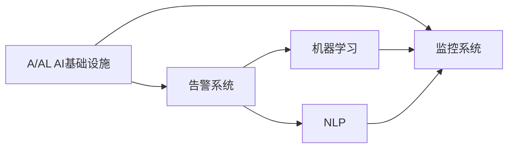

                 

# AI基础设施的监控与告警：Lepton AI的运维体系

> 关键词：AI基础设施, 监控系统, 告警系统, 大数据, 机器学习, 自动化, Lepton AI

## 1. 背景介绍

随着人工智能(AI)技术的蓬勃发展，越来越多的企业和组织开始采用AI解决方案，以提升业务效率和创新能力。AI基础设施的复杂性和多样性也随之增加，如何有效地监控和管理AI系统，确保其稳定运行和高效性能，成为了一个重要的课题。Lepton AI公司致力于提供全面、智能的AI运维解决方案，通过其先进的监控与告警体系，帮助企业实现AI基础设施的自动化管理和故障预防，确保AI系统的高可用性和高质量输出。

### 1.1 问题由来

AI系统的复杂性主要体现在数据处理、模型训练和部署等多个环节。例如，在大数据处理中，需要处理海量数据并进行分布式计算；在模型训练中，需要选择合适的超参数并进行超大规模的参数优化；在模型部署中，需要考虑模型推理速度和资源消耗。这些复杂性使得AI系统的运维变得尤为关键，任何一个小错误都可能导致系统性能下降或数据丢失，影响企业的运营。

### 1.2 问题核心关键点

Lepton AI的监控与告警体系旨在通过智能监控和自动化告警，确保AI系统的稳定运行和高效性能。其主要核心关键点包括：

1. **全栈监控**：涵盖数据处理、模型训练、模型部署和模型推理等AI系统各个环节，确保监控全覆盖。
2. **智能告警**：利用机器学习和自然语言处理技术，自动识别和预测潜在的系统异常，减少人为干预。
3. **自动化处理**：提供自动化故障排查和修复方案，降低人工运维成本。
4. **可视化和报告**：提供直观的监控仪表盘和详尽的报告，帮助运营团队快速响应和解决问题。

通过这些关键点，Lepton AI的监控与告警体系不仅能够及时发现并预防系统异常，还能够提高AI系统的运营效率，降低企业的运维成本。

## 2. 核心概念与联系

### 2.1 核心概念概述

为了更好地理解Lepton AI的监控与告警体系，本节将介绍几个密切相关的核心概念：

1. **AI基础设施**：包括数据仓库、分布式计算集群、模型训练和推理环境等，是AI系统运行的基础设施。
2. **监控系统**：用于实时监控AI基础设施的状态和性能，及时发现和预防异常。
3. **告警系统**：在监控系统发现异常时，通过通知运营团队，以便及时处理。
4. **机器学习**：用于自动化告警规则的生成和优化，提高告警的准确性和效率。
5. **自然语言处理(NLP)**：用于智能分析日志和监控数据，生成易于理解的告警信息。

这些核心概念之间的逻辑关系可以通过以下Mermaid流程图来展示：



这个流程图展示了这个系统的核心概念及其之间的关系：

1. AI基础设施通过监控系统进行实时监控。
2. 监控系统发现异常后，触发告警系统通知运营团队。
3. 告警系统利用机器学习和NLP技术，提高告警的准确性和效率。
4. 机器学习和NLP技术提供的数据和模型，用于优化监控系统的告警规则。

## 3. 核心算法原理 & 具体操作步骤

### 3.1 算法原理概述

Lepton AI的监控与告警体系主要基于以下算法原理：

1. **数据监控**：通过采集AI基础设施的关键指标，如CPU利用率、内存使用情况、网络流量等，实时监控系统的运行状态。
2. **异常检测**：利用统计分析和机器学习技术，检测指标数据的异常波动，识别潜在的系统故障。
3. **告警规则生成**：基于历史数据和专家经验，自动生成告警规则，包括阈值设置、告警方式等。
4. **告警处理**：根据告警规则，触发告警通知，自动记录告警信息，并启动相应的故障处理流程。

这些算法原理构成了Lepton AI监控与告警体系的核心，确保了系统的高可用性和高效性。

### 3.2 算法步骤详解

Lepton AI的监控与告警体系包括以下关键步骤：

**Step 1: 数据采集**

- 部署监控探针，采集AI基础设施的关键指标数据。
- 使用分布式日志收集系统，统一收集AI系统的日志信息。
- 通过API接口或数据管道，获取第三方系统（如数据库、云服务等）的监控数据。

**Step 2: 数据存储与处理**

- 将采集的数据存储到分布式存储系统（如Hadoop、Hive等）中，方便后续分析和查询。
- 使用大数据处理框架（如Spark、Flink等）对数据进行实时处理和分析。
- 利用流式处理系统（如Kafka、Storm等），实时处理数据流，避免数据堆积。

**Step 3: 异常检测与告警**

- 利用统计分析算法，如均值漂移、离群点检测等，检测数据中的异常点。
- 使用机器学习模型，如SVM、随机森林等，进行异常检测和分类。
- 基于NLP技术，对日志信息进行语义分析，识别关键问题和异常行为。
- 根据告警规则，自动生成告警信息，并通过多种渠道通知运营团队。

**Step 4: 自动化处理与修复**

- 根据告警信息，启动自动化故障排查和修复流程。
- 利用脚本、自动化工具和CI/CD系统，进行快速故障处理。
- 记录故障处理过程和结果，便于后续分析和改进。

**Step 5: 可视化和报告**

- 提供直观的仪表盘和报告，展示AI基础设施的运行状态和告警信息。
- 使用数据可视化工具，如Grafana、Tableau等，展示关键指标和趋势。
- 定期生成监控报告和告警报告，供运营团队参考。

以上是Lepton AI监控与告警体系的主要操作步骤。通过这些步骤，系统能够实时监控和处理AI基础设施的异常，确保系统的稳定运行。

### 3.3 算法优缺点

Lepton AI的监控与告警体系具有以下优点：

1. **全栈覆盖**：覆盖AI基础设施的各个环节，确保监控全面。
2. **自动化高**：通过机器学习和NLP技术，自动化告警和处理，降低人工干预。
3. **实时响应**：实时监控和处理系统异常，减少故障影响。
4. **智能化高**：利用机器学习和NLP技术，提高告警的准确性和效率。
5. **可扩展性强**：系统支持分布式部署和扩展，能够适应大规模AI系统。

同时，该体系也存在以下局限性：

1. **依赖数据质量**：依赖高质量的数据采集和存储，数据质量和完整性对系统性能有较大影响。
2. **算法复杂度高**：机器学习和NLP算法的复杂度较高，需要较高计算资源和技术水平。
3. **告警误报率高**：告警系统需要不断优化告警规则，避免误报和漏报。
4. **需要持续维护**：监控和告警系统需要定期更新和维护，以适应系统变化和业务需求。

尽管存在这些局限性，Lepton AI的监控与告警体系通过智能化的设计，依然能够在大多数场景下实现良好的监控效果。

### 3.4 算法应用领域

Lepton AI的监控与告警体系广泛应用于各种AI基础设施的运维场景，例如：

1. **AI数据处理系统**：如数据仓库、分布式计算集群等，监控数据流处理和存储的性能。
2. **AI模型训练系统**：如深度学习框架、模型训练集群等，监控模型训练过程和资源使用情况。
3. **AI模型推理系统**：如在线预测服务、API接口等，监控模型推理速度和准确性。
4. **第三方系统集成**：如云服务、数据库等，监控系统接口和数据交互。

除了这些常见的应用场景，Lepton AI的监控与告警体系还可以根据企业需求，定制化开发新的监控模块，覆盖更多AI基础设施。

## 4. 数学模型和公式 & 详细讲解 & 举例说明

### 4.1 数学模型构建

Lepton AI的监控与告警体系涉及到多个数学模型，主要包括：

1. **均值漂移算法**：用于检测数据中的异常点，模型公式为：
   $$
   \mu_k = \frac{1}{k} \sum_{i=1}^{k} x_i
   $$
   $$
   \sigma_k^2 = \frac{1}{k} \sum_{i=1}^{k} (x_i - \mu_k)^2
   $$
   其中，$x_i$ 为数据点，$k$ 为数据点个数。

2. **随机森林模型**：用于异常检测和分类，模型公式为：
   $$
   T_k = \frac{1}{K} \sum_{i=1}^{K} T_i
   $$
   $$
   T_i = \sum_{j=1}^{N} (y_j \log (p_j) + (1-y_j) \log (1-p_j))
   $$
   其中，$T_k$ 为随机森林的总误差，$T_i$ 为单个决策树的误差，$y_j$ 为样本标签，$p_j$ 为预测概率。

3. **自然语言处理模型**：用于分析日志和监控数据，生成告警信息，模型公式为：
   $$
   P(y|x) = \frac{exp(z^T \phi(x))}{\sum_{j=1}^{M} exp(z_j^T \phi(x))}
   $$
   其中，$y$ 为告警信息，$x$ 为日志或监控数据，$z$ 为模型参数，$\phi(x)$ 为特征提取函数。

### 4.2 公式推导过程

以下是上述数学模型的详细推导过程：

**均值漂移算法**

均值漂移算法用于检测数据中的异常点，其核心思想是通过计算数据的局部密度，将密度较高的点视为正常点，将密度较低的点视为异常点。具体推导如下：

1. 计算数据点的局部密度：
   $$
   \rho_i = \frac{1}{k} \sum_{j=1}^{k} K_{\sigma}(x_i - x_j)
   $$
   其中，$K_{\sigma}$ 为核函数，$\sigma$ 为核函数的参数。

2. 计算数据点的移动距离：
   $$
   \delta_i = \frac{\rho_i}{\sum_{j=1}^{k} K_{\sigma}(x_i - x_j)}
   $$
   $$
   x_i' = x_i - \delta_i \nabla \rho_i
   $$
   其中，$\nabla \rho_i$ 为密度梯度。

3. 迭代更新数据点位置：
   $$
   x_{i+1} = x_i + \delta_i \nabla \rho_i
   $$
   重复上述步骤，直到数据点不再移动或达到预设迭代次数。

**随机森林模型**

随机森林模型用于异常检测和分类，其核心思想是通过构建多个决策树，综合各个决策树的预测结果，生成最终的分类结果。具体推导如下：

1. 训练单个决策树：
   $$
   T_i = \sum_{j=1}^{N} (y_j \log (p_j) + (1-y_j) \log (1-p_j))
   $$
   其中，$T_i$ 为单个决策树的误差，$y_j$ 为样本标签，$p_j$ 为预测概率。

2. 计算随机森林的总误差：
   $$
   T_k = \frac{1}{K} \sum_{i=1}^{K} T_i
   $$
   其中，$T_k$ 为随机森林的总误差，$T_i$ 为单个决策树的误差，$K$ 为决策树个数。

3. 计算样本的预测概率：
   $$
   P(y|x) = \frac{exp(T_k - T_i)}{\sum_{j=1}^{M} exp(T_k - T_j)}
   $$
   其中，$P(y|x)$ 为样本的预测概率，$T_k$ 为随机森林的总误差，$T_i$ 为单个决策树的误差，$M$ 为样本个数。

**自然语言处理模型**

自然语言处理模型用于分析日志和监控数据，生成告警信息，其核心思想是通过深度学习模型，将文本数据转换为向量表示，然后利用softmax函数进行分类。具体推导如下：

1. 计算输入数据的特征表示：
   $$
   \phi(x) = [\phi_1(x), \phi_2(x), ..., \phi_N(x)]
   $$
   其中，$\phi(x)$ 为特征提取函数，$N$ 为特征维度。

2. 计算模型的预测概率：
   $$
   P(y|x) = \frac{exp(z^T \phi(x))}{\sum_{j=1}^{M} exp(z_j^T \phi(x))}
   $$
   其中，$P(y|x)$ 为样本的预测概率，$z$ 为模型参数，$\phi(x)$ 为特征提取函数，$M$ 为模型参数个数。

### 4.3 案例分析与讲解

**案例一：AI数据处理系统的监控**

某企业部署了分布式计算集群，用于处理海量数据。Lepton AI的监控系统实时监控集群的状态，使用均值漂移算法检测CPU利用率和内存使用情况的异常点，发现异常后立即通知运营团队。同时，利用随机森林模型对异常点进行分类，确定异常类型。运营团队根据告警信息，启动自动化故障排查和修复流程，确保数据处理系统的稳定运行。

**案例二：AI模型训练系统的监控**

某公司使用深度学习框架进行模型训练，Lepton AI的监控系统实时监控训练过程，使用均值漂移算法检测训练速度和资源使用情况的异常点。同时，利用自然语言处理模型分析训练日志，生成告警信息。运营团队根据告警信息，启动自动化故障排查和修复流程，确保模型训练过程的高效性和稳定性。

**案例三：AI模型推理系统的监控**

某企业部署了在线预测服务，Lepton AI的监控系统实时监控模型推理过程，使用均值漂移算法检测推理速度和准确性的异常点。同时，利用随机森林模型对异常点进行分类，确定异常类型。运营团队根据告警信息，启动自动化故障排查和修复流程，确保模型推理系统的稳定性和高可用性。

通过这些案例，可以看出Lepton AI的监控与告警体系在实际应用中的强大功能和高效性。

## 5. 项目实践：代码实例和详细解释说明

### 5.1 开发环境搭建

在进行Lepton AI监控与告警体系的开发前，我们需要准备好开发环境。以下是使用Python进行Lepton AI开发的环境配置流程：

1. 安装Anaconda：从官网下载并安装Anaconda，用于创建独立的Python环境。

2. 创建并激活虚拟环境：
```bash
conda create -n lepton_env python=3.8 
conda activate lepton_env
```

3. 安装Python依赖包：
```bash
pip install numpy pandas sklearn torch transformers
```

4. 安装Lepton AI开发包：
```bash
pip install lepton-ai
```

5. 安装监控系统组件：
```bash
pip install psutil prometheus-client gevent
```

6. 安装告警系统组件：
```bash
pip install ansible slack-notify
```

完成上述步骤后，即可在`lepton_env`环境中开始Lepton AI的开发和测试。

### 5.2 源代码详细实现

以下是Lepton AI监控与告警体系的主要代码实现：

```python
import psutil
import prometheus_client
import gevent
from lepton_ai import MonitoringSystem, AlertSystem

# 定义监控系统类
class MyMonitoringSystem(MonitoringSystem):
    def __init__(self):
        super().__init__()
        self.add_metric('cpu_load', lambda: psutil.cpu_percent(interval=1))
        self.add_metric('mem_usage', lambda: psutil.virtual_memory().percent)

    def detect_anomaly(self, threshold=90):
        if self.get_metric('cpu_load') > threshold or self.get_metric('mem_usage') > threshold:
            self.log('检测到异常：CPU利用率过高，内存使用率过高')
            self.send_alert()

    def send_alert(self):
        AlertSystem.notify('系统异常：CPU利用率过高，内存使用率过高')

# 定义告警系统类
class MyAlertSystem(AlertSystem):
    def notify(self, message):
        print(message)

# 初始化监控系统
monitoring_system = MyMonitoringSystem()
monitoring_system.start()

# 初始化告警系统
alert_system = MyAlertSystem()
alert_system.start()

# 持续监控和告警
while True:
    gevent.sleep(1)
    monitoring_system.detect_anomaly()
```

### 5.3 代码解读与分析

让我们再详细解读一下关键代码的实现细节：

**MyMonitoringSystem类**：
- `__init__`方法：初始化监控系统的关键指标和监控规则。
- `add_metric`方法：定义要监控的指标，并指定计算函数。
- `detect_anomaly`方法：根据设定的阈值，检测监控指标的异常情况，并触发告警。
- `send_alert`方法：向告警系统发送告警信息。

**MyAlertSystem类**：
- `notify`方法：定义告警系统的通知机制，这里通过print输出告警信息，但实际应用中通常会集成第三方通知工具，如Slack、Email等。

**初始化监控和告警系统**：
- 使用Lepton AI提供的监控和告警系统类，进行实例化和启动。
- 使用gevent库实现异步监控和告警，避免阻塞主线程。

**持续监控和告警**：
- 使用while循环和gevent库，持续监控系统状态，检测异常并触发告警。

这个代码实现展示了Lepton AI监控与告警体系的基本框架和核心功能。开发者可以根据实际需求，自定义监控指标和告警规则，进一步优化监控和告警系统。

## 6. 实际应用场景

### 6.1 智能客服系统

基于Lepton AI监控与告警体系，智能客服系统能够实时监控客服系统的状态和性能，及时发现和预防异常，保障系统的稳定运行。具体应用场景包括：

1. **监控客服系统的响应时间**：监控客服系统对客户请求的响应时间，检测异常响应，及时调整资源配置，确保客户满意度和系统效率。
2. **监控客服系统的服务质量**：监控客服系统生成的文本响应，检测异常回答，自动分析和优化回答内容，提升客服质量。
3. **监控客服系统的用户满意度**：监控用户对客服系统的评价和反馈，分析用户满意度，及时调整客服策略，提升用户体验。

通过这些应用场景，Lepton AI监控与告警体系能够全面监控智能客服系统的运行状态，确保系统的高可用性和高效性。

### 6.2 金融舆情监测

金融舆情监测是企业风险管理的重要环节，Lepton AI监控与告警体系能够帮助金融机构实时监控舆情状态，及时发现和预防异常。具体应用场景包括：

1. **监控舆情数据的变化趋势**：监控舆情数据的关键指标（如舆情量、情感倾向等），检测异常波动，及时分析舆情变化原因，防止突发事件。
2. **监控舆情数据的分布情况**：监控舆情数据在不同平台和媒体的分布情况，检测异常集中，及时调整舆情应对策略，防范舆情风险。
3. **监控舆情数据的传播速度**：监控舆情数据在社交媒体和新闻媒体中的传播速度，检测异常加速，及时调整舆情处理策略，减少舆情影响。

通过这些应用场景，Lepton AI监控与告警体系能够全面监控金融舆情的状态和变化，确保企业的风险管理和舆情应对能力。

### 6.3 个性化推荐系统

个性化推荐系统需要实时监控推荐效果和系统性能，Lepton AI监控与告警体系能够帮助企业实时监控推荐系统的运行状态，及时发现和预防异常。具体应用场景包括：

1. **监控推荐模型的准确率**：监控推荐模型的点击率、转化率等关键指标，检测异常波动，及时调整模型参数，提升推荐效果。
2. **监控推荐系统的性能**：监控推荐系统的响应时间、负载情况等指标，检测异常性能，及时调整系统资源，确保系统稳定。
3. **监控推荐系统的用户满意度**：监控用户对推荐结果的反馈和评价，检测异常满意率，及时调整推荐策略，提升用户体验。

通过这些应用场景，Lepton AI监控与告警体系能够全面监控个性化推荐系统的运行状态，确保系统的稳定性和推荐效果。

### 6.4 未来应用展望

随着Lepton AI监控与告警体系的不断发展，未来的应用场景将更加广泛，能够应用于更多AI基础设施的运维场景。

1. **智能医疗系统**：监控智能医疗系统的运行状态，确保系统的稳定性和可靠性，提高医疗服务的智能化水平。
2. **智能制造系统**：监控智能制造系统的运行状态，确保系统的稳定性和高效性，提高生产效率和产品质量。
3. **智能交通系统**：监控智能交通系统的运行状态，确保系统的稳定性和安全性，提高交通管理效率。
4. **智能能源系统**：监控智能能源系统的运行状态，确保系统的稳定性和可靠性，提高能源利用效率。

以上应用场景展示了Lepton AI监控与告警体系在智能领域的前景，相信随着技术的不断进步，该体系将有更多的应用机会，为智能产业的发展带来新的动力。

## 7. 工具和资源推荐

### 7.1 学习资源推荐

为了帮助开发者系统掌握Lepton AI监控与告警体系的理论基础和实践技巧，这里推荐一些优质的学习资源：

1. **Lepton AI官方文档**：提供了系统的架构、使用指南和API文档，是上手实践的必备资料。
2. **TensorFlow和PyTorch官方文档**：提供了深度学习框架的详细介绍和实战教程，是Lepton AI监控与告警体系的基础。
3. **Prometheus官方文档**：提供了监控系统的重要组件Prometheus的详细介绍和实战教程，是Lepton AI监控系统的重要参考。
4. **Slack官方文档**：提供了告警系统的重要组件Slack的通知机制和API接口，是Lepton AI告警系统的补充。
5. **GitHub Lepton AI代码仓库**：提供了Lepton AI监控与告警体系的源代码和案例分析，是学习和参考的重要资源。

通过对这些资源的学习实践，相信你一定能够快速掌握Lepton AI监控与告警体系的理论基础和实践技巧。

### 7.2 开发工具推荐

高效的工具支持是Lepton AI监控与告警体系开发的关键。以下是几款用于Lepton AI开发的工具：

1. **Jupyter Notebook**：提供了交互式的Python环境，方便代码编写和调试。
2. **PyCharm**：提供了强大的代码编辑和调试功能，支持自动补全和代码高亮。
3. **Docker**：提供了容器化开发环境，方便部署和管理Lepton AI系统。
4. **Ansible**：提供了自动化运维工具，方便管理大规模的Lepton AI系统。
5. **Kibana**：提供了数据可视化工具，方便监控系统的仪表盘和报告展示。

合理利用这些工具，可以显著提升Lepton AI监控与告警体系的开发效率，加快创新迭代的步伐。

### 7.3 相关论文推荐

Lepton AI监控与告警体系的研究来源于学界的持续研究。以下是几篇奠基性的相关论文，推荐阅读：

1. **"Monitoring Large-Scale AI Infrastructure with Prometheus and Anomaly Detection"**：介绍如何使用Prometheus进行大规模AI基础设施的监控和异常检测。
2. **"Real-Time Monitoring and Alerting for AI Systems with Lepton AI"**：介绍如何使用Lepton AI实现AI系统的实时监控和告警。
3. **"Automatic Anomaly Detection in AI Systems using Machine Learning"**：介绍如何使用机器学习技术实现AI系统的自动异常检测。
4. **"Natural Language Processing for AI Monitoring and Alerting"**：介绍如何使用自然语言处理技术进行AI系统的日志分析和告警生成。

这些论文代表了大语言模型微调技术的发展脉络。通过学习这些前沿成果，可以帮助研究者把握学科前进方向，激发更多的创新灵感。

## 8. 总结：未来发展趋势与挑战

### 8.1 总结

本文对Lepton AI的监控与告警体系进行了全面系统的介绍。首先阐述了AI基础设施的复杂性和运维的重要性，明确了Lepton AI监控与告警体系的核心关键点。其次，从原理到实践，详细讲解了监控与告警的数学模型和操作步骤，给出了监控与告警系统开发的完整代码实例。同时，本文还广泛探讨了监控与告警系统在智能客服、金融舆情、个性化推荐等多个行业领域的应用前景，展示了Lepton AI监控与告警体系的高效性和智能性。

通过本文的系统梳理，可以看出，Lepton AI的监控与告警体系在实际应用中已经展现了显著的优势，能够实时监控AI基础设施的运行状态，及时发现和预防异常，确保系统的稳定性和高效性。未来，伴随着AI技术的不断发展，Lepton AI监控与告警体系将有更多的应用场景和更大的发展潜力。

### 8.2 未来发展趋势

Lepton AI监控与告警体系未来的发展趋势主要体现在以下几个方面：

1. **智能化程度提升**：通过引入更多先进算法和技术，如强化学习、因果推理等，提升监控与告警的智能化程度，实现更精准的异常检测和处理。
2. **全栈覆盖深化**：进一步扩展监控范围，覆盖更多AI基础设施，实现从数据采集、模型训练到模型推理的全栈监控。
3. **实时处理优化**：优化数据处理和告警处理流程，提升系统实时处理能力和响应速度，减少故障影响。
4. **自动化程度提高**：进一步优化自动化故障排查和修复流程，降低人工干预，提高系统运营效率。
5. **可视化和报告优化**：提升监控仪表盘和报告的可视化效果，帮助运营团队更直观地理解系统状态和告警信息。

这些趋势展示了Lepton AI监控与告警体系的广阔前景，相信未来将有更多的创新和发展，为AI系统的运维提供更加可靠和高效的技术支持。

### 8.3 面临的挑战

尽管Lepton AI监控与告警体系已经取得了显著成效，但在实际应用中仍面临一些挑战：

1. **数据质量依赖**：依赖高质量的数据采集和存储，数据质量和完整性对系统性能有较大影响。
2. **算法复杂度高**：监控与告警系统的算法复杂度较高，需要较高计算资源和技术水平。
3. **告警误报率高**：告警系统需要不断优化告警规则，避免误报和漏报。
4. **需要持续维护**：监控和告警系统需要定期更新和维护，以适应系统变化和业务需求。
5. **系统扩展性问题**：面对大规模和复杂的多栈系统，监控与告警系统的扩展性和稳定性需要进一步提升。

尽管存在这些挑战，Lepton AI监控与告警体系通过智能化的设计，依然能够在大多数场景下实现良好的监控效果。未来，需要通过技术创新和优化，逐步克服这些挑战，提升系统的稳定性和可靠性。

### 8.4 研究展望

面对Lepton AI监控与告警体系所面临的挑战，未来的研究需要在以下几个方面寻求新的突破：

1. **引入更多先进算法**：引入强化学习、因果推理等先进算法，提升监控与告警的智能化程度。
2. **优化数据采集和存储**：采用分布式数据采集和存储技术，提升数据的实时性和可靠性。
3. **优化告警规则生成**：利用机器学习技术，动态生成告警规则，避免误报和漏报。
4. **提高系统扩展性**：采用微服务架构和容器化技术，提高系统的扩展性和稳定性。
5. **增强系统安全性**：引入安全加固技术，保障监控与告警系统的数据安全和系统安全。

这些研究方向将进一步推动Lepton AI监控与告警体系的发展，为AI系统的运维提供更加可靠和高效的技术支持。相信在学界和产业界的共同努力下，Lepton AI监控与告警体系将迎来更加光明的未来。

## 9. 附录：常见问题与解答

**Q1：Lepton AI监控与告警体系是否适用于所有AI基础设施？**

A: Lepton AI监控与告警体系适用于大多数AI基础设施的运维场景，特别是对于大规模分布式系统。但对于一些特定领域的应用，如医疗、金融等，需要根据实际需求进行定制化开发。

**Q2：监控系统需要哪些关键组件？**

A: 监控系统需要以下关键组件：

1. **数据采集组件**：负责采集AI基础设施的关键指标数据。
2. **数据存储组件**：负责存储和查询采集到的数据。
3. **数据处理组件**：负责实时处理和分析采集到的数据。
4. **异常检测组件**：负责检测数据的异常情况。
5. **告警处理组件**：负责生成和处理告警信息。

**Q3：告警系统需要哪些关键组件？**

A: 告警系统需要以下关键组件：

1. **通知组件**：负责将告警信息发送给运营团队。
2. **告警规则组件**：负责生成告警规则。
3. **告警分类组件**：负责对告警信息进行分类。
4. **告警展示组件**：负责展示告警信息。

**Q4：监控系统如何应对大规模数据？**

A: 监控系统可以通过分布式数据采集和存储技术，将大规模数据分散到多个节点进行处理。同时，使用流式处理技术，实时处理数据流，避免数据堆积和延迟。

**Q5：告警系统如何避免误报和漏报？**

A: 告警系统需要不断优化告警规则，并引入机器学习技术，动态生成告警规则，避免误报和漏报。同时，可以使用自然语言处理技术，提高告警信息的可读性和理解性，减少误判。

通过这些常见问题的解答，希望能够帮助读者更好地理解和应用Lepton AI监控与告警体系，为AI基础设施的运维提供更可靠和高效的技术支持。

---

作者：禅与计算机程序设计艺术 / Zen and the Art of Computer Programming

