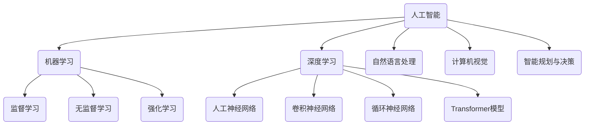

以下是根据您的要求撰写的技术博客文章《人工智能 原理与代码实例讲解》的正文部分：

# 人工智能 原理与代码实例讲解

## 1. 背景介绍

### 1.1 问题的由来

人工智能(Artificial Intelligence, AI)作为一门新兴的交叉学科,已经渗透到我们生活的方方面面。从语音助手到自动驾驶汽车,从推荐系统到医疗诊断,AI无处不在。然而,AI的发展也带来了一些挑战和困惑。人们常常对AI的工作原理有所疑惑,对AI系统的"黑箱"运作方式存有戒心。

### 1.2 研究现状

目前,AI领域的研究主要集中在以下几个方向:机器学习、深度学习、自然语言处理、计算机视觉、智能规划与决策等。其中,机器学习和深度学习是AI的核心驱动力,它们赋予了AI系统自主学习和优化的能力。但同时,这些复杂的算法和模型也使得AI系统变得不可解释和不透明。

### 1.3 研究意义

解释AI系统的内部机理,理解其工作原理对于提高人们对AI的信任度至关重要。本文旨在通过深入探讨AI的核心概念、算法原理、数学模型以及代码实现,为读者提供一个全面的AI技术解析,帮助读者理解AI"黑箱"的内在运作,从而更好地应用和发展AI技术。

### 1.4 本文结构

本文将从以下几个方面全面解析AI技术:

1. 核心概念与联系
2. 核心算法原理与具体操作步骤
3. 数学模型和公式详细讲解与案例分析
4. 项目实践:代码实例和详细解释说明
5. 实际应用场景
6. 工具和资源推荐
7. 总结:未来发展趋势与挑战
8. 附录:常见问题与解答

## 2. 核心概念与联系

人工智能(AI)是一个庞大的概念,它包含了多个子领域,如机器学习(ML)、深度学习(DL)、自然语言处理(NLP)、计算机视觉(CV)和智能规划与决策等。这些子领域相互关联、相辅相成,共同推动着AI技术的发展。

机器学习是AI的核心,它赋予了AI系统自主学习和优化的能力。机器学习可以分为监督学习、无监督学习和强化学习三大类。深度学习则是机器学习的一个分支,它基于人工神经网络,并发展出了卷积神经网络、循环神经网络和Transformer等先进模型,在图像、语音和自然语言处理等领域取得了突破性进展。

自然语言处理和计算机视觉则是AI的两大应用领域。自然语言处理致力于让计算机理解和生成人类语言,而计算机视觉则旨在使计算机能够识别和理解数字图像或视频。智能规划与决策则是AI系统的"大脑",它根据环境信息做出合理的决策和规划。

总的来说,这些AI核心概念相互关联、环环相扣,共同构建了AI技术的理论基础和应用框架。

## 3. 核心算法原理与具体操作步骤

### 3.1 算法原理概述

在AI领域,有许多经典的算法和模型,它们是AI系统的核心驱动力。以下是一些最具代表性的算法:

1. **决策树算法**: 决策树是一种监督学习算法,它根据训练数据构建一个决策树模型,用于对新的数据进行分类或回归。决策树算法易于理解和解释,是机器学习中最常用的算法之一。

2. **支持向量机(SVM)**: SVM是一种监督学习模型,通过寻找最优化分离超平面,实现对新数据的分类。SVM具有很好的泛化能力,在高维空间中表现出色。

3. **K-近邻(KNN)算法**: KNN是一种基于实例的学习算法,通过计算新数据与训练数据集中每个实例的距离,找到最近的K个邻居,并根据这些邻居的多数类别对新数据进行分类。

4. **K-均值聚类算法**: K-均值是一种无监督学习算法,通过迭代计算将数据集划分为K个簇,使得簇内数据点的相似度最大化,簇间数据点的相似度最小化。

5. **主成分分析(PCA)**: PCA是一种无监督学习算法,通过线性变换将高维数据投影到低维空间,实现降维和数据压缩。

6. **人工神经网络(ANN)**: ANN是深度学习的基础模型,它模仿生物神经网络的结构和工作原理,通过训练调整网络权重和偏置,实现对输入数据的映射和预测。

7. **卷积神经网络(CNN)**: CNN是一种专门用于处理图像数据的神经网络,它通过卷积、池化等操作提取图像特征,在计算机视觉领域取得了巨大成功。

8. **循环神经网络(RNN)**: RNN是一种用于处理序列数据的神经网络,它引入了循环连接,能够捕捉序列数据中的时序依赖关系,在自然语言处理等领域有广泛应用。

9. **生成对抗网络(GAN)**: GAN是一种无监督学习算法,由生成器和判别器两个神经网络组成。生成器负责生成逼真的数据,而判别器则判断生成数据的真伪,两者相互对抗、相互学习,最终达到生成高质量数据的目的。

这些算法各有特色,在不同的应用场景下发挥着重要作用。下面将详细介绍其中几种核心算法的原理和具体操作步骤。

### 3.2 算法步骤详解

#### 3.2.1 决策树算法

决策树算法的核心思想是通过递归地构建决策树,将训练数据集根据特征的条件进行划分,使得每个子集都尽可能地"纯",即属于同一个类别。决策树算法的基本步骤如下:

1. **选择最优特征**: 从所有特征中选择一个最优特征作为当前节点,通常采用信息增益或信息增益率等指标进行评估。
2. **生成子节点**: 根据所选特征的取值,生成子节点,将数据集划分到相应的子节点中。
3. **终止条件检测**: 对于每个子节点,检测是否满足终止条件(如节点数据"纯"或达到最大深度等)。如果满足,则将该子节点标记为叶节点。
4. **递归构建**: 对于每个非叶节点,重复执行步骤1~3,递归地构建决策树。

决策树算法的优点是模型易于理解和解释,缺点是容易过拟合,并且对数据的缺失值和异常值较为敏感。

#### 3.2.2 支持向量机(SVM)

支持向量机(SVM)的核心思想是在高维空间中寻找一个最优化分离超平面,使得不同类别的数据点能够被很好地分开,同时最大化分类边界的间隔。SVM算法的基本步骤如下:

1. **数据预处理**: 对训练数据进行归一化或标准化处理,使特征数据落在同一数量级。
2. **构建拉格朗日函数**: 根据训练数据和约束条件,构建拉格朗日函数,将原始优化问题转化为对偶问题。
3. **求解对偶问题**: 通过求解对偶问题,获得最优化的支持向量和对应的拉格朗日乘子。
4. **确定分离超平面**: 利用支持向量和拉格朗日乘子,确定最优分离超平面的参数。
5. **分类预测**: 对于新的数据点,根据其与分离超平面的相对位置,进行分类预测。

SVM算法的优点是泛化能力强,可以有效解决高维数据的分类问题。缺点是对于大规模数据集的训练速度较慢,并且对于非线性可分数据需要引入核函数,增加了模型复杂度。

#### 3.2.3 K-均值聚类算法

K-均值聚类算法是一种常用的无监督学习算法,它将数据集划分为K个簇,使得簇内数据点的相似度最大化,簇间数据点的相似度最小化。算法的基本步骤如下:

1. **初始化K个聚类中心**: 从数据集中随机选取K个数据点作为初始聚类中心。
2. **计算数据点到聚类中心的距离**: 对于每个数据点,计算它与每个聚类中心的距离,通常采用欧几里得距离或曼哈顿距离等。
3. **将数据点分配到最近的簇**: 将每个数据点分配到距离最近的簇中。
4. **更新聚类中心**: 对于每个簇,重新计算其所有数据点的均值作为新的聚类中心。
5. **判断是否收敛**: 如果聚类中心发生变化,则重复执行步骤2~4,直到聚类中心不再变化或达到最大迭代次数。

K-均值聚类算法的优点是简单、高效,适用于大规模数据集。缺点是对于非球形的簇或密度不均匀的数据,聚类效果较差,并且需要事先指定簇的数量K。

### 3.3 算法优缺点

每种算法都有其适用场景和局限性,下面总结一下上述三种算法的优缺点:

**决策树算法**:
- 优点:模型可解释性强、训练速度快、能够处理数值型和类别型特征。
- 缺点:容易过拟合、对缺失值和异常值敏感、对于某些数据集(如XOR问题)表现不佳。

**支持向量机(SVM)**:
- 优点:泛化能力强、适用于高维数据、只与支持向量相关,对大部分数据不敏感。
- 缺点:对参数调整敏感、对非线性问题需要引入核函数增加复杂度、训练速度较慢。

**K-均值聚类算法**:
- 优点:简单高效、可以处理大规模数据集、聚类结果直观易懂。
- 缺点:需要事先指定簇数K、对初始聚类中心敏感、不适用于非球形簇或密度不均匀的数据。

### 3.4 算法应用领域

这些算法在不同的领域都有广泛的应用:

- **决策树算法**:常用于信用评分、医疗诊断、金融风险评估等领域。
- **支持向量机(SVM)**:在文本分类、图像识别、生物信息学等领域有着广泛的应用。
- **K-均值聚类算法**:可用于客户细分、图像压缩、基因表达数据分析等领域。

总的来说,这些算法为AI系统提供了强大的分类、聚类和预测能力,是AI技术不可或缺的基础。

## 4. 数学模型和公式详细讲解与举例说明

### 4.1 数学模型构建

在AI领域,数学模型是描述和解释现象的重要工具。通过构建数学模型,我们可以更好地理解算法的内在机理,优化模型的性能,并推导出新的算法和理论。下面以线性回归为例,介绍如何构建一个简单的数学模型。

线性回归是一种常用的监督学习算法,它试图找到一条最佳拟合直线,使得数据点到直线的残差平方和最小。我们可以将线性回归模型表示为:

$$y = \theta_0 + \theta_1x$$

其中,y是目标变量,x是自变量,\theta_0和\theta_1是需要学习的模型参数。

为了找到最优的参数值,我们需要定义一个损失函数(代价函数),通常采用均方误差(MSE)作为损失函