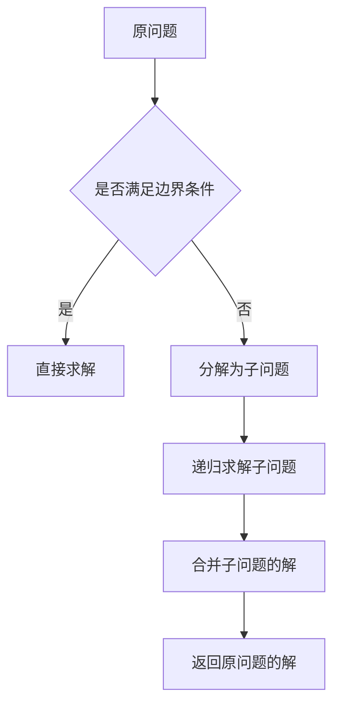

# 像数学家一样思考：递归原理

作者：禅与计算机程序设计艺术 / Zen and the Art of Computer Programming

## 1. 背景介绍
### 1.1 问题的由来
在计算机科学和数学领域,递归是一个非常重要且常见的概念。它指的是一个函数或过程在其定义或说明中直接或间接调用自身的情形。递归思想源于数学,被广泛应用于计算机科学领域,是算法设计中的一种基本方法。

### 1.2 研究现状
目前,递归已经被广泛应用于各种算法和数据结构中,如快速排序、归并排序、二分查找、分治算法、动态规划等。同时,递归也被用于解决许多经典的数学问题,如汉诺塔问题、斐波那契数列等。递归虽然强大,但也存在一些局限性,比如可能导致栈溢出、性能低下等问题。

### 1.3 研究意义
深入理解递归的原理和思想,对于提高编程能力、算法设计水平具有重要意义。通过学习递归,可以训练逻辑思维能力,培养将复杂问题分解为简单子问题的能力。此外,掌握递归还可以更好地理解和应用许多经典算法。

### 1.4 本文结构
本文将从以下几个方面来深入探讨递归原理:
- 核心概念与联系
- 核心算法原理与具体操作步骤
- 数学模型和公式详解
- 代码实例和详细解释
- 实际应用场景
- 工具和资源推荐
- 未来发展趋势与挑战
- 常见问题与解答

## 2. 核心概念与联系
递归的核心思想是"分而治之",即把一个复杂的问题分解为若干个相对简单的子问题,然后再将子问题进一步分解,直到子问题变得足够简单可以直接求解。之后,再将子问题的解逐层合并,最终得到原问题的解。

递归与迭代是两种不同的编程思路。迭代采用循环的方式,通过反复执行某段代码来实现。而递归则是一个函数在执行过程中调用自身,通过多次函数调用来实现。从数学上讲,递归是数学归纳法的体现。

递归需要满足三个条件:
1. 边界条件:递归必须有一个明确的结束条件,称为边界条件。当问题满足边界条件时,递归就不再执行。
2. 递归前进段:把原问题分解为子问题,使原问题规模减小。
3. 递归返回段:合并子问题的解,得到原问题的解。

下面是递归的执行过程示意图:



## 3. 核心算法原理 & 具体操作步骤
### 3.1 算法原理概述
递归算法的基本思路是把问题分解为规模更小的子问题,然后递归地解决这些子问题,最后合并子问题的解得到原问题的解。递归算法的关键是找到递归式,即如何将原问题分解为子问题。

### 3.2 算法步骤详解
以计算斐波那契数列为例,介绍递归算法的步骤:
1. 定义问题:定义函数 $F(n)$ 表示斐波那契数列的第 $n$ 项。斐波那契数列定义为 $F(0)=0, F(1)=1, F(n)=F(n-1)+F(n-2) (n≥2)$。
2. 寻找递归式:对于 $n≥2$ 的情况,可以将 $F(n)$ 分解为子问题 $F(n-1)$ 和 $F(n-2)$,即 $F(n)=F(n-1)+F(n-2)$。
3. 确定边界条件:根据斐波那契数列的定义,可以得到边界条件 $F(0)=0, F(1)=1$。
4. 实现递归函数:根据递归式和边界条件,实现计算斐波那契数的递归函数。
5. 调用递归函数:使用不同的参数调用递归函数,得到斐波那契数列的不同项。

### 3.3 算法优缺点
递归算法的优点:
- 递归使算法的实现更加简洁,可读性更好。
- 递归可以用于解决一些难以用循环解决的问题,如树的遍历、图的深度优先搜索等。

递归算法的缺点:
- 递归调用会占用大量的系统栈空间,可能导致栈溢出。
- 递归算法通常比迭代算法效率低,因为每次函数调用都需要开销。
- 递归代码可能比较难理解和调试。

### 3.4 算法应用领域
递归算法被广泛应用于以下领域:
- 数据结构:如二叉树、图的遍历和操作。
- 搜索算法:如深度优先搜索(DFS)、回溯算法等。
- 分治算法:如归并排序、快速排序等。
- 动态规划:如斐波那契数列、最长公共子序列等。
- 数学问题:如汉诺塔问题、八皇后问题等。

## 4. 数学模型和公式 & 详细讲解 & 举例说明
### 4.1 数学模型构建
以计算阶乘为例,构建递归的数学模型。阶乘定义为:
$$
n! = \begin{cases}
1, & n=0 \
n \times (n-1)!, & n>0
\end{cases}
$$

### 4.2 公式推导过程
根据阶乘的定义,可以得到递归式:
$$
F(n) = \begin{cases}
1, & n=0 \
n \times F(n-1), & n>0
\end{cases}
$$

其中 $F(n)$ 表示 $n$ 的阶乘。当 $n=0$ 时,阶乘为 1;当 $n>0$ 时,可以将问题分解为子问题 $F(n-1)$,再乘以 $n$。

### 4.3 案例分析与讲解
以计算 $5!$ 为例,展示递归的计算过程:
$$
\begin{aligned}
F(5) &= 5 \times F(4) \
     &= 5 \times 4 \times F(3) \
     &= 5 \times 4 \times 3 \times F(2) \
     &= 5 \times 4 \times 3 \times 2 \times F(1) \
     &= 5 \times 4 \times 3 \times 2 \times 1 \times F(0) \
     &= 5 \times 4 \times 3 \times 2 \times 1 \times 1 \
     &= 120
\end{aligned}
$$

### 4.4 常见问题解答
问:递归会导致栈溢出吗?
答:如果递归深度过大,每次函数调用都会在栈中保存一些数据,当栈空间不足时就会导致栈溢出。因此,在使用递归时需要注意控制递归深度,或者考虑使用尾递归优化。

问:如何将递归转换为非递归形式?
答:可以使用栈来模拟递归的过程。将递归调用时的参数和返回地址压入栈中,然后用循环代替递归调用。当满足边界条件时,从栈中取出数据,模拟递归返回的过程。

## 5. 项目实践：代码实例和详细解释说明
### 5.1 开发环境搭建
本文使用 Python 语言实现递归算法,读者需要安装 Python 开发环境。可以在官网下载并安装 Python 解释器。

### 5.2 源代码详细实现
以下是计算斐波那契数列的 Python 递归实现:

```python
def fibonacci(n):
    if n <= 1:
        return n
    else:
        return fibonacci(n-1) + fibonacci(n-2)

# 测试代码
print(fibonacci(0))  # 输出: 0
print(fibonacci(1))  # 输出: 1
print(fibonacci(2))  # 输出: 1
print(fibonacci(3))  # 输出: 2
print(fibonacci(4))  # 输出: 3
print(fibonacci(5))  # 输出: 5
```

### 5.3 代码解读与分析
- 第 1 行:定义了一个名为 `fibonacci` 的函数,它接受一个参数 `n`,表示要计算斐波那契数列的第几项。
- 第 2-3 行:判断 `n` 是否小于等于 1,如果是,则直接返回 `n`,这是递归的边界条件。
- 第 5 行:如果 `n` 大于 1,则递归调用 `fibonacci(n-1)` 和 `fibonacci(n-2)`,并将它们的结果相加,这体现了递归式 $F(n)=F(n-1)+F(n-2)$。
- 第 8-13 行:测试代码,分别计算斐波那契数列的前几项。

### 5.4 运行结果展示
运行上述代码,输出结果为:
```
0
1
1
2
3
5
```

可以看到,程序正确计算出了斐波那契数列的前几项。

## 6. 实际应用场景
递归在许多实际问题中都有应用,下面列举几个典型的应用场景:
- 树的遍历:递归可以用于遍历二叉树、多叉树等树形结构,如前序遍历、中序遍历、后序遍历等。
- 图的搜索:递归可以用于实现图的深度优先搜索(DFS),用于解决迷宫问题、查找路径等。
- 分治算法:递归是分治算法的核心,如归并排序、快速排序都采用了分治的思想,通过递归实现。
- 动态规划:许多动态规划问题都可以使用递归来实现,如斐波那契数列、最长公共子序列等。
- 数学问题:递归可以用于解决一些数学问题,如汉诺塔问题、八皇后问题、全排列问题等。

### 6.4 未来应用展望
随着计算机科学的发展,递归将在更多领域得到应用。例如,在人工智能领域,递归神经网络(RNN)就利用了递归的思想,在自然语言处理、语音识别等任务中取得了很好的效果。此外,函数式编程语言(如Haskell、Lisp)中也大量使用了递归,随着函数式编程的发展,递归的应用也会更加广泛。

## 7. 工具和资源推荐
### 7.1 学习资源推荐
- 《算法导论》(Introduction to Algorithms):经典的算法教材,深入讲解了递归、分治、动态规划等算法。
- 《计算机程序设计艺术》(The Art of Computer Programming):计算机科学领域的圣经,由高德纳(Donald Knuth)编写,其中也涉及了递归算法。
- Coursera 上的算法课程:如普林斯顿大学的 "Algorithms" 课程,斯坦福大学的 "Algorithms: Design and Analysis" 课程等。

### 7.2 开发工具推荐
- Python:Python 是一种简单易学的高级编程语言,支持递归,适合用于算法学习和实现。
- C/C++:C 和 C++ 是高性能的编程语言,也支持递归,适合实现对效率要求较高的算法。
- Java:Java 是一种面向对象的编程语言,也支持递归,在企业级开发中应用广泛。

### 7.3 相关论文推荐
- "On the Recursive Equations of Dynamic Programming":Richard Bellman 在 1952 年发表的论文,奠定了动态规划的基础,其中也涉及了递归。
- "Recursion and Iteration: An Empirical Comparison of Functional and Imperative Languages":比较了函数式语言和命令式语言中递归和迭代的性能差异。
- "Recursion in Programming Languages":综述了各种编程语言中的递归实现和优化技术。

### 7.4 其他资源推荐
- LeetCode:在线编程练习平台,包含了大量的算法题目,其中也有许多递归问题。
- GitHub:全球最大的代码托管平台,可以找到许多优秀的算法项目和源码实现。
- Stack Overflow:IT 技术问答网站,可以搜索和提问关于递归的问题。

## 8. 总结：未来发展趋势与挑战
### 8.1 研究成果总结
本文深入探