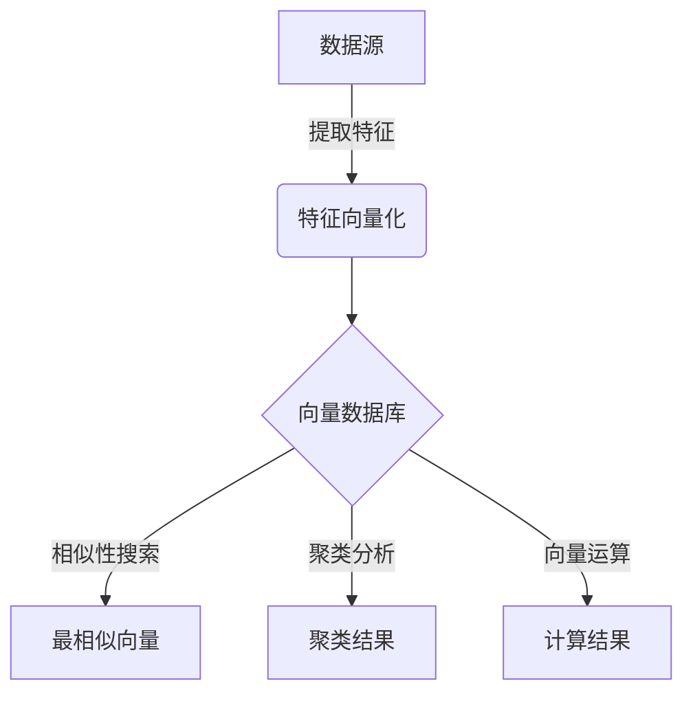
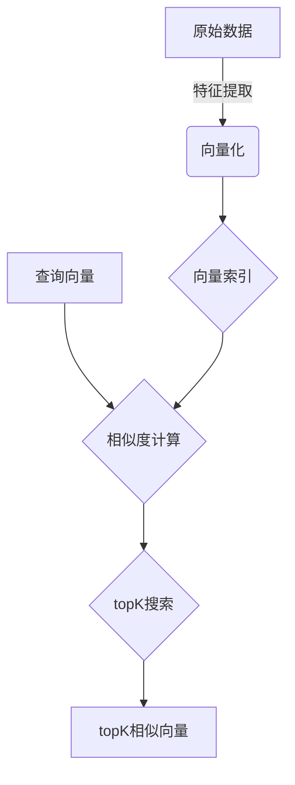

# 向量数据库基础：存储和检索多维数据的科学

## 1. 背景介绍

### 1.1 问题的由来

在当今的数字时代，数据已经成为许多领域的核心资产。随着物联网、社交媒体和多媒体应用的快速发展，海量的非结构化数据如图像、视频、音频和文本等不断产生。这些数据通常被表示为高维向量,传统的关系数据库和NoSQL数据库在存储和检索这些多维数据时面临着巨大的挑战。

传统数据库系统通常使用B树或哈希索引来支持精确匹配查询,但在处理相似性搜索等复杂查询时表现不佳。相比之下,向量数据库被设计用于高效地存储和检索这些高维向量数据,并支持相似性搜索、聚类分析等复杂操作。

### 1.2 研究现状

近年来,向量数据库的研究和应用受到了广泛关注。学术界和工业界都在积极探索新的存储模型、索引技术和查询优化算法,以提高向量数据的管理效率。一些知名的向量数据库系统包括Faiss、SPTAG、Milvus等,它们已被广泛应用于推荐系统、计算机视觉、自然语言处理等领域。

然而,现有的向量数据库系统仍然面临一些挑战,如高维数据的"维数灾难"问题、索引的可扩展性、查询性能优化等。因此,持续的研究和创新对于满足不断增长的数据需求至关重要。

### 1.3 研究意义

向量数据库的研究对于数据科学、人工智能和大数据分析等领域具有重要意义。高效的向量数据管理能够支持各种机器学习和深度学习应用,如图像识别、语音识别、自然语言处理等。此外,向量数据库还可以应用于基因组学、化学信息学等科学领域,促进科学发现和技术创新。

### 1.4 本文结构

本文将全面介绍向量数据库的基础知识,包括核心概念、算法原理、数学模型、实际应用等方面。我们将首先阐述向量数据库的核心概念和与传统数据库的关系,然后深入探讨核心算法原理和数学模型。接下来,我们将通过实际项目实践和代码示例,帮助读者更好地理解向量数据库的实现细节。最后,我们将分享实际应用场景、工具和资源推荐,并总结未来的发展趋势和挑战。

## 2. 核心概念与联系

向量数据库(Vector Database)是一种专门设计用于存储和检索高维向量数据的数据库系统。它与传统的关系数据库和NoSQL数据库有着明显的区别,但也存在一些共同点。

在向量数据库中,每个数据对象都被表示为一个高维向量,通常由数值型特征值组成。例如,一张图像可以被表示为一个由像素值组成的高维向量;一段文本可以被表示为一个由词嵌入向量组成的高维向量。

向量数据库的核心功能包括:

1. **向量存储**:高效地存储海量的高维向量数据。
2. **相似性搜索**:根据向量之间的相似度(如余弦相似度)快速检索最相似的向量。
3. **聚类分析**:对向量数据进行聚类,发现潜在的模式和结构。
4. **向量运算**:支持向量之间的基本运算,如向量相加、缩放等。

虽然向量数据库与传统数据库在数据模型和查询语言上存在差异,但它们在系统架构和基础组件(如存储引擎、查询优化器等)上有一些相似之处。此外,向量数据库也可以与传统数据库进行集成,形成混合解决方案。

下面是一个简单的Mermaid流程图,展示了向量数据库的核心概念:

在上图中,原始数据(如图像、文本等)首先被提取特征并向量化,然后存储到向量数据库中。向量数据库支持相似性搜索、聚类分析和向量运算等核心功能,为下游的机器学习和数据分析应用提供支持。

## 3. 核心算法原理 & 具体操作步骤

### 3.1 算法原理概述

向量数据库的核心算法主要包括向量索引、相似性搜索和聚类分析等方面。这些算法旨在高效地存储和检索海量的高维向量数据。

**向量索引**

由于高维向量数据的特殊性,传统的树形索引(如B+树)和哈希索引在处理向量数据时效率较低。因此,向量数据库采用了一些专门的索引技术,如局部敏感哈希(Locality Sensitive Hashing, LSH)、层次聚类树(Hierarchical Navigable Small World,HNSW)等。这些索引技术能够在保持较高精度的同时,大幅提高向量查询的效率。

**相似性搜索**

相似性搜索是向量数据库的核心功能之一。常用的相似性度量包括余弦相似度、欧几里得距离等。相似性搜索算法通常基于向量索引,快速找到与查询向量最相似的topK个向量。常见的算法有近邻搜索(Nearest Neighbor Search)、近似近邻搜索(Approximate Nearest Neighbor Search)等。

**聚类分析**

聚类分析旨在发现向量数据中的内在模式和结构。常用的聚类算法包括K-Means、DBSCAN、层次聚类等。向量数据库通常将聚类结果作为辅助索引,以加速相似性搜索和其他查询操作。

### 3.2 算法步骤详解

下面我们以相似性搜索为例,详细介绍核心算法的具体操作步骤:

1. **向量化**:原始数据(如图像、文本等)通过特征提取和embedding技术转换为高维向量。
2. **构建索引**:将向量数据批量导入向量数据库,并构建适当的索引(如LSH、HNSW等)。
3. **查询向量**:用户提供一个查询向量,表示感兴趣的目标。
4. **相似性计算**:计算查询向量与索引中每个向量的相似度(如余弦相似度)。
5. **topK搜索**:根据相似度得分,快速检索与查询向量最相似的topK个向量。
6. **结果输出**:将topK相似向量及其对应的原始数据返回给用户。

下面是一个相似性搜索算法的Mermaid流程图:

在上图中,原始数据首先被向量化,然后构建向量索引。当用户提供查询向量时,系统会计算查询向量与索引中所有向量的相似度,并快速检索出topK最相似的向量。

### 3.3 算法优缺点

向量数据库的核心算法具有以下优点:

- **高效性**:通过专门的索引技术和优化算法,能够快速检索相似向量。
- **可扩展性**:支持海量向量数据的存储和查询,具有良好的可扩展性。
- **多样性**:支持多种相似性度量和聚类算法,满足不同场景的需求。

同时,这些算法也存在一些缺点和挑战:

- **维数灾难**:在极高维度下,向量之间的相似度计算可能失去意义,导致检索精度下降。
- **索引开销**:构建和维护高维向量索引需要大量的计算和存储资源。
- **查询优化**:在复杂查询场景下,如何有效地组合和优化多个操作是一个挑战。

### 3.4 算法应用领域

向量数据库的核心算法广泛应用于以下领域:

- **推荐系统**:通过相似性搜索,为用户推荐相似的商品、内容等。
- **计算机视觉**:支持图像检索、图像分类、目标检测等视觉任务。
- **自然语言处理**:支持文本相似性计算、语义搜索、主题聚类等任务。
- **生物信息学**:用于基因序列相似性分析、蛋白质结构比对等。
- **多媒体检索**:支持音频、视频等多媒体数据的相似性搜索和内容分析。

## 4. 数学模型和公式 & 详细讲解 & 举例说明

### 4.1 数学模型构建

向量数据库中的核心数学模型是基于向量空间模型(Vector Space Model)。在这个模型中,每个数据对象都被表示为一个高维向量,向量的每个分量对应一个特征值。

设$\mathbf{x} = (x_1, x_2, \ldots, x_n)$是一个$n$维向量,其中$x_i$表示第$i$个特征值。我们定义向量空间$\mathcal{V}$为所有这样的向量的集合:

$$
\mathcal{V} = \{\mathbf{x} | \mathbf{x} = (x_1, x_2, \ldots, x_n), x_i \in \mathbb{R}\}
$$

在向量空间$\mathcal{V}$中,我们可以定义一些基本运算,如向量加法、数量乘法等:

$$
\begin{aligned}
\mathbf{x} + \mathbf{y} &= (x_1 + y_1, x_2 + y_2, \ldots, x_n + y_n) \
\alpha \mathbf{x} &= (\alpha x_1, \alpha x_2, \ldots, \alpha x_n)
\end{aligned}
$$

其中$\mathbf{x}$、$\mathbf{y} \in \mathcal{V}$,且$\alpha \in \mathbb{R}$。

### 4.2 公式推导过程

在向量数据库中,相似性搜索是一个核心操作。我们通常使用余弦相似度来衡量两个向量之间的相似程度。

设$\mathbf{x}$和$\mathbf{y}$是两个$n$维向量,它们的余弦相似度定义为:

$$
\text{sim}(\mathbf{x}, \mathbf{y}) = \cos(\theta) = \frac{\mathbf{x} \cdot \mathbf{y}}{\|\mathbf{x}\| \|\mathbf{y}\|}
$$

其中$\theta$是$\mathbf{x}$和$\mathbf{y}$之间的夹角,点乘$\mathbf{x} \cdot \mathbf{y}$定义为:

$$
\mathbf{x} \cdot \mathbf{y} = \sum_{i=1}^{n} x_i y_i
$$

向量的范数$\|\mathbf{x}\|$通常取$L_2$范数,即欧几里得范数:

$$
\|\mathbf{x}\| = \sqrt{\sum_{i=1}^{n} x_i^2}
$$

将上述公式代入余弦相似度的定义,我们可以得到:

$$
\text{sim}(\mathbf{x}, \mathbf{y}) = \frac{\sum_{i=1}^{n} x_i y_i}{\sqrt{\sum_{i=1}^{n} x_i^2} \sqrt{\sum_{i=1}^{n} y_i^2}}
$$

余弦相似度的取值范围为$[-1, 1]$,其中1表示两个向量完全相同,0表示两个向量正交,负值表示两个向量方向相反。

在实际应用中,我们通常将向量标准化(即将范数缩放为1),这样可以简化余弦相似度的计算:

$$
\text{sim}(\mathbf{x}, \mathbf{y}) = \mathbf{x} \cdot \mathbf{y}
$$

### 4.3 案例分析与讲解

为了更好地理解向量数据库中的数学模型和公式,我们来看一个具体的案例。假设我们有一个图像数据集,每个图像都被表示为一个512维的向量。我们希望找到与给定查询图像最相似的topK张图像。

首先,我们将图像数据集中的所有向量导入向量数据库,并构建适当的索引(如HNS