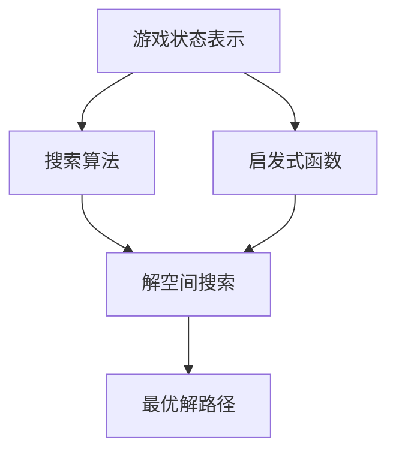

# 推箱子游戏的设计与实现

## 1. 背景介绍

### 1.1 问题的由来

推箱子游戏是一种经典的益智游戏,最早可以追溯到 1980 年代。游戏的目标是通过操控角色在有限的空间内将所有箱子推到指定位置。虽然规则简单,但是游戏的解题过程需要合理规划和精心设计,具有一定的挑战性。随着计算机技术的发展,推箱子游戏也逐渐被移植到各种平台上,成为了广受欢迎的休闲游戏之一。

### 1.2 研究现状

推箱子游戏的研究主要集中在以下几个方面:

1. **算法设计**: 如何高效地求解推箱子游戏是一个经典的人工智能问题,涉及到图搜索、启发式搜索等算法。研究人员提出了多种启发式算法来解决这一问题,如 A* 算法、IDA* 算法等。

2. **游戏设计**: 推箱子游戏的关卡设计是一个值得探讨的话题。如何设计出具有适当难度和趣味性的关卡,是游戏设计师需要考虑的问题。

3. **人机交互**: 推箱子游戏的操作界面和交互方式对游戏体验有很大影响。研究人员探讨了各种输入设备和交互模式在推箱子游戏中的应用。

4. **游戏引擎**: 推箱子游戏的实现需要一个稳定高效的游戏引擎。研究人员探索了各种游戏引擎框架在推箱子游戏中的应用。

### 1.3 研究意义

推箱子游戏作为一个经典的益智游戏,对于人工智能、算法设计、游戏设计等领域都有重要的研究意义:

1. **算法研究**: 推箱子游戏是一个典型的组合优化问题,可以作为算法研究的测试平台,验证和比较不同算法的性能表现。

2. **游戏设计**: 研究推箱子游戏的关卡设计原理,可以为其他益智游戏的设计提供借鉴和启发。

3. **人机交互**: 推箱子游戏的交互模式研究,可以为其他游戏和应用程序的交互设计提供参考。

4. **教学应用**: 推箱子游戏可以作为一个简单但富有挑战性的案例,用于教授算法设计、人工智能等相关课程。

### 1.4 本文结构

本文将全面介绍推箱子游戏的设计与实现,包括以下几个方面:

1. 核心概念与联系
2. 核心算法原理与具体操作步骤
3. 数学模型和公式详细讲解与举例说明
4. 项目实践:代码实例和详细解释说明
5. 实际应用场景
6. 工具和资源推荐
7. 总结:未来发展趋势与挑战
8. 附录:常见问题与解答

## 2. 核心概念与联系

推箱子游戏涉及到多个核心概念,包括游戏状态表示、搜索算法、启发式函数等。这些概念之间存在着密切的联系,共同构建了推箱子游戏的理论基础。

1. **游戏状态表示**:推箱子游戏的每个状态都可以用一个数据结构来表示,包括玩家位置、箱子位置、目标位置等信息。合理的状态表示对于后续的搜索算法至关重要。

2. **搜索算法**:推箱子游戏的求解过程可以看作是在一个解空间中进行搜索,找到从初始状态到目标状态的最优路径。常用的搜索算法包括 BFS、DFS、A* 算法等。

3. **启发式函数**:在使用 A* 算法等启发式搜索算法时,需要设计一个合适的启发式函数来估计当前状态到目标状态的剩余代价。启发式函数的设计直接影响了算法的搜索效率。

4. **解空间搜索**:根据游戏状态表示和搜索算法,可以在解空间中进行有效的搜索,找到从初始状态到目标状态的最优解路径。

5. **最优解路径**:搜索算法的输出是从初始状态到目标状态的最优解路径,包括一系列需要执行的操作步骤。

上述核心概念相互关联、相互影响,共同构建了推箱子游戏的理论框架。游戏状态表示为搜索算法提供了输入,搜索算法根据启发式函数在解空间中进行搜索,最终输出最优解路径。

## 3. 核心算法原理与具体操作步骤

### 3.1 算法原理概述

推箱子游戏的求解算法主要基于图搜索和启发式搜索的原理。具体来说,我们可以将游戏状态看作图中的节点,每次移动玩家或箱子都会导致状态的转移,即图中的边。我们的目标是找到从初始状态到目标状态的最短路径。

常用的求解算法包括:

1. **BFS(广度优先搜索)**:从初始状态开始,按照层次顺序逐层扩展,保证找到的解路径是最短的。但是由于需要存储所有扩展过的状态,空间复杂度较高。

2. **DFS(深度优先搜索)**:从初始状态开始,朝一个方向深入搜索,直到无路可走再回溯。空间复杂度较低,但无法保证找到最优解。

3. **A* 算法**:A* 算法是一种启发式搜索算法,通过估价函数(启发式函数)来估计当前状态到目标状态的剩余代价,从而引导搜索朝着最优解方向前进。A* 算法可以找到最优解,且比 BFS 算法更加高效。

4. **IDA* 算法**:IDA* 算法是 A* 算法的一种变体,采用了迭代加深的策略,可以在有限的内存空间内求解问题。IDA* 算法在内存占用方面更加高效,但搜索效率略低于 A* 算法。

### 3.2 算法步骤详解

以下以 A* 算法为例,详细介绍推箱子游戏求解的具体步骤:

1. **状态表示**:将游戏状态用一个数据结构表示,包括玩家位置、箱子位置、目标位置等信息。

2. **初始化开放列表和闭合列表**:开放列表用于存储待扩展的状态节点,闭合列表用于存储已经扩展过的状态节点。初始时,将初始状态加入开放列表。

3. **设计启发式函数**:设计一个合适的启发式函数 $h(n)$,用于估计当前状态 $n$ 到目标状态的剩余代价。常用的启发式函数包括:
   - 曼哈顿距离启发式函数:计算所有箱子到最近目标位置的曼哈顿距离之和。
   - 置换距离启发式函数:计算所有箱子到正确位置需要移动的最小步数之和。

4. **计算估价函数值**:对于每个状态节点 $n$,计算其估价函数值 $f(n) = g(n) + h(n)$,其中 $g(n)$ 是从初始状态到当前状态的实际代价,即已经移动的步数。

5. **选择最小估价函数值的节点进行扩展**:从开放列表中选择估价函数值 $f(n)$ 最小的节点进行扩展,生成其所有合法的后继状态节点。

6. **更新开放列表和闭合列表**:对于每个新生成的后继状态节点,如果它不在开放列表和闭合列表中,则将其加入开放列表;如果它已在开放列表中,但新的路径代价更小,则更新其父节点;如果它已在闭合列表中,则忽略。

7. **重复步骤 5 和步骤 6**,直到找到目标状态或开放列表为空(无解)。

8. **路径回溯**:如果找到了目标状态,则从目标状态出发,沿着父节点链接回溯到初始状态,即可得到最优解路径。

上述算法步骤保证了 A* 算法的正确性和最优性。通过合理设计启发式函数,可以提高算法的搜索效率。

### 3.3 算法优缺点

A* 算法作为推箱子游戏求解的主要算法,具有以下优缺点:

**优点**:

1. **最优性**:A* 算法可以保证找到从初始状态到目标状态的最优解路径。

2. **高效性**:相比于盲目搜索算法(如 BFS、DFS),A* 算法通过启发式函数的引导,可以更加高效地搜索解空间,减少不必要的状态扩展。

3. **通用性**:A* 算法可以应用于各种图搜索问题,不仅限于推箱子游戏。

**缺点**:

1. **空间复杂度**:A* 算法需要存储所有扩展过的状态节点,因此空间复杂度较高,对于大型问题可能会耗尽内存。

2. **启发式函数设计**:合适的启发式函数对于算法的搜索效率至关重要,但设计一个高质量的启发式函数并不容易。

3. **局部最优陷阱**:在某些情况下,A* 算法可能会陷入局部最优解,无法找到全局最优解。

为了克服 A* 算法的缺点,研究人员提出了多种改进算法,如 IDA* 算法、内存受限 A* 算法等,旨在降低空间复杂度或避免局部最优陷阱。

### 3.4 算法应用领域

推箱子游戏求解算法不仅可以应用于游戏本身,还可以推广到其他领域的组合优化问题。以下是一些典型的应用领域:

1. **机器人路径规划**:在机器人导航中,需要为机器人规划一条从起点到终点的最优路径,可以将其建模为一个推箱子游戏问题,利用相关算法求解。

2. **物流配送**:在物流配送中,需要合理安排车辆的行驶路线,以实现最小化运输成本。这可以看作是一个多个"箱子"(货物)需要被推到多个"目标位置"(目的地)的推箱子游戏问题。

3. **生产调度**:在生产车间中,需要合理安排机器的加工顺序,以最大化产出或最小化等待时间。这可以建模为一个推箱子游戏问题,将机器视为"箱子",将加工位置视为"目标位置"。

4. **组合优化**:推箱子游戏本质上是一个组合优化问题,许多其他组合优化问题(如旅行商问题、装箱问题等)也可以借鉴相关算法进行求解。

总的来说,推箱子游戏求解算法具有广泛的应用前景,为解决实际生活中的各种组合优化问题提供了有效的方法和思路。

## 4. 数学模型和公式详细讲解与举例说明

### 4.1 数学模型构建

推箱子游戏可以用一个加权有向图 $G = (V, E)$ 来建模,其中:

- $V$ 表示所有可能的游戏状态,每个状态 $v \in V$ 包含玩家位置、箱子位置等信息。
- $E$ 表示状态之间的转移关系,如果从状态 $u$ 可以通过一步操作(移动玩家或推箱子)转移到状态 $v$,则 $(u, v) \in E$。
- 每条边 $(u, v) \in E$ 都有一个权重 $w(u, v)$,表示从状态 $u$ 转移到状态 $v$ 的代价,通常设为 1。

我们的目标是找到从初始状态 $s$ 到目标状态 $t$ 的最短路径,即最小化路径代价:

$$
\min \sum_{(u, v) \in \pi} w(u, v)
$$

其中 $\pi$ 是从 $s$ 到 $t$ 的一条路径,路径代价是沿路径上所有边权重之和。

### 4.2 公式推导过