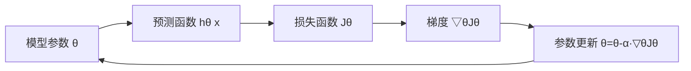

# 梯度下降 (Gradient Descent)

## 1. 背景介绍
### 1.1 问题的由来
在机器学习和深度学习领域,优化算法是模型训练中不可或缺的一部分。而在众多优化算法中,梯度下降(Gradient Descent)无疑是使用最广泛、最经典的算法之一。它通过不断迭代,调整模型参数,使得损失函数最小化,从而找到最优解。

### 1.2 研究现状
梯度下降算法自从1847年就被提出,在优化领域已经有了170多年的发展历史。近年来,随着深度学习的蓬勃发展,梯度下降及其变种算法得到了广泛应用。目前业界主流的深度学习框架如TensorFlow、PyTorch等都内置了多种梯度下降优化器,可见其重要性。

### 1.3 研究意义
深入理解梯度下降算法的原理和实现,对于从事机器学习和深度学习研究的学者和工程师来说至关重要。只有真正掌握了梯度下降的精髓,才能设计出更高效的优化算法,训练出性能更优的模型。此外,梯度下降思想也启发了很多其他领域的优化问题求解。

### 1.4 本文结构
本文将从以下几方面对梯度下降展开详细讨论:
- 核心概念与联系
- 核心算法原理与具体步骤
- 数学模型和公式推导及案例分析
- 代码实践与详解
- 实际应用场景
- 工具和资源推荐
- 总结与展望

## 2. 核心概念与联系

在讨论梯度下降之前,我们先明确几个核心概念:
- 模型参数(Parameters):机器学习模型中需要学习的参数,通常用 $\theta$ 表示。
- 损失函数(Loss Function):用来衡量模型预测值与真实值之间差异的函数,通常记为 $J(\theta)$。
- 梯度(Gradient):损失函数对参数求偏导后的向量,记为 $\nabla_{\theta} J(\theta)$,表示损失函数在当前点处沿着参数空间每个维度的变化方向。
- 学习率(Learning Rate):每次参数更新的步长,通常用 $\alpha$ 表示。是一个超参数。

它们之间的关系可以用下图表示:



可以看到,模型参数经过预测函数输出预测值,然后通过损失函数计算损失,接着求梯度,并用梯度乘以学习率更新参数,进入下一轮迭代,直到满足一定条件为止。

## 3. 核心算法原理 & 具体操作步骤
### 3.1 算法原理概述
梯度下降的基本思想非常简单直观:
沿着损失函数梯度的反方向,不断调整参数,使得损失函数的值持续下降,直到达到(局部)最小值,此时的参数就是最优解。

用数学语言描述就是:
$$
\theta = \theta - \alpha \cdot \nabla_{\theta} J(\theta)
$$

其中 $\alpha$ 是学习率。这个式子表示,每次参数更新,都沿着梯度反方向走一小步,步长由学习率控制。不断重复这个过程,直到达到停止条件。

### 3.2 算法步骤详解
梯度下降的具体步骤如下:
1. 随机初始化参数 $\theta$
2. 重复直到收敛{

    a. 计算损失函数关于参数的梯度:
    $$\nabla_{\theta} J(\theta) = \frac{\partial J(\theta)}{\partial \theta}$$

    b. 更新参数:
    $$\theta = \theta - \alpha \cdot \nabla_{\theta} J(\theta)$$
    }

3. 返回学习到的参数 $\theta$

其中第2步是算法的核心,通过不断迭代优化参数。收敛的判断一般有两种方式:
- 当损失函数下降到一定阈值以下
- 当参数更新量小于一定阈值

### 3.3 算法优缺点
梯度下降算法的主要优点有:
- 原理简单,易于实现
- 对于凸函数,可以保证全局最优
- 泛化能力强,适用于各种模型和问题

缺点主要有:
- 对于非凸函数,容易陷入局部最优
- 每次迭代需要遍历整个训练集,当样本数很大时,训练非常慢
- 对参数的初始值和学习率比较敏感

### 3.4 算法应用领域
梯度下降在机器学习和深度学习中应用非常广泛,几乎所有的参数优化问题都会用到它,比如:
- 线性回归
- Logistic回归
- 支持向量机
- 神经网络
- 推荐系统
- 计算广告

除了机器学习,梯度下降思想也被用于求解其他领域的优化问题,如运筹优化、信号处理等。

## 4. 数学模型和公式 & 详细讲解 & 举例说明
### 4.1 数学模型构建
以线性回归为例,我们来看看梯度下降是如何应用的。

假设有一个训练集:
$$\{(x^{(1)}, y^{(1)}), (x^{(2)}, y^{(2)}), ..., (x^{(m)}, y^{(m)})\}$$

其中 $x^{(i)} \in \mathbb{R}^n$ 为第i个样本的特征向量,$y^{(i)} \in \mathbb{R}$ 为对应的标签。

线性回归的目标是学习一个线性模型:
$$h_{\theta}(x) = \theta_0 + \theta_1 x_1 + ... + \theta_n x_n$$

使得预测值 $h_{\theta}(x)$ 与真实值y尽可能接近。

为了衡量这种接近程度,引入损失函数,常用的是均方误差(MSE):

$$J(\theta) = \frac{1}{2m} \sum_{i=1}^m (h_{\theta}(x^{(i)}) - y^{(i)})^2$$

目标就是最小化这个损失函数。

### 4.2 公式推导过程
根据梯度下降算法,参数更新公式为:
$$\theta_j = \theta_j - \alpha \cdot \frac{\partial J(\theta)}{\partial \theta_j}, j=0,1,...,n$$

关键是求出梯度 $\frac{\partial J(\theta)}{\partial \theta_j}$。

将 $J(\theta)$ 展开:
$$
\begin{aligned}
J(\theta) &= \frac{1}{2m} \sum_{i=1}^m (h_{\theta}(x^{(i)}) - y^{(i)})^2 \\
&= \frac{1}{2m} \sum_{i=1}^m (\theta^T x^{(i)} - y^{(i)})^2
\end{aligned}
$$

对 $\theta_j$ 求偏导:
$$
\begin{aligned}
\frac{\partial J(\theta)}{\partial \theta_j} &= \frac{1}{m} \sum_{i=1}^m (\theta^T x^{(i)} - y^{(i)}) \cdot x_j^{(i)} \\
&= \frac{1}{m} \sum_{i=1}^m (h_{\theta}(x^{(i)}) - y^{(i)}) \cdot x_j^{(i)}
\end{aligned}
$$

代入参数更新公式即可:
$$\theta_j = \theta_j - \alpha \cdot \frac{1}{m} \sum_{i=1}^m (h_{\theta}(x^{(i)}) - y^{(i)}) \cdot x_j^{(i)}$$

### 4.3 案例分析与讲解
我们用一个简单的一元线性回归例子来说明梯度下降的过程。

假设训练集为:
$$(x^{(1)}, y^{(1)}) = (1, 1)$$
$$(x^{(2)}, y^{(2)}) = (2, 2)$$
$$(x^{(3)}, y^{(3)}) = (3, 3)$$

学习一个模型: $h_{\theta}(x) = \theta_0 + \theta_1 x$

参数初始化为 $\theta_0=0, \theta_1=0$,学习率 $\alpha=0.01$。

根据前面推导的公式,有:
$$
\begin{aligned}
\theta_0 &= \theta_0 - \alpha \cdot \frac{1}{3} \sum_{i=1}^3 (h_{\theta}(x^{(i)}) - y^{(i)}) \\
\theta_1 &= \theta_1 - \alpha \cdot \frac{1}{3} \sum_{i=1}^3 (h_{\theta}(x^{(i)}) - y^{(i)}) \cdot x^{(i)}
\end{aligned}
$$

代入数据,可以得到:
$$
\begin{aligned}
\theta_0 &= 0 - 0.01 \cdot \frac{1}{3} [(0+0 \cdot 1-1) + (0+0 \cdot 2-2) + (0+0 \cdot 3-3)] \\
&= 0 - 0.01 \cdot (-2) = 0.02 \\
\theta_1 &= 0 - 0.01 \cdot \frac{1}{3} [(0+0 \cdot 1-1) \cdot 1 + (0+0 \cdot 2-2) \cdot 2 + (0+0 \cdot 3-3) \cdot 3] \\
&= 0 - 0.01 \cdot (-14/3) \approx 0.0467
\end{aligned}
$$

即第一轮迭代后,参数更新为 $\theta_0=0.02, \theta_1=0.0467$。

如此反复迭代,最终可以学到最优参数。

### 4.4 常见问题解答
问:为什么梯度下降方向是损失函数下降最快的方向?

答:这是因为梯度的方向是函数值变化最大的方向。具体来说,假设损失函数为 $J(\theta)$,在点 $\theta$ 处,沿着单位向量 $u$ 方向移动距离 $h$,函数值的变化量为:

$$\Delta J \approx u^T \nabla J(\theta) \cdot h$$

当 $h$ 足够小时,这个近似是准确的。要使得函数值下降最快,就是要使 $\Delta J$ 取到最小值。在 $\lVert u \rVert=1$ 的约束下,由Cauchy-Schwarz不等式可知,当 $u$ 与梯度 $\nabla J(\theta)$ 反向时,$\Delta J$ 取最小值。所以梯度的反方向就是损失函数下降最快的方向。

问:为什么需要设置学习率?学习率过大或过小会怎样?

答:学习率 $\alpha$ 控制了每次参数更新的幅度。$\alpha$ 设置得过小,收敛速度会很慢;而设置得过大,可能会越过最优点,导致无法收敛。

直观地说,可以把梯度下降想象成下山的过程,目标是下到山谷的最低点。如果每一步迈得太小,就要走很久;如果迈得太大,就可能一步跨过山谷,到了另一边的山坡上。

所以选择一个合适的学习率非常关键。常用的做法是从一个较大的学习率开始,随着迭代次数增加逐渐减小学习率,这样可以兼顾收敛速度和效果。

## 5. 项目实践：代码实例和详细解释说明
### 5.1 开发环境搭建
本节我们用Python和NumPy库来实现梯度下降算法,并用其解决线性回归问题。

首先导入需要用到的库:
```python
import numpy as np
import matplotlib.pyplot as plt
```

### 5.2 源代码详细实现
下面是梯度下降算法的Python实现:

```python
def gradient_descent(X, y, theta, alpha, num_iters):
    """
    梯度下降函数

    参数:
        X: 输入特征矩阵,shape为(m,n)
        y: 输出标签向量,shape为(m,)
        theta: 参数向量,shape为(n,)
        alpha: 学习率
        num_iters: 迭代次数

    返回:
        theta: 学习到的参数
        J_history: 每次迭代的损失函数值
    """
    m = len(y)
    J_history = np.zeros(num_iters)

    for i in range(num_iters):
        h = X.dot(theta)
        errors = h - y
        gradient = X.T.dot(errors) / m
        theta -=