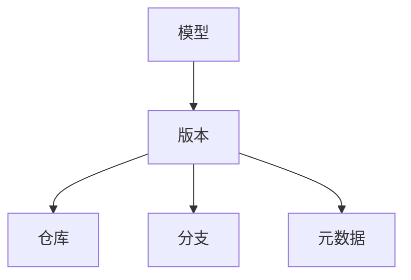

# 模型版本控制原理与代码实战案例讲解

关键词：模型版本控制、机器学习、MLOps、Git、DVC、MLflow、实战案例

## 1. 背景介绍
### 1.1  问题的由来
随着机器学习和深度学习的快速发展,越来越多的模型被应用到生产环境中。然而,模型的开发、训练、部署是一个复杂的过程,涉及到数据处理、特征工程、模型训练、超参数调优等多个环节。传统的代码版本控制工具如Git无法很好地管理机器学习模型的版本迭代。因此,模型版本控制成为了机器学习工程化落地的一个关键问题。
### 1.2  研究现状
目前,业界已经出现了一些专门针对机器学习模型版本控制的工具和平台,如DVC、MLflow、Pachyderm等。这些工具在一定程度上解决了模型版本管理的问题,但在可用性、性能、功能等方面还有待进一步提升。同时,模型版本控制的最佳实践和规范还在不断探索完善中。
### 1.3  研究意义
系统地研究模型版本控制的原理和方法,总结相关工具的使用经验,对于提升机器学习项目的工程化水平,保证模型开发和部署的质量具有重要意义。同时,也为MLOps体系的建设提供了重要的理论和实践基础。
### 1.4  本文结构
本文将首先介绍模型版本控制的核心概念和内在联系,然后重点阐述模型版本控制的关键技术原理和算法步骤。接着,我们将建立数学模型,推导相关公式,并结合具体案例进行分析讲解。在实践部分,我们将手把手带领大家基于DVC和MLflow搭建模型版本控制系统,给出详细的代码实现和讲解。最后,我们总结了模型版本控制的发展趋势和面临的挑战,并提出了未来的研究方向。

## 2. 核心概念与联系
模型版本控制的核心概念包括:
- 模型:机器学习算法训练出的参数集合,用于对新数据进行预测。
- 版本:模型演进过程中的一个快照,包含了当前模型的参数、超参数、数据集等信息。
- 仓库:存储模型版本的容器,类似于代码仓库。
- 分支:模型的变体,通常对应于不同的训练数据、算法、超参数等。
- 元数据:描述模型版本的各种属性信息,如训练时间、评估指标、环境依赖等。

这些概念之间的内在联系如下:


模型通过不断迭代演进,生成一系列版本。这些版本被统一管理在仓库中,并通过分支来组织不同的变体。每个版本都有对应的元数据来描述其属性和来源。

## 3. 核心算法原理 & 具体操作步骤
### 3.1  算法原理概述
模型版本控制的核心算法主要包括:
1. 数据版本控制:追踪数据集的版本变化,保证模型训练的可复现性。
2. 模型快照:将模型的参数、超参数、环境依赖等打包成一个不可变的版本。
3. 版本差异比较:识别两个模型版本之间的差异,如参数变化、数据变化等。
4. 版本回滚:将模型恢复到之前的某个版本,用于错误修复或效果对比。
### 3.2  算法步骤详解
以DVC为例,其模型版本控制的具体步骤如下:
1. 初始化DVC仓库:在项目目录下运行`dvc init`命令。
2. 配置数据集和模型文件:在`dvc.yaml`中定义数据集和模型的路径。
3. 提交数据集版本:运行`dvc add`将数据集纳入版本控制。
4. 训练模型:运行训练脚本,生成新的模型版本。
5. 提交模型版本:运行`dvc push`将模型版本上传到远程仓库。
6. 切换模型版本:运行`dvc checkout`切换到指定的模型版本。
### 3.3  算法优缺点
DVC的优点在于:
- 数据集和模型版本可以独立管理,解耦合。
- 支持大文件存储,不受Git限制。
- 与Git集成,可以同步管理代码和模型。

但其缺点是:
- 引入了额外的元数据文件,增加了复杂度。
- 对数据集的修改难以追踪,缺乏细粒度的版本控制。
### 3.4  算法应用领域
模型版本控制算法主要应用于以下领域:
- 机器学习平台:为用户提供模型管理和部署的功能。
- 科学计算:追踪和复现实验过程,保证结果的可重复性。
- 自动化 MLOps:实现模型开发、训练、测试、部署的自动化流水线。

## 4. 数学模型和公式 & 详细讲解 & 举例说明
### 4.1  数学模型构建
我们可以用一个三元组 $(D, M, H)$ 来表示一个机器学习模型,其中:
- $D$:训练数据集
- $M$:模型结构和参数
- $H$:超参数配置

一个模型版本 $V_i$ 就对应于某个时间点 $t_i$ 的三元组快照:

$$V_i = (D_i, M_i, H_i) | t_i$$

其中,$D_i$,$M_i$,$H_i$ 分别表示第 $i$ 个版本的数据集、模型和超参数。
### 4.2  公式推导过程
假设我们有两个模型版本 $V_1$ 和 $V_2$,它们之间的差异可以用集合的差运算来表示:

$$\Delta(V_1,V_2) = (D_1 \oplus D_2, M_1 \oplus M_2, H_1 \oplus H_2)$$

其中 $\oplus$ 表示集合的对称差,即:

$$A \oplus B = (A - B) \cup (B - A)$$

$\Delta(V_1,V_2)$ 的结果是一个新的三元组,表示两个版本在数据、模型、超参数上的变化。
### 4.3  案例分析与讲解
我们以一个图像分类模型为例,假设它有两个版本:
- $V_1$:使用 5000 张图像训练,模型为 ResNet-50,学习率为 0.01
- $V_2$:使用 10000 张图像训练,模型改为 ResNet-101,学习率调整为 0.001

则它们之间的差异为:

$$\Delta(V_1,V_2) = (\{x | x \in D_2 - D_1\}, \{ResNet101\}, \{0.001\})$$

即数据集新增了 5000 张图像,模型结构升级为 ResNet-101,学习率降低为 0.001。
### 4.4  常见问题解答
- 问:为什么要做模型版本控制?
- 答:模型版本控制可以帮助我们追踪模型的演进过程,方便问题定位和效果对比,提高了模型开发的效率和可复现性。

- 问:模型版本控制与代码版本控制有何不同?
- 答:模型版本控制需要管理数据集、参数、依赖等额外的信息,而且模型文件通常很大,不适合直接存储在代码仓库中。因此需要专门的工具和流程来实现。

## 5. 项目实践：代码实例和详细解释说明
### 5.1  开发环境搭建
首先,我们需要安装 DVC 和 MLflow:

```bash
pip install dvc mlflow
```

然后初始化 DVC 仓库:

```bash
cd project_dir
dvc init
```

### 5.2  源代码详细实现
接下来,我们创建一个 Python 脚本 `train.py` 来训练模型:

```python
import mlflow
import mlflow.sklearn
from sklearn.datasets import load_iris
from sklearn.model_selection import train_test_split
from sklearn.ensemble import RandomForestClassifier

def main():
    iris = load_iris()
    X, y = iris.data, iris.target
    X_train, X_test, y_train, y_test = train_test_split(X, y, test_size=0.2, random_state=42)

    n_estimators = 10
    max_depth = 5

    with mlflow.start_run():
        clf = RandomForestClassifier(n_estimators=n_estimators, max_depth=max_depth)
        clf.fit(X_train, y_train)

        mlflow.log_param("n_estimators", n_estimators)
        mlflow.log_param("max_depth", max_depth)
        mlflow.sklearn.log_model(clf, "model")

        accuracy = clf.score(X_test, y_test)
        print(f"Accuracy: {accuracy}")
        mlflow.log_metric("accuracy", accuracy)

if __name__ == "__main__":
    main()
```

这个脚本会训练一个随机森林分类器,并用 MLflow 记录模型的参数、指标和构件。

然后我们在 `dvc.yaml` 中定义管道:

```yaml
stages:
  train:
    cmd: python train.py
    deps:
    - train.py
    params:
    - n_estimators
    - max_depth
    outs:
    - model
```

这里定义了一个名为 `train` 的阶段,指定了训练命令、依赖文件、参数和输出模型。

### 5.3  代码解读与分析
在上面的代码中,有几个关键点:
1. 我们用 `mlflow.start_run()` 创建了一个新的实验记录。
2. 在训练循环中,我们用 `mlflow.log_param()` 记录了模型的超参数。
3. 训练完成后,我们用 `mlflow.sklearn.log_model()` 保存了模型构件。
4. 最后,我们用 `mlflow.log_metric()` 记录了模型的评估指标。

这些记录的信息会被自动保存到 MLflow 的后台存储中,我们可以通过 Web UI 来查看和比较不同的模型版本。

同时,`dvc.yaml` 中的定义会被 DVC 用来管理输入数据和输出模型的版本,我们可以用 `dvc repro` 命令来自动执行管道,并生成新的模型版本。

### 5.4  运行结果展示
首先,让我们运行训练脚本:

```bash
dvc repro
```

这会在 `model` 目录下生成一个新的模型文件。

然后,我们可以启动 MLflow UI 来查看实验记录:

```bash
mlflow ui
```

访问 `http://localhost:5000`,可以看到不同的模型版本和对应的参数、指标:


点击每个版本的详情,还可以看到模型的构件和日志等信息。

最后,我们可以用 `dvc metrics diff` 来比较不同版本之间的差异:

```bash
dvc metrics diff
```

输出结果类似:

```
Path         Metric    Head     v1.0  Change
model.pkl    accuracy  0.9333   0.9   0.0333
```

这表示当前版本的模型准确率比 v1.0 版本高了 0.0333。

## 6. 实际应用场景
模型版本控制在实际项目中有广泛的应用,例如:
- 在线广告系统:需要不断优化和更新点击率预估模型,并快速上线和回滚。
- 智能语音助手:要同时维护多个语言和地区的语音识别模型,并定期更新。
- 自动驾驶决策:需要管理不同传感器和场景下的决策模型,并控制模型升级的风险。
### 6.4  未来应用展望
随着 AI 技术的发展,模型版本控制将在更多领域得到应用,例如:
- 强化学习:管理面向不同任务和环境的策略模型。
- 联邦学习:追踪分散在不同设备上的本地模型的版本和聚合过程。
- 在线学习:控制模型在线更新和增量学习的过程,避免灾难性遗忘。

同时,模型版本控制也将与数据版本控制、流水线自动化等技术进一步融合,形成完整的 MLOps 解决方案。

## 7. 工具和资源推荐
### 7.1  学习资源推荐
- [数据版本控制工具 DVC 教程](https://dvc.org/doc/start)
- [机器学习实验管理工具 MLflow 教程](https://mlflow.org/docs/latest/tutorials-and-examples/tutorial.html)
- [吴恩达的 Machine Learning Engineering