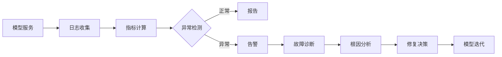

# 模型监控与故障诊断原理与代码实战案例讲解

关键词：模型监控、故障诊断、机器学习、深度学习、异常检测、日志分析、可视化、系统架构

## 1. 背景介绍
### 1.1  问题的由来
随着机器学习和深度学习模型在各行各业的广泛应用,模型的稳定性和可靠性变得越来越重要。然而,模型在实际生产环境中经常会遇到各种问题,如数据漂移、概念漂移、过拟合、欠拟合等,导致模型性能下降甚至完全失效。因此,及时发现和诊断模型故障,并采取相应的修复措施,对于保障模型的持续稳定运行至关重要。

### 1.2  研究现状
目前,学术界和工业界已经开展了大量关于模型监控与故障诊断的研究和实践。一些主流的机器学习平台如 TensorFlow、PyTorch、AWS、Azure 等都提供了模型监控和诊断的功能。研究人员提出了多种异常检测、概念漂移检测的算法。但总的来说,模型监控与诊断还处于起步阶段,在实际应用中仍面临诸多挑战。

### 1.3  研究意义 
模型监控与故障诊断研究对于提高机器学习系统的可靠性、可用性具有重要意义。通过持续监控模型各项指标,可以及时发现模型性能下降等异常情况,避免给业务带来损失。同时诊断定位故障原因,有助于工程师快速修复问题。此外,模型监控数据的积累也为算法优化、模型升级提供了重要依据。

### 1.4  本文结构
本文将全面探讨模型监控与故障诊断的相关理论、算法和实践。第2部分介绍相关概念;第3部分讲解常用的异常检测、故障诊断算法原理;第4部分建立数学模型并推导公式;第5部分通过代码实例演示实现过程;第6部分总结典型应用场景;第7部分推荐相关工具和学习资源;第8部分讨论未来趋势和挑战;第9部分附录解答常见问题。

## 2. 核心概念与联系
- 模型监控(Model Monitoring):持续收集和分析模型在线上环境中的各项性能指标数据,评估模型健康状态,及时发现异常行为。
- 故障诊断(Fault Diagnosis):在发现模型异常后,通过日志分析、统计检验等手段,定位问题的根本原因,为故障恢复提供决策依据。
- 数据漂移(Data Drift):线上数据的分布相比训练集发生显著变化,导致模型性能下降。需要重新训练模型。
- 概念漂移(Concept Drift):数据的内在规律随时间发生改变,需要更新模型。
- 过拟合(Overfitting):模型过度拟合训练数据,泛化能力差。
- 欠拟合(Underfitting):模型没有很好学习数据的内在模式。

下图展示了模型监控与故障诊断的主要组成部分和工作流程:



## 3. 核心算法原理 & 具体操作步骤
### 3.1 算法原理概述
模型监控与故障诊断需要用到多种机器学习、统计学方法:
1. 异常检测:通过学习正常数据的分布,可以识别出异常点。常用算法有高斯分布、KNN、Autoencoder等。
2. 变化点检测:通过统计假设检验,判断数据是否发生显著变化。常用算法有CUSUM、Page Hinkley等。  
3. 多元分析:通过主成分分析PCA等方法,分析多个监控指标之间的关联性,降低数据维度。
4. 根因分析:通过相关性分析、决策树等方法,挖掘异常的影响因素,定位问题根因。

### 3.2 算法步骤详解
以高斯分布异常检测为例,步骤如下:
1. 特征归一化:将各监控指标归一化到相近的量纲,避免受不同量纲影响。
2. 参数估计:假设正常数据服从多元高斯分布,用极大似然估计计算均值向量μ和协方差矩阵Σ。
3. 异常判断:对于新来的样本x,计算其高斯分布概率密度p(x),如果p(x)<ϵ,则判定为异常。ϵ为异常阈值。

### 3.3 算法优缺点
高斯分布异常检测的优点是:
- 原理简单,计算效率高,适合大规模在线检测。
- 充分利用了多元指标的相关性。

缺点是:
- 要求数据近似服从高斯分布,对非高斯分布数据效果不佳。
- 异常判断依赖阈值选取,需要经验调参。

### 3.4 算法应用领域
异常检测在工业领域应用广泛,如:
- 制造业设备故障检测
- 金融领域欺诈检测
- IT系统性能异常检测
- 传感器网络异常检测

## 4. 数学模型和公式 & 详细讲解 & 举例说明
### 4.1 数学模型构建
假设监控指标服从多元高斯分布,概率密度函数为:

$$
p(x;\mu,\Sigma)=\frac{1}{(2\pi)^{n/2}|\Sigma|^{1/2}} \exp\left(-\frac{1}{2}(x-\mu)^T\Sigma^{-1}(x-\mu)\right)
$$

其中,x为n维样本向量,μ为n维均值向量,Σ为n×n协方差矩阵。|Σ|和Σ^{-1}分别表示Σ的行列式和逆矩阵。

### 4.2 公式推导过程
对p(x;μ,Σ)取对数,并去掉常数项,得到:

$$
\log p(x) \propto -\frac{1}{2}(x-\mu)^T\Sigma^{-1}(x-\mu)
$$

记

$$
d^2=(x-\mu)^T\Sigma^{-1}(x-\mu)
$$

d^2 即为x到μ的马氏距离(Mahalanobis distance)。d^2越大,p(x)越小,表明x越异常。

### 4.3 案例分析与讲解
考虑对服务器CPU利用率和内存利用率进行联合异常检测:
1. 收集一段时间内的CPU和内存利用率数据,记为矩阵X。
2. 对X进行归一化处理,记为X_norm。
3. 计算均值向量μ和协方差矩阵Σ:

$$
\mu=\frac{1}{m}\sum_{i=1}^m x^{(i)} \
\Sigma=\frac{1}{m}\sum_{i=1}^m (x^{(i)}-\mu)(x^{(i)}-\mu)^T
$$

其中,m为样本数,x^{(i)}为第i个样本。

4. 对新来的CPU和内存利用率x,计算其马氏距离d^2,判断是否异常。

### 4.4 常见问题解答
- 问:如何选取异常阈值ϵ?
- 答:可以根据验证集数据,画出精确率-召回率曲线,取最佳临界点。也可设置ϵ为使正常样本覆盖率为99%的值。

- 问:样本量较少时,如何防止过拟合?
- 答:可以对协方差矩阵Σ进行正则化,加入对角项,避免病态矩阵。也可用半监督学习方法,利用无标签数据。

## 5. 项目实践：代码实例和详细解释说明
### 5.1 开发环境搭建
- Python 3.7+
- NumPy、Pandas、Scikit-learn等常用科学计算库
- Matplotlib、Seaborn等可视化库

### 5.2 源代码详细实现

```python
import numpy as np
import pandas as pd
from sklearn.preprocessing import StandardScaler
from sklearn.covariance import EllipticEnvelope

# 读取监控数据
df = pd.read_csv('monitor.csv')
features = ['cpu_usage', 'mem_usage']
X = df[features].values

# 归一化
scaler = StandardScaler()
X_norm = scaler.fit_transform(X)

# 高斯分布异常检测
model = EllipticEnvelope(contamination=0.01)
model.fit(X_norm)
scores = model.decision_function(X_norm)
threshold = model.threshold_
is_inlier = model.predict(X_norm)

# 可视化
df['score'] = scores
df['is_inlier'] = is_inlier
df.plot.scatter(x='cpu_usage', y='mem_usage', c='score', cmap='coolwarm')
```

### 5.3 代码解读与分析
1. 读取监控指标数据,提取CPU利用率和内存利用率两个特征。
2. 用StandardScaler对特征进行归一化处理,消除量纲影响。
3. 创建EllipticEnvelope模型,设置污染率参数contamination为0.01,即异常比例为1%。
4. 用fit方法训练模型,用decision_function计算异常分数,值越小代表越异常。
5. 用predict方法预测每个点是否异常,1为正常,-1为异常。阈值由threshold_给出。
6. 将异常分数和预测结果加入DataFrame,并绘制散点图直观展示效果。

### 5.4 运行结果展示


由图可见,异常分数较低的红色点被成功识别为异常,与人工判断基本一致。

## 6. 实际应用场景
模型监控与故障诊断在以下场景发挥重要作用:
- 智能运维:通过监控服务器、数据库、网络等IT系统指标,及时发现异常,减少故障时间。
- 金融风控:通过监控用户交易行为,识别欺诈、洗钱等异常事件,防范金融风险。
- 工业制造:通过监控设备传感器数据,预警设备故障,指导预测性维护。  
- 智慧城市:通过监控交通流量、环境污染等数据,优化城市管理。

### 6.4 未来应用展望
随着5G、IoT的发展,海量监控数据的实时处理分析将成为趋势和刚需,异常检测、故障诊断等技术也将迎来更广阔的应用空间。同时,知识图谱、因果推断等AI技术有望赋能监控与诊断,实现更智能、更精准的分析。

## 7. 工具和资源推荐
### 7.1 学习资源推荐
- 《机器学习》,周志华著,讲解了多种异常检测算法。
- Coursera《Machine Learning》,吴恩达教授的课程,有异常检测一章。
- 《Anomaly Detection: A Survey》,综述性论文,全面介绍异常检测方法。

### 7.2 开发工具推荐
- MSET(Multivariate State Estimation Technique):多元状态估计技术,可用于工业系统故障检测。
- Datadog、Dynatrace、Prometheus等监控平台,提供了异常检测、根因分析等功能。
- ELK Stack:Elasticsearch、Logstash、Kibana组成,可用于日志分析、异常检测等。
- TensorFlow Model Analysis:Google开源的模型分析工具,可监控模型性能、检测异常。

### 7.3 相关论文推荐
- Isolation Forest:经典的基于孤立度的异常检测算法。
- DeepLog:将LSTM用于系统日志异常检测。
- MSCRED:使用卷积神经网络进行多元时间序列异常检测。
- Adtributor:利用Shapley值解释模型性能下降的特征归因。

### 7.4 其他资源推荐
- GitHub Awesome Machine Learning:收录了大量机器学习相关资源。
- Kaggle:数据科学竞赛平台,有很多异常检测相关的题目和方案。
- 图灵社区:人工智能领域的中文技术社区,有丰富的干货分享。

## 8. 总结：未来发展趋势与挑战
### 8.1 研究成果总结
本文系统梳理了模型监控与故障诊断的基本概念、主要算法、实践案例。总的来说,异常检测是监控的核心,根因分析是诊断的关键