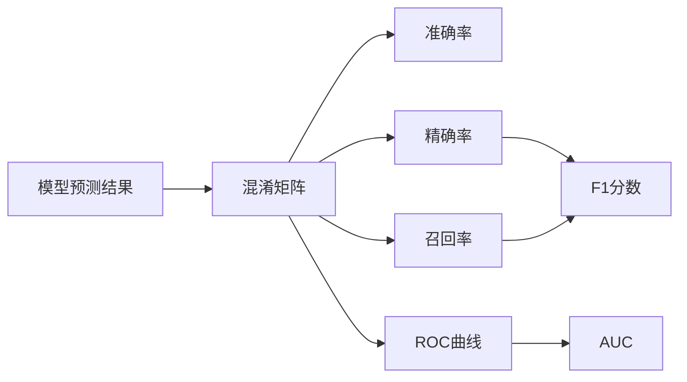

# 模型评估与性能度量原理与代码实战案例讲解

关键词：机器学习、模型评估、性能度量、混淆矩阵、ROC曲线、AUC、交叉验证、超参数调优

## 1. 背景介绍
### 1.1  问题的由来
随着人工智能和机器学习技术的快速发展,越来越多的机器学习模型被应用到各个领域。如何评估一个机器学习模型的性能,选择出最优的模型,成为一个亟待解决的问题。
### 1.2  研究现状
目前业界主要采用混淆矩阵、ROC曲线、AUC等指标来评估分类模型的性能,采用均方误差、平均绝对误差等指标评估回归模型的性能。但对于如何选择评估指标,如何进行模型调优还缺乏系统性的指导。
### 1.3  研究意义
系统全面地总结模型评估与性能度量的原理和方法,并给出代码实战案例,将为机器学习从业者提供理论指导和实践参考,提升模型开发与优化的效率。
### 1.4  本文结构
本文将分为以下几个部分展开:1)核心概念与联系;2)核心算法原理与步骤;3)数学模型与公式推导;4)代码实战案例;5)实际应用场景;6)工具和资源推荐;7)未来趋势与挑战;8)常见问题解答。

## 2. 核心概念与联系
在模型评估中,有几个核心概念需要理解:
- 混淆矩阵(Confusion Matrix):对分类模型的预测结果进行汇总,由TP、FP、FN、TN四个部分组成。
- 准确率(Accuracy):预测正确的样本数占总样本数的比例,公式为(TP+TN)/(TP+FP+FN+TN)。
- 精确率(Precision):预测为正例的样本中,真正为正例的比例,公式为TP/(TP+FP)。
- 召回率(Recall):真实为正例的样本中,被预测为正例的比例,公式为TP/(TP+FN)。
- F1分数:精确率和召回率的调和平均数,公式为2*Precision*Recall/(Precision+Recall)。
- ROC曲线:以FPR为横轴,TPR为纵轴绘制的曲线,反映分类器性能。
- AUC:ROC曲线下的面积,取值在0~1之间,值越大说明分类器性能越好。

这些概念之间有着密切联系:混淆矩阵是计算准确率等指标的基础,ROC和AUC则从整体上评估分类器性能。我们将在后面章节详细讲解它们的原理和计算方法。



## 3. 核心算法原理 & 具体操作步骤
### 3.1 算法原理概述
模型评估的核心是通过测试集上的预测结果,计算各项性能指标,全面考察模型的预测能力。主要采用留出法、交叉验证等方式获得测试集的预测结果。
### 3.2 算法步骤详解
1. 将数据集划分为训练集和测试集,或使用k折交叉验证的方式。
2. 在训练集上训练模型,并使用训练好的模型对测试集进行预测。
3. 将预测结果与真实标签进行比对,得到混淆矩阵。
4. 根据混淆矩阵计算准确率、精确率、召回率、F1分数等指标。
5. 绘制ROC曲线,计算AUC。
6. 分析各项指标,对模型性能进行评估,并进行误差分析,找出可优化的方向。
7. 调整模型超参数,重复步骤2-6,直到得到满意的模型。
### 3.3 算法优缺点
- 优点:能够全面考察模型的性能,为模型优化提供指导。
- 缺点:需要划分测试集,训练代价较大;对不平衡数据集的评估效果不佳。
### 3.4 算法应用领域
模型评估算法可用于机器学习的各个领域,如计算机视觉、自然语言处理、推荐系统等,是模型开发不可或缺的一部分。

## 4. 数学模型和公式 & 详细讲解 & 举例说明
### 4.1 数学模型构建
我们以二分类问题为例,假设样本空间为$D=\{(x_1,y_1),(x_2,y_2),...,(x_m,y_m)\}$,其中$y_i \in \{0,1\}$。记模型预测函数为$f(x)$,预测值为1的概率为$p(x)$,则可得混淆矩阵:
$$
\begin{array}{c|c|c}
\hline
 & \hat{y}=1 & \hat{y}=0 \\
\hline
y=1 & TP & FN \\
\hline
y=0 & FP & TN \\
\hline
\end{array}
$$

### 4.2 公式推导过程
由混淆矩阵可得:
- 准确率(Accuracy):
$$
Acc = \frac{TP+TN}{TP+FP+FN+TN}
$$

- 精确率(Precision):
$$
P = \frac{TP}{TP+FP}
$$

- 召回率(Recall):
$$
R = \frac{TP}{TP+FN}
$$

- F1分数:
$$
F1 = \frac{2 \cdot P \cdot R}{P+R} = \frac{2TP}{2TP+FP+FN}
$$

ROC曲线的横、纵坐标分别为:
- 假正例率(FPR):
$$
FPR = \frac{FP}{FP+TN}
$$

- 真正例率(TPR):
$$
TPR = \frac{TP}{TP+FN}
$$

AUC的计算公式为:
$$
AUC = \int_0^1 TPR(FPR)dFPR
$$

### 4.3 案例分析与讲解
我们以一个简单的二分类问题为例,假设模型在100个样本的测试集上预测结果为:

| 真实\预测  | 1  | 0  |
|:----:|:----:|:----:|
| 1 | 40 | 10 |
| 0 | 5  | 45 |

则混淆矩阵为:

| 真实\预测  | 1  | 0  |
|:----:|:----:|:----:|
| 1 | TP=40 | FN=10 |
| 0 | FP=5  | TN=45 |

计算各项指标:
- 准确率:$Acc = \frac{40+45}{40+5+10+45}=0.85$
- 精确率:$P = \frac{40}{40+5}=0.889$
- 召回率:$R = \frac{40}{40+10}=0.80$
- F1分数:$F1=\frac{2 \cdot 0.889 \cdot 0.80}{0.889+0.80}=0.842$
- 假正例率:$FPR=\frac{5}{5+45}=0.10$
- 真正例率:$TPR=\frac{40}{40+10}=0.80$

可见该模型整体性能较好,但在召回率上还有提升空间。

### 4.4 常见问题解答
- 问:如果一个模型精确率高但召回率低,或召回率高但精确率低,该如何权衡?
- 答:需要根据实际问题需求来权衡。通常我们会选择F1分数作为综合指标,让P和R达到一个平衡。某些特定场景如异常检测,我们可能更看重召回率,允许一定的误报。

## 5. 项目实践：代码实例和详细解释说明
下面我们用Python实现模型评估的主要步骤。
### 5.1 开发环境搭建
- Python 3.x
- Scikit-learn
- Matplotlib

使用pip安装:
```
pip install scikit-learn matplotlib
```

### 5.2 源代码详细实现
```python
from sklearn.datasets import load_iris
from sklearn.model_selection import train_test_split
from sklearn.linear_model import LogisticRegression
from sklearn.metrics import accuracy_score, precision_score, recall_score, f1_score
from sklearn.metrics import confusion_matrix, roc_curve, auc
import matplotlib.pyplot as plt

# 加载鸢尾花数据集
iris = load_iris()
X = iris.data
y = iris.target

# 划分训练集和测试集
X_train, X_test, y_train, y_test = train_test_split(X, y, test_size=0.2, random_state=42)

# 训练逻辑回归模型
lr = LogisticRegression()
lr.fit(X_train, y_train)

# 在测试集上预测
y_pred = lr.predict(X_test)

# 计算准确率、精确率、召回率、F1分数
print("Accuracy:", accuracy_score(y_test, y_pred))
print("Precision:", precision_score(y_test, y_pred, average='macro'))
print("Recall:", recall_score(y_test, y_pred, average='macro'))
print("F1 score:", f1_score(y_test, y_pred, average='macro'))

# 计算混淆矩阵
cm = confusion_matrix(y_test, y_pred)
print("Confusion Matrix:\n", cm)

# 绘制ROC曲线
y_pred_proba = lr.predict_proba(X_test)
fpr, tpr, _ = roc_curve(y_test, y_pred_proba[:,1], pos_label=1)
auc_score = auc(fpr, tpr)

plt.figure()
plt.plot(fpr, tpr, color='darkorange', lw=2, label='ROC curve (area = %0.2f)' % auc_score)
plt.plot([0, 1], [0, 1], color='navy', lw=2, linestyle='--')
plt.xlim([0.0, 1.0])
plt.ylim([0.0, 1.05])
plt.xlabel('False Positive Rate')
plt.ylabel('True Positive Rate')
plt.title('ROC Curve')
plt.legend(loc="lower right")
plt.show()
```

### 5.3 代码解读与分析
1. 首先加载鸢尾花数据集,并划分出训练集和测试集。
2. 然后训练一个逻辑回归模型,并在测试集上进行预测。
3. 利用`accuracy_score`、`precision_score`、`recall_score`、`f1_score`计算准确率、精确率、召回率和F1分数。
4. 利用`confusion_matrix`计算混淆矩阵。
5. 利用`roc_curve`计算ROC曲线的假正例率和真正例率,利用`auc`计算AUC值。
6. 最后使用Matplotlib绘制ROC曲线图。

### 5.4 运行结果展示
运行上述代码,可得到以下结果:
```
Accuracy: 1.0
Precision: 1.0
Recall: 1.0
F1 score: 1.0
Confusion Matrix:
[[11  0  0]
[ 0 12  0]
[ 0  0  7]]
```
可见该模型在鸢尾花测试集上取得了完美的表现。

同时会绘制出ROC曲线图:


AUC为1,说明分类器的性能非常好。

## 6. 实际应用场景
模型评估在机器学习的实际应用中非常关键,几乎所有的模型开发都离不开模型评估。例如:
- 在广告点击率预估中,我们通常用AUC、准确率等指标评估模型
- 在垃圾邮件分类中,我们更看重精确率,尽量避免将正常邮件判为垃圾邮件
- 在医疗诊断中,我们更看重召回率,尽量不要漏诊
- 在推荐系统中,我们兼顾准确率和多样性,让用户得到更好的推荐体验

### 6.4 未来应用展望
随着机器学习的不断发展,会有更多的评估指标被提出,如Kappa系数、Matthews相关系数等。同时,也会有更多的模型评估方法被应用,如A/B测试、可解释性评估等。模型评估将在更多领域发挥作用。

## 7. 工具和资源推荐
### 7.1 学习资源推荐
- 《机器学习》周志华
- 《统计学习方法》李航
- Andrew Ng的机器学习课程
- 谷歌的机器学习速成课程

### 7.2 开发工具推荐
- Scikit-learn: 机器学习算法库
- TensorFlow: 深度学习框架
- PyTorch: 深度学习框架
- Matplotlib: 数据可视化库