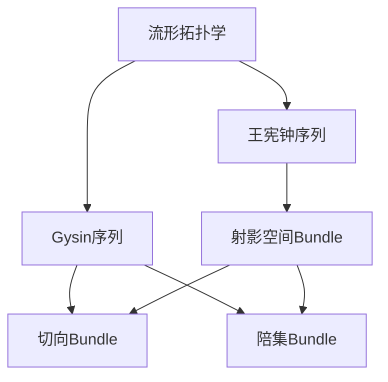

# 流形拓扑学理论与概念的实质：Gysin序列与王宪钟序列

## 1. 背景介绍

### 1.1 问题的由来

在研究流形拓扑学时,经常会遇到一些复杂的计算问题,需要借助一些强有力的工具和理论来简化和解决。Gysin序列和王宪钟序列就是这样两个重要的工具,它们为我们研究流形的拓扑不变量提供了有力的支持。

流形是一种在现代数学中无处不在的基本概念,它是一种在局部看起来像欧几里得空间的拓扑空间。流形拓扑学是研究流形的拓扑性质和不变量的一个重要分支,它为我们理解和描述流形的本质提供了强有力的工具。

### 1.2 研究现状

目前,流形拓扑学已经成为一个相当成熟和重要的研究领域,它在数学、物理学、计算机科学等诸多领域都有着广泛的应用。Gysin序列和王宪钟序列作为流形拓扑学中的两个核心工具,一直受到学术界的高度关注和深入研究。

许多著名数学家,如雷蒙·阿龙(Raymond Arlon)、迈克尔·阿廷(Michael Atiyah)、约翰·米尔诺(John Milnor)等,都为这两个序列的发展做出了重要贡献。他们的研究成果不仅深化了我们对这些序列的理解,也为其在更广阔的领域中的应用奠定了坚实的基础。

### 1.3 研究意义

Gysin序列和王宪钟序列对于研究流形的拓扑不变量具有重要意义。它们提供了一种计算和理解流形上相关不变量(如切向Bundle、陪集Bundle等)的有效方法,使得我们能够更深入地洞察流形的本质结构。

此外,这两个序列在许多数学和物理领域都有着广泛的应用,如代数拓扑学、微分几何学、代数几何学、量子场论等。因此,深入理解和掌握这些序列,不仅有助于我们更好地把握流形拓扑学的核心概念,也为我们在相关领域的研究和应用打下坚实的基础。

### 1.4 本文结构

本文将全面深入地探讨Gysin序列和王宪钟序列的理论基础、核心概念、算法原理、数学模型以及实际应用。文章将按照以下结构展开:

1. 背景介绍
2. 核心概念与联系
3. 核心算法原理与具体操作步骤
4. 数学模型和公式详细讲解与举例说明
5. 项目实践:代码实例和详细解释说明
6. 实际应用场景
7. 工具和资源推荐
8. 总结:未来发展趋势与挑战
9. 附录:常见问题与解答

## 2. 核心概念与联系

在深入探讨Gysin序列和王宪钟序列之前,我们需要先了解一些基本的拓扑学概念,如流形、Bundle、射影空间等,因为这些概念是理解这两个序列的基础。

**流形(Manifold)**是现代数学中的一个核心概念,可以简单地理解为在局部看起来像欧几里得空间的拓扑空间。更精确地说,一个流形是一个拓扑空间,它在每一点都有一个邻域,这个邻域同胚于欧几里得空间的一个开子集。

**Bundle**是另一个重要的拓扑概念,它描述了一种将一个空间"捆绑"到另一个空间上的方式。更精确地说,一个Bundle是一个三元组$(E, \pi, B)$,其中$E$是总空间,$ \pi:E\rightarrow B$是一个连续映射(称为投影),而$B$是基空间。

**射影空间(Projective Space)**是代数几何学和代数拓扑学中的一个基本概念。对于任意一个向量空间$V$,我们可以定义它的射影空间$\mathbb{P}(V)$,它由$V$中所有非零向量的等价类组成,其中两个非零向量$v$和$w$被视为等价,当且仅当存在一个非零标量$\lambda$使得$v=\lambda w$。

Gysin序列和王宪钟序列都与上述概念密切相关。Gysin序列描述了一个球丛(Sphere Bundle)上的切向Bundle和陪集Bundle之间的关系,而王宪钟序列则描述了射影空间Bundle上的切向Bundle和陪集Bundle之间的关系。这两个序列为我们计算和理解流形上的不变量提供了强有力的工具。

上图展示了Gysin序列、王宪钟序列以及相关概念之间的关系。可以看出,这两个序列都与流形拓扑学的核心概念密切相关,并为我们研究流形上的不变量提供了重要工具。

## 3. 核心算法原理与具体操作步骤

### 3.1 算法原理概述

**Gysin序列**是一个精确的序列,它描述了一个球丛(Sphere Bundle)上的切向Bundle和陪集Bundle之间的关系。更精确地说,对于任何一个球丛$\pi:S(E)\rightarrow B$,其中$S(E)$是$E$上的单位球丛,我们有如下的Gysin序列:

$$
\cdots \rightarrow H^{i-1}(B) \xrightarrow{\ \pi^*\ } H^i(S(E)) \xrightarrow{\ \phi\ } H^i(E,S(E)) \xrightarrow{\ \Delta\ } H^{i+1}(B) \xrightarrow{\ \pi^*\ } \cdots
$$

其中,$\pi^*$是Pull-back映射,$\phi$是Thom同构映射,$\Delta$是边界映射。这个序列为我们计算球丛上的切向Bundle和陪集Bundle提供了一种有效的方法。

**王宪钟序列**则描述了射影空间Bundle上的切向Bundle和陪集Bundle之间的关系。对于任何一个向量丛$\pi:E\rightarrow B$,我们可以构造它的射影空间Bundle$\mathbb{P}(E)\rightarrow B$,并得到如下的王宪钟序列:

$$
\cdots \rightarrow H^{i-1}(B) \xrightarrow{\ c_1\ } H^i(\mathbb{P}(E),\mathbb{P}(E_0)) \xrightarrow{\ \delta\ } H^i(E,E_0) \xrightarrow{\ \pi^*\ } H^i(B) \xrightarrow{\ c_1\ } \cdots
$$

其中,$c_1$是第一陪集类映射,$\delta$是边界映射,$\pi^*$是Pull-back映射。这个序列为我们计算射影空间Bundle上的切向Bundle和陪集Bundle提供了一种有效的方法。

### 3.2 算法步骤详解

**Gysin序列的计算步骤**

1. 确定给定的球丛$\pi:S(E)\rightarrow B$。
2. 计算$H^i(S(E))$,即球丛的$i$次切向同调群。
3. 计算$H^i(E,S(E))$,即球丛的$i$次陪集同调群。
4. 利用Gysin序列中的映射$\pi^*$、$\phi$和$\Delta$,计算球丛上的切向Bundle和陪集Bundle。

**王宪钟序列的计算步骤**

1. 确定给定的向量丛$\pi:E\rightarrow B$。
2. 构造向量丛的射影空间Bundle$\mathbb{P}(E)\rightarrow B$。
3. 计算$H^i(\mathbb{P}(E),\mathbb{P}(E_0))$和$H^i(E,E_0)$。
4. 利用王宪钟序列中的映射$c_1$、$\delta$和$\pi^*$,计算射影空间Bundle上的切向Bundle和陪集Bundle。

需要注意的是,在实际计算过程中,我们通常需要结合具体的拓扑空间和同调理论,利用一些辅助工具和技巧,如Mayer-Vietoris序列、Leray-Hirsch定理等,来简化和加速计算过程。

### 3.3 算法优缺点

**优点**:

1. **计算有效性**:Gysin序列和王宪钟序列为我们计算流形上的切向Bundle和陪集Bundle提供了一种有效的方法,使得我们能够更好地理解和把握流形的拓扑结构。

2. **理论深度**:这两个序列源于代数拓扑学和微分几何学的深刻理论,体现了数学家们对于流形拓扑学的深入探索和洞见。

3. **广泛应用**:除了在流形拓扑学中的应用,Gysin序列和王宪钟序列在代数几何学、量子场论等其他领域也有着重要的应用。

**缺点**:

1. **计算复杂性**:虽然这两个序列为我们提供了计算工具,但在实际计算过程中,特别是对于复杂的流形,计算往往会变得非常繁琐和复杂。

2. **理论深奥性**:要真正理解和掌握这两个序列的本质,需要具备扎实的代数拓扑学和微分几何学理论基础,对于初学者来说,可能会有一定的困难。

3. **局限性**:虽然Gysin序列和王宪钟序列为我们提供了计算切向Bundle和陪集Bundle的方法,但它们并不能解决所有与流形拓扑学相关的问题,在某些特殊情况下,我们可能需要借助其他工具和理论。

### 3.4 算法应用领域

Gysin序列和王宪钟序列在数学和物理学的多个领域都有着重要的应用,包括但不限于:

1. **代数拓扑学**:这两个序列是代数拓扑学中的核心工具,用于计算和理解流形上的不变量,如切向Bundle、陪集Bundle等。

2. **微分几何学**:在微分几何学中,Gysin序列和王宪钟序列被广泛应用于研究流形的几何结构和性质。

3. **代数几何学**:王宪钟序列在代数几何学中扮演着重要角色,用于研究代数多样体的拓扑不变量。

4. **量子场论**:在量子场论中,Gysin序列和王宪钟序列被用于计算某些量子场理论模型的不变量和指标。

5. **拓扑数据分析**:最近,这两个序列也开始在拓扑数据分析领域得到应用,用于分析高维数据集的拓扑结构。

6. **其他应用**:除了上述领域,Gysin序列和王宪钟序列在代数K理论、指标理论、表示论等多个数学分支中也有着重要的应用。

总的来说,作为流形拓扑学中的两个核心工具,Gysin序列和王宪钟序列在数学和物理学的多个领域都发挥着重要作用,为我们深入理解和探索这些领域提供了有力的支持。

## 4. 数学模型和公式详细讲解与举例说明

### 4.1 数学模型构建

为了更好地理解Gysin序列和王宪钟序列,我们需要先构建一些基本的数学模型。

**球丛模型**

对于任何一个实向量丛$\pi:E\rightarrow B$,我们可以定义它的**单位球丛**$S(E)$,即:

$$
S(E) = \{(b,v)\in E\ |\ \|v\|=1\}
$$

其中,$\|v\|$表示$v$的范数。单位球丛$S(E)$上有一个自然的投影映射$\pi:S(E)\rightarrow B$,将$(b,v)$映射到$b$。

我们可以将$S(E)$看作是一个新的流形,它的维数比$E$的维数低1,即$\dim S(E)=\dim E-1$。这个新的流形$S(E)$就是我们研究Gysin序列时需要考虑的对象。

**射影空间Bundle模型**

对于任何一个实向量丛$\pi:E\rightarrow B$,我们可以定义它的**射影空间Bundle**$\mathbb{P}(E)$,即:

$$
\mathbb{P}(E) = \{(b,[v])\ |\ b\in B, [v]\in\mathbb{P}(E_b)\}
$$

其中,$[v]