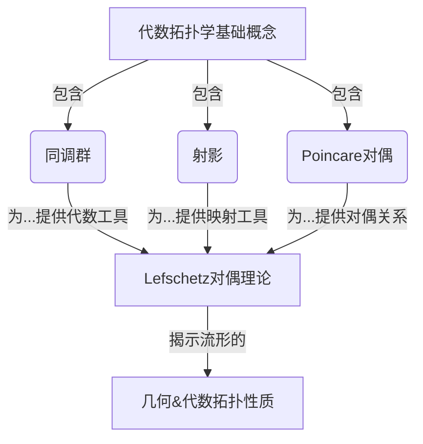

# 流形拓扑学理论与概念的实质：Lefschetz对偶

## 1. 背景介绍

### 1.1 问题的由来

在数学领域中,拓扑学是一门研究空间几何性质的学科,尤其关注那些在连续变形下保持不变的性质。流形是拓扑学中最基本和最重要的概念之一。简单来说,一个流形就是一个局部看起来像欧几里得空间的拓扑空间。

然而,研究流形的性质并非一件易事。传统的同调理论提供了一种有力的工具来研究流形的代数拓扑性质,但它并不能完全揭示流形内在的几何结构。这就催生了Lefschetz对偶理论的诞生,它为我们研究流形提供了一种全新的视角和方法。

### 1.2 研究现状

Lefschetz对偶理论最初由数学家SolomonLefschetz在20世纪20年代提出,是代数拓扑学的一个重要分支。它建立在同调理论的基础之上,但更进一步地揭示了流形的内在几何结构。

目前,Lefschetz对偶理论已经成为研究流形拓扑不可或缺的工具,在数学、物理学、计算机科学等多个领域都有广泛的应用。然而,由于其理论深奥抽象,对初学者来说掌握并不容易。因此,如何更好地理解和运用Lefschetz对偶理论,成为了当前研究的一个重点方向。

### 1.3 研究意义

深入理解Lefschetz对偶理论,对于我们认识流形的本质至关重要。它不仅能够揭示流形的代数拓扑性质,更能够揭示其内在的几何结构,从而为我们研究流形提供了一个全新的视角。

此外,Lefschetz对偶理论在多个学科领域都有广泛的应用,例如:

- 数学:在代数几何、代数拓扑、微分几何等分支中扮演着重要角色
- 物理学:在量子场论、弦理论、拓扑量子计算等领域有着深刻的应用
- 计算机科学:在计算机图形学、计算机视觉、计算拓扑等领域有着广泛的应用

因此,掌握Lefschetz对偶理论不仅能够加深我们对流形本质的理解,也能为我们在相关学科领域的研究和应用提供有力的理论支持。

### 1.4 本文结构

本文将全面深入地探讨Lefschetz对偶理论的核心概念、数学原理及其在各个领域的应用。文章主要结构如下:

1. 背景介绍
2. 核心概念与联系
3. 核心算法原理与具体操作步骤
4. 数学模型和公式详细讲解与举例说明
5. 项目实践:代码实例和详细解释说明
6. 实际应用场景
7. 工具和资源推荐
8. 总结:未来发展趋势与挑战
9. 附录:常见问题与解答

## 2. 核心概念与联系

在深入探讨Lefschetz对偶理论之前,我们需要先了解一些基本的代数拓扑概念,如同调群、射影、Poincare对偶等,因为Lefschetz对偶理论建立在这些概念的基础之上。



### 2.1 同调群

同调群是代数拓扑学中最基本和最重要的代数不变量之一。给定一个拓扑空间$X$,我们可以构造出一系列的同调群$H_n(X)$,其中每个同调群$H_n(X)$都对应着$X$中的$n$维洞。同调群不仅能够测度空间的"洞"的数量,而且还能够测度这些"洞"的代数性质。

例如,对于一个2维球面$S^2$,我们有$H_0(S^2) \cong \mathbb{Z}$、$H_1(S^2) \cong 0$、$H_2(S^2) \cong \mathbb{Z}$。这意味着$S^2$只有一个0维洞(即自身)和一个2维洞(即球面本身),但没有1维洞。

### 2.2 射影

射影是同调论中一个重要的概念,它描述了不同拓扑空间之间的函数如何诱导出同调群之间的同构映射。更精确地说,如果$f: X \rightarrow Y$是一个连续映射,那么对于每个维数$n$,都存在一个诱导同构$f_*: H_n(X) \rightarrow H_n(Y)$,使得对于任何$\alpha \in H_n(X)$,我们有$f_*(\alpha)$是$f$在$Y$上的$n$维同调类。

射影在同调论中扮演着至关重要的角色,因为它允许我们研究不同拓扑空间之间的代数关系,并将复杂的问题简化为更容易处理的问题。

### 2.3 Poincare对偶

Poincare对偶是同调论中另一个基本概念,它阐述了一个紧致导向流形的同调群与其余同调群之间的代数对偶关系。

更精确地说,如果$M$是一个紧致导向$n$维流形,那么对于每个$k \in \{0, 1, \ldots, n\}$,存在一个同构:

$$\varphi_k: H_k(M) \rightarrow H_{n-k}(M)$$

其中$\varphi_k$是由"帽积与基本类"诱导出的同构映射。这种对偶关系为我们研究流形的同调结构提供了一种新的视角和工具。

Poincare对偶理论为Lefschetz对偶理论奠定了基础,并且在Lefschetz对偶理论中得到了进一步的发展和推广。

## 3. 核心算法原理与具体操作步骤

### 3.1 算法原理概述

Lefschetz对偶理论的核心思想是,对于任意复射$f: X \rightarrow Y$,如果$Y$是一个导向流形,那么$f$在同调群上的作用不仅仅是一个群同态,更能够诱导出一个对偶映射。这种对偶映射揭示了$X$和$Y$之间更深层次的代数拓扑关系。

更精确地说,设$Y$是一个导向$n$维流形,那么对于任意连续映射$f: X \rightarrow Y$和任意$k \in \{0, 1, \ldots, n\}$,存在一个诱导同构:

$$f^*: H^k(Y) \rightarrow H^k(X)$$

以及一个对偶映射:

$$D_f: H_k(X) \rightarrow H_{n-k}(Y)$$

这里$H^k(\cdot)$表示第$k$个余同调群。$D_f$被称为Lefschetz对偶映射,它描述了$f$如何在同调群上诱导出对偶关系。

通过研究这些诱导映射和对偶映射,我们能够深入揭示$X$和$Y$之间的代数拓扑关系,从而更好地理解流形的几何结构。

```mermaid
graph LR
    A[拓扑空间 X] -->|连续映射 f| B(导向流形 Y)
    A --> C[H_k(X)]
    B --> D[H^k(Y)]
    B --> E[H_{n-k}(Y)]
    C -->|f^*| D
    C -->|D_f| E
```

### 3.2 算法步骤详解

现在让我们来具体看一下如何计算Lefschetz对偶映射。假设我们有一个连续映射$f: X \rightarrow Y$,其中$Y$是一个导向$n$维流形。为了计算$D_f: H_k(X) \rightarrow H_{n-k}(Y)$,我们需要执行以下步骤:

1. **构造余同调群映射**: 首先计算$f^*: H^k(Y) \rightarrow H^k(X)$,这是一个由$f$诱导出的余同调群同态。

2. **计算Poincare对偶**: 对于$Y$,由Poincare对偶理论我们知道存在一个同构$\cap [Y]: H^k(Y) \rightarrow H_{n-k}(Y)$,即将余同调群映射到相应的同调群。

3. **合成映射**: 将前两步得到的映射合成,得到$D_f = (\cap [Y]) \circ f^*: H^k(X) \rightarrow H_{n-k}(Y)$。

4. **利用对偶性质**: 由于同调群和余同调群之间存在自然的对偶关系,因此我们可以得到$D_f: H_k(X) \rightarrow H_{n-k}(Y)$,这就是我们所需要的Lefschetz对偶映射。

用公式表示,就是:

$$D_f = (\cap [Y]) \circ f^*: H_k(X) \xrightarrow{f^*} H^k(X) \xrightarrow{\cap [Y]} H_{n-k}(Y)$$

通过计算这个对偶映射,我们就能够揭示$X$和$Y$之间更深层次的代数拓扑关联。

### 3.3 算法优缺点

**优点**:

1. **揭示流形内在结构**: Lefschetz对偶理论为我们研究流形的内在几何结构提供了一种新的视角和工具,让我们能够更深入地理解流形的本质。

2. **推广Poincare对偶**: Lefschetz对偶理论是对Poincare对偶理论的一种推广,它不仅适用于紧致流形,也适用于更一般的映射情况。

3. **应用广泛**: Lefschetz对偶理论在数学、物理学、计算机科学等多个领域都有广泛的应用,是一种非常有用和通用的工具。

**缺点**:

1. **理论复杂抽象**: Lefschetz对偶理论涉及了大量的代数拓扑和同调论知识,对于初学者来说理解起来有一定的困难。

2. **计算复杂**: 在实际应用中,计算Lefschetz对偶映射往往需要大量的代数运算,尤其是对于高维流形,计算复杂度会急剧增加。

3. **一般性不足**: 尽管Lefschetz对偶理论比Poincare对偶理论更加通用,但它仍然只适用于导向流形的情况,对于非导向流形则无法直接应用。

### 3.4 算法应用领域

Lefschetz对偶理论在数学、物理学、计算机科学等多个领域都有广泛的应用,下面列举了一些典型的应用场景:

- **代数几何**: 在代数几何中,Lefschetz对偶理论被用于研究代数多样体的同调性质,例如计算它们的Betti数和Hodge数等。

- **微分几何**: 在微分几何中,Lefschetz对偶理论被用于研究流形的特性类、指环和其他不变量。

- **拓扑量子场论**: 在量子场论中,Lefschetz对偶理论被用于研究规范场论的拓扑性质,例如研究手征理论和Chern-Simons理论等。

- **弦理论**: 在弦理论中,Lefschetz对偶理论被用于研究D-branes和其他拓扑缺陷的性质。

- **计算机图形学**: 在计算机图形学中,Lefschetz对偶理论被用于表面参数化、网格简化和拓扑操作等问题。

- **计算机视觉**: 在计算机视觉中,Lefschetz对偶理论被用于形状分析、图像分割和三维重建等问题。

- **计算拓扑学**: 在计算拓扑学中,Lefschetz对偶理论是一种研究拓扑不变量的重要工具。

总的来说,Lefschetz对偶理论为我们研究流形和更一般的拓扑空间提供了一种强有力的工具,在多个学科领域都有着广泛的应用前景。

## 4. 数学模型和公式详细讲解与举例说明

### 4.1 数学模型构建

为了更好地理解和应用Lefschetz对偶理论,我们需要先构建一个严格的数学模型。让我们从同调论的基本概念开始。

给定一个拓扑空间$X$,