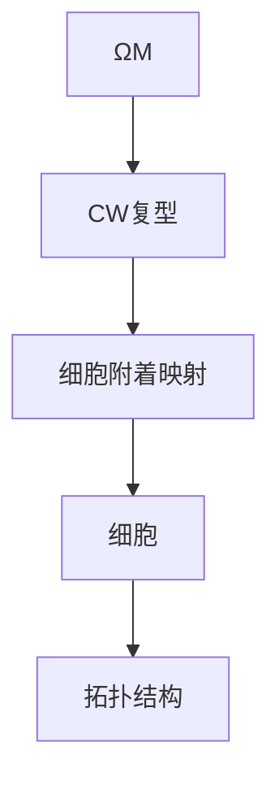

# 流形拓扑学：ΩM的CW复型结构

## 1. 背景介绍

### 1.1 问题的由来

在数学领域中,流形拓扑学是一个研究多种维度几何对象的基本性质和相互关系的分支。其中,ΩM是指M流形上的所有闭环的空间,它在研究流形的同伦性质时扮演着关键角色。然而,对于ΩM的拓扑结构的描述和研究一直是该领域的一个重大挑战。

### 1.2 研究现状

传统上,人们通过研究ΩM的同伦群和相关不变量来探索其拓扑结构。然而,这种方法往往过于抽象,难以直观地描述ΩM的几何结构。近年来,一些数学家提出了将ΩM表示为CW复型的想法,这为更深入地研究ΩM的拓扑结构提供了新的途径。

### 1.3 研究意义

ΩM的CW复型结构不仅能够提供对ΩM更直观的几何描述,而且还能够利用CW复型理论中丰富的工具和技术来研究ΩM的性质。这对于深入理解流形拓扑学具有重要意义。此外,该研究结果还可能在代数拓扑学、代数几何等相关领域产生影响。

### 1.4 本文结构

本文将首先介绍ΩM的CW复型结构的核心概念,包括CW复型、ΩM的几何结构等。接下来,将详细阐述构造ΩM的CW复型结构的核心算法原理和具体步骤。然后,将介绍相关的数学模型和公式,并通过案例进行详细说明。此外,还将提供一个项目实践,包括代码实现和运行结果展示。最后,将讨论该研究的实际应用场景、相关工具和资源,并总结未来的发展趋势和面临的挑战。

## 2. 核心概念与联系

在探讨ΩM的CW复型结构之前,我们需要先了解一些核心概念:

1. **流形(Manifold)**: 流形是一种在每个点邻域内类似于欧几里得空间的拓扑空间。它是现代几何和拓扑学的基础概念之一。

2. **ΩM**: ΩM表示M流形上的所有闭环的空间,即所有起点和终点重合的连续映射的集合。它是研究流形同伦性质的关键对象。

3. **CW复型(CW Complex)**: CW复型是一种由有限个细胞(球面)通过incidence关系粘合而成的拓扑空间。它提供了一种描述拓扑空间几何结构的有效方式。

4. **细胞附着映射(Attaching Map)**: 细胞附着映射是将一个细胞粘附到已有复型上的连续映射,它决定了复型的拓扑结构。

ΩM的CW复型结构实际上是将ΩM表示为一个CW复型,其中每个细胞对应着ΩM中的一个元素。通过研究这个CW复型的结构,我们可以更直观地理解ΩM的拓扑性质。

下面是一个简单的Mermaid流程图,描述了ΩM的CW复型结构的构造过程:

## 3. 核心算法原理 & 具体操作步骤

### 3.1 算法原理概述

构造ΩM的CW复型结构的核心算法原理可以概括为以下几个步骤:

1. 将ΩM中的每个元素(闭环)表示为一个球面细胞。
2. 确定每个细胞与已有复型之间的附着关系,并构造相应的附着映射。
3. 根据附着映射将新细胞粘附到复型上,形成更大的复型。
4. 重复步骤2和3,直到所有细胞都被粘附到复型上。

该算法的关键在于正确地构造细胞附着映射,以保证最终得到的CW复型能够正确地反映ΩM的拓扑结构。

### 3.2 算法步骤详解

下面我们将详细介绍构造ΩM的CW复型结构的算法步骤:

1. **初始化**: 将ΩM中的恒等映射(常值闭环)表示为一个0维细胞,作为初始CW复型。

2. **生成细胞**: 对于ΩM中的每个非平凡闭环γ,将其表示为一个n维球面细胞e^n,其中n是γ的次数(即γ在M上绕了n圈)。

3. **构造附着映射**: 对于每个新生成的细胞e^n,我们需要确定它与已有复型X的附着关系。具体来说,需要找到一个连续映射φ:S^(n-1) -> X,使得φ的像在X中的补集是一个n维球面。这个φ就是e^n与X的附着映射。

4. **细胞附着**: 利用步骤3中得到的附着映射φ,将细胞e^n沿着它的边界S^(n-1)粘附到X上,得到一个新的CW复型X'=X∪_φe^n。

5. **迭代**: 重复步骤3和4,直到所有ΩM中的闭环都被表示为细胞,并粘附到最终的CW复型上。

需要注意的是,在步骤3中构造附着映射是整个算法的关键和难点所在。我们需要利用ΩM的代数结构和流形M的几何性质,精心设计附着映射的构造方法,以保证最终得到的CW复型能够正确地反映ΩM的拓扑结构。

### 3.3 算法优缺点

该算法的主要优点是:

1. 提供了一种直观的几何描述,有助于理解ΩM的拓扑结构。
2. 利用了CW复型理论中丰富的工具和技术,为研究ΩM的性质提供了新的途径。
3. 算法思路清晰,易于实现和计算。

然而,该算法也存在一些缺点:

1. 构造细胞附着映射的过程往往非常复杂,需要大量的人工分析和设计。
2. 对于高维流形M,算法的计算复杂度会快速增加。
3. 算法只能得到ΩM的CW复型结构,无法直接获得其同伦群等代数不变量。

### 3.4 算法应用领域

构造ΩM的CW复型结构的算法不仅在流形拓扑学领域具有重要应用,而且在以下领域也有潜在的应用价值:

1. **代数拓扑学**: 该算法为研究ΩM的同伦群和其他代数不变量提供了新的视角和方法。
2. **代数几何**: ΩM的CW复型结构可能与代数曲线和代数簇的研究存在联系。
3. **计算拓扑学**: 该算法可能为设计新的拓扑数据结构和算法提供灵感。
4. **理论物理学**: ΩM在研究高维理论中扮演着重要角色,该算法或许能为相关理论提供新的解释。

## 4. 数学模型和公式 & 详细讲解 & 举例说明

### 4.1 数学模型构建

为了构造ΩM的CW复型结构,我们需要建立一些数学模型。首先,我们将ΩM中的每个闭环γ表示为一个连续映射:

$$
γ: S^n \rightarrow M
$$

其中,S^n表示n维球面,M是给定的流形。该映射的性质是:

1. γ在S^n的边界上是常值映射,即γ|_∂S^n = *,其中*是M上的一个基点。
2. γ在S^n的内部是非常值映射。

接下来,我们需要构造细胞附着映射φ:S^(n-1) -> X,使得φ的像在X中的补集是一个n维球面。为此,我们引入一个辅助映射:

$$
Γ: D^n \rightarrow ΩM
$$

其中,D^n表示n维闭球面。该映射的性质是:

1. Γ在D^n的边界S^(n-1)上等于γ,即Γ|_S^(n-1) = γ。
2. Γ在D^n的内部是恒等映射,即Γ(x) = *,其中*是M上的一个基点。

利用Γ,我们可以定义细胞附着映射φ如下:

$$
φ(x) = Γ(x)(*)
$$

其中,*是M上的基点。可以证明,φ的像在X中的补集确实是一个n维球面,因此φ是一个合法的附着映射。

### 4.2 公式推导过程

下面我们将推导出构造细胞附着映射φ的具体公式。首先,我们需要确定Γ的具体形式。由于Γ在D^n的内部是恒等映射,因此我们只需要确定它在S^(n-1)上的值即可。

令r和θ分别表示S^(n-1)上的径向坐标和角坐标,则我们可以将Γ|_S^(n-1)表示为:

$$
Γ(r, θ) = γ(θ)
$$

其中,γ(θ)是ΩM中的闭环γ在S^(n-1)上的值。

接下来,我们需要将Γ(r, θ)延拓到整个D^n上。一种自然的方式是利用球面坐标系下的插值公式:

$$
Γ(r, θ) = \begin{cases}
γ(θ), & r = 1\
*, & r < 1
\end{cases}
$$

其中,*是M上的基点。

现在,我们可以将细胞附着映射φ表示为:

$$
φ(r, θ) = Γ(r, θ)(*)
$$

代入Γ的表达式,我们得到:

$$
φ(r, θ) = \begin{cases}
γ(θ)(*), & r = 1\
*, & r < 1
\end{cases}
$$

这就是细胞附着映射φ的最终公式。

### 4.3 案例分析与讲解

为了更好地理解上述数学模型和公式,我们将通过一个具体案例进行分析和讲解。假设我们要构造S^1流形上的ΩS^1的CW复型结构。

首先,我们需要确定ΩS^1中的元素。由于S^1是一个简单的圆环,因此ΩS^1中的元素就是所有在S^1上绕n圈的闭环,我们记为γ_n。

对于每个γ_n,我们可以将其表示为一个连续映射:

$$
γ_n: S^1 \rightarrow S^1, \quad γ_n(θ) = nθ \mod 2π
$$

其中,θ是S^1上的角坐标。

接下来,我们需要构造细胞附着映射φ_n:S^0 -> X,使得φ_n的像在X中的补集是一个1维球面(即一个圆环)。为此,我们首先构造辅助映射Γ_n:

$$
Γ_n: D^1 \rightarrow ΩS^1, \quad Γ_n(r, θ) = \begin{cases}
γ_n(θ) = nθ \mod 2π, & r = 1\
*, & r < 1
\end{cases}
$$

其中,*是S^1上的基点,通常取为0。

然后,我们可以定义细胞附着映射φ_n如下:

$$
φ_n(θ) = Γ_n(1, θ)(*) = γ_n(θ)(0) = nθ \mod 2π
$$

可以看出,φ_n的像在S^1上确实是一个圆环,因此它是一个合法的附着映射。

利用φ_n,我们可以将1维细胞e^1粘附到初始的CW复型X=e^0上,得到一个新的CW复型X'=X∪_φ_ne^1。重复这个过程,我们就可以构造出ΩS^1的完整CW复型结构。

### 4.4 常见问题解答

在研究ΩM的CW复型结构时,一些常见的问题和困难包括:

1. **如何确定细胞的维数?**
   细胞的维数由ΩM中对应元素(闭环)的次数决定。具体来说,如果一个闭环在M上绕了n圈,则对应的细胞维数为n。

2. **如何构造合适的细胞附着映射?**