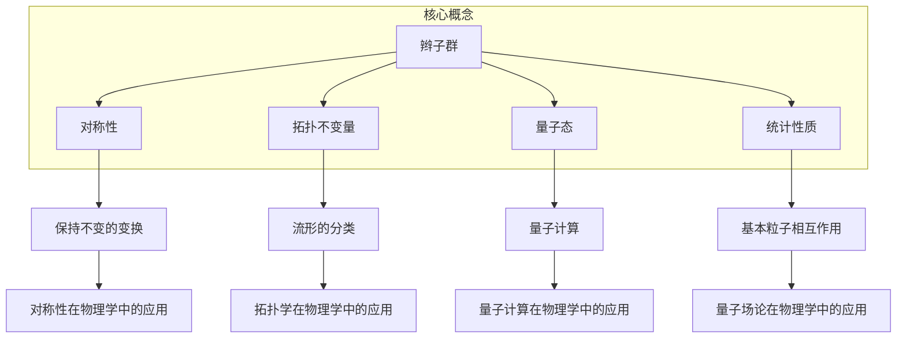
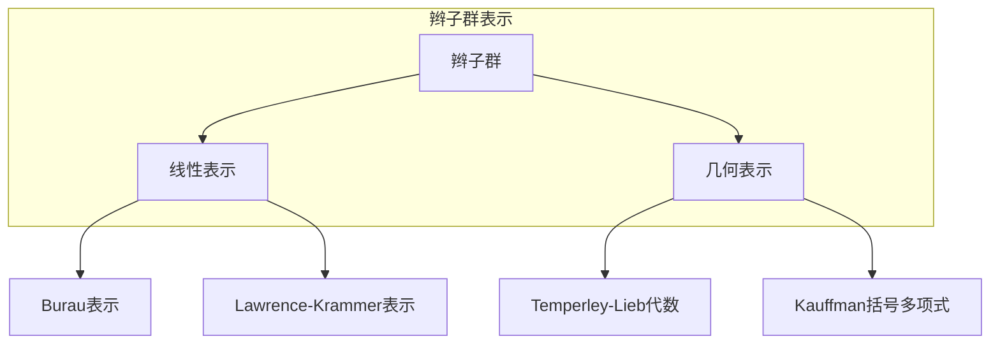

# 物理学中的群论：辫子群

## 1. 背景介绍

### 1.1 问题的由来

在物理学中,许多现象都可以用群论来描述和研究。群论是一种研究代数结构的数学分支,它为我们提供了一种有力的工具来探索自然界中的对称性和不变量。其中,辫子群(Braid Group)是一种特殊的无限离散群,它起源于对辫子理论的研究,但后来被发现在拓扑学、代数几何、量子计算和粒子物理学等领域都有重要应用。

辫子群的概念最早可以追溯到19世纪法国数学家埃米尔·阿丁(Émile Artin)的工作。他研究了一种特殊的辫编织方式,并将其抽象为一个代数结构,即辫子群。这种群不仅在数学上具有独特的性质,而且与物理学中的一些基本概念存在着深刻的联系。

### 1.2 研究现状

近年来,辫子群在物理学领域引起了广泛关注,尤其是在量子计算和量子场论方面。量子计算利用量子力学的原理来执行计算,而辫子群提供了一种描述和操纵量子态的数学框架。在量子场论中,辫子群也被用来研究基本粒子的统计性质和相互作用。

此外,辫子群在拓扑学和代数几何等数学领域也有重要应用。它们与低维流形的不变量、代数曲线和代数曲面的研究密切相关。这些应用不仅丰富了数学理论,也为物理学提供了新的视角和工具。

### 1.3 研究意义

研究辫子群在物理学中的应用具有重要意义:

1. **量子计算**:辫子群为量子计算提供了一种描述和操纵量子态的数学框架,有助于设计和优化量子算法,推动量子计算的发展。

2. **量子场论**:辫子群可以用来研究基本粒子的统计性质和相互作用,有助于深入理解物质的本质和宇宙的结构。

3. **拓扑学**:辫子群与低维流形的不变量密切相关,有助于探索空间的几何和拓扑性质。

4. **代数几何**:辫子群在代数曲线和代数曲面的研究中扮演着重要角色,有助于推进这一数学分支的发展。

通过研究辫子群在物理学中的应用,我们可以获得更深刻的理解,并有望发现新的理论和应用。

### 1.4 本文结构

本文将全面介绍辫子群在物理学中的应用,内容安排如下:

1. 背景介绍
2. 核心概念与联系
3. 核心算法原理与具体操作步骤
4. 数学模型和公式详细讲解与举例说明
5. 项目实践:代码实例和详细解释说明
6. 实际应用场景
7. 工具和资源推荐
8. 总结:未来发展趋势与挑战
9. 附录:常见问题与解答

## 2. 核心概念与联系

辫子群是一种特殊的无限离散群,它与物理学中的许多核心概念密切相关。下面我们将介绍辫子群的基本定义和性质,以及它与其他物理概念的联系。

### 2.1 辫子群的定义

辫子群是一个由辫子生成的群,其中每个辫子代表一个群元素。具体来说,对于n条平行线,我们可以定义一个n条辫子群$B_n$,其中每个群元素对应一种将n条线交织在一起的方式。

辫子群$B_n$的生成元由$n-1$个基本辫子$\sigma_1, \sigma_2, \ldots, \sigma_{n-1}$构成,其中$\sigma_i$表示将第i条线绕过第i+1条线的操作。这些生成元满足以下关系:

$$
\begin{align}
\sigma_i \sigma_j &= \sigma_j \sigma_i & \text{if } |i-j| \geq 2 \
\sigma_i \sigma_{i+1} \sigma_i &= \sigma_{i+1} \sigma_i \sigma_{i+1} & \text{for } 1 \leq i \leq n-2
\end{align}
$$

### 2.2 辫子群与对称性

辫子群与对称性密切相关。在物理学中,对称性是一个非常重要的概念,它描述了系统在某些变换下保持不变的性质。辫子群提供了一种描述和研究某些对称性的数学工具。

例如,在量子场论中,辫子群可以用来研究粒子的统计性质和相互作用。不同的辫子表示粒子在空间中的不同排列,而辫子群的结构反映了粒子的对称性和统计行为。

### 2.3 辫子群与拓扑不变量

辫子群与拓扑学中的不变量密切相关。在拓扑学中,不变量是一种描述流形(manifold)性质的数学对象,它在某些变换下保持不变。辫子群可以用来构造一些重要的拓扑不变量,如Jones多项式和HOMFLY多项式,这些不变量对于分类和研究低维流形非常有用。

### 2.4 辫子群与量子态

在量子计算领域,辫子群提供了一种描述和操纵量子态的数学框架。量子态可以用辫子群的表示来编码,而量子门操作则对应于辫子群中的元素。利用辫子群的代数结构,我们可以设计和优化量子算法,推动量子计算的发展。

### 2.5 辫子群与统计性质

在量子场论中,辫子群可以用来研究基本粒子的统计性质和相互作用。不同的辫子表示粒子在空间中的不同排列,而辫子群的结构反映了粒子的对称性和统计行为。通过研究辫子群的表示,我们可以更好地理解粒子的性质和相互作用。

综上所述,辫子群在物理学中扮演着重要角色,它与对称性、拓扑不变量、量子态和统计性质等核心概念密切相关。深入研究辫子群有助于我们对自然界的本质有更深刻的理解。

## 3. 核心算法原理与具体操作步骤

### 3.1 算法原理概述

辫子群的核心算法原理是基于辫子群的代数结构和表示理论。通过研究辫子群的表示,我们可以获得许多有用的信息,如对称性、统计性质和拓扑不变量等。

辫子群的表示可以分为两大类:线性表示和几何表示。线性表示将辫子群的元素映射到矩阵空间中,而几何表示则将辫子群的元素映射到某些几何对象上,如环面或者流形等。

线性表示和几何表示都有各自的优缺点和应用场景。线性表示通常更容易计算和操作,但可能失去一些几何信息。而几何表示虽然计算复杂,但可以保留更多几何和拓扑信息。

### 3.2 算法步骤详解

下面我们详细介绍辫子群表示的算法步骤:

#### 3.2.1 线性表示算法步骤

1. 选择一个合适的线性表示,如Burau表示或Lawrence-Krammer表示。
2. 将辫子群的生成元映射到相应的矩阵空间中。
3. 根据辫子群的关系式,计算出任意辫子对应的矩阵。
4. 利用矩阵的代数性质,研究辫子群的结构和性质。

例如,对于Burau表示,我们可以将辫子群$B_n$的生成元$\sigma_i$映射到$(n-1) \times (n-1)$矩阵:

$$
\sigma_i \mapsto \begin{pmatrix}
1 & & & \
& \ddots & & \
& & 1 & -t \
& & 1 & 0 \
& & & \ddots & \
& & & & 1
\end{pmatrix}
$$

其中$t$是一个参数,矩阵中"-t"位于第$(i,i+1)$位置。利用这个表示,我们可以计算出任意辫子对应的矩阵,并研究其代数性质。

#### 3.2.2 几何表示算法步骤

1. 选择一个合适的几何表示,如Temperley-Lieb代数或Kauffman括号多项式。
2. 将辫子群的元素映射到相应的几何对象上,如环面或流形。
3. 利用几何对象的不变量,如Jones多项式或HOMFLY多项式,研究辫子群的拓扑性质。
4. 通过几何对象的操作,如环面的剪切和粘合,探索辫子群的结构和性质。

例如,在Temperley-Lieb代数中,我们可以将辫子群$B_n$的元素映射到$(n,n)$-Temperley-Lieb代数中的元素。这些元素可以用环面来表示,并且满足一些代数关系式。通过研究这些关系式和环面的不变量,我们可以获得辫子群的拓扑信息。

### 3.3 算法优缺点

#### 3.3.1 线性表示的优缺点

**优点:**

- 计算简单,易于操作。
- 可以利用矩阵的代数性质,获得辫子群的一些代数信息。

**缺点:**

- 可能失去一些几何和拓扑信息。
- 对于某些特殊情况,线性表示可能不够精确或者失效。

#### 3.3.2 几何表示的优缺点

**优点:**

- 保留了更多几何和拓扑信息。
- 可以利用几何对象的不变量,如Jones多项式和HOMFLY多项式,获得辫子群的拓扑性质。

**缺点:**

- 计算复杂,操作困难。
- 需要一定的几何和拓扑知识背景。

### 3.4 算法应用领域

辫子群表示算法在以下领域有重要应用:

1. **量子计算:** 利用辫子群的线性表示,我们可以设计和优化量子算法,推动量子计算的发展。
2. **量子场论:** 通过研究辫子群的表示,我们可以更好地理解基本粒子的统计性质和相互作用。
3. **拓扑学:** 辫子群的几何表示可以用来构造拓扑不变量,如Jones多项式和HOMFLY多项式,这对于分类和研究低维流形非常有用。
4. **代数几何:** 辫子群在代数曲线和代数曲面的研究中扮演着重要角色,有助于推进这一数学分支的发展。

总之,辫子群表示算法为我们提供了一种强大的工具,可以应用于物理学的多个领域,帮助我们更深入地理解自然界的本质。

## 4. 数学模型和公式详细讲解与举例说明

### 4.1 数学模型构建

为了研究辫子群在物理学中的应用,我们需要构建合适的数学模型。这些模型通常基于辫子群的代数结构和表示理论,并与物理系统中的对称性、拓扑性质和统计行为等概念相关联。

#### 4.1.1 线性表示模型

线性表示模型将辫子群的元素映射到矩阵空间中,利用矩阵的代数性质来研究辫子群的结构和性质。常见的线性表示包括Burau表示和Lawrence-Krammer表示等。

在Burau表示中,我们将辫子群$B_n$的生成元$\sigma_