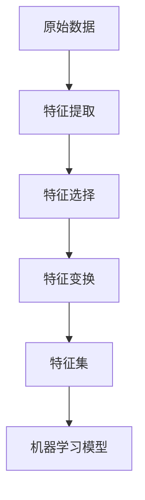

好的,我会尽力遵循您提供的约束条件,以专业的技术语言撰写这篇关于特征工程的博客文章。下面是正文部分:

# 特征工程(Feature Engineering)原理与代码实战案例讲解

## 1. 背景介绍

### 1.1 问题的由来

在机器学习和数据挖掘领域,获取高质量的训练数据对于构建性能良好的模型至关重要。然而,原始数据通常是未经处理的,包含了许多噪声、缺失值和无关特征。为了提高模型的准确性和泛化能力,我们需要对原始数据进行有效的特征工程处理。

特征工程的目标是从原始数据中提取出对预测目标最有意义和相关性的特征子集,并对这些特征进行编码、变换和缩放等操作,从而获得更加精简且信息丰富的特征集。高质量的特征集有助于机器学习算法更好地学习数据中的模式和规律,从而提高模型的性能。

### 1.2 研究现状

特征工程作为数据预处理的关键步骤,在机器学习实践中扮演着重要角色。目前,特征工程主要依赖于领域专家的经验和知识,需要人工进行大量的特征提取、选择和变换工作。这种传统方式存在以下几个问题:

1. 人工操作效率低下,难以处理大规模高维数据。
2. 依赖专家经验,缺乏普适性和自动化能力。
3. 特征工程过程缺乏系统性和可解释性。

为了解决这些问题,研究人员提出了各种自动化特征工程方法,如基于进化算法、深度学习等技术。这些新兴方法旨在减少人工参与,提高特征工程的效率和质量。但目前这些方法还存在一些局限性,如计算复杂度高、缺乏可解释性等,需要进一步改进和完善。

### 1.3 研究意义

高质量的特征工程对于构建高性能的机器学习模型至关重要。通过有效的特征工程,我们可以:

1. 提高模型的预测准确性和泛化能力。
2. 降低模型的复杂度,减少过拟合风险。
3. 提高模型的可解释性和可理解性。
4. 减少数据维度,降低计算和存储开销。

因此,深入研究特征工程的原理和方法,对于提高机器学习模型的性能和实用性具有重要意义。

### 1.4 本文结构

本文将全面介绍特征工程的核心概念、算法原理、数学模型、代码实现和实际应用场景。文章主要分为以下几个部分:

1. 核心概念与联系
2. 核心算法原理与具体操作步骤
3. 数学模型和公式详细讲解及案例分析
4. 项目实践:代码实例和详细解释说明
5. 实际应用场景
6. 工具和资源推荐
7. 总结:未来发展趋势与挑战
8. 附录:常见问题与解答

## 2. 核心概念与联系

特征工程涉及多个核心概念,这些概念相互关联,构成了特征工程的理论基础。下面我们逐一介绍这些概念及其联系。

### 2.1 特征提取(Feature Extraction)

特征提取是从原始数据中构造出有意义的特征的过程。常用的特征提取方法包括:

- 统计特征:如均值、方差、相关系数等。
- 基于模型的特征:如主成分分析(PCA)、独立成分分析(ICA)等。
- 基于嵌入的特征:如Word2Vec、Node2Vec等。

提取出有意义的特征是特征工程的第一步,也是最关键的一步。

### 2.2 特征选择(Feature Selection)

由于原始数据通常包含大量冗余和无关特征,这些特征不仅没有提供有用信息,反而会增加模型的复杂度和计算开销。特征选择的目标是从原始特征集中选择出一个最优特征子集,以提高模型的性能和效率。常用的特征选择方法包括:

- 过滤式方法:基于特征与目标变量的相关性进行评分和排序,如卡方检验、互信息等。
- 包裹式方法:将特征选择过程包裹在机器学习模型中,通过交叉验证评估特征子集的性能。
- 嵌入式方法:在模型训练过程中自动进行特征选择,如Lasso回归、决策树等。

特征选择可以降低数据维度,减少模型复杂度,提高模型的泛化能力。

### 2.3 特征变换(Feature Transformation)

即使是经过提取和选择后的特征集,也可能存在一些问题,如特征之间的相关性、数据分布的偏斜等。特征变换的目标是对原始特征进行某些变换操作,以获得更加适合机器学习模型的特征表示。常用的特征变换方法包括:

- 归一化(Normalization):将特征值缩放到一个固定范围,如[0,1]或[-1,1]。
- 标准化(Standardization):将特征值转换为均值为0、方差为1的标准正态分布。
- 对数变换(Log Transformation):对数据进行对数变换,常用于处理偏斜分布的数据。
- 一热编码(One-Hot Encoding):将类别型特征转换为数值型特征,以适应机器学习模型的输入要求。

特征变换可以提高模型的训练效率和预测性能,是特征工程的重要环节。

### 2.4 特征工程与机器学习的关系

特征工程是机器学习的前期数据预处理步骤,对于构建高性能的机器学习模型至关重要。高质量的特征工程可以:

1. 提供信息丰富的特征输入,提高模型的学习能力。
2. 降低数据维度,减少模型复杂度和计算开销。
3. 处理数据中的噪声和异常值,提高模型的鲁棒性。
4. 增强特征之间的相关性,提高模型的可解释性。

总的来说,特征工程为机器学习算法提供了高质量的数据输入,是机器学习模型性能的关键保证。

### 2.5 特征工程流程概览

特征工程通常包括以下几个主要步骤:

1. 从原始数据中提取出有意义的特征。
2. 对提取出的特征进行选择,选择出最优特征子集。
3. 对选择出的特征进行变换,如归一化、标准化等。
4. 获得最终的特征集,作为机器学习模型的输入。
5. 在机器学习模型中使用特征集进行训练和预测。

## 3. 核心算法原理与具体操作步骤

在上一节中,我们介绍了特征工程的核心概念及其相互关系。本节将重点讲解特征工程中几种核心算法的原理和具体操作步骤。

### 3.1 算法原理概述

#### 3.1.1 主成分分析(PCA)

主成分分析是一种常用的无监督特征提取方法。它的基本思想是通过正交变换,将原始特征投影到一组相互正交的主成分空间中,从而达到降维和去相关的目的。

PCA的核心是寻找一组正交基向量,使得原始数据在这组基向量上的投影方差最大。这些基向量就是主成分,对应的投影就是新的特征。通过保留前几个主成分,我们可以近似重构原始数据,同时也实现了降维的目的。

PCA具有以下优点:

- 可以有效降低数据维度,减少计算开销。
- 可以去除特征之间的相关性,提高新特征的可解释性。
- 算法简单,计算高效,适用于大规模数据。

但PCA也存在一些局限性:

- 主成分可能难以解释,缺乏物理意义。
- 对异常值敏感,需要进行数据预处理。
- 线性变换无法捕捉数据的非线性结构。

#### 3.1.2 互信息特征选择(MIFS)

互信息特征选择是一种常用的过滤式特征选择算法。它的基本思想是根据特征与目标变量之间的互信息值,以及特征与已选特征之间的互信息冗余值,对特征进行评分和排序,从而选择出最优特征子集。

互信息是衡量两个随机变量之间相关性的一种度量,它反映了一个随机变量给另一个随机变量提供的信息量。在特征选择中,我们希望选择与目标变量互信息值较大的特征(相关性强),同时选择彼此之间互信息值较小的特征(冗余性小)。

MIFS算法的评分函数为:

$$J(X_i)=I(X_i;Y)-\beta \sum_{X_j \in S} I(X_i;X_j)$$

其中:
- $I(X_i;Y)$表示特征$X_i$与目标变量$Y$之间的互信息值
- $\sum_{X_j \in S} I(X_i;X_j)$表示特征$X_i$与已选特征集$S$中所有特征之间的互信息冗余值之和
- $\beta$是一个调节参数,用于平衡相关性和冗余性

根据这个评分函数,我们可以对所有特征进行评分和排序,选择得分最高的前$k$个特征作为最优特征子集。

MIFS算法的优点是计算简单、高效,适用于大规模数据。但它也存在一些缺点,如对特征之间的非线性相关性捕捉能力较差,需要人工设置调节参数等。

#### 3.1.3 Lasso回归

Lasso回归是一种常用的嵌入式特征选择方法。它在线性回归的基础上,引入了L1范数正则化项,从而实现了自动特征选择的功能。

Lasso回归的目标函数为:

$$\min_{\beta_0,\beta} \frac{1}{2n}\sum_{i=1}^n(y_i-\beta_0-\sum_{j=1}^p x_{ij}\beta_j)^2 + \lambda\sum_{j=1}^p|\beta_j|$$

其中:
- $n$为样本数量
- $p$为特征数量
- $y_i$为第$i$个样本的目标值
- $x_{ij}$为第$i$个样本的第$j$个特征值
- $\beta_0$为偏置项
- $\beta_j$为第$j$个特征的系数
- $\lambda$为正则化参数,控制着特征选择的严格程度

在这个目标函数中,第一项是普通线性回归的平方损失函数,第二项是L1范数正则化项。由于L1范数具有稀疏性,当$\lambda$足够大时,部分$\beta_j$会被压缩为0,从而实现了特征选择的目的。

Lasso回归的优点是可以同时进行回归和特征选择,而且具有一定的可解释性。但它也存在一些局限性,如对多重共线性特征的选择存在偏差,需要人工设置正则化参数等。

### 3.2 算法步骤详解

接下来,我们将详细讲解上述三种算法的具体操作步骤。

#### 3.2.1 主成分分析(PCA)算法步骤

1. **标准化数据**

由于PCA对数据的尺度敏感,因此需要先对原始数据进行标准化处理,使每个特征的均值为0、方差为1。标准化公式为:

$$x'=\frac{x-\mu}{\sigma}$$

其中$\mu$为特征的均值,$\sigma$为特征的标准差。

2. **计算协方差矩阵**

计算标准化后数据的协方差矩阵$\Sigma$:

$$\Sigma=\frac{1}{n-1}\sum_{i=1}^n(x_i-\mu)(x_i-\mu)^T$$

其中$n$为样本数量,$x_i$为第$i$个样本,$\mu$为所有样本的均值向量。

3. **求解特征值和特征向量**

对协方差矩阵$\Sigma$进行特征值分解:

$$\Sigma=P\Lambda P^T$$

其中$\Lambda$为对角线上的特征值,$P$为对应的特征向量矩阵。

4. **选取主成分**

按照特征