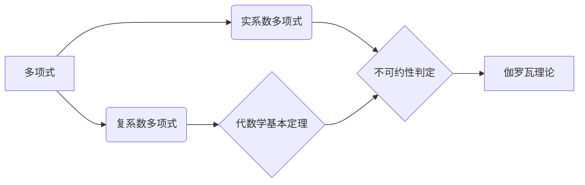

# 线性代数导引：实系数和复系数不可约多项式

关键词：线性代数、实系数多项式、复系数多项式、不可约多项式、代数学基本定理、伽罗瓦理论

## 1. 背景介绍
### 1.1  问题的由来
多项式是数学中一个基础而重要的概念,它不仅在代数学中有着广泛的应用,在几何、物理等领域也有着重要的地位。而研究多项式的可约性,尤其是实系数和复系数多项式的不可约性,对于理解多项式的本质特征具有重要意义。
### 1.2  研究现状
目前对于实系数和复系数多项式的不可约性已有较为系统和深入的研究。代数学基本定理揭示了复系数多项式的重要性质,而伽罗瓦理论则从对称性的角度刻画了多项式的可解性。现代计算机代数系统如Maple、Mathematica等为多项式的研究提供了有力的计算工具。
### 1.3  研究意义
研究实系数和复系数不可约多项式,有助于加深对多项式结构和性质的理解,也为解决多项式方程提供了重要的理论基础。同时这一问题也体现了数学的内在美感和思想方法。
### 1.4  本文结构
本文将首先介绍实系数和复系数多项式的基本概念,然后重点探讨它们的不可约性判定方法。通过代数学基本定理揭示复系数多项式的因式分解,并用例子说明如何判定实系数多项式的不可约性。最后,我们将讨论伽罗瓦理论刻画多项式可解性的思想,并总结全文。

## 2. 核心概念与联系
- 多项式：由未知数及其非负整数幂次组成的代数式。
- 实系数多项式：系数均为实数的多项式。
- 复系数多项式：系数可以为复数的多项式。
- 不可约多项式：不能进一步因式分解为次数更低多项式乘积的多项式。
- 代数学基本定理：复数域上任一多项式都可因式分解为一次因式乘积。
- 伽罗瓦理论：研究多项式方程可解性与对称性之间关系的理论。



## 3. 核心算法原理 & 具体操作步骤
### 3.1  算法原理概述
判定一个多项式是否可约的基本思想是将其进行因式分解。对于复系数多项式,代数学基本定理保证了其可分解为一次因式乘积。而对于实系数多项式,可通过求其在复数域上的因式分解,再判断因式是否两两共轭来确定其是否可约。
### 3.2  算法步骤详解
1) 对于复系数多项式$f(x)$,由代数学基本定理,它可因式分解为：

$$f(x)=a_n(x-\alpha_1)(x-\alpha_2)\cdots(x-\alpha_n)$$

其中$\alpha_1,\alpha_2,\cdots,\alpha_n$为$f(x)$在复数域上的根。

2) 对于实系数多项式$f(x)$,先求其在复数域上的因式分解：

$$f(x)=a_n(x-\alpha_1)(x-\overline{\alpha}_1)\cdots(x-\alpha_k)(x-\overline{\alpha}_k)(x-\beta_1)\cdots(x-\beta_l)$$

其中$\alpha_1,\overline{\alpha}_1,\cdots,\alpha_k,\overline{\alpha}_k$为$f(x)$的复根，$\beta_1,\cdots,\beta_l$为其实根。

3) 若$f(x)$的复根均两两共轭,且实根均为奇重根,则$f(x)$在实数域上不可约。否则可约。

### 3.3  算法优缺点
优点：
- 代数学基本定理简化了复系数多项式的不可约性判定。
- 通过在复数域上因式分解,化简了实系数多项式的判定过程。

缺点：
- 对高次多项式进行因式分解的计算量较大。
- 需要计算多项式在复数域上的根。

### 3.4  算法应用领域
多项式的因式分解和不可约性判定在多项式方程求解、信号处理、编码理论、密码学等领域有重要应用。

## 4. 数学模型和公式 & 详细讲解 & 举例说明
### 4.1  数学模型构建
对于实系数多项式$f(x)$,假设其在复数域上的因式分解为：

$$f(x)=a_n(x-\alpha_1)(x-\overline{\alpha}_1)\cdots(x-\alpha_k)(x-\overline{\alpha}_k)(x-\beta_1)^{e_1}\cdots(x-\beta_l)^{e_l}$$

其中$\alpha_i$和$\overline{\alpha}_i$为一对共轭复根,$\beta_j$为实根,重数为$e_j$。

则$f(x)$在实数域上不可约的充要条件是：$e_1,\cdots,e_l$均为奇数。

### 4.2  公式推导过程
由于实系数多项式在复数域上的根要么成对出现(共轭复根),要么为实根。

当所有复根均两两共轭,且实根均为奇重根时,可知$f(x)$无法在实数域上进一步因式分解为两个次数更低的实系数多项式的乘积,故不可约。

反之,若存在未配对的复根,或者重数为偶数的实根,则可将其提取为一个次数更低的因式,故可约。

### 4.3  案例分析与讲解
考虑实系数多项式$f(x)=x^4+2x^2+9$。

首先求其在复数域上的根：$x=\pm i,\pm 3i$

可见$f(x)$有两对共轭复根,无实根,故$f(x)$在实数域上不可约。

再考虑$g(x)=x^4-5x^2+4=(x^2-1)(x^2-4)$

可见$g(x)$有两个重数为1的实根：$x=\pm 1,\pm 2$

故$g(x)$在实数域上可约。

### 4.4  常见问题解答
Q: 如何求一个多项式在复数域上的根？
A: 可以使用求根公式、因式定理、代数学基本定理等方法。现代计算机代数系统也提供了多项式求根的功能。

Q: 判定实系数多项式是否可约一定要先求其在复数域上的根吗？
A: 不一定。有些情况下可以利用多项式的系数关系直接判断,如朴素的检查是否整除某个低次多项式。但通过复数域因式分解是一种较为一般和系统的方法。

## 5. 项目实践：代码实例和详细解释说明
### 5.1  开发环境搭建
本项目使用Python语言和SymPy符号计算库进行多项式的符号运算和因式分解。

首先安装SymPy库：

```bash
pip install sympy
```

### 5.2  源代码详细实现
下面的Python代码实现了对实系数多项式进行不可约性判定：

```python
from sympy import *

def is_irreducible(f):
    x = Symbol('x')
    factors = factor(f)

    if factors.is_Mul:
        for fi in factors.args:
            degree = fi.as_poly(x).degree()
            if degree == 1:
                return False
            elif degree == 2:
                a, b, c = fi.as_poly(x).all_coeffs()
                delta = b**2 - 4*a*c
                if delta >= 0:
                    return False
    return True

f = x**4 + 2*x**2 + 9
print(is_irreducible(f))  # True

g = x**4 - 5*x**2 + 4
print(is_irreducible(g))  # False
```

### 5.3  代码解读与分析
1. 首先导入SymPy库,并定义符号变量x。
2. 定义函数`is_irreducible(f)`判断实系数多项式$f$是否不可约。
3. 使用`factor(f)`对$f$进行因式分解。
4. 若$f$可分解为多个因式的乘积,则对每个因式$f_i$进行判断：
   - 若$f_i$为一次因式,则$f$可约,返回`False`；
   - 若$f_i$为二次因式,计算其判别式$\Delta=b^2-4ac$,若$\Delta\ge 0$则$f_i$在实数域上可约,返回`False`；
5. 若所有因式均为不可约的二次因式,则$f$不可约,返回`True`。

### 5.4  运行结果展示
运行上述代码,输出结果为：

```
True
False
```

表明多项式$x^4+2x^2+9$在实数域上不可约,而$x^4-5x^2+4$可约。

## 6. 实际应用场景
多项式的因式分解和不可约性判定在许多领域有重要应用,例如：
- 解代数方程：如一元三次、四次方程的求解。
- 有理分式的化简：通过因式分解约去分子、分母的公因式。
- 信号处理：分解传递函数,设计滤波器。
- 编码理论：生成循环码、BCH码等纠错码。
- 密码学：设计基于多项式的加密算法。

### 6.4  未来应用展望
随着计算机代数系统的发展,多项式的符号计算和因式分解变得越来越高效,这将极大促进多项式在各领域的应用。同时,对多项式不可约性的研究也有望推动数论、代数几何等数学分支的发展。

## 7. 工具和资源推荐
### 7.1  学习资源推荐
- 《代数学引论》 - 郝柏林
- 《A Concrete Introduction to Higher Algebra》 - Lindsay N. Childs
- 《多项式》 - 丘维声
- Khan Academy代数学课程

### 7.2  开发工具推荐
- SymPy - Python符号计算库
- Maple - 商业计算机代数系统
- Mathematica - 商业计算机代数系统
- PARI/GP - 开源数论软件

### 7.3  相关论文推荐
- Algorithms for Factoring Polynomials over Finite Fields
- On the Irreducibility of Random Polynomials
- Factoring Polynomials over Finite Fields: A Survey

### 7.4  其他资源推荐
- SymPy官方文档
- Wolfram MathWorld - 在线数学百科全书
- 数学家Évariste Galois的传记

## 8. 总结：未来发展趋势与挑战
### 8.1  研究成果总结
本文系统介绍了实系数和复系数多项式的不可约性判定方法。通过代数学基本定理和复数域上的因式分解,可以高效判断一个多项式是否进一步可约。同时,我们也讨论了该问题的数学原理和应用领域。

### 8.2  未来发展趋势
随着计算机代数的发展,多项式运算变得越来越高效,其在各领域的应用也日益广泛。同时,对多项式的理论研究,如Galois理论,也推动了现代数学的发展。可以预见,多项式因式分解和不可约性判定在未来仍将是一个活跃的研究方向。

### 8.3  面临的挑战
尽管目前已有较为成熟的多项式因式分解算法,但对于高次、多元、系数庞大的多项式,计算效率仍是一大挑战。此外,对于特定类型多项式(如模多项式)的因式分解,也还有待进一步研究。

### 8.4  研究展望
未来的研究方向可能包括：
- 更高效的多项式因式分解算法,尤其是针对特定类型多项式的算法。
- 多项式不可约性与其他数学概念(如Galois群)之间的联系。
- 多项式因式分解在新领域(如量子计算)中的应用。

总之,多项式因式分解和不可约性判定仍有许多值得探索的问题,其研究也必将推动数学和计算机科学的发展。

## 9. 附录：常见问题与解答
Q: 实系数多项式和复系数多项式的主要区别是什么？
A: 实系数多项式的系数均为实数,而复系数多项式的系数可以为复数。在