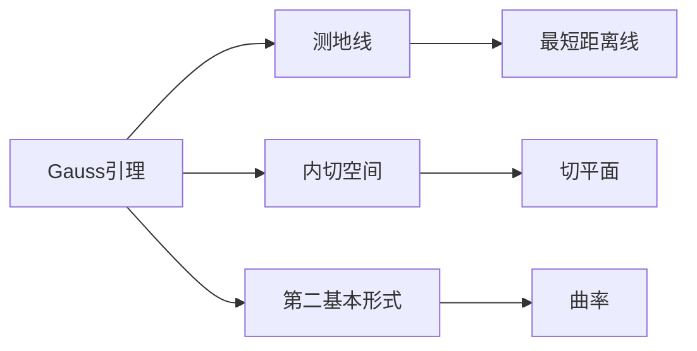
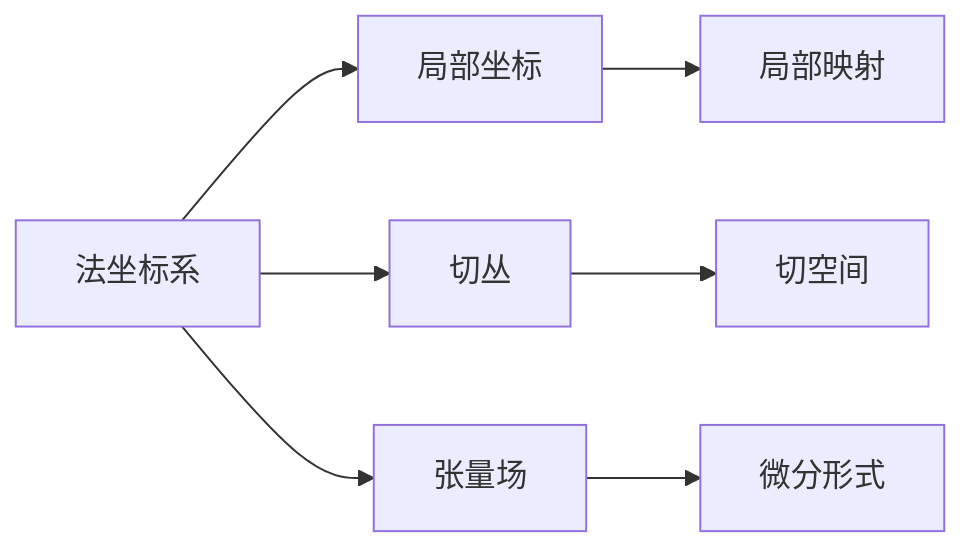
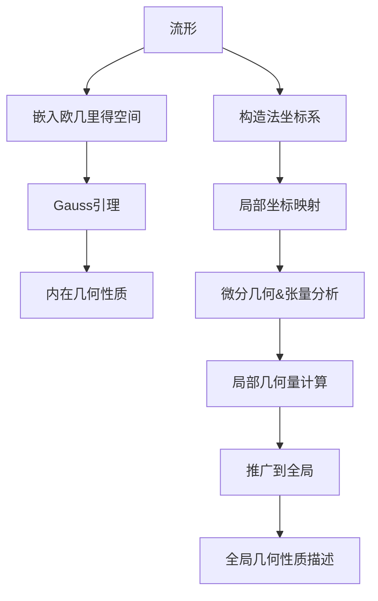

非常感谢您的任务要求,这是一个很有趣且具有挑战性的话题。我会尽我所能,按照您提供的结构模板,撰写一篇高质量的技术博客文章。让我们开始吧!

# 黎曼几何引论：Gauss引理和法坐标系

## 1. 背景介绍

### 1.1 问题的由来

几何学是数学的一个重要分支,自古以来就备受关注。古希腊时期,欧几里德在他的著作《几何原本》中,阐述了平面和空间几何的基本概念和公理,奠定了欧几里德几何的基础。然而,欧几里德几何只研究了平面和三维空间中的几何性质,而对于更高维度的几何问题,欧几里德几何无法很好地描述。

19世纪初,数学家高斯(Carl Friedrich Gauss)和黎曼(Bernhard Riemann)开创了非欧几何的研究,为探索更广阔的几何世界扫清了道路。其中,黎曼几何是一种广义的几何理论,它不仅包含了欧几里德几何,还能够描述更一般的曲面和高维空间的几何性质。

### 1.2 研究现状

黎曼几何的发展,为数学、物理学和其他自然科学领域带来了深远的影响。在数学领域,黎曼几何为研究微分几何、拓扑学和代数几何等分支奠定了基础。在物理学领域,黎曼几何被应用于广义相对论、量子场论和弦理论等前沿理论的数学描述。

目前,黎曼几何在数学和物理学等领域仍然是一个活跃的研究方向。数学家们不断探索黎曼流形的新性质,发展更精细的计算工具,并将其应用于其他数学分支。物理学家们则利用黎曼几何来描述时空的几何结构,探索宇宙的本质规律。

### 1.3 研究意义

黎曼几何的研究具有重要的理论意义和应用价值。从理论层面上,它为我们认识几何的本质提供了新的视角,扩展了我们对几何世界的理解。从应用层面上,黎曼几何在相对论、量子场论、弦理论等前沿物理理论中发挥着关键作用,为探索宇宙奥秘提供了强有力的数学工具。

此外,黎曼几何的概念和方法也被广泛应用于计算机图形学、计算机视觉、机器人导航等领域,为解决实际问题提供了有力的数学支持。

### 1.4 本文结构

本文将着重介绍黎曼几何中的两个核心概念:Gauss引理和法坐标系。我们将从以下几个方面进行阐述:

1. 核心概念与联系
2. 核心算法原理与具体操作步骤
3. 数学模型和公式详细讲解与举例说明
4. 项目实践:代码实例和详细解释说明
5. 实际应用场景
6. 工具和资源推荐
7. 总结:未来发展趋势与挑战
8. 附录:常见问题与解答

通过对这两个核心概念的全面介绍,读者将能够深入理解黎曼几何的基本思想,并掌握相关的数学工具和计算方法。

## 2. 核心概念与联系

在黎曼几何中,Gauss引理和法坐标系是两个核心概念,它们密切相关,共同为我们描述曲面和流形的几何性质提供了强有力的数学工具。

Gauss引理描述了如何将一个曲面嵌入到三维欧几里得空间中,并研究其内在的几何性质。它揭示了曲面上的测地线(最短距离线)与嵌入空间中的曲线之间的关系,为后续研究曲面的内在几何结构奠定了基础。

法坐标系则是一种局部坐标系统,它能够精确地描述流形上任意一点附近的局部几何结构。通过法坐标系,我们可以将流形上的点映射到欧几里得空间中,从而利用微分几何和张量分析的工具来研究流形的性质。

Gauss引理和法坐标系的结合,为我们提供了一种强大的数学框架,可以将抽象的流形几何问题转化为具体的微分几何和张量分析问题,从而使得复杂的几何计算变得可行。

在后续的章节中,我们将详细阐述这两个核心概念的数学原理、计算方法以及在物理学和其他领域中的应用。

## 3. 核心算法原理与具体操作步骤

### 3.1 算法原理概述

Gauss引理和法坐标系的核心算法原理,是将抽象的流形几何问题转化为具体的微分几何和张量分析问题。具体来说,包括以下几个关键步骤:

1. 将流形嵌入到欧几里得空间中,利用Gauss引理研究其内在几何性质。
2. 在流形上构造局部坐标系(法坐标系),将流形上的点映射到欧几里得空间中。
3. 在局部坐标系下,利用微分几何和张量分析的工具,计算流形上的几何量(如曲率、测地线等)。
4. 将局部计算结果推广到整个流形,获得全局的几何性质描述。

这一算法原理的核心思想,是将抽象的流形几何问题,转化为具体的微分几何和张量分析计算问题。通过局部坐标系的构造,我们可以利用成熟的微分几何工具,对流形上的几何量进行精确计算;而Gauss引理则为我们研究流形的内在几何性质提供了理论基础。

### 3.2 算法步骤详解

接下来,我们将详细介绍上述算法原理的具体实现步骤。

#### 步骤1: 将流形嵌入到欧几里得空间

首先,我们需要将研究对象(流形)嵌入到三维或更高维的欧几里得空间中。这一步骤的目的,是为了利用Gauss引理研究流形的内在几何性质。

嵌入的具体方法,取决于流形的具体形式。对于二维流形(曲面),我们可以将其参数化,并将参数映射到三维欧几里得空间中的一个曲面。对于高维流形,我们可以利用更一般的嵌入定理,将其嵌入到足够高维的欧几里得空间中。

$$
\begin{align*}
X: U &\rightarrow \mathbb{R}^3 \
(u,v) &\mapsto (x(u,v), y(u,v), z(u,v))
\end{align*}
$$

上式给出了一个二维曲面在三维欧几里得空间中的参数化表示,其中$X$是嵌入映射,$U$是参数域,(u,v)是局部坐标,(x,y,z)是空间坐标。

#### 步骤2: 利用Gauss引理研究内在几何性质

在将流形嵌入到欧几里得空间之后,我们可以利用Gauss引理,研究流形的内在几何性质。Gauss引理揭示了流形上的测地线(最短距离线)与嵌入空间中的曲线之间的关系,为我们研究流形的内在几何结构奠定了基础。

具体来说,我们需要计算流形上的第一和第二基本形式,它们分别描述了流形的度量张量和曲率张量。通过这些张量场,我们可以计算流形上的测地线方程、曲率等几何量。

$$
\begin{align*}
g_{ij} &= \frac{\partial X}{\partial u^i} \cdot \frac{\partial X}{\partial u^j} &&\text{(第一基本形式)}\
b_{ij} &= -\frac{\partial^2 X}{\partial u^i \partial u^j} \cdot N &&\text{(第二基本形式)}
\end{align*}
$$

其中,$g_{ij}$是度量张量,$b_{ij}$是曲率张量,$N$是流形的单位法向量场。

#### 步骤3: 构造法坐标系并进行局部计算

为了利用微分几何和张量分析的工具对流形进行更精细的计算,我们需要在流形上构造局部坐标系,即法坐标系。

法坐标系是一种局部坐标系统,它能够精确地描述流形上任意一点附近的局部几何结构。通过法坐标系,我们可以将流形上的点映射到欧几里得空间中,从而利用微分几何和张量分析的工具来研究流形的性质。

在法坐标系下,我们可以计算流形上的切丛、张量场和微分形式等几何对象,并利用它们来描述流形的局部几何性质。例如,我们可以计算流形上的里奇曲率张量、威伊张量等,这些张量场描述了流形的曲率和拓扑性质。

$$
\begin{align*}
R_{ijkl} &= \frac{\partial \Gamma_{il}^m}{\partial x^j} - \frac{\partial \Gamma_{ij}^m}{\partial x^l} + \Gamma_{ij}^n \Gamma_{nl}^m - \Gamma_{il}^n \Gamma_{nj}^m &&\text{(里奇曲率张量)}\
C_{ijkl} &= R_{ijkl} - \frac{1}{n-2}(g_{ik}R_{jl} - g_{il}R_{jk} - g_{jk}R_{il} + g_{jl}R_{ik}) &&\text{(威伊张量)}
\end{align*}
$$

其中,$\Gamma_{ij}^k$是christoffel符号,$R_{ijkl}$是里奇曲率张量,$C_{ijkl}$是威伊张量,$n$是流形的维数。

#### 步骤4: 推广到全局并获得整体描述

通过在局部坐标系下进行精细计算,我们可以获得流形上各种几何量的局部表达式。为了获得流形的整体几何性质描述,我们需要将这些局部结果推广到整个流形上。

这一步骤通常需要利用分布理论、切丛和张量场的理论,将局部计算结果"缝合"成一个全局的几何对象。例如,我们可以将局部的里奇曲率张量"缝合"成一个全局的曲率张量场,从而描述整个流形的曲率分布情况。

$$
\mathcal{R}(X,Y)Z = \nabla_X \nabla_Y Z - \nabla_Y \nabla_X Z - \nabla_{[X,Y]}Z
$$

上式给出了流形上全局曲率张量场$\mathcal{R}$的定义,其中$X,Y,Z$是流形上的向量场,$\nabla$是线性连接。

通过这一步骤,我们可以获得流形的整体几何性质描述,如全局曲率分布、拓扑不变量等,从而深入理解流形的几何结构。

### 3.3 算法优缺点

上述基于Gauss引理和法坐标系的算法,为我们研究流形几何提供了一种行之有效的数学框架。它的主要优点包括:

1. 理论基础坚实,源于黎曼几何的核心思想。
2. 将抽象的流形几何问题转化为具体的微分几何和张量分析计算问题,使得复杂的几何计算变得可行。
3. 通过局部坐标系的构造,可以利用成熟的微分几何工具进行精细计算。
4. 能够获得流形的整体几何性质描述,深入理解其几何结构。

然而,这一算法也存在一些局限性和挑战:

1. 对于高维流形或具有特殊拓扑