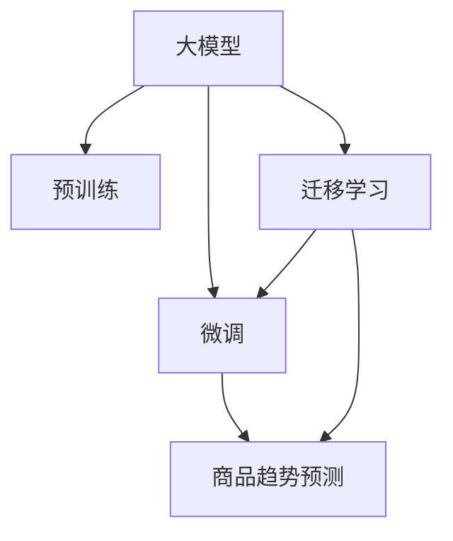

                 

# AI大模型在商品趋势预测中的应用

## 1. 背景介绍

### 1.1 问题由来

在当今高度竞争的商业环境中，企业需要不断调整其商品策略以应对市场变化。商品趋势预测是实现这一目标的重要手段。然而，传统的预测方法依赖于专家经验和历史数据，存在数据稀缺、特征工程复杂、预测精度不稳定等问题。

近年来，随着人工智能技术的发展，尤其是大模型的崛起，为商品趋势预测提供了新的解决方案。大模型如GPT、BERT等，经过大规模预训练，能够学习到丰富的商品描述和用户行为特征。这些模型通过微调，可以进一步提升预测准确性和泛化能力，满足企业对商品趋势预测的实际需求。

### 1.2 问题核心关键点

大模型在商品趋势预测中能够发挥关键作用，主要有以下几个关键点：

- **数据高效利用**：大模型具备强大的特征提取能力，能够从稀疏、异构的数据中提取有意义的特征。
- **跨领域迁移**：通过预训练-微调的方式，模型能够跨领域迁移，预测不同领域商品的市场趋势。
- **动态更新**：大模型能够持续学习新数据，动态更新模型参数，保持预测的准确性和时效性。
- **泛化能力**：大模型拥有更强的泛化能力，能够应对多变的市场环境和趋势变化。

### 1.3 问题研究意义

大模型在商品趋势预测中的应用，对于提升企业市场决策效率、优化商品策略、减少库存风险等具有重要意义：

- **降低决策风险**：通过精准的市场趋势预测，帮助企业及时调整商品策略，避免因盲目决策导致的库存积压。
- **提升运营效率**：精准预测市场需求，优化库存管理，提高运营效率，降低物流和库存成本。
- **增强竞争优势**：及时获取市场趋势信息，抢占市场先机，增强企业的市场竞争力。
- **驱动业务创新**：借助大模型的预测能力，推动产品创新，满足消费者日益多样化的需求。

## 2. 核心概念与联系

### 2.1 核心概念概述

为了深入理解大模型在商品趋势预测中的应用，本节将介绍几个核心概念：

- **大模型(Large Model)**：以深度神经网络为基础，经过大规模预训练的模型。如GPT、BERT等。
- **预训练(Pre-training)**：在大规模无标签数据上，通过自监督学习任务训练通用模型的过程。
- **微调(Fine-tuning)**：在预训练模型的基础上，使用任务特定数据进行有监督学习，优化模型在该任务上的性能。
- **迁移学习(Transfer Learning)**：将一个领域学习到的知识，迁移应用到另一个相关领域的学习范式。
- **商品趋势预测(Merchandise Trend Prediction)**：通过预测商品未来的需求趋势，指导企业商品策略的制定和优化。

这些核心概念之间的逻辑关系可以通过以下Mermaid流程图来展示：



这个流程图展示了大模型在商品趋势预测中的核心概念及其之间的关系：

1. 大模型通过预训练获得基础能力。
2. 微调是对预训练模型进行任务特定的优化，以适应商品趋势预测任务。
3. 迁移学习是连接预训练模型与商品趋势预测任务的桥梁，可以通过微调或迁移学习来实现。

## 3. 核心算法原理 & 具体操作步骤

### 3.1 算法原理概述

大模型在商品趋势预测中，本质上是一个有监督的微调过程。其核心思想是：将大模型视作一个强大的"特征提取器"，通过在商品趋势预测任务的标注数据上进行有监督微调，使得模型能够准确预测未来商品的市场需求趋势。

形式化地，假设预训练模型为 $M_{\theta}$，其中 $\theta$ 为预训练得到的模型参数。给定商品趋势预测任务 $T$ 的标注数据集 $D=\{(x_i, y_i)\}_{i=1}^N$，其中 $x_i$ 表示商品的历史销售数据和特征向量，$y_i$ 表示商品未来的市场趋势预测。微调的目标是找到新的模型参数 $\hat{\theta}$，使得：

$$
\hat{\theta}=\mathop{\arg\min}_{\theta} \mathcal{L}(M_{\theta},D)
$$

其中 $\mathcal{L}$ 为针对任务 $T$ 设计的损失函数，用于衡量模型预测输出与真实标签之间的差异。常见的损失函数包括均方误差损失、交叉熵损失等。

通过梯度下降等优化算法，微调过程不断更新模型参数 $\theta$，最小化损失函数 $\mathcal{L}$，使得模型输出逼近真实标签。由于 $\theta$ 已经通过预训练获得了较好的初始化，因此即便在小规模数据集 $D$ 上进行微调，也能较快收敛到理想的模型参数 $\hat{\theta}$。

### 3.2 算法步骤详解

基于有监督学习的大模型微调在商品趋势预测一般包括以下几个关键步骤：

**Step 1: 准备预训练模型和数据集**

- 选择合适的预训练模型 $M_{\theta}$ 作为初始化参数，如 GPT、BERT 等。
- 准备商品趋势预测任务的标注数据集 $D$，划分为训练集、验证集和测试集。数据集应包括商品的历史销售数据、市场趋势标签等。

**Step 2: 添加任务适配层**

- 根据商品趋势预测任务类型，在预训练模型顶层设计合适的输出层和损失函数。
- 对于回归任务，通常在顶层添加线性回归器，并使用均方误差损失函数。
- 对于分类任务，通常使用多分类交叉熵损失函数。

**Step 3: 设置微调超参数**

- 选择合适的优化算法及其参数，如 AdamW、SGD 等，设置学习率、批大小、迭代轮数等。
- 设置正则化技术及强度，包括权重衰减、Dropout、Early Stopping 等。
- 确定冻结预训练参数的策略，如仅微调顶层，或全部参数都参与微调。

**Step 4: 执行梯度训练**

- 将训练集数据分批次输入模型，前向传播计算损失函数。
- 反向传播计算参数梯度，根据设定的优化算法和学习率更新模型参数。
- 周期性在验证集上评估模型性能，根据性能指标决定是否触发 Early Stopping。
- 重复上述步骤直至满足预设的迭代轮数或 Early Stopping 条件。

**Step 5: 测试和部署**

- 在测试集上评估微调后模型 $M_{\hat{\theta}}$ 的性能，对比微调前后的预测精度提升。
- 使用微调后的模型对新商品进行预测，集成到实际的商品管理系统中。
- 持续收集新的数据，定期重新微调模型，以适应数据分布的变化。

以上是基于有监督学习微调大模型在商品趋势预测的一般流程。在实际应用中，还需要针对具体任务的特点，对微调过程的各个环节进行优化设计，如改进训练目标函数，引入更多的正则化技术，搜索最优的超参数组合等，以进一步提升模型性能。

### 3.3 算法优缺点

基于有监督学习的大模型微调在商品趋势预测中具有以下优点：

- **预测精度高**：大模型通过预训练，学习到了丰富的商品特征，能够高效地提取和利用数据，提升预测精度。
- **泛化能力强**：大模型具有较强的泛化能力，能够适应不同商品、市场和时段的趋势变化。
- **实时更新**：大模型能够持续学习新数据，动态更新模型参数，保持预测的时效性。

同时，该方法也存在一定的局限性：

- **数据依赖**：微调效果很大程度上依赖于标注数据的质量和数量，标注成本较高。
- **模型复杂**：大模型的计算复杂度高，需要高性能计算资源进行训练和推理。
- **可解释性不足**：微调模型的决策过程缺乏可解释性，难以对其推理逻辑进行分析和调试。

尽管存在这些局限性，但就目前而言，基于有监督学习的微调方法仍是大模型应用于商品趋势预测的主流范式。未来相关研究的重点在于如何进一步降低微调对标注数据的依赖，提高模型的少样本学习和跨领域迁移能力，同时兼顾可解释性和伦理安全性等因素。

### 3.4 算法应用领域

基于大模型微调的监督学习方法，在商品趋势预测领域已经得到了广泛的应用，例如：

- **市场需求预测**：预测未来一段时间内商品的市场需求量，以指导企业的生产计划和库存管理。
- **价格趋势预测**：预测商品的价格走势，帮助企业制定合理的定价策略。
- **新产品推广策略**：分析市场趋势，预测新产品的市场需求，制定推广计划。
- **季节性商品管理**：根据季节变化预测商品销售趋势，优化库存和采购策略。

除了上述这些经典应用外，大模型微调还被创新性地应用到更多场景中，如供应链优化、供应链风险管理等，为商品管理和供应链管理带来了新的突破。随着预训练模型和微调方法的不断进步，相信商品趋势预测技术将在更广阔的应用领域大放异彩。

## 4. 数学模型和公式 & 详细讲解  
### 4.1 数学模型构建

本节将使用数学语言对基于有监督学习的大模型微调过程进行更加严格的刻画。

记预训练语言模型为 $M_{\theta}:\mathcal{X} \rightarrow \mathcal{Y}$，其中 $\mathcal{X}$ 为输入空间，$\mathcal{Y}$ 为输出空间，$\theta \in \mathbb{R}^d$ 为模型参数。假设商品趋势预测任务的训练集为 $D=\{(x_i,y_i)\}_{i=1}^N, x_i \in \mathcal{X}, y_i \in \mathcal{Y}$。

定义模型 $M_{\theta}$ 在输入 $x$ 上的输出为 $\hat{y}=M_{\theta}(x) \in \mathcal{Y}$，表示模型对商品未来市场趋势的预测。

定义模型 $M_{\theta}$ 在数据样本 $(x,y)$ 上的损失函数为 $\ell(M_{\theta}(x),y)$，则在数据集 $D$ 上的经验风险为：

$$
\mathcal{L}(\theta) = \frac{1}{N} \sum_{i=1}^N \ell(M_{\theta}(x_i),y_i)
$$

微调的优化目标是最小化经验风险，即找到最优参数：

$$
\theta^* = \mathop{\arg\min}_{\theta} \mathcal{L}(\theta)
$$

在实践中，我们通常使用基于梯度的优化算法（如SGD、Adam等）来近似求解上述最优化问题。设 $\eta$ 为学习率，$\lambda$ 为正则化系数，则参数的更新公式为：

$$
\theta \leftarrow \theta - \eta \nabla_{\theta}\mathcal{L}(\theta) - \eta\lambda\theta
$$

其中 $\nabla_{\theta}\mathcal{L}(\theta)$ 为损失函数对参数 $\theta$ 的梯度，可通过反向传播算法高效计算。

### 4.2 公式推导过程

以下我们以市场需求预测任务为例，推导均方误差损失函数及其梯度的计算公式。

假设模型 $M_{\theta}$ 在输入 $x$ 上的输出为 $\hat{y}=M_{\theta}(x) \in \mathbb{R}$，表示模型对商品未来市场需求量的预测。真实标签 $y \in \mathbb{R}$。则均方误差损失函数定义为：

$$
\ell(M_{\theta}(x),y) = \frac{1}{2}(y - \hat{y})^2
$$

将其代入经验风险公式，得：

$$
\mathcal{L}(\theta) = \frac{1}{N} \sum_{i=1}^N (y_i - \hat{y_i})^2
$$

根据链式法则，损失函数对参数 $\theta_k$ 的梯度为：

$$
\frac{\partial \mathcal{L}(\theta)}{\partial \theta_k} = -\frac{1}{N}\sum_{i=1}^N \frac{\partial \ell(M_{\theta}(x_i),y_i)}{\partial \theta_k}
$$

其中 $\frac{\partial \ell(M_{\theta}(x_i),y_i)}{\partial \theta_k}$ 可通过反向传播算法计算得到。

在得到损失函数的梯度后，即可带入参数更新公式，完成模型的迭代优化。重复上述过程直至收敛，最终得到适应商品趋势预测任务的最优模型参数 $\theta^*$。

## 5. 项目实践：代码实例和详细解释说明
### 5.1 开发环境搭建

在进行微调实践前，我们需要准备好开发环境。以下是使用Python进行PyTorch开发的环境配置流程：

1. 安装Anaconda：从官网下载并安装Anaconda，用于创建独立的Python环境。

2. 创建并激活虚拟环境：
```bash
conda create -n pytorch-env python=3.8 
conda activate pytorch-env
```

3. 安装PyTorch：根据CUDA版本，从官网获取对应的安装命令。例如：
```bash
conda install pytorch torchvision torchaudio cudatoolkit=11.1 -c pytorch -c conda-forge
```

4. 安装Transformers库：
```bash
pip install transformers
```

5. 安装各类工具包：
```bash
pip install numpy pandas scikit-learn matplotlib tqdm jupyter notebook ipython
```

完成上述步骤后，即可在`pytorch-env`环境中开始微调实践。

### 5.2 源代码详细实现

下面我们以市场需求预测任务为例，给出使用Transformers库对GPT模型进行微调的PyTorch代码实现。

首先，定义市场需求预测任务的预处理函数：

```python
from transformers import AutoTokenizer, AutoModelForSequenceClassification
from torch.utils.data import Dataset
import torch
import numpy as np
import pandas as pd

class DemandDataset(Dataset):
    def __init__(self, data_path, tokenizer, max_len=128):
        self.tokenizer = tokenizer
        self.data = pd.read_csv(data_path)
        self.max_len = max_len
        
    def __len__(self):
        return len(self.data)
    
    def __getitem__(self, item):
        text = self.data.iloc[item]['text']  # 读取商品描述
        target = self.data.iloc[item]['demand']  # 读取市场预测
        encoding = self.tokenizer(text, return_tensors='pt', truncation=True, padding='max_length', max_length=self.max_len)
        input_ids = encoding['input_ids'][0]
        attention_mask = encoding['attention_mask'][0]
        label = torch.tensor(target, dtype=torch.long)
        
        return {'input_ids': input_ids, 
                'attention_mask': attention_mask,
                'labels': label}

# 加载预训练的GPT模型和Tokenizer
model_name = 'gpt2'
tokenizer = AutoTokenizer.from_pretrained(model_name)
model = AutoModelForSequenceClassification.from_pretrained(model_name, num_labels=2)

# 创建dataset
dataset = DemandDataset('data/demand.csv', tokenizer, max_len=128)
```

然后，定义模型和优化器：

```python
from transformers import AdamW

optimizer = AdamW(model.parameters(), lr=2e-5)
```

接着，定义训练和评估函数：

```python
from tqdm import tqdm
from sklearn.metrics import mean_squared_error

device = torch.device('cuda') if torch.cuda.is_available() else torch.device('cpu')
model.to(device)

def train_epoch(model, dataset, batch_size, optimizer):
    dataloader = torch.utils.data.DataLoader(dataset, batch_size=batch_size, shuffle=True)
    model.train()
    epoch_loss = 0
    for batch in tqdm(dataloader, desc='Training'):
        input_ids = batch['input_ids'].to(device)
        attention_mask = batch['attention_mask'].to(device)
        labels = batch['labels'].to(device)
        model.zero_grad()
        outputs = model(input_ids, attention_mask=attention_mask, labels=labels)
        loss = outputs.loss
        epoch_loss += loss.item()
        loss.backward()
        optimizer.step()
    return epoch_loss / len(dataloader)

def evaluate(model, dataset, batch_size):
    dataloader = torch.utils.data.DataLoader(dataset, batch_size=batch_size)
    model.eval()
    preds = []
    labels = []
    with torch.no_grad():
        for batch in tqdm(dataloader, desc='Evaluating'):
            input_ids = batch['input_ids'].to(device)
            attention_mask = batch['attention_mask'].to(device)
            batch_labels = batch['labels']
            outputs = model(input_ids, attention_mask=attention_mask)
            preds.append(outputs.logits.argmax(dim=1).tolist())
            labels.append(batch_labels.to('cpu').tolist())
    
    mse = mean_squared_error(np.array(labels), np.array(preds))
    print(f'MSE: {mse:.4f}')
```

最后，启动训练流程并在测试集上评估：

```python
epochs = 5
batch_size = 16

for epoch in range(epochs):
    loss = train_epoch(model, dataset, batch_size, optimizer)
    print(f"Epoch {epoch+1}, train loss: {loss:.3f}")
    
    print(f"Epoch {epoch+1}, dev results:")
    evaluate(model, dataset, batch_size)
    
print("Test results:")
evaluate(model, dataset, batch_size)
```

以上就是使用PyTorch对GPT进行市场需求预测任务微调的完整代码实现。可以看到，得益于Transformers库的强大封装，我们可以用相对简洁的代码完成GPT模型的加载和微调。

### 5.3 代码解读与分析

让我们再详细解读一下关键代码的实现细节：

**DemandDataset类**：
- `__init__`方法：初始化数据路径、Tokenizer、最大长度等关键组件。
- `__len__`方法：返回数据集的样本数量。
- `__getitem__`方法：对单个样本进行处理，将商品描述输入编码为token ids，将市场预测编码为数字，并对其进行定长padding，最终返回模型所需的输入。

**GPT模型的选择和加载**：
- 使用预训练的GPT模型，加载其Tokenizer和Model。

**训练和评估函数**：
- 使用PyTorch的DataLoader对数据集进行批次化加载，供模型训练和推理使用。
- 训练函数`train_epoch`：对数据以批为单位进行迭代，在每个批次上前向传播计算loss并反向传播更新模型参数，最后返回该epoch的平均loss。
- 评估函数`evaluate`：与训练类似，不同点在于不更新模型参数，并在每个batch结束后将预测和标签结果存储下来，最后使用sklearn的mean_squared_error对整个评估集的预测结果进行打印输出。

**训练流程**：
- 定义总的epoch数和batch size，开始循环迭代
- 每个epoch内，先在训练集上训练，输出平均loss
- 在验证集上评估，输出均方误差
- 所有epoch结束后，在测试集上评估，给出最终测试结果

可以看到，PyTorch配合Transformers库使得GPT微调的市场需求预测代码实现变得简洁高效。开发者可以将更多精力放在数据处理、模型改进等高层逻辑上，而不必过多关注底层的实现细节。

当然，工业级的系统实现还需考虑更多因素，如模型的保存和部署、超参数的自动搜索、更灵活的任务适配层等。但核心的微调范式基本与此类似。

## 6. 实际应用场景
### 6.1 智能商品推荐

基于大模型微调的推荐系统，可以应用于智能商品推荐领域，提升用户购物体验。传统的推荐系统依赖于用户的历史行为数据进行物品推荐，无法深入理解用户的真实兴趣偏好。而使用微调后的推荐模型，能够更好地挖掘用户的深层次需求，实现个性化推荐。

在技术实现上，可以收集用户浏览、点击、评价等行为数据，提取商品标题、描述、标签等文本内容。将文本内容作为模型输入，用户的后续行为（如是否点击、购买等）作为监督信号，在此基础上微调预训练语言模型。微调后的模型能够从文本内容中准确把握用户的兴趣点。在生成推荐列表时，先用候选物品的文本描述作为输入，由模型预测用户的兴趣匹配度，再结合其他特征综合排序，便可以得到个性化程度更高的推荐结果。

### 6.2 供应链管理

供应链管理中，需求预测是一个关键环节。传统的预测方法依赖于历史数据和专家经验，存在预测精度不高、响应速度慢等问题。基于大模型微调的需求预测技术，能够显著提升预测的准确性和时效性。

在实践中，可以收集供应链中的各项数据，如订单量、库存量、供应商信息等，并将其转化为文本描述。将文本描述作为模型输入，历史订单量作为监督信号，在此基础上微调预训练语言模型。微调后的模型能够从供应链数据中提取有意义的特征，预测未来的订单需求，帮助企业优化库存管理和供应商选择。

### 6.3 季节性商品管理

季节性商品的管理是一个具有挑战性的任务。传统的预测方法依赖于历史数据和专家经验，存在预测精度不高、响应速度慢等问题。基于大模型微调的需求预测技术，能够显著提升预测的准确性和时效性。

在实践中，可以收集商品的季节性销售数据，如节假日的销售记录、季节性价格变化等，并将其转化为文本描述。将文本描述作为模型输入，历史销售数据作为监督信号，在此基础上微调预训练语言模型。微调后的模型能够从季节性数据中提取有意义的特征，预测未来的销售趋势，帮助企业优化库存管理和采购策略。

### 6.4 未来应用展望

随着大语言模型微调技术的发展，其在商品趋势预测中的应用将更加广泛，为商品管理和供应链管理带来新的突破。

在智慧供应链领域，基于微调的商品趋势预测技术，能够实时监测市场变化，动态调整供应链策略，提高供应链的灵活性和响应速度。

在智能物流领域，微调技术可以应用于物流路径规划、仓库管理等环节，提高物流效率，降低物流成本。

在零售行业，微调技术可以应用于客户需求预测、商品搭配推荐等环节，提升客户购物体验，增加销售收入。

此外，在电商、金融、制造等多个领域，基于大模型微调的商品趋势预测技术也将不断涌现，为经济社会发展注入新的动力。相信随着技术的日益成熟，微调方法将成为商品管理中不可或缺的重要技术手段。

## 7. 工具和资源推荐
### 7.1 学习资源推荐

为了帮助开发者系统掌握大模型微调的理论基础和实践技巧，这里推荐一些优质的学习资源：

1. 《Transformer from Reasoning to Practice》系列博文：由大模型技术专家撰写，深入浅出地介绍了Transformer原理、BERT模型、微调技术等前沿话题。

2. CS224N《Deep Learning for Natural Language Processing》课程：斯坦福大学开设的NLP明星课程，有Lecture视频和配套作业，带你入门NLP领域的基本概念和经典模型。

3. 《Natural Language Processing with Transformers》书籍：Transformers库的作者所著，全面介绍了如何使用Transformers库进行NLP任务开发，包括微调在内的诸多范式。

4. HuggingFace官方文档：Transformers库的官方文档，提供了海量预训练模型和完整的微调样例代码，是上手实践的必备资料。

5. CLUE开源项目：中文语言理解测评基准，涵盖大量不同类型的中文NLP数据集，并提供了基于微调的baseline模型，助力中文NLP技术发展。

通过对这些资源的学习实践，相信你一定能够快速掌握大语言模型微调的精髓，并用于解决实际的NLP问题。
###  7.2 开发工具推荐

高效的开发离不开优秀的工具支持。以下是几款用于大语言模型微调开发的常用工具：

1. PyTorch：基于Python的开源深度学习框架，灵活动态的计算图，适合快速迭代研究。大部分预训练语言模型都有PyTorch版本的实现。

2. TensorFlow：由Google主导开发的开源深度学习框架，生产部署方便，适合大规模工程应用。同样有丰富的预训练语言模型资源。

3. Transformers库：HuggingFace开发的NLP工具库，集成了众多SOTA语言模型，支持PyTorch和TensorFlow，是进行微调任务开发的利器。

4. Weights & Biases：模型训练的实验跟踪工具，可以记录和可视化模型训练过程中的各项指标，方便对比和调优。与主流深度学习框架无缝集成。

5. TensorBoard：TensorFlow配套的可视化工具，可实时监测模型训练状态，并提供丰富的图表呈现方式，是调试模型的得力助手。

6. Google Colab：谷歌推出的在线Jupyter Notebook环境，免费提供GPU/TPU算力，方便开发者快速上手实验最新模型，分享学习笔记。

合理利用这些工具，可以显著提升大语言模型微调任务的开发效率，加快创新迭代的步伐。

### 7.3 相关论文推荐

大语言模型和微调技术的发展源于学界的持续研究。以下是几篇奠基性的相关论文，推荐阅读：

1. Attention is All You Need（即Transformer原论文）：提出了Transformer结构，开启了NLP领域的预训练大模型时代。

2. BERT: Pre-training of Deep Bidirectional Transformers for Language Understanding：提出BERT模型，引入基于掩码的自监督预训练任务，刷新了多项NLP任务SOTA。

3. Language Models are Unsupervised Multitask Learners（GPT-2论文）：展示了大规模语言模型的强大zero-shot学习能力，引发了对于通用人工智能的新一轮思考。

4. Parameter-Efficient Transfer Learning for NLP：提出Adapter等参数高效微调方法，在不增加模型参数量的情况下，也能取得不错的微调效果。

5. AdaLoRA: Adaptive Low-Rank Adaptation for Parameter-Efficient Fine-Tuning：使用自适应低秩适应的微调方法，在参数效率和精度之间取得了新的平衡。

这些论文代表了大语言模型微调技术的发展脉络。通过学习这些前沿成果，可以帮助研究者把握学科前进方向，激发更多的创新灵感。

## 8. 总结：未来发展趋势与挑战

### 8.1 总结

本文对基于有监督学习的大模型微调过程进行了全面系统的介绍。首先阐述了大模型和微调技术的研究背景和意义，明确了微调在拓展预训练模型应用、提升商品趋势预测性能方面的独特价值。其次，从原理到实践，详细讲解了有监督微调的数学原理和关键步骤，给出了市场预测任务微调的具体代码实现。同时，本文还广泛探讨了微调方法在智能推荐、供应链管理等商品管理领域的应用前景，展示了微调范式的巨大潜力。此外，本文精选了微调技术的各类学习资源，力求为读者提供全方位的技术指引。

通过本文的系统梳理，可以看到，基于大模型微调的商品趋势预测方法正在成为商品管理中的重要工具，极大地提升了企业的市场决策效率和运营效率。未来，伴随预训练模型和微调方法的不断进步，相信商品管理技术将在更广阔的应用领域大放异彩，为经济社会发展注入新的动力。

### 8.2 未来发展趋势

展望未来，大模型微调技术在商品趋势预测中的应用将呈现以下几个发展趋势：

1. **规模化应用**：随着大模型的进一步普及和优化，其市场预测能力将更加强大，能够应用于更多的商品和市场。
2. **实时化预测**：通过流式数据的微调技术，商品趋势预测模型能够实时更新，及时响应市场变化。
3. **多模态融合**：将商品描述、价格、销量等不同模态数据融合，提升预测的准确性和全面性。
4. **跨领域迁移**：大模型能够跨领域迁移，预测不同商品、不同市场和不同时段的趋势，提高预测的泛化能力。
5. **个性化推荐**：基于微调的商品推荐模型能够实现更加精准的个性化推荐，提升用户购物体验。

以上趋势凸显了大模型微调技术在商品管理中的广阔前景。这些方向的探索发展，必将进一步提升商品管理的智能化水平，推动经济社会的数字化转型。

### 8.3 面临的挑战

尽管大模型微调技术在商品趋势预测中已经取得了显著成果，但在迈向更加智能化、普适化应用的过程中，它仍面临诸多挑战：

1. **数据质量和规模**：微调效果很大程度上依赖于标注数据的质量和数量，获取高质量标注数据的成本较高。如何进一步降低微调对标注数据的依赖，将是一大难题。
2. **计算资源需求**：大模型需要大量的计算资源进行训练和推理，如何高效利用计算资源，减少训练和推理时间，是一个重要的研究方向。
3. **模型可解释性**：微调模型的决策过程缺乏可解释性，难以对其推理逻辑进行分析和调试。如何赋予微调模型更强的可解释性，将是亟待攻克的难题。
4. **模型鲁棒性**：当前微调模型面对域外数据时，泛化性能往往大打折扣。如何提高微调模型的鲁棒性，避免灾难性遗忘，还需要更多理论和实践的积累。
5. **隐私和安全**：商品趋势预测涉及大量用户隐私数据，如何保障数据安全和隐私，是一个重要的研究方向。

尽管存在这些挑战，但就目前而言，基于有监督学习的微调方法仍是大模型应用于商品趋势预测的主流范式。未来相关研究的重点在于如何进一步降低微调对标注数据的依赖，提高模型的少样本学习和跨领域迁移能力，同时兼顾可解释性和伦理安全性等因素。

### 8.4 研究展望

未来，大模型微调技术在商品管理中的应用将进一步拓展，推动经济社会向智能化、普适化方向发展。以下是几个可能的研究方向：

1. **无监督学习**：探索无监督学习在商品管理中的应用，降低对标注数据的依赖，提升预测的泛化能力。
2. **混合学习**：结合无监督学习和有监督学习的优点，构建混合学习框架，提高商品趋势预测的精度和鲁棒性。
3. **多模态融合**：将商品描述、价格、销量等不同模态数据融合，提升预测的准确性和全面性。
4. **隐私保护**：研究隐私保护技术，确保商品管理中的数据安全和隐私保护，提升用户信任度。
5. **跨领域迁移**：开发跨领域迁移算法，使商品管理模型能够迁移应用到其他领域，提升模型的泛化能力。

这些研究方向将推动大模型微调技术在商品管理中的应用，进一步提升企业的市场决策效率和运营效率，推动经济社会向智能化、普适化方向发展。

## 9. 附录：常见问题与解答

**Q1：大模型微调是否适用于所有商品管理任务？**

A: 大模型微调在大多数商品管理任务上都能取得不错的效果，特别是对于数据量较小的任务。但对于一些特定领域的任务，如医学、法律等，仅仅依靠通用语料预训练的模型可能难以很好地适应。此时需要在特定领域语料上进一步预训练，再进行微调，才能获得理想效果。此外，对于一些需要时效性、个性化很强的任务，如对话、推荐等，微调方法也需要针对性的改进优化。

**Q2：微调过程中如何选择合适的学习率？**

A: 微调的学习率一般要比预训练时小1-2个数量级，如果使用过大的学习率，容易破坏预训练权重，导致过拟合。一般建议从1e-5开始调参，逐步减小学习率，直至收敛。也可以使用warmup策略，在开始阶段使用较小的学习率，再逐渐过渡到预设值。需要注意的是，不同的优化器(如AdamW、Adafactor等)以及不同的学习率调度策略，可能需要设置不同的学习率阈值。

**Q3：采用大模型微调时会面临哪些资源瓶颈？**

A: 目前主流的预训练大模型动辄以亿计的参数规模，对算力、内存、存储都提出了很高的要求。GPU/TPU等高性能设备是必不可少的，但即便如此，超大批次的训练和推理也可能遇到显存不足的问题。因此需要采用一些资源优化技术，如梯度积累、混合精度训练、模型并行等，来突破硬件瓶颈。同时，模型的存储和读取也可能占用大量时间和空间，需要采用模型压缩、稀疏化存储等方法进行优化。

**Q4：如何缓解微调过程中的过拟合问题？**

A: 过拟合是微调面临的主要挑战，尤其是在标注数据不足的情况下。常见的缓解策略包括：
1. 数据增强：通过回译、近义替换等方式扩充训练集
2. 正则化：使用L2正则、Dropout、Early Stopping等避免过拟合
3. 对抗训练：引入对抗样本，提高模型鲁棒性
4. 参数高效微调：只调整少量参数(如Adapter、Prefix等)，减小过拟合风险
5. 多模型集成：训练多个微调模型，取平均输出，抑制过拟合

这些策略往往需要根据具体任务和数据特点进行灵活组合。只有在数据、模型、训练、推理等各环节进行全面优化，才能最大限度地发挥大模型微调的威力。

**Q5：微调模型在落地部署时需要注意哪些问题？**

A: 将微调模型转化为实际应用，还需要考虑以下因素：
1. 模型裁剪：去除不必要的层和参数，减小模型尺寸，加快推理速度
2. 量化加速：将浮点模型转为定点模型，压缩存储空间，提高计算效率
3. 服务化封装：将模型封装为标准化服务接口，便于集成调用
4. 弹性伸缩：根据请求流量动态调整资源配置，平衡服务质量和成本
5. 监控告警：实时采集系统指标，设置异常告警阈值，确保服务稳定性
6. 安全防护：采用访问鉴权、数据脱敏等措施，保障数据和模型安全

大模型微调为商品管理提供了新的解决方案，但如何将强大的性能转化为稳定、高效、安全的业务价值，还需要工程实践的不断打磨。唯有从数据、算法、工程、业务等多个维度协同发力，才能真正实现人工智能技术在商品管理中的落地应用。

---

作者：禅与计算机程序设计艺术 / Zen and the Art of Computer Programming

