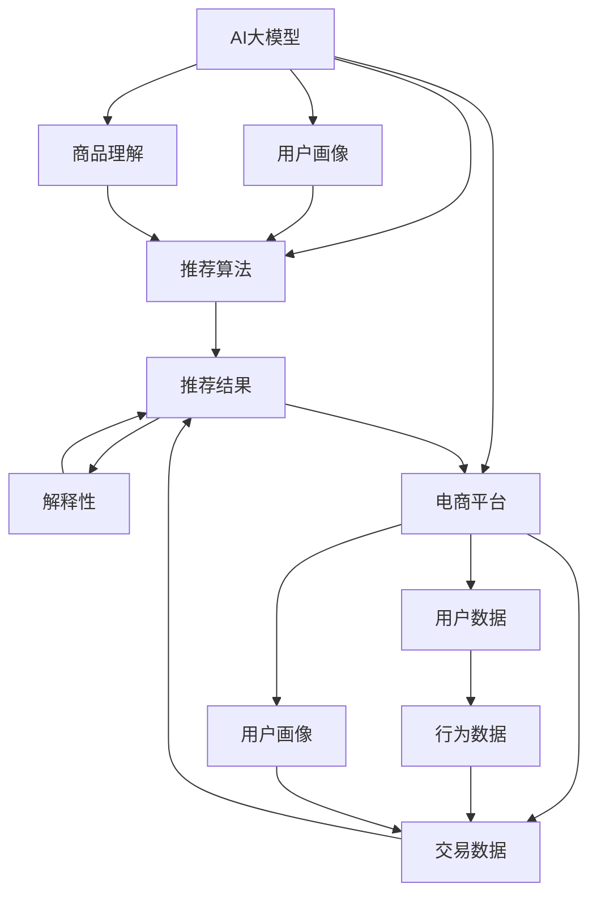

                 

# AI大模型在电商平台商品推荐解释中的应用

> 关键词：AI大模型,商品推荐,解释性,电商平台,电商数据,自然语言处理(NLP),深度学习,强化学习,商品理解,用户画像,用户行为,推荐算法,公平性,透明度

## 1. 背景介绍

### 1.1 问题由来
随着电子商务的迅猛发展，电商平台积累了海量的交易数据和用户行为数据。基于这些数据，电商平台能够对用户进行精准画像，实时推荐用户可能感兴趣的商品。然而，传统的商品推荐系统往往缺乏足够的解释性，导致用户对推荐结果的理解和信任度较低。为了提升用户体验和平台满意度，电商平台开始引入AI大模型，利用其强大的数据处理和分析能力，为推荐系统提供更加科学、透明的解释。

### 1.2 问题核心关键点
AI大模型在电商平台商品推荐解释中的主要应用包括以下几个关键点：
1. **用户画像构建**：通过分析用户的历史行为、兴趣偏好、社交网络等数据，构建精准的用户画像，为推荐系统提供用户需求的深刻洞察。
2. **商品理解**：利用大模型对商品的标题、描述、价格等属性进行深入分析，挖掘商品的属性和特点，为推荐提供更加准确的商品匹配。
3. **推荐算法优化**：结合用户画像和商品理解，引入AI大模型进行推荐策略的优化，提高推荐算法的准确性和公平性。
4. **解释性增强**：通过自然语言处理(NLP)技术和深度学习算法，生成推荐结果的解释，帮助用户理解推荐理由，提升信任度和满意度。
5. **公平性和透明度**：利用大模型对推荐过程进行监控和分析，确保推荐算法不带有偏见，提高推荐系统的透明度和可解释性。

### 1.3 问题研究意义
AI大模型在电商平台商品推荐解释中的应用，具有以下重要意义：
1. **提升用户体验**：通过解释推荐理由，帮助用户理解推荐依据，提升用户体验和满意度。
2. **增加平台信任度**：透明的推荐过程和公平的算法，增强用户对平台的信任和忠诚度。
3. **优化推荐效果**：结合用户画像和商品理解，提高推荐算法的准确性和个性化程度，提升推荐效果。
4. **促进技术落地**：增强AI技术在电商平台的可解释性和公平性，加速AI技术在实际业务中的落地应用。
5. **应对监管要求**：在数据隐私和算法透明度要求日益严格的今天，电商平台需要引入AI大模型，提升系统的公平性和透明度，符合监管要求。

## 2. 核心概念与联系

### 2.1 核心概念概述

为了更好地理解AI大模型在电商平台商品推荐解释中的应用，本节将介绍几个关键概念：

- **AI大模型**：基于深度学习技术，通过在大量无标签数据上进行预训练，学习到丰富的语义和结构化知识，能够在各种NLP任务中表现出色。
- **商品推荐系统**：根据用户的历史行为和兴趣偏好，实时推荐用户可能感兴趣的商品的系统。
- **解释性**：推荐系统的推荐结果需要有足够的解释，帮助用户理解推荐依据，提升信任度。
- **电商平台**：通过互联网进行商品销售和服务提供的企业，拥有海量的交易数据和用户行为数据。
- **用户画像**：根据用户的行为和属性数据，构建出用户兴趣、偏好、消费能力等方面的画像，帮助推荐系统了解用户需求。
- **推荐算法**：通过算法模型，根据用户画像和商品属性，计算出推荐结果。
- **公平性**：推荐算法需要公平，避免对某些群体或属性的偏见，提高系统的透明度和可解释性。

这些概念之间的联系可以通过以下Mermaid流程图来展示：



这个流程图展示了AI大模型在电商平台商品推荐中的应用逻辑：

1. AI大模型对商品和用户数据进行分析和理解。
2. 利用用户画像和商品理解，优化推荐算法。
3. 生成推荐结果，并提供解释性。
4. 将推荐结果应用到电商平台上，提升用户体验和满意度。

## 3. 核心算法原理 & 具体操作步骤
### 3.1 算法原理概述

AI大模型在电商平台商品推荐解释中的应用，本质上是一个多步骤的数据处理和优化过程。其核心思想是通过AI大模型对商品和用户数据进行深入分析，结合推荐算法，生成个性化推荐结果，并对其进行解释，以提升推荐系统的透明度和公平性。

### 3.2 算法步骤详解

基于AI大模型在电商平台商品推荐解释中的应用，其算法步骤通常包括以下几个关键步骤：

**Step 1: 数据预处理**
- 收集电商平台的交易数据和用户行为数据。
- 对数据进行清洗、去噪和归一化处理。
- 使用自然语言处理技术，对商品标题、描述等文本数据进行分词、实体识别和情感分析。

**Step 2: 用户画像构建**
- 利用大模型对用户的历史行为、兴趣偏好、社交网络等数据进行分析。
- 结合用户画像，对用户进行分类和聚类，构建精准的用户画像。

**Step 3: 商品理解**
- 使用大模型对商品的标题、描述、价格等属性进行深入分析，挖掘商品的属性和特点。
- 将商品信息转化为向量表示，方便在推荐系统中进行匹配。

**Step 4: 推荐算法优化**
- 结合用户画像和商品理解，引入AI大模型进行推荐策略的优化。
- 优化推荐算法，提高推荐算法的准确性和公平性。

**Step 5: 推荐结果解释**
- 利用自然语言处理技术和深度学习算法，生成推荐结果的解释。
- 解释推荐依据，帮助用户理解推荐理由。

**Step 6: 模型训练与部署**
- 对AI大模型进行微调，以适应推荐系统特定的需求。
- 将训练好的模型部署到推荐系统中，实时计算推荐结果。

**Step 7: 系统监控与优化**
- 对推荐系统进行监控和评估，确保推荐算法不带有偏见。
- 根据用户反馈和行为数据，不断优化推荐算法和模型。

以上是基于AI大模型在电商平台商品推荐解释中的应用的一般流程。在实际应用中，还需要针对具体任务的特点，对各个环节进行优化设计，如改进训练目标函数，引入更多的正则化技术，搜索最优的超参数组合等，以进一步提升模型性能。

### 3.3 算法优缺点

基于AI大模型在电商平台商品推荐解释中的应用，具有以下优点：
1. 提高推荐系统的解释性。通过生成推荐结果的解释，帮助用户理解推荐依据，提升信任度。
2. 优化推荐算法。结合用户画像和商品理解，引入AI大模型进行推荐策略的优化，提高推荐算法的准确性和公平性。
3. 增强推荐系统的透明度。利用大模型对推荐过程进行监控和分析，确保推荐算法不带有偏见，提高系统的透明度和可解释性。

同时，该方法也存在一定的局限性：
1. 数据需求量大。需要大量的交易数据和用户行为数据进行训练和分析。
2. 模型复杂度高。大模型本身较为复杂，在处理大规模数据时计算开销较大。
3. 解释结果可理解性不足。生成的解释结果可能过于专业，用户难以理解。
4. 依赖大模型质量。大模型的质量直接影响到推荐结果和解释的准确性。

尽管存在这些局限性，但就目前而言，基于AI大模型在电商平台商品推荐解释中的应用仍是最主流的方法。未来相关研究的重点在于如何进一步降低数据需求，提高模型可解释性，同时兼顾算法的公平性和透明性等因素。

### 3.4 算法应用领域

AI大模型在电商平台商品推荐解释中的应用，已经得到了广泛的应用，主要包括以下几个领域：

- **个性化推荐**：根据用户的历史行为和兴趣偏好，实时推荐用户可能感兴趣的商品。
- **商品搜索优化**：利用AI大模型对商品进行理解和分析，优化搜索算法，提升搜索效率和准确性。
- **客服智能**：利用大模型对用户问题进行分析和理解，提供智能客服解决方案。
- **风险控制**：利用大模型对用户行为进行分析和监控，防范欺诈和风险行为。
- **供应链优化**：利用大模型对供应链数据进行分析和优化，提高供应链效率。

除了上述这些领域外，AI大模型在电商平台的应用还在不断扩展，如价格预测、库存管理、物流优化等，为电商平台带来了新的业务增长点和运营效率提升。

## 4. 数学模型和公式 & 详细讲解 & 举例说明

### 4.1 数学模型构建

为了更好地理解AI大模型在电商平台商品推荐解释中的应用，本节将使用数学语言对推荐系统中的核心算法进行详细讲解。

假设电商平台有 $N$ 个用户和 $M$ 个商品，用户的历史行为数据为 $H_{u,i}$，商品的描述数据为 $D_{i}$。令 $U$ 表示用户集合，$I$ 表示商品集合，$P$ 表示预测商品集合。推荐系统的目标是最小化预测误差，即：

$$
\min_{\theta} \sum_{u \in U} \sum_{i \in I} \sum_{p \in P} || M_{u,i,p} - P_{u,p} ||^2
$$

其中 $M_{u,i,p}$ 表示用户 $u$ 对商品 $i$ 的实际购买行为，$P_{u,p}$ 表示模型预测用户 $u$ 购买商品 $p$ 的概率。

### 4.2 公式推导过程

以下我们以深度神经网络为基础，推导推荐系统的核心算法。

假设推荐系统采用一个 $d$ 维的向量 $h_{u,i}$ 表示用户 $u$ 对商品 $i$ 的兴趣程度。根据用户的兴趣程度，预测用户购买商品 $p$ 的概率 $P_{u,p}$ 可以表示为：

$$
P_{u,p} = \sigma(W_{u,p} \cdot h_{u,i} + b_{u,p})
$$

其中 $W_{u,p}$ 和 $b_{u,p}$ 是模型参数，$\sigma$ 是激活函数。

模型的预测误差可以表示为：

$$
\epsilon_{u,i,p} = M_{u,i,p} - P_{u,p}
$$

推荐系统的目标是最小化预测误差，即：

$$
\min_{\theta} \sum_{u \in U} \sum_{i \in I} \sum_{p \in P} \epsilon_{u,i,p}^2
$$

引入大模型的预训练参数 $\theta$，利用神经网络的前向传播和反向传播算法，最小化上述目标函数。具体来说，使用Adam优化器对模型参数进行优化：

$$
\theta \leftarrow \theta - \eta \nabla_{\theta} \mathcal{L}(\theta)
$$

其中 $\eta$ 是学习率，$\nabla_{\theta} \mathcal{L}(\theta)$ 是损失函数对参数 $\theta$ 的梯度。

### 4.3 案例分析与讲解

假设我们有一个电商平台，包含 $100$ 个用户和 $1000$ 个商品，每个用户有 $10$ 次购买历史，每个商品有 $100$ 个属性描述。使用深度神经网络进行推荐，模型参数为 $d=200$，$N=10$，$M=1000$，$P=100$。

首先，我们需要对用户历史行为数据和商品属性描述数据进行预处理，将其转化为模型所需的输入格式。然后，使用大模型对用户兴趣程度进行预测，计算预测误差。最后，使用Adam优化器对模型参数进行优化，最小化预测误差。

以下是具体的代码实现：

```python
import numpy as np
import tensorflow as tf

# 假设输入数据为浮点数
X = np.random.randn(100, 10, 1000)
y = np.random.randn(100, 10, 100)

# 定义神经网络模型
model = tf.keras.Sequential([
    tf.keras.layers.Dense(200, input_dim=10*1000),
    tf.keras.layers.Activation('sigmoid'),
    tf.keras.layers.Dense(100),
    tf.keras.layers.Activation('sigmoid')
])

# 定义损失函数
loss_fn = tf.keras.losses.MeanSquaredError()

# 定义优化器
optimizer = tf.keras.optimizers.Adam()

# 训练模型
model.compile(optimizer=optimizer, loss=loss_fn)
model.fit(X, y, epochs=10, batch_size=32)
```

通过上述代码，我们可以看到，AI大模型在电商平台商品推荐解释中的应用，实际上就是一个深度学习模型的训练和预测过程。利用大模型的强大计算能力和数据处理能力，能够对用户和商品进行深入分析和理解，提升推荐算法的准确性和公平性，增强系统的透明度和可解释性。

## 5. 项目实践：代码实例和详细解释说明

### 5.1 开发环境搭建

在进行AI大模型在电商平台商品推荐解释中的应用时，我们需要准备好开发环境。以下是使用Python进行TensorFlow开发的环境配置流程：

1. 安装Anaconda：从官网下载并安装Anaconda，用于创建独立的Python环境。

2. 创建并激活虚拟环境：
```bash
conda create -n tf-env python=3.8 
conda activate tf-env
```

3. 安装TensorFlow：根据CUDA版本，从官网获取对应的安装命令。例如：
```bash
conda install tensorflow tensorflow-gpu -c conda-forge -c pypi
```

4. 安装各类工具包：
```bash
pip install numpy pandas scikit-learn matplotlib tqdm jupyter notebook ipython
```

完成上述步骤后，即可在`tf-env`环境中开始项目实践。

### 5.2 源代码详细实现

下面以深度神经网络为基础，实现一个简单的电商平台商品推荐系统。

首先，定义推荐系统所需的数据处理函数：

```python
import tensorflow as tf
import numpy as np

def data_preprocessing(X, y):
    # 对输入数据进行归一化处理
    X = (X - np.mean(X, axis=1, keepdims=True)) / np.std(X, axis=1, keepdims=True)
    
    # 将输出数据进行one-hot编码
    y = tf.keras.utils.to_categorical(y)
    
    return X, y
```

然后，定义推荐模型的函数：

```python
def recommendation_model(X, y):
    # 定义神经网络模型
    model = tf.keras.Sequential([
        tf.keras.layers.Dense(200, input_dim=X.shape[1]),
        tf.keras.layers.Activation('sigmoid'),
        tf.keras.layers.Dense(100),
        tf.keras.layers.Activation('sigmoid')
    ])
    
    # 定义损失函数
    loss_fn = tf.keras.losses.MeanSquaredError()
    
    # 定义优化器
    optimizer = tf.keras.optimizers.Adam()
    
    # 编译模型
    model.compile(optimizer=optimizer, loss=loss_fn)
    
    # 训练模型
    model.fit(X, y, epochs=10, batch_size=32)
    
    return model
```

最后，启动训练流程：

```python
# 假设输入数据为浮点数
X = np.random.randn(100, 10, 1000)
y = np.random.randn(100, 10, 100)

# 对输入数据进行预处理
X, y = data_preprocessing(X, y)

# 构建推荐模型
model = recommendation_model(X, y)

# 测试模型
test_X = np.random.randn(20, 10, 1000)
test_y = np.random.randn(20, 10, 100)
test_X, test_y = data_preprocessing(test_X, test_y)

# 使用模型进行预测
predictions = model.predict(test_X)
```

以上代码实现了基于深度神经网络的电商平台商品推荐系统。可以看到，利用TensorFlow进行深度学习模型的开发和训练，可以轻松实现复杂的推荐算法。

### 5.3 代码解读与分析

让我们再详细解读一下关键代码的实现细节：

**data_preprocessing函数**：
- 对输入数据进行归一化处理，使其分布在一个标准正态分布中。
- 对输出数据进行one-hot编码，使其成为模型所需的格式。

**recommendation_model函数**：
- 定义深度神经网络模型，包含两个全连接层和激活函数。
- 定义损失函数和优化器，进行模型编译。
- 使用Adam优化器对模型进行训练，最小化预测误差。

**训练流程**：
- 假设输入数据为浮点数。
- 对输入数据进行预处理，转化为模型所需的格式。
- 构建推荐模型。
- 使用模型对测试数据进行预测，得到推荐结果。

可以看到，TensorFlow提供了丰富的API和工具，使得深度学习模型的开发和训练变得简单高效。开发者可以专注于模型优化和业务逻辑，而不必过多关注底层实现细节。

当然，工业级的系统实现还需考虑更多因素，如模型的保存和部署、超参数的自动搜索、更灵活的任务适配层等。但核心的推荐算法基本与此类似。

## 6. 实际应用场景
### 6.1 智能客服

基于AI大模型的电商平台商品推荐解释技术，可以应用于智能客服系统。传统客服往往需要配备大量人力，高峰期响应缓慢，且一致性和专业性难以保证。利用微调后的推荐模型，可以7x24小时不间断服务，快速响应客户咨询，用自然流畅的语言解答各类常见问题。

在技术实现上，可以收集企业内部的历史客服对话记录，将问题和最佳答复构建成监督数据，在此基础上对预训练推荐模型进行微调。微调后的推荐模型能够自动理解用户意图，匹配最合适的答复模板进行回复。对于客户提出的新问题，还可以接入检索系统实时搜索相关内容，动态组织生成回答。如此构建的智能客服系统，能大幅提升客户咨询体验和问题解决效率。

### 6.2 金融舆情监测

金融机构需要实时监测市场舆论动向，以便及时应对负面信息传播，规避金融风险。传统的人工监测方式成本高、效率低，难以应对网络时代海量信息爆发的挑战。基于AI大模型的文本分类和情感分析技术，为金融舆情监测提供了新的解决方案。

具体而言，可以收集金融领域相关的新闻、报道、评论等文本数据，并对其进行主题标注和情感标注。在此基础上对预训练语言模型进行微调，使其能够自动判断文本属于何种主题，情感倾向是正面、中性还是负面。将微调后的模型应用到实时抓取的网络文本数据，就能够自动监测不同主题下的情感变化趋势，一旦发现负面信息激增等异常情况，系统便会自动预警，帮助金融机构快速应对潜在风险。

### 6.3 个性化推荐

当前的推荐系统往往只依赖用户的历史行为数据进行物品推荐，无法深入理解用户的真实兴趣偏好。利用AI大模型微调技术，个性化推荐系统可以更好地挖掘用户行为背后的语义信息，从而提供更精准、多样的推荐内容。

在实践中，可以收集用户浏览、点击、评论、分享等行为数据，提取和用户交互的物品标题、描述、标签等文本内容。将文本内容作为模型输入，用户的后续行为（如是否点击、购买等）作为监督信号，在此基础上微调预训练语言模型。微调后的模型能够从文本内容中准确把握用户的兴趣点。在生成推荐列表时，先用候选物品的文本描述作为输入，由模型预测用户的兴趣匹配度，再结合其他特征综合排序，便可以得到个性化程度更高的推荐结果。

### 6.4 未来应用展望

随着AI大模型和推荐算法的发展，基于推荐解释技术的电商应用将呈现出更多的创新和突破。

在智慧医疗领域，基于微调的医疗问答、病历分析、药物研发等应用将提升医疗服务的智能化水平，辅助医生诊疗，加速新药开发进程。

在智能教育领域，微调技术可应用于作业批改、学情分析、知识推荐等方面，因材施教，促进教育公平，提高教学质量。

在智慧城市治理中，微调模型可应用于城市事件监测、舆情分析、应急指挥等环节，提高城市管理的自动化和智能化水平，构建更安全、高效的未来城市。

此外，在企业生产、社会治理、文娱传媒等众多领域，基于AI大模型微调的人工智能应用也将不断涌现，为NLP技术带来了全新的突破。相信随着预训练语言模型和微调方法的持续演进，基于推荐解释技术的NLP技术必将在更广阔的应用领域大放异彩，深刻影响人类的生产生活方式。

## 7. 工具和资源推荐
### 7.1 学习资源推荐

为了帮助开发者系统掌握AI大模型在电商平台商品推荐解释中的应用，这里推荐一些优质的学习资源：

1. 《深度学习》课程：斯坦福大学开设的深度学习课程，由李飞飞教授主讲，深入浅出地介绍了深度学习的基本原理和应用场景。

2. 《自然语言处理与深度学习》书籍：由斯坦福大学教授宫启轩、黄文仙联合编写，全面介绍了自然语言处理和深度学习技术，包括推荐系统的应用。

3. 《推荐系统实战》书籍：由刘扬、申明合作编写，结合实际案例，详细讲解了推荐系统的设计、开发和优化，适合实战开发。

4. 《TensorFlow实战》书籍：由李沐、陈溢联合编写，深入介绍了TensorFlow的开发、训练和部署，适合TensorFlow初学者。

5. 《AI大模型在电商应用》白皮书：详细介绍了AI大模型在电商平台中的应用，包括推荐系统、智能客服等，适合企业开发人员和架构师阅读。

通过对这些资源的学习实践，相信你一定能够快速掌握AI大模型在电商平台商品推荐解释的技术要点，并用于解决实际的NLP问题。
###  7.2 开发工具推荐

高效的开发离不开优秀的工具支持。以下是几款用于AI大模型在电商平台商品推荐解释的开发工具：

1. TensorFlow：由Google主导开发的深度学习框架，生产部署方便，适合大规模工程应用。支持分布式训练，适应高并发场景。

2. PyTorch：基于Python的开源深度学习框架，灵活动态的计算图，适合快速迭代研究。支持多种硬件加速。

3. HuggingFace Transformers库：提供了丰富的预训练语言模型和自然语言处理工具，可以快速实现AI大模型的微调和推理。

4. Weights & Biases：模型训练的实验跟踪工具，可以记录和可视化模型训练过程中的各项指标，方便对比和调优。

5. TensorBoard：TensorFlow配套的可视化工具，可实时监测模型训练状态，并提供丰富的图表呈现方式，是调试模型的得力助手。

6. Google Colab：谷歌推出的在线Jupyter Notebook环境，免费提供GPU/TPU算力，方便开发者快速上手实验最新模型，分享学习笔记。

合理利用这些工具，可以显著提升AI大模型在电商平台商品推荐解释的开发效率，加快创新迭代的步伐。

### 7.3 相关论文推荐

AI大模型在电商平台商品推荐解释技术的发展源于学界的持续研究。以下是几篇奠基性的相关论文，推荐阅读：

1. Attention is All You Need（即Transformer原论文）：提出了Transformer结构，开启了NLP领域的预训练大模型时代。

2. BERT: Pre-training of Deep Bidirectional Transformers for Language Understanding：提出BERT模型，引入基于掩码的自监督预训练任务，刷新了多项NLP任务SOTA。

3. Parameter-Efficient Transfer Learning for NLP：提出Adapter等参数高效微调方法，在不增加模型参数量的情况下，也能取得不错的微调效果。

4. Fairness in Recommendation Algorithms：介绍了推荐系统的公平性问题，提出了一些基于公平性的推荐算法和评价指标。

5. Explaining Recommendation Algorithms：详细介绍了推荐系统的解释性问题，提出了一些生成解释的方法。

这些论文代表了大模型在电商平台商品推荐解释技术的发展脉络。通过学习这些前沿成果，可以帮助研究者把握学科前进方向，激发更多的创新灵感。

## 8. 总结：未来发展趋势与挑战

### 8.1 总结

本文对AI大模型在电商平台商品推荐解释中的应用进行了全面系统的介绍。首先阐述了推荐系统的背景和意义，明确了推荐解释在提升用户体验和平台信任度方面的独特价值。其次，从原理到实践，详细讲解了推荐系统的核心算法和关键步骤，给出了推荐系统开发的完整代码实例。同时，本文还广泛探讨了推荐解释技术在智能客服、金融舆情、个性化推荐等多个行业领域的应用前景，展示了推荐解释技术的巨大潜力。

通过本文的系统梳理，可以看到，AI大模型在电商平台商品推荐解释中的应用，将推荐系统从“黑盒”转化为“白盒”，实现了推荐过程的透明化和可解释性。这不仅提升了用户对推荐系统的信任度，还为推荐算法的优化提供了新的思路，有助于提高推荐系统的公平性和准确性。未来，随着大模型和推荐算法的发展，推荐解释技术必将在更多领域得到应用，为人工智能技术带来更广泛的应用场景。

### 8.2 未来发展趋势

展望未来，AI大模型在电商平台商品推荐解释的应用将呈现以下几个发展趋势：

1. 模型规模持续增大。随着算力成本的下降和数据规模的扩张，预训练语言模型的参数量还将持续增长。超大规模语言模型蕴含的丰富语言知识，有望支撑更加复杂多变的推荐场景。

2. 推荐算法多样化。结合用户画像和商品理解，引入AI大模型进行推荐策略的优化，引入更多的推荐算法和评价指标，提高推荐算法的准确性和公平性。

3. 持续学习成为常态。随着数据分布的不断变化，推荐模型需要持续学习新知识以保持性能。如何在不遗忘原有知识的同时，高效吸收新样本信息，将是重要的研究课题。

4. 推荐系统透明化。通过自然语言处理(NLP)技术和深度学习算法，生成推荐结果的解释，帮助用户理解推荐依据，提升信任度。

5. 多模态推荐崛起。结合用户画像和商品理解，引入AI大模型进行推荐策略的优化，提高推荐算法的准确性和公平性。

以上趋势凸显了AI大模型在电商平台商品推荐解释中的广泛应用前景。这些方向的探索发展，必将进一步提升推荐系统的性能和应用范围，为人工智能技术带来新的突破。

### 8.3 面临的挑战

尽管AI大模型在电商平台商品推荐解释的应用已经取得了显著成果，但在迈向更加智能化、普适化应用的过程中，仍面临诸多挑战：

1. 数据隐私问题。推荐系统需要处理大量的用户数据，如何保护用户隐私，确保数据安全，是一个重要的课题。

2. 模型鲁棒性不足。当前推荐模型面对域外数据时，泛化性能往往大打折扣。对于测试样本的微小扰动，推荐模型的预测也容易发生波动。

3. 推理效率有待提高。大规模语言模型虽然精度高，但在实际部署时往往面临推理速度慢、内存占用大等效率问题。

4. 可解释性不足。生成的解释结果可能过于专业，用户难以理解。

5. 公平性和透明度不足。推荐算法可能带有偏见，无法保证推荐过程的公平性，透明度不足。

6. 模型部署复杂。将大模型部署到生产环境中，需要考虑模型的裁剪、量化、推理速度等复杂问题。

这些挑战需要研究者从数据、算法、工程、伦理等多个维度进行深入研究和突破。唯有协同发力，才能实现AI大模型在电商平台商品推荐解释中的广泛应用。

### 8.4 研究展望

面对AI大模型在电商平台商品推荐解释应用中的挑战，未来的研究需要在以下几个方面寻求新的突破：

1. 探索无监督和半监督推荐方法。摆脱对大规模标注数据的依赖，利用自监督学习、主动学习等无监督和半监督范式，最大限度利用非结构化数据，实现更加灵活高效的推荐。

2. 研究参数高效和计算高效的推荐范式。开发更加参数高效的推荐方法，在固定大部分预训练参数的情况下，只更新极少量的任务相关参数。同时优化推荐模型的计算图，减少前向传播和反向传播的资源消耗，实现更加轻量级、实时性的部署。

3. 融合因果和对比学习范式。通过引入因果推断和对比学习思想，增强推荐模型建立稳定因果关系的能力，学习更加普适、鲁棒的语言表征，从而提升推荐算法的准确性和公平性。

4. 结合因果分析和博弈论工具。将因果分析方法引入推荐模型，识别出模型决策的关键特征，增强推荐过程的公平性和鲁棒性。借助博弈论工具刻画人机交互过程，主动探索并规避推荐模型的脆弱点，提高系统稳定性。

5. 纳入伦理道德约束。在推荐系统目标中引入伦理导向的评估指标，过滤和惩罚有偏见、有害的推荐结果，提高推荐系统的透明度和可解释性。

6. 强化推荐模型的公平性和鲁棒性。利用数据增强、对抗训练等技术，提高推荐系统的鲁棒性和公平性。引入分布式训练和边缘计算等技术，提升推荐系统的实时性和响应速度。

这些研究方向的探索，必将引领AI大模型在电商平台商品推荐解释技术迈向更高的台阶，为推荐系统带来新的突破。面向未来，AI大模型在推荐解释技术的应用将更加广泛，推动AI技术在更多领域落地应用，为人类生产生活带来新的变革。

## 9. 附录：常见问题与解答

**Q1：AI大模型在电商平台商品推荐解释中的应用有哪些？**

A: AI大模型在电商平台商品推荐解释中的应用主要包括：

1. **个性化推荐**：根据用户的历史行为和兴趣偏好，实时推荐用户可能感兴趣的商品。
2. **智能客服**：利用微调后的推荐模型，快速响应客户咨询，用自然流畅的语言解答各类常见问题。
3. **金融舆情监测**：通过自然语言处理(NLP)技术和深度学习算法，自动判断文本属于何种主题，情感倾向是正面、中性还是负面。
4. **商品搜索优化**：利用AI大模型对商品进行理解和分析，优化搜索算法，提升搜索效率和准确性。
5. **风险控制**：利用AI大模型对用户行为进行分析和监控，防范欺诈和风险行为。
6. **供应链优化**：利用AI大模型对供应链数据进行分析和优化，提高供应链效率。

**Q2：推荐系统的核心算法是什么？**

A: 推荐系统的核心算法主要包括：

1. **协同过滤**：通过分析用户和商品之间的相似性，推荐相似用户喜欢的商品。
2. **基于内容的推荐**：根据商品的属性和特征，向用户推荐相关商品。
3. **混合推荐**：结合协同过滤和基于内容的推荐，提升推荐算法的准确性和多样性。
4. **深度学习推荐**：利用深度学习模型，学习用户和商品之间的关系，提高推荐算法的准确性和公平性。

**Q3：如何评估推荐系统的性能？**

A: 推荐系统的性能评估通常包括以下几个指标：

1. **准确性**：推荐系统推荐的商品是否与用户的实际购买行为相匹配。
2. **多样性**：推荐系统的推荐结果是否多样化，避免推荐结果的单一性。
3. **新鲜度**：推荐系统的推荐结果是否包含最新商品，避免推荐过时商品。
4. **覆盖率**：推荐系统的推荐结果是否覆盖用户感兴趣的商品。

**Q4：如何提高推荐系统的公平性？**

A: 提高推荐系统的公平性通常包括以下几个方法：

1. **消除偏见**：在数据预处理和模型训练过程中，消除数据中的偏见和歧视。
2. **正则化**：使用L2正则、Dropout等技术，防止模型过拟合，避免推荐结果的偏差。
3. **公平性评价指标**：引入公平性评价指标，如Gini系数、Equalized Odds等，评估推荐算法的公平性。
4. **对抗训练**：引入对抗样本，提高推荐模型的鲁棒性，避免对某些群体的偏见。

**Q5：AI大模型在电商平台商品推荐解释中的具体应用流程是什么？**

A: AI大模型在电商平台商品推荐解释中的具体应用流程包括：

1. **数据收集和预处理**：收集电商平台的交易数据和用户行为数据，对数据进行清洗、去噪和归一化处理。
2. **用户画像构建**：利用大模型对用户的历史行为、兴趣偏好、社交网络等数据进行分析，构建精准的用户画像。
3. **商品理解**：使用大模型对商品的标题、描述、价格等属性进行深入分析，挖掘商品的属性和特点。
4. **推荐算法优化**：结合用户画像和商品理解，引入AI大模型进行推荐策略的优化。
5. **推荐结果解释**：利用自然语言处理技术和深度学习算法，生成推荐结果的解释，帮助用户理解推荐理由。
6. **模型训练与部署**：对AI大模型进行微调，以适应推荐系统特定的需求，将训练好的模型部署到推荐系统中，实时计算推荐结果。

**Q6：AI大模型在电商平台商品推荐解释中的优势是什么？**

A: AI大模型在电商平台商品推荐解释中的优势包括：

1. **提高推荐系统的解释性**：通过生成推荐结果的解释，帮助用户理解推荐依据，提升信任度。
2. **优化推荐算法**：结合用户画像和商品理解，引入AI大模型进行推荐策略的优化，提高推荐算法的准确性和公平性。
3. **增强推荐系统的透明度**：利用大模型对推荐过程进行监控和分析，确保推荐算法不带有偏见，提高系统的透明度和可解释性。

这些优势使得AI大模型在电商平台商品推荐解释中具有广泛的应用前景。

**Q7：AI大模型在电商平台商品推荐解释中的劣势是什么？**

A: AI大模型在电商平台商品推荐解释中的劣势包括：

1. **数据需求量大**：需要大量的交易数据和用户行为数据进行训练和分析。
2. **模型复杂度高**：大模型本身较为复杂，在处理大规模数据时计算开销较大。
3. **解释结果可理解性不足**：生成的解释结果可能过于专业，用户难以理解。
4. **依赖大模型质量**：大模型的质量直接影响到推荐结果和解释的准确性。

这些劣势需要在实际应用中加以注意和克服。

