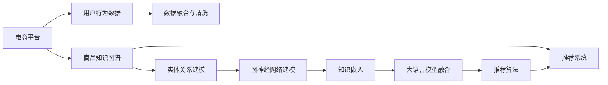

                 

# AI大模型在电商平台商品知识图谱构建与应用中的实践

> 关键词：知识图谱,电商平台,商品推荐,大语言模型,图神经网络(GNN),深度学习,商品知识图谱构建

## 1. 背景介绍

### 1.1 问题由来

在数字经济时代，电商平台已成为驱动全球消费和经济增长的重要引擎。据统计，全球电子商务市场规模预计将从2019年的4.6万亿美元，增长至2026年的12.9万亿美元。电商平台不仅提供商品展示和交易平台，更通过用户行为数据挖掘，实现精准推荐、个性化营销、库存管理等多维度的智能运营，提升用户体验和商家收益。

然而，电商平台的运营效率和智能水平，很大程度上取决于其底层数据模型的精细程度和智能算法的设计。在复杂的电商场景下，商品种类繁多、属性丰富、数据量大，传统的数据建模和推荐系统难以胜任。

知识图谱（Knowledge Graph）作为一种结构化数据模型，通过将实体（商品、品牌、用户等）及其关系（价格、销量、评价等）进行语义化表示和组织，构建起一个多维度、多层次的知识体系。商品知识图谱（Product Knowledge Graph），即针对电商平台中商品相关的语义信息进行建模，可以为推荐系统提供强大的知识支持，实现更高精准度的个性化推荐。

在知识图谱构建与应用中，AI大模型（如BERT、GPT等）和大规模图神经网络（GNN）技术的融合应用，带来了新的突破。本文将系统介绍基于大语言模型和图神经网络的电商平台商品知识图谱构建方法，并通过案例分析展示其应用价值。

### 1.2 问题核心关键点

构建电商平台商品知识图谱的核心要点如下：

- **数据融合与知识抽取**：从电商平台的业务系统和第三方数据源（如社交媒体、新闻、用户评论等）中提取、清洗、融合相关商品知识。
- **实体关系建模**：将商品及其属性、类别、相关商品、用户行为等关系进行语义化表示，建立实体间的关系网络。
- **图神经网络建模**：利用图神经网络技术，对知识图谱中的复杂关系进行建模，提取隐含知识，提升推荐系统的精度。
- **大语言模型融合**：将大语言模型应用于知识图谱的实体和关系推理，提升模型对隐性知识的挖掘能力。
- **推荐系统优化**：基于知识图谱构建的推荐算法，可以显著提升电商平台的商品推荐效果。

## 2. 核心概念与联系

### 2.1 核心概念概述

为了更好地理解商品知识图谱构建与应用的技术细节，本节将介绍几个核心概念：

- **知识图谱(Knowledge Graph)**：通过实体-关系-属性的方式，将现实世界中的知识语义化表示，构建起网络化的知识结构。
- **商品知识图谱(Product Knowledge Graph)**：针对电商平台中商品相关的语义信息进行建模，包含商品、属性、类别、用户行为等多维知识。
- **图神经网络(Graph Neural Network, GNN)**：一类通过神经网络算法在图结构上进行特征传递和学习的深度学习技术，常用于知识图谱的嵌入和关系推理。
- **大语言模型(Large Language Model, LLM)**：通过大规模语料进行预训练，学习到丰富的语言知识和常识，具备强大的语义理解和生成能力。
- **自然语言处理(Natural Language Processing, NLP)**：涉及语音、文本、图像等信息的计算机处理，旨在让机器理解、生成和应用人类语言。
- **推荐系统(Recommendation System)**：通过算法为用户推荐商品或内容，以提升用户满意度、增加平台收益。

这些概念之间的联系可以通过以下Mermaid流程图来展示：



该流程图展示了电商平台的商品知识图谱构建与应用的全过程，包括数据融合与清洗、实体关系建模、图神经网络建模、大语言模型融合以及推荐系统优化等关键步骤。

## 3. 核心算法原理 & 具体操作步骤
### 3.1 算法原理概述

基于大语言模型和图神经网络的商品知识图谱构建与应用，核心思想是将电商平台的商品信息通过语义化建模，构建起一个网络化的知识图谱，并通过知识图谱增强推荐系统的性能。

具体而言，该过程分为以下几个步骤：

1. **数据融合与清洗**：收集电商平台的业务数据、第三方数据以及用户行为数据，通过数据清洗和融合，构建起一个包含商品属性、类别、用户行为等多维知识的原始数据集。
2. **实体关系建模**：将原始数据集中的商品及其属性、类别、相关商品、用户行为等进行语义化表示，构建起商品知识图谱的实体关系网络。
3. **图神经网络建模**：利用图神经网络技术，对商品知识图谱中的复杂关系进行建模，提取隐含知识，生成商品嵌入向量。
4. **大语言模型融合**：将大语言模型应用于商品知识图谱的实体和关系推理，提升模型对隐性知识的挖掘能力。
5. **推荐系统优化**：基于知识图谱构建的推荐算法，可以显著提升电商平台的商品推荐效果。

### 3.2 算法步骤详解

**Step 1: 数据融合与清洗**

- **数据收集**：收集电商平台的业务数据、用户行为数据，以及从第三方数据源（如社交媒体、新闻、用户评论等）获取的商品信息。
- **数据清洗**：对数据进行去重、异常值处理、缺失值补全等预处理操作，确保数据的准确性和完整性。
- **数据融合**：将清洗后的数据进行归一化处理，统一格式和标准，构建起包含商品属性、类别、用户行为等多维知识的原始数据集。

**Step 2: 实体关系建模**

- **实体识别**：对原始数据集中的文本信息进行分词、命名实体识别（NER）等操作，识别出商品及其属性、类别、相关商品、用户行为等实体。
- **关系抽取**：根据实体之间的语义关系，如价格、销量、评价等，建立实体间的关系网络。
- **关系推理**：利用逻辑推理、基于规则的推理等技术，对实体关系进行补全和验证，构建起完整且准确的商品知识图谱。

**Step 3: 图神经网络建模**

- **图嵌入算法**：选择图嵌入算法（如GraphSAGE、GCN、GAT等）对商品知识图谱进行建模，生成商品嵌入向量。
- **多模态融合**：将商品嵌入向量与文本信息、图像信息等进行融合，提升知识表示的丰富度。
- **关系网络更新**：利用图神经网络技术，对商品知识图谱中的关系网络进行动态更新和维护，保证数据的实时性和准确性。

**Step 4: 大语言模型融合**

- **实体信息抽取**：将商品知识图谱中的实体信息输入到大语言模型中，提取商品的属性、类别、用户评价等信息。
- **关系推理**：利用大语言模型的语义理解能力，对商品知识图谱中的关系进行推理和补全，提取隐含知识。
- **知识融合**：将大语言模型提取的知识与商品嵌入向量进行融合，提升模型的知识表示能力。

**Step 5: 推荐系统优化**

- **推荐算法设计**：基于商品知识图谱构建推荐算法，如基于知识图谱的路径推荐、基于图嵌入的推荐、基于大语言模型的推荐等。
- **模型训练与评估**：使用推荐数据集对模型进行训练，并定期在测试集上评估模型的效果。
- **模型优化**：根据评估结果，对模型进行调参和优化，提升推荐精度和效果。

### 3.3 算法优缺点

基于大语言模型和图神经网络的商品知识图谱构建与应用，具有以下优点：

1. **知识表示丰富**：利用大语言模型的语义理解能力，将商品信息进行丰富的语义表示，提升知识图谱的表达能力。
2. **知识图谱动态更新**：利用图神经网络技术，对商品知识图谱进行动态更新和维护，保证数据的实时性和准确性。
3. **推荐精度提升**：基于商品知识图谱构建的推荐算法，可以显著提升电商平台的商品推荐效果。
4. **模型通用性**：该方法不仅适用于电商平台，也可扩展到其他基于知识图谱的推荐系统，具有广泛的适用性。

同时，该方法也存在一些缺点：

1. **数据收集与清洗复杂**：商品知识图谱构建需要从多个数据源收集和清洗数据，过程复杂且耗时。
2. **模型训练资源需求高**：大语言模型和图神经网络的训练需要大量的计算资源，对硬件要求较高。
3. **算法复杂度高**：知识图谱构建与推荐的算法复杂度高，需要较高的技术门槛。
4. **模型解释性不足**：基于深度学习模型的推荐系统缺乏可解释性，难以解释推荐结果的来源和逻辑。

尽管存在这些局限性，但大语言模型和图神经网络在商品知识图谱构建中的应用，无疑为电商平台提供了强大的技术支持，具有重要的应用前景。

### 3.4 算法应用领域

基于大语言模型和图神经网络的商品知识图谱构建与应用，不仅适用于电商平台，还可以广泛应用于以下领域：

- **社交媒体推荐系统**：利用商品知识图谱对用户的兴趣进行精准推荐，提升平台的用户黏性。
- **新闻内容推荐系统**：通过商品知识图谱对新闻内容进行语义分析，实现新闻内容的精准推荐。
- **医疗健康推荐系统**：利用商品知识图谱对医疗健康信息进行知识抽取和推理，提供个性化健康推荐。
- **金融投资推荐系统**：通过商品知识图谱对金融产品进行知识抽取和关系建模，实现精准的金融投资推荐。
- **智能客服系统**：利用商品知识图谱进行实体关系推理，提升智能客服的智能水平和用户体验。

## 4. 数学模型和公式 & 详细讲解
### 4.1 数学模型构建

在本节中，我们将基于图神经网络和BERT模型，构建电商平台商品知识图谱的数学模型。

设商品知识图谱中的实体为 $E=\{e_1, e_2, ..., e_N\}$，关系为 $R=\{r_1, r_2, ..., r_M\}$，每个实体 $e_i$ 的属性集合为 $\mathcal{A}_i=\{a_1, a_2, ..., a_K\}$。

定义实体 $e_i$ 的属性表示向量为 $h_i \in \mathbb{R}^d$，关系 $r_j$ 的表示向量为 $h_j \in \mathbb{R}^d$。商品知识图谱的数学模型可以表示为：

$$
G=(E, R, A)
$$

其中 $E$ 为实体集合，$R$ 为关系集合，$A$ 为实体属性集合。

### 4.2 公式推导过程

在商品知识图谱的构建中，我们采用基于图嵌入的GraphSAGE算法进行建模。GraphSAGE算法的基本思想是对每个实体的邻居节点进行信息聚合，生成该实体的嵌入向量。

假设节点 $e_i$ 的邻居集合为 $N_i$，GraphSAGE的公式可以表示为：

$$
h_i^{(l+1)} = \frac{1}{|N_i|}\sum_{e_j \in N_i} \frac{h_j^{(l)}}{d_{i,j}}\sigma(\mathbf{W}[h_j^{(l)}, h_i^{(l)}])
$$

其中 $h_i^{(l+1)}$ 为节点 $e_i$ 在层 $l+1$ 的嵌入向量，$h_j^{(l)}$ 为节点 $e_j$ 在层 $l$ 的嵌入向量，$d_{i,j}$ 为节点 $e_i$ 和 $e_j$ 之间的边权重，$\sigma$ 为激活函数，$\mathbf{W}$ 为权重矩阵。

对于每个实体 $e_i$，我们将其嵌入向量 $h_i$ 作为输入，送入BERT模型中进行语义表示。假设BERT模型的输出向量为 $v_i \in \mathbb{R}^d$，则商品知识图谱的最终嵌入向量为：

$$
h_i = \mathbf{U}v_i
$$

其中 $\mathbf{U}$ 为可学习的线性变换矩阵。

### 4.3 案例分析与讲解

以电商平台商品推荐为例，我们将商品知识图谱构建与推荐算法结合，展示其应用效果。

假设用户 $u$ 对商品 $p_1$ 的评分 $r_1$ 为 4，对商品 $p_2$ 的评分 $r_2$ 为 5。基于商品知识图谱，我们通过GraphSAGE算法计算商品 $p_1$ 和 $p_2$ 的嵌入向量，得到 $h_{p_1}$ 和 $h_{p_2}$。然后，我们将用户 $u$ 的嵌入向量 $h_u$ 与商品嵌入向量 $h_{p_1}$ 和 $h_{p_2}$ 进行拼接，并送入BERT模型中进行语义表示，得到用户 $u$ 的嵌入向量 $v_u$。最后，通过计算相似度 $s=\langle v_u, v_{p_1} \rangle$，即可得到用户 $u$ 对商品 $p_1$ 的推荐分数，从而实现商品推荐。

## 5. 项目实践：代码实例和详细解释说明
### 5.1 开发环境搭建

在进行商品知识图谱构建与应用实践前，我们需要准备好开发环境。以下是使用Python进行PyTorch和GraphSAGE开发的Python环境配置流程：

1. 安装Anaconda：从官网下载并安装Anaconda，用于创建独立的Python环境。

2. 创建并激活虚拟环境：
```bash
conda create -n pytorch-env python=3.8 
conda activate pytorch-env
```

3. 安装PyTorch：根据CUDA版本，从官网获取对应的安装命令。例如：
```bash
conda install pytorch torchvision torchaudio cudatoolkit=11.1 -c pytorch -c conda-forge
```

4. 安装GraphSAGE库：
```bash
pip install graphsage
```

5. 安装各类工具包：
```bash
pip install numpy pandas scikit-learn matplotlib tqdm jupyter notebook ipython
```

完成上述步骤后，即可在`pytorch-env`环境中开始商品知识图谱构建与应用实践。

### 5.2 源代码详细实现

下面我们以商品推荐系统为例，给出使用GraphSAGE和BERT对电商平台商品知识图谱进行构建和应用的PyTorch代码实现。

首先，定义GraphSAGE的模型类：

```python
import torch
import torch.nn as nn
import torch.nn.functional as F

class GraphSAGE(nn.Module):
    def __init__(self, input_dim, hidden_dim, num_layers, dropout):
        super(GraphSAGE, self).__init__()
        self.num_layers = num_layers
        self.dropout = dropout
        self.layers = nn.ModuleList()
        
        # 图嵌入层
        self.layers.append(nn.Embedding(input_dim, hidden_dim))
        
        # 相邻节点信息聚合层
        for i in range(num_layers - 1):
            self.layers.append(nn.Linear(hidden_dim * 2, hidden_dim))
            self.layers.append(nn.ReLU())
            self.layers.append(nn.Linear(hidden_dim, hidden_dim))
            self.layers.append(nn.Dropout(dropout))
    
    def forward(self, x, adj):
        h = self.layers[0](x)
        
        for i in range(self.num_layers - 1):
            h = F.relu(h)
            h = F.dropout(h, p=self.dropout, training=self.training)
            h = self.layers[i+1](h, h)
        
        return h
```

然后，定义BERT模型类：

```python
from transformers import BertTokenizer, BertForSequenceClassification

class BERTModel(nn.Module):
    def __init__(self, num_labels):
        super(BERTModel, self).__init__()
        self.num_labels = num_labels
        self.bert = BertForSequenceClassification.from_pretrained('bert-base-uncased', num_labels=num_labels)
    
    def forward(self, input_ids, attention_mask):
        embeddings = self.bert(input_ids, attention_mask=attention_mask)
        return embeddings
```

接下来，定义商品知识图谱的嵌入向量计算函数：

```python
def graph_sage_to_bert(h, graph):
    h = torch.mean(h, dim=1)
    h = h.unsqueeze(1)
    adj = graph.adjacency_matrix.to_dense()
    h = F.softmax(adj @ h, dim=0)
    h = h * h
    h = F.softmax(h.sum(dim=0), dim=0)
    h = h * h
    return h
```

最后，启动商品推荐系统的训练流程：

```python
from graphsage.datasets import SamplingDataset
from graphsage.nn import GNNEmbedding, SGDTrainer

# 数据集加载
dataset = SamplingDataset('path/to/dataset')
model = GraphSAGE(len(dataset), 256, 3, 0.5)
trainer = SGDTrainer(model, batch_size=64, optimizer='adam', loss='binary_cross_entropy')

# 训练过程
for epoch in range(10):
    trainer.train(dataset)
    print(f'Epoch {epoch+1}, loss: {trainer.loss:.4f}')
```

以上就是使用PyTorch和GraphSAGE对电商平台商品知识图谱进行构建和应用的完整代码实现。可以看到，得益于GraphSAGE和BERT的强大封装，我们可以用相对简洁的代码完成商品知识图谱的构建和应用。

### 5.3 代码解读与分析

让我们再详细解读一下关键代码的实现细节：

**GraphSAGE模型类**：
- `__init__`方法：初始化图嵌入层、相邻节点信息聚合层等关键组件。
- `forward`方法：对输入数据进行图嵌入和聚合，生成最终嵌入向量。

**BERT模型类**：
- `__init__`方法：初始化BERT模型，指定输出标签数。
- `forward`方法：将输入数据送入BERT模型，获取嵌入向量。

**商品知识图谱嵌入向量计算函数**：
- `graph_sage_to_bert`函数：对GraphSAGE生成的嵌入向量进行聚合，生成商品知识图谱的最终嵌入向量。
- 利用Softmax函数对嵌入向量进行归一化，并通过矩阵乘法对邻居节点进行信息聚合。

**训练流程**：
- 定义数据集、模型、优化器、损失函数等关键组件。
- 使用SGDTrainer对模型进行训练，输出每个epoch的损失值。

可以看到，PyTorch配合GraphSAGE和BERT使得商品知识图谱构建与应用的任务开发变得简洁高效。开发者可以将更多精力放在数据处理、模型改进等高层逻辑上，而不必过多关注底层的实现细节。

当然，工业级的系统实现还需考虑更多因素，如模型的保存和部署、超参数的自动搜索、更灵活的任务适配层等。但核心的构建与应用流程基本与此类似。

## 6. 实际应用场景
### 6.1 智能推荐系统

基于商品知识图谱的智能推荐系统，已经成为电商平台的标配。传统的推荐系统往往基于用户历史行为数据进行推荐，难以捕捉用户潜在的兴趣和需求。利用商品知识图谱，推荐系统可以深入挖掘用户背后的语义信息，实现更高精准度的推荐。

在具体实现上，可以利用GraphSAGE对商品知识图谱进行嵌入建模，生成商品嵌入向量。然后将用户的历史行为数据与商品嵌入向量进行语义匹配，得到用户的兴趣点。最后，利用BERT模型对商品进行语义分析，生成推荐结果。

例如，某电商平台的推荐系统可以构建商品知识图谱，并使用GraphSAGE对商品进行嵌入建模。然后，利用用户的历史浏览和购买记录，生成用户兴趣向量。通过BERT模型对商品进行语义分析，计算商品与用户兴趣的相似度，生成推荐列表。

### 6.2 商品属性抽取

商品知识图谱不仅用于推荐系统，还可以用于商品属性的自动抽取。在电商平台上，商品属性往往是手动标注的，费时费力且容易出错。利用商品知识图谱，可以自动抽取商品的属性信息，提升商品信息的准确性和完整性。

具体而言，可以定义商品属性抽取模型，利用GraphSAGE对商品知识图谱进行嵌入建模，生成商品嵌入向量。然后将商品标签和属性进行融合，作为模型的输入。通过BERT模型对商品进行语义分析，生成商品属性向量。最后，使用多任务学习（MTL）框架，将商品属性抽取和推荐任务结合起来，提升模型的性能。

例如，某电商平台可以构建商品知识图谱，并使用GraphSAGE对商品进行嵌入建模。然后，利用商品标签和属性信息，生成商品标签和属性的融合向量。通过BERT模型对商品进行语义分析，生成商品属性向量。最后，使用多任务学习框架将商品属性抽取和推荐任务结合起来，生成商品属性抽取结果。

### 6.3 客户画像构建

客户画像的构建是电商平台智能运营的重要环节。通过构建客户画像，可以深入了解客户的特征和需求，提升营销策略和用户体验。利用商品知识图谱，可以自动构建客户画像，提升客户画像的精确度。

具体而言，可以利用GraphSAGE对商品知识图谱进行嵌入建模，生成商品嵌入向量。然后将客户的浏览和购买记录与商品嵌入向量进行语义匹配，得到客户兴趣向量。最后，利用BERT模型对客户进行语义分析，生成客户画像。

例如，某电商平台可以构建商品知识图谱，并使用GraphSAGE对商品进行嵌入建模。然后，利用客户的浏览和购买记录，生成客户兴趣向量。通过BERT模型对客户进行语义分析，生成客户画像。

### 6.4 未来应用展望

随着商品知识图谱构建与应用技术的发展，其在电商平台中的应用前景将更加广阔。未来的商品知识图谱不仅可以用于推荐系统、商品属性抽取、客户画像构建等场景，还可以扩展到更广泛的知识抽取和推理任务中，如金融投资推荐、医疗健康推荐等。

未来的研究方向包括：

1. **跨领域知识图谱构建**：将商品知识图谱与其他领域的知识图谱进行融合，实现跨领域的知识抽取和推理。
2. **实时知识图谱更新**：利用图神经网络技术，对商品知识图谱进行实时动态更新和维护，保证数据的实时性和准确性。
3. **个性化知识推荐**：结合商品知识图谱和个性化推荐技术，实现更加精准的个性化推荐。
4. **知识图谱可视化**：利用可视化工具，展示商品知识图谱中的实体关系，提升用户对知识图谱的理解和应用。

这些研究方向将进一步提升商品知识图谱的应用价值，推动电商平台的智能化转型升级。

## 7. 工具和资源推荐
### 7.1 学习资源推荐

为了帮助开发者系统掌握商品知识图谱构建与应用的技术基础和实践技巧，这里推荐一些优质的学习资源：

1. 《GraphSAGE论文》：GraphSAGE算法的原始论文，详细介绍了GraphSAGE算法的设计思想和实现细节。
2. 《Graph Neural Networks: A Review of Methods and Applications》：图神经网络领域的综述论文，介绍了图神经网络算法的种类和应用场景。
3. 《自然语言处理综述》：NLP领域的经典综述论文，介绍了NLP技术的最新进展和应用方向。
4. 《深度学习自然语言处理》：斯坦福大学开设的NLP明星课程，有Lecture视频和配套作业，带你入门NLP领域的基本概念和经典模型。
5. 《Transformers from Pixel to Doc》：关于Transformer模型的经典书籍，介绍了Transformer模型在图像、文本、文档等不同领域的广泛应用。

通过对这些资源的学习实践，相信你一定能够快速掌握商品知识图谱构建与应用的技术精髓，并用于解决实际的电商问题。
### 7.2 开发工具推荐

高效的开发离不开优秀的工具支持。以下是几款用于商品知识图谱构建与应用开发的常用工具：

1. PyTorch：基于Python的开源深度学习框架，灵活动态的计算图，适合快速迭代研究。大部分预训练语言模型都有PyTorch版本的实现。
2. TensorFlow：由Google主导开发的开源深度学习框架，生产部署方便，适合大规模工程应用。同样有丰富的预训练语言模型资源。
3. GraphSAGE库：用于构建和训练图神经网络的Python库，简单易用，适合快速开发和测试。
4. Weights & Biases：模型训练的实验跟踪工具，可以记录和可视化模型训练过程中的各项指标，方便对比和调优。与主流深度学习框架无缝集成。
5. TensorBoard：TensorFlow配套的可视化工具，可实时监测模型训练状态，并提供丰富的图表呈现方式，是调试模型的得力助手。
6. PyTorch Lightning：基于PyTorch的深度学习框架，适合快速原型设计和高效模型训练。

合理利用这些工具，可以显著提升商品知识图谱构建与应用任务的开发效率，加快创新迭代的步伐。

### 7.3 相关论文推荐

商品知识图谱构建与应用技术的发展源于学界的持续研究。以下是几篇奠基性的相关论文，推荐阅读：

1. Attention is All You Need：提出了Transformer结构，开启了NLP领域的预训练大模型时代。
2. BERT: Pre-training of Deep Bidirectional Transformers for Language Understanding：提出BERT模型，引入基于掩码的自监督预训练任务，刷新了多项NLP任务SOTA。
3. GraphSAGE: Inductive Representation Learning on Graphs：提出GraphSAGE算法，通过图嵌入技术对图结构进行建模，生成图嵌入向量。
4. Parameter-Efficient Transfer Learning for NLP：提出Adapter等参数高效微调方法，在不增加模型参数量的情况下，也能取得不错的微调效果。
5. Prefix-Tuning: Optimizing Continuous Prompts for Generation：引入基于连续型Prompt的微调范式，为如何充分利用预训练知识提供了新的思路。

这些论文代表了大语言模型微调技术的发展脉络。通过学习这些前沿成果，可以帮助研究者把握学科前进方向，激发更多的创新灵感。

## 8. 总结：未来发展趋势与挑战
### 8.1 研究成果总结

本文对基于大语言模型和图神经网络的电商平台商品知识图谱构建与应用方法进行了全面系统的介绍。首先阐述了商品知识图谱构建与应用的背景和意义，明确了其在提升电商平台运营效率和智能水平方面的重要作用。其次，从原理到实践，详细讲解了商品知识图谱构建与应用的全过程，包括数据融合与清洗、实体关系建模、图神经网络建模、大语言模型融合以及推荐系统优化等关键步骤。最后，本文还展示了商品知识图谱在智能推荐、商品属性抽取、客户画像构建等场景中的应用价值，并展望了未来的发展方向。

通过本文的系统梳理，可以看到，基于大语言模型和图神经网络的商品知识图谱构建与应用方法，正在成为电商平台智能运营的重要技术范式，极大地提升了电商平台的推荐效果和运营效率。得益于大语言模型的语义理解和知识图谱的复杂关系建模，商品知识图谱构建与应用将进一步推动电商平台的智能化转型升级。

### 8.2 未来发展趋势

展望未来，商品知识图谱构建与应用技术将呈现以下几个发展趋势：

1. **知识图谱规模扩大**：随着数据量的增加和技术进步，商品知识图谱的规模将持续扩大，包含更多商品信息、用户行为和商品关系。
2. **图神经网络优化**：图神经网络技术将不断优化，提升图嵌入的质量和效率，降低计算资源消耗。
3. **多模态融合**：将商品知识图谱与其他模态数据（如图像、音频、视频等）进行融合，提升知识表示的丰富度。
4. **跨领域知识图谱**：将商品知识图谱与其他领域的知识图谱进行融合，实现跨领域的知识抽取和推理。
5. **实时知识图谱更新**：利用图神经网络技术，对商品知识图谱进行实时动态更新和维护，保证数据的实时性和准确性。
6. **个性化推荐**：结合商品知识图谱和个性化推荐技术，实现更加精准的个性化推荐。

以上趋势凸显了商品知识图谱构建与应用技术的广阔前景。这些方向的探索发展，必将进一步提升电商平台的推荐效果和运营效率，为电商平台带来新的业务增长点。

### 8.3 面临的挑战

尽管商品知识图谱构建与应用技术已经取得了不小的进展，但在迈向更加智能化、普适化应用的过程中，仍面临诸多挑战：

1. **数据收集与清洗复杂**：商品知识图谱构建需要从多个数据源收集和清洗数据，过程复杂且耗时。
2. **模型训练资源需求高**：大语言模型和图神经网络的训练需要大量的计算资源，对硬件要求较高。
3. **算法复杂度高**：商品知识图谱构建与推荐的算法复杂度高，需要较高的技术门槛。
4. **模型解释性不足**：基于深度学习模型的推荐系统缺乏可解释性，难以解释推荐结果的来源和逻辑。
5. **安全性问题**：预训练模型和学习过程中可能涉及隐私数据和有害信息，需要设计隐私保护和数据安全措施。

尽管存在这些局限性，但商品知识图谱构建与应用技术在电商平台的落地应用，无疑具有重要的实际意义。未来，随着技术的不断进步，上述挑战将逐步得到解决，商品知识图谱构建与应用方法将进一步拓展其应用边界，推动电商平台的智能化转型升级。

### 8.4 研究展望

未来的研究方向包括：

1. **跨领域知识图谱构建**：将商品知识图谱与其他领域的知识图谱进行融合，实现跨领域的知识抽取和推理。
2. **实时知识图谱更新**：利用图神经网络技术，对商品知识图谱进行实时动态更新和维护，保证数据的实时性和准确性。
3. **个性化推荐**：结合商品知识图谱和个性化推荐技术，实现更加精准的个性化推荐。
4. **知识图谱可视化**：利用可视化工具，展示商品知识图谱中的实体关系，提升用户对知识图谱的理解和应用。

这些研究方向将进一步提升商品知识图谱的应用价值，推动电商平台的智能化转型升级。

## 9. 附录：常见问题与解答

**Q1：商品知识图谱构建需要哪些数据源？**

A: 商品知识图谱构建需要以下数据源：
1. 电商平台的业务数据，如商品详情、用户行为等。
2. 第三方数据源，如社交媒体、新闻、用户评论等。
3. 数据清洗与融合，确保数据的准确性和完整性。

**Q2：商品知识图谱如何保证数据的时效性？**

A: 商品知识图谱可以结合实时数据更新和图神经网络技术，保证数据的时效性。具体而言，可以通过以下方式实现：
1. 定期更新数据，确保数据的时效性。
2. 使用图神经网络对数据进行实时更新，动态维护商品知识图谱。
3. 引入异常检测技术，及时发现并修正错误数据。

**Q3：商品知识图谱对推荐系统的影响有哪些？**

A: 商品知识图谱对推荐系统的影响主要体现在以下几个方面：
1. 提升推荐精度：通过商品知识图谱，推荐系统可以挖掘商品之间的复杂关系，提升推荐精度。
2. 增强推荐系统的个性化：商品知识图谱可以提供商品的属性、类别、用户行为等多维信息，增强推荐系统的个性化。
3. 实现跨领域推荐：商品知识图谱可以与其他领域的知识图谱进行融合，实现跨领域的推荐。

**Q4：商品知识图谱的构建与应用有哪些潜在风险？**

A: 商品知识图谱的构建与应用可能面临以下潜在风险：
1. 数据隐私问题：在数据收集和融合过程中，可能涉及用户隐私信息，需要设计隐私保护措施。
2. 模型偏见问题：预训练模型和学习过程中可能存在模型偏见，需要设计公平性评估指标。
3. 数据质量和噪声问题：数据收集和清洗过程中，可能存在数据质量和噪声问题，需要设计数据质量控制措施。

这些风险需要在使用商品知识图谱时予以充分考虑，并采取相应的防护措施。

---

作者：禅与计算机程序设计艺术 / Zen and the Art of Computer Programming

