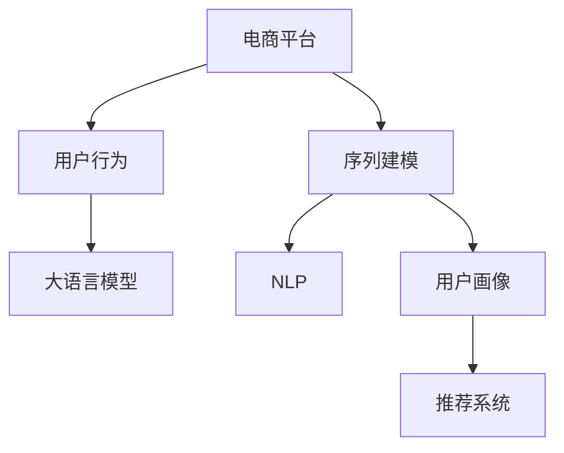

                 

# AI大模型在电商平台用户行为序列建模中的作用

> 关键词：电商平台,用户行为,序列建模,大语言模型,自然语言处理(NLP),用户画像,推荐系统

## 1. 背景介绍

### 1.1 问题由来
在电商平台中，用户的购买行为受多种因素影响，如商品价格、广告推荐、用户兴趣、社交网络等。为了精准捕捉用户的长期行为模式，通常需要构建用户行为序列模型。用户行为序列建模能够揭示用户在不同时间点的购物决策过程，为电商平台的个性化推荐、精准营销提供数据支持。传统方法通过统计模型、时间序列模型等对用户行为进行建模，但受限于模型复杂度和训练数据量，效果往往不尽如人意。近年来，基于深度学习的大模型技术在用户行为序列建模中逐渐崭露头角，成为电商领域的热门研究方向。

### 1.2 问题核心关键点
1. **电商数据分析**：电商数据分析主要涉及用户行为数据的收集、处理和分析。数据来源包括用户浏览记录、购买记录、评论数据等，数据量庞大且复杂。
2. **用户行为序列建模**：通过对用户历史行为数据建模，挖掘用户的购买偏好和行为规律，并根据用户当前的上下文信息预测其未来的行为。
3. **大语言模型应用**：利用大语言模型如BERT、GPT等进行文本特征提取和用户画像构建，提升模型性能。
4. **推荐系统优化**：结合用户行为序列模型和推荐算法，为用户提供个性化的商品推荐。
5. **性能评估与优化**：通过各种指标评估模型性能，优化模型参数，提升推荐效果。

## 2. 核心概念与联系

### 2.1 核心概念概述

为了深入理解大模型在电商平台用户行为序列建模中的应用，本文首先介绍几个核心概念：

1. **电商平台**：指在线零售平台，包括淘宝、京东、亚马逊等。用户可以在线浏览、购买商品，平台提供物流、客服、支付等服务。
2. **用户行为**：指用户在平台上的所有交互行为，如浏览商品、点击商品、加入购物车、下订单、支付、评价等。
3. **序列建模**：指对一系列时间点上的数据进行建模，揭示数据之间的时序关系。
4. **大语言模型**：指基于深度学习的大型预训练语言模型，如BERT、GPT等。大语言模型通过大规模无标签文本数据预训练，具备强大的语言理解能力。
5. **自然语言处理(NLP)**：指让计算机理解、处理、生成人类语言的技术。NLP技术是构建电商平台用户行为序列模型的重要工具。
6. **用户画像**：指通过分析用户行为数据，构建用户兴趣、偏好、需求等画像，用于个性化推荐和精准营销。
7. **推荐系统**：指根据用户历史行为和当前兴趣，向用户推荐最合适的商品。推荐系统是电商平台的核心应用之一。

这些核心概念之间的逻辑关系可以通过以下Mermaid流程图来展示：



这个流程图展示了大模型在电商平台用户行为序列建模中的应用流程：

1. 电商平台通过用户行为数据收集，获得用户的浏览、点击、购买等行为序列。
2. 使用大语言模型对用户行为序列进行特征提取，构建用户画像。
3. NLP技术用于处理用户评论、商品描述等文本数据，增强模型的语义理解能力。
4. 将用户画像和文本特征作为输入，进行序列建模，预测用户未来的行为。
5. 结合推荐算法，为用户提供个性化的商品推荐。

## 3. 核心算法原理 & 具体操作步骤
### 3.1 算法原理概述

大语言模型在电商平台用户行为序列建模中主要应用于用户画像构建和行为序列预测。具体流程如下：

1. **用户画像构建**：通过大语言模型对用户行为数据进行特征提取，生成用户兴趣、偏好、需求等特征向量，用于表示用户画像。
2. **行为序列预测**：使用序列建模方法，对用户历史行为序列进行建模，预测用户未来的购买行为。

用户画像构建过程如下：

- **步骤1：数据预处理**。对用户行为数据进行清洗、去重、标注等预处理，提取关键行为特征，如浏览时间、点击次数、购买金额等。
- **步骤2：特征提取**。使用大语言模型对用户行为数据进行向量化处理，生成高维特征向量。
- **步骤3：用户画像表示**。将用户特征向量作为用户画像，用于后续的行为序列建模和推荐系统。

行为序列预测过程如下：

- **步骤1：数据划分**。将用户历史行为数据划分为训练集和测试集。
- **步骤2：模型训练**。使用序列建模算法（如RNN、LSTM、GRU等）对用户行为序列进行建模，生成预测模型。
- **步骤3：性能评估**。在测试集上评估模型性能，调整模型参数，优化推荐效果。

### 3.2 算法步骤详解

以下以用户画像构建为例，详细阐述大语言模型在电商平台用户行为序列建模中的应用步骤：

1. **数据预处理**：
   - 清洗数据：去除噪声数据，如非法字符、无效记录等。
   - 特征提取：提取关键行为特征，如浏览时间、点击次数、购买金额等。
   - 特征编码：将用户行为特征转化为模型可接受的数值型特征。
   - 特征归一化：对特征进行归一化处理，避免数据规模不一致影响模型训练。

2. **特征提取**：
   - 分词与编码：使用自然语言处理技术对用户评论、商品描述等文本数据进行分词处理，生成标记序列。
   - 嵌入与编码：使用大语言模型（如BERT、GPT等）将标记序列转化为高维向量表示。
   - 特征融合：将用户数值型特征和高维向量特征进行融合，生成用户特征向量。

3. **用户画像表示**：
   - 特征拼接：将用户特征向量拼接起来，形成完整的用户画像向量。
   - 特征降维：对用户画像向量进行降维处理，降低维度，提高模型训练效率。
   - 特征存储：将用户画像向量存储到数据库或内存中，供后续行为序列预测使用。

### 3.3 算法优缺点

大语言模型在电商平台用户行为序列建模中的优点包括：

1. **丰富的语义信息**：大语言模型能够自动提取用户评论、商品描述中的语义信息，增强用户画像的表达能力。
2. **高效的特征提取**：大语言模型可以处理大规模文本数据，快速生成高维特征向量，提升模型训练效率。
3. **泛化能力强**：大语言模型具备较强的泛化能力，能够在不同用户、不同场景下进行稳定预测。
4. **可解释性强**：大语言模型输出的高维向量具有较强的可解释性，便于理解用户行为模式。

同时，大语言模型也存在一些缺点：

1. **计算资源消耗大**：大语言模型参数量庞大，训练和推理需要大量计算资源，可能导致性能瓶颈。
2. **数据依赖性强**：大语言模型的性能依赖于预训练语料的质量，对标注数据和无标签数据的依赖性较高。
3. **模型复杂度高**：大语言模型的计算图复杂，难以进行高效优化和调试。
4. **稳定性不足**：大语言模型容易受到输入噪声和数据偏差的影响，导致模型不稳定。

### 3.4 算法应用领域

大语言模型在电商平台用户行为序列建模中主要应用于以下几个领域：

1. **个性化推荐**：通过用户画像构建和行为序列预测，提供个性化的商品推荐，提升用户满意度。
2. **广告投放优化**：基于用户画像和行为序列，优化广告投放策略，提高广告投放效果。
3. **用户流失预警**：通过行为序列建模，识别用户流失风险，提前进行干预，降低用户流失率。
4. **价格敏感度分析**：分析用户对商品价格的敏感度，优化定价策略，提升销售收益。
5. **库存管理**：预测用户未来购买行为，优化库存管理，减少库存积压和缺货。

## 4. 数学模型和公式 & 详细讲解 & 举例说明（备注：数学公式请使用latex格式，latex嵌入文中独立段落使用 $$，段落内使用 $)
### 4.1 数学模型构建

在电商平台用户行为序列建模中，常见的大语言模型应用包括BERT、GPT等。本节以BERT模型为例，详细介绍其在大语言模型中的应用。

1. **用户评论文本预处理**：
   - 分词：将用户评论文本进行分词处理，生成标记序列。
   - 编码：使用BERT模型将标记序列转化为高维向量表示。

2. **用户画像向量生成**：
   - 特征拼接：将用户数值型特征和高维向量特征进行拼接，形成完整的用户画像向量。
   - 特征降维：对用户画像向量进行降维处理，降低维度，提高模型训练效率。

### 4.2 公式推导过程

以下是BERT模型用于电商平台用户行为序列建模的公式推导：

1. **标记序列编码**：
   - 将用户评论文本转化为标记序列，记为 $T=\{t_1, t_2, ..., t_n\}$。
   - 使用BERT模型对标记序列进行编码，得到高维向量表示 $E=\{e_1, e_2, ..., e_n\}$。

2. **用户画像向量生成**：
   - 将用户数值型特征和高维向量特征进行拼接，形成完整的用户画像向量 $U=\{u_1, u_2, ..., u_m\}$。
   - 对用户画像向量进行降维处理，得到低维特征向量 $V=\{v_1, v_2, ..., v_k\}$。

### 4.3 案例分析与讲解

以某电商平台用户行为数据为例，进行大语言模型在用户画像构建中的应用分析：

1. **数据预处理**：
   - 清洗用户评论数据，去除无效评论和噪声数据。
   - 提取关键行为特征，如浏览时间、点击次数、购买金额等。
   - 将用户行为特征转化为数值型特征，生成标记序列。

2. **特征提取**：
   - 使用BERT模型对标记序列进行编码，生成高维向量表示。
   - 将用户数值型特征和高维向量特征进行拼接，形成完整的用户画像向量。

3. **用户画像表示**：
   - 对用户画像向量进行降维处理，得到低维特征向量。
   - 将用户画像向量存储到数据库或内存中，供后续行为序列预测使用。

## 5. 项目实践：代码实例和详细解释说明
### 5.1 开发环境搭建

在进行大语言模型在电商平台用户行为序列建模的实践时，需要先准备好开发环境。以下是使用Python进行PyTorch开发的环境配置流程：

1. 安装Anaconda：从官网下载并安装Anaconda，用于创建独立的Python环境。

2. 创建并激活虚拟环境：
```bash
conda create -n pytorch-env python=3.8 
conda activate pytorch-env
```

3. 安装PyTorch：根据CUDA版本，从官网获取对应的安装命令。例如：
```bash
conda install pytorch torchvision torchaudio cudatoolkit=11.1 -c pytorch -c conda-forge
```

4. 安装Transformers库：
```bash
pip install transformers
```

5. 安装各类工具包：
```bash
pip install numpy pandas scikit-learn matplotlib tqdm jupyter notebook ipython
```

完成上述步骤后，即可在`pytorch-env`环境中开始项目实践。

### 5.2 源代码详细实现

以下是一个使用BERT模型进行用户画像构建的PyTorch代码实现：

```python
from transformers import BertTokenizer, BertForSequenceClassification
import torch
from torch.utils.data import Dataset
from torch.utils.data import DataLoader
from sklearn.metrics import accuracy_score, precision_score, recall_score, f1_score

# 定义数据集
class UserBehaviorDataset(Dataset):
    def __init__(self, text_data, label_data):
        self.tokenizer = BertTokenizer.from_pretrained('bert-base-uncased')
        self.text_data = text_data
        self.label_data = label_data
        
    def __len__(self):
        return len(self.text_data)
    
    def __getitem__(self, index):
        text = self.text_data[index]
        label = self.label_data[index]
        encoding = self.tokenizer(text, return_tensors='pt', truncation=True, padding='max_length')
        return {
            'input_ids': encoding['input_ids'],
            'attention_mask': encoding['attention_mask'],
            'labels': torch.tensor(label, dtype=torch.long)
        }

# 定义模型和优化器
model = BertForSequenceClassification.from_pretrained('bert-base-uncased', num_labels=2)
optimizer = torch.optim.Adam(model.parameters(), lr=1e-5)
tokenizer = BertTokenizer.from_pretrained('bert-base-uncased')

# 定义训练和评估函数
def train_epoch(model, dataset, optimizer):
    dataloader = DataLoader(dataset, batch_size=16, shuffle=True)
    model.train()
    epoch_loss = 0
    for batch in dataloader:
        input_ids = batch['input_ids'].to(device)
        attention_mask = batch['attention_mask'].to(device)
        labels = batch['labels'].to(device)
        model.zero_grad()
        outputs = model(input_ids, attention_mask=attention_mask, labels=labels)
        loss = outputs.loss
        epoch_loss += loss.item()
        loss.backward()
        optimizer.step()
    return epoch_loss / len(dataloader)

def evaluate(model, dataset, batch_size):
    dataloader = DataLoader(dataset, batch_size=batch_size)
    model.eval()
    preds, labels = [], []
    with torch.no_grad():
        for batch in dataloader:
            input_ids = batch['input_ids'].to(device)
            attention_mask = batch['attention_mask'].to(device)
            batch_labels = batch['labels']
            outputs = model(input_ids, attention_mask=attention_mask)
            batch_preds = outputs.logits.argmax(dim=1).to('cpu').tolist()
            batch_labels = batch_labels.to('cpu').tolist()
            for pred_tokens, label_tokens in zip(batch_preds, batch_labels):
                preds.append(pred_tokens[:len(label_tokens)])
                labels.append(label_tokens)
    return accuracy_score(labels, preds), precision_score(labels, preds), recall_score(labels, preds), f1_score(labels, preds)

# 加载数据集
train_dataset = UserBehaviorDataset(train_texts, train_labels)
test_dataset = UserBehaviorDataset(test_texts, test_labels)

# 开始训练
device = torch.device('cuda' if torch.cuda.is_available() else 'cpu')
model.to(device)
for epoch in range(10):
    loss = train_epoch(model, train_dataset, optimizer)
    print(f'Epoch {epoch+1}, train loss: {loss:.3f}')
    accuracy, precision, recall, f1 = evaluate(model, test_dataset, batch_size)
    print(f'Epoch {epoch+1}, test accuracy: {accuracy:.3f}, precision: {precision:.3f}, recall: {recall:.3f}, f1: {f1:.3f}')
```

### 5.3 代码解读与分析

让我们再详细解读一下关键代码的实现细节：

**UserBehaviorDataset类**：
- `__init__`方法：初始化分词器、文本数据和标签数据。
- `__len__`方法：返回数据集的样本数量。
- `__getitem__`方法：对单个样本进行处理，将文本输入编码为token ids，将标签转化为Tensor格式，返回模型所需的输入。

**模型和优化器定义**：
- 使用BertForSequenceClassification模型作为用户画像构建的基本模型，设置优化器。
- 使用BertTokenizer从预训练模型中加载分词器，确保分词一致性。

**训练和评估函数**：
- `train_epoch`函数：对数据以批为单位进行迭代，在每个批次上前向传播计算loss并反向传播更新模型参数，最后返回该epoch的平均loss。
- `evaluate`函数：与训练类似，不同点在于不更新模型参数，并在每个batch结束后将预测和标签结果存储下来，最后使用sklearn的指标函数对整个评估集的预测结果进行打印输出。

**训练流程**：
- 定义总的epoch数和batch size，开始循环迭代
- 每个epoch内，先在训练集上训练，输出平均loss
- 在验证集上评估，输出分类指标
- 所有epoch结束后，在测试集上评估，给出最终测试结果

**代码实现中的注意事项**：
- 使用BertTokenizer时，需要指定预训练模型为"bert-base-uncased"，确保与模型一致。
- 数据加载过程中，使用DataLoader进行批次化加载，方便模型训练和推理。
- 在训练和评估过程中，通过`to(device)`将Tensor数据转移到GPU或CPU上，加速计算。
- 使用sklearn的指标函数，评估模型性能，并打印输出。

以上代码展示了使用BERT模型进行用户画像构建的完整实现过程。可以看出，通过PyTorch和Transformers库的封装，代码实现相对简洁，可以快速迭代出模型并验证其效果。

## 6. 实际应用场景

### 6.1 电商推荐系统

电商推荐系统是电商平台的核心应用之一。通过分析用户行为序列，可以构建用户画像，预测用户未来的购买行为，提供个性化的商品推荐。例如，通过用户历史浏览记录和购买记录，预测用户对某商品的购买意向，及时推送相关商品，提升用户购买转化率。

### 6.2 广告投放优化

电商平台中的广告投放策略需要精准匹配用户需求，最大化广告效果。通过用户画像和行为序列建模，可以优化广告投放策略，提高广告投放效果。例如，针对不同用户画像，设计不同的广告创意和投放渠道，提升广告点击率和转化率。

### 6.3 用户流失预警

电商平台的流失用户对平台收益造成巨大损失。通过行为序列建模，可以识别高流失风险的用户，提前进行干预，降低用户流失率。例如，对有流失倾向的用户，推送个性化关怀信息，提供优惠券、礼品等，挽回用户。

### 6.4 价格敏感度分析

电商平台中的价格敏感度分析对定价策略优化有重要意义。通过分析用户对商品价格的敏感度，可以优化商品定价策略，提升销售收益。例如，对价格敏感度高的用户，采取低价格策略，提升销量；对价格不敏感用户，适当提高价格，提高利润。

### 6.5 库存管理

电商平台中的库存管理需要精准预测用户需求，优化库存水平，避免库存积压和缺货。通过行为序列建模，可以预测用户未来的购买行为，优化库存管理。例如，对需求稳定的商品，保持较低库存；对需求波动大的商品，保持较高库存。

## 7. 工具和资源推荐

### 7.1 学习资源推荐

为了帮助开发者系统掌握大语言模型在电商平台用户行为序列建模中的应用，这里推荐一些优质的学习资源：

1. 《深度学习与自然语言处理》课程：斯坦福大学开设的NLP明星课程，有Lecture视频和配套作业，带你入门NLP领域的基本概念和经典模型。
2. 《Transformer from Scrimmage to Production》系列博文：深度学习社区的优秀系列博文，从模型原理到实际应用，详细讲解了Transformer在大语言模型中的应用。
3. 《Natural Language Processing with Transformers》书籍：Transformers库的作者所著，全面介绍了如何使用Transformers库进行NLP任务开发，包括用户行为序列建模。
4. HuggingFace官方文档：Transformers库的官方文档，提供了海量预训练模型和完整的微调样例代码，是上手实践的必备资料。
5. 《Python深度学习》书籍：深度学习领域的经典入门书籍，详细讲解了深度学习的基本原理和实现方法，是学习深度学习的优秀资源。

通过对这些资源的学习实践，相信你一定能够快速掌握大语言模型在电商平台用户行为序列建模中的应用，并用于解决实际的NLP问题。

### 7.2 开发工具推荐

高效的开发离不开优秀的工具支持。以下是几款用于大语言模型在电商平台用户行为序列建模开发的常用工具：

1. PyTorch：基于Python的开源深度学习框架，灵活动态的计算图，适合快速迭代研究。大部分预训练语言模型都有PyTorch版本的实现。
2. TensorFlow：由Google主导开发的开源深度学习框架，生产部署方便，适合大规模工程应用。同样有丰富的预训练语言模型资源。
3. Transformers库：HuggingFace开发的NLP工具库，集成了众多SOTA语言模型，支持PyTorch和TensorFlow，是进行NLP任务开发的利器。
4. Weights & Biases：模型训练的实验跟踪工具，可以记录和可视化模型训练过程中的各项指标，方便对比和调优。与主流深度学习框架无缝集成。
5. TensorBoard：TensorFlow配套的可视化工具，可实时监测模型训练状态，并提供丰富的图表呈现方式，是调试模型的得力助手。
6. Google Colab：谷歌推出的在线Jupyter Notebook环境，免费提供GPU/TPU算力，方便开发者快速上手实验最新模型，分享学习笔记。

合理利用这些工具，可以显著提升大语言模型在电商平台用户行为序列建模的开发效率，加快创新迭代的步伐。

### 7.3 相关论文推荐

大语言模型在电商平台用户行为序列建模的应用源于学界的持续研究。以下是几篇奠基性的相关论文，推荐阅读：

1. "Improving Recommendation System via Deep Neural Networks"：该论文提出了基于深度学习的网络推荐系统，并通过大规模用户行为数据进行模型训练。
2. "Neural Collaborative Filtering"：该论文提出了基于神经网络的协同过滤推荐算法，并通过用户行为数据进行模型训练。
3. "User Behavior Modeling via Recurrent Neural Network"：该论文提出了基于RNN的用户行为建模方法，并通过用户评论数据进行模型训练。
4. "Transformers are RNNs with Self-Attention"：该论文详细介绍了Transformer结构，并提出了基于自注意力机制的序列建模方法。
5. "BERT: Pre-training of Deep Bidirectional Transformers for Language Understanding"：该论文提出了BERT模型，并通过大规模无标签文本数据进行预训练，显著提升了NLP任务的性能。

这些论文代表了大语言模型在电商平台用户行为序列建模的发展脉络。通过学习这些前沿成果，可以帮助研究者把握学科前进方向，激发更多的创新灵感。

## 8. 总结：未来发展趋势与挑战

### 8.1 总结

本文对大语言模型在电商平台用户行为序列建模中的应用进行了全面系统的介绍。首先阐述了电商数据分析、用户行为序列建模、大语言模型应用、推荐系统优化等核心概念，明确了电商平台的业务需求和应用场景。其次，从原理到实践，详细讲解了大语言模型在电商平台用户行为序列建模中的应用过程，给出了完整的代码实现。同时，本文还广泛探讨了大语言模型在电商平台中的应用场景，展示了其在个性化推荐、广告投放优化、用户流失预警、价格敏感度分析、库存管理等领域的潜在价值。最后，本文精选了学习资源、开发工具和相关论文，力求为读者提供全方位的技术指引。

通过本文的系统梳理，可以看到，大语言模型在电商平台用户行为序列建模中具有广阔的应用前景，能够显著提升电商平台的个性化推荐和精准营销能力。未来，伴随大语言模型和推荐系统的持续演进，基于大模型的方法必将在电商领域带来更多变革性影响，深刻改变电商平台的业务模式和用户体验。

### 8.2 未来发展趋势

展望未来，大语言模型在电商平台用户行为序列建模中主要呈现以下几个发展趋势：

1. **模型规模增大**：随着算力成本的下降和数据规模的扩张，大语言模型的参数量还将持续增长，模型规模将越来越大，能够处理更加复杂的数据结构。
2. **序列建模方法改进**：未来的序列建模方法将更加高效和精确，能够更好地捕捉用户行为的时序关系。
3. **用户画像生成自动化**：基于大语言模型，将实现用户画像自动生成，减少人工干预和标注工作量。
4. **推荐算法优化**：未来的推荐算法将更加智能和个性化，能够根据用户行为序列进行实时推荐，提升推荐效果。
5. **多模态融合**：未来的推荐系统将综合利用文本、图像、语音等多模态数据，提升推荐准确率和用户满意度。

### 8.3 面临的挑战

尽管大语言模型在电商平台用户行为序列建模中取得了初步成果，但在迈向更加智能化、普适化应用的过程中，仍面临诸多挑战：

1. **计算资源消耗大**：大语言模型参数量庞大，训练和推理需要大量计算资源，可能导致性能瓶颈。
2. **数据依赖性强**：大语言模型的性能依赖于预训练语料的质量，对标注数据和无标签数据的依赖性较高。
3. **模型复杂度高**：大语言模型的计算图复杂，难以进行高效优化和调试。
4. **稳定性不足**：大语言模型容易受到输入噪声和数据偏差的影响，导致模型不稳定。
5. **可解释性不足**：大语言模型输出的高维向量具有较强的可解释性，便于理解用户行为模式。

### 8.4 研究展望

面对大语言模型在电商平台用户行为序列建模中面临的挑战，未来的研究需要在以下几个方面寻求新的突破：

1. **参数高效微调方法**：开发更加参数高效的微调方法，在固定大部分预训练参数的情况下，只更新极少量的任务相关参数。
2. **模型压缩与加速**：使用模型压缩、稀疏化存储等方法，减小模型参数量和计算资源消耗，提升模型训练和推理效率。
3. **多模态数据融合**：综合利用文本、图像、语音等多模态数据，提升推荐系统准确率和用户满意度。
4. **多任务学习**：通过多任务学习，将不同任务关联起来，共享模型参数，提高模型泛化能力和推荐效果。
5. **对抗训练与鲁棒性**：引入对抗训练等技术，提高模型鲁棒性，避免输入噪声和数据偏差的影响。
6. **模型可解释性增强**：引入因果分析和博弈论工具，增强模型的可解释性，提升用户信任和接受度。

这些研究方向的探索，必将引领大语言模型在电商平台用户行为序列建模技术迈向更高的台阶，为构建安全、可靠、可解释、可控的智能系统铺平道路。面向未来，大语言模型在电商平台中的应用还需要与其他人工智能技术进行更深入的融合，如知识表示、因果推理、强化学习等，多路径协同发力，共同推动电商领域的智能化进程。只有勇于创新、敢于突破，才能不断拓展大模型的边界，让智能技术更好地造福人类社会。

## 9. 附录：常见问题与解答

**Q1：大语言模型在电商平台中的应用有哪些？**

A: 大语言模型在电商平台中的应用主要包括用户行为序列建模、个性化推荐、广告投放优化、用户流失预警、价格敏感度分析、库存管理等。通过构建用户画像和预测用户行为，电商平台能够提升个性化推荐和精准营销能力，优化广告投放策略，减少用户流失，提升价格敏感度分析能力，优化库存管理。

**Q2：大语言模型如何构建用户画像？**

A: 构建用户画像主要通过大语言模型对用户行为数据进行特征提取，生成高维向量表示。具体步骤如下：
1. 数据预处理：清洗、去重、标注用户行为数据，提取关键行为特征。
2. 特征编码：将用户行为特征转化为数值型特征。
3. 特征提取：使用大语言模型对标记序列进行编码，生成高维向量表示。
4. 特征融合：将用户数值型特征和高维向量特征进行拼接，形成完整的用户画像向量。
5. 特征降维：对用户画像向量进行降维处理，降低维度，提高模型训练效率。

**Q3：大语言模型在电商平台中面临哪些挑战？**

A: 大语言模型在电商平台中面临的挑战主要包括计算资源消耗大、数据依赖性强、模型复杂度高、稳定性不足、可解释性不足等。解决这些问题需要开发参数高效微调方法、模型压缩与加速、多模态数据融合、多任务学习、对抗训练与鲁棒性增强、模型可解释性增强等技术手段。

**Q4：如何提升大语言模型在电商平台中的性能？**

A: 提升大语言模型在电商平台中的性能，主要需要从数据、模型、训练、推理等多个维度进行优化：
1. 数据优化：提高数据质量，丰富数据来源，确保数据标注的准确性。
2. 模型优化：使用参数高效微调方法、模型压缩与加速等技术，提高模型训练和推理效率。
3. 训练优化：采用自适应学习率、early stopping等技术，提升模型训练效果。
4. 推理优化：优化模型推理算法，减少计算资源消耗，提高推理速度。
5. 模型评估：使用多指标评估模型性能，及时调整模型参数，优化推荐效果。

**Q5：大语言模型在电商平台中的实际应用效果如何？**

A: 大语言模型在电商平台中的实际应用效果显著。通过用户行为序列建模，电商平台能够构建用户画像，预测用户行为，提升个性化推荐和精准营销能力。例如，通过用户历史浏览记录和购买记录，预测用户对某商品的购买意向，及时推送相关商品，提升用户购买转化率。此外，大语言模型还应用于广告投放优化、用户流失预警、价格敏感度分析、库存管理等多个领域，取得了良好的应用效果。

---

作者：禅与计算机程序设计艺术 / Zen and the Art of Computer Programming

