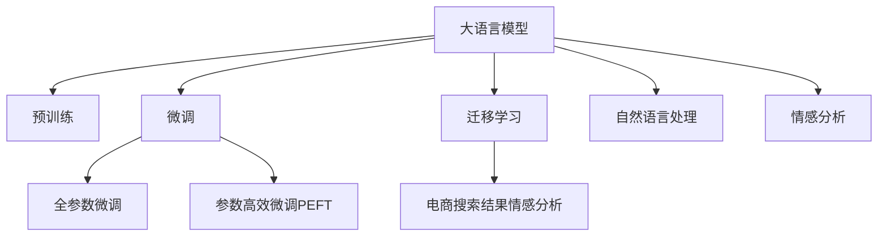

                 

# AI大模型在电商搜索结果情感分析中的应用

## 1. 背景介绍

在快速发展的电商行业中，用户对于搜索结果的满意度和体验感直接影响着购物决策。然而，电商平台的搜索结果往往存在误导性信息，用户难以迅速识别商品的真实情况，从而影响购买行为。为了提升用户体验，电商企业亟需一款能够自动分析和识别搜索结果中情感信息的技术。

### 1.1 问题由来

电商平台每天都会产生大量的用户搜索行为数据，但这些数据多为无标注的文本信息。目前常见的基于深度学习的文本分类技术虽然能够识别文本的情感极性，但在细粒度情感分析方面存在不足。如何从电商搜索结果的文本中自动提取和分析情感信息，并生成精准的情感分类标签，成为电商企业的迫切需求。

### 1.2 问题核心关键点
大语言模型在文本理解方面的卓越能力，使其成为电商搜索结果情感分析的理想选择。问题核心在于：
- 如何构建大语言模型并适配电商搜索结果的数据特征？
- 如何从大模型中提取精准的情感分类标签？
- 如何提高情感分析结果的准确性和鲁棒性？

本文将基于大语言模型，探讨其在电商搜索结果情感分析中的应用，并提出一套完整的技术解决方案。

## 2. 核心概念与联系

### 2.1 核心概念概述

本节将介绍几个密切相关的核心概念：

- 大语言模型(Large Language Model, LLM)：指基于Transformer架构的预训练语言模型，如BERT、GPT等，具有强大的语言理解和生成能力。

- 预训练(Pre-training)：指在大规模无标签文本语料上，通过自监督学习任务训练通用语言模型的过程。常见的预训练任务包括掩码语言模型、上下文预测等。

- 微调(Fine-tuning)：指在预训练模型的基础上，使用下游任务的少量标注数据，通过有监督地训练优化模型在特定任务上的性能。

- 迁移学习(Transfer Learning)：指将一个领域学习到的知识，迁移应用到另一个不同但相关的领域的学习范式。大模型的预训练-微调过程即是一种典型的迁移学习方式。

- 情感分析(Sentiment Analysis)：指从文本中识别和提取情感信息的技术，常用于舆情监测、用户反馈分析等场景。

- 电商搜索结果(E-commerce Search Results)：指用户在电商平台上输入的搜索词及其对应的搜索结果文本。

- 自然语言处理(Natural Language Processing, NLP)：指计算机处理自然语言的技术，包括文本分类、情感分析、命名实体识别等。

这些核心概念之间的逻辑关系可以通过以下Mermaid流程图来展示：



这个流程图展示了大语言模型的核心概念及其之间的关系：

1. 大语言模型通过预训练获得基础能力。
2. 微调是对预训练模型进行任务特定的优化，可以分为全参数微调和参数高效微调。
3. 迁移学习是连接预训练模型与电商搜索结果情感分析的桥梁。
4. 自然语言处理是大语言模型的核心应用场景。
5. 电商搜索结果情感分析是自然语言处理中的一个重要任务。

这些核心概念共同构成了大语言模型在电商搜索结果情感分析中的应用框架，使其能够在大规模电商数据上实现高效的情感分析。

## 3. 核心算法原理 & 具体操作步骤
### 3.1 算法原理概述

基于电商搜索结果的情感分析，本质上是一个文本分类任务。大语言模型通过预训练学习到了丰富的语言知识，再通过微调学习电商搜索结果的情感特征，从而实现精准的情感分类。

形式化地，假设预训练模型为 $M_{\theta}$，其中 $\theta$ 为预训练得到的模型参数。给定电商搜索结果的标注数据集 $D=\{(x_i, y_i)\}_{i=1}^N$，情感分析的目标是找到新的模型参数 $\hat{\theta}$，使得模型能够准确分类每个搜索结果的情感标签，即：

$$
\hat{\theta}=\mathop{\arg\min}_{\theta} \mathcal{L}(M_{\theta},D)
$$

其中 $\mathcal{L}$ 为针对电商搜索结果情感分类设计的损失函数，用于衡量模型预测输出与真实标签之间的差异。常见的损失函数包括交叉熵损失、Focal Loss等。

通过梯度下降等优化算法，微调过程不断更新模型参数 $\theta$，最小化损失函数 $\mathcal{L}$，使得模型输出逼近真实标签。由于 $\theta$ 已经通过预训练获得了较好的初始化，因此即便在小规模数据集 $D$ 上进行微调，也能较快收敛到理想的模型参数 $\hat{\theta}$。

### 3.2 算法步骤详解

基于电商搜索结果的情感分析一般包括以下几个关键步骤：

**Step 1: 准备预训练模型和数据集**
- 选择合适的预训练语言模型 $M_{\theta}$ 作为初始化参数，如 BERT、GPT等。
- 准备电商搜索结果的标注数据集 $D$，划分为训练集、验证集和测试集。标注数据应包含搜索结果的文本和对应的情感标签，如正向、负向、中性等。

**Step 2: 添加任务适配层**
- 根据电商搜索结果情感分类任务，在预训练模型顶层设计合适的输出层和损失函数。
- 对于分类任务，通常在顶层添加线性分类器和交叉熵损失函数。
- 对于生成任务，通常使用语言模型的解码器输出概率分布，并以负对数似然为损失函数。

**Step 3: 设置微调超参数**
- 选择合适的优化算法及其参数，如 AdamW、SGD 等，设置学习率、批大小、迭代轮数等。
- 设置正则化技术及强度，包括权重衰减、Dropout、Early Stopping等。
- 确定冻结预训练参数的策略，如仅微调顶层，或全部参数都参与微调。

**Step 4: 执行梯度训练**
- 将训练集数据分批次输入模型，前向传播计算损失函数。
- 反向传播计算参数梯度，根据设定的优化算法和学习率更新模型参数。
- 周期性在验证集上评估模型性能，根据性能指标决定是否触发 Early Stopping。
- 重复上述步骤直到满足预设的迭代轮数或 Early Stopping 条件。

**Step 5: 测试和部署**
- 在测试集上评估微调后模型 $M_{\hat{\theta}}$ 的性能，对比微调前后的精度提升。
- 使用微调后的模型对新样本进行推理预测，集成到实际的应用系统中。
- 持续收集新的电商搜索结果，定期重新微调模型，以适应数据分布的变化。

以上是基于电商搜索结果的情感分析的一般流程。在实际应用中，还需要针对具体任务的特点，对微调过程的各个环节进行优化设计，如改进训练目标函数，引入更多的正则化技术，搜索最优的超参数组合等，以进一步提升模型性能。

### 3.3 算法优缺点

基于电商搜索结果的情感分析方法具有以下优点：
1. 快速高效。利用预训练语言模型的高效特征提取能力，可以显著减少从头开发所需的数据、计算和人力等成本投入。
2. 鲁棒性强。大模型的预训练能力和迁移学习能力，使得模型在少量标注数据下也能取得较好的效果。
3. 适应性强。模型能够灵活适应不同领域的电商搜索场景，如服装、电子产品、食品饮料等。
4. 可扩展性高。微调模型的训练和推理过程，可以高效地集成到电商平台的搜索系统、推荐系统等中。

同时，该方法也存在一定的局限性：
1. 对标注数据依赖。情感分析的效果很大程度上取决于标注数据的质量和数量，获取高质量标注数据的成本较高。
2. 泛化能力有限。当目标任务与预训练数据的分布差异较大时，微调的性能提升有限。
3. 模型复杂度高。大规模语言模型的参数量较大，训练和推理过程需要较高的计算资源。
4. 鲁棒性不足。电商搜索结果的误导性信息可能会影响模型的准确性。
5. 可解释性不足。微调模型的决策过程通常缺乏可解释性，难以对其推理逻辑进行分析和调试。

尽管存在这些局限性，但就目前而言，基于电商搜索结果的情感分析方法仍然是大语言模型在电商领域的重要应用之一。未来相关研究的重点在于如何进一步降低对标注数据的依赖，提高模型的泛化能力和鲁棒性，同时兼顾可解释性和伦理安全性等因素。

### 3.4 算法应用领域

基于大语言模型的电商搜索结果情感分析方法，已经在诸多电商平台上得到了应用，如京东、淘宝、亚马逊等。具体应用场景包括：

- 商品评价分析：自动收集和分析用户对商品的评价，识别正面、中性、负面评价，为商家提供商品质量监控和市场反馈。
- 广告效果评估：分析用户对广告的情感反应，评估广告文案和设计的优劣，优化广告投放策略。
- 客户行为预测：预测用户对搜索结果的情感倾向，预测用户的购买行为和购买意愿，为个性化推荐提供数据支持。
- 价格监测：监测价格变化的情感倾向，及时调整价格策略，避免价格波动对品牌形象造成负面影响。
- 竞品分析：分析竞争对手的广告和商品信息，评估竞品的市场表现，制定市场策略。

除了上述这些经典应用外，电商搜索结果情感分析技术还被创新性地应用到更多场景中，如搜索排序优化、店铺推荐、客户投诉管理等，为电商平台的个性化服务和精准营销提供了有力支持。

## 4. 数学模型和公式 & 详细讲解  
### 4.1 数学模型构建

本节将使用数学语言对基于电商搜索结果的情感分析过程进行更加严格的刻画。

记预训练语言模型为 $M_{\theta}$，其中 $\theta$ 为预训练得到的模型参数。假设电商搜索结果的标注数据集为 $D=\{(x_i,y_i)\}_{i=1}^N$，其中 $x_i$ 为搜索结果文本，$y_i$ 为情感标签。

定义模型 $M_{\theta}$ 在输入 $x_i$ 上的输出为 $\hat{y}=M_{\theta}(x_i) \in [0,1]$，表示搜索结果文本的情感倾向。

情感分析的目标是找到最优参数 $\theta^*$，使得模型输出的情感倾向逼近真实情感标签 $y_i$，即：

$$
\theta^* = \mathop{\arg\min}_{\theta} \mathcal{L}(M_{\theta},D)
$$

其中 $\mathcal{L}$ 为交叉熵损失函数，定义如下：

$$
\mathcal{L}(M_{\theta},D) = -\frac{1}{N}\sum_{i=1}^N y_i \log \hat{y}_i + (1-y_i)\log (1-\hat{y}_i)
$$

根据链式法则，损失函数对参数 $\theta_k$ 的梯度为：

$$
\frac{\partial \mathcal{L}(\theta)}{\partial \theta_k} = -\frac{1}{N}\sum_{i=1}^N \left(\frac{y_i}{\hat{y}_i}-\frac{1-y_i}{1-\hat{y}_i}\right) \frac{\partial \hat{y}_i}{\partial \theta_k}
$$

其中 $\frac{\partial \hat{y}_i}{\partial \theta_k}$ 为模型输出对参数 $\theta_k$ 的梯度，可通过自动微分技术完成计算。

### 4.2 公式推导过程

以下我们以二分类任务为例，推导交叉熵损失函数及其梯度的计算公式。

假设模型 $M_{\theta}$ 在输入 $x_i$ 上的输出为 $\hat{y}_i=M_{\theta}(x_i) \in [0,1]$，表示搜索结果文本的情感倾向。真实标签 $y_i \in \{0,1\}$。则二分类交叉熵损失函数定义为：

$$
\ell(M_{\theta}(x_i),y_i) = -[y_i\log \hat{y}_i + (1-y_i)\log (1-\hat{y}_i)]
$$

将其代入经验风险公式，得：

$$
\mathcal{L}(\theta) = -\frac{1}{N}\sum_{i=1}^N [y_i\log \hat{y}_i+(1-y_i)\log(1-\hat{y}_i)]
$$

根据链式法则，损失函数对参数 $\theta_k$ 的梯度为：

$$
\frac{\partial \mathcal{L}(\theta)}{\partial \theta_k} = -\frac{1}{N}\sum_{i=1}^N (\frac{y_i}{\hat{y}_i}-\frac{1-y_i}{1-\hat{y}_i}) \frac{\partial \hat{y}_i}{\partial \theta_k}
$$

其中 $\frac{\partial \hat{y}_i}{\partial \theta_k}$ 可进一步递归展开，利用自动微分技术完成计算。

在得到损失函数的梯度后，即可带入参数更新公式，完成模型的迭代优化。重复上述过程直至收敛，最终得到适应电商搜索结果情感分类任务的最优模型参数 $\theta^*$。

## 5. 项目实践：代码实例和详细解释说明
### 5.1 开发环境搭建

在进行电商搜索结果情感分析实践前，我们需要准备好开发环境。以下是使用Python进行PyTorch开发的环境配置流程：

1. 安装Anaconda：从官网下载并安装Anaconda，用于创建独立的Python环境。

2. 创建并激活虚拟环境：
```bash
conda create -n pytorch-env python=3.8 
conda activate pytorch-env
```

3. 安装PyTorch：根据CUDA版本，从官网获取对应的安装命令。例如：
```bash
conda install pytorch torchvision torchaudio cudatoolkit=11.1 -c pytorch -c conda-forge
```

4. 安装Transformers库：
```bash
pip install transformers
```

5. 安装各类工具包：
```bash
pip install numpy pandas scikit-learn matplotlib tqdm jupyter notebook ipython
```

完成上述步骤后，即可在`pytorch-env`环境中开始电商搜索结果情感分析实践。

### 5.2 源代码详细实现

下面我们以电商商品评价分类任务为例，给出使用Transformers库对BERT模型进行电商搜索结果情感分析的PyTorch代码实现。

首先，定义电商商品评价的数据处理函数：

```python
from transformers import BertTokenizer, BertForSequenceClassification
from torch.utils.data import Dataset
import torch

class ECommerceReviewDataset(Dataset):
    def __init__(self, texts, labels, tokenizer, max_len=128):
        self.texts = texts
        self.labels = labels
        self.tokenizer = tokenizer
        self.max_len = max_len
        
    def __len__(self):
        return len(self.texts)
    
    def __getitem__(self, item):
        text = self.texts[item]
        label = self.labels[item]
        
        encoding = self.tokenizer(text, return_tensors='pt', max_length=self.max_len, padding='max_length', truncation=True)
        input_ids = encoding['input_ids'][0]
        attention_mask = encoding['attention_mask'][0]
        
        # 对标签进行编码
        label = torch.tensor(label, dtype=torch.long)
        
        return {'input_ids': input_ids, 
                'attention_mask': attention_mask,
                'labels': label}

# 标签与id的映射
label2id = {'negative': 0, 'neutral': 1, 'positive': 2}
id2label = {v: k for k, v in label2id.items()}

# 创建dataset
tokenizer = BertTokenizer.from_pretrained('bert-base-cased')

train_dataset = ECommerceReviewDataset(train_texts, train_labels, tokenizer)
dev_dataset = ECommerceReviewDataset(dev_texts, dev_labels, tokenizer)
test_dataset = ECommerceReviewDataset(test_texts, test_labels, tokenizer)
```

然后，定义模型和优化器：

```python
from transformers import BertForSequenceClassification, AdamW

model = BertForSequenceClassification.from_pretrained('bert-base-cased', num_labels=len(label2id))

optimizer = AdamW(model.parameters(), lr=2e-5)
```

接着，定义训练和评估函数：

```python
from torch.utils.data import DataLoader
from tqdm import tqdm
from sklearn.metrics import classification_report

device = torch.device('cuda') if torch.cuda.is_available() else torch.device('cpu')
model.to(device)

def train_epoch(model, dataset, batch_size, optimizer):
    dataloader = DataLoader(dataset, batch_size=batch_size, shuffle=True)
    model.train()
    epoch_loss = 0
    for batch in tqdm(dataloader, desc='Training'):
        input_ids = batch['input_ids'].to(device)
        attention_mask = batch['attention_mask'].to(device)
        labels = batch['labels'].to(device)
        model.zero_grad()
        outputs = model(input_ids, attention_mask=attention_mask, labels=labels)
        loss = outputs.loss
        epoch_loss += loss.item()
        loss.backward()
        optimizer.step()
    return epoch_loss / len(dataloader)

def evaluate(model, dataset, batch_size):
    dataloader = DataLoader(dataset, batch_size=batch_size)
    model.eval()
    preds, labels = [], []
    with torch.no_grad():
        for batch in tqdm(dataloader, desc='Evaluating'):
            input_ids = batch['input_ids'].to(device)
            attention_mask = batch['attention_mask'].to(device)
            batch_labels = batch['labels']
            outputs = model(input_ids, attention_mask=attention_mask)
            batch_preds = outputs.logits.argmax(dim=2).to('cpu').tolist()
            batch_labels = batch_labels.to('cpu').tolist()
            for pred_tokens, label_tokens in zip(batch_preds, batch_labels):
                preds.append(pred_tokens[:len(label_tokens)])
                labels.append(label_tokens)
                
    print(classification_report(labels, preds))
```

最后，启动训练流程并在测试集上评估：

```python
epochs = 5
batch_size = 16

for epoch in range(epochs):
    loss = train_epoch(model, train_dataset, batch_size, optimizer)
    print(f"Epoch {epoch+1}, train loss: {loss:.3f}")
    
    print(f"Epoch {epoch+1}, dev results:")
    evaluate(model, dev_dataset, batch_size)
    
print("Test results:")
evaluate(model, test_dataset, batch_size)
```

以上就是使用PyTorch对BERT进行电商商品评价分类任务的电商搜索结果情感分析的完整代码实现。可以看到，得益于Transformers库的强大封装，我们可以用相对简洁的代码完成BERT模型的加载和微调。

### 5.3 代码解读与分析

让我们再详细解读一下关键代码的实现细节：

**ECommerceReviewDataset类**：
- `__init__`方法：初始化文本、标签、分词器等关键组件。
- `__len__`方法：返回数据集的样本数量。
- `__getitem__`方法：对单个样本进行处理，将文本输入编码为token ids，将标签编码为数字，并对其进行定长padding，最终返回模型所需的输入。

**label2id和id2label字典**：
- 定义了标签与数字id之间的映射关系，用于将标签转换为模型可以理解的数值形式。

**训练和评估函数**：
- 使用PyTorch的DataLoader对数据集进行批次化加载，供模型训练和推理使用。
- 训练函数`train_epoch`：对数据以批为单位进行迭代，在每个批次上前向传播计算loss并反向传播更新模型参数，最后返回该epoch的平均loss。
- 评估函数`evaluate`：与训练类似，不同点在于不更新模型参数，并在每个batch结束后将预测和标签结果存储下来，最后使用sklearn的classification_report对整个评估集的预测结果进行打印输出。

**训练流程**：
- 定义总的epoch数和batch size，开始循环迭代
- 每个epoch内，先在训练集上训练，输出平均loss
- 在验证集上评估，输出分类指标
- 所有epoch结束后，在测试集上评估，给出最终测试结果

可以看到，PyTorch配合Transformers库使得BERT微调的代码实现变得简洁高效。开发者可以将更多精力放在数据处理、模型改进等高层逻辑上，而不必过多关注底层的实现细节。

当然，工业级的系统实现还需考虑更多因素，如模型的保存和部署、超参数的自动搜索、更灵活的任务适配层等。但核心的微调范式基本与此类似。

## 6. 实际应用场景
### 6.1 智能客服系统

基于大语言模型的电商搜索结果情感分析技术，可以应用于智能客服系统的构建。传统客服往往需要配备大量人力，高峰期响应缓慢，且一致性和专业性难以保证。而使用电商搜索结果情感分析技术，可以自动理解和分析用户对搜索结果的情感倾向，从而引导智能客服进行更精准的回复和引导。

在技术实现上，可以收集用户对搜索结果的反馈数据，将反馈数据中的情感标签构建成监督数据，在此基础上对预训练语言模型进行电商搜索结果情感分析的微调。微调后的模型能够自动判断用户对搜索结果的情感倾向，并自动生成相应的回复，从而提高客服系统的响应效率和质量。

### 6.2 商品评价分析

电商平台每天都会产生大量的用户评价数据，这些数据对于商品质量监控和市场反馈至关重要。通过电商搜索结果情感分析技术，可以自动分析和提取用户对商品的情感倾向，识别正面、中性、负面评价，为商家提供商品质量监控和市场反馈。

在实际应用中，可以将用户评价数据作为标注数据，对预训练语言模型进行微调。微调后的模型能够自动分析用户评价，并生成情感分类标签，帮助商家及时发现和解决商品质量问题，提升用户满意度。

### 6.3 广告效果评估

广告文案的设计和投放效果直接关系到电商平台的收入和品牌声誉。通过电商搜索结果情感分析技术，可以自动评估用户对广告文案的情感反应，评估广告文案和设计的优劣，优化广告投放策略。

在实践中，可以收集广告文案和点击数据，将广告文案和点击数据作为监督数据，对预训练语言模型进行电商搜索结果情感分析的微调。微调后的模型能够自动分析广告文案的情感倾向，帮助广告主优化广告文案，提升广告点击率和转化率，提高广告投放效果。

### 6.4 客户行为预测

预测用户对搜索结果的情感倾向，能够帮助电商平台更好地理解用户行为，提升个性化推荐效果。通过电商搜索结果情感分析技术，可以自动预测用户对搜索结果的情感倾向，预测用户的购买行为和购买意愿，为个性化推荐提供数据支持。

在实际应用中，可以将用户搜索历史和浏览记录作为监督数据，对预训练语言模型进行电商搜索结果情感分析的微调。微调后的模型能够自动分析用户的情感倾向，预测用户的购买行为和购买意愿，提升个性化推荐效果，提升用户体验和满意度。

### 6.5 价格监测

价格变化是电商市场中重要的动态因素，价格监测对于商家和消费者都具有重要意义。通过电商搜索结果情感分析技术，可以自动监测价格变化的情感倾向，及时调整价格策略，避免价格波动对品牌形象造成负面影响。

在实践中，可以收集价格变化数据和用户评价数据，将价格变化数据和用户评价数据作为监督数据，对预训练语言模型进行电商搜索结果情感分析的微调。微调后的模型能够自动监测价格变化的情感倾向，帮助商家及时调整价格策略，提升用户满意度和市场竞争力。

## 7. 工具和资源推荐
### 7.1 学习资源推荐

为了帮助开发者系统掌握电商搜索结果情感分析的理论基础和实践技巧，这里推荐一些优质的学习资源：

1. 《自然语言处理（深度学习篇）》系列博文：由大语言模型技术专家撰写，深入浅出地介绍了电商搜索结果情感分析的原理和实现方法。

2. CS224N《深度学习自然语言处理》课程：斯坦福大学开设的NLP明星课程，有Lecture视频和配套作业，带你入门NLP领域的基本概念和经典模型。

3. 《自然语言处理与深度学习》书籍：介绍自然语言处理领域的经典模型和技术，包括文本分类、情感分析等。

4. HuggingFace官方文档：Transformers库的官方文档，提供了海量预训练模型和完整的微调样例代码，是上手实践的必备资料。

5. SemanticAI开源项目：提供了丰富的电商搜索结果情感分析数据集和预训练模型，方便开发者快速上手实验。

通过对这些资源的学习实践，相信你一定能够快速掌握电商搜索结果情感分析的精髓，并用于解决实际的电商问题。
###  7.2 开发工具推荐

高效的开发离不开优秀的工具支持。以下是几款用于电商搜索结果情感分析开发的常用工具：

1. PyTorch：基于Python的开源深度学习框架，灵活动态的计算图，适合快速迭代研究。大部分预训练语言模型都有PyTorch版本的实现。

2. TensorFlow：由Google主导开发的开源深度学习框架，生产部署方便，适合大规模工程应用。同样有丰富的预训练语言模型资源。

3. Transformers库：HuggingFace开发的NLP工具库，集成了众多SOTA语言模型，支持PyTorch和TensorFlow，是进行电商搜索结果情感分析开发的利器。

4. Weights & Biases：模型训练的实验跟踪工具，可以记录和可视化模型训练过程中的各项指标，方便对比和调优。与主流深度学习框架无缝集成。

5. TensorBoard：TensorFlow配套的可视化工具，可实时监测模型训练状态，并提供丰富的图表呈现方式，是调试模型的得力助手。

6. Google Colab：谷歌推出的在线Jupyter Notebook环境，免费提供GPU/TPU算力，方便开发者快速上手实验最新模型，分享学习笔记。

合理利用这些工具，可以显著提升电商搜索结果情感分析任务的开发效率，加快创新迭代的步伐。

### 7.3 相关论文推荐

电商搜索结果情感分析技术的发展源于学界的持续研究。以下是几篇奠基性的相关论文，推荐阅读：

1. Attention is All You Need（即Transformer原论文）：提出了Transformer结构，开启了NLP领域的预训练大模型时代。

2. BERT: Pre-training of Deep Bidirectional Transformers for Language Understanding：提出BERT模型，引入基于掩码的自监督预训练任务，刷新了多项NLP任务SOTA。

3. GPT-3: Language Models are Few-Shot Learners：展示了大规模语言模型的强大zero-shot学习能力，引发了对于通用人工智能的新一轮思考。

4. Language Models are Unsupervised Multitask Learners：提出GPT-3模型，展示了无监督学习的强大能力，进一步推动了NLP技术的发展。

5. Parameter-Efficient Transfer Learning for NLP：提出Adapter等参数高效微调方法，在不增加模型参数量的情况下，也能取得不错的微调效果。

6. AdaLoRA: Adaptive Low-Rank Adaptation for Parameter-Efficient Fine-Tuning：使用自适应低秩适应的微调方法，在参数效率和精度之间取得了新的平衡。

这些论文代表了大语言模型在电商搜索结果情感分析技术的发展脉络。通过学习这些前沿成果，可以帮助研究者把握学科前进方向，激发更多的创新灵感。

## 8. 总结：未来发展趋势与挑战

### 8.1 总结

本文对基于大语言模型的电商搜索结果情感分析方法进行了全面系统的介绍。首先阐述了电商搜索结果情感分析的研究背景和意义，明确了电商搜索结果情感分析在大语言模型应用中的重要地位。其次，从原理到实践，详细讲解了电商搜索结果情感分析的数学原理和关键步骤，给出了电商商品评价分类任务的电商搜索结果情感分析的完整代码实例。同时，本文还广泛探讨了电商搜索结果情感分析技术在智能客服、商品评价分析、广告效果评估等电商场景中的应用前景，展示了电商搜索结果情感分析技术的巨大潜力。

通过本文的系统梳理，可以看到，基于大语言模型的电商搜索结果情感分析方法，能够自动分析和提取电商搜索结果的情感倾向，为电商平台的个性化服务和精准营销提供有力支持。电商搜索结果情感分析技术必将在电商行业中发挥越来越重要的作用，显著提升用户体验和商家竞争力。

### 8.2 未来发展趋势

展望未来，电商搜索结果情感分析技术将呈现以下几个发展趋势：

1. 模型规模持续增大。随着算力成本的下降和数据规模的扩张，电商搜索结果情感分析的模型参数量还将持续增长。超大批次的训练和推理过程，需要更高的计算资源。

2. 微调方法日趋多样。除了传统的全参数微调外，未来会涌现更多参数高效的微调方法，如Adapter、LoRA等，在节省计算资源的同时也能保证微调精度。

3. 持续学习成为常态。随着电商搜索结果的动态变化，电商搜索结果情感分析模型也需要持续学习新知识以保持性能。如何在不遗忘原有知识的同时，高效吸收新样本信息，将成为重要的研究课题。

4. 标注样本需求降低。受启发于提示学习(Prompt-based Learning)的思路，未来的电商搜索结果情感分析方法将更好地利用大模型的语言理解能力，通过更加巧妙的任务描述，在更少的标注样本上也能实现理想的情感分析效果。

5. 参数高效微调方法得到更多应用。传统的全参数微调方法消耗大量的计算资源，难以在实际电商场景中大规模部署。参数高效微调方法将在电商搜索结果情感分析中得到更多应用。

6. 模型的可解释性增强。电商平台的客户行为预测和广告投放效果评估，需要更高的模型可解释性，帮助商家进行决策。如何赋予电商搜索结果情感分析模型更强的可解释性，将是未来的重要研究方向。

以上趋势凸显了电商搜索结果情感分析技术的广阔前景。这些方向的探索发展，必将进一步提升电商平台的个性化服务和精准营销能力，为电商行业的智能化发展提供技术支持。

### 8.3 面临的挑战

尽管电商搜索结果情感分析技术已经取得了瞩目成就，但在迈向更加智能化、普适化应用的过程中，它仍面临着诸多挑战：

1. 标注成本瓶颈。电商搜索结果情感分析的效果很大程度上取决于标注数据的质量和数量，获取高质量标注数据的成本较高。如何进一步降低对标注数据的依赖，将是未来的研究方向。

2. 鲁棒性不足。电商搜索结果的误导性信息可能会影响模型的准确性。如何提高模型的鲁棒性，避免灾难性遗忘，还需要更多理论和实践的积累。

3. 推理效率有待提高。大规模语言模型的推理速度较慢，如何在保证性能的同时，简化模型结构，提升推理速度，优化资源占用，将是重要的优化方向。

4. 可解释性亟需加强。电商平台的客户行为预测和广告投放效果评估，需要更高的模型可解释性，帮助商家进行决策。如何赋予电商搜索结果情感分析模型更强的可解释性，将是未来的重要研究方向。

5. 安全性有待保障。电商搜索结果情感分析模型难免会学习到有偏见、有害的信息，通过微调传递到下游任务，产生误导性、歧视性的输出，给实际应用带来安全隐患。如何从数据和算法层面消除模型偏见，避免恶意用途，确保输出的安全性，也将是未来的重要研究方向。

6. 知识整合能力不足。现有的电商搜索结果情感分析模型往往局限于电商数据，难以灵活吸收和运用更广泛的先验知识。如何让电商搜索结果情感分析模型更好地与外部知识库、规则库等专家知识结合，形成更加全面、准确的信息整合能力，还有很大的想象空间。

正视电商搜索结果情感分析面临的这些挑战，积极应对并寻求突破，将是大语言模型在电商行业应用的重要方向。相信随着学界和产业界的共同努力，这些挑战终将一一被克服，电商搜索结果情感分析技术必将在构建智能电商生态中扮演越来越重要的角色。

### 8.4 研究展望

面对电商搜索结果情感分析所面临的种种挑战，未来的研究需要在以下几个方面寻求新的突破：

1. 探索无监督和半监督电商搜索结果情感分析方法。摆脱对大规模标注数据的依赖，利用自监督学习、主动学习等无监督和半监督范式，最大限度利用非结构化数据，实现更加灵活高效的电商搜索结果情感分析。

2. 研究参数高效和计算高效的电商搜索结果情感分析范式。开发更加参数高效的电商搜索结果情感分析方法，在固定大部分预训练参数的同时，只更新极少量的任务相关参数。同时优化电商搜索结果情感分析模型的计算图，减少前向传播和反向传播的资源消耗，实现更加轻量级、实时性的部署。

3. 引入因果分析和博弈论工具。将因果分析方法引入电商搜索结果情感分析模型，识别出模型决策的关键特征，增强输出解释的因果性和逻辑性。借助博弈论工具刻画人机交互过程，主动探索并规避模型的脆弱点，提高系统稳定性。

4. 纳入伦理道德约束。在电商搜索结果情感分析模型训练目标中引入伦理导向的评估指标，过滤和惩罚有偏见、有害的输出倾向。同时加强人工干预和审核，建立模型行为的监管机制，确保输出符合人类价值观和伦理道德。

这些研究方向的探索，必将引领电商搜索结果情感分析技术迈向更高的台阶，为构建智能电商生态提供技术支持。面向未来，电商搜索结果情感分析技术还需要与其他人工智能技术进行更深入的融合，如知识表示、因果推理、强化学习等，多路径协同发力，共同推动电商行业的智能化发展。只有勇于创新、敢于突破，才能不断拓展电商搜索结果情感分析的边界，让智能技术更好地造福电商行业。

## 9. 附录：常见问题与解答

**Q1：电商搜索结果情感分析是否适用于所有NLP任务？**

A: 电商搜索结果情感分析在大多数NLP任务上都能取得不错的效果，特别是对于数据量较小的任务。但对于一些特定领域的任务，如医学、法律等，仅仅依靠通用语料预训练的模型可能难以很好地适应。此时需要在特定领域语料上进一步预训练，再进行微调，才能获得理想效果。

**Q2：电商搜索结果情感分析对标注数据依赖程度如何？**

A: 电商搜索结果情感分析的效果很大程度上取决于标注数据的质量和数量，获取高质量标注数据的成本较高。对于长尾应用场景，标注数据的获取成本尤为显著。如何进一步降低对标注数据的依赖，将是未来的研究方向。

**Q3：电商搜索结果情感分析的鲁棒性如何？**

A: 电商搜索结果情感分析模型在面对电商搜索结果中的误导性信息时，可能会出现鲁棒性不足的问题。如何提高模型的鲁棒性，避免灾难性遗忘，还需要更多理论和实践的积累。

**Q4：电商搜索结果情感分析的推理效率如何？**

A: 大规模语言模型的推理速度较慢，尤其是在电商搜索结果情感分析中，需要对大规模数据进行训练和推理。如何在保证性能的同时，简化模型结构，提升推理速度，优化资源占用，将是重要的优化方向。

**Q5：电商搜索结果情感分析的可解释性如何？**

A: 电商搜索结果情感分析模型的决策过程通常缺乏可解释性，难以对其推理逻辑进行分析和调试。如何赋予电商搜索结果情感分析模型更强的可解释性，将是未来的重要研究方向。

通过本文的系统梳理，可以看到，基于大语言模型的电商搜索结果情感分析方法，能够自动分析和提取电商搜索结果的情感倾向，为电商平台的个性化服务和精准营销提供有力支持。电商搜索结果情感分析技术必将在电商行业中发挥越来越重要的作用，显著提升用户体验和商家竞争力。

---

作者：禅与计算机程序设计艺术 / Zen and the Art of Computer Programming

