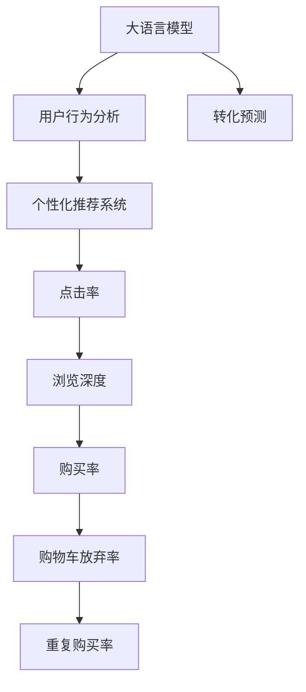

                 

# AI大模型如何优化电商平台的转化漏斗

> 关键词：电商转化, 大模型, 转化漏斗, 客户行为, 个性化推荐, 转化预测

## 1. 背景介绍

### 1.1 问题由来

近年来，电子商务迅速发展，电商平台正面临激烈的市场竞争。如何提高用户转化率，增加销售额，成为了电商平台的重要挑战。传统的基于规则和人工经验的运营方式，难以应对复杂多变的用户需求。而人工智能技术，特别是大语言模型和大数据技术的结合，为电商平台优化转化漏斗提供了新的可能性。

在技术层面，大语言模型（Large Language Models, LLMs）如GPT-3、BERT、T5等，通过在海量文本数据上进行预训练，学习到了丰富的语言知识和语义表示。在电商场景中，这些模型可以用于用户行为分析、个性化推荐、销售预测等任务，显著提升电商平台的运营效率和用户满意度。

### 1.2 问题核心关键点

在电商场景中，转化漏斗指的是用户从访问平台到最终完成购买的流程。优化转化漏斗需要理解用户的行为模式，并针对性地推送个性化推荐、优惠活动等信息，从而提升各阶段的转化率。

具体而言，电商平台的转化漏斗优化目标包括以下几个关键环节：
1. **点击率（CTR）**：提高用户点击进入商品详情页的点击率。
2. **浏览深度（PV/UV）**：增加用户在详情页的停留时间和浏览商品的数量。
3. **购买率**：促进用户最终完成支付购买。

以下问题我们将详细介绍如何利用大语言模型优化电商平台的转化漏斗。

## 2. 核心概念与联系

### 2.1 核心概念概述

为更好地理解大语言模型如何优化电商平台的转化漏斗，本节将介绍几个密切相关的核心概念：

- **大语言模型（Large Language Models, LLMs）**：以自回归模型（如GPT-3）或自编码模型（如BERT）为代表的深度学习模型，通过在海量文本数据上进行预训练，学习通用的语言表示。
- **用户行为分析**：分析用户在电商平台上的浏览、点击、购买等行为，挖掘用户兴趣和偏好，为个性化推荐提供依据。
- **个性化推荐系统**：根据用户的历史行为数据和当前状态，推送个性化的商品、活动等，提高用户转化率。
- **转化率（Conversion Rate, CR）**：用户从访问平台到完成支付的比例，反映了电商平台的用户留存和销售效果。
- **点击率（Click-Through Rate, CTR）**：用户点击商品详情页的比例，反映了用户对商品的兴趣程度。
- **浏览深度（Page Views, PV）**：用户访问详情页的次数，反映了用户对商品的兴趣持续时间和行为深度。
- **购物车放弃率（Cart Abandonment Rate）**：用户将商品加入购物车后，未完成支付的比例，反映了电商平台的用户转化率。
- **重复购买率（Repeat Purchase Rate）**：用户再次购买相同或类似商品的比例，反映了用户的品牌忠诚度和复购意愿。

这些核心概念之间的逻辑关系可以通过以下Mermaid流程图来展示：



这个流程图展示了大语言模型与电商转化漏斗各个环节之间的联系：

1. 大语言模型通过预训练学习到通用的语言表示。
2. 用户行为分析通过大模型提取用户兴趣和行为特征。
3. 个性化推荐系统根据用户行为特征，推送个性化商品和活动。
4. 各转化阶段（点击率、浏览深度、购买率、购物车放弃率、重复购买率）影响电商平台最终的转化率。
5. 转化预测通过大模型预测用户行为，提供优化建议。

## 3. 核心算法原理 & 具体操作步骤

### 3.1 算法原理概述

大语言模型通过在海量文本数据上进行预训练，学习到丰富的语言知识和语义表示。在电商场景中，大模型可以通过以下步骤进行转化漏斗的优化：

1. **用户行为建模**：利用大模型对用户历史行为数据进行建模，提取用户兴趣和偏好。
2. **个性化推荐生成**：根据用户行为特征，生成个性化的商品、活动推荐。
3. **点击率和转化率预测**：利用大模型预测用户点击商品详情页和完成支付的概率，提供优化建议。

基于监督学习的模型优化方式，通过标记标注数据，训练模型预测用户行为和转化率，以提升电商平台的转化漏斗。

### 3.2 算法步骤详解

基于监督学习的大语言模型优化电商平台的转化漏斗一般包括以下关键步骤：

**Step 1: 数据准备**
- 收集电商平台的用户行为数据，包括点击、浏览、加入购物车、购买等行为。
- 标记标注数据，定义用户行为标签（如点击、浏览、购买、放弃）。

**Step 2: 模型选择与准备**
- 选择合适的预训练大语言模型，如BERT、GPT-3等，作为初始化参数。
- 准备数据集，进行数据增强、归一化等预处理。

**Step 3: 模型适配与训练**
- 在电商平台提供的接口或SDK上，构建基于大模型的转化预测模型。
- 定义损失函数，如交叉熵损失，计算模型预测和真实标签之间的差异。
- 使用优化算法（如AdamW、SGD等），设定学习率、批大小等超参数，训练模型。

**Step 4: 模型评估与优化**
- 在验证集上评估模型性能，计算点击率、浏览深度、购买率等指标。
- 根据评估结果调整模型参数，优化模型。

**Step 5: 部署与应用**
- 将训练好的模型部署到电商平台的推荐系统中。
- 实时收集用户行为数据，预测用户点击率和购买概率，生成个性化推荐。
- 监控转化漏斗各阶段性能，及时调整推荐策略。

### 3.3 算法优缺点

大语言模型优化电商平台的转化漏斗具有以下优点：
1. **效率高**：通过预训练模型，快速适应电商平台的特定任务，提升推荐和预测的效率。
2. **鲁棒性强**：利用深度学习模型的非线性拟合能力，模型能够适应多样化的用户行为模式。
3. **泛化能力强**：大模型具备泛化能力，能够处理多种电商场景和用户需求。
4. **自动化程度高**：通过自动化学习，减少人工干预，提高运营效率。

同时，该方法也存在一定的局限性：
1. **数据依赖性强**：依赖于电商平台的历史数据，新用户和老用户的行为可能存在差异。
2. **模型复杂度高**：大语言模型参数量庞大，需要高计算资源和存储。
3. **解释性差**：大模型的决策过程难以解释，用户可能对其产生不信任感。
4. **预测误差**：模型预测存在不确定性，可能对某些用户或商品产生误判。

尽管存在这些局限性，但就目前而言，基于大语言模型的转化漏斗优化方法仍是大模型在电商应用的主流范式。未来相关研究的重点在于如何进一步降低对数据和计算资源的依赖，提高模型的解释性和预测精度。

### 3.4 算法应用领域

大语言模型优化电商平台的转化漏斗方法，已在多个电商平台上得到应用，涵盖了从新用户引流到老用户复购的各个环节。例如：

- **新用户引流**：利用大模型预测新用户的行为，设计针对性的推荐策略，吸引其点击和购买。
- **老用户复购**：根据老用户的历史行为数据，预测其复购意愿，提供个性化推荐。
- **销售预测**：利用大模型预测未来一段时间内的销售额和用户购买趋势，优化库存和物流。
- **客户服务**：利用大模型生成个性化客服对话，提升客户满意度和转化率。
- **市场活动**：利用大模型分析用户行为，设计高效的营销活动，提高用户参与度和转化率。

除了上述这些应用场景外，大语言模型优化转化漏斗的方法还被创新性地应用到更多场景中，如社交电商、跨境电商、二手交易等，为电商平台的运营带来了全新的突破。

## 4. 数学模型和公式 & 详细讲解 & 举例说明

### 4.1 数学模型构建

假设大语言模型为 $M_{\theta}$，用户行为数据为 $D=\{(x_i,y_i)\}_{i=1}^N$，其中 $x_i$ 为用户的浏览记录、点击记录等，$y_i$ 为用户的点击标签（0或1）。

定义模型 $M_{\theta}$ 在输入 $x_i$ 上的点击率预测函数为 $P(y_i=1|x_i; \theta)$，则经验风险为：

$$
\mathcal{L}(\theta) = \frac{1}{N} \sum_{i=1}^N -y_i\log P(y_i=1|x_i; \theta)
$$

模型的目标是最小化经验风险，即：

$$
\theta^* = \mathop{\arg\min}_{\theta} \mathcal{L}(\theta)
$$

其中，$P(y_i=1|x_i; \theta)$ 为模型预测用户点击的概率。通过优化损失函数 $\mathcal{L}(\theta)$，模型能够学习到最优的预测概率。

### 4.2 公式推导过程

假设 $M_{\theta}$ 为一个二分类任务的多层感知机（MLP）模型，输入为 $x_i$，输出为 $P(y_i=1|x_i; \theta)$，表示用户点击概率。模型的预测函数可以表示为：

$$
P(y_i=1|x_i; \theta) = \sigma(W_{mlp}^T x_i + b_{mlp})
$$

其中，$W_{mlp}$ 和 $b_{mlp}$ 为MLP模型的权重和偏置。$x_i$ 为归一化后的用户行为特征向量。$\sigma$ 为sigmoid激活函数，将输出映射到 $[0,1]$ 区间。

将上述公式代入损失函数，得到：

$$
\mathcal{L}(\theta) = \frac{1}{N} \sum_{i=1}^N -y_i\log \sigma(W_{mlp}^T x_i + b_{mlp})
$$

通过反向传播算法，计算损失函数对模型参数的梯度，使用优化算法更新模型参数，最小化损失函数，得到最优模型 $\theta^*$。

### 4.3 案例分析与讲解

假设我们有一个电商平台，用户行为数据包含历史点击记录和购买记录。我们希望使用大模型预测用户点击和购买概率，从而优化推荐策略。

首先，我们将用户行为数据进行归一化和特征工程，得到特征向量 $x_i$。然后，使用大语言模型作为预训练模型 $M_{\theta}$，将其作为MLP模型的初始化参数。接着，定义点击率预测函数 $P(y_i=1|x_i; \theta)$，损失函数 $\mathcal{L}(\theta)$，设置超参数如学习率、批大小等。

训练模型时，将用户点击标签 $y_i$ 作为监督信号，使用优化算法（如AdamW）最小化损失函数，更新模型参数。在验证集上评估模型性能，计算点击率、浏览深度等指标。根据评估结果调整模型参数，优化模型。最终，将训练好的模型部署到电商平台的推荐系统中，实时收集用户行为数据，预测用户点击率和购买概率，生成个性化推荐。

通过上述步骤，我们可以利用大语言模型优化电商平台的转化漏斗，提升用户转化率和电商平台的销售额。

## 5. 项目实践：代码实例和详细解释说明

### 5.1 开发环境搭建

在进行电商平台转化漏斗优化项目时，我们需要准备好开发环境。以下是使用Python进行TensorFlow开发的环境配置流程：

1. 安装Anaconda：从官网下载并安装Anaconda，用于创建独立的Python环境。

2. 创建并激活虚拟环境：
```bash
conda create -n tf-env python=3.8 
conda activate tf-env
```

3. 安装TensorFlow：根据CUDA版本，从官网获取对应的安装命令。例如：
```bash
conda install tensorflow -c pytorch -c conda-forge
```

4. 安装Keras：
```bash
pip install keras
```

5. 安装TensorBoard：
```bash
pip install tensorboard
```

6. 安装PyTorch：
```bash
pip install torch torchvision torchaudio
```

7. 安装Flask：用于搭建API接口。
```bash
pip install flask
```

完成上述步骤后，即可在`tf-env`环境中开始项目开发。

### 5.2 源代码详细实现

下面以点击率预测为例，给出使用TensorFlow对大语言模型进行电商转化漏斗优化的PyTorch代码实现。

首先，定义数据处理函数：

```python
import tensorflow as tf
import numpy as np

def preprocess_data(data):
    # 归一化处理
    return (data - data.mean()) / data.std()
```

然后，定义模型和优化器：

```python
from keras.models import Sequential
from keras.layers import Dense, Dropout, Activation
from keras.optimizers import Adam

model = Sequential()
model.add(Dense(64, input_dim=features_dim, activation='relu'))
model.add(Dropout(0.5))
model.add(Dense(1, activation='sigmoid'))

optimizer = Adam(lr=0.001)
```

接着，定义训练和评估函数：

```python
def train_epoch(model, x_train, y_train):
    model.compile(loss='binary_crossentropy', optimizer=optimizer, metrics=['accuracy'])
    model.fit(x_train, y_train, epochs=10, batch_size=32)

def evaluate(model, x_test, y_test):
    loss, accuracy = model.evaluate(x_test, y_test)
    print('Test loss:', loss)
    print('Test accuracy:', accuracy)
```

最后，启动训练流程并在测试集上评估：

```python
epochs = 10
batch_size = 32

x_train, y_train = prepare_train_data()
x_test, y_test = prepare_test_data()

train_epoch(model, x_train, y_train)
evaluate(model, x_test, y_test)
```

以上就是使用TensorFlow对大语言模型进行点击率预测的完整代码实现。可以看到，借助Keras和TensorFlow的高层次API，模型的搭建和训练过程变得非常简单高效。

### 5.3 代码解读与分析

让我们再详细解读一下关键代码的实现细节：

**preprocess_data函数**：
- 归一化处理用户行为特征数据，以便模型更好地学习。

**Sequential模型**：
- 定义了一个简单的多层感知机（MLP）模型，包含一个隐藏层和输出层，激活函数分别为ReLU和Sigmoid。

**Adam优化器**：
- 使用Adam优化器进行模型训练，学习率为0.001。

**train_epoch函数**：
- 将模型编译为二分类任务，使用Adam优化器进行训练，循环10次。

**evaluate函数**：
- 在测试集上评估模型性能，输出损失和准确率。

**训练流程**：
- 准备训练和测试数据。
- 在训练集上训练模型，输出每个epoch的损失和准确率。
- 在测试集上评估模型，输出测试集上的损失和准确率。

可以看到，借助TensorFlow和Keras，我们能够快速搭建和训练模型，评估模型性能，并进行实时预测。

## 6. 实际应用场景

### 6.1 智能推荐系统

基于大语言模型的电商转化漏斗优化方法，可以广泛应用于智能推荐系统，提高用户点击率和购买率。推荐系统通过分析用户历史行为，预测用户兴趣和偏好，生成个性化的商品推荐。大语言模型通过理解自然语言，能够处理更加复杂和多样的用户输入，提升推荐的精准度和用户满意度。

在技术实现上，推荐系统可以集成大语言模型，通过分析用户行为数据，预测用户点击概率和购买概率，生成推荐列表。用户浏览商品时，系统会动态生成推荐内容，使用户更快找到感兴趣的商品。

### 6.2 个性化广告投放

电商平台利用大语言模型优化转化漏斗，可以用于个性化广告投放。广告投放系统通过分析用户历史行为，预测用户点击广告的概率，生成个性化的广告内容。大语言模型通过理解自然语言，生成具有吸引力的广告文案，提升广告的点击率和转化率。

在技术实现上，广告投放系统可以集成大语言模型，通过分析用户行为数据，预测用户点击广告的概率，生成个性化的广告内容。广告展示时，系统会动态生成广告文案，提升广告的吸引力和转化率。

### 6.3 客户服务与支持

电商平台利用大语言模型优化转化漏斗，可以用于提升客户服务与支持。客户服务系统通过分析用户咨询和反馈，预测用户需求，生成个性化的客户服务内容。大语言模型通过理解自然语言，生成具有针对性的客服对话，提升用户满意度和转化率。

在技术实现上，客户服务系统可以集成大语言模型，通过分析用户咨询和反馈，预测用户需求，生成个性化的客服对话。用户咨询时，系统会动态生成客服回复，提升用户满意度和转化率。

### 6.4 未来应用展望

随着大语言模型和电商转化漏斗优化技术的不断发展，未来基于大模型的电商应用将更加智能化和个性化。具体趋势如下：

1. **智能化推荐**：大模型能够处理更加多样和复杂的用户输入，推荐系统将更加精准和个性化。推荐内容不仅基于用户的浏览历史，还考虑用户的语义理解和情感分析。

2. **动态定价**：基于大模型的预测，电商平台可以动态调整商品价格，提升销售效果。系统可以根据用户行为预测需求，实时调整价格策略。

3. **智能客服**：大模型生成的客服对话将更加自然和智能化。客服系统可以理解用户的情感和需求，生成个性化的回复，提升用户体验。

4. **跨平台营销**：大模型可以分析用户在各个平台的行为数据，生成跨平台的个性化营销内容。用户无论在哪个平台，都能看到个性化的广告和推荐内容。

5. **个性化活动**：基于大模型的预测，电商平台可以设计个性化的营销活动。活动内容和形式将更加贴合用户的兴趣和需求。

总之，大语言模型优化电商平台的转化漏斗，将为电商运营带来全新的突破。未来的电商应用将更加智能化、个性化，为用户提供更优质的购物体验。

## 7. 工具和资源推荐

### 7.1 学习资源推荐

为了帮助开发者系统掌握大语言模型优化电商转化漏斗的理论基础和实践技巧，这里推荐一些优质的学习资源：

1. 《深度学习基础》系列博文：由深度学习专家撰写，介绍了深度学习的基本概念和关键技术。

2. 《深度学习与自然语言处理》课程：斯坦福大学开设的NLP明星课程，介绍了NLP的基本原理和深度学习应用。

3. 《TensorFlow实战》书籍：介绍了TensorFlow的基本用法和高级技巧，适合深入学习。

4. 《Keras深度学习实战》书籍：介绍了Keras的基本用法和实际应用，适合快速上手。

5. 《深度学习框架TensorFlow》官方文档：提供了详细的TensorFlow API文档和代码示例，适合学习者参考。

通过对这些资源的学习实践，相信你一定能够快速掌握大语言模型优化电商转化漏斗的精髓，并用于解决实际的电商问题。

### 7.2 开发工具推荐

高效的开发离不开优秀的工具支持。以下是几款用于电商平台转化漏斗优化开发的常用工具：

1. TensorFlow：基于Python的开源深度学习框架，适合进行大规模模型的训练和优化。

2. PyTorch：基于Python的开源深度学习框架，适合进行高效的模型训练和推理。

3. Keras：基于TensorFlow的高层次API，适合快速搭建和训练模型。

4. TensorBoard：TensorFlow配套的可视化工具，适合实时监测模型训练状态。

5. Flask：轻量级Python Web框架，适合搭建API接口。

6. Jupyter Notebook：Python开发常用工具，支持代码编写和实时执行。

合理利用这些工具，可以显著提升电商平台转化漏斗优化任务的开发效率，加快创新迭代的步伐。

### 7.3 相关论文推荐

大语言模型优化电商平台的转化漏斗技术正在不断发展，以下是几篇奠基性的相关论文，推荐阅读：

1. Attention is All You Need：提出Transformer结构，开启了NLP领域的预训练大模型时代。

2. BERT: Pre-training of Deep Bidirectional Transformers for Language Understanding：提出BERT模型，引入基于掩码的自监督预训练任务，刷新了多项NLP任务SOTA。

3. Model-Based Meta-Learning with Reasoning and Scheduling：利用大模型进行元学习，生成策略和计划，提升决策的准确性。

4. Multimodal Reasoning for Deep Neural Networks：利用多模态数据进行推理，提升大模型的泛化能力。

5. Transfer Learning with Multitask Scheduling：利用多任务学习提升模型的泛化能力和迁移能力。

这些论文代表了大语言模型优化电商转化漏斗技术的发展脉络。通过学习这些前沿成果，可以帮助研究者把握学科前进方向，激发更多的创新灵感。

## 8. 总结：未来发展趋势与挑战

### 8.1 总结

本文对基于大语言模型的电商平台转化漏斗优化方法进行了全面系统的介绍。首先阐述了大语言模型和电商转化漏斗的研究背景和意义，明确了转化漏斗优化在提升电商运营效率和用户体验方面的重要价值。其次，从原理到实践，详细讲解了大语言模型在电商平台转化漏斗优化的应用流程，包括数据准备、模型选择、训练优化、部署应用等关键步骤。同时，本文还广泛探讨了大语言模型在电商场景中的多个应用，展示了其在电商运营中的强大潜力。

通过本文的系统梳理，可以看到，基于大语言模型的电商平台转化漏斗优化方法，正在成为电商运营的重要技术手段。大语言模型通过理解和处理自然语言，能够显著提升电商平台的运营效率和用户体验，带来全新的业务价值。

### 8.2 未来发展趋势

展望未来，大语言模型优化电商平台的转化漏斗技术将呈现以下几个发展趋势：

1. **智能化推荐**：大模型能够处理更加多样和复杂的用户输入，推荐系统将更加精准和个性化。推荐内容不仅基于用户的浏览历史，还考虑用户的语义理解和情感分析。

2. **动态定价**：基于大模型的预测，电商平台可以动态调整商品价格，提升销售效果。系统可以根据用户行为预测需求，实时调整价格策略。

3. **智能客服**：大模型生成的客服对话将更加自然和智能化。客服系统可以理解用户的情感和需求，生成个性化的回复，提升用户满意度和转化率。

4. **跨平台营销**：大模型可以分析用户在各个平台的行为数据，生成跨平台的个性化营销内容。用户无论在哪个平台，都能看到个性化的广告和推荐内容。

5. **个性化活动**：基于大模型的预测，电商平台可以设计个性化的营销活动。活动内容和形式将更加贴合用户的兴趣和需求。

以上趋势凸显了大语言模型优化电商转化漏斗技术的广阔前景。这些方向的探索发展，必将进一步提升电商平台的用户体验和运营效率，为电商运营带来新的突破。

### 8.3 面临的挑战

尽管大语言模型优化电商平台的转化漏斗技术已经取得了瞩目成就，但在迈向更加智能化、普适化应用的过程中，它仍面临着诸多挑战：

1. **数据依赖性强**：依赖于电商平台的历史数据，新用户和老用户的行为可能存在差异。如何进一步降低对数据和计算资源的依赖，提高模型的泛化能力，是一个重要的问题。

2. **模型复杂度高**：大语言模型参数量庞大，需要高计算资源和存储。如何优化模型结构，提升推理效率，是一个需要解决的技术难题。

3. **解释性差**：大模型的决策过程难以解释，用户可能对其产生不信任感。如何增强模型的可解释性，提高用户信任度，是一个重要的研究方向。

4. **预测误差**：模型预测存在不确定性，可能对某些用户或商品产生误判。如何降低预测误差，提高模型准确性，是一个亟待解决的问题。

5. **跨平台一致性**：用户在不同平台的行为可能不一致，如何构建统一的模型和策略，实现跨平台的一致性，是一个需要克服的难点。

这些挑战需要研究者从模型设计、数据管理、算法优化等方面进行深入探索，以克服现有技术瓶颈，推动大语言模型在电商应用中的进一步发展。

### 8.4 研究展望

面对大语言模型优化电商转化漏斗所面临的挑战，未来的研究需要在以下几个方面寻求新的突破：

1. **无监督和半监督学习**：探索无监督和半监督学习范式，最大程度利用非结构化数据，降低对标注数据的需求。

2. **参数高效和计算高效优化**：开发更加参数高效和计算高效的微调方法，提升模型的计算效率和泛化能力。

3. **跨平台模型融合**：研究跨平台数据融合和模型一致性，构建统一的模型和策略，实现跨平台的用户行为分析。

4. **多模态数据融合**：将文本、图像、视频等多模态数据进行融合，提升大模型的泛化能力和决策准确性。

5. **知识表示与推理**：将符号化的先验知识与神经网络模型进行融合，提升模型的知识表示和推理能力。

这些研究方向的探索，必将引领大语言模型优化电商转化漏斗技术迈向更高的台阶，为电商平台带来更加智能化和个性化的用户体验。

## 9. 附录：常见问题与解答

**Q1：大语言模型在电商平台中的作用是什么？**

A: 大语言模型在电商平台中的主要作用是通过理解用户的行为和意图，优化电商转化漏斗。具体而言，大模型能够：
1. **预测用户行为**：通过分析用户的历史行为数据，预测用户点击率、购买率等指标。
2. **生成个性化推荐**：根据用户的行为特征，生成个性化的商品、活动推荐。
3. **提升客户服务与支持**：通过理解用户咨询和反馈，生成个性化的客服对话，提升用户体验。

**Q2：如何选择合适的大语言模型？**

A: 选择合适的大语言模型，需要考虑以下因素：
1. **任务类型**：根据电商平台的业务需求，选择相应的预训练模型，如BERT用于自然语言理解，GPT-3用于生成对话等。
2. **数据量**：考虑电商平台的数据量和多样性，选择适合的数据规模和模型复杂度。
3. **计算资源**：考虑电商平台的计算资源，选择适合的数据规模和模型复杂度。
4. **可解释性**：选择具有良好可解释性的模型，便于调试和优化。

**Q3：大语言模型优化转化漏斗的性能如何衡量？**

A: 大语言模型优化转化漏斗的性能主要通过以下几个指标衡量：
1. **点击率（CTR）**：用户点击商品详情页的比例。
2. **浏览深度（PV/UV）**：用户访问详情页的次数和停留时间。
3. **购买率**：用户完成支付的比例。
4. **购物车放弃率**：用户将商品加入购物车后，未完成支付的比例。
5. **重复购买率**：用户再次购买相同或类似商品的比例。

**Q4：大语言模型优化转化漏斗的难点是什么？**

A: 大语言模型优化转化漏斗的主要难点在于：
1. **数据依赖性强**：依赖于电商平台的历史数据，新用户和老用户的行为可能存在差异。
2. **模型复杂度高**：大语言模型参数量庞大，需要高计算资源和存储。
3. **解释性差**：大模型的决策过程难以解释，用户可能对其产生不信任感。
4. **预测误差**：模型预测存在不确定性，可能对某些用户或商品产生误判。
5. **跨平台一致性**：用户在不同平台的行为可能不一致，如何构建统一的模型和策略，实现跨平台的一致性，是一个需要克服的难点。

这些挑战需要研究者从模型设计、数据管理、算法优化等方面进行深入探索，以克服现有技术瓶颈，推动大语言模型在电商应用中的进一步发展。

**Q5：大语言模型如何提高电商平台的转化率？**

A: 大语言模型通过理解用户的行为和意图，优化电商平台的转化漏斗，从而提高转化率。具体而言，大模型能够：
1. **预测用户行为**：通过分析用户的历史行为数据，预测用户点击率、购买率等指标。
2. **生成个性化推荐**：根据用户的行为特征，生成个性化的商品、活动推荐。
3. **提升客户服务与支持**：通过理解用户咨询和反馈，生成个性化的客服对话，提升用户体验。

通过上述步骤，大语言模型能够显著提升电商平台的运营效率和用户体验，带来更高的转化率。

---

作者：禅与计算机程序设计艺术 / Zen and the Art of Computer Programming

