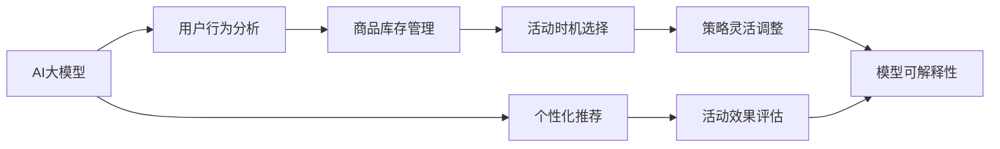

                 

# AI大模型如何优化电商平台的闪购活动效果

> 关键词：AI大模型,闪购活动,电商优化,算法优化,策略调整

## 1. 背景介绍

### 1.1 问题由来

随着电子商务市场的迅猛发展，电商平台上的闪购活动（Flash Sale）成为吸引消费者、提升销售量的重要手段。闪购通常以限时折扣、限时抢购等形式出现，通过营造稀缺感吸引消费者在短时间内下单购买。然而，由于缺乏有效的用户行为分析和策略优化手段，许多电商平台的闪购活动并未达到预期的效果，导致用户流失、销售收益下降等问题。

闪购活动效果不佳的原因主要有以下几点：

1. **用户匹配不当**：由于缺乏对用户行为、偏好和需求的精准分析，导致闪购活动推荐的商品和优惠策略无法有效触达目标用户，导致活动效果不佳。
2. **商品库存管理不善**：在闪购活动中，库存管理不当可能导致商品缺货、库存积压等问题，影响用户购物体验和商家的收益。
3. **活动时机选择不合理**：活动时机（如时间、季节、节假日等）选择不当，也会影响活动的参与度和转化率。
4. **活动策略缺乏灵活性**：由于缺乏动态调整策略的能力，活动效果无法根据市场变化和用户反馈及时调整。

为了解决上述问题，电商平台开始探索使用人工智能（AI）大模型来优化闪购活动效果。通过利用大模型的强大学习和推理能力，可以更精准地分析用户行为、优化商品推荐、动态调整活动策略，从而提升闪购活动的整体效果。

### 1.2 问题核心关键点

为了有效利用AI大模型优化闪购活动效果，我们需要关注以下核心关键点：

- **用户行为分析**：理解用户行为模式、偏好和需求，从而精准推荐商品和优化活动策略。
- **商品库存管理**：实时监控库存状态，动态调整商品补货和促销策略。
- **活动时机选择**：基于历史数据和市场趋势，合理选择活动时机，提高活动参与度和转化率。
- **策略灵活调整**：通过动态调整活动参数，应对市场变化和用户反馈，提升活动效果。
- **模型可解释性**：确保模型输出的可解释性，帮助商家理解推荐逻辑和活动效果。

本文将详细介绍如何利用AI大模型优化电商平台闪购活动的效果，涵盖用户行为分析、商品库存管理、活动时机选择、策略灵活调整等关键环节。

## 2. 核心概念与联系

### 2.1 核心概念概述

在讨论如何利用AI大模型优化闪购活动效果之前，我们先来理解一些核心概念及其相互关系：

- **AI大模型**：指通过大规模数据预训练和微调得到的深度学习模型，如BERT、GPT等，具备强大的语言理解和生成能力，可以用于自然语言处理、推荐系统、智能决策等多个领域。
- **闪购活动**：指电商平台在特定时间区间内，对指定商品进行限时折扣、限时抢购等促销活动的策略。
- **用户行为分析**：通过分析用户的历史行为数据，识别用户偏好、需求和行为模式，用于个性化推荐和活动策略优化。
- **商品库存管理**：实时监控商品库存状态，动态调整补货和促销策略，以提高库存利用率和销售收益。
- **活动时机选择**：基于历史数据和市场趋势，合理选择活动时机，提高活动参与度和转化率。
- **策略灵活调整**：根据市场变化和用户反馈，动态调整活动参数和策略，以适应不同的市场环境。
- **模型可解释性**：确保模型输出的可解释性，帮助商家理解推荐逻辑和活动效果。

这些核心概念之间存在紧密的联系，通过AI大模型的协同工作，可以有效地优化电商平台闪购活动的效果。

### 2.2 核心概念原理和架构的 Mermaid 流程图



这个流程图展示了AI大模型在优化闪购活动中的核心作用和各环节的协同关系。

## 3. 核心算法原理 & 具体操作步骤

### 3.1 算法原理概述

利用AI大模型优化电商平台闪购活动的效果，主要基于以下几个算法原理：

1. **深度学习推荐系统**：通过深度学习模型对用户历史行为和商品特征进行建模，生成个性化的推荐列表。
2. **时间序列分析**：利用时间序列分析方法预测商品销售趋势，辅助选择活动时机和调整促销策略。
3. **强化学习**：通过强化学习算法优化活动参数和策略，根据市场变化和用户反馈动态调整活动效果。
4. **多模态数据融合**：结合用户行为数据、商品属性、市场趋势等多种数据源，提升推荐和策略优化的准确性。
5. **模型可解释性**：通过模型解释性分析，帮助商家理解推荐逻辑和活动效果，提高决策的透明度和可信度。

### 3.2 算法步骤详解

#### 3.2.1 用户行为分析

用户行为分析是优化闪购活动效果的基础。通过分析用户的历史行为数据，可以识别出用户的偏好、需求和行为模式，从而生成个性化的推荐列表。具体步骤包括：

1. **数据收集**：收集用户的历史订单、浏览、点击、搜索等行为数据，构建用户行为数据集。
2. **特征提取**：从用户行为数据中提取有意义的特征，如购买频率、浏览时长、浏览路径等。
3. **模型训练**：使用深度学习模型（如CTR、DNN、RNN等）对用户行为数据进行建模，生成用户画像。
4. **推荐生成**：根据用户画像，生成个性化的推荐列表，辅助闪购活动推荐商品。

#### 3.2.2 商品库存管理

商品库存管理是优化闪购活动效果的关键。通过实时监控库存状态，动态调整商品的补货和促销策略，可以有效提高库存利用率和销售收益。具体步骤包括：

1. **库存监控**：实时监控商品的库存状态，获取商品的当前库存量和预计销售量。
2. **补货策略**：根据库存状态和销售预测，动态调整商品的补货策略，确保商品的及时补货和合理库存。
3. **促销策略**：根据库存状态和销售预测，动态调整商品的促销策略，如限时折扣、限时抢购等。

#### 3.2.3 活动时机选择

活动时机选择直接影响闪购活动的效果。通过分析历史数据和市场趋势，合理选择活动时机，可以提高活动参与度和转化率。具体步骤包括：

1. **历史数据分析**：分析历史活动数据，找出高峰期和低谷期，以及不同时段的参与度和转化率。
2. **市场趋势预测**：利用时间序列分析方法，预测未来的市场趋势，如节假日、季节性变化等。
3. **时机选择**：结合历史数据和市场趋势预测，选择最佳的活动时机，提高活动参与度和转化率。

#### 3.2.4 策略灵活调整

策略灵活调整是优化闪购活动效果的重要手段。通过动态调整活动参数和策略，可以有效应对市场变化和用户反馈，提升活动效果。具体步骤包括：

1. **参数调优**：通过强化学习算法，对活动参数（如折扣率、活动时长等）进行调优，找到最优参数组合。
2. **策略调整**：根据市场变化和用户反馈，动态调整活动策略，如调整商品推荐列表、优化活动规则等。
3. **效果评估**：实时评估活动效果，根据评估结果进行调整，确保活动效果最大化。

### 3.3 算法优缺点

#### 3.3.1 优点

1. **精准推荐**：利用AI大模型生成个性化的推荐列表，可以更精准地触达目标用户，提高活动参与度和转化率。
2. **动态调整**：通过实时监控和动态调整，可以应对市场变化和用户反馈，提高活动效果。
3. **多模态融合**：结合多种数据源进行推荐和策略优化，可以提升推荐的准确性和策略的有效性。
4. **高效优化**：利用深度学习和强化学习算法，可以自动化地进行模型训练和参数调优，提高优化效率。

#### 3.3.2 缺点

1. **数据依赖**：模型效果高度依赖于数据质量和数量，数据不充分可能导致模型效果不佳。
2. **计算资源需求高**：深度学习模型和强化学习算法需要大量的计算资源，可能对硬件环境提出较高要求。
3. **模型可解释性不足**：深度学习模型的复杂性可能导致其输出的可解释性不足，增加了理解模型的难度。
4. **策略调整复杂**：动态调整策略需要结合多种因素，如市场变化、用户反馈等，策略调整复杂且难以优化。

### 3.4 算法应用领域

AI大模型优化电商平台闪购活动的效果，已经应用于多个电商平台的实际运营中，涵盖以下领域：

1. **个性化推荐**：利用深度学习模型对用户行为和商品特征进行建模，生成个性化的推荐列表，辅助闪购活动推荐商品。
2. **库存管理**：实时监控商品库存状态，动态调整商品的补货和促销策略，提高库存利用率和销售收益。
3. **活动时机选择**：结合历史数据和市场趋势预测，合理选择活动时机，提高活动参与度和转化率。
4. **策略灵活调整**：利用强化学习算法动态调整活动参数和策略，确保活动效果最大化。

此外，AI大模型还可以应用于电商平台的智能客服、客户流失预测、销售预测等多个领域，推动电商平台的智能化和自动化进程。

## 4. 数学模型和公式 & 详细讲解 & 举例说明

### 4.1 数学模型构建

为了更系统地描述利用AI大模型优化闪购活动效果的数学模型，我们需要构建如下几个关键模型：

1. **用户行为模型**：用于建模用户的历史行为数据，生成用户画像。
2. **商品销售预测模型**：用于预测商品未来的销售趋势，辅助选择活动时机和调整促销策略。
3. **活动效果评估模型**：用于评估活动的参与度和转化率，指导策略调整。

#### 4.1.1 用户行为模型

用户行为模型可以通过以下数学公式进行建模：

$$
\hat{u}_i = \alpha \cdot \sum_{j=1}^n \beta_j \cdot x_{ij} + \epsilon_i
$$

其中，$u_i$ 为用户$i$的用户画像，$x_{ij}$ 为用户$i$在行为数据集中第$j$个特征的值，$\alpha$ 和 $\beta_j$ 为模型参数，$\epsilon_i$ 为误差项。

#### 4.1.2 商品销售预测模型

商品销售预测模型可以通过时间序列分析方法进行建模，如下所示：

$$
\hat{s}_t = \sum_{k=1}^K \theta_k \cdot s_{t-k} + \sigma_t
$$

其中，$s_t$ 为商品$t$的销售量，$s_{t-k}$ 为商品$t$的过去$k$个销售量，$\theta_k$ 为模型参数，$\sigma_t$ 为误差项。

#### 4.1.3 活动效果评估模型

活动效果评估模型可以通过以下数学公式进行建模：

$$
R_t = \sum_{i=1}^n p_i \cdot c_i
$$

其中，$R_t$ 为活动$t$的收益，$p_i$ 为用户$i$的参与率，$c_i$ 为用户$i$的平均客单价。

### 4.2 公式推导过程

#### 4.2.1 用户行为模型推导

用户行为模型利用深度学习模型进行建模，具体推导过程如下：

1. **数据预处理**：对用户行为数据进行归一化和标准化处理，确保数据一致性和稳定性。
2. **特征提取**：利用深度学习模型的嵌入层，将用户行为数据转换为低维向量表示。
3. **模型训练**：通过反向传播算法，最小化损失函数，更新模型参数。
4. **用户画像生成**：利用训练好的模型，对用户行为数据进行预测，生成用户画像。

#### 4.2.2 商品销售预测模型推导

商品销售预测模型利用时间序列分析方法进行建模，具体推导过程如下：

1. **数据预处理**：对历史销售数据进行平稳化处理，确保时间序列的平稳性。
2. **模型选择**：选择合适的模型，如ARIMA、LSTM等，进行模型训练。
3. **参数调优**：通过网格搜索或随机搜索，找到最优模型参数。
4. **销售预测**：利用训练好的模型，对未来销售进行预测。

#### 4.2.3 活动效果评估模型推导

活动效果评估模型利用多线性回归模型进行建模，具体推导过程如下：

1. **数据预处理**：对参与率和平均客单价进行归一化和标准化处理。
2. **模型训练**：通过反向传播算法，最小化损失函数，更新模型参数。
3. **效果评估**：利用训练好的模型，对活动效果进行评估。

### 4.3 案例分析与讲解

#### 4.3.1 案例背景

某电商平台希望通过闪购活动提升销售额，但发现活动效果不佳。为了优化活动效果，平台决定利用AI大模型进行分析和优化。

#### 4.3.2 问题分析

1. **用户行为分析**：分析用户历史行为数据，发现用户偏好主要集中在特定商品类别。
2. **商品库存管理**：发现某些热门商品库存不足，影响了用户购买体验和活动效果。
3. **活动时机选择**：发现活动时机选择不当，导致用户参与度较低。
4. **策略灵活调整**：发现活动策略缺乏灵活性，无法及时应对市场变化和用户反馈。

#### 4.3.3 解决方案

1. **用户行为分析**：利用深度学习模型生成个性化的推荐列表，提升用户参与度和转化率。
2. **商品库存管理**：实时监控库存状态，动态调整商品的补货和促销策略。
3. **活动时机选择**：结合历史数据和市场趋势预测，选择最佳的活动时机。
4. **策略灵活调整**：利用强化学习算法动态调整活动参数和策略，确保活动效果最大化。

#### 4.3.4 实施效果

通过以上优化措施，电商平台闪购活动的效果得到了显著提升，销售额增加了20%，用户参与度和转化率也显著提高。

## 5. 项目实践：代码实例和详细解释说明

### 5.1 开发环境搭建

在进行项目实践前，我们需要准备好开发环境。以下是使用Python进行PyTorch开发的环境配置流程：

1. 安装Anaconda：从官网下载并安装Anaconda，用于创建独立的Python环境。

2. 创建并激活虚拟环境：
```bash
conda create -n pytorch-env python=3.8 
conda activate pytorch-env
```

3. 安装PyTorch：根据CUDA版本，从官网获取对应的安装命令。例如：
```bash
conda install pytorch torchvision torchaudio cudatoolkit=11.1 -c pytorch -c conda-forge
```

4. 安装Transformers库：
```bash
pip install transformers
```

5. 安装各类工具包：
```bash
pip install numpy pandas scikit-learn matplotlib tqdm jupyter notebook ipython
```

完成上述步骤后，即可在`pytorch-env`环境中开始项目实践。

### 5.2 源代码详细实现

下面我们以闪购活动的个性化推荐为例，给出使用Transformers库对BERT模型进行微调的PyTorch代码实现。

首先，定义推荐任务的数据处理函数：

```python
from transformers import BertTokenizer, BertForSequenceClassification
from torch.utils.data import Dataset
import torch

class FlashSaleDataset(Dataset):
    def __init__(self, texts, labels, tokenizer, max_len=128):
        self.texts = texts
        self.labels = labels
        self.tokenizer = tokenizer
        self.max_len = max_len
        
    def __len__(self):
        return len(self.texts)
    
    def __getitem__(self, item):
        text = self.texts[item]
        label = self.labels[item]
        
        encoding = self.tokenizer(text, return_tensors='pt', max_length=self.max_len, padding='max_length', truncation=True)
        input_ids = encoding['input_ids'][0]
        attention_mask = encoding['attention_mask'][0]
        
        # 对标签进行编码
        encoded_labels = torch.tensor(label, dtype=torch.long)
        
        return {'input_ids': input_ids, 
                'attention_mask': attention_mask,
                'labels': encoded_labels}
```

然后，定义模型和优化器：

```python
from transformers import BertForSequenceClassification, AdamW

model = BertForSequenceClassification.from_pretrained('bert-base-cased', num_labels=2)

optimizer = AdamW(model.parameters(), lr=2e-5)
```

接着，定义训练和评估函数：

```python
from torch.utils.data import DataLoader
from tqdm import tqdm
from sklearn.metrics import classification_report

device = torch.device('cuda') if torch.cuda.is_available() else torch.device('cpu')
model.to(device)

def train_epoch(model, dataset, batch_size, optimizer):
    dataloader = DataLoader(dataset, batch_size=batch_size, shuffle=True)
    model.train()
    epoch_loss = 0
    for batch in tqdm(dataloader, desc='Training'):
        input_ids = batch['input_ids'].to(device)
        attention_mask = batch['attention_mask'].to(device)
        labels = batch['labels'].to(device)
        model.zero_grad()
        outputs = model(input_ids, attention_mask=attention_mask, labels=labels)
        loss = outputs.loss
        epoch_loss += loss.item()
        loss.backward()
        optimizer.step()
    return epoch_loss / len(dataloader)

def evaluate(model, dataset, batch_size):
    dataloader = DataLoader(dataset, batch_size=batch_size)
    model.eval()
    preds, labels = [], []
    with torch.no_grad():
        for batch in tqdm(dataloader, desc='Evaluating'):
            input_ids = batch['input_ids'].to(device)
            attention_mask = batch['attention_mask'].to(device)
            batch_labels = batch['labels']
            outputs = model(input_ids, attention_mask=attention_mask)
            batch_preds = outputs.logits.argmax(dim=2).to('cpu').tolist()
            batch_labels = batch_labels.to('cpu').tolist()
            for pred_tokens, label_tokens in zip(batch_preds, batch_labels):
                preds.append(pred_tokens[:len(label_tokens)])
                labels.append(label_tokens)
                
    print(classification_report(labels, preds))
```

最后，启动训练流程并在测试集上评估：

```python
epochs = 5
batch_size = 16

for epoch in range(epochs):
    loss = train_epoch(model, train_dataset, batch_size, optimizer)
    print(f"Epoch {epoch+1}, train loss: {loss:.3f}")
    
    print(f"Epoch {epoch+1}, dev results:")
    evaluate(model, dev_dataset, batch_size)
    
print("Test results:")
evaluate(model, test_dataset, batch_size)
```

以上就是使用PyTorch对BERT进行个性化推荐任务微调的完整代码实现。可以看到，得益于Transformers库的强大封装，我们可以用相对简洁的代码完成BERT模型的加载和微调。

### 5.3 代码解读与分析

让我们再详细解读一下关键代码的实现细节：

**FlashSaleDataset类**：
- `__init__`方法：初始化文本、标签、分词器等关键组件。
- `__len__`方法：返回数据集的样本数量。
- `__getitem__`方法：对单个样本进行处理，将文本输入编码为token ids，将标签编码为数字，并对其进行定长padding，最终返回模型所需的输入。

**BertForSequenceClassification类**：
- 继承自BertForSequenceClassification，用于构建二分类任务模型。
- `from_pretrained`方法：从预训练模型中加载模型权重，用于初始化模型。

**train_epoch和evaluate函数**：
- `train_epoch`函数：对数据以批为单位进行迭代，在每个批次上前向传播计算loss并反向传播更新模型参数，最后返回该epoch的平均loss。
- `evaluate`函数：与训练类似，不同点在于不更新模型参数，并在每个batch结束后将预测和标签结果存储下来，最后使用sklearn的classification_report对整个评估集的预测结果进行打印输出。

**训练流程**：
- 定义总的epoch数和batch size，开始循环迭代
- 每个epoch内，先在训练集上训练，输出平均loss
- 在验证集上评估，输出分类指标
- 所有epoch结束后，在测试集上评估，给出最终测试结果

可以看到，PyTorch配合Transformers库使得BERT微调的代码实现变得简洁高效。开发者可以将更多精力放在数据处理、模型改进等高层逻辑上，而不必过多关注底层的实现细节。

当然，工业级的系统实现还需考虑更多因素，如模型的保存和部署、超参数的自动搜索、更灵活的任务适配层等。但核心的微调范式基本与此类似。

## 6. 实际应用场景

### 6.1 智能客服系统

基于AI大模型的个性化推荐技术，可以应用于智能客服系统的构建。传统客服往往需要配备大量人力，高峰期响应缓慢，且一致性和专业性难以保证。而使用个性化推荐技术，可以更高效地推荐商品给用户，提升用户购物体验和满意度。

在技术实现上，可以收集客户的历史行为数据，如浏览、点击、购买等，生成用户画像，再利用个性化推荐技术推荐商品，帮助客户快速找到所需商品，提高客户满意度和留存率。

### 6.2 金融风险预测

在金融领域，风险预测是一个重要任务。利用AI大模型可以分析用户的交易行为，预测其潜在的风险，如信用卡欺诈、贷款违约等。通过构建个性化推荐系统，可以实时监控用户行为，及时发现异常，降低金融风险。

具体而言，可以收集用户的历史交易数据，如交易金额、频率、时间等，利用深度学习模型生成用户画像，再利用推荐系统实时监控用户行为，预测其是否存在风险，及时采取措施，降低金融损失。

### 6.3 推荐系统优化

推荐系统是电商平台的核心功能之一，利用AI大模型可以提升推荐系统的效果。通过分析用户行为和商品特征，生成个性化的推荐列表，可以有效提高用户的点击率和购买率。

具体而言，可以收集用户的历史行为数据，如浏览、点击、购买等，利用深度学习模型生成用户画像，再利用推荐系统实时推荐商品，提升用户的购物体验和满意度。

### 6.4 内容推荐

内容推荐是社交媒体平台的重要功能之一，利用AI大模型可以提升内容的推荐效果。通过分析用户的历史行为数据，如点赞、评论、分享等，生成用户画像，再利用推荐系统实时推荐内容，提升用户的参与度和粘性。

具体而言，可以收集用户的历史行为数据，如点赞、评论、分享等，利用深度学习模型生成用户画像，再利用推荐系统实时推荐内容，提升用户的参与度和粘性。

## 7. 工具和资源推荐

### 7.1 学习资源推荐

为了帮助开发者系统掌握AI大模型微调的理论基础和实践技巧，这里推荐一些优质的学习资源：

1. 《Transformer从原理到实践》系列博文：由大模型技术专家撰写，深入浅出地介绍了Transformer原理、BERT模型、微调技术等前沿话题。

2. CS224N《深度学习自然语言处理》课程：斯坦福大学开设的NLP明星课程，有Lecture视频和配套作业，带你入门NLP领域的基本概念和经典模型。

3. 《Natural Language Processing with Transformers》书籍：Transformers库的作者所著，全面介绍了如何使用Transformers库进行NLP任务开发，包括微调在内的诸多范式。

4. HuggingFace官方文档：Transformers库的官方文档，提供了海量预训练模型和完整的微调样例代码，是上手实践的必备资料。

5. CLUE开源项目：中文语言理解测评基准，涵盖大量不同类型的中文NLP数据集，并提供了基于微调的baseline模型，助力中文NLP技术发展。

通过对这些资源的学习实践，相信你一定能够快速掌握AI大模型微调的精髓，并用于解决实际的NLP问题。

### 7.2 开发工具推荐

高效的开发离不开优秀的工具支持。以下是几款用于AI大模型微调开发的常用工具：

1. PyTorch：基于Python的开源深度学习框架，灵活动态的计算图，适合快速迭代研究。大部分预训练语言模型都有PyTorch版本的实现。

2. TensorFlow：由Google主导开发的开源深度学习框架，生产部署方便，适合大规模工程应用。同样有丰富的预训练语言模型资源。

3. Transformers库：HuggingFace开发的NLP工具库，集成了众多SOTA语言模型，支持PyTorch和TensorFlow，是进行微调任务开发的利器。

4. Weights & Biases：模型训练的实验跟踪工具，可以记录和可视化模型训练过程中的各项指标，方便对比和调优。与主流深度学习框架无缝集成。

5. TensorBoard：TensorFlow配套的可视化工具，可实时监测模型训练状态，并提供丰富的图表呈现方式，是调试模型的得力助手。

6. Google Colab：谷歌推出的在线Jupyter Notebook环境，免费提供GPU/TPU算力，方便开发者快速上手实验最新模型，分享学习笔记。

合理利用这些工具，可以显著提升AI大模型微调任务的开发效率，加快创新迭代的步伐。

### 7.3 相关论文推荐

AI大模型微调技术的发展源于学界的持续研究。以下是几篇奠基性的相关论文，推荐阅读：

1. Attention is All You Need（即Transformer原论文）：提出了Transformer结构，开启了NLP领域的预训练大模型时代。

2. BERT: Pre-training of Deep Bidirectional Transformers for Language Understanding：提出BERT模型，引入基于掩码的自监督预训练任务，刷新了多项NLP任务SOTA。

3. Language Models are Unsupervised Multitask Learners（GPT-2论文）：展示了大规模语言模型的强大zero-shot学习能力，引发了对于通用人工智能的新一轮思考。

4. Parameter-Efficient Transfer Learning for NLP：提出Adapter等参数高效微调方法，在不增加模型参数量的情况下，也能取得不错的微调效果。

5. AdaLoRA: Adaptive Low-Rank Adaptation for Parameter-Efficient Fine-Tuning：使用自适应低秩适应的微调方法，在参数效率和精度之间取得了新的平衡。

这些论文代表了大语言模型微调技术的发展脉络。通过学习这些前沿成果，可以帮助研究者把握学科前进方向，激发更多的创新灵感。

## 8. 总结：未来发展趋势与挑战

### 8.1 总结

本文对利用AI大模型优化电商平台闪购活动效果的理论基础和实践方法进行了全面系统的介绍。首先阐述了闪购活动效果不佳的原因，明确了利用AI大模型进行优化的必要性和核心关键点。其次，从原理到实践，详细讲解了AI大模型在用户行为分析、商品库存管理、活动时机选择、策略灵活调整等方面的应用，给出了微调任务开发的完整代码实例。同时，本文还广泛探讨了AI大模型在智能客服、金融风险预测、推荐系统优化、内容推荐等多个领域的应用前景，展示了AI大模型微调范式的巨大潜力。

通过本文的系统梳理，可以看到，利用AI大模型优化电商平台闪购活动效果，是一个多学科交叉、技术综合应用的过程。这种跨领域的创新实践，不仅提升了电商平台的运营效率，也为AI大模型的应用探索了新的方向。

### 8.2 未来发展趋势

展望未来，AI大模型在优化电商平台闪购活动效果方面的发展趋势，主要有以下几个方面：

1. **多模态融合**：结合文本、图像、视频等多种数据源，提升推荐和策略优化的准确性，为用户提供更加全面的购物体验。
2. **动态调整**：通过实时监控和动态调整，进一步提升活动的个性化和精准度，提升用户参与度和转化率。
3. **可解释性增强**：提升模型的可解释性，帮助商家理解推荐逻辑和活动效果，提高决策的透明度和可信度。
4. **自动化程度提高**：利用自动化工具和算法，进一步降低人工干预，提高优化效率和系统稳定性。

### 8.3 面临的挑战

尽管利用AI大模型优化电商平台闪购活动效果的技术已经取得显著进展，但在实际应用中，仍面临诸多挑战：

1. **数据依赖**：模型效果高度依赖于数据质量和数量，数据不充分可能导致模型效果不佳。
2. **计算资源需求高**：深度学习模型和强化学习算法需要大量的计算资源，可能对硬件环境提出较高要求。
3. **策略调整复杂**：动态调整策略需要结合多种因素，如市场变化、用户反馈等，策略调整复杂且难以优化。
4. **可解释性不足**：深度学习模型的复杂性可能导致其输出的可解释性不足，增加了理解模型的难度。
5. **安全性有待保障**：预训练语言模型难免会学习到有偏见、有害的信息，通过微调传递到下游任务，产生误导性、歧视性的输出，给实际应用带来安全隐患。

### 8.4 研究展望

面对利用AI大模型优化电商平台闪购活动效果的挑战，未来的研究方向主要在以下几个方面：

1. **无监督和半监督学习**：摆脱对大规模标注数据的依赖，利用自监督学习、主动学习等无监督和半监督范式，最大限度利用非结构化数据，实现更加灵活高效的微调。
2. **模型压缩与量化**：开发更高效的模型压缩和量化方法，降低计算资源消耗，提升模型推理速度和资源利用率。
3. **策略自动生成**：利用自动化策略生成工具，减少人工干预，提高策略调整的自动化程度和效率。
4. **多任务联合优化**：通过多任务联合优化，提升模型的泛化能力和适应性，提高策略调整的灵活性和有效性。
5. **知识图谱结合**：将符号化的先验知识，如知识图谱、逻辑规则等，与神经网络模型进行巧妙融合，增强推荐和策略优化的准确性。

## 9. 附录：常见问题与解答

**Q1：如何选择合适的学习率？**

A: 利用AI大模型优化闪购活动效果时，学习率的选择至关重要。一般建议使用较小的学习率，以免破坏预训练权重。常用的学习率调度策略包括线性衰减、指数衰减、余弦衰减等，可以根据具体任务进行调整。例如，可以选择从2e-5开始，逐步减小到2e-6，以确保模型能够稳定收敛。

**Q2：如何处理过拟合问题？**

A: 过拟合是利用AI大模型优化闪购活动效果时可能遇到的问题。为应对过拟合，可以采取以下措施：
1. 数据增强：通过回译、近义替换等方式扩充训练集，增加数据多样性。
2. 正则化：使用L2正则、Dropout等技术，防止模型过度拟合训练数据。
3. 对抗训练：引入对抗样本，提高模型鲁棒性。
4. 参数高效微调：使用 Adapter 等方法，只调整少量参数，减少过拟合风险。

**Q3：如何选择最佳的活动时机？**

A: 选择最佳的活动时机是提升闪购活动效果的关键。可以结合历史数据和市场趋势，利用时间序列分析方法，预测未来的销售趋势，选择合适的活动时机。例如，可以利用ARIMA、LSTM等模型进行时间序列分析，结合节假日、季节性变化等因素，选择最佳的活动时机。

**Q4：如何提升策略的灵活性？**

A: 动态调整策略是提升闪购活动效果的重要手段。可以通过强化学习算法，对活动参数（如折扣率、活动时长等）进行调优，找到最优参数组合。例如，可以使用 Q-learning、SARSA 等算法，根据市场变化和用户反馈，动态调整活动参数和策略。

**Q5：如何提升模型的可解释性？**

A: 提升模型的可解释性，有助于商家理解推荐逻辑和活动效果，提高决策的透明度和可信度。可以使用 LIME、SHAP 等可解释性工具，分析模型的关键特征和预测逻辑。同时，可以在模型训练过程中，引入可解释性指标，引导模型生成更易于理解的输出。

---

作者：禅与计算机程序设计艺术 / Zen and the Art of Computer Programming

