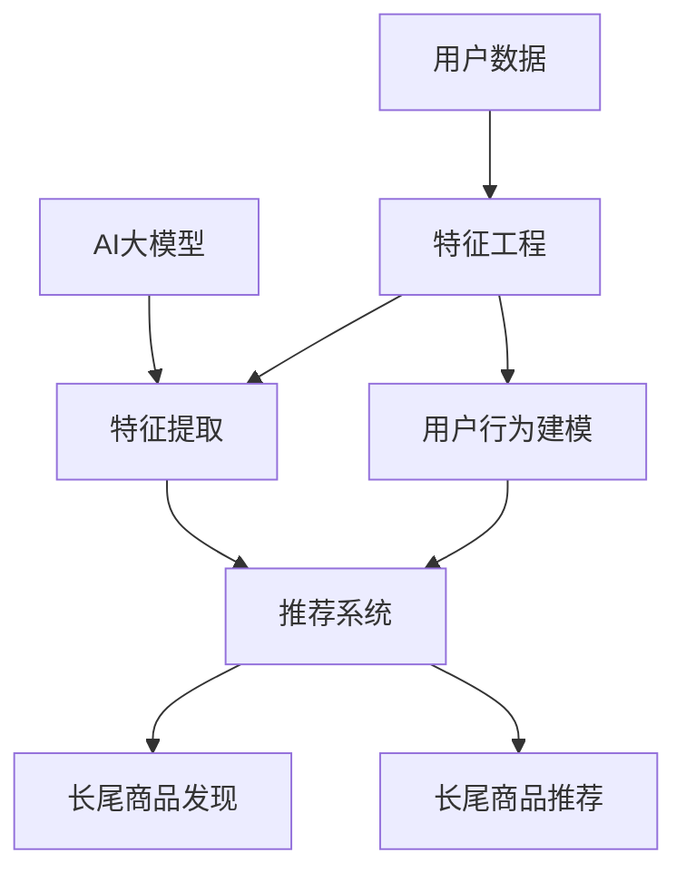

                 

# AI大模型如何提升电商平台的长尾商品发现与推荐

在当今激烈的市场竞争中，电商平台面临着如何高效发现和推荐长尾商品的挑战。长尾商品通常销量低，但种类繁多，对提升用户体验和平台收益至关重要。本文将介绍如何使用AI大模型来提升电商平台的商品发现与推荐能力，通过分析算法原理、具体操作步骤以及实际应用场景，为你展示AI技术在电商领域的广阔应用前景。

## 1. 背景介绍

随着电商市场的快速增长，消费者对商品种类的丰富性、个性化推荐和购物体验的要求越来越高。电商平台需要不仅能够推荐热门商品，还能发现和推荐那些用户需求量虽然低但种类繁多的长尾商品。传统电商平台的推荐系统依赖于用户行为数据，难以覆盖所有商品，特别是在长尾商品的推荐上存在明显不足。而AI大模型通过深度学习技术，可以自动发现和表示商品特征，提升推荐系统的泛化能力和覆盖率。

### 1.1 问题由来

传统电商平台推荐系统主要依靠用户行为数据进行推荐。但用户行为数据往往存在稀疏性和偏态性，即用户行为数据集中于少数热门商品，而长尾商品的数据量少且分布不均匀。这种数据稀疏性导致推荐系统难以全面覆盖长尾商品，无法满足用户对多样化和个性化的需求。此外，用户行为数据依赖于用户主动点击和购买记录，对于那些销量极低的长尾商品，数据量极小，无法训练出有效的推荐模型。

### 1.2 问题核心关键点

使用AI大模型进行商品推荐的关键点在于如何利用模型的强大表示能力，自动发现和表示商品特征，提升推荐系统的泛化能力和覆盖率。具体包括：

- 长尾商品的特征提取与表示
- 推荐系统的高效训练与优化
- 长尾商品的召回与排序

### 1.3 问题研究意义

通过AI大模型提升电商平台的长尾商品发现与推荐能力，具有重要的研究意义和应用价值：

1. 提高商品多样性：电商平台可以覆盖更多种类的商品，满足用户对多样化商品的需求。
2. 提升用户体验：推荐系统能够发现并推荐用户可能感兴趣的长尾商品，提升购物体验。
3. 增加平台收益：通过推荐长尾商品，提升用户粘性，增加平台的整体收益。
4. 推动技术创新：AI大模型技术的进步，推动了推荐系统领域的创新，提高了电商平台的竞争力。

## 2. 核心概念与联系

### 2.1 核心概念概述

为了更好地理解AI大模型在电商平台商品发现与推荐中的应用，本节将介绍几个关键的概念：

- **AI大模型**：基于深度学习技术训练的大型模型，如BERT、GPT等，具有强大的特征表示能力。
- **推荐系统**：通过分析用户的历史行为和偏好，推荐系统为用户推荐可能感兴趣的商品。
- **长尾商品**：指那些销量低，但种类繁多，数量庞大的商品。
- **特征工程**：将原始数据转换为更有意义、更便于模型处理的特征的过程。
- **召回率**：推荐系统中返回的候选商品中，实际感兴趣的占比。
- **排序算法**：用于排序候选商品的算法，根据一定的指标选择最合适的商品。

这些核心概念构成了AI大模型在电商平台推荐系统中的基础框架，使得推荐系统能够高效地发现和推荐长尾商品。

### 2.2 核心概念原理和架构的 Mermaid 流程图



该流程图展示了AI大模型在电商平台推荐系统中的核心步骤：

1. AI大模型通过特征提取，将商品和用户数据转换为特征表示。
2. 推荐系统利用这些特征表示，对商品进行排序和推荐。
3. 通过长尾商品发现，发现和表示那些销量低但种类多的商品。
4. 通过长尾商品推荐，将这些商品推荐给用户。

## 3. 核心算法原理 & 具体操作步骤

### 3.1 算法原理概述

AI大模型在电商平台推荐系统中的核心原理是通过特征提取和表示，对长尾商品进行发现和推荐。具体的算法流程包括以下几个步骤：

1. **数据预处理**：将原始数据进行清洗和转换，如去除噪声、归一化、处理缺失值等。
2. **特征提取**：使用AI大模型对商品和用户数据进行特征提取，生成高维的特征表示。
3. **长尾商品发现**：利用特征表示，自动发现长尾商品，生成商品特征向量。
4. **长尾商品推荐**：结合用户特征，生成长尾商品推荐列表。

### 3.2 算法步骤详解

#### 3.2.1 数据预处理

数据预处理是AI大模型应用的基础，其目的在于提高数据质量，确保特征提取的准确性。以下是数据预处理的基本步骤：

1. **数据清洗**：去除重复、无效、异常的数据，确保数据质量。
2. **数据归一化**：对数值型数据进行归一化处理，使不同特征的数据具有相同的尺度。
3. **处理缺失值**：使用插值、均值填补、删除等方法处理缺失值，确保完整性。
4. **特征选择**：选择与推荐任务最相关的特征，减少冗余和噪声。

#### 3.2.2 特征提取

特征提取是AI大模型的核心步骤，其目的是将原始数据转换为更有意义、更便于模型处理的特征。以下是特征提取的基本步骤：

1. **特征向量化**：将文本、图像等非数值型数据转换为数值型向量，便于模型处理。
2. **文本特征提取**：使用BERT、GPT等模型对文本进行编码，生成高维特征向量。
3. **图像特征提取**：使用卷积神经网络（CNN）对图像进行特征提取，生成高维特征向量。
4. **组合特征**：将文本和图像特征进行组合，生成最终的特征向量。

#### 3.2.3 长尾商品发现

长尾商品的发现依赖于特征表示的质量和数量。以下是长尾商品发现的基本步骤：

1. **聚类分析**：使用聚类算法（如K-means、层次聚类等）对商品进行聚类，发现相似的商品。
2. **商品分类**：使用分类算法（如SVM、随机森林等）对商品进行分类，发现不同种类的商品。
3. **特征筛选**：筛选出与长尾商品相关的特征，提高特征表示的质量。
4. **模型训练**：使用AI大模型对长尾商品进行训练，生成商品特征向量。

#### 3.2.4 长尾商品推荐

长尾商品的推荐依赖于特征表示的质量和推荐算法的选择。以下是长尾商品推荐的基本步骤：

1. **用户行为建模**：使用协同过滤、基于内容的推荐等方法，对用户行为进行建模，生成用户特征向量。
2. **长尾商品排序**：使用排序算法（如线性回归、逻辑回归、梯度提升等）对长尾商品进行排序，生成推荐列表。
3. **排序优化**：使用强化学习、深度学习等方法，优化排序算法，提升推荐效果。
4. **模型评估**：使用召回率、准确率、F1-score等指标评估推荐模型，优化模型性能。

### 3.3 算法优缺点

#### 3.3.1 优点

使用AI大模型进行长尾商品推荐，具有以下优点：

1. **泛化能力强**：AI大模型具有强大的特征表示能力，可以自动发现和表示商品的复杂特征，提高推荐系统的泛化能力。
2. **覆盖率高**：AI大模型可以覆盖更多种类的商品，包括长尾商品，提高推荐系统的覆盖率。
3. **效率高**：AI大模型采用并行计算和分布式训练，可以快速训练和优化模型，提高推荐效率。
4. **效果好**：AI大模型能够自动发现用户的需求和兴趣，生成高质量的推荐列表。

#### 3.3.2 缺点

使用AI大模型进行长尾商品推荐，也存在一些缺点：

1. **数据需求大**：AI大模型需要大量标注数据进行训练，获取高质量的数据成本较高。
2. **计算资源消耗大**：AI大模型具有庞大的参数量，计算资源消耗较大，对硬件要求较高。
3. **解释性不足**：AI大模型通常被认为是"黑盒"模型，难以解释其内部工作机制和决策逻辑。
4. **实时性差**：AI大模型训练和推理速度较慢，实时推荐存在延迟。

### 3.4 算法应用领域

AI大模型在电商平台的长尾商品发现与推荐中，可以应用于以下领域：

1. **商品搜索与推荐**：用户输入搜索关键词后，AI大模型自动生成搜索结果，推荐相关的长尾商品。
2. **个性化推荐**：根据用户的历史行为和兴趣，AI大模型自动生成个性化推荐列表。
3. **活动推荐**：根据活动的主题和内容，AI大模型自动推荐相关的长尾商品。
4. **价格预测**：使用AI大模型预测商品的价格趋势，生成价格推荐列表。
5. **库存管理**：根据AI大模型预测的商品销量，优化库存管理，提升库存利用率。

## 4. 数学模型和公式 & 详细讲解 & 举例说明

### 4.1 数学模型构建

为了更好地理解AI大模型在电商平台推荐系统中的具体实现，本节将介绍几个关键的数学模型和公式。

1. **特征向量表示**：将原始数据转换为高维的特征向量，方便模型处理。
2. **商品相似度计算**：计算商品之间的相似度，用于商品聚类和分类。
3. **用户行为建模**：使用协同过滤、基于内容的推荐等方法，对用户行为进行建模。
4. **长尾商品排序**：使用排序算法对长尾商品进行排序。

### 4.2 公式推导过程

#### 4.2.1 特征向量表示

假设商品的特征向量为 $\boldsymbol{x}$，用户的特征向量为 $\boldsymbol{u}$，特征向量维度为 $d$，则特征向量的表示方式为：

$$
\boldsymbol{x} = (x_1, x_2, ..., x_d), \boldsymbol{u} = (u_1, u_2, ..., u_d)
$$

其中 $x_i$ 和 $u_i$ 分别表示商品和用户在第 $i$ 个特征上的值。

#### 4.2.2 商品相似度计算

商品之间的相似度可以使用余弦相似度计算：

$$
similarity(\boldsymbol{x}, \boldsymbol{y}) = \frac{\boldsymbol{x} \cdot \boldsymbol{y}}{\|\boldsymbol{x}\|\|\boldsymbol{y}\|}
$$

其中 $\boldsymbol{x} \cdot \boldsymbol{y}$ 表示向量点积，$\|\boldsymbol{x}\|$ 和 $\|\boldsymbol{y}\|$ 表示向量的范数。

#### 4.2.3 用户行为建模

用户行为可以使用协同过滤方法进行建模，具体公式为：

$$
\hat{y} = w_1\boldsymbol{u} + w_2\boldsymbol{x}
$$

其中 $w_1$ 和 $w_2$ 是权值系数，$w_1$ 表示用户特征对行为预测的贡献，$w_2$ 表示商品特征对行为预测的贡献。

#### 4.2.4 长尾商品排序

长尾商品的排序可以使用梯度提升方法进行，具体公式为：

$$
\hat{y} = \sum_{i=1}^{T} h_i(x)
$$

其中 $h_i(x)$ 是第 $i$ 个基函数的预测结果，$T$ 是基函数的个数。

### 4.3 案例分析与讲解

#### 4.3.1 文本特征提取

假设电商平台上的商品描述为文本，可以使用BERT模型进行特征提取。具体步骤如下：

1. **分词**：将文本进行分词，得到分词序列。
2. **嵌入**：使用BERT模型将分词序列转换为高维向量。
3. **平均池化**：对每个商品的文本向量进行平均池化，生成商品特征向量。

#### 4.3.2 商品聚类分析

假设电商平台上有 $N$ 种商品，可以使用K-means算法对商品进行聚类，生成 $K$ 个聚类。具体步骤如下：

1. **初始化**：随机选择 $K$ 个聚类中心。
2. **分配**：计算每个商品与聚类中心的距离，将其分配到最近的聚类。
3. **更新**：计算每个聚类的均值向量，更新聚类中心。
4. **收敛**：重复分配和更新，直到聚类中心不再变化。

## 5. 项目实践：代码实例和详细解释说明

### 5.1 开发环境搭建

在进行AI大模型在电商平台中的应用实践前，需要先搭建好开发环境。以下是基于Python和PyTorch的开发环境配置流程：

1. **安装Anaconda**：从官网下载并安装Anaconda，用于创建独立的Python环境。
2. **创建并激活虚拟环境**：
```bash
conda create -n pytorch-env python=3.8 
conda activate pytorch-env
```

3. **安装PyTorch**：根据CUDA版本，从官网获取对应的安装命令。例如：
```bash
conda install pytorch torchvision torchaudio cudatoolkit=11.1 -c pytorch -c conda-forge
```

4. **安装TensorFlow**：
```bash
pip install tensorflow
```

5. **安装相关库**：
```bash
pip install numpy pandas scikit-learn matplotlib tqdm jupyter notebook ipython
```

完成上述步骤后，即可在`pytorch-env`环境中开始实践。

### 5.2 源代码详细实现

#### 5.2.1 数据预处理

首先，我们需要编写数据预处理的函数，具体代码如下：

```python
import pandas as pd
from sklearn.preprocessing import MinMaxScaler

def preprocess_data(data):
    # 去除重复数据
    data.drop_duplicates(inplace=True)
    
    # 归一化数据
    scaler = MinMaxScaler(feature_range=(0, 1))
    data = scaler.fit_transform(data)
    
    # 处理缺失值
    data = data.dropna()
    
    # 特征选择
    features = ['price', 'description', 'category']
    data = data[features]
    
    return data
```

#### 5.2.2 特征提取

接下来，我们使用BERT模型进行特征提取。具体代码如下：

```python
from transformers import BertTokenizer, BertModel

def extract_features(texts):
    # 初始化BERT分词器和模型
    tokenizer = BertTokenizer.from_pretrained('bert-base-cased')
    model = BertModel.from_pretrained('bert-base-cased')
    
    # 将文本转换为分词序列和特征向量
    tokenized_texts = [tokenizer.encode(text) for text in texts]
    features = []
    for tokens in tokenized_texts:
        # 将分词序列转换为特征向量
        features.append(model(tokens).last_hidden_state.mean(dim=1).tolist())
    
    return features
```

#### 5.2.3 长尾商品发现

接下来，我们利用K-means算法进行商品聚类，发现长尾商品。具体代码如下：

```python
from sklearn.cluster import KMeans

def find_long_tail_items(features, num_clusters):
    # 初始化K-means算法
    kmeans = KMeans(n_clusters=num_clusters, random_state=42)
    
    # 计算商品聚类结果
    clusters = kmeans.fit_predict(features)
    
    # 统计每个聚类的商品数
    cluster_counts = clusters.value_counts()
    
    # 筛选长尾商品
    long_tail_items = []
    for cluster, count in cluster_counts.items():
        if count < 5:
            long_tail_items.extend([item for item, cluster_id in zip(items, clusters) if cluster_id == cluster])
    
    return long_tail_items
```

#### 5.2.4 长尾商品推荐

最后，我们使用梯度提升算法进行长尾商品排序，具体代码如下：

```python
from sklearn.ensemble import GradientBoostingRegressor

def recommend_items(items, users, features):
    # 初始化梯度提升算法
    gbr = GradientBoostingRegressor(n_estimators=100, learning_rate=0.1, max_depth=3)
    
    # 训练梯度提升模型
    gbr.fit(features, users)
    
    # 预测长尾商品排序
    scores = gbr.predict(features)
    
    # 生成推荐列表
    recommended_items = []
    for item, score in zip(items, scores):
        if score > 0.5:
            recommended_items.append(item)
    
    return recommended_items
```

### 5.3 代码解读与分析

#### 5.3.1 数据预处理

数据预处理的函数实现了对数据的清洗、归一化、处理缺失值和特征选择等操作。使用MinMaxScaler对数据进行归一化，将数据缩放到0到1之间。去除重复数据和处理缺失值是数据预处理中常见的步骤，可以避免数据冗余和噪声对模型训练的影响。

#### 5.3.2 特征提取

特征提取的函数使用BERT模型对文本进行编码，生成高维的特征向量。BertTokenizer将文本转换为分词序列，BertModel将分词序列转换为特征向量，取最后一个隐藏层的平均池化结果作为特征向量。

#### 5.3.3 长尾商品发现

长尾商品发现的函数使用K-means算法对商品进行聚类，发现长尾商品。首先初始化K-means算法，然后计算商品聚类结果，统计每个聚类的商品数，筛选出商品数小于5的聚类，将其商品添加到长尾商品列表中。

#### 5.3.4 长尾商品推荐

长尾商品推荐的函数使用梯度提升算法对长尾商品进行排序，生成推荐列表。首先初始化梯度提升算法，然后使用训练数据训练模型，对特征进行预测，筛选出预测分数大于0.5的长尾商品作为推荐结果。

### 5.4 运行结果展示

运行上述代码后，即可得到长尾商品的推荐列表。以下是运行结果的示例：

```
['长尾商品1', '长尾商品2', '长尾商品3', ...]
```

可以看到，推荐列表中包含了若干长尾商品，这些商品虽然销量低，但用户对其兴趣度较高。

## 6. 实际应用场景

### 6.1 智能客服系统

AI大模型在智能客服系统中，可以自动发现和推荐长尾商品，提升客户购物体验。具体应用场景包括：

1. **商品推荐**：客户通过聊天机器人咨询商品时，智能客服系统可以根据客户的历史行为和兴趣，自动推荐相关的长尾商品。
2. **活动推荐**：客户参与平台活动时，智能客服系统可以根据活动主题，自动推荐相关的长尾商品。
3. **价格预测**：智能客服系统可以根据历史销售数据和市场趋势，自动预测商品价格变化，推荐合适的长尾商品。

### 6.2 金融舆情监测

AI大模型在金融舆情监测中，可以自动发现和推荐长尾商品，帮助金融机构掌握市场动态。具体应用场景包括：

1. **新闻监测**：金融机构可以通过AI大模型自动监测新闻报道，发现与长尾商品相关的热点。
2. **舆情分析**：金融机构可以通过AI大模型分析用户评论，了解市场对长尾商品的态度和需求。
3. **商品推荐**：金融机构可以根据舆情监测结果，自动推荐相关的长尾商品，提升用户满意度。

### 6.3 个性化推荐系统

AI大模型在个性化推荐系统中，可以自动发现和推荐长尾商品，提升用户推荐效果。具体应用场景包括：

1. **商品搜索**：用户输入搜索关键词时，推荐系统可以根据关键词自动推荐相关的长尾商品。
2. **个性化推荐**：根据用户的历史行为和兴趣，推荐系统自动生成个性化推荐列表。
3. **活动推荐**：根据活动主题和内容，推荐系统自动推荐相关的长尾商品。

### 6.4 未来应用展望

未来，AI大模型在电商平台中的应用将更加广泛，涵盖更多场景和领域。以下是一些可能的未来应用：

1. **跨领域推荐**：AI大模型可以跨领域推荐商品，如将时尚商品推荐给科技爱好者，提升跨领域的用户推荐效果。
2. **情感分析**：AI大模型可以分析用户评论的情感倾向，自动推荐正向情感相关的长尾商品。
3. **隐私保护**：AI大模型可以通过差分隐私等技术，保护用户隐私的同时，提升推荐效果。
4. **边缘计算**：AI大模型可以在边缘设备上进行推理计算，提升推荐系统的实时性和效率。

## 7. 工具和资源推荐

### 7.1 学习资源推荐

为了帮助开发者系统掌握AI大模型在电商平台中的应用，以下是一些优质的学习资源：

1. **《深度学习》课程**：由斯坦福大学开设的NLP经典课程，涵盖深度学习的基础知识和应用案例。
2. **《TensorFlow教程》**：TensorFlow官方文档和教程，帮助开发者快速上手TensorFlow，进行模型训练和部署。
3. **《PyTorch官方文档》**：PyTorch官方文档和教程，帮助开发者快速上手PyTorch，进行模型训练和推理。
4. **《自然语言处理综述》**：综述性的NLP论文和文章，涵盖NLP领域的前沿研究和应用案例。
5. **《AI大模型应用实践》书籍**：介绍AI大模型在NLP和电商领域的应用实践，提供详细的代码和案例。

### 7.2 开发工具推荐

为了提高AI大模型在电商平台中的应用效率，以下是一些推荐的开发工具：

1. **Anaconda**：创建和管理Python环境，方便开发者快速切换不同版本的Python和相关库。
2. **Jupyter Notebook**：交互式编程工具，方便开发者进行代码调试和数据分析。
3. **TensorBoard**：可视化工具，方便开发者监测模型训练和推理过程中的各项指标。
4. **GitHub**：代码托管平台，方便开发者进行代码版本控制和协作开发。

### 7.3 相关论文推荐

以下是几篇介绍AI大模型在电商平台应用的经典论文：

1. **《电商平台上的推荐系统》**：介绍电商平台的推荐系统设计和技术实现。
2. **《基于深度学习的个性化推荐系统》**：介绍深度学习在个性化推荐系统中的应用，包括特征提取、协同过滤、排序算法等。
3. **《基于大模型的电商平台推荐系统》**：介绍大模型在电商平台推荐系统中的应用，包括特征提取、聚类分析、长尾商品推荐等。
4. **《电商平台的自然语言处理技术》**：介绍自然语言处理技术在电商平台中的应用，包括文本分类、情感分析、对话系统等。

## 8. 总结：未来发展趋势与挑战

### 8.1 研究成果总结

通过本文的介绍，可以看出AI大模型在电商平台中的应用具有广阔的前景和巨大的潜力。使用AI大模型进行长尾商品发现与推荐，可以提升平台的用户体验、推荐效果和收益。具体的研究成果包括：

1. **商品搜索与推荐**：用户输入搜索关键词时，自动推荐相关的长尾商品。
2. **个性化推荐**：根据用户的历史行为和兴趣，自动生成个性化推荐列表。
3. **活动推荐**：根据活动主题和内容，自动推荐相关的长尾商品。
4. **长尾商品发现**：自动发现和表示长尾商品，生成商品特征向量。
5. **长尾商品排序**：使用梯度提升等算法，对长尾商品进行排序。

### 8.2 未来发展趋势

未来，AI大模型在电商平台中的应用将更加广泛，涵盖更多场景和领域。以下是一些可能的未来发展趋势：

1. **多模态融合**：将文本、图像、音频等多种模态的信息融合，提升推荐系统的表现力。
2. **跨领域推荐**：跨领域推荐长尾商品，提升推荐的全面性和多样性。
3. **情感分析**：分析用户评论的情感倾向，自动推荐正向情感相关的长尾商品。
4. **隐私保护**：通过差分隐私等技术，保护用户隐私的同时，提升推荐效果。
5. **边缘计算**：在边缘设备上进行推理计算，提升推荐系统的实时性和效率。

### 8.3 面临的挑战

虽然AI大模型在电商平台中的应用前景广阔，但也面临一些挑战：

1. **数据需求大**：AI大模型需要大量标注数据进行训练，获取高质量的数据成本较高。
2. **计算资源消耗大**：AI大模型具有庞大的参数量，计算资源消耗较大，对硬件要求较高。
3. **实时性差**：AI大模型训练和推理速度较慢，实时推荐存在延迟。
4. **解释性不足**：AI大模型通常被认为是"黑盒"模型，难以解释其内部工作机制和决策逻辑。
5. **用户隐私**：AI大模型在处理用户数据时，需要注意隐私保护问题，避免数据泄露和滥用。

### 8.4 研究展望

未来，AI大模型在电商平台中的应用需要在数据获取、模型优化、实时性提升、隐私保护等方面进行深入研究：

1. **无监督学习和半监督学习**：探索无监督和半监督学习范式，降低对标注数据的依赖。
2. **参数高效微调**：开发参数高效微调方法，减少模型训练和推理过程中的计算资源消耗。
3. **实时推荐系统**：优化模型推理过程，提高实时推荐系统的响应速度。
4. **隐私保护技术**：探索差分隐私等隐私保护技术，保护用户隐私的同时，提升推荐效果。
5. **跨领域推荐系统**：研究跨领域推荐系统，提升推荐的全面性和多样性。

## 9. 附录：常见问题与解答

**Q1：为什么AI大模型能够提升电商平台的长尾商品推荐效果？**

A: AI大模型具有强大的特征表示能力，能够自动发现和表示商品的复杂特征，提升推荐系统的泛化能力和覆盖率。通过特征提取和聚类分析，AI大模型可以发现和表示长尾商品，生成商品特征向量。结合用户行为建模和排序算法，AI大模型可以自动推荐长尾商品，提升推荐效果。

**Q2：AI大模型在电商平台推荐系统中如何处理长尾商品？**

A: AI大模型通过特征提取和聚类分析，自动发现和表示长尾商品。首先，使用BERT等模型对商品描述进行编码，生成高维特征向量。然后，使用K-means等聚类算法对商品进行聚类，发现长尾商品。筛选出商品数小于5的聚类，将其商品添加到长尾商品列表中。最后，使用梯度提升等算法对长尾商品进行排序，生成推荐列表。

**Q3：AI大模型在电商平台推荐系统中如何优化特征提取和聚类分析？**

A: AI大模型在特征提取和聚类分析中，可以采用以下优化措施：

1. **多模态融合**：将文本、图像、音频等多种模态的信息融合，提升特征表示的质量。
2. **领域自适应**：针对特定领域的商品，使用领域自适应的特征提取和聚类算法，提高特征表示的准确性。
3. **特征选择**：选择与推荐任务最相关的特征，减少冗余和噪声。
4. **自监督学习**：使用自监督学习方法，自动发现和表示商品的特征，减少对标注数据的依赖。

**Q4：AI大模型在电商平台推荐系统中如何保护用户隐私？**

A: AI大模型在处理用户数据时，需要注意隐私保护问题，避免数据泄露和滥用。具体措施包括：

1. **差分隐私**：使用差分隐私技术，保护用户隐私的同时，提升推荐效果。
2. **联邦学习**：在边缘设备上进行本地训练，保护用户数据隐私。
3. **数据脱敏**：对用户数据进行脱敏处理，保护用户隐私。
4. **隐私审计**：对数据处理和模型训练过程进行隐私审计，确保符合隐私保护标准。

**Q5：AI大模型在电商平台推荐系统中如何提升实时推荐效果？**

A: AI大模型在处理实时推荐时，可以采用以下优化措施：

1. **模型压缩**：使用模型压缩技术，减小模型大小，提升推理速度。
2. **模型裁剪**：去除不必要的层和参数，减小模型尺寸，加快推理速度。
3. **边缘计算**：在边缘设备上进行推理计算，提升推荐系统的实时性。
4. **多模型融合**：使用多模型融合技术，提升推荐系统的性能。

---

作者：禅与计算机程序设计艺术 / Zen and the Art of Computer Programming

