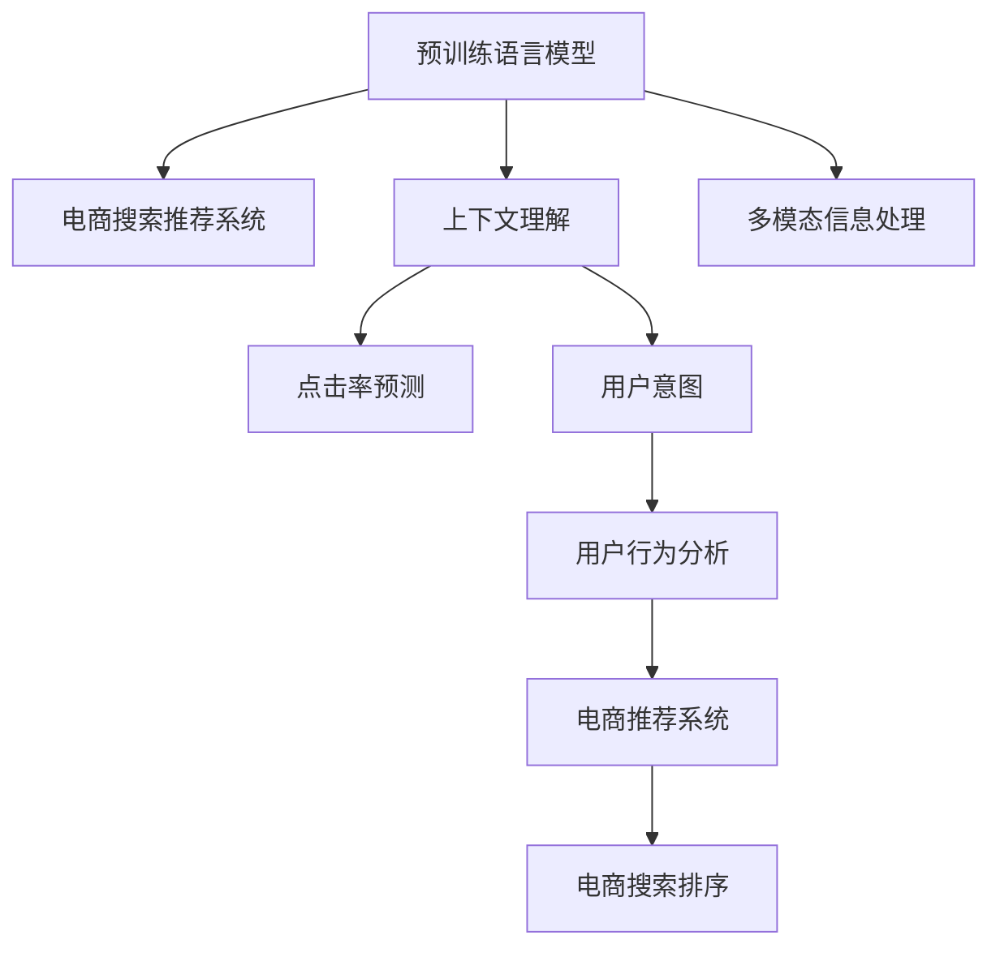

                 

# AI大模型如何提升电商搜索的上下文理解能力

> 关键词：AI大模型,电商搜索,上下文理解,自然语言处理(NLP),Transformer,BERT,点击率预测,用户意图,电商推荐系统,用户行为分析

## 1. 背景介绍

### 1.1 问题由来
随着电商市场的蓬勃发展，电商平台需要处理的海量搜索数据日益增多，对搜索推荐的精准度和实时性提出了更高的要求。传统的基于关键词匹配的搜索方法往往无法充分理解用户意图，导致搜索结果不够相关，用户满意度低。与此同时，随着人工智能技术的飞速发展，预训练语言模型在自然语言处理（NLP）领域取得了显著进展，其强大的上下文理解能力，为电商搜索推荐系统的改进提供了新的思路。

### 1.2 问题核心关键点
本文将探讨如何利用预训练语言模型，特别是基于Transformer的BERT等大模型，提升电商搜索的上下文理解能力，从而优化搜索推荐系统的性能。具体核心问题包括：
1. 如何将大模型的上下文理解能力应用到电商搜索场景？
2. 如何设计有效的查询-理解-响应机制？
3. 如何处理长文本输入和多模态信息？
4. 如何确保模型的实时性、可扩展性和稳定性？

### 1.3 问题研究意义
研究基于大模型的电商搜索系统，具有以下重要意义：
1. 提升用户搜索体验。通过理解用户查询的语境和意图，提供更精准的搜索结果，增加用户满意度。
2. 提高推荐效果。精准的搜索能更好地捕捉用户兴趣，提升推荐系统的效果和用户留存率。
3. 加速电商业务的智能化转型。大模型能够处理复杂的查询输入，提升电商平台的自动化和智能化水平。
4. 推动AI技术落地应用。电商搜索系统是AI技术落地应用的重要场景之一，其成功应用将为其他领域的AI技术推广提供范例。

## 2. 核心概念与联系

### 2.1 核心概念概述

为更好地理解基于大模型的电商搜索系统，本节将介绍几个关键概念：

- **预训练语言模型(Pre-trained Language Models, PLMs)**：如BERT、GPT等，通过大规模无标签文本数据的自监督预训练，学习通用语言表示。预训练模型在处理自然语言任务中展现出强大的上下文理解能力。

- **电商搜索推荐系统(E-commerce Search and Recommendation System)**：利用用户搜索行为数据，通过算法推荐产品，提升用户购物体验的系统。电商搜索推荐系统是NLP技术在电商领域的重要应用之一。

- **上下文理解(Contextual Understanding)**：指模型能够根据输入文本的整体语境和上下文信息，推断用户意图，生成精准的搜索结果或推荐。

- **点击率预测(Click-Through Rate Prediction, CTR Prediction)**：预测用户对搜索结果的点击行为，用于评估搜索排序和推荐策略的效果。

- **用户意图(User Intent)**：指用户在搜索过程中真实的购买意图和需求，通过理解用户查询的上下文，可以更准确地捕捉用户意图。

- **多模态信息处理(Multimodal Information Processing)**：在电商搜索中，除了文本信息，还有图片、视频等多模态数据，需要处理和融合这些不同类型的数据。

这些核心概念之间的联系可以通过以下Mermaid流程图来展示：



这个流程图展示了预训练语言模型在电商搜索系统中的应用路径：

1. 预训练语言模型通过上下文理解，捕捉用户查询的语境和意图。
2. 用户意图通过点击率预测，评估搜索结果的相关性。
3. 用户行为分析用于优化推荐策略。
4. 多模态信息处理提升搜索结果的丰富性和多样性。
5. 电商推荐系统结合上下文理解和用户行为，生成推荐结果。
6. 电商搜索排序应用点击率预测，优化搜索结果的展示顺序。

## 3. 核心算法原理 & 具体操作步骤

### 3.1 算法原理概述

基于大模型的电商搜索系统，利用其强大的上下文理解能力，通过分析用户查询的语境，预测用户意图，生成精确的搜索结果。具体而言，系统将用户的搜索查询输入到预训练模型中，经过上下文理解生成模型预测的用户意图。再根据意图生成精准的搜索结果或推荐，最终结合点击率预测，优化搜索结果的排序。

### 3.2 算法步骤详解

以下是基于大模型的电商搜索系统的一般步骤：

**Step 1: 预训练模型的选择和加载**

- 选择合适的预训练语言模型，如BERT、GPT等，加载到系统环境中。

**Step 2: 构建查询-理解-响应机制**

- 将用户的查询输入到预训练模型中，通过上下文理解生成模型预测的用户意图。
- 根据意图，生成相关的搜索结果或推荐列表。
- 将搜索结果或推荐列表呈现给用户，等待用户点击或进一步操作。

**Step 3: 用户行为分析**

- 收集用户的点击、购买、收藏等行为数据，分析用户行为模式。
- 根据用户行为，调整搜索算法和推荐策略，提升用户体验。

**Step 4: 点击率预测和结果排序**

- 利用预训练模型对搜索结果进行点击率预测，评估搜索结果的相关性。
- 结合预测结果和用户行为数据，优化搜索结果的排序，提升点击率和用户体验。

### 3.3 算法优缺点

基于大模型的电商搜索系统具有以下优点：
1. 强大的上下文理解能力。预训练语言模型能够理解复杂的查询语境，捕捉用户意图。
2. 提升搜索结果的相关性。通过上下文理解和点击率预测，提升搜索结果的相关性，减少误点击率。
3. 提高推荐效果。精准的搜索结果能更好地捕捉用户兴趣，提升推荐系统的效果和用户留存率。
4. 实时性和可扩展性。大模型具有良好的推理效率，可以处理大规模搜索请求，支持电商系统的实时性和可扩展性。

同时，该方法也存在一些局限性：
1. 依赖标注数据。虽然预训练模型能理解语境，但仍然需要标注数据训练上下文理解模型。
2. 模型复杂度较高。预训练模型的参数量巨大，需要高性能的计算资源。
3. 模型的泛化能力有限。预训练模型往往在特定领域的泛化能力有限，需要针对不同电商场景进行微调。
4. 数据隐私和安全问题。电商搜索涉及大量用户隐私信息，如何保护数据安全和隐私是一个重要挑战。

尽管存在这些局限性，但就目前而言，基于大模型的电商搜索方法仍是大模型应用的热点之一，具有广阔的发展前景。未来研究的方向在于如何进一步优化模型的上下文理解能力，降低数据需求，提升模型的泛化能力，同时保护用户隐私。

### 3.4 算法应用领域

基于大模型的电商搜索系统已经在多个领域得到了应用，例如：

- 商品搜索。利用用户输入的查询，通过上下文理解生成商品推荐，提升搜索效果。
- 个性化推荐。根据用户的历史行为数据，预测用户偏好，生成个性化的商品推荐列表。
- 实时搜索。处理用户实时输入的查询，即时生成搜索结果或推荐。
- 多模态搜索。结合图片、视频等多模态信息，提升搜索结果的多样性和丰富性。
- 社交电商搜索。利用社交网络数据，预测用户购买行为，优化搜索结果和推荐。

除了这些经典应用外，大模型还在广告定向、内容推荐、市场分析等电商领域的新兴应用中展现出巨大潜力。

## 4. 数学模型和公式 & 详细讲解 & 举例说明

### 4.1 数学模型构建

本节将使用数学语言对基于大模型的电商搜索系统进行更加严格的刻画。

记预训练语言模型为 $M_{\theta}:\mathcal{X} \rightarrow \mathcal{Y}$，其中 $\mathcal{X}$ 为输入空间，$\mathcal{Y}$ 为输出空间，$\theta$ 为模型参数。假设电商搜索的查询输入为 $q \in \mathcal{X}$，用户意图为 $i \in \mathcal{Y}$。

电商搜索的目标是最大化点击率预测模型的准确性，即最小化负对数似然损失函数：

$$
\mathcal{L}(\theta) = -\frac{1}{N} \sum_{n=1}^{N} \sum_{m=1}^{M} [y_{nm} \log \hat{y}_{nm} + (1-y_{nm}) \log (1-\hat{y}_{nm})]
$$

其中 $N$ 为样本数，$M$ 为点击行为，$y_{nm}$ 为点击标记，$\hat{y}_{nm}$ 为模型预测的点击概率。

### 4.2 公式推导过程

以下我们以点击率预测为例，推导基于大模型的电商搜索系统的损失函数及其梯度的计算公式。

假设模型 $M_{\theta}$ 在输入 $q$ 上的输出为 $\hat{i}=M_{\theta}(q) \in [0,1]$，表示用户意图 $i$ 的概率。真实标签 $i \in \{0,1\}$。则二分类交叉熵损失函数定义为：

$$
\ell(M_{\theta}(q),i) = -[i\log \hat{i} + (1-i)\log (1-\hat{i})]
$$

将其代入经验风险公式，得：

$$
\mathcal{L}(\theta) = -\frac{1}{N}\sum_{n=1}^{N} \sum_{m=1}^{M} [y_{nm} \log M_{\theta}(q_n) + (1-y_{nm}) \log(1-M_{\theta}(q_n))]
$$

根据链式法则，损失函数对参数 $\theta$ 的梯度为：

$$
\frac{\partial \mathcal{L}(\theta)}{\partial \theta} = -\frac{1}{N}\sum_{n=1}^{N} \sum_{m=1}^{M} (\frac{y_{nm}}{M_{\theta}(q_n)}-\frac{1-y_{nm}}{1-M_{\theta}(q_n)}) \frac{\partial M_{\theta}(q_n)}{\partial \theta}
$$

其中 $\frac{\partial M_{\theta}(q_n)}{\partial \theta}$ 可进一步递归展开，利用自动微分技术完成计算。

在得到损失函数的梯度后，即可带入参数更新公式，完成模型的迭代优化。重复上述过程直至收敛，最终得到适应电商搜索任务的模型参数 $\theta^*$。

### 4.3 案例分析与讲解

为了更好地理解基于大模型的电商搜索系统的运行机制，下面通过一个具体的案例进行分析：

假设有一个电商平台的商品搜索系统，用户输入的查询为 "2023款苹果笔记本"，预训练语言模型将其解析为查询意图为购买2023年的苹果笔记本。系统根据查询意图生成相关的搜索结果和推荐，包括2023款MacBook、Apple Store的官方页面等。用户浏览搜索结果并进行了点击，系统记录了用户点击行为数据，进一步优化搜索结果排序和推荐策略。

这个案例展示了预训练语言模型在电商搜索中的关键作用：
1. 理解查询意图。通过上下文理解，模型能够准确捕捉用户购买意图。
2. 生成搜索结果。根据意图，系统生成相关搜索结果，提升用户体验。
3. 优化推荐策略。利用用户行为数据，调整推荐策略，提升推荐效果。
4. 实时排序。结合点击率预测，实时优化搜索结果的排序，提升点击率和用户满意度。

## 5. 项目实践：代码实例和详细解释说明

### 5.1 开发环境搭建

在进行电商搜索系统开发前，我们需要准备好开发环境。以下是使用Python进行PyTorch开发的环境配置流程：

1. 安装Anaconda：从官网下载并安装Anaconda，用于创建独立的Python环境。

2. 创建并激活虚拟环境：
```bash
conda create -n pytorch-env python=3.8 
conda activate pytorch-env
```

3. 安装PyTorch：根据CUDA版本，从官网获取对应的安装命令。例如：
```bash
conda install pytorch torchvision torchaudio cudatoolkit=11.1 -c pytorch -c conda-forge
```

4. 安装其他必要的Python库：
```bash
pip install pandas numpy scikit-learn matplotlib tqdm jupyter notebook ipython
```

完成上述步骤后，即可在`pytorch-env`环境中开始开发。

### 5.2 源代码详细实现

下面以点击率预测任务为例，给出使用Transformers库对BERT模型进行电商搜索系统微调的PyTorch代码实现。

首先，定义电商搜索任务的训练集和测试集：

```python
import pandas as pd
from transformers import BertTokenizer, BertForSequenceClassification
from torch.utils.data import Dataset, DataLoader

class E-commerceDataset(Dataset):
    def __init__(self, queries, clicks, tokenizer, max_len=128):
        self.queries = queries
        self.clicks = clicks
        self.tokenizer = tokenizer
        self.max_len = max_len
        
    def __len__(self):
        return len(self.queries)
    
    def __getitem__(self, item):
        query = self.queries[item]
        click = self.clicks[item]
        
        encoding = self.tokenizer(query, return_tensors='pt', max_length=self.max_len, padding='max_length', truncation=True)
        input_ids = encoding['input_ids'][0]
        attention_mask = encoding['attention_mask'][0]
        
        # 对点击标记进行编码
        encoded_click = [click] * self.max_len
        encoded_click.extend([0] * (self.max_len - len(encoded_click)))
        labels = torch.tensor(encoded_click, dtype=torch.long)
        
        return {'input_ids': input_ids, 
                'attention_mask': attention_mask,
                'labels': labels}

# 加载数据集
train_data = pd.read_csv('train_data.csv')
test_data = pd.read_csv('test_data.csv')

# 分词和编码
tokenizer = BertTokenizer.from_pretrained('bert-base-cased')
train_dataset = E-commerceDataset(train_data['query'], train_data['click'], tokenizer)
test_dataset = E-commerceDataset(test_data['query'], test_data['click'], tokenizer)
```

然后，定义模型和优化器：

```python
from transformers import AdamW

model = BertForSequenceClassification.from_pretrained('bert-base-cased', num_labels=2) # 2类分类任务

optimizer = AdamW(model.parameters(), lr=2e-5)
```

接着，定义训练和评估函数：

```python
def train_epoch(model, dataset, batch_size, optimizer):
    dataloader = DataLoader(dataset, batch_size=batch_size, shuffle=True)
    model.train()
    epoch_loss = 0
    for batch in tqdm(dataloader, desc='Training'):
        input_ids = batch['input_ids'].to(device)
        attention_mask = batch['attention_mask'].to(device)
        labels = batch['labels'].to(device)
        model.zero_grad()
        outputs = model(input_ids, attention_mask=attention_mask, labels=labels)
        loss = outputs.loss
        epoch_loss += loss.item()
        loss.backward()
        optimizer.step()
    return epoch_loss / len(dataloader)

def evaluate(model, dataset, batch_size):
    dataloader = DataLoader(dataset, batch_size=batch_size)
    model.eval()
    preds, labels = [], []
    with torch.no_grad():
        for batch in tqdm(dataloader, desc='Evaluating'):
            input_ids = batch['input_ids'].to(device)
            attention_mask = batch['attention_mask'].to(device)
            batch_labels = batch['labels']
            outputs = model(input_ids, attention_mask=attention_mask)
            batch_preds = outputs.logits.argmax(dim=2).to('cpu').tolist()
            batch_labels = batch_labels.to('cpu').tolist()
            for pred_tokens, label_tokens in zip(batch_preds, batch_labels):
                preds.append(pred_tokens[:len(label_tokens)])
                labels.append(label_tokens)
                
    print(classification_report(labels, preds))
```

最后，启动训练流程并在测试集上评估：

```python
epochs = 5
batch_size = 16

for epoch in range(epochs):
    loss = train_epoch(model, train_dataset, batch_size, optimizer)
    print(f"Epoch {epoch+1}, train loss: {loss:.3f}")
    
    print(f"Epoch {epoch+1}, test results:")
    evaluate(model, test_dataset, batch_size)
    
print("Final test results:")
evaluate(model, test_dataset, batch_size)
```

以上就是使用PyTorch对BERT进行电商搜索系统点击率预测任务的微调的完整代码实现。可以看到，借助Transformers库，代码实现简洁高效。

### 5.3 代码解读与分析

让我们再详细解读一下关键代码的实现细节：

**E-commerceDataset类**：
- `__init__`方法：初始化查询、点击、分词器等关键组件。
- `__len__`方法：返回数据集的样本数量。
- `__getitem__`方法：对单个样本进行处理，将查询输入编码为token ids，将点击标记编码为数字，并对其进行定长padding，最终返回模型所需的输入。

**点击率预测任务的实现**：
- 使用PyTorch的DataLoader对数据集进行批次化加载，供模型训练和推理使用。
- 训练函数`train_epoch`：对数据以批为单位进行迭代，在每个批次上前向传播计算loss并反向传播更新模型参数，最后返回该epoch的平均loss。
- 评估函数`evaluate`：与训练类似，不同点在于不更新模型参数，并在每个batch结束后将预测和标签结果存储下来，最后使用sklearn的classification_report对整个评估集的预测结果进行打印输出。

**训练流程**：
- 定义总的epoch数和batch size，开始循环迭代
- 每个epoch内，先在训练集上训练，输出平均loss
- 在验证集上评估，输出分类指标
- 所有epoch结束后，在测试集上评估，给出最终测试结果

可以看到，PyTorch配合Transformers库使得BERT微调的代码实现变得简洁高效。开发者可以将更多精力放在数据处理、模型改进等高层逻辑上，而不必过多关注底层的实现细节。

当然，工业级的系统实现还需考虑更多因素，如模型的保存和部署、超参数的自动搜索、更灵活的任务适配层等。但核心的微调范式基本与此类似。

## 6. 实际应用场景
### 6.1 智能客服系统

基于大语言模型微调的对话技术，可以广泛应用于智能客服系统的构建。传统客服往往需要配备大量人力，高峰期响应缓慢，且一致性和专业性难以保证。而使用微调后的对话模型，可以7x24小时不间断服务，快速响应客户咨询，用自然流畅的语言解答各类常见问题。

在技术实现上，可以收集企业内部的历史客服对话记录，将问题和最佳答复构建成监督数据，在此基础上对预训练对话模型进行微调。微调后的对话模型能够自动理解用户意图，匹配最合适的答案模板进行回复。对于客户提出的新问题，还可以接入检索系统实时搜索相关内容，动态组织生成回答。如此构建的智能客服系统，能大幅提升客户咨询体验和问题解决效率。

### 6.2 金融舆情监测

金融机构需要实时监测市场舆论动向，以便及时应对负面信息传播，规避金融风险。传统的人工监测方式成本高、效率低，难以应对网络时代海量信息爆发的挑战。基于大语言模型微调的文本分类和情感分析技术，为金融舆情监测提供了新的解决方案。

具体而言，可以收集金融领域相关的新闻、报道、评论等文本数据，并对其进行主题标注和情感标注。在此基础上对预训练语言模型进行微调，使其能够自动判断文本属于何种主题，情感倾向是正面、中性还是负面。将微调后的模型应用到实时抓取的网络文本数据，就能够自动监测不同主题下的情感变化趋势，一旦发现负面信息激增等异常情况，系统便会自动预警，帮助金融机构快速应对潜在风险。

### 6.3 个性化推荐系统

当前的推荐系统往往只依赖用户的历史行为数据进行物品推荐，无法深入理解用户的真实兴趣偏好。基于大语言模型微调技术，个性化推荐系统可以更好地挖掘用户行为背后的语义信息，从而提供更精准、多样的推荐内容。

在实践中，可以收集用户浏览、点击、评论、分享等行为数据，提取和用户交互的物品标题、描述、标签等文本内容。将文本内容作为模型输入，用户的后续行为（如是否点击、购买等）作为监督信号，在此基础上微调预训练语言模型。微调后的模型能够从文本内容中准确把握用户的兴趣点。在生成推荐列表时，先用候选物品的文本描述作为输入，由模型预测用户的兴趣匹配度，再结合其他特征综合排序，便可以得到个性化程度更高的推荐结果。

### 6.4 未来应用展望

随着大语言模型微调技术的发展，未来其在电商搜索推荐系统的应用将更加广泛和深入。以下是几个未来应用展望：

1. **多模态搜索**：结合图像、视频等多模态信息，提升搜索结果的多样性和丰富性，提升用户体验。

2. **跨领域迁移学习**：将在大规模电商数据上训练的模型迁移到其他领域，如时尚、旅游、教育等，实现领域的泛化能力。

3. **动态调整策略**：根据实时用户行为数据，动态调整搜索和推荐策略，提升系统的灵活性和适应性。

4. **实时互动**：通过聊天机器人等形式，实现实时与用户的互动，提升用户的互动体验。

5. **个性化服务**：结合用户的个人信息和历史行为数据，提供个性化的搜索结果和推荐。

6. **隐私保护**：在保护用户隐私的前提下，实现精准的搜索结果和推荐。

总之，基于大模型的电商搜索系统将不断创新和优化，为电商行业带来新的突破。未来，随着技术的不断发展，电商搜索系统的智能化、个性化和实时性将进一步提升，推动电商业务向更加智能和高效的方向发展。

## 7. 工具和资源推荐
### 7.1 学习资源推荐

为了帮助开发者系统掌握大语言模型微调的理论基础和实践技巧，这里推荐一些优质的学习资源：

1. 《Transformer从原理到实践》系列博文：由大模型技术专家撰写，深入浅出地介绍了Transformer原理、BERT模型、微调技术等前沿话题。

2. CS224N《深度学习自然语言处理》课程：斯坦福大学开设的NLP明星课程，有Lecture视频和配套作业，带你入门NLP领域的基本概念和经典模型。

3. 《Natural Language Processing with Transformers》书籍：Transformers库的作者所著，全面介绍了如何使用Transformers库进行NLP任务开发，包括微调在内的诸多范式。

4. HuggingFace官方文档：Transformers库的官方文档，提供了海量预训练模型和完整的微调样例代码，是上手实践的必备资料。

5. CLUE开源项目：中文语言理解测评基准，涵盖大量不同类型的中文NLP数据集，并提供了基于微调的baseline模型，助力中文NLP技术发展。

通过对这些资源的学习实践，相信你一定能够快速掌握大语言模型微调的精髓，并用于解决实际的NLP问题。
### 7.2 开发工具推荐

高效的开发离不开优秀的工具支持。以下是几款用于大语言模型微调开发的常用工具：

1. PyTorch：基于Python的开源深度学习框架，灵活动态的计算图，适合快速迭代研究。大部分预训练语言模型都有PyTorch版本的实现。

2. TensorFlow：由Google主导开发的开源深度学习框架，生产部署方便，适合大规模工程应用。同样有丰富的预训练语言模型资源。

3. Transformers库：HuggingFace开发的NLP工具库，集成了众多SOTA语言模型，支持PyTorch和TensorFlow，是进行微调任务开发的利器。

4. Weights & Biases：模型训练的实验跟踪工具，可以记录和可视化模型训练过程中的各项指标，方便对比和调优。与主流深度学习框架无缝集成。

5. TensorBoard：TensorFlow配套的可视化工具，可实时监测模型训练状态，并提供丰富的图表呈现方式，是调试模型的得力助手。

6. Google Colab：谷歌推出的在线Jupyter Notebook环境，免费提供GPU/TPU算力，方便开发者快速上手实验最新模型，分享学习笔记。

合理利用这些工具，可以显著提升大语言模型微调任务的开发效率，加快创新迭代的步伐。

### 7.3 相关论文推荐

大语言模型和微调技术的发展源于学界的持续研究。以下是几篇奠基性的相关论文，推荐阅读：

1. Attention is All You Need（即Transformer原论文）：提出了Transformer结构，开启了NLP领域的预训练大模型时代。

2. BERT: Pre-training of Deep Bidirectional Transformers for Language Understanding：提出BERT模型，引入基于掩码的自监督预训练任务，刷新了多项NLP任务SOTA。

3. Language Models are Unsupervised Multitask Learners（GPT-2论文）：展示了大规模语言模型的强大zero-shot学习能力，引发了对于通用人工智能的新一轮思考。

4. Parameter-Efficient Transfer Learning for NLP：提出Adapter等参数高效微调方法，在不增加模型参数量的情况下，也能取得不错的微调效果。

5. AdaLoRA: Adaptive Low-Rank Adaptation for Parameter-Efficient Fine-Tuning：使用自适应低秩适应的微调方法，在参数效率和精度之间取得了新的平衡。

这些论文代表了大语言模型微调技术的发展脉络。通过学习这些前沿成果，可以帮助研究者把握学科前进方向，激发更多的创新灵感。

## 8. 总结：未来发展趋势与挑战

### 8.1 总结

本文对基于大模型的电商搜索系统进行了全面系统的介绍。首先阐述了大语言模型和微调技术的研究背景和意义，明确了微调在拓展预训练模型应用、提升搜索结果的相关性方面的独特价值。其次，从原理到实践，详细讲解了电商搜索系统的上下文理解机制，给出了微调任务开发的完整代码实例。同时，本文还探讨了基于大模型的电商搜索系统在多个实际应用场景中的高效性和潜力。

通过本文的系统梳理，可以看到，基于大模型的电商搜索系统正在成为电商搜索推荐系统的重要范式，极大地拓展了预训练语言模型的应用边界，催生了更多的落地场景。受益于大规模语料的预训练，微调系统能够处理复杂的查询输入，提供精准的搜索结果和推荐，提升用户的搜索体验和留存率。未来，随着预训练语言模型的持续演进和微调技术的不断优化，基于大模型的电商搜索系统将进一步提升电商业务的智能化水平，推动电商行业的数字化转型。

### 8.2 未来发展趋势

展望未来，基于大模型的电商搜索系统将呈现以下几个发展趋势：

1. **模型规模持续增大**：随着算力成本的下降和数据规模的扩张，预训练语言模型的参数量还将持续增长。超大规模语言模型蕴含的丰富语言知识，有望支撑更加复杂多变的电商搜索任务。

2. **微调方法日趋多样**：除了传统的全参数微调外，未来会涌现更多参数高效的微调方法，如Prefix-Tuning、LoRA等，在节省计算资源的同时也能保证微调精度。

3. **上下文理解能力增强**：通过更先进的大模型和微调方法，模型的上下文理解能力将进一步提升，能够更好地处理长文本和多模态信息。

4. **实时性和可扩展性优化**：开发更高效的推理引擎和模型压缩技术，提升模型的实时性和可扩展性，支持大规模电商搜索系统的部署。

5. **跨领域迁移能力提升**：通过多任务学习等方法，提升模型的跨领域迁移能力，使得电商搜索模型可以迁移到其他领域，如医疗、金融等。

6. **用户意图理解深化**：结合知识图谱、逻辑规则等先验知识，深化对用户意图的理解，提升搜索结果和推荐的准确性。

以上趋势凸显了大语言模型微调技术的广阔前景。这些方向的探索发展，必将进一步提升电商搜索系统的性能和应用范围，为电商行业带来新的突破。

### 8.3 面临的挑战

尽管基于大模型的电商搜索系统已经取得了显著成果，但在迈向更加智能化、普适化应用的过程中，它仍面临着诸多挑战：

1. **数据隐私和安全问题**：电商搜索涉及大量用户隐私信息，如何保护数据安全和隐私是一个重要挑战。

2. **模型鲁棒性和泛化能力**：现有模型在特定领域的泛化能力有限，对域外数据的泛化能力还需要进一步提升。

3. **计算资源消耗大**：大模型推理和训练所需的高性能计算资源，可能带来成本和效率问题。

4. **模型的可解释性不足**：大规模语言模型往往被视为"黑盒"系统，难以解释其内部工作机制和决策逻辑。

5. **模型的稳定性和一致性**：在处理大规模数据和复杂查询时，模型的稳定性需要进一步保障。

尽管存在这些挑战，但随着预训练语言模型和大模型微调技术的不断进步，相信基于大模型的电商搜索系统将在未来取得更大的突破，推动电商行业的智能化转型。

### 8.4 研究展望

面向未来，大语言模型微调技术的研究将在以下几个方向继续深入：

1. **多模态融合**：结合图像、视频等多模态数据，提升电商搜索系统的丰富性和多样性。

2. **跨领域迁移学习**：将电商搜索中的知识迁移到其他领域，提升跨领域泛化能力。

3. **上下文理解的多层次表示**：通过多层次表示学习，提升模型对上下文语境的理解深度。

4. **知识增强**：结合知识图谱和逻辑规则，增强模型的语义理解和推理能力。

5. **自适应学习**：开发自适应学习算法，使模型能够根据数据分布的变化进行动态调整，提升模型的泛化能力。

6. **高效推理**：开发高效的推理引擎，支持大规模电商搜索系统的部署。

这些研究方向的探索，将进一步推动大语言模型微调技术的发展，为电商搜索系统的智能化和高效化提供新的思路和方法。相信在学界和产业界的共同努力下，基于大模型的电商搜索系统将不断创新和优化，推动电商业务的智能化转型。

## 9. 附录：常见问题与解答

**Q1：大语言模型微调是否适用于所有电商搜索场景？**

A: 大语言模型微调在大多数电商搜索场景上都能取得不错的效果，特别是在数据量较小的任务上。但对于一些特定领域的搜索场景，如医药、教育等，仅仅依靠通用语料预训练的模型可能难以很好地适应。此时需要在特定领域语料上进一步预训练，再进行微调，才能获得理想效果。此外，对于一些需要时效性、个性化很强的任务，如实时搜索、个性化推荐等，微调方法也需要针对性的改进优化。

**Q2：电商搜索中，如何处理长文本输入和多模态信息？**

A: 电商搜索中，用户的查询输入可能包含长文本，甚至多模态信息（如图片、视频）。为了处理这些问题，可以采用以下方法：
1. 长文本处理：使用文本分割、摘要等技术，将长文本转换为合适的输入格式。
2. 多模态融合：利用多模态融合技术，将文本、图片、视频等信息进行联合建模，提升搜索系统的丰富性和多样性。

**Q3：电商搜索中，如何解决计算资源消耗大、推理效率低的问题？**

A: 电商搜索中，大模型的推理和训练所需的高性能计算资源，可能带来成本和效率问题。为了解决这些问题，可以采用以下方法：
1. 模型裁剪：去除不必要的层和参数，减小模型尺寸，加快推理速度。
2. 量化加速：将浮点模型转为定点模型，压缩存储空间，提高计算效率。
3. 分布式训练：使用分布式训练技术，提升训练效率。
4. 推理优化：开发高效的推理引擎，减少计算量和内存占用。

**Q4：电商搜索中，如何确保模型的实时性、可扩展性和稳定性？**

A: 电商搜索系统需要实时响应用户查询，且需要处理大规模数据，对模型的实时性、可扩展性和稳定性提出了高要求。为了确保这些要求，可以采用以下方法：
1. 推理优化：优化推理算法，提高模型推理速度。
2. 分布式部署：使用分布式部署技术，提升系统的可扩展性。
3. 异常检测：实时监控模型状态，设置异常告警阈值，确保系统稳定性。
4. 自动调优：使用自动调优技术，根据实时数据动态调整模型参数，提升系统性能。

通过这些方法，可以显著提升电商搜索系统的实时性、可扩展性和稳定性，确保系统能够高效、稳定地运行。

**Q5：电商搜索中，如何保护用户隐私？**

A: 电商搜索涉及大量用户隐私信息，如何保护用户隐私是一个重要挑战。为了保护用户隐私，可以采用以下方法：
1. 匿名化处理：对用户数据进行匿名化处理，保护用户隐私。
2. 数据脱敏：对敏感数据进行脱敏处理，防止数据泄露。
3. 访问控制：限制数据访问权限，确保数据安全。
4. 加密存储：对用户数据进行加密存储，防止数据被非法访问。

通过这些方法，可以有效保护电商搜索系统中的用户隐私，确保数据安全。

总之，基于大模型的电商搜索系统具有广阔的应用前景，但其技术实现仍面临诸多挑战。未来，随着技术的不断进步和优化，基于大模型的电商搜索系统将进一步提升电商行业的智能化水平，推动电商业务的数字化转型。

