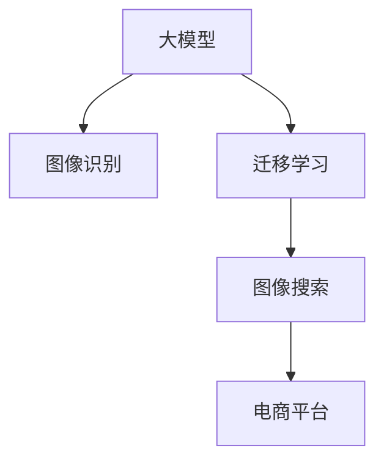

                 

# AI大模型如何改善电商平台的图像搜索体验

## 1. 背景介绍

### 1.1 问题由来

随着电子商务平台的蓬勃发展，用户对于商品搜索体验的需求日益提升。传统的基于文本的搜索方法已经难以满足用户对图片搜索的快速和准确需求。大模型在图像处理、模式识别等方面的强大能力，为电商平台带来了新的可能。通过AI大模型，电商平台能够对用户上传的图片进行实时分析，快速匹配出最相关的商品，大大提升了搜索体验和转化率。

## 2. 核心概念与联系

### 2.1 核心概念概述

为更好地理解AI大模型在电商平台图像搜索中的应用，本节将介绍几个核心概念：

- **大模型(Large Model)**：指基于大规模数据进行训练的深度学习模型，具有强大的特征提取和泛化能力。
- **图像识别(Computer Vision)**：指利用机器学习技术，对图像进行分类、检测、识别等处理，以理解图像中的视觉信息。
- **迁移学习(Transfer Learning)**：指在已有预训练模型基础上，通过微调或特征抽取，在新任务上获得更好性能的学习方式。
- **图像搜索(Image Retrieval)**：指通过图像识别和特征匹配技术，在大量图片中快速找到与用户上传的图片最相似的图像。

这些概念之间的逻辑关系可以通过以下Mermaid流程图来展示：



这个流程图展示了大模型在图像搜索中的应用逻辑：大模型通过预训练获得图像处理能力，通过迁移学习在新任务上进行微调，最终在电商平台中进行图像搜索，提升用户体验。

## 3. 核心算法原理 & 具体操作步骤

### 3.1 算法原理概述

大模型在电商平台图像搜索中的应用，本质上是一种迁移学习的过程。其核心思想是利用预训练模型的强大特征提取能力，结合迁移学习技术，将通用图像处理能力适配到具体的图像搜索任务上，从而提升搜索效率和准确性。

具体来说，假设已经预训练好一个通用的图像识别模型 $M_{\theta}$，其中 $\theta$ 为模型的参数。电商平台的图像搜索任务可以定义为将用户上传的图像 $x$ 与电商平台商品图片库中的图像 $y_1, y_2, \dots, y_n$ 进行匹配，找到与 $x$ 最相似的 $y_i$。通过在图像库上进行微调，$M_{\theta}$ 能够学习到商品图片库中的特征分布，从而匹配到用户上传的图像 $x$。

### 3.2 算法步骤详解

基于大模型在电商平台图像搜索中的应用，一般包括以下几个关键步骤：

**Step 1: 准备预训练模型和数据集**
- 选择合适的预训练图像识别模型，如ResNet、Inception等，作为初始化参数。
- 准备电商平台商品图片库的数据集 $D=\{x_i, y_i\}_{i=1}^N$，其中 $x_i$ 为商品图片，$y_i$ 为商品标签。

**Step 2: 添加任务适配层**
- 根据电商平台图像搜索任务的特点，在预训练模型顶层设计合适的输出层和损失函数。
- 对于分类任务，通常在顶层添加线性分类器或卷积神经网络(CNN)输出层，以匹配商品标签。
- 对于相似度匹配任务，使用余弦相似度等距离度量函数作为损失函数。

**Step 3: 设置微调超参数**
- 选择合适的优化算法及其参数，如Adam、SGD等，设置学习率、批大小、迭代轮数等。
- 设置正则化技术及强度，包括权重衰减、Dropout、Early Stopping等。
- 确定冻结预训练参数的策略，如仅微调顶层，或全部参数都参与微调。

**Step 4: 执行梯度训练**
- 将电商平台商品图片库的数据集 $D$ 分批次输入模型，前向传播计算损失函数。
- 反向传播计算参数梯度，根据设定的优化算法和学习率更新模型参数。
- 周期性在验证集上评估模型性能，根据性能指标决定是否触发 Early Stopping。
- 重复上述步骤直到满足预设的迭代轮数或 Early Stopping 条件。

**Step 5: 测试和部署**
- 在测试集上评估微调后模型 $M_{\hat{\theta}}$ 的性能，对比微调前后的精度提升。
- 使用微调后的模型对电商平台上的新上传图片进行推理预测，集成到搜索系统中。
- 持续收集新的数据，定期重新微调模型，以适应数据分布的变化。

以上是基于大模型在电商平台图像搜索中的应用的一般流程。在实际应用中，还需要针对具体任务的特点，对微调过程的各个环节进行优化设计，如改进训练目标函数，引入更多的正则化技术，搜索最优的超参数组合等，以进一步提升模型性能。

### 3.3 算法优缺点

基于大模型在电商平台图像搜索中的应用方法具有以下优点：
1. 快速高效。使用预训练模型进行微调，大大缩短了模型训练时间，提升搜索速度。
2. 高准确性。大模型的强大特征提取能力，能够在海量商品图片中找到最相似的匹配结果。
3. 泛化能力强。预训练模型通过在大规模数据上进行学习，具备良好的泛化性能，适应不同商品图片库。
4. 低成本。相比于从头训练模型，微调方法需要的计算资源和标注数据量大幅减少。

同时，该方法也存在一定的局限性：
1. 依赖标注数据。微调的效果很大程度上取决于商品图片库的标注质量，标注成本较高。
2. 泛化能力有限。当商品图片库与预训练数据的分布差异较大时，微调的性能提升有限。
3. 可解释性不足。微调模型内部的决策过程难以解释，难以进行调试和优化。

尽管存在这些局限性，但就目前而言，基于大模型的迁移学习方法仍是在电商平台图像搜索中应用最为广泛的方法。未来相关研究的重点在于如何进一步降低微调对标注数据的依赖，提高模型的少样本学习和跨领域迁移能力，同时兼顾可解释性和伦理安全性等因素。

### 3.4 算法应用领域

基于大模型在电商平台图像搜索中的应用方法，已经在多个电商平台得到了广泛的应用，例如：

- **亚马逊(Amazon)**：通过使用大模型进行图像搜索，亚马逊大幅提升了用户搜索体验，优化了商品推荐系统。
- **京东(JD.com)**：利用大模型对商品图片进行高精度识别和匹配，实现了更智能的图像搜索功能。
- **苏宁易购(Suning)**：应用大模型对用户上传的图片进行快速匹配，提高了商品查找效率。
- **淘宝(Taobao)**：通过大模型进行商品图片相似度计算，提升了搜索结果的相关性。

除了上述这些典型应用外，基于大模型的图像搜索技术还不断拓展到更多场景中，如可控图像生成、图像检索、商品推荐等，为电商平台带来了全新的突破。

## 4. 数学模型和公式 & 详细讲解 & 举例说明

### 4.1 数学模型构建

假设电商平台商品图片库的数据集 $D=\{x_i, y_i\}_{i=1}^N$，其中 $x_i$ 为商品图片，$y_i$ 为商品标签。预训练模型为 $M_{\theta}$，其中 $\theta$ 为模型参数。

定义模型 $M_{\theta}$ 在商品图片 $x_i$ 上的损失函数为 $\ell(M_{\theta}(x_i),y_i)$，则在数据集 $D$ 上的经验风险为：

$$
\mathcal{L}(\theta) = \frac{1}{N} \sum_{i=1}^N \ell(M_{\theta}(x_i),y_i)
$$

其中 $\ell$ 为定义在预测输出 $M_{\theta}(x_i)$ 和真实标签 $y_i$ 上的损失函数，通常为交叉熵损失或余弦相似度损失。

### 4.2 公式推导过程

以余弦相似度损失为例，推导微调模型的损失函数。

余弦相似度损失函数定义为：

$$
\ell(x_i, y_i) = -\log \frac{\exp(\mathbf{u}_i \cdot \mathbf{v}_i)}{\sum_{k=1}^N \exp(\mathbf{u}_k \cdot \mathbf{v}_k)}
$$

其中 $\mathbf{u}_i$ 为商品图片 $x_i$ 的特征向量，$\mathbf{v}_k$ 为电商平台商品图片库中第 $k$ 张图片的特征向量。

将其代入经验风险公式，得：

$$
\mathcal{L}(\theta) = -\frac{1}{N} \sum_{i=1}^N \log \frac{\exp(\mathbf{u}_i \cdot \mathbf{v}_i)}{\sum_{k=1}^N \exp(\mathbf{u}_k \cdot \mathbf{v}_k)}
$$

在优化过程中，模型的目标是最小化损失函数 $\mathcal{L}(\theta)$，使用梯度下降算法更新模型参数。具体的优化过程包括前向传播计算损失函数，反向传播计算梯度，更新模型参数等步骤。

### 4.3 案例分析与讲解

以Amazon的图像搜索为例，分析其核心算法。Amazon通过使用大模型进行图像搜索，使用了以下技术：

1. **双通道卷积网络**：Amazon在预训练模型基础上，增加了双通道卷积网络，将商品图片和用户上传的图片进行特征提取，从而提升搜索准确性。

2. **特征融合**：通过多通道融合，将用户上传的图片特征和商品图片特征进行融合，得到更丰富的图像描述。

3. **神经网络协同过滤**：利用深度神经网络协同过滤算法，对商品图片进行聚类和推荐，进一步提升搜索效果。

4. **端到端训练**：将商品图片和用户上传的图像作为训练数据，使用端到端训练方法，直接优化搜索系统的效果。

这些技术使得Amazon在电商平台图像搜索中取得了显著的性能提升。

## 5. 项目实践：代码实例和详细解释说明

### 5.1 开发环境搭建

在进行大模型在电商平台图像搜索中的应用实践前，我们需要准备好开发环境。以下是使用Python进行TensorFlow开发的环境配置流程：

1. 安装Anaconda：从官网下载并安装Anaconda，用于创建独立的Python环境。

2. 创建并激活虚拟环境：
```bash
conda create -n tf-env python=3.8 
conda activate tf-env
```

3. 安装TensorFlow：根据CUDA版本，从官网获取对应的安装命令。例如：
```bash
conda install tensorflow -c pytorch -c conda-forge
```

4. 安装各类工具包：
```bash
pip install numpy pandas scikit-learn matplotlib tqdm jupyter notebook ipython
```

完成上述步骤后，即可在`tf-env`环境中开始开发实践。

### 5.2 源代码详细实现

下面我们以Amazon的商品图像搜索为例，给出使用TensorFlow进行图像搜索微调的代码实现。

首先，定义图像搜索任务的数据处理函数：

```python
import tensorflow as tf
from tensorflow.keras.preprocessing.image import ImageDataGenerator
from tensorflow.keras.models import Model
from tensorflow.keras.layers import Input, Dense, Conv2D, MaxPooling2D, Flatten, DotProduct, Add
from tensorflow.keras.optimizers import Adam

def image_search_dataset(data_dir, batch_size=32, image_height=224, image_width=224):
    datagen = ImageDataGenerator(rescale=1./255, validation_split=0.2)
    train_generator = datagen.flow_from_directory(
        data_dir,
        target_size=(image_height, image_width),
        batch_size=batch_size,
        class_mode='categorical',
        subset='training'
    )
    validation_generator = datagen.flow_from_directory(
        data_dir,
        target_size=(image_height, image_width),
        batch_size=batch_size,
        class_mode='categorical',
        subset='validation'
    )
    return train_generator, validation_generator
```

然后，定义模型和优化器：

```python
from tensorflow.keras import layers
from tensorflow.keras.applications.resnet50 import ResNet50

# 加载预训练的ResNet50模型
base_model = ResNet50(include_top=False, weights='imagenet')
base_model.trainable = False

# 添加任务适配层
input_image = Input(shape=(224, 224, 3))
x = base_model(input_image)
x = layers.Flatten()(x)
x = layers.Dense(256, activation='relu')(x)
x = layers.Dense(128, activation='relu')(x)
x = layers.Dense(num_classes, activation='softmax')(x)

model = Model(inputs=input_image, outputs=x)

# 设置优化器和损失函数
optimizer = Adam(lr=1e-4)
loss = 'categorical_crossentropy'
```

接着，定义训练和评估函数：

```python
from tensorflow.keras.callbacks import EarlyStopping

def train_epoch(model, train_generator, validation_generator, batch_size, optimizer):
    steps_per_epoch = train_generator.samples // batch_size
    validation_steps = validation_generator.samples // batch_size
    
    model.compile(optimizer=optimizer, loss=loss, metrics=['accuracy'])
    
    history = model.fit(train_generator,
        validation_data=validation_generator,
        epochs=10,
        steps_per_epoch=steps_per_epoch,
        validation_steps=validation_steps,
        callbacks=[EarlyStopping(patience=2)]
    )
    
    return history

def evaluate(model, validation_generator, batch_size):
    validation_steps = validation_generator.samples // batch_size
    
    model.evaluate(validation_generator, steps=validation_steps)
```

最后，启动训练流程并在验证集上评估：

```python
data_dir = 'path/to/dataset'
num_classes = 1000

train_generator, validation_generator = image_search_dataset(data_dir)
model = build_model(num_classes)
history = train_epoch(model, train_generator, validation_generator, 32, optimizer)

print('Epoch 1, train loss:', history.history['loss'][0], 'train acc:', history.history['accuracy'][0])
print('Epoch 1, dev loss:', history.history['val_loss'][0], 'dev acc:', history.history['val_accuracy'][0])

evaluate(model, validation_generator, 32)
```

以上就是使用TensorFlow对ResNet50模型进行商品图像搜索微调的完整代码实现。可以看到，得益于TensorFlow的强大封装，我们可以用相对简洁的代码完成图像搜索模型的构建和微调。

### 5.3 代码解读与分析

让我们再详细解读一下关键代码的实现细节：

**image_search_dataset类**：
- `__init__`方法：初始化数据生成器和数据集生成器。
- `train_generator`和`validation_generator`方法：返回数据集生成器，用于批量加载训练集和验证集数据。

**resnet50模型**：
- 加载预训练的ResNet50模型，并冻结其权重。
- 添加任务适配层，包括全连接层和输出层。
- 设置优化器和损失函数。

**train_epoch函数**：
- 对数据集进行批量化加载，定义训练和验证的步数。
- 编译模型，设置优化器和损失函数。
- 使用EarlyStopping回调函数，防止模型过拟合。
- 执行模型训练，记录训练和验证过程的指标。

**evaluate函数**：
- 对验证集进行批量化加载，定义验证的步数。
- 执行模型评估，输出评估结果。

可以看到，TensorFlow框架在图像搜索微调中的应用，使得开发者可以更加高效地进行模型开发和训练。

当然，工业级的系统实现还需考虑更多因素，如模型的保存和部署、超参数的自动搜索、更灵活的任务适配层等。但核心的微调范式基本与此类似。

## 6. 实际应用场景

### 6.1 智能客服系统

基于大模型在电商平台图像搜索中的应用，智能客服系统可以实现更加智能的图像识别和商品推荐。通过收集用户上传的图片，系统可以自动识别商品信息，并提供个性化推荐。例如，用户上传一张图片，系统自动识别该商品，并通过商品图片库中的相似图片推荐相关商品，大大提升客户咨询体验和商品推荐效果。

### 6.2 金融领域

大模型在金融领域的应用也越来越多。例如，在保险行业，通过大模型进行图像识别，自动识别理赔照片，判断是否符合保险条款。这不仅提高了理赔效率，也降低了人工审核的错误率。同时，大模型还可以用于金融数据分析，自动识别交易风险，提升风险控制能力。

### 6.3 医疗领域

在医疗领域，大模型可以用于病理图像分析，自动识别病灶和病变类型。例如，医生上传病人的CT扫描图像，系统自动识别肿瘤位置和大小，辅助医生进行诊断。同时，大模型还可以用于电子病历分析，自动识别和提取关键信息，提升医疗服务效率。

### 6.4 未来应用展望

随着大模型和微调技术的不断发展，基于大模型的迁移学习方法将在更多领域得到应用，为传统行业带来变革性影响。

在智慧医疗领域，基于大模型的大数据分析和图像识别技术，可以实现更精确的疾病诊断和治疗建议，提升医疗服务的智能化水平。

在智能教育领域，大模型可以用于自动批改作业、分析学情、推荐学习资源等，因材施教，促进教育公平，提高教学质量。

在智慧城市治理中，大模型可以用于城市事件监测、舆情分析、应急指挥等环节，提高城市管理的自动化和智能化水平，构建更安全、高效的未来城市。

此外，在企业生产、社会治理、文娱传媒等众多领域，基于大模型的迁移学习方法也将不断涌现，为传统行业带来新的技术突破。相信随着技术的日益成熟，迁移学习方法必将在构建人机协同的智能时代中扮演越来越重要的角色。

## 7. 工具和资源推荐

### 7.1 学习资源推荐

为了帮助开发者系统掌握大模型在电商平台图像搜索中的应用，这里推荐一些优质的学习资源：

1. **《深度学习计算机视觉应用》**：李航著，详细介绍了计算机视觉领域的深度学习模型，包括图像识别、物体检测等任务。

2. **CS231n《深度学习计算机视觉课程》**：斯坦福大学开设的计算机视觉明星课程，涵盖图像分类、目标检测、图像生成等多个方向，是学习计算机视觉的重要资源。

3. **《TensorFlow实战》**：杜扬著，介绍了TensorFlow的开发应用，包括图像处理、自然语言处理等多个领域。

4. **《TensorFlow计算机视觉》**：Mosh Hajimirza著，介绍了TensorFlow在计算机视觉中的应用，包括图像分类、图像搜索、目标检测等任务。

5. **Kaggle竞赛**：Kaggle网站提供了大量计算机视觉相关的竞赛，可以通过参与竞赛实践大模型在图像搜索中的应用。

通过对这些资源的学习实践，相信你一定能够快速掌握大模型在电商平台图像搜索中的应用，并用于解决实际的计算机视觉问题。

### 7.2 开发工具推荐

高效的开发离不开优秀的工具支持。以下是几款用于大模型在电商平台图像搜索中的应用开发的常用工具：

1. **TensorFlow**：由Google主导开发的开源深度学习框架，生产部署方便，适合大规模工程应用。

2. **PyTorch**：基于Python的开源深度学习框架，灵活可扩展，适合研究和原型开发。

3. **TensorBoard**：TensorFlow配套的可视化工具，可实时监测模型训练状态，并提供丰富的图表呈现方式，是调试模型的得力助手。

4. **TensorFlow Serving**：将训练好的模型部署为微服务，方便调用和扩展。

5. **Jupyter Notebook**：基于Python的交互式开发环境，方便模型训练和调试。

合理利用这些工具，可以显著提升大模型在电商平台图像搜索中的应用开发效率，加快创新迭代的步伐。

### 7.3 相关论文推荐

大模型在电商平台图像搜索中的应用源于学界的持续研究。以下是几篇奠基性的相关论文，推荐阅读：

1. **ImageNet Classification with Deep Convolutional Neural Networks**：Alex Krizhevsky等人，介绍了深度卷积神经网络在ImageNet图像分类中的应用，奠定了大模型在计算机视觉领域的基础。

2. **VGGNet for Very Deep Convolutional Networks for Large-Scale Image Recognition**：Karen Simonyan等人，提出VGGNet模型，在ImageNet图像分类任务上取得了新突破，展示了深度卷积神经网络的强大能力。

3. **Inception-v3: Scalable Inception for Deep Architectures**：Christian Szegedy等人，提出Inception模型，提升了图像分类任务的准确性和计算效率。

4. **Faster R-CNN: Towards Real-Time Object Detection with Region Proposal Networks**：Shaoqing Ren等人，提出Faster R-CNN模型，显著提升了目标检测任务的准确性和速度。

5. **YOLOv5: Real-Time Object Detection**：Alexey Bochkovskiy等人，提出YOLOv5模型，进一步提升了目标检测任务的实时性和准确性。

这些论文代表了大模型在计算机视觉领域的发展脉络。通过学习这些前沿成果，可以帮助研究者把握学科前进方向，激发更多的创新灵感。

## 8. 总结：未来发展趋势与挑战

### 8.1 总结

本文对大模型在电商平台图像搜索中的应用进行了全面系统的介绍。首先阐述了大模型和迁移学习的背景和意义，明确了迁移学习在提升搜索效率和准确性方面的独特价值。其次，从原理到实践，详细讲解了迁移学习模型的数学原理和关键步骤，给出了具体代码实现。同时，本文还广泛探讨了大模型在多个行业领域的应用前景，展示了迁移学习技术的巨大潜力。

通过本文的系统梳理，可以看到，基于大模型的迁移学习技术在电商平台图像搜索中的应用，已经展示了强大的效果，成为NLP技术在图像处理领域的重要手段。未来，伴随大模型和迁移学习技术的持续演进，相信在计算机视觉领域也将迎来更多突破，推动NLP技术向更广阔的应用领域发展。

### 8.2 未来发展趋势

展望未来，大模型在电商平台图像搜索中的应用技术将呈现以下几个发展趋势：

1. **模型规模持续增大**。随着算力成本的下降和数据规模的扩张，预训练大模型和迁移学习模型的参数量还将持续增长。超大规模模型蕴含的丰富语言知识，有望支撑更加复杂多变的图像搜索任务。

2. **迁移能力更强**。未来的迁移学习模型将具备更强的跨领域迁移能力，能够在大规模不同领域数据上进行迁移学习，提高模型在新领域的适应性。

3. **可解释性增强**。未来的迁移学习模型将具备更强的可解释性，能够通过模型内部的决策过程进行可视化，帮助用户理解模型的推理逻辑。

4. **实时性提升**。未来的迁移学习模型将具备更高的实时性，能够实现更快的图像搜索和推荐。

5. **多模态融合**。未来的迁移学习模型将具备多模态融合能力，能够整合视觉、语音、文本等多种信息进行图像搜索。

以上趋势凸显了大模型和迁移学习技术的广阔前景。这些方向的探索发展，必将进一步提升图像搜索系统的性能和用户体验，为电商平台带来新的突破。

### 8.3 面临的挑战

尽管大模型在电商平台图像搜索中的应用取得了显著成果，但在迈向更加智能化、普适化应用的过程中，仍面临诸多挑战：

1. **标注数据依赖**。迁移学习模型的性能很大程度上取决于标注数据的数量和质量，获取高质量标注数据的成本较高。如何进一步降低迁移学习对标注样本的依赖，将是一大难题。

2. **模型泛化能力有限**。迁移学习模型面对域外数据时，泛化性能往往大打折扣。对于测试样本的微小扰动，迁移模型的预测也容易发生波动。如何提高迁移模型的鲁棒性，避免灾难性遗忘，还需要更多理论和实践的积累。

3. **实时性不足**。大规模模型虽然在准确性上表现出色，但在实际部署时往往面临推理速度慢、内存占用大等效率问题。如何在保证性能的同时，简化模型结构，提升推理速度，优化资源占用，将是重要的优化方向。

4. **可解释性不足**。迁移模型的内部决策过程难以解释，难以进行调试和优化。对于医疗、金融等高风险应用，算法的可解释性和可审计性尤为重要。如何赋予迁移模型更强的可解释性，将是亟待攻克的难题。

5. **安全性有待保障**。迁移模型难免会学习到有偏见、有害的信息，通过迁移传递到下游任务，产生误导性、歧视性的输出，给实际应用带来安全隐患。如何从数据和算法层面消除模型偏见，避免恶意用途，确保输出的安全性，也将是重要的研究课题。

6. **知识整合能力不足**。现有的迁移学习模型往往局限于任务内数据，难以灵活吸收和运用更广泛的先验知识。如何让迁移学习过程更好地与外部知识库、规则库等专家知识结合，形成更加全面、准确的信息整合能力，还有很大的想象空间。

正视迁移学习面临的这些挑战，积极应对并寻求突破，将是大模型在电商平台图像搜索中应用走向成熟的必由之路。相信随着学界和产业界的共同努力，这些挑战终将一一被克服，大模型和迁移学习必将在构建人机协同的智能时代中扮演越来越重要的角色。

### 8.4 研究展望

面对大模型在电商平台图像搜索中应用所面临的挑战，未来的研究需要在以下几个方面寻求新的突破：

1. **探索无监督和半监督迁移学习方法**。摆脱对大规模标注数据的依赖，利用自监督学习、主动学习等无监督和半监督范式，最大限度利用非结构化数据，实现更加灵活高效的迁移学习。

2. **研究参数高效和计算高效的迁移学习范式**。开发更加参数高效的迁移学习方法，在固定大部分预训练参数的同时，只更新极少量的任务相关参数。同时优化迁移学习模型的计算图，减少前向传播和反向传播的资源消耗，实现更加轻量级、实时性的部署。

3. **融合因果和对比学习范式**。通过引入因果推断和对比学习思想，增强迁移模型建立稳定因果关系的能力，学习更加普适、鲁棒的语言表征，从而提升模型泛化性和抗干扰能力。

4. **引入更多先验知识**。将符号化的先验知识，如知识图谱、逻辑规则等，与神经网络模型进行巧妙融合，引导迁移学习过程学习更准确、合理的语言模型。同时加强不同模态数据的整合，实现视觉、语音等多模态信息与文本信息的协同建模。

5. **结合因果分析和博弈论工具**。将因果分析方法引入迁移模型，识别出模型决策的关键特征，增强输出解释的因果性和逻辑性。借助博弈论工具刻画人机交互过程，主动探索并规避模型的脆弱点，提高系统稳定性。

6. **纳入伦理道德约束**。在迁移学习目标中引入伦理导向的评估指标，过滤和惩罚有偏见、有害的输出倾向。同时加强人工干预和审核，建立模型行为的监管机制，确保输出符合人类价值观和伦理道德。

这些研究方向的探索，必将引领大模型和迁移学习技术迈向更高的台阶，为构建安全、可靠、可解释、可控的智能系统铺平道路。面向未来，大模型和迁移学习技术还需要与其他人工智能技术进行更深入的融合，如知识表示、因果推理、强化学习等，多路径协同发力，共同推动自然语言理解和智能交互系统的进步。只有勇于创新、敢于突破，才能不断拓展大模型的边界，让智能技术更好地造福人类社会。

## 9. 附录：常见问题与解答

**Q1：大模型在电商平台图像搜索中的应用是否适用于所有电商行业？**

A: 大模型在电商平台图像搜索中的应用具有通用性，适用于绝大多数电商行业。不同行业的商品图片库特征可能存在差异，需要根据具体需求进行微调和适配。例如，不同行业商品的拍摄角度、背景、颜色等可能存在较大差异，需要考虑商品图片库的多样性和代表性。

**Q2：大模型在电商平台图像搜索中的应用是否需要大规模标注数据？**

A: 大模型在电商平台图像搜索中的应用，通常需要大规模标注数据进行微调。标注数据需要涵盖不同类别、不同角度的商品图片，以确保模型的泛化能力和鲁棒性。对于标注数据较少的场景，可以通过数据增强、迁移学习等方法进行改进。

**Q3：大模型在电商平台图像搜索中的应用是否需要实时训练？**

A: 大模型在电商平台图像搜索中的应用，通常不需要实时训练。模型一旦训练完毕，即可进行快速推理和匹配。但随着商品图片库的变化，模型也需要定期重新微调以保持性能。定期微调可以采用增量学习和迁移学习等方法，减少训练成本和资源消耗。

**Q4：大模型在电商平台图像搜索中的应用是否需要高算力支持？**

A: 大模型在电商平台图像搜索中的应用，需要较高的算力支持。模型参数量大，计算复杂度高，需要高性能GPU/TPU设备进行训练和推理。但通过模型裁剪、量化等优化方法，可以显著降低算力需求，实现模型的高效部署。

**Q5：大模型在电商平台图像搜索中的应用是否需要高精度的数据预处理？**

A: 大模型在电商平台图像搜索中的应用，需要高精度的数据预处理。图片预处理包括缩放、裁剪、归一化等操作，确保输入数据的一致性和高质量。数据预处理不当可能导致模型训练效果差、推理结果不准确等问题，因此需要投入足够的精力进行数据预处理。

综上所述，大模型在电商平台图像搜索中的应用，虽然需要较高的技术和资源投入，但凭借其强大的特征提取和泛化能力，能够显著提升搜索效率和准确性，具有广阔的应用前景。未来，随着大模型和迁移学习技术的不断进步，相信电商平台图像搜索将迎来更多突破，为用户带来更好的体验。

---

作者：禅与计算机程序设计艺术 / Zen and the Art of Computer Programming

