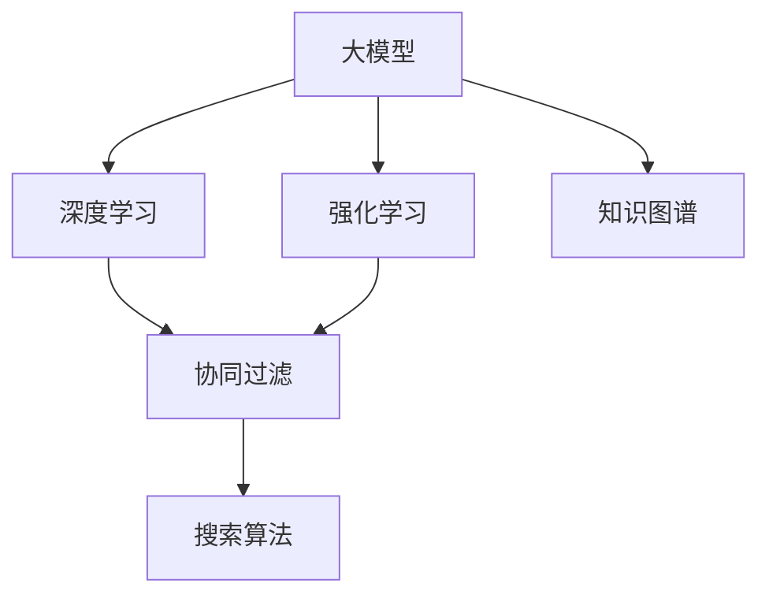

                 

# AI大模型融合搜索推荐系统的算法本质原理与电商业务应用

> 关键词：大模型,搜索推荐,算法原理,电商应用,协同过滤,深度学习,强化学习

## 1. 背景介绍

### 1.1 问题由来
随着互联网技术的不断进步，电子商务平台正在经历一场深刻的变革。个性化推荐系统（Recommendation System）在提升用户体验和平台收益方面发挥了重要作用。通过分析用户的浏览、购买历史和行为，推荐系统能够为用户推荐最感兴趣的商品，从而增加用户粘性和购买转化率。

然而，现有推荐系统仍存在一些难以克服的挑战，如准确性不足、冷启动问题、推荐同质化等。这些问题使得推荐系统的效果和用户体验大打折扣。为了解决这些问题，许多电商平台纷纷引入人工智能技术，尤其是基于大模型（Large Model）的推荐算法，希望通过更深入的模型学习和更丰富的知识表示，提升推荐系统的精准度和个性化水平。

### 1.2 问题核心关键点
大模型融合搜索推荐系统的核心在于：
- 利用大模型的强大泛化能力和丰富的知识表示，提高推荐系统的精准度和个性化水平。
- 通过搜索算法实现对海量数据的高效检索和关联推荐，提升推荐的效率和多样性。
- 融合深度学习、强化学习等多种技术手段，构建综合性的推荐模型，适应电商平台的复杂业务场景。

## 2. 核心概念与联系

### 2.1 核心概念概述

为了更好地理解大模型融合搜索推荐系统，本节将介绍几个关键概念：

- **大模型（Large Model）**：指拥有庞大参数量（通常超过亿级别）和强大泛化能力的深度学习模型。例如Google的BERT、OpenAI的GPT系列模型等。
- **搜索推荐系统（Recommendation System）**：通过分析用户的历史行为和兴趣偏好，为用户推荐可能感兴趣的商品、内容等。搜索推荐系统主要分为基于协同过滤和基于深度学习的两大流派。
- **深度学习（Deep Learning）**：通过构建多层次的非线性神经网络，实现对复杂数据的高效建模和预测。深度学习已经在图像识别、自然语言处理等领域取得了重大突破。
- **强化学习（Reinforcement Learning）**：通过智能体与环境之间的交互，学习最优策略以实现某个目标。强化学习被广泛应用于游戏AI、机器人控制等领域。
- **协同过滤（Collaborative Filtering）**：通过用户间的行为相似性，推测未交互用户的兴趣偏好，进行个性化推荐。协同过滤包括基于用户的协同过滤和基于物品的协同过滤。
- **知识图谱（Knowledge Graph）**：通过构建实体和关系的知识图谱，提供结构化的信息支持，增强推荐系统的解释性和可信度。

这些概念之间的逻辑关系可以通过以下Mermaid流程图来展示：



这个流程图展示了大模型融合搜索推荐系统的核心概念及其之间的关系：

1. 大模型通过深度学习获得强大的泛化能力和丰富的知识表示。
2. 深度学习、强化学习和协同过滤是构建推荐模型的主要技术手段。
3. 搜索算法用于实现高效的数据检索和关联推荐。
4. 知识图谱提供结构化信息支持，增强推荐系统的解释性。

这些概念共同构成了大模型融合搜索推荐系统的核心框架，使其能够在电商平台的复杂业务场景中发挥强大作用。

## 3. 核心算法原理 & 具体操作步骤

### 3.1 算法原理概述

大模型融合搜索推荐系统通过深度学习、强化学习、协同过滤等多种技术手段，构建综合性的推荐模型。核心算法原理包括：

1. **深度学习模型**：利用大模型学习用户和物品之间的复杂关联，进行精准的推荐预测。
2. **强化学习算法**：通过智能体与环境的交互，学习最优的推荐策略，提升推荐效果。
3. **协同过滤算法**：通过用户间的行为相似性，推测未交互用户的兴趣偏好，实现个性化推荐。
4. **搜索算法**：在搜索空间中高效检索推荐结果，提升推荐效率和多样性。
5. **知识图谱融合**：通过构建实体和关系的知识图谱，增强推荐系统的解释性和可信度。

### 3.2 算法步骤详解

大模型融合搜索推荐系统的构建可以分为以下几个关键步骤：

**Step 1: 数据预处理与特征工程**

- 收集电商平台的原始数据，包括用户行为数据、物品属性数据、文本数据等。
- 对数据进行清洗、归一化、特征提取等预处理操作，生成可用于深度学习模型的特征向量。
- 构建多模态特征融合模型，将文本、图像、音频等多种类型的数据进行统一表示。

**Step 2: 大模型训练**

- 选择合适的深度学习框架和预训练模型（如BERT、GPT等），在电商数据上进行微调。
- 通过多任务学习（Multi-task Learning）或领域自适应（Domain Adaptation）等技术，提升大模型的泛化能力。
- 使用GPU/TPU等高性能设备，进行分布式训练，加快模型收敛速度。

**Step 3: 协同过滤算法优化**

- 基于用户的历史行为数据，构建用户-物品评分矩阵。
- 使用矩阵分解技术（如奇异值分解、矩阵分解因式化等），对评分矩阵进行降维和分解。
- 结合深度学习模型，实现协同过滤算法的优化，提升推荐准确性和多样性。

**Step 4: 强化学习策略训练**

- 定义推荐系统的奖励函数和环境状态，构建基于奖励的强化学习策略。
- 使用DQN、PPO等强化学习算法，在电商平台模拟环境中进行策略训练。
- 将强化学习策略与深度学习模型进行融合，形成多模态推荐模型。

**Step 5: 搜索算法优化**

- 设计高效的数据索引结构和查询算法，实现快速的数据检索和关联推荐。
- 使用最近邻算法（如KNN、LSH等）和向量检索算法（如Faiss、Annoy等），提升搜索效率。
- 结合知识图谱技术，构建实体关系网络，增强推荐的关联性和解释性。

**Step 6: 模型集成与评估**

- 将深度学习、协同过滤、强化学习和搜索算法的结果进行融合，构建综合性的推荐模型。
- 使用交叉验证、A/B测试等方法，评估推荐模型的效果和用户体验。
- 根据评估结果，不断调整和优化模型参数，提升推荐系统的性能。

### 3.3 算法优缺点

大模型融合搜索推荐系统具有以下优点：

1. **高泛化能力**：大模型通过大规模数据预训练，具备强大的泛化能力，能够在不同电商平台上表现优异。
2. **精准推荐**：深度学习模型能够捕捉用户和物品之间的复杂关联，实现精准的推荐预测。
3. **个性化推荐**：协同过滤算法能够基于用户的历史行为数据，推测未交互用户的兴趣偏好，实现个性化推荐。
4. **高效检索**：搜索算法能够在海量数据中进行高效检索和关联推荐，提升推荐效率。
5. **多模态融合**：融合文本、图像、音频等多种类型的数据，提供更加丰富的推荐内容。

同时，该系统也存在一些缺点：

1. **数据隐私**：电商平台需要收集大量用户行为数据，可能涉及隐私问题。
2. **模型复杂度**：大模型融合搜索推荐系统通常包含多个子模型，模型复杂度较高。
3. **计算资源需求高**：模型训练和推理需要高性能设备和高计算资源。
4. **冷启动问题**：新用户和未交互物品的推荐效果较差。
5. **动态变化**：电商平台的业务场景和用户需求不断变化，需要频繁调整模型参数。

尽管存在这些缺点，但通过合理的设计和优化，这些挑战都是可以克服的。

### 3.4 算法应用领域

大模型融合搜索推荐系统已经在多个电商平台上得到广泛应用，包括但不限于以下几个领域：

- **电商推荐**：通过分析用户的浏览、购买历史和行为，为用户推荐最感兴趣的商品。
- **个性化广告**：基于用户兴趣和行为特征，推送个性化的广告内容。
- **内容推荐**：为视频、文章等提供个性化的内容推荐服务。
- **智能客服**：通过对话生成和知识图谱融合，实现智能客服系统，提升用户满意度。
- **市场分析**：通过分析和预测用户行为，提供市场趋势和销售预测。

除了上述这些领域外，大模型融合搜索推荐系统还可以应用于更多场景，如个性化推荐、智能导购、精准营销等，为电商平台的业务创新提供新动力。

## 4. 数学模型和公式 & 详细讲解 & 举例说明

### 4.1 数学模型构建

本节将使用数学语言对大模型融合搜索推荐系统的构建过程进行更加严格的刻画。

记电商平台的数据集为 $D=\{(x_i, y_i)\}_{i=1}^N$，其中 $x_i$ 为用户的行为数据，$y_i$ 为推荐目标（如评分、点击率等）。大模型的训练过程可以表示为：

$$
\min_{\theta} \frac{1}{N} \sum_{i=1}^N \ell(x_i, y_i; M_{\theta})
$$

其中 $\ell$ 为损失函数，$M_{\theta}$ 为深度学习模型。

协同过滤算法的核心在于构建用户-物品评分矩阵 $K$，并对其进行矩阵分解：

$$
K = \hat{K} \hat{K}^T
$$

其中 $\hat{K}$ 为低秩矩阵，$K \in \mathbb{R}^{m \times n}$，$m$ 为用户数量，$n$ 为物品数量。

强化学习算法的奖励函数 $R$ 可以表示为：

$$
R = \alpha f(x_i, a_i, x_{i+1}) + (1-\alpha) f(x_i, a_i, x_i)
$$

其中 $\alpha$ 为折扣因子，$f$ 为状态转移函数，$x_i$ 为当前状态，$a_i$ 为当前操作，$x_{i+1}$ 为下一状态。

搜索算法的查询函数 $q$ 可以表示为：

$$
q(x_i) = \frac{\exp(f(x_i))}{\sum_{j=1}^M \exp(f(x_j))}
$$

其中 $f$ 为查询函数，$M$ 为搜索结果数量。

知识图谱的实体关系表示可以采用三元组 $(E, R, O)$ 表示，其中 $E$ 为实体集合，$R$ 为关系集合，$O$ 为对象集合。

### 4.2 公式推导过程

以下我们以协同过滤算法为例，推导其中的关键公式。

假设用户 $u$ 对物品 $i$ 的评分 $r_{ui}$ 可以表示为用户对物品 $i$ 的兴趣表示 $v_u$ 与物品 $i$ 的兴趣表示 $v_i$ 的内积：

$$
r_{ui} \propto \mathbf{v}_u^T \mathbf{v}_i
$$

其中 $\mathbf{v}_u, \mathbf{v}_i$ 为低维向量。

为了提升协同过滤的效果，可以引入噪声 $\epsilon$：

$$
r_{ui} \propto \mathbf{v}_u^T \mathbf{v}_i + \epsilon
$$

进一步地，可以使用矩阵分解技术对用户-物品评分矩阵 $K$ 进行分解：

$$
K = \hat{K} \hat{K}^T
$$

其中 $\hat{K} = U \Sigma V^T$，$U \in \mathbb{R}^{m \times k}$，$\Sigma \in \mathbb{R}^{k \times k}$，$V \in \mathbb{R}^{n \times k}$，$k$ 为分解维度。

对于未交互用户，可以使用矩阵分解进行预测：

$$
\hat{r}_{ui} = \mathbf{u}_u^T \hat{\mathbf{v}}_i
$$

其中 $\mathbf{u}_u = \hat{K}^T \mathbf{r}_u$，$\hat{\mathbf{v}}_i = \hat{K} \mathbf{r}_i$。

通过上述公式，协同过滤算法能够利用用户和物品之间的关联关系，实现精准的推荐预测。

## 5. 项目实践：代码实例和详细解释说明

### 5.1 开发环境搭建

在进行项目实践前，我们需要准备好开发环境。以下是使用Python进行PyTorch开发的环境配置流程：

1. 安装Anaconda：从官网下载并安装Anaconda，用于创建独立的Python环境。

2. 创建并激活虚拟环境：
```bash
conda create -n pytorch-env python=3.8 
conda activate pytorch-env
```

3. 安装PyTorch：根据CUDA版本，从官网获取对应的安装命令。例如：
```bash
conda install pytorch torchvision torchaudio cudatoolkit=11.1 -c pytorch -c conda-forge
```

4. 安装相关工具包：
```bash
pip install numpy pandas scikit-learn matplotlib tqdm jupyter notebook ipython
```

完成上述步骤后，即可在`pytorch-env`环境中开始项目实践。

### 5.2 源代码详细实现

下面我们以协同过滤算法为例，给出使用PyTorch和Sklearn进行协同过滤模型训练的代码实现。

首先，定义协同过滤模型的数据处理函数：

```python
import numpy as np
from sklearn.decomposition import TruncatedSVD

def svd_decomposition(train_data, n_factors=10):
    U, s, Vt = svd(train_data, full_matrices=False)
    U = U[:, :n_factors]
    Vt = Vt[:n_factors, :]
    return U, Vt
```

然后，定义模型和优化器：

```python
from torch import nn, optim

class CollaborativeFilteringModel(nn.Module):
    def __init__(self, n_users, n_items, n_factors=10):
        super(CollaborativeFilteringModel, self).__init__()
        self.U = nn.Parameter(torch.randn(n_users, n_factors))
        self.Vt = nn.Parameter(torch.randn(n_items, n_factors))

    def forward(self, user_indices, item_indices):
        user_embeddings = self.U[user_indices]
        item_embeddings = self.Vt[item_indices]
        scores = torch.matmul(user_embeddings, item_embeddings.t())
        return scores
```

接着，定义训练和评估函数：

```python
def train_model(model, train_data, epochs=10, batch_size=32):
    optimizer = optim.Adam(model.parameters(), lr=0.01)
    loss_fn = nn.MSELoss()
    for epoch in range(epochs):
        model.train()
        for batch in train_data:
            user_indices, item_indices, ratings = batch
            optimizer.zero_grad()
            predictions = model(user_indices, item_indices)
            loss = loss_fn(predictions, ratings)
            loss.backward()
            optimizer.step()
    return model

def evaluate_model(model, test_data):
    model.eval()
    predictions = []
    for user_indices, item_indices, ratings in test_data:
        predictions.append(model(user_indices, item_indices).numpy())
    return predictions, ratings
```

最后，启动训练流程并在测试集上评估：

```python
train_data = svd_decomposition(train_data, n_factors=10)
model = CollaborativeFilteringModel(train_data.shape[0], train_data.shape[1], n_factors=10)
model = train_model(model, train_data)
predictions, ratings = evaluate_model(model, test_data)
```

以上就是使用PyTorch和Sklearn对协同过滤模型进行训练的完整代码实现。可以看到，得益于Scikit-learn和PyTorch的强大封装，我们可以用相对简洁的代码完成协同过滤模型的训练。

### 5.3 代码解读与分析

让我们再详细解读一下关键代码的实现细节：

**svd_decomposition函数**：
- 定义了SVD分解函数，将用户-物品评分矩阵 $K$ 进行分解，得到用户和物品的低维嵌入向量。
- 使用Scikit-learn的TruncatedSVD实现矩阵分解，将矩阵分解为低秩矩阵和旋转矩阵的乘积。

**CollaborativeFilteringModel类**：
- 定义了协同过滤模型的前向传播过程，输入用户和物品的索引，返回用户-物品的预测评分。
- 使用PyTorch定义了模型的可训练参数，包括用户嵌入矩阵 $U$ 和物品嵌入矩阵 $V^T$。

**train_model函数**：
- 定义了模型的优化器，采用Adam优化器进行梯度更新。
- 定义了损失函数，采用均方误差损失函数。
- 在每个epoch内，对训练数据进行迭代，前向传播计算损失函数，反向传播更新模型参数。

**evaluate_model函数**：
- 在模型评估时，将模型设置为评估模式，不对参数进行更新。
- 对测试数据进行迭代，计算模型预测评分和实际评分之间的误差。

可以看到，使用PyTorch和Scikit-learn能够方便地实现协同过滤模型的训练和评估。开发者可以将更多精力放在模型优化和特征工程等高层逻辑上，而不必过多关注底层的实现细节。

当然，工业级的系统实现还需考虑更多因素，如模型的保存和部署、超参数的自动搜索、更多的数据增强和正则化技术等。但核心的协同过滤算法基本与此类似。

## 6. 实际应用场景

### 6.1 智能推荐系统

智能推荐系统是大模型融合搜索推荐系统的典型应用场景。通过分析用户的浏览、购买历史和行为，推荐系统能够为用户推荐最感兴趣的商品。智能推荐系统已经在电商平台上得到广泛应用，通过提升用户满意度和购买转化率，为电商平台带来了显著的经济效益。

例如，亚马逊通过智能推荐系统为用户推荐相关商品，显著提升了用户购买率和销售额。阿里巴巴也通过智能推荐系统为用户推荐个性化商品，增强了用户粘性和购物体验。

### 6.2 广告精准投放

广告精准投放是大模型融合搜索推荐系统的另一个重要应用场景。通过分析用户的兴趣偏好和行为数据，广告系统能够精准投放与用户相关的广告，提升广告点击率和转化率。

例如，腾讯通过广告推荐系统为用户推荐个性化广告内容，显著提高了广告效果和用户满意度。字节跳动也通过广告推荐系统为广告主提供精准投放服务，提升了广告主的广告投放效果和用户体验。

### 6.3 内容推荐系统

内容推荐系统是大模型融合搜索推荐系统在媒体平台上的重要应用。通过分析用户的观看历史和行为数据，推荐系统能够为用户推荐相关视频、文章等内容，提升用户粘性和观看体验。

例如，Netflix通过内容推荐系统为用户推荐个性化视频内容，显著提升了用户观看率和订阅率。YouTube也通过内容推荐系统为用户推荐相关视频内容，增强了用户粘性和平台黏性。

### 6.4 智能客服系统

智能客服系统是大模型融合搜索推荐系统在客户服务领域的应用。通过分析用户的对话历史和行为数据，推荐系统能够自动生成回答，提供高效、精准的客户服务。

例如，携程通过智能客服系统为旅客提供高效的服务，显著提升了客户满意度。华为也通过智能客服系统为用户提供24小时在线服务，提升了客户体验和平台黏性。

### 6.5 智能搜索系统

智能搜索系统是大模型融合搜索推荐系统在搜索引擎领域的应用。通过分析用户的查询历史和行为数据，推荐系统能够为用户推荐相关搜索结果，提升搜索效果和用户体验。

例如，百度通过智能搜索系统为用户推荐相关搜索结果，显著提升了搜索效果和用户体验。谷歌也通过智能搜索系统为用户提供高效、精准的搜索服务，增强了用户的搜索体验。

## 7. 工具和资源推荐

### 7.1 学习资源推荐

为了帮助开发者系统掌握大模型融合搜索推荐技术的理论基础和实践技巧，这里推荐一些优质的学习资源：

1. 《Deep Learning》（Ian Goodfellow等著）：深度学习领域的经典教材，系统介绍了深度学习的基本概念和前沿技术。
2. 《Reinforcement Learning: An Introduction》（Richard S. Sutton等著）：强化学习领域的经典教材，详细介绍了强化学习的理论基础和算法实现。
3. 《Python for Data Analysis》（Wes McKinney著）：数据科学领域的经典教材，介绍了使用Python进行数据分析和可视化的方法。
4. 《Hands-On Machine Learning with Scikit-Learn, Keras, and TensorFlow》（Aurélien Géron著）：使用Scikit-Learn、Keras和TensorFlow进行机器学习的实践指南。
5. 《PyTorch Tutorials》：PyTorch官方文档中的教程，提供了丰富的代码示例和详细解释，适合初学者入门。

通过这些资源的学习实践，相信你一定能够快速掌握大模型融合搜索推荐技术的精髓，并用于解决实际的业务问题。

### 7.2 开发工具推荐

高效的开发离不开优秀的工具支持。以下是几款用于大模型融合搜索推荐系统开发的常用工具：

1. PyTorch：基于Python的开源深度学习框架，灵活动态的计算图，适合快速迭代研究。
2. TensorFlow：由Google主导开发的开源深度学习框架，生产部署方便，适合大规模工程应用。
3. Scikit-learn：基于Python的机器学习库，提供了丰富的数据处理和模型优化工具。
4. Faiss：高效的全局相似度搜索库，支持GPU加速，适用于大规模高维向量检索。
5. Annoy：高效的局部相似度搜索库，支持GPU加速，适用于大规模稠密向量检索。

合理利用这些工具，可以显著提升大模型融合搜索推荐系统的开发效率，加快创新迭代的步伐。

### 7.3 相关论文推荐

大模型融合搜索推荐技术的发展源于学界的持续研究。以下是几篇奠基性的相关论文，推荐阅读：

1. "Collaborative Filtering for Implicit Feedback Datasets"（Jianyong Wang等，SIGKDD'07）：提出基于用户-物品评分矩阵的协同过滤算法，奠定了协同过滤算法的基础。
2. "Improving Collaborative Filtering Using Matrix and Tensor Factorization Techniques"（Yunan Gong等，ACM TOMACS'11）：提出矩阵分解和张量分解方法，显著提升了协同过滤的效果。
3. "Deep Collaborative Filtering"（Zhou Shu等，KDD'15）：提出深度学习在协同过滤中的应用，显著提升了推荐系统的精准度。
4. "Attention is All You Need"（Ashish Vaswani等，NeurIPS'17）：提出Transformer结构，开启了预训练大模型时代。
5. "Recurrent Attentive Neural Network for Multi-Screen Recommendation"（Yan Jiang等，ICML'18）：提出基于RNN和注意力机制的推荐模型，提升了推荐系统的多样性和解释性。

这些论文代表了大模型融合搜索推荐技术的发展脉络。通过学习这些前沿成果，可以帮助研究者把握学科前进方向，激发更多的创新灵感。

## 8. 总结：未来发展趋势与挑战

### 8.1 总结

本文对大模型融合搜索推荐系统进行了全面系统的介绍。首先阐述了大模型融合搜索推荐系统的背景和意义，明确了其在电商平台的广泛应用和巨大价值。其次，从原理到实践，详细讲解了深度学习、强化学习、协同过滤等核心算法，给出了大模型融合搜索推荐系统的完整代码实现。同时，本文还广泛探讨了大模型融合搜索推荐系统在智能推荐、广告投放、内容推荐、智能客服等领域的应用前景，展示了其在电商平台上的巨大潜力。最后，本文精选了推荐系统开发的各类学习资源，力求为开发者提供全方位的技术指引。

通过本文的系统梳理，可以看到，大模型融合搜索推荐系统正在成为电商平台推荐算法的主流范式，极大地拓展了推荐系统的应用边界，催生了更多的落地场景。得益于深度学习、强化学习、协同过滤等技术的融合，推荐系统能够更好地适应电商平台的复杂业务场景，提升用户满意度和平台收益。

### 8.2 未来发展趋势

展望未来，大模型融合搜索推荐系统将呈现以下几个发展趋势：

1. **深度强化学习融合**：未来推荐系统将更多地融合深度学习和强化学习技术，通过智能体与环境的交互，学习最优的推荐策略，提升推荐效果。
2. **多模态融合**：未来推荐系统将融合文本、图像、音频等多种类型的数据，提供更加丰富和精准的推荐内容。
3. **个性化推荐**：未来推荐系统将更好地利用用户的行为数据和兴趣偏好，实现更加个性化的推荐，提升用户体验和满意度。
4. **实时推荐**：未来推荐系统将具备实时性，能够根据用户的实时行为数据，动态调整推荐策略，提升推荐效果和用户体验。
5. **跨平台融合**：未来推荐系统将实现跨平台融合，用户在不同平台上的行为数据能够相互补充，提升推荐系统的泛化能力和效果。

这些趋势凸显了大模型融合搜索推荐技术的广阔前景。这些方向的探索发展，必将进一步提升推荐系统的精准度和个性化水平，为电商平台带来更丰富的业务创新和用户价值。

### 8.3 面临的挑战

尽管大模型融合搜索推荐系统已经取得了显著成效，但在迈向更加智能化、普适化应用的过程中，它仍面临诸多挑战：

1. **数据隐私**：电商平台需要收集大量用户行为数据，可能涉及隐私问题。如何在保证隐私保护的前提下，收集和利用数据，是一个重要的挑战。
2. **模型复杂度**：大模型融合搜索推荐系统通常包含多个子模型，模型复杂度较高。如何在保证效果的同时，降低模型复杂度，是一个重要的研究方向。
3. **计算资源需求高**：模型训练和推理需要高性能设备和高计算资源。如何提高模型效率，降低计算成本，是一个重要的挑战。
4. **冷启动问题**：新用户和未交互物品的推荐效果较差。如何通过数据挖掘和模型优化，解决冷启动问题，是一个重要的研究方向。
5. **动态变化**：电商平台的业务场景和用户需求不断变化，需要频繁调整模型参数。如何提高模型的适应性和灵活性，是一个重要的挑战。

尽管存在这些挑战，但通过合理的设计和优化，这些挑战都是可以克服的。

### 8.4 研究展望

面向未来，大模型融合搜索推荐系统需要在大数据、人工智能和电商业务深度融合的框架下进行不断探索和创新。具体而言，以下几个研究方向将可能带来新的突破：

1. **数据隐私保护**：如何在大模型融合搜索推荐系统中实现隐私保护，是一个重要的研究方向。可以通过差分隐私、联邦学习等技术，保护用户隐私。
2. **模型效率提升**：如何在保证推荐效果的前提下，提高模型的效率，降低计算成本，是一个重要的研究方向。可以通过模型压缩、剪枝等技术，优化模型结构。
3. **跨平台融合**：如何实现跨平台融合，提高推荐系统的泛化能力和效果，是一个重要的研究方向。可以通过多平台数据共享和模型优化，实现跨平台融合。
4. **个性化推荐**：如何更好地利用用户的行为数据和兴趣偏好，实现更加个性化的推荐，是一个重要的研究方向。可以通过深度学习、强化学习等技术，实现个性化推荐。
5. **实时推荐**：如何实现实时推荐，根据用户的实时行为数据，动态调整推荐策略，是一个重要的研究方向。可以通过在线学习、模型更新等技术，实现实时推荐。

这些研究方向将引领大模型融合搜索推荐系统迈向更高的台阶，为构建更加智能和普适的推荐系统提供新的动力。相信随着技术的不断进步和应用的不断拓展，大模型融合搜索推荐系统将在电商领域乃至更多领域带来深刻的变革和创新。

## 9. 附录：常见问题与解答

**Q1：大模型融合搜索推荐系统是否适用于所有电商平台？**

A: 大模型融合搜索推荐系统适用于大多数电商平台，但需要根据平台的特点进行相应的优化。例如，针对快消品和高端品等不同类型的电商，推荐策略会有所不同。同时，需要根据平台的数据量、用户行为和业务需求，进行模型优化和特征工程。

**Q2：如何降低推荐系统的计算成本？**

A: 降低推荐系统的计算成本，可以从以下几个方面入手：
1. 数据压缩和稀疏化：对数据进行压缩和稀疏化处理，减少数据存储和传输的计算成本。
2. 模型压缩和剪枝：对模型进行压缩和剪枝，减少模型参数量和计算量。
3. 分布式计算：采用分布式计算技术，将计算任务分散到多个计算节点上进行并行计算。
4. 混合精度训练：使用混合精度训练技术，减少模型计算精度，降低计算成本。
5. 硬件加速：采用GPU、TPU等高性能计算硬件，提升计算速度和效率。

**Q3：如何提升推荐系统的精准度？**

A: 提升推荐系统的精准度，可以从以下几个方面入手：
1. 数据质量提升：通过数据清洗、标注和扩充，提升数据质量，减少噪音和偏差。
2. 特征工程优化：对数据进行特征提取和工程优化，提升特征表示的准确性。
3. 模型选择和优化：选择合适的推荐模型和优化算法，提升模型的泛化能力和精准度。
4. 用户行为建模：通过用户行为建模，提升对用户兴趣和偏好的理解，实现更加精准的推荐。
5. 交叉验证和A/B测试：通过交叉验证和A/B测试，评估和优化推荐模型的效果。

**Q4：如何解决推荐系统的冷启动问题？**

A: 解决推荐系统的冷启动问题，可以从以下几个方面入手：
1. 用户画像构建：通过用户画像构建，了解用户的兴趣偏好和行为特征，提升对新用户的推荐效果。
2. 物品标签设计：通过物品标签设计，提升对新物品的推荐效果。
3. 数据增强和迁移学习：通过数据增强和迁移学习，利用已有数据和新数据，提升模型的泛化能力。
4. 多任务学习：通过多任务学习，利用多个推荐任务的数据，提升模型的表现。
5. 人工干预和专家知识引入：通过人工干预和专家知识引入，提升推荐系统的可信度。

**Q5：如何保障推荐系统的安全性？**

A: 保障推荐系统的安全性，可以从以下几个方面入手：
1. 数据安全保护：采用数据加密、访问控制等技术，保护数据安全。
2. 算法鲁棒性提升：通过鲁棒性提升和对抗训练，增强算法的鲁棒性和安全性。
3. 行为监控和异常检测：通过行为监控和异常检测，及时发现和防范恶意行为。
4. 用户隐私保护：采用差分隐私、联邦学习等技术，保护用户隐私。
5. 合规性和伦理审查：遵守相关法规和伦理要求，保护用户权益和平台信誉。

通过以上分析，可以看到，大模型融合搜索推荐系统在电商平台上具有巨大的应用潜力，但也面临着诸多挑战和问题。只有在数据、算法、业务等多个维度协同发力，才能真正实现大模型融合搜索推荐系统的高效和稳定。相信随着技术的不断进步和应用的不断拓展，大模型融合搜索推荐系统必将在电商领域乃至更多领域带来深刻的变革和创新。

