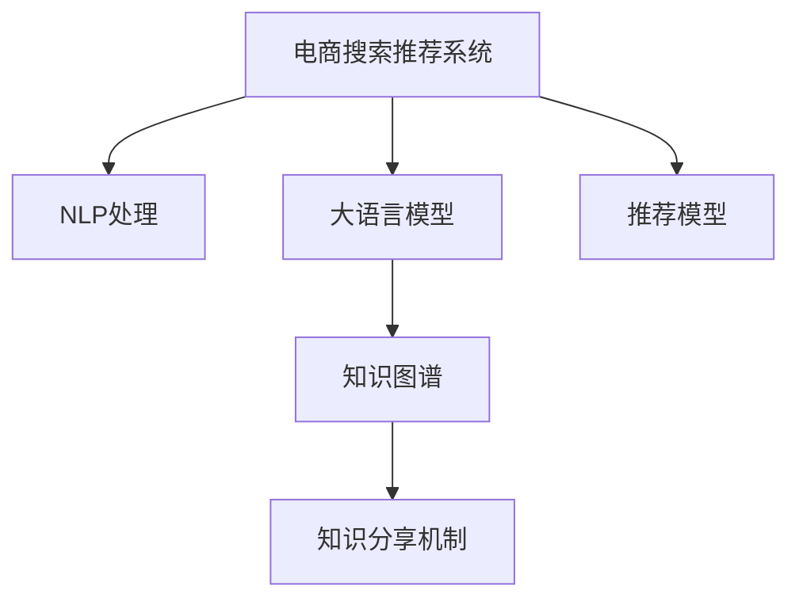

                 

# AI大模型视角下电商搜索推荐的技术创新知识分享机制设计与实现

> 关键词：电商搜索,推荐系统,知识图谱,知识分享机制,大模型技术,深度学习,自然语言处理,上下文理解

## 1. 背景介绍

### 1.1 问题由来

在电商领域，搜索和推荐系统作为连接用户与商品的桥梁，扮演着至关重要的角色。传统的基于关键词匹配的搜索推荐系统往往难以理解用户的复杂需求，推荐结果与用户真实意图存在较大偏差。

近年来，随着深度学习和大语言模型的兴起，基于上下文理解的搜索推荐技术逐渐成为研究热点。这种技术利用自然语言处理(NLP)和大规模预训练语言模型，能够从用户的查询和行为中挖掘出更深入的语义信息，提升推荐效果和用户体验。

然而，电商搜索推荐系统涉及用户数据隐私、商品信息结构化、多模态信息融合等诸多复杂问题，单纯依靠深度学习算法往往难以解决。这推动了从数据、算法、模型、系统等各个层面进行技术创新的需求。

## 2. 核心概念与联系

### 2.1 核心概念概述

为更好地理解基于大模型的电商搜索推荐技术，本节将介绍几个关键概念：

- **电商搜索推荐系统**：基于用户查询和行为数据，为用户提供个性化商品推荐的系统。传统的基于关键词的搜索推荐系统无法充分理解用户意图，推荐效果有限。而基于上下文理解的搜索推荐系统，能够通过NLP和大语言模型深入挖掘用户需求，提高推荐相关性和用户体验。

- **自然语言处理(NLP)**：利用计算机处理、理解和生成人类语言的技术。NLP在搜索推荐系统中用于理解用户查询和商品描述，抽取关键字和实体信息，以及生成商品推荐描述。

- **大语言模型**：通过自监督学习任务在大规模语料上预训练的语言模型，具有强大的语言理解能力和生成能力。在电商搜索推荐中，大语言模型可以作为上下文理解的引擎，进行用户查询理解、商品描述抽取、推荐语料生成等。

- **知识图谱**：以结构化的方式组织和存储实体及实体间关系的数据库。在电商搜索推荐中，知识图谱可以用于商品实体和关系抽取，增强推荐系统的上下文理解能力。

- **知识分享机制**：在电商搜索推荐系统中，将知识图谱中的实体和关系信息与大语言模型融合，形成知识增强的推荐模型。知识分享机制的引入，可以提升推荐系统的泛化能力和鲁棒性，增强推荐效果的稳定性和可解释性。

这些核心概念之间的逻辑关系可以通过以下Mermaid流程图来展示：



这个流程图展示了大语言模型在电商搜索推荐系统中的核心作用，以及知识图谱和知识分享机制对其上下文理解能力的增强。

## 3. 核心算法原理 & 具体操作步骤
### 3.1 算法原理概述

基于大模型的电商搜索推荐系统，核心在于通过NLP技术理解用户查询和商品描述，利用大语言模型的上下文理解能力，生成高质量的推荐结果。其基本流程包括：

1. 收集用户查询和行为数据，使用NLP技术进行预处理，抽取实体、关系等结构化信息。
2. 利用大语言模型，根据用户查询和行为信息，生成推荐商品语料。
3. 将推荐语料与知识图谱中的实体和关系信息进行融合，提升推荐效果。
4. 训练推荐模型，利用上下文理解和大语言模型生成高质量推荐结果。

这种基于上下文理解的推荐系统，相比于传统的关键词匹配系统，能够更好地理解用户需求，提供更个性化、更精准的推荐服务。

### 3.2 算法步骤详解

具体实现过程中，可以采用以下步骤：

**Step 1: 数据准备**
- 收集用户查询、商品描述、历史行为等数据，清洗并存储在数据库中。
- 使用NLP技术对数据进行预处理，抽取实体、关系等结构化信息。

**Step 2: 大语言模型预处理**
- 使用大语言模型对用户查询和商品描述进行预训练，抽取关键信息。
- 对抽取的信息进行编码，形成向量表示，作为推荐模型的输入。

**Step 3: 知识图谱融合**
- 将知识图谱中的商品实体和关系信息与大语言模型抽取的信息进行融合，形成更丰富的上下文信息。
- 利用融合后的信息，生成推荐商品语料。

**Step 4: 推荐模型训练**
- 训练推荐模型，利用上下文理解和融合信息生成推荐结果。
- 在验证集上进行调参和优化，确保模型稳定性和泛化能力。

**Step 5: 模型部署与应用**
- 将训练好的模型部署到生产环境，进行实时推荐。
- 收集用户反馈，定期更新模型，提升推荐效果。

### 3.3 算法优缺点

基于大模型的电商搜索推荐系统，相较于传统的关键词匹配系统，有以下优点：

- 上下文理解能力强：能够理解用户查询的复杂语义，提供更个性化、更精准的推荐结果。
- 泛化能力好：模型在处理新的查询和数据时，能够保持较好的性能稳定性。
- 鲁棒性强：能够应对多模态数据融合和知识图谱的复杂性，提高推荐系统的鲁棒性。

同时，这种系统也存在一些缺点：

- 计算资源需求高：大语言模型需要较大的计算资源和存储资源，在部署时可能面临硬件瓶颈。
- 知识图谱构建难度大：知识图谱的构建需要大量专家知识，且复杂度高，对模型效果的提升存在不确定性。
- 模型可解释性不足：大语言模型的决策过程难以解释，用户难以理解推荐结果的生成逻辑。
- 隐私和安全问题：电商搜索推荐系统涉及大量用户隐私数据，如何保护数据安全是一个重要问题。

### 3.4 算法应用领域

基于大模型的电商搜索推荐技术，已经在多个电商平台上得到广泛应用，涵盖推荐商品、个性化搜索、上下文广告等多个场景：

- 商品推荐：利用用户查询和行为数据，生成个性化推荐商品。
- 个性化搜索：根据用户查询，提供精准匹配的商品搜索结果。
- 上下文广告：根据用户浏览历史和行为，生成精准的定向广告。
- 用户画像：通过分析用户查询和行为数据，构建用户画像，进行精准营销。

除了上述这些经典应用外，大语言模型在电商搜索推荐中还可应用于智能客服、销售预测、库存管理等更多场景，为电商企业带来更大的商业价值。

## 4. 数学模型和公式 & 详细讲解 & 举例说明

### 4.1 数学模型构建

在本节中，我们将通过数学语言对基于大模型的电商搜索推荐系统进行严格刻画。

假设用户查询为 $q$，商品描述为 $d$，用户历史行为为 $h$。使用NLP技术对查询和描述进行预处理，得到关键实体和关系信息，形成向量表示 $\vec{q}, \vec{d}$。

定义推荐模型为 $M_{\theta}(q,d,h)$，其中 $\theta$ 为模型参数。推荐模型的输出为 $y$，表示推荐商品的相关度得分。

推荐模型的损失函数为：

$$
\mathcal{L}(\theta) = \sum_{(q,d,h) \in D} \mathrm{loss}(M_{\theta}(q,d,h),y)
$$

其中 $D$ 为训练集，$\mathrm{loss}$ 为推荐结果与真实标签之间的损失函数，如均方误差等。

### 4.2 公式推导过程

以基于大模型的电商推荐系统为例，我们将详细推导推荐模型的训练过程：

首先，使用大语言模型对用户查询和商品描述进行预训练，抽取关键实体和关系信息。假设使用BERT模型，其输出为：

$$
\vec{q} = \mathrm{BERT}(q), \vec{d} = \mathrm{BERT}(d)
$$

其中 $\vec{q}, \vec{d}$ 为序列表示向量，通过MaxPooling或Attention机制抽取关键信息，形成向量表示。

接着，将 $\vec{q}, \vec{d}$ 与用户历史行为 $h$ 进行拼接，形成上下文向量：

$$
\vec{q_d_h} = [\vec{q}, \vec{d}, h]
$$

将 $\vec{q_d_h}$ 输入推荐模型 $M_{\theta}(q,d,h)$，生成推荐结果 $y$：

$$
y = M_{\theta}(\vec{q_d_h})
$$

定义推荐模型的损失函数为均方误差：

$$
\mathrm{loss}(y, y^*) = \frac{1}{N} \sum_{i=1}^N (y_i - y_i^*)^2
$$

其中 $N$ 为训练样本数，$y_i$ 为推荐结果，$y_i^*$ 为真实标签。

推荐模型的优化目标是最小化损失函数：

$$
\theta^* = \mathop{\arg\min}_{\theta} \mathcal{L}(\theta)
$$

在优化过程中，一般使用梯度下降等优化算法进行模型训练：

$$
\theta \leftarrow \theta - \eta \nabla_{\theta}\mathcal{L}(\theta)
$$

其中 $\eta$ 为学习率。

### 4.3 案例分析与讲解

假设某电商平台在搜索推荐系统上使用了基于大模型的推荐技术。用户在搜索框中输入“新款手机”，系统使用BERT模型对查询进行预处理，抽取关键实体“新款”和“手机”，形成向量表示 $\vec{q}$。系统同时获取商品描述“最新款iPhone 13”，使用BERT模型预处理，形成向量表示 $\vec{d}$。系统还获取用户历史行为 $h$，如浏览历史、购买记录等。

将 $\vec{q}, \vec{d}, h$ 进行拼接，形成上下文向量 $\vec{q_d_h}$。将 $\vec{q_d_h}$ 输入推荐模型 $M_{\theta}(q,d,h)$，生成推荐结果 $y$。

系统会定义均方误差损失函数，对模型进行优化：

$$
\mathrm{loss}(y, y^*) = \frac{1}{N} \sum_{i=1}^N (y_i - y_i^*)^2
$$

其中 $N$ 为训练样本数，$y_i$ 为推荐结果，$y_i^*$ 为真实标签。

通过优化过程，模型逐渐学习到如何将用户查询、商品描述和行为信息结合，生成最相关的推荐商品。

## 5. 项目实践：代码实例和详细解释说明
### 5.1 开发环境搭建

在进行项目实践前，我们需要准备好开发环境。以下是使用Python进行PyTorch开发的环境配置流程：

1. 安装Anaconda：从官网下载并安装Anaconda，用于创建独立的Python环境。

2. 创建并激活虚拟环境：
```bash
conda create -n pytorch-env python=3.8 
conda activate pytorch-env
```

3. 安装PyTorch：根据CUDA版本，从官网获取对应的安装命令。例如：
```bash
conda install pytorch torchvision torchaudio cudatoolkit=11.1 -c pytorch -c conda-forge
```

4. 安装各类工具包：
```bash
pip install numpy pandas scikit-learn matplotlib tqdm jupyter notebook ipython
```

完成上述步骤后，即可在`pytorch-env`环境中开始项目实践。

### 5.2 源代码详细实现

我们以商品推荐为例，给出使用PyTorch进行大语言模型电商推荐系统的代码实现。

首先，定义推荐系统的训练数据处理函数：

```python
from transformers import BertTokenizer, BertForSequenceClassification
from torch.utils.data import Dataset
import torch

class RecommendationDataset(Dataset):
    def __init__(self, queries, descriptions, behaviors, labels):
        self.queries = queries
        self.descriptions = descriptions
        self.behaviors = behaviors
        self.labels = labels
        
    def __len__(self):
        return len(self.queries)
    
    def __getitem__(self, item):
        query = self.queries[item]
        description = self.descriptions[item]
        behavior = self.behaviors[item]
        label = self.labels[item]
        
        tokenizer = BertTokenizer.from_pretrained('bert-base-cased')
        query_tokens = tokenizer(query, return_tensors='pt', padding='max_length', truncation=True)
        description_tokens = tokenizer(description, return_tensors='pt', padding='max_length', truncation=True)
        query_tokens = query_tokens['input_ids']
        description_tokens = description_tokens['input_ids']
        
        input_ids = torch.cat([query_tokens, description_tokens, behavior], dim=1)
        attention_mask = torch.cat([query_tokens['attention_mask'], description_tokens['attention_mask'], behavior['attention_mask']], dim=1)
        
        return {'input_ids': input_ids, 
                'attention_mask': attention_mask,
                'labels': torch.tensor(label, dtype=torch.long)}
```

接着，定义推荐模型的超参数和模型结构：

```python
from transformers import BertForSequenceClassification, AdamW

num_labels = 2  # 商品是否推荐
device = torch.device('cuda') if torch.cuda.is_available() else torch.device('cpu')

model = BertForSequenceClassification.from_pretrained('bert-base-cased', num_labels=num_labels)

optimizer = AdamW(model.parameters(), lr=2e-5)
```

然后，定义训练和评估函数：

```python
from tqdm import tqdm
from sklearn.metrics import accuracy_score

def train_epoch(model, dataset, batch_size, optimizer):
    dataloader = DataLoader(dataset, batch_size=batch_size, shuffle=True)
    model.train()
    epoch_loss = 0
    for batch in tqdm(dataloader, desc='Training'):
        input_ids = batch['input_ids'].to(device)
        attention_mask = batch['attention_mask'].to(device)
        labels = batch['labels'].to(device)
        model.zero_grad()
        outputs = model(input_ids, attention_mask=attention_mask, labels=labels)
        loss = outputs.loss
        epoch_loss += loss.item()
        loss.backward()
        optimizer.step()
    return epoch_loss / len(dataloader)

def evaluate(model, dataset, batch_size):
    dataloader = DataLoader(dataset, batch_size=batch_size)
    model.eval()
    preds, labels = [], []
    with torch.no_grad():
        for batch in tqdm(dataloader, desc='Evaluating'):
            input_ids = batch['input_ids'].to(device)
            attention_mask = batch['attention_mask'].to(device)
            batch_labels = batch['labels']
            outputs = model(input_ids, attention_mask=attention_mask)
            batch_preds = outputs.logits.argmax(dim=1).to('cpu').tolist()
            batch_labels = batch_labels.to('cpu').tolist()
            for pred, label in zip(batch_preds, batch_labels):
                preds.append(pred)
                labels.append(label)
                
    print("Accuracy:", accuracy_score(labels, preds))
```

最后，启动训练流程并在验证集上评估：

```python
epochs = 5
batch_size = 16

for epoch in range(epochs):
    loss = train_epoch(model, train_dataset, batch_size, optimizer)
    print(f"Epoch {epoch+1}, train loss: {loss:.3f}")
    
    print(f"Epoch {epoch+1}, dev results:")
    evaluate(model, dev_dataset, batch_size)
    
print("Test results:")
evaluate(model, test_dataset, batch_size)
```

以上就是使用PyTorch进行大语言模型电商推荐系统的完整代码实现。可以看到，得益于Transformer库的强大封装，我们可以用相对简洁的代码完成推荐模型的训练和评估。

### 5.3 代码解读与分析

让我们再详细解读一下关键代码的实现细节：

**RecommendationDataset类**：
- `__init__`方法：初始化查询、描述、行为、标签等关键组件。
- `__len__`方法：返回数据集的样本数量。
- `__getitem__`方法：对单个样本进行处理，将查询和描述输入编码为token ids，并将行为信息拼接进来，形成上下文向量。

**BertForSequenceClassification类**：
- 定义推荐模型，输入为上下文向量，输出为推荐结果的得分。

**训练和评估函数**：
- 使用PyTorch的DataLoader对数据集进行批次化加载，供模型训练和推理使用。
- 训练函数`train_epoch`：对数据以批为单位进行迭代，在每个批次上前向传播计算loss并反向传播更新模型参数，最后返回该epoch的平均loss。
- 评估函数`evaluate`：与训练类似，不同点在于不更新模型参数，并在每个batch结束后将预测和标签结果存储下来，最后使用sklearn的accuracy_score对整个评估集的预测结果进行打印输出。

**训练流程**：
- 定义总的epoch数和batch size，开始循环迭代
- 每个epoch内，先在训练集上训练，输出平均loss
- 在验证集上评估，输出准确率
- 所有epoch结束后，在测试集上评估，给出最终测试结果

可以看到，PyTorch配合Transformer库使得大语言模型电商推荐系统的代码实现变得简洁高效。开发者可以将更多精力放在数据处理、模型改进等高层逻辑上，而不必过多关注底层的实现细节。

当然，工业级的系统实现还需考虑更多因素，如模型的保存和部署、超参数的自动搜索、更灵活的任务适配层等。但核心的推荐范式基本与此类似。

## 6. 实际应用场景
### 6.1 智能客服系统

基于大语言模型电商推荐技术，可以应用于智能客服系统的构建。传统客服往往需要配备大量人力，高峰期响应缓慢，且一致性和专业性难以保证。而使用微调后的推荐模型，可以7x24小时不间断服务，快速响应客户咨询，用自然流畅的语言解答各类常见问题。

在技术实现上，可以收集企业内部的历史客服对话记录，将问题和最佳答复构建成监督数据，在此基础上对推荐模型进行微调。微调后的推荐模型能够自动理解用户意图，匹配最合适的回答。对于客户提出的新问题，还可以接入检索系统实时搜索相关内容，动态组织生成回答。如此构建的智能客服系统，能大幅提升客户咨询体验和问题解决效率。

### 6.2 个性化推荐系统

传统的推荐系统往往只依赖用户的历史行为数据进行物品推荐，无法深入理解用户的真实兴趣偏好。基于大语言模型电商推荐技术，推荐系统可以更好地挖掘用户行为背后的语义信息，从而提供更精准、多样的推荐内容。

在实践中，可以收集用户浏览、点击、评论、分享等行为数据，提取和用户交互的物品标题、描述、标签等文本内容。将文本内容作为模型输入，用户的后续行为（如是否点击、购买等）作为监督信号，在此基础上微调预训练语言模型。微调后的模型能够从文本内容中准确把握用户的兴趣点。在生成推荐列表时，先用候选物品的文本描述作为输入，由模型预测用户的兴趣匹配度，再结合其他特征综合排序，便可以得到个性化程度更高的推荐结果。

### 6.3 未来应用展望

随着大语言模型电商推荐技术的不断发展，基于上下文理解的推荐系统将在更多领域得到应用，为传统行业带来变革性影响。

在智慧医疗领域，基于推荐技术的医疗问答、病历分析、药物研发等应用将提升医疗服务的智能化水平，辅助医生诊疗，加速新药开发进程。

在智能教育领域，推荐技术可应用于作业批改、学情分析、知识推荐等方面，因材施教，促进教育公平，提高教学质量。

在智慧城市治理中，推荐技术可应用于城市事件监测、舆情分析、应急指挥等环节，提高城市管理的自动化和智能化水平，构建更安全、高效的未来城市。

此外，在企业生产、社会治理、文娱传媒等众多领域，基于大语言模型的推荐技术也将不断涌现，为NLP技术带来全新的突破。随着预训练语言模型和推荐方法的持续演进，相信NLP技术将在更广阔的应用领域大放异彩，深刻影响人类的生产生活方式。

## 7. 工具和资源推荐
### 7.1 学习资源推荐

为了帮助开发者系统掌握大语言模型电商推荐技术，这里推荐一些优质的学习资源：

1. 《Transformer from Scratch》系列博文：由大模型技术专家撰写，深入浅出地介绍了Transformer原理、BERT模型、推荐系统等前沿话题。

2. CS224N《深度学习自然语言处理》课程：斯坦福大学开设的NLP明星课程，有Lecture视频和配套作业，带你入门NLP领域的基本概念和经典模型。

3. 《Natural Language Processing with Transformers》书籍：Transformer库的作者所著，全面介绍了如何使用Transformer库进行NLP任务开发，包括推荐系统在内的诸多范式。

4. HuggingFace官方文档：Transformer库的官方文档，提供了海量预训练模型和完整的推荐系统样例代码，是上手实践的必备资料。

5. CMU的RecoSys系列课程：涵盖了推荐系统的各种经典算法和前沿研究方向，适合深入学习推荐系统的算法设计和优化。

通过对这些资源的学习实践，相信你一定能够快速掌握大语言模型电商推荐技术的精髓，并用于解决实际的推荐问题。
### 7.2 开发工具推荐

高效的开发离不开优秀的工具支持。以下是几款用于大语言模型电商推荐开发的常用工具：

1. PyTorch：基于Python的开源深度学习框架，灵活动态的计算图，适合快速迭代研究。大部分预训练语言模型都有PyTorch版本的实现。

2. TensorFlow：由Google主导开发的开源深度学习框架，生产部署方便，适合大规模工程应用。同样有丰富的预训练语言模型资源。

3. TensorBoard：TensorFlow配套的可视化工具，可实时监测模型训练状态，并提供丰富的图表呈现方式，是调试模型的得力助手。

4. Weights & Biases：模型训练的实验跟踪工具，可以记录和可视化模型训练过程中的各项指标，方便对比和调优。与主流深度学习框架无缝集成。

5. Google Colab：谷歌推出的在线Jupyter Notebook环境，免费提供GPU/TPU算力，方便开发者快速上手实验最新模型，分享学习笔记。

合理利用这些工具，可以显著提升大语言模型电商推荐系统的开发效率，加快创新迭代的步伐。

### 7.3 相关论文推荐

大语言模型电商推荐技术的发展源于学界的持续研究。以下是几篇奠基性的相关论文，推荐阅读：

1. Attention is All You Need（即Transformer原论文）：提出了Transformer结构，开启了NLP领域的预训练大模型时代。

2. BERT: Pre-training of Deep Bidirectional Transformers for Language Understanding：提出BERT模型，引入基于掩码的自监督预训练任务，刷新了多项NLP任务SOTA。

3. Recommendation Systems with Deep Pre-trained Language Models：使用BERT模型进行推荐系统开发，取得了显著的推荐效果。

4. Knowledge Graphs for Recommendation Systems: A Survey and Prototypical Application：介绍了知识图谱在推荐系统中的应用，以及知识增强的推荐模型。

5. Recommender Systems with Transfer Learning: A Survey and Future Directions：综述了推荐系统中的迁移学习方法，以及如何在大规模数据上训练高效推荐模型。

这些论文代表了大语言模型电商推荐技术的发展脉络。通过学习这些前沿成果，可以帮助研究者把握学科前进方向，激发更多的创新灵感。

## 8. 总结：未来发展趋势与挑战

### 8.1 总结

本文对基于大模型的电商搜索推荐系统进行了全面系统的介绍。首先阐述了大语言模型和推荐技术的研究背景和意义，明确了推荐系统在电商领域的重要性。其次，从原理到实践，详细讲解了基于大模型的电商搜索推荐技术的数学模型和算法步骤，给出了推荐系统的完整代码实现。同时，本文还探讨了推荐系统在智能客服、个性化推荐、智能客服等多个行业领域的应用前景，展示了推荐系统技术的广阔前景。最后，本文精选了推荐技术的各类学习资源，力求为开发者提供全方位的技术指引。

通过本文的系统梳理，可以看到，基于大模型的电商搜索推荐技术正在成为电商领域的重要范式，极大地拓展了电商推荐系统的应用边界，催生了更多的落地场景。受益于大规模语料的预训练，推荐系统能够更好地理解用户需求，提供更个性化、更精准的推荐服务。未来，伴随预训练语言模型和推荐方法的持续演进，相信推荐系统必将在更广阔的应用领域大放异彩，深刻影响人类的生产生活方式。

### 8.2 未来发展趋势

展望未来，大语言模型电商推荐技术将呈现以下几个发展趋势：

1. 推荐系统将更加个性化。基于用户上下文理解和大语言模型，推荐系统能够深入挖掘用户需求，提供更精准、更个性化的推荐结果。

2. 推荐系统将更加动态。基于实时数据和知识图谱的动态更新，推荐系统能够实时响应用户需求变化，提高推荐效果。

3. 推荐系统将更加智能化。基于深度学习和知识增强的推荐模型，推荐系统能够融合多模态数据，提供更全面、更准确的推荐结果。

4. 推荐系统将更加可解释。基于可解释推荐模型和因果推断方法，推荐系统能够更好地解释推荐结果的生成逻辑，提高用户信任度。

5. 推荐系统将更加透明。基于隐私保护和可解释性技术，推荐系统能够在保证用户隐私的前提下，提供透明、可信赖的推荐结果。

以上趋势凸显了大语言模型电商推荐技术的广阔前景。这些方向的探索发展，必将进一步提升电商推荐系统的性能和应用范围，为电商企业带来更大的商业价值。

### 8.3 面临的挑战

尽管大语言模型电商推荐技术已经取得了显著成效，但在迈向更加智能化、普适化应用的过程中，它仍面临着诸多挑战：

1. 推荐系统对数据质量和数量的依赖。推荐系统的效果很大程度上取决于标注数据的质量和数量，获取高质量标注数据的成本较高。如何进一步降低推荐系统对标注样本的依赖，将是一大难题。

2. 推荐系统的鲁棒性和泛化能力。推荐系统面对域外数据时，泛化性能往往大打折扣。对于测试样本的微小扰动，推荐系统的预测也容易发生波动。如何提高推荐系统的鲁棒性，避免灾难性遗忘，还需要更多理论和实践的积累。

3. 推荐系统的计算资源需求。大语言模型需要较大的计算资源和存储资源，在部署时可能面临硬件瓶颈。如何优化推荐系统的计算图，减少资源消耗，是未来亟待解决的问题。

4. 推荐系统的隐私和安全问题。电商推荐系统涉及大量用户隐私数据，如何保护数据安全是一个重要问题。如何从数据和算法层面消除模型偏见，避免恶意用途，确保输出的安全性，也将是重要的研究课题。

5. 推荐系统的模型可解释性。推荐系统的决策过程难以解释，用户难以理解推荐结果的生成逻辑。如何赋予推荐模型更强的可解释性，将是亟待攻克的难题。

6. 推荐系统的知识整合能力。现有的推荐模型往往局限于任务内数据，难以灵活吸收和运用更广泛的先验知识。如何让推荐过程更好地与外部知识库、规则库等专家知识结合，形成更加全面、准确的信息整合能力，还有很大的想象空间。

正视推荐系统面临的这些挑战，积极应对并寻求突破，将是大语言模型电商推荐技术走向成熟的必由之路。相信随着学界和产业界的共同努力，这些挑战终将一一被克服，大语言模型电商推荐技术必将在构建人机协同的智能时代中扮演越来越重要的角色。

### 8.4 研究展望

面对大语言模型电商推荐系统所面临的种种挑战，未来的研究需要在以下几个方面寻求新的突破：

1. 探索无监督和半监督推荐方法。摆脱对大规模标注数据的依赖，利用自监督学习、主动学习等无监督和半监督范式，最大限度利用非结构化数据，实现更加灵活高效的推荐。

2. 研究参数高效和计算高效的推荐范式。开发更加参数高效的推荐方法，在固定大部分预训练参数的同时，只更新极少量的任务相关参数。同时优化推荐模型的计算图，减少前向传播和反向传播的资源消耗，实现更加轻量级、实时性的部署。

3. 融合因果和对比学习范式。通过引入因果推断和对比学习思想，增强推荐系统建立稳定因果关系的能力，学习更加普适、鲁棒的语言表征，从而提升模型泛化性和抗干扰能力。

4. 引入更多先验知识。将符号化的先验知识，如知识图谱、逻辑规则等，与神经网络模型进行巧妙融合，引导推荐过程学习更准确、合理的语言模型。同时加强不同模态数据的整合，实现视觉、语音等多模态信息与文本信息的协同建模。

5. 结合因果分析和博弈论工具。将因果分析方法引入推荐模型，识别出推荐决策的关键特征，增强推荐结果的因果性和逻辑性。借助博弈论工具刻画人机交互过程，主动探索并规避推荐模型的脆弱点，提高系统稳定性。

6. 纳入伦理道德约束。在推荐系统训练目标中引入伦理导向的评估指标，过滤和惩罚有偏见、有害的输出倾向。同时加强人工干预和审核，建立推荐模型的监管机制，确保输出符合人类价值观和伦理道德。

这些研究方向的探索，必将引领大语言模型电商推荐技术迈向更高的台阶，为构建安全、可靠、可解释、可控的智能系统铺平道路。面向未来，大语言模型电商推荐技术还需要与其他人工智能技术进行更深入的融合，如知识表示、因果推理、强化学习等，多路径协同发力，共同推动自然语言理解和智能交互系统的进步。只有勇于创新、敢于突破，才能不断拓展电商推荐系统的边界，让智能技术更好地造福人类社会。

## 9. 附录：常见问题与解答

**Q1：大语言模型电商推荐系统是否适用于所有NLP任务？**

A: 大语言模型电商推荐系统在大多数NLP任务上都能取得不错的效果，特别是对于数据量较小的任务。但对于一些特定领域的任务，如医学、法律等，仅仅依靠通用语料预训练的模型可能难以很好地适应。此时需要在特定领域语料上进一步预训练，再进行微调，才能获得理想效果。此外，对于一些需要时效性、个性化很强的任务，如对话、推荐等，微调方法也需要针对性的改进优化。

**Q2：大语言模型电商推荐系统如何优化？**

A: 大语言模型电商推荐系统可以通过以下方法进行优化：

1. 数据增强：通过回译、近义替换等方式扩充训练集。
2. 正则化：使用L2正则、Dropout、Early Stopping等避免过拟合。
3. 对抗训练：引入对抗样本，提高模型鲁棒性。
4. 参数高效微调：只调整少量参数(如Adapter、Prefix等)，减小过拟合风险。
5. 多模型集成：训练多个推荐模型，取平均输出，抑制过拟合。

这些优化方法可以结合具体的推荐任务，灵活选择和组合，以提升模型的泛化能力和鲁棒性。

**Q3：电商搜索推荐系统如何保护用户隐私？**

A: 电商搜索推荐系统涉及大量用户隐私数据，如何保护数据安全是一个重要问题。可以通过以下方法进行保护：

1. 数据匿名化：对用户数据进行去标识化处理，保护用户隐私。
2. 差分隐私：通过添加噪声等手段，保护用户数据隐私。
3. 安全多方计算：在不同机构间进行数据计算时，避免数据泄露。
4. 用户授权：在使用用户数据时，获得用户明确授权。

通过这些方法，可以有效保护用户隐私，提升电商推荐系统的可信度和安全性。

**Q4：电商推荐系统的推荐结果如何解释？**

A: 电商推荐系统的推荐结果通常难以解释，用户难以理解推荐结果的生成逻辑。可以通过以下方法进行解释：

1. 推荐理由分析：通过分析推荐模型生成推荐结果的特征，解释推荐理由。
2. 用户行为分析：通过分析用户的历史行为数据，解释推荐结果的依据。
3. 人工审核：通过人工审核推荐结果，提供有意义的解释。

通过这些方法，可以提升推荐系统的可解释性，增加用户信任度。

**Q5：电商推荐系统如何动态更新？**

A: 电商推荐系统可以通过以下方法进行动态更新：

1. 实时数据采集：实时采集用户的查询和行为数据，进行动态推荐。
2. 知识图谱更新：定期更新知识图谱中的商品实体和关系信息，提升推荐效果。
3. 模型再训练：定期对推荐模型进行再训练，适应新的数据分布。

通过这些方法，电商推荐系统可以不断更新推荐模型，提升推荐效果和用户体验。

以上问题及其解答，可以帮助开发者更好地理解和应用大语言模型电商推荐技术，解决实际推荐系统开发中的常见问题。

