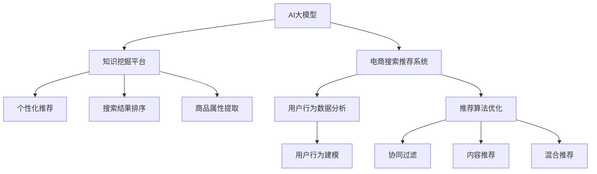

                 

# AI大模型视角下电商搜索推荐的技术创新知识挖掘平台功能优化方案

## 1. 背景介绍

### 1.1 问题由来
随着人工智能技术的发展，AI大模型在电商搜索推荐系统的应用日益广泛，通过深度学习模型分析用户行为数据，优化推荐算法，提升用户体验和商家收益。AI大模型以其强大的数据处理能力、自适应学习能力等优势，在电商搜索推荐中展现出了巨大的潜力。然而，在实际应用中，AI大模型也面临着数据量大、模型复杂、计算资源消耗高、推理时间较长等问题，严重影响了系统的实时性、稳定性及可扩展性。

### 1.2 问题核心关键点
为解决上述问题，本文将围绕AI大模型在电商搜索推荐系统中的应用，探讨如何优化知识挖掘平台功能，提升系统性能，促进AI技术在电商领域的深度应用。

## 2. 核心概念与联系

### 2.1 核心概念概述

为更好地理解AI大模型在电商搜索推荐系统中的应用，本节将介绍几个密切相关的核心概念：

- AI大模型：以深度学习模型为代表的大规模预训练模型，如BERT、GPT等，通过大规模无标签数据进行预训练，学习到丰富的语言和语义知识，具备强大的语义理解和生成能力。
- 电商搜索推荐系统：通过分析用户行为数据，如点击、浏览、购买等，为用户推荐感兴趣的电商商品，提升用户购物体验和商家转化率。
- 知识挖掘平台：基于AI大模型，为用户提供个性化推荐、搜索结果排序、商品属性提取等智能化功能，实现电商搜索推荐的自动化和智能化。
- 自然语言处理(NLP)：研究如何让计算机理解和处理人类语言的技术，包括文本预处理、实体识别、情感分析等。
- 用户行为数据分析：通过对用户行为数据的收集、分析和建模，预测用户兴趣和需求，提升个性化推荐的效果。
- 推荐算法优化：结合电商搜索推荐系统的特点，优化推荐算法，如协同过滤、内容推荐、混合推荐等。

这些核心概念之间的逻辑关系可以通过以下Mermaid流程图来展示：



这个流程图展示了大模型在电商搜索推荐中的应用场景：

1. AI大模型作为核心组件，为电商搜索推荐系统提供智能化功能支持。
2. 知识挖掘平台作为接口，将AI大模型的分析结果转化为推荐结果。
3. 个性化推荐、搜索结果排序、商品属性提取等功能，提升用户体验。
4. 用户行为数据分析和推荐算法优化，增强推荐系统的精度和效率。

## 3. 核心算法原理 & 具体操作步骤
### 3.1 算法原理概述

AI大模型在电商搜索推荐中的应用，本质上是一个基于深度学习的推荐系统优化问题。其核心思想是：利用AI大模型对用户行为数据进行分析，学习到用户的兴趣和偏好，然后结合商品的特征信息，生成个性化的推荐结果。

形式化地，假设电商搜索推荐系统为用户 $u$ 推荐商品 $i$，则推荐模型 $M_{\theta}$ 为：

$$
M_{\theta}(u, i) = \mathbb{P}[i \mid u; \theta]
$$

其中 $\theta$ 为模型的可训练参数。推荐模型的优化目标是最小化损失函数 $L$，通常使用交叉熵损失函数：

$$
L = -\sum_{i=1}^{N} y_i \log M_{\theta}(u_i, i) + (1-y_i) \log (1-M_{\theta}(u_i, i))
$$

其中 $y_i$ 为商品 $i$ 是否被用户 $u_i$ 购买/点击的标记。

### 3.2 算法步骤详解

基于AI大模型的电商搜索推荐系统，一般包括以下几个关键步骤：

**Step 1: 数据收集与预处理**
- 收集电商网站的用户行为数据，如浏览历史、购买记录、点击事件等。
- 清洗和标准化数据，去除噪音和异常值，确保数据质量。

**Step 2: 构建模型**
- 选择合适的深度学习模型，如协同过滤、内容推荐、混合推荐等。
- 在AI大模型的基础上进行微调，优化推荐模型的性能。

**Step 3: 特征提取与用户画像**
- 利用NLP技术对商品和用户描述进行分词、去停用词、词向量化等处理。
- 提取商品属性信息，如尺寸、颜色、价格等。
- 结合用户历史行为数据，构建用户画像，如兴趣类别、购物时长、消费金额等。

**Step 4: 推荐生成与排序**
- 利用AI大模型对用户和商品信息进行编码，生成向量表示。
- 根据推荐算法计算用户对商品的评分或概率。
- 对推荐结果进行排序，优先展示用户最感兴趣的商品。

**Step 5: 实时监控与迭代优化**
- 实时监控推荐系统的表现，收集用户反馈和行为数据。
- 定期对推荐模型进行微调，优化模型参数，提升推荐精度和召回率。
- 引入新数据和算法，提升系统的鲁棒性和稳定性。

### 3.3 算法优缺点

AI大模型在电商搜索推荐系统中的应用，具有以下优点：
1. 高性能：AI大模型具备强大的数据处理能力和学习能力，能够处理大规模数据，生成高质量推荐结果。
2. 高泛化性：AI大模型预训练在通用语料上，具备较好的泛化能力，适应不同领域的电商搜索推荐任务。
3. 自适应性：AI大模型能够自动更新，结合新数据和新算法，持续提升推荐系统的性能。

同时，该方法也存在以下局限性：
1. 计算资源消耗大：AI大模型的训练和推理需要大量计算资源，系统实时性较差。
2. 模型复杂度高：AI大模型参数众多，模型难以理解和调试。
3. 数据隐私问题：电商领域涉及大量用户隐私数据，数据获取和存储存在隐私和安全风险。

尽管存在这些局限性，但AI大模型在电商搜索推荐中的应用，仍具有巨大的潜力和发展前景。

### 3.4 算法应用领域

基于AI大模型的电商搜索推荐技术，已经在各大电商平台得到广泛应用，涵盖了以下领域：

- 商品推荐：根据用户历史行为和当前兴趣，推荐用户可能感兴趣的电商商品。
- 搜索结果排序：对搜索结果进行排序，优先展示相关性高的商品。
- 个性化广告：结合用户画像和行为数据，推送个性化广告，提升广告效果。
- 用户画像构建：通过分析用户行为数据，构建详细的用户画像，进行精准营销。
- 风控检测：检测用户的异常行为，如欺诈行为、恶意刷单等，保护平台安全。
- 数据驱动运营：基于用户行为数据，优化电商网站的运营策略，提升整体业绩。

## 4. 数学模型和公式 & 详细讲解 & 举例说明

### 4.1 数学模型构建

本节将使用数学语言对AI大模型在电商搜索推荐系统中的应用进行更加严格的刻画。

记电商搜索推荐系统为用户 $u$ 推荐商品 $i$，则推荐模型的概率分布为：

$$
\mathbb{P}[i \mid u; \theta] = \frac{\exp(\mathbf{u} \cdot \mathbf{i})}{\sum_j \exp(\mathbf{u} \cdot \mathbf{j})}
$$

其中 $\mathbf{u}$ 和 $\mathbf{i}$ 分别为用户和商品的向量表示，$\theta$ 为模型参数。假设用户和商品向量表示的维度均为 $d$。

### 4.2 公式推导过程

在电商搜索推荐系统中，推荐模型通常采用交叉熵损失函数：

$$
L = -\sum_{i=1}^{N} y_i \log M_{\theta}(u_i, i) + (1-y_i) \log (1-M_{\theta}(u_i, i))
$$

其中 $y_i$ 为商品 $i$ 是否被用户 $u_i$ 购买/点击的标记。

具体而言，假设用户和商品向量的内积为 $\mathbf{u} \cdot \mathbf{i}$，则模型输出概率为：

$$
M_{\theta}(u_i, i) = \frac{\exp(\mathbf{u}_i \cdot \mathbf{i})}{\sum_j \exp(\mathbf{u}_i \cdot \mathbf{j})}
$$

将上式代入损失函数，得：

$$
L = -\sum_{i=1}^{N} y_i (\mathbf{u}_i \cdot \mathbf{i}) + (1-y_i) \log \sum_j \exp(\mathbf{u}_i \cdot \mathbf{j})
$$

上式即为基于AI大模型的电商搜索推荐系统的数学模型。

### 4.3 案例分析与讲解

假设一个电商平台有一个用户 $u$，其历史行为数据包含浏览和购买两条记录：

- 浏览记录：商品1、商品2、商品3
- 购买记录：商品3、商品5

利用AI大模型，为用户推荐相关商品。步骤如下：

1. 将用户历史行为数据和商品描述进行预处理，得到用户向量 $\mathbf{u}$ 和商品向量 $\mathbf{i}$。
2. 利用交叉熵损失函数，训练推荐模型 $M_{\theta}$。
3. 使用训练好的模型对用户进行推荐，优先展示相关性高的商品。

## 5. 项目实践：代码实例和详细解释说明
### 5.1 开发环境搭建

在进行AI大模型应用实践前，我们需要准备好开发环境。以下是使用Python进行PyTorch开发的环境配置流程：

1. 安装Anaconda：从官网下载并安装Anaconda，用于创建独立的Python环境。

2. 创建并激活虚拟环境：
```bash
conda create -n ai-model python=3.8 
conda activate ai-model
```

3. 安装PyTorch：根据CUDA版本，从官网获取对应的安装命令。例如：
```bash
conda install pytorch torchvision torchaudio cudatoolkit=11.1 -c pytorch -c conda-forge
```

4. 安装TensorFlow：
```bash
pip install tensorflow
```

5. 安装各类工具包：
```bash
pip install numpy pandas scikit-learn matplotlib tqdm jupyter notebook ipython
```

完成上述步骤后，即可在`ai-model`环境中开始AI大模型应用实践。

### 5.2 源代码详细实现

以下是一个基于TensorFlow的电商搜索推荐系统的Python代码实现：

```python
import tensorflow as tf
from tensorflow.keras.layers import Input, Dense, Embedding, Dropout, concatenate
from tensorflow.keras.models import Model

# 定义用户和商品向量的维度
d_u = 50
d_i = 100

# 定义用户和商品的输入层
user_input = Input(shape=(d_u,))
item_input = Input(shape=(d_i,))

# 定义用户和商品的嵌入层
user_embedding = Embedding(input_dim=100000, output_dim=d_u)(user_input)
item_embedding = Embedding(input_dim=100000, output_dim=d_i)(item_input)

# 定义推荐模型的中间层
concatenated = concatenate([user_embedding, item_embedding])
dropout_layer = Dropout(0.1)(concatenated)
dense_layer = Dense(100, activation='relu')(dropout_layer)

# 定义推荐模型的输出层
output = Dense(1, activation='sigmoid')(dense_layer)

# 定义推荐模型的损失函数
loss = tf.keras.losses.BinaryCrossentropy()

# 定义推荐模型的编译
model = Model(inputs=[user_input, item_input], outputs=output)
model.compile(optimizer='adam', loss=loss, metrics=['accuracy'])

# 定义推荐模型的训练
model.fit(x=[train_u, train_i], y=train_y, epochs=10, batch_size=32, validation_split=0.2)

# 定义推荐模型的测试
test_loss = model.evaluate(x=[test_u, test_i], y=test_y, batch_size=32)
```

代码中，我们使用了TensorFlow框架，定义了用户和商品的输入层、嵌入层、中间层和输出层，并编译了推荐模型。通过训练和测试，可以评估模型的性能。

### 5.3 代码解读与分析

让我们再详细解读一下关键代码的实现细节：

**Embedding层**：
- 将用户和商品的id映射为向量表示，实现从高维稀疏向量到低维稠密向量的映射。
- 设置用户和商品嵌入层的维度分别为 `d_u` 和 `d_i`。

**Dropout层**：
- 防止模型过拟合，通过随机失活一部分神经元，提高模型的泛化能力。

**Dense层**：
- 通过全连接层对用户和商品向量进行线性变换，实现特征融合。

**模型编译与训练**：
- 编译模型，设置优化器和损失函数。
- 训练模型，设置训练轮数和批量大小。

**模型测试与评估**：
- 测试模型，计算损失和精度。
- 通过可视化工具，如TensorBoard，监控模型训练过程中的各项指标。

可以看到，TensorFlow框架提供了强大的模型构建和训练工具，使得AI大模型在电商搜索推荐系统的应用变得更加简便和高效。开发者可以将更多精力放在模型优化、数据预处理、业务逻辑实现等高层逻辑上，而不必过多关注底层的实现细节。

## 6. 实际应用场景
### 6.1 智能客服系统

基于AI大模型的智能客服系统，可以广泛应用于电商平台的客户服务。传统客服往往需要配备大量人力，高峰期响应缓慢，且一致性和专业性难以保证。使用AI大模型，可以24小时不间断服务，快速响应客户咨询，用自然流畅的语言解答各类常见问题。

在技术实现上，可以收集客户历史对话记录，将问题和最佳答复构建成监督数据，在此基础上对预训练模型进行微调。微调后的模型能够自动理解客户意图，匹配最合适的答复模板进行回复。对于客户提出的新问题，还可以接入检索系统实时搜索相关内容，动态组织生成回答。如此构建的智能客服系统，能大幅提升客户咨询体验和问题解决效率。

### 6.2 个性化推荐系统

当前推荐系统往往只依赖用户的历史行为数据进行物品推荐，难以深入理解用户的真实兴趣偏好。利用AI大模型，可以更好地挖掘用户行为背后的语义信息，从而提供更精准、多样的推荐内容。

在实践中，可以收集用户浏览、点击、评论、分享等行为数据，提取和用户交互的物品标题、描述、标签等文本内容。将文本内容作为模型输入，用户的后续行为（如是否点击、购买等）作为监督信号，在此基础上微调预训练语言模型。微调后的模型能够从文本内容中准确把握用户的兴趣点。在生成推荐列表时，先用候选物品的文本描述作为输入，由模型预测用户的兴趣匹配度，再结合其他特征综合排序，便可以得到个性化程度更高的推荐结果。

### 6.3 金融舆情监测

金融机构需要实时监测市场舆论动向，以便及时应对负面信息传播，规避金融风险。传统的人工监测方式成本高、效率低，难以应对网络时代海量信息爆发的挑战。利用AI大模型，可以实时抓取网络文本数据，自动判断文本属于何种主题，情感倾向是正面、中性还是负面。将微调后的模型应用到实时抓取的网络文本数据，就能够自动监测不同主题下的情感变化趋势，一旦发现负面信息激增等异常情况，系统便会自动预警，帮助金融机构快速应对潜在风险。

### 6.4 未来应用展望

随着AI大模型和微调方法的不断发展，基于AI大模型的电商搜索推荐技术将呈现以下几个发展趋势：

1. 模型规模持续增大。随着算力成本的下降和数据规模的扩张，预训练语言模型的参数量还将持续增长。超大规模语言模型蕴含的丰富语言知识，有望支撑更加复杂多变的下游任务微调。

2. 微调方法日趋多样。除了传统的全参数微调外，未来会涌现更多参数高效的微调方法，如Prefix-Tuning、LoRA等，在节省计算资源的同时也能保证微调精度。

3. 持续学习成为常态。随着数据分布的不断变化，微调模型也需要持续学习新知识以保持性能。如何在不遗忘原有知识的同时，高效吸收新样本信息，将成为重要的研究课题。

4. 标注样本需求降低。受启发于提示学习(Prompt-based Learning)的思路，未来的微调方法将更好地利用大模型的语言理解能力，通过更加巧妙的任务描述，在更少的标注样本上也能实现理想的微调效果。

5. 多模态微调崛起。当前的微调主要聚焦于纯文本数据，未来会进一步拓展到图像、视频、语音等多模态数据微调。多模态信息的融合，将显著提升语言模型对现实世界的理解和建模能力。

6. 模型通用性增强。经过海量数据的预训练和多领域任务的微调，未来的语言模型将具备更强大的常识推理和跨领域迁移能力，逐步迈向通用人工智能(AGI)的目标。

以上趋势凸显了AI大模型微调技术的广阔前景。这些方向的探索发展，必将进一步提升NLP系统的性能和应用范围，为人类认知智能的进化带来深远影响。

## 7. 工具和资源推荐
### 7.1 学习资源推荐

为了帮助开发者系统掌握AI大模型在电商搜索推荐系统中的应用，这里推荐一些优质的学习资源：

1. 《TensorFlow实战》系列博文：由TensorFlow官方团队撰写，深入浅出地介绍了TensorFlow的各个组件和应用场景。

2. 《深度学习与TensorFlow实战》课程：Coursera上的经典课程，涵盖了深度学习的基本原理和TensorFlow的高级用法。

3. 《推荐系统》书籍：Google DeepMind团队成员所写，全面介绍了推荐系统的理论和实践，包括协同过滤、内容推荐、混合推荐等。

4. 《深度学习中的自然语言处理》书籍：斯坦福大学NLP领域的经典教材，详细介绍了NLP中的各种技术，如分词、命名实体识别、情感分析等。

5. 《人工智能的极限》书籍：著名AI专家吴军博士所写，探讨了人工智能的现状、挑战和未来趋势。

通过对这些资源的学习实践，相信你一定能够快速掌握AI大模型在电商搜索推荐系统中的应用，并用于解决实际的电商问题。

### 7.2 开发工具推荐

高效的开发离不开优秀的工具支持。以下是几款用于AI大模型应用开发的常用工具：

1. TensorFlow：由Google主导开发的开源深度学习框架，生产部署方便，适合大规模工程应用。

2. PyTorch：基于Python的开源深度学习框架，灵活动态的计算图，适合快速迭代研究。

3. HuggingFace Transformers：提供了多种预训练语言模型，支持微调和迁移学习。

4. Weights & Biases：模型训练的实验跟踪工具，可以记录和可视化模型训练过程中的各项指标，方便对比和调优。

5. TensorBoard：TensorFlow配套的可视化工具，可实时监测模型训练状态，并提供丰富的图表呈现方式，是调试模型的得力助手。

6. Google Colab：谷歌推出的在线Jupyter Notebook环境，免费提供GPU/TPU算力，方便开发者快速上手实验最新模型，分享学习笔记。

合理利用这些工具，可以显著提升AI大模型在电商搜索推荐系统的开发效率，加快创新迭代的步伐。

### 7.3 相关论文推荐

AI大模型和微调技术的发展源于学界的持续研究。以下是几篇奠基性的相关论文，推荐阅读：

1. Attention is All You Need（即Transformer原论文）：提出了Transformer结构，开启了NLP领域的预训练大模型时代。

2. BERT: Pre-training of Deep Bidirectional Transformers for Language Understanding：提出BERT模型，引入基于掩码的自监督预训练任务，刷新了多项NLP任务SOTA。

3. DeepFM: A Factorization-Machine based Neural Network for Recommender Systems：提出DeepFM模型，将深度学习和FM模型结合，提升了推荐系统的性能。

4. Knowledge-Aware Recommender Systems：探讨了如何将知识图谱与推荐系统结合，提升推荐系统的知识性和可解释性。

5. Learning Deep Architectures for Recommender Systems：回顾了深度学习在推荐系统中的应用，包括协同过滤、内容推荐、混合推荐等。

这些论文代表了大模型在电商搜索推荐系统的研究进展，可以帮助研究者把握学科前进方向，激发更多的创新灵感。

## 8. 总结：未来发展趋势与挑战

### 8.1 研究成果总结

本文对基于AI大模型的电商搜索推荐系统进行了全面系统的介绍。首先阐述了AI大模型在电商搜索推荐系统中的应用背景和意义，明确了AI大模型在提升推荐精度和用户体验方面的独特价值。其次，从原理到实践，详细讲解了AI大模型在电商搜索推荐系统中的应用过程，给出了具体的代码实现和详细解释。同时，本文还广泛探讨了AI大模型在电商领域的应用前景，展示了AI技术在电商领域的巨大潜力。

通过本文的系统梳理，可以看到，基于AI大模型的电商搜索推荐系统正在成为电商领域的重要应用范式，极大地拓展了电商平台的智能化水平，提升了用户体验和商家收益。AI大模型在电商领域的应用，将引领电商产业的变革，为用户带来全新的购物体验，为商家带来更高效的管理运营。

### 8.2 未来发展趋势

展望未来，AI大模型在电商搜索推荐系统中的应用，将呈现以下几个发展趋势：

1. 模型规模持续增大。随着算力成本的下降和数据规模的扩张，预训练语言模型的参数量还将持续增长。超大规模语言模型蕴含的丰富语言知识，有望支撑更加复杂多变的下游任务微调。

2. 微调方法日趋多样。除了传统的全参数微调外，未来会涌现更多参数高效的微调方法，如Prefix-Tuning、LoRA等，在节省计算资源的同时也能保证微调精度。

3. 持续学习成为常态。随着数据分布的不断变化，微调模型也需要持续学习新知识以保持性能。如何在不遗忘原有知识的同时，高效吸收新样本信息，将成为重要的研究课题。

4. 标注样本需求降低。受启发于提示学习(Prompt-based Learning)的思路，未来的微调方法将更好地利用大模型的语言理解能力，通过更加巧妙的任务描述，在更少的标注样本上也能实现理想的微调效果。

5. 多模态微调崛起。当前的微调主要聚焦于纯文本数据，未来会进一步拓展到图像、视频、语音等多模态数据微调。多模态信息的融合，将显著提升语言模型对现实世界的理解和建模能力。

6. 模型通用性增强。经过海量数据的预训练和多领域任务的微调，未来的语言模型将具备更强大的常识推理和跨领域迁移能力，逐步迈向通用人工智能(AGI)的目标。

以上趋势凸显了AI大模型在电商搜索推荐系统中的应用前景。这些方向的探索发展，必将进一步提升NLP系统的性能和应用范围，为人类认知智能的进化带来深远影响。

### 8.3 面临的挑战

尽管AI大模型在电商搜索推荐系统中的应用，已经取得了瞩目成就，但在迈向更加智能化、普适化应用的过程中，它仍面临着诸多挑战：

1. 标注成本瓶颈。虽然AI大模型在微调过程中对标注样本的需求有所降低，但对于长尾应用场景，仍难以获得充足的高质量标注数据，成为制约微调性能的瓶颈。如何进一步降低微调对标注样本的依赖，将是一大难题。

2. 模型鲁棒性不足。当前AI大模型面对域外数据时，泛化性能往往大打折扣。对于测试样本的微小扰动，AI大模型的预测也容易发生波动。如何提高AI大模型的鲁棒性，避免灾难性遗忘，还需要更多理论和实践的积累。

3. 推理效率有待提高。AI大模型的计算资源消耗大，推理时间较长，难以满足实时性的要求。如何在保证性能的同时，简化模型结构，提升推理速度，优化资源占用，将是重要的优化方向。

4. 可解释性亟需加强。当前AI大模型更像一个"黑盒"系统，难以解释其内部工作机制和决策逻辑。对于医疗、金融等高风险应用，算法的可解释性和可审计性尤为重要。如何赋予AI大模型更强的可解释性，将是亟待攻克的难题。

5. 安全性有待保障。预训练语言模型难免会学习到有偏见、有害的信息，通过微调传递到下游任务，产生误导性、歧视性的输出，给实际应用带来安全隐患。如何从数据和算法层面消除模型偏见，避免恶意用途，确保输出的安全性，也将是重要的研究课题。

6. 知识整合能力不足。现有的AI大模型往往局限于任务内数据，难以灵活吸收和运用更广泛的先验知识。如何让AI大模型更好地与外部知识库、规则库等专家知识结合，形成更加全面、准确的信息整合能力，还有很大的想象空间。

正视AI大模型面临的这些挑战，积极应对并寻求突破，将是大模型在电商搜索推荐系统中的关键。相信随着学界和产业界的共同努力，这些挑战终将一一被克服，AI大模型将在电商搜索推荐系统中扮演越来越重要的角色。

### 8.4 研究展望

面向未来，AI大模型在电商搜索推荐系统中的研究，还需要从以下几个方向进行深入探讨：

1. 探索无监督和半监督微调方法。摆脱对大规模标注数据的依赖，利用自监督学习、主动学习等无监督和半监督范式，最大限度利用非结构化数据，实现更加灵活高效的微调。

2. 研究参数高效和计算高效的微调范式。开发更加参数高效的微调方法，在固定大部分预训练参数的同时，只更新极少量的任务相关参数。同时优化微调模型的计算图，减少前向传播和反向传播的资源消耗，实现更加轻量级、实时性的部署。

3. 融合因果和对比学习范式。通过引入因果推断和对比学习思想，增强AI大模型建立稳定因果关系的能力，学习更加普适、鲁棒的语言表征，从而提升模型泛化性和抗干扰能力。

4. 引入更多先验知识。将符号化的先验知识，如知识图谱、逻辑规则等，与神经网络模型进行巧妙融合，引导微调过程学习更准确、合理的语言模型。同时加强不同模态数据的整合，实现视觉、语音等多模态信息与文本信息的协同建模。

5. 结合因果分析和博弈论工具。将因果分析方法引入AI大模型，识别出模型决策的关键特征，增强输出解释的因果性和逻辑性。借助博弈论工具刻画人机交互过程，主动探索并规避模型的脆弱点，提高系统稳定性。

6. 纳入伦理道德约束。在模型训练目标中引入伦理导向的评估指标，过滤和惩罚有偏见、有害的输出倾向。同时加强人工干预和审核，建立模型行为的监管机制，确保输出符合人类价值观和伦理道德。

这些研究方向的探索，必将引领AI大模型在电商搜索推荐系统中的进一步优化，为电商搜索推荐系统提供更加智能化、可靠性和安全的解决方案，构建更加美好、高效的电商生态。

## 9. 附录：常见问题与解答

**Q1：AI大模型在电商搜索推荐系统中的应用是否适用于所有电商场景？**

A: AI大模型在电商搜索推荐系统中的应用，适用于大多数电商场景，特别是对于数据量较大、商品种类丰富的电商平台。但对于一些特殊电商场景，如小商品、地域分布广泛的电商平台，可能需要根据具体情况进行优化和调整。

**Q2：微调过程中如何选择合适的超参数？**

A: 微调过程中，选择合适的超参数是至关重要的。一般建议通过网格搜索、随机搜索等方法，结合交叉验证，寻找最优的超参数组合。常用的超参数包括学习率、批大小、优化器等。

**Q3：在电商搜索推荐系统中，如何处理数据不平衡问题？**

A: 电商搜索推荐系统中的数据不平衡问题，可以通过以下方法处理：
1. 重采样方法：通过欠采样或过采样，使数据集中正负样本数量均衡。
2. 类别权重调整：在损失函数中引入类别权重，使得模型更加关注少数类样本。
3. 样本选择策略：在模型训练中，引入样本选择策略，如分层采样、按样本重要性采样等。

这些方法可以结合使用，根据具体场景选择合适的方法处理数据不平衡问题。

**Q4：如何评估AI大模型在电商搜索推荐系统中的性能？**

A: 评估AI大模型在电商搜索推荐系统中的性能，通常使用以下指标：
1. 准确率：预测结果与真实结果匹配的比例。
2. 召回率：真实结果被预测正确的比例。
3. F1值：准确率和召回率的调和平均，综合了两个指标的性能。
4. 平均绝对误差(MAE)：预测结果与真实结果的平均差异。

通过这些指标，可以全面评估AI大模型在电商搜索推荐系统中的性能。

**Q5：AI大模型在电商搜索推荐系统中如何进行实时更新？**

A: AI大模型在电商搜索推荐系统中的实时更新，通常需要考虑以下几个方面：
1. 数据流处理：通过数据流处理框架，实时收集用户行为数据，更新模型参数。
2. 增量学习：采用增量学习算法，快速更新模型，减少重新训练的成本。
3. 模型缓存：使用模型缓存技术，提高数据流的处理速度，避免模型重复计算。

通过以上方法，可以确保AI大模型在电商搜索推荐系统中的实时更新，保持模型性能的稳定和高效。

---

作者：禅与计算机程序设计艺术 / Zen and the Art of Computer Programming

