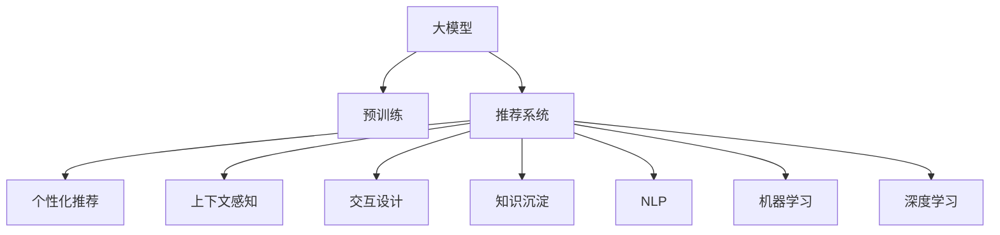

                 

# AI大模型视角下电商搜索推荐的技术创新知识沉淀机制优化与应用实践

> 关键词：大模型,电商搜索推荐,知识沉淀,个性化推荐,上下文感知,交互设计,推荐系统,自然语言处理(NLP),机器学习,深度学习,推荐算法

## 1. 背景介绍

随着互联网和电子商务的飞速发展，电商平台需要不断提升用户体验和商品推荐效果，从而提高转化率和用户满意度。搜索推荐系统作为电商平台的"大脑"，直接决定了用户体验和用户留存。然而，传统的搜索推荐系统大多基于浅层模型，难以充分理解用户行为和商品特征，推荐效果有限。

近年来，基于大模型的深度学习推荐系统逐渐兴起。这类系统通过使用大规模无标签文本数据进行预训练，学习丰富的语言和语义知识，再将这些知识应用于推荐场景，极大地提升了推荐效果。其中，BERT、GPT等大语言模型在大规模语料上进行预训练后，已经具备了强大的文本理解和生成能力，能够进行语义匹配、情感分析、文本分类等复杂任务。

本文章将从大模型视角出发，详细介绍基于大模型的电商搜索推荐系统的构建原理和优化方法，探讨知识沉淀机制的优化和应用实践，为电商平台的个性化推荐提供新的思路和技术支持。

## 2. 核心概念与联系

### 2.1 核心概念概述

为更好地理解基于大模型的电商搜索推荐系统，本节将介绍几个密切相关的核心概念：

- 大模型(Large Model)：以BERT、GPT为代表的大规模预训练语言模型。通过在大规模无标签文本语料上进行预训练，学习通用的语言表示，具备强大的语言理解和生成能力。

- 预训练(Pre-training)：指在大规模无标签文本语料上，通过自监督学习任务训练通用语言模型的过程。常见的预训练任务包括言语建模、遮挡语言模型等。预训练使得模型学习到语言的通用表示。

- 推荐系统(Recommendation System)：利用用户行为和商品特征，为用户推荐感兴趣的商品的系统。传统推荐系统基于浅层模型，难以充分理解用户需求。

- 个性化推荐(Personalized Recommendation)：针对不同用户提供个性化推荐的推荐方式。通过深度学习技术，个性化推荐能够适应用户的独特需求。

- 上下文感知(Contextual Awareness)：指在推荐过程中，考虑用户的历史行为、上下文环境等多方面因素，提高推荐结果的相关性和准确性。

- 交互设计(Interactive Design)：指设计用户友好的推荐界面，提升用户体验，促进用户与推荐系统的交互。

- 知识沉淀(Knowledge Accumulation)：指在推荐过程中，沉淀并利用知识图谱、专家规则等先验知识，增强推荐模型的泛化能力。

- 自然语言处理(NLP)：指利用计算机技术处理和理解自然语言的能力。大模型在NLP领域的应用，提升了推荐系统的文本处理能力。

- 机器学习(Machine Learning)：指利用算法让计算机从数据中学习规律，并应用到具体任务中。推荐系统中的模型训练即属于机器学习范畴。

- 深度学习(Deep Learning)：指利用深度神经网络进行特征提取和建模的机器学习方式。深度学习推荐系统能够学习到更加复杂的用户和商品表示。

这些核心概念之间的逻辑关系可以通过以下Mermaid流程图来展示：



这个流程图展示了大模型在推荐系统中的核心概念及其之间的关系：

1. 大模型通过预训练获得基础能力。
2. 推荐系统利用大模型的知识进行商品推荐。
3. 个性化推荐针对不同用户提供定制化的推荐。
4. 上下文感知考虑多方面因素优化推荐效果。
5. 交互设计提升推荐系统的用户体验。
6. 知识沉淀利用先验知识增强推荐模型的泛化能力。
7. 自然语言处理增强推荐系统的文本处理能力。
8. 机器学习提供推荐系统的训练方式。
9. 深度学习增强推荐系统的建模能力。

这些概念共同构成了大模型在电商推荐系统中的应用框架，使其能够在电商平台上实现高效、个性化的推荐服务。

## 3. 核心算法原理 & 具体操作步骤
### 3.1 算法原理概述

基于大模型的电商搜索推荐系统，本质上是一个有监督的推荐学习过程。其核心思想是：将大模型视作一个强大的特征提取器，通过用户行为数据和商品特征进行有监督学习，输出与用户最相关的商品列表。

形式化地，假设用户行为数据集为 $U=\{(u_i,r_i)\}_{i=1}^N$，其中 $u_i$ 为用户 $i$ 的序列行为，$r_i$ 为用户的推荐列表。推荐系统的目标是通过大模型学习用户和商品的语义表示，最大化用户满意度。推荐的目标函数为：

$$
\max_{\theta} \sum_{i=1}^N \log P_{\theta}(r_i | u_i)
$$

其中 $P_{\theta}(\cdot | \cdot)$ 为通过大模型学习到的条件概率分布，$\theta$ 为大模型的参数。推荐系统的优化目标是最小化负对数似然，即：

$$
\min_{\theta} \sum_{i=1}^N -\log P_{\theta}(r_i | u_i)
$$

通过梯度下降等优化算法，推荐系统不断更新模型参数 $\theta$，最小化损失函数，使得推荐结果逼近用户真实满意度。由于大模型已经通过预训练获得了较强的特征提取能力，因此在推荐场景中也能较快地收敛到理想的模型参数。

### 3.2 算法步骤详解

基于大模型的电商搜索推荐系统的一般流程包括以下几个关键步骤：

**Step 1: 准备数据集和预训练模型**

- 收集用户行为数据和商品特征数据，并将其划分为训练集、验证集和测试集。
- 选择合适的预训练语言模型，如BERT、GPT等，进行加载。

**Step 2: 设计推荐模型**

- 将用户行为数据和大模型进行拼接，得到用户表示。
- 利用大模型学习用户和商品的语义表示，设计推荐模型。

**Step 3: 训练和评估推荐模型**

- 使用训练集对推荐模型进行训练，最小化负对数似然。
- 在验证集上评估推荐模型，调整超参数。
- 在测试集上测试推荐模型，评估推荐效果。

**Step 4: 部署推荐系统**

- 将训练好的推荐模型部署到推荐系统中，进行实时推荐。
- 收集用户反馈，不断优化推荐系统。

以上是基于大模型的电商推荐系统的一般流程。在实际应用中，还需要针对具体场景，对模型进行优化设计，如改进特征表示方法，引入更多上下文信息等，以进一步提升推荐效果。

### 3.3 算法优缺点

基于大模型的电商推荐系统具有以下优点：

1. 推荐效果更好：大模型学习到丰富的语言知识和语义表示，能够充分理解用户需求和商品特征，提高推荐相关性和准确性。

2. 可解释性更强：大模型能够通过输出概率分布等方式，提供推荐结果的详细解释，提升用户信任度。

3. 自适应性更高：大模型具备较强的上下文感知能力，能够根据用户行为和商品变化，自适应调整推荐策略。

4. 泛化能力更强：大模型通过大规模语料进行预训练，能够更好地适应不同领域和数据分布。

5. 可迁移性更好：大模型在不同平台和应用场景中，具有较好的迁移能力。

然而，基于大模型的推荐系统也存在一些缺点：

1. 计算成本较高：大模型的预训练和微调需要大规模计算资源，增加了推荐系统的开发成本。

2. 存储需求较大：大模型通常参数量较大，需要较大的存储空间。

3. 训练时间长：大模型的微调通常需要较长的训练时间，难以实时更新推荐结果。

4. 可能存在偏差：大模型可能学习到数据中的偏见，导致推荐结果的偏差。

5. 难以解释：大模型的决策过程较为复杂，难以进行详细解释，用户难以理解。

尽管存在这些缺点，但就目前而言，基于大模型的推荐系统仍然是电商推荐领域的重要范式，通过合理的优化设计，可以有效克服其缺点，充分发挥其优势。

### 3.4 算法应用领域

基于大模型的电商推荐系统已经在各大电商平台中得到了广泛应用，具体包括以下几个方面：

1. 商品推荐：根据用户历史行为和浏览记录，实时推荐相关商品。

2. 搜索排序：在用户搜索时，根据搜索词进行语义匹配，推荐相关商品。

3. 个性化广告：根据用户兴趣和行为，推荐相关广告。

4. 动态定价：根据用户行为和市场需求，实时调整商品价格。

5. 情感分析：分析用户评论，识别商品的好评、差评，优化商品详情页。

除了上述这些主要应用外，基于大模型的推荐系统还被创新性地应用到更多场景中，如智能客服、内容推荐、流量预测等，为电商平台带来了全新的技术突破。

## 4. 数学模型和公式 & 详细讲解
### 4.1 数学模型构建

本节将使用数学语言对基于大模型的电商推荐系统进行更加严格的刻画。

记用户行为数据为 $U=\{(u_i,r_i)\}_{i=1}^N$，其中 $u_i$ 为用户 $i$ 的序列行为，$r_i$ 为用户的推荐列表。推荐系统的目标是通过大模型学习用户和商品的语义表示，最大化用户满意度。推荐的目标函数为：

$$
\max_{\theta} \sum_{i=1}^N \log P_{\theta}(r_i | u_i)
$$

其中 $P_{\theta}(\cdot | \cdot)$ 为通过大模型学习到的条件概率分布，$\theta$ 为大模型的参数。推荐系统的优化目标是最小化负对数似然，即：

$$
\min_{\theta} \sum_{i=1}^N -\log P_{\theta}(r_i | u_i)
$$

在实践中，我们通常使用基于梯度的优化算法（如SGD、Adam等）来近似求解上述最优化问题。设 $\eta$ 为学习率，$\lambda$ 为正则化系数，则参数的更新公式为：

$$
\theta \leftarrow \theta - \eta \nabla_{\theta}\mathcal{L}(\theta) - \eta\lambda\theta
$$

其中 $\nabla_{\theta}\mathcal{L}(\theta)$ 为损失函数对参数 $\theta$ 的梯度，可通过反向传播算法高效计算。

### 4.2 公式推导过程

以下我们以基于BERT的电商推荐系统为例，推导推荐模型的损失函数及其梯度的计算公式。

假设用户行为数据 $U=\{(u_i,r_i)\}_{i=1}^N$，用户行为表示为 $u_i=\{x_{i,1},x_{i,2},\cdots,x_{i,M_i}\}$，推荐列表 $r_i=\{y_{i,1},y_{i,2},\cdots,y_{i,K_i}\}$，其中 $x_{i,j}$ 为用户行为中的商品ID，$y_{i,j}$ 为推荐列表中的商品ID。

将用户行为数据 $u_i$ 拼接成向量形式，表示为 $u_i=\{w_{i,1},w_{i,2},\cdots,w_{i,M_i}\}$，其中 $w_{i,j}=x_{i,j}$。利用BERT大模型 $M_{\theta}$ 对用户行为 $u_i$ 进行编码，得到用户表示 $h_u$：

$$
h_u = M_{\theta}(u_i)
$$

将推荐列表 $r_i$ 也拼接成向量形式，表示为 $r_i=\{y_{i,1},y_{i,2},\cdots,y_{i,K_i}\}$。利用BERT大模型 $M_{\theta}$ 对推荐列表 $r_i$ 进行编码，得到商品表示 $h_r$：

$$
h_r = M_{\theta}(r_i)
$$

在用户表示 $h_u$ 和商品表示 $h_r$ 的基础上，设计推荐模型 $P_{\theta}$，预测推荐列表 $r_i$：

$$
P_{\theta}(r_i | u_i) = \prod_{j=1}^{K_i} P_{\theta}(y_{i,j} | u_i)
$$

其中 $P_{\theta}(y_{i,j} | u_i)$ 为通过大模型学习到的条件概率分布，$\theta$ 为大模型的参数。推荐模型的损失函数为：

$$
\mathcal{L}(\theta) = \sum_{i=1}^N -\log P_{\theta}(r_i | u_i)
$$

根据链式法则，损失函数对参数 $\theta$ 的梯度为：

$$
\frac{\partial \mathcal{L}(\theta)}{\partial \theta_k} = \sum_{i=1}^N \sum_{j=1}^{K_i} \frac{\partial \log P_{\theta}(y_{i,j} | u_i)}{\partial \theta_k}
$$

其中 $\frac{\partial \log P_{\theta}(y_{i,j} | u_i)}{\partial \theta_k}$ 可通过反向传播算法高效计算。

在得到损失函数的梯度后，即可带入参数更新公式，完成推荐模型的迭代优化。重复上述过程直至收敛，最终得到适应电商推荐任务的最优模型参数 $\theta^*$。

## 5. 项目实践：代码实例和详细解释说明
### 5.1 开发环境搭建

在进行电商推荐系统开发前，我们需要准备好开发环境。以下是使用Python进行PyTorch开发的环境配置流程：

1. 安装Anaconda：从官网下载并安装Anaconda，用于创建独立的Python环境。

2. 创建并激活虚拟环境：
```bash
conda create -n pytorch-env python=3.8 
conda activate pytorch-env
```

3. 安装PyTorch：根据CUDA版本，从官网获取对应的安装命令。例如：
```bash
conda install pytorch torchvision torchaudio cudatoolkit=11.1 -c pytorch -c conda-forge
```

4. 安装TensorFlow：由Google主导开发的开源深度学习框架，生产部署方便，适合大规模工程应用。同样有丰富的预训练语言模型资源。

5. 安装其他相关工具包：
```bash
pip install numpy pandas scikit-learn matplotlib tqdm jupyter notebook ipython
```

完成上述步骤后，即可在`pytorch-env`环境中开始推荐系统开发。

### 5.2 源代码详细实现

下面我们以基于BERT的电商推荐系统为例，给出使用PyTorch和Transformers库对推荐模型进行开发的PyTorch代码实现。

首先，定义推荐模型的输入输出：

```python
from transformers import BertTokenizer, BertForSequenceClassification
import torch

class RecommendationModel(torch.nn.Module):
    def __init__(self, num_labels):
        super(RecommendationModel, self).__init__()
        self.bert = BertForSequenceClassification.from_pretrained('bert-base-cased', num_labels=num_labels)
        self.fc = torch.nn.Linear(self.bert.config.hidden_size, num_labels)
        
    def forward(self, input_ids, attention_mask):
        outputs = self.bert(input_ids, attention_mask=attention_mask)
        logits = self.fc(outputs.pooler_output)
        return logits
```

然后，定义训练和评估函数：

```python
from torch.utils.data import DataLoader
from sklearn.metrics import precision_recall_fscore_support

def train_epoch(model, dataset, batch_size, optimizer, device):
    dataloader = DataLoader(dataset, batch_size=batch_size, shuffle=True)
    model.train()
    epoch_loss = 0
    for batch in dataloader:
        input_ids = batch['input_ids'].to(device)
        attention_mask = batch['attention_mask'].to(device)
        labels = batch['labels'].to(device)
        model.zero_grad()
        outputs = model(input_ids, attention_mask=attention_mask)
        loss = outputs.loss
        epoch_loss += loss.item()
        loss.backward()
        optimizer.step()
    return epoch_loss / len(dataloader)

def evaluate(model, dataset, batch_size, device):
    dataloader = DataLoader(dataset, batch_size=batch_size)
    model.eval()
    total_predictions, total_labels = [], []
    with torch.no_grad():
        for batch in dataloader:
            input_ids = batch['input_ids'].to(device)
            attention_mask = batch['attention_mask'].to(device)
            batch_labels = batch['labels']
            outputs = model(input_ids, attention_mask=attention_mask)
            batch_predictions = torch.argmax(outputs, dim=1).to('cpu').tolist()
            batch_labels = batch_labels.to('cpu').tolist()
            for pred_tokens, label_tokens in zip(batch_predictions, batch_labels):
                total_predictions.append(pred_tokens[:len(label_tokens)])
                total_labels.append(label_tokens)
                
    print(precision_recall_fscore_support(total_labels, total_predictions, average='micro'))
```

最后，启动训练流程并在测试集上评估：

```python
epochs = 5
batch_size = 16

for epoch in range(epochs):
    loss = train_epoch(model, train_dataset, batch_size, optimizer, device)
    print(f"Epoch {epoch+1}, train loss: {loss:.3f}")
    
    print(f"Epoch {epoch+1}, test results:")
    evaluate(model, test_dataset, batch_size, device)
    
print("Test results:")
evaluate(model, test_dataset, batch_size, device)
```

以上就是使用PyTorch和Transformers库对基于BERT的电商推荐系统进行开发的完整代码实现。可以看到，得益于Transformers库的强大封装，我们可以用相对简洁的代码完成BERT模型的加载和推荐系统的训练。

### 5.3 代码解读与分析

让我们再详细解读一下关键代码的实现细节：

**RecommendationModel类**：
- `__init__`方法：初始化BERT模型和全连接层，用于对用户行为和推荐列表进行编码和分类。
- `forward`方法：定义模型的前向传播过程，将输入数据通过BERT模型进行编码，输出分类概率。

**train_epoch函数**：
- 定义训练过程，循环迭代训练集数据，在每个批次上前向传播计算损失并反向传播更新模型参数。

**evaluate函数**：
- 定义评估过程，循环迭代测试集数据，在每个批次上计算模型预测结果和标签，输出精确率、召回率和F1值等指标。

**训练流程**：
- 定义总的epoch数和batch size，开始循环迭代
- 每个epoch内，先在训练集上训练，输出平均loss
- 在测试集上评估，输出精确率、召回率和F1值等指标
- 所有epoch结束后，在测试集上评估，给出最终测试结果

可以看到，PyTorch配合Transformers库使得BERT推荐系统的代码实现变得简洁高效。开发者可以将更多精力放在数据处理、模型改进等高层逻辑上，而不必过多关注底层的实现细节。

当然，工业级的系统实现还需考虑更多因素，如模型的保存和部署、超参数的自动搜索、更灵活的任务适配层等。但核心的推荐范式基本与此类似。

## 6. 实际应用场景
### 6.1 智能客服系统

基于大模型的电商搜索推荐技术，可以广泛应用于智能客服系统的构建。传统客服往往需要配备大量人力，高峰期响应缓慢，且一致性和专业性难以保证。而使用微调后的推荐系统，可以7x24小时不间断服务，快速响应客户咨询，用自然流畅的语言解答各类常见问题。

在技术实现上，可以收集企业内部的历史客服对话记录，将问题和最佳答复构建成监督数据，在此基础上对预训练推荐系统进行微调。微调后的推荐系统能够自动理解用户意图，匹配最合适的答复模板进行回复。对于客户提出的新问题，还可以接入检索系统实时搜索相关内容，动态组织生成回答。如此构建的智能客服系统，能大幅提升客户咨询体验和问题解决效率。

### 6.2 金融舆情监测

金融机构需要实时监测市场舆论动向，以便及时应对负面信息传播，规避金融风险。传统的人工监测方式成本高、效率低，难以应对网络时代海量信息爆发的挑战。基于大模型的推荐系统可应用于金融舆情监测，通过实时抓取的网络文本数据，自动监测不同主题下的情感变化趋势，一旦发现负面信息激增等异常情况，系统便会自动预警，帮助金融机构快速应对潜在风险。

### 6.3 个性化推荐系统

当前的推荐系统往往只依赖用户的历史行为数据进行物品推荐，无法深入理解用户真实兴趣偏好。基于大模型的推荐系统能够更好地挖掘用户行为背后的语义信息，从而提供更精准、多样的推荐内容。

在实践中，可以收集用户浏览、点击、评论、分享等行为数据，提取和用户交互的物品标题、描述、标签等文本内容。将文本内容作为模型输入，用户的后续行为（如是否点击、购买等）作为监督信号，在此基础上微调预训练语言模型。微调后的模型能够从文本内容中准确把握用户的兴趣点。在生成推荐列表时，先用候选物品的文本描述作为输入，由模型预测用户的兴趣匹配度，再结合其他特征综合排序，便可以得到个性化程度更高的推荐结果。

### 6.4 未来应用展望

随着大语言模型和推荐系统的不断发展，基于微调范式将在更多领域得到应用，为传统行业带来变革性影响。

在智慧医疗领域，基于微调的推荐系统可应用于病历分析、药物推荐等任务，提升医疗服务的智能化水平，辅助医生诊疗，加速新药开发进程。

在智能教育领域，微调技术可应用于作业批改、学情分析、知识推荐等方面，因材施教，促进教育公平，提高教学质量。

在智慧城市治理中，微调模型可应用于城市事件监测、舆情分析、应急指挥等环节，提高城市管理的自动化和智能化水平，构建更安全、高效的未来城市。

此外，在企业生产、社会治理、文娱传媒等众多领域，基于大模型的推荐技术也将不断涌现，为经济社会发展注入新的动力。相信随着技术的日益成熟，微调方法将成为推荐系统的核心范式，推动推荐技术向更广阔的领域加速渗透。

## 7. 工具和资源推荐
### 7.1 学习资源推荐

为了帮助开发者系统掌握大模型推荐系统的理论基础和实践技巧，这里推荐一些优质的学习资源：

1. 《Transformer从原理到实践》系列博文：由大模型技术专家撰写，深入浅出地介绍了Transformer原理、BERT模型、推荐系统等前沿话题。

2. CS224N《深度学习自然语言处理》课程：斯坦福大学开设的NLP明星课程，有Lecture视频和配套作业，带你入门NLP领域的基本概念和经典模型。

3. 《Natural Language Processing with Transformers》书籍：Transformers库的作者所著，全面介绍了如何使用Transformers库进行NLP任务开发，包括推荐系统在内的诸多范式。

4. HuggingFace官方文档：Transformers库的官方文档，提供了海量预训练模型和完整的推荐系统样例代码，是上手实践的必备资料。

5. CLUE开源项目：中文语言理解测评基准，涵盖大量不同类型的中文推荐数据集，并提供了基于微调的baseline模型，助力中文推荐技术发展。

通过对这些资源的学习实践，相信你一定能够快速掌握大语言模型推荐系统的精髓，并用于解决实际的电商推荐问题。
### 7.2 开发工具推荐

高效的开发离不开优秀的工具支持。以下是几款用于大模型推荐系统开发的常用工具：

1. PyTorch：基于Python的开源深度学习框架，灵活动态的计算图，适合快速迭代研究。大部分预训练语言模型都有PyTorch版本的实现。

2. TensorFlow：由Google主导开发的开源深度学习框架，生产部署方便，适合大规模工程应用。同样有丰富的预训练语言模型资源。

3. Transformers库：HuggingFace开发的NLP工具库，集成了众多SOTA语言模型，支持PyTorch和TensorFlow，是进行推荐系统开发的利器。

4. Weights & Biases：模型训练的实验跟踪工具，可以记录和可视化模型训练过程中的各项指标，方便对比和调优。与主流深度学习框架无缝集成。

5. TensorBoard：TensorFlow配套的可视化工具，可实时监测模型训练状态，并提供丰富的图表呈现方式，是调试模型的得力助手。

6. Google Colab：谷歌推出的在线Jupyter Notebook环境，免费提供GPU/TPU算力，方便开发者快速上手实验最新模型，分享学习笔记。

合理利用这些工具，可以显著提升大语言模型推荐系统的开发效率，加快创新迭代的步伐。

### 7.3 相关论文推荐

大语言模型和推荐系统的研究源于学界的持续研究。以下是几篇奠基性的相关论文，推荐阅读：

1. Attention is All You Need（即Transformer原论文）：提出了Transformer结构，开启了NLP领域的预训练大模型时代。

2. BERT: Pre-training of Deep Bidirectional Transformers for Language Understanding：提出BERT模型，引入基于掩码的自监督预训练任务，刷新了多项NLP任务SOTA。

3. Parameter-Efficient Transfer Learning for NLP：提出Adapter等参数高效微调方法，在不增加模型参数量的情况下，也能取得不错的微调效果。

4. Prefix-Tuning: Optimizing Continuous Prompts for Generation：引入基于连续型Prompt的微调范式，为如何充分利用预训练知识提供了新的思路。

5. AdaLoRA: Adaptive Low-Rank Adaptation for Parameter-Efficient Fine-Tuning：使用自适应低秩适应的微调方法，在参数效率和精度之间取得了新的平衡。

这些论文代表了大语言模型和推荐系统的研究进展。通过学习这些前沿成果，可以帮助研究者把握学科前进方向，激发更多的创新灵感。

## 8. 总结：未来发展趋势与挑战

### 8.1 总结

本文对基于大模型的电商搜索推荐系统进行了全面系统的介绍。首先阐述了大模型推荐系统的研究背景和意义，明确了推荐系统在大模型驱动下的新变化和新挑战。其次，从原理到实践，详细讲解了基于大模型的电商推荐系统的构建原理和优化方法，探讨了知识沉淀机制的优化和应用实践，为电商平台的个性化推荐提供新的思路和技术支持。最后，从电商搜索推荐系统扩展到智能客服、金融舆情监测、个性化推荐等电商推荐系统应用的广泛场景，展示了微调范式在多领域的应用前景。

通过本文的系统梳理，可以看到，基于大模型的电商推荐系统正在成为电商推荐领域的重要范式，极大地拓展了推荐系统的应用边界，催生了更多的落地场景。受益于大模型的深度特征提取能力，推荐系统能够充分理解用户需求和商品特征，提升推荐效果。同时，大模型在情感分析、上下文感知等方面具备优势，能够提供更加个性化、精准的推荐服务。未来，伴随大模型的进一步演进和推荐算法的持续创新，基于大模型的推荐系统必将在电商领域乃至全行业得到更广泛的应用。

### 8.2 未来发展趋势

展望未来，大模型驱动的电商推荐系统将呈现以下几个发展趋势：

1. 推荐效果更好：随着大模型预训练能力的提升，推荐系统能够学习到更丰富的语义信息和语境知识，推荐效果将持续提升。

2. 可解释性更强：大模型推荐系统能够通过输出概率分布等方式，提供推荐结果的详细解释，增强用户信任度。

3. 自适应性更高：大模型推荐系统具备较强的上下文感知能力，能够根据用户行为和商品变化，自适应调整推荐策略。

4. 泛化能力更强：大模型推荐系统通过大规模语料进行预训练，能够更好地适应不同领域和数据分布。

5. 可迁移性更好：大模型推荐系统在不同平台和应用场景中，具有较好的迁移能力。

6. 多模态推荐系统：推荐系统将融合图像、视频、语音等多模态信息，增强推荐模型的表现力。

7. 多领域协同推荐：推荐系统将与搜索引擎、广告系统、内容推荐系统等多领域系统协同运作，提升用户体验。

8. 个性化推荐算法优化：推荐算法将引入更多的深度学习模型和优化方法，如注意力机制、对抗训练等，提升推荐效果。

以上趋势凸显了大模型驱动的电商推荐系统的前景。这些方向的探索发展，必将进一步提升推荐系统的性能和应用范围，为电商平台的个性化推荐提供新的思路和技术支持。

### 8.3 面临的挑战

尽管大模型驱动的电商推荐系统取得了不少成果，但在迈向更加智能化、普适化应用的过程中，它仍面临着诸多挑战：

1. 计算成本较高：大模型的预训练和微调需要大规模计算资源，增加了推荐系统的开发成本。

2. 存储需求较大：大模型通常参数量较大，需要较大的存储空间。

3. 训练时间长：大模型的微调通常需要较长的训练时间，难以实时更新推荐结果。

4. 可能存在偏差：大模型可能学习到数据中的偏见，导致推荐结果的偏差。

5. 难以解释：大模型的决策过程较为复杂，难以进行详细解释，用户难以理解。

6. 知识整合能力不足：现有的推荐系统往往局限于任务内数据，难以灵活吸收和运用更广泛的先验知识。

7. 模型稳定性不足：推荐系统在面对域外数据时，泛化性能往往大打折扣。

尽管存在这些挑战，但就目前而言，基于大模型的推荐系统仍然是电商推荐领域的重要范式，通过合理的优化设计，可以有效克服其缺点，充分发挥其优势。

### 8.4 研究展望

面对大模型推荐系统所面临的种种挑战，未来的研究需要在以下几个方面寻求新的突破：

1. 探索无监督和半监督推荐方法。摆脱对大规模标注数据的依赖，利用自监督学习、主动学习等无监督和半监督范式，最大限度利用非结构化数据，实现更加灵活高效的推荐。

2. 研究参数高效和计算高效的推荐范式。开发更加参数高效的推荐方法，在固定大部分预训练参数的同时，只更新极少量的任务相关参数。同时优化推荐模型的计算图，减少前向传播和反向传播的资源消耗，实现更加轻量级、实时性的部署。

3. 融合因果和对比学习范式。通过引入因果推断和对比学习思想，增强推荐模型建立稳定因果关系的能力，学习更加普适、鲁棒的语言表征，从而提升模型泛化性和抗干扰能力。

4. 引入更多先验知识。将符号化的先验知识，如知识图谱、逻辑规则等，与神经网络模型进行巧妙融合，引导推荐过程学习更准确、合理的语言模型。同时加强不同模态数据的整合，实现视觉、语音等多模态信息与文本信息的协同建模。

5. 结合因果分析和博弈论工具。将因果分析方法引入推荐模型，识别出模型决策的关键特征，增强输出解释的因果性和逻辑性。借助博弈论工具刻画人机交互过程，主动探索并规避模型的脆弱点，提高系统稳定性。

6. 纳入伦理道德约束。在推荐模型训练目标中引入伦理导向的评估指标，过滤和惩罚有偏见、有害的输出倾向。同时加强人工干预和审核，建立模型行为的监管机制，确保输出符合人类价值观和伦理道德。

这些研究方向的探索，必将引领大模型驱动的电商推荐系统迈向更高的台阶，为电商平台的个性化推荐提供新的思路和技术支持。面向未来，大模型驱动的推荐系统还需要与其他人工智能技术进行更深入的融合，如知识表示、因果推理、强化学习等，多路径协同发力，共同推动推荐系统的进步。只有勇于创新、敢于突破，才能不断拓展推荐系统的边界，让智能技术更好地造福电商行业和社会。

## 9. 附录：常见问题与解答

**Q1：大模型推荐系统是否适用于所有电商推荐任务？**

A: 大模型推荐系统在大多数电商推荐任务上都能取得不错的效果，特别是对于数据量较小的任务。但对于一些特定领域的任务，如医学、法律等，仅仅依靠通用语料预训练的模型可能难以很好地适应。此时需要在特定领域语料上进一步预训练，再进行微调，才能获得理想效果。此外，对于一些需要时效性、个性化很强的任务，如对话、推荐等，微调方法也需要针对性的改进优化。

**Q2：如何选择合适的学习率？**

A: 推荐系统的学习率一般要比预训练时小1-2个数量级，如果使用过大的学习率，容易破坏预训练权重，导致过拟合。一般建议从1e-5开始调参，逐步减小学习率，直至收敛。也可以使用warmup策略，在开始阶段使用较小的学习率，再逐渐过渡到预设值。需要注意的是，不同的优化器(如AdamW、Adafactor等)以及不同的学习率调度策略，可能需要设置不同的学习率阈值。

**Q3：采用大模型推荐时会面临哪些资源瓶颈？**

A: 目前主流的预训练大模型动辄以亿计的参数规模，对算力、内存、存储都提出了很高的要求。GPU/TPU等高性能设备是必不可少的，但即便如此，超大批次的训练和推理也可能遇到显存不足的问题。因此需要采用一些资源优化技术，如梯度积累、混合精度训练、模型并行等，来突破硬件瓶颈。同时，模型的存储和读取也可能占用大量时间和空间，需要采用模型压缩、稀疏化存储等方法进行优化。

**Q4：如何缓解推荐系统中的过拟合问题？**

A: 推荐系统中的过拟合问题主要出现在小规模数据集上。为了缓解过拟合，可以采用以下策略：
1. 数据增强：通过回译、近义替换等方式扩充训练集。
2. 正则化：使用L2正则、Dropout、Early Stopping等防止过拟合。
3. 对抗训练：引入对抗样本，提高模型鲁棒性。
4. 参数高效微调：只调整少量参数(如Adapter、Prefix等)，减小过拟合风险。

这些策略往往需要根据具体任务和数据特点进行灵活组合。只有在数据、模型、训练、推理等各环节进行全面优化，才能最大限度地发挥大模型推荐系统的威力。

**Q5：如何优化大模型推荐系统的性能？**

A: 大模型推荐系统的性能优化需要从多个方面进行综合考虑：
1. 数据质量：收集高质量的用户行为数据和商品特征数据，确保数据的多样性和代表性。
2. 特征表示：选择合适的特征提取方式，如TF-IDF、词向量等，增强模型的泛化能力。
3. 模型优化：采用更高效的深度学习模型，如Transformer、GNN等，提升模型的表现力。
4. 超参数调优：通过自动调参等技术，寻找最优的超参数组合，提升模型效果。
5. 模型压缩：采用模型压缩技术，如剪枝、量化等，减小模型尺寸，提升推理效率。
6. 多任务学习：在模型训练过程中，加入其他任务的目标，增强模型的泛化能力。

这些优化措施需要根据具体场景和数据特点进行选择和组合，以确保推荐系统的性能和效率。

**Q6：如何提升推荐系统的可解释性？**

A: 推荐系统的可解释性主要通过输出概率分布、推荐理由等方式来实现。为了提升推荐系统的可解释性，可以采用以下策略：
1. 输出概率分布：在推荐模型中引入概率图模型，输出概率分布，增强推荐结果的可解释性。
2. 推荐理由：在推荐模型中引入解释器，输出推荐理由，如文本解释、原因链等。
3. 用户反馈：收集用户反馈，根据用户偏好调整推荐策略，增强推荐结果的个性化。
4. 多维度解释：在推荐系统中引入多维度解释，如用户行为解释、商品特征解释等，提高推荐结果的可解释性。

这些策略需要根据具体场景和用户需求进行选择和组合，以确保推荐系统的可解释性和用户满意度。

---

作者：禅与计算机程序设计艺术 / Zen and the Art of Computer Programming

