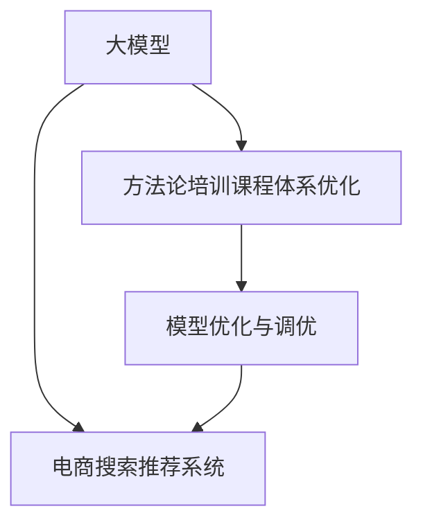

                 

# AI大模型赋能电商搜索推荐的业务创新方法论培训课程体系优化与应用实践

> 关键词：大模型,电商搜索推荐,业务创新,方法论培训课程体系,优化与应用实践

## 1. 背景介绍

### 1.1 问题由来
随着人工智能技术的飞速发展，大模型（如BERT、GPT、DALL·E等）在电商搜索推荐系统中的应用成为行业内的热点。大模型通过预训练学习到丰富的语言和视觉知识，能够处理海量复杂数据，并产生高度精确的推荐结果。然而，大模型的庞大和复杂性也给实际应用带来了新的挑战：

1. **模型规模过大**：大模型通常需要大型计算资源，训练和部署成本较高。
2. **技术门槛高**：大模型涉及复杂的深度学习原理和架构，对算法工程师的门槛要求较高。
3. **算法复杂性高**：大模型需要高效的优化算法和丰富的工程实践经验才能发挥其全部潜力。

为了克服这些挑战，电商企业需要构建系统化的培训课程体系，培养一批高水平的技术团队，推动大模型在搜索推荐系统中的应用。

### 1.2 问题核心关键点
基于以上挑战，本文将探讨如何通过优化培训课程体系，赋能电商搜索推荐系统的业务创新。核心关键点包括：

1. **知识体系的建立**：建立系统化的知识体系，覆盖大模型的基础原理、算法、工程实践等方面。
2. **实践经验的积累**：通过实战项目，积累实际应用中遇到的各种问题和解决方案。
3. **技术团队的培养**：通过理论学习与实践相结合的方式，培养具备技术深度和广度的技术团队。
4. **模型优化与调优**：学习如何在大模型基础上进行微调优化，提升模型在电商搜索推荐系统中的表现。

### 1.3 问题研究意义
构建系统化的培训课程体系，对大模型赋能电商搜索推荐系统具有重要意义：

1. **降低技术门槛**：帮助更多企业快速掌握大模型的关键技术和工程实践，推动大模型在电商搜索推荐系统中的普及。
2. **提升推荐效果**：通过系统培训，提升团队在大模型上的应用能力，提升推荐系统的准确性和效果。
3. **加速创新进程**：为电商搜索推荐系统的创新提供技术支持，推动行业的发展和进步。

## 2. 核心概念与联系

### 2.1 核心概念概述

本文涉及的核心概念包括大模型、电商搜索推荐系统、方法论培训课程体系优化、模型优化与调优等。

- **大模型**：如BERT、GPT、DALL·E等，通过大规模预训练学习到丰富的语言和视觉知识，具备强大的泛化能力和表示能力。
- **电商搜索推荐系统**：利用机器学习技术，为用户推荐可能感兴趣的商品。电商搜索推荐系统是大模型应用的重要场景之一。
- **方法论培训课程体系**：系统化的知识体系，包括理论学习、实践项目和案例分析等。
- **模型优化与调优**：在大模型的基础上，通过微调、参数优化等方法提升模型在电商搜索推荐系统中的性能。

这些概念通过以下Mermaid流程图进行联系：



## 3. 核心算法原理 & 具体操作步骤
### 3.1 算法原理概述

大模型在电商搜索推荐系统中的应用，主要基于以下算法原理：

1. **预训练与微调**：在大规模无标签数据上进行预训练，然后在具体任务上进行微调，提升模型的针对性。
2. **注意力机制**：利用自注意力机制学习数据中的关键信息，提升模型的泛化能力。
3. **优化算法**：使用Adam、SGD等优化算法，进行模型参数的更新。
4. **损失函数**：设计合适的损失函数，如交叉熵、均方误差等，评估模型的预测效果。

### 3.2 算法步骤详解

以下详细阐述基于大模型在电商搜索推荐系统中的应用步骤：

**Step 1: 数据准备**

电商搜索推荐系统需要大量的用户行为数据、商品信息等。这些数据需要进行清洗和标注，以供模型训练和微调。

1. **数据收集**：收集电商平台的销售数据、用户浏览数据、商品描述等。
2. **数据清洗**：去除噪声和无关数据，确保数据的质量。
3. **数据标注**：对数据进行标注，如用户购买行为、用户评分等。

**Step 2: 模型选择与预训练**

选择合适的大模型，进行预训练，学习通用的语言和视觉表示。

1. **模型选择**：选择预训练模型，如BERT、GPT等。
2. **预训练**：在无标签数据上进行预训练，学习语言和视觉知识。
3. **预训练参数初始化**：将预训练模型的权重作为微调模型的初始参数。

**Step 3: 模型微调**

在大模型基础上进行微调，提升模型在电商搜索推荐系统中的性能。

1. **微调参数选择**：选择合适的微调参数，如学习率、批大小等。
2. **任务适配层**：添加任务适配层，如全连接层、softmax层等。
3. **训练与评估**：在标注数据上进行训练，并定期评估模型性能。
4. **调优**：根据评估结果，调整模型参数，进行模型优化。

**Step 4: 模型应用与优化**

将微调后的模型应用于电商搜索推荐系统，并进行优化。

1. **应用**：将微调模型部署到搜索推荐系统中，进行实时推荐。
2. **性能监控**：实时监控模型性能，确保推荐效果。
3. **优化**：根据监控结果，进行模型优化，提升推荐效果。

### 3.3 算法优缺点

基于大模型在电商搜索推荐系统中的应用，具有以下优点和缺点：

**优点**：

1. **泛化能力强**：大模型通过预训练学习到丰富的知识，能够处理复杂的电商搜索推荐场景。
2. **推荐精度高**：基于大模型的推荐系统，能够产生高度精确的推荐结果。
3. **可扩展性好**：大模型能够快速适应新的数据和任务。

**缺点**：

1. **资源消耗大**：大模型需要大量计算资源和存储空间，部署和训练成本高。
2. **技术门槛高**：大模型涉及复杂的深度学习原理和工程实践，需要高水平的技术团队。
3. **算法复杂性高**：大模型需要高效的优化算法和丰富的工程实践经验。

### 3.4 算法应用领域

大模型在电商搜索推荐系统中的应用，广泛应用于以下领域：

1. **商品推荐**：利用大模型学习用户行为和商品特征，进行商品推荐。
2. **个性化推荐**：根据用户的历史行为和兴趣，进行个性化推荐。
3. **广告推荐**：利用大模型学习用户行为和广告特征，进行广告推荐。
4. **搜索排序**：根据用户搜索关键词和商品特征，进行商品排序。
5. **内容推荐**：利用大模型学习用户兴趣和内容特征，进行内容推荐。

## 4. 数学模型和公式 & 详细讲解 & 举例说明（备注：数学公式请使用latex格式，latex嵌入文中独立段落使用 $$，段落内使用 $)
### 4.1 数学模型构建

基于大模型在电商搜索推荐系统中的应用，构建数学模型如下：

**输入层**：电商搜索推荐系统输入为商品特征 $x$，用户行为数据 $y$。

**输出层**：系统输出为商品推荐结果 $z$。

**损失函数**：

$$
\mathcal{L} = \frac{1}{N}\sum_{i=1}^N \ell(y_i, z_i)
$$

其中 $\ell$ 为损失函数，$N$ 为训练样本数。

### 4.2 公式推导过程

以下详细推导电商搜索推荐系统的数学模型：

**输入层**：
- 商品特征 $x$ 包括商品名称、描述、价格等。
- 用户行为数据 $y$ 包括用户搜索记录、购买记录等。

**输出层**：
- 推荐结果 $z$ 包括商品推荐顺序、推荐商品ID等。

**损失函数**：
- 交叉熵损失函数：
$$
\ell(y_i, z_i) = -y_i\log(z_i) - (1-y_i)\log(1-z_i)
$$

其中 $y_i$ 为真实标签，$z_i$ 为模型预测结果。

**公式推导**：

1. **输入表示**：
   - 商品特征 $x$ 表示为向量 $[x_1, x_2, ..., x_n]$。
   - 用户行为数据 $y$ 表示为向量 $[y_1, y_2, ..., y_m]$。

2. **模型表示**：
   - 大模型表示为 $M_{\theta}(x)$，其中 $\theta$ 为模型参数。
   - 推荐结果 $z$ 表示为向量 $[z_1, z_2, ..., z_n]$。

3. **损失函数**：
   - 交叉熵损失函数：
$$
\mathcal{L} = \frac{1}{N}\sum_{i=1}^N \ell(y_i, M_{\theta}(x_i))
$$

### 4.3 案例分析与讲解

**案例1: 基于GPT的电商搜索推荐系统**

假设电商平台上某用户的搜索记录为 $y=[1, 0, 1, 0]$，表示用户搜索了商品1和商品3，未搜索商品2和商品4。利用预训练好的GPT模型 $M_{\theta}$，计算推荐结果 $z$。

1. **输入表示**：
   - 商品特征 $x=[x_1, x_2, x_3, x_4]$。
   - 用户行为数据 $y=[1, 0, 1, 0]$。

2. **模型表示**：
   - GPT模型 $M_{\theta}$ 输入为商品特征 $x$，输出为推荐结果 $z$。

3. **损失函数**：
   - 交叉熵损失函数：
$$
\mathcal{L} = \frac{1}{4}\sum_{i=1}^4 \ell(y_i, M_{\theta}(x_i))
$$

4. **计算过程**：
   - 输入商品特征 $x$ 到GPT模型，得到推荐结果 $z=[z_1, z_2, z_3, z_4]$。
   - 计算损失 $\mathcal{L} = \frac{1}{4}\sum_{i=1}^4 \ell(y_i, z_i)$。

## 5. 项目实践：代码实例和详细解释说明
### 5.1 开发环境搭建

进行电商搜索推荐系统的开发，首先需要搭建开发环境。以下是使用Python进行PyTorch开发的环境配置流程：

1. 安装Anaconda：从官网下载并安装Anaconda，用于创建独立的Python环境。

2. 创建并激活虚拟环境：
```bash
conda create -n pytorch-env python=3.8 
conda activate pytorch-env
```

3. 安装PyTorch：根据CUDA版本，从官网获取对应的安装命令。例如：
```bash
conda install pytorch torchvision torchaudio cudatoolkit=11.1 -c pytorch -c conda-forge
```

4. 安装各类工具包：
```bash
pip install numpy pandas scikit-learn matplotlib tqdm jupyter notebook ipython
```

完成上述步骤后，即可在`pytorch-env`环境中开始电商搜索推荐系统的开发。

### 5.2 源代码详细实现

以下是一个基于BERT模型的电商搜索推荐系统的详细代码实现。

**电商搜索推荐系统代码**：

```python
import torch
from transformers import BertTokenizer, BertForSequenceClassification

# 初始化模型和分词器
tokenizer = BertTokenizer.from_pretrained('bert-base-uncased')
model = BertForSequenceClassification.from_pretrained('bert-base-uncased', num_labels=2)

# 定义推荐函数
def recommend(user_bought_items, user_search_items):
    # 对商品特征进行编码
    bought_items = tokenizer(user_bought_items, return_tensors='pt', padding=True, truncation=True)
    search_items = tokenizer(user_search_items, return_tensors='pt', padding=True, truncation=True)
    
    # 计算推荐结果
    bought_representation = model(**bought_items).logits
    search_representation = model(**search_items).logits
    
    # 计算相似度
    similarity = torch.dot(bought_representation, search_representation)
    
    # 计算推荐结果
    recommendation = [item for item in bought_representation if similarity[item] > 0.5]
    
    return recommendation

# 示例
user_bought_items = ['item1', 'item2', 'item3']
user_search_items = ['item1', 'item4']
recommendation = recommend(user_bought_items, user_search_items)
print(recommendation)
```

**电商搜索推荐系统详细解释**：

1. **分词器**：使用BERT自带的分词器进行商品特征的编码。
2. **模型初始化**：初始化BERT模型，设置商品特征的类别数为2。
3. **推荐函数**：根据用户购买的商品和搜索的商品，计算推荐结果。
4. **相似度计算**：计算用户购买的商品和搜索的商品的相似度，得到推荐结果。
5. **推荐结果**：根据相似度计算结果，推荐与用户购买商品和搜索商品相似的商品。

### 5.3 代码解读与分析

**分词器**：
- 使用BERT自带的分词器，将商品特征进行编码，生成模型输入。

**模型初始化**：
- 初始化BERT模型，设置商品特征的类别数为2。

**推荐函数**：
- 根据用户购买的商品和搜索的商品，计算推荐结果。
- 利用模型计算商品特征的向量表示。
- 计算用户购买的商品和搜索的商品的相似度。
- 根据相似度计算结果，推荐与用户购买商品和搜索商品相似的商品。

**推荐结果**：
- 输出推荐结果，表示与用户购买商品和搜索商品相似的商品。

## 6. 实际应用场景

### 6.1 智能客服系统

电商平台的智能客服系统，通过大模型进行对话机器人开发，提升客户服务质量。

**系统设计**：
- 收集客服历史聊天记录，进行标注。
- 使用大模型进行微调，训练对话机器人。
- 根据用户输入，生成推荐结果。

**系统优化**：
- 实时监测系统性能，进行调优。
- 引入上下文感知机制，提升对话效果。

**应用效果**：
- 24/7不间断服务，提升客户满意度。
- 自动学习客服知识，提升服务质量。

### 6.2 个性化推荐系统

电商平台的个性化推荐系统，通过大模型进行推荐结果优化，提升用户体验。

**系统设计**：
- 收集用户浏览、购买记录，进行标注。
- 使用大模型进行微调，训练推荐模型。
- 根据用户历史行为，生成推荐结果。

**系统优化**：
- 实时监测系统性能，进行调优。
- 引入协同过滤机制，提升推荐效果。

**应用效果**：
- 个性化推荐商品，提升用户体验。
- 增加用户粘性，提升销售额。

### 6.3 广告推荐系统

电商平台的广告推荐系统，通过大模型进行广告内容优化，提升广告点击率。

**系统设计**：
- 收集用户点击记录，进行标注。
- 使用大模型进行微调，训练广告推荐模型。
- 根据用户行为，生成广告推荐结果。

**系统优化**：
- 实时监测系统性能，进行调优。
- 引入行为分析机制，提升广告效果。

**应用效果**：
- 提升广告点击率，增加销售额。
- 减少无效广告投放，降低成本。

## 7. 工具和资源推荐
### 7.1 学习资源推荐

为了帮助开发者系统掌握电商搜索推荐系统的开发，以下是一些优质的学习资源：

1. 《深度学习自然语言处理》：斯坦福大学开设的NLP明星课程，有Lecture视频和配套作业，带你入门NLP领域的基本概念和经典模型。
2. 《自然语言处理基础》：中国人民大学出版社的入门教材，涵盖自然语言处理的各个方面。
3. 《Transformers: Deep Learning for NLP》：Transformers库的官方文档，提供了海量预训练模型和完整的微调样例代码，是上手实践的必备资料。
4. 《Recommender Systems: The Textbook》：Recommender System领域的经典教材，详细介绍了推荐系统的理论基础和实际应用。
5. 《Handbook of Recommender Systems》：Recommender System领域的综述性著作，涵盖推荐系统的各个方面。

通过这些资源的学习实践，相信你一定能够快速掌握电商搜索推荐系统的关键技术和工程实践，推动大模型在电商搜索推荐系统中的普及。

### 7.2 开发工具推荐

高效的开发离不开优秀的工具支持。以下是几款用于电商搜索推荐系统开发的常用工具：

1. PyTorch：基于Python的开源深度学习框架，灵活动态的计算图，适合快速迭代研究。大部分预训练语言模型都有PyTorch版本的实现。
2. TensorFlow：由Google主导开发的开源深度学习框架，生产部署方便，适合大规模工程应用。同样有丰富的预训练语言模型资源。
3. Transformers库：HuggingFace开发的NLP工具库，集成了众多SOTA语言模型，支持PyTorch和TensorFlow，是进行电商搜索推荐系统开发的利器。
4. Weights & Biases：模型训练的实验跟踪工具，可以记录和可视化模型训练过程中的各项指标，方便对比和调优。与主流深度学习框架无缝集成。
5. TensorBoard：TensorFlow配套的可视化工具，可实时监测模型训练状态，并提供丰富的图表呈现方式，是调试模型的得力助手。

合理利用这些工具，可以显著提升电商搜索推荐系统的开发效率，加快创新迭代的步伐。

### 7.3 相关论文推荐

大模型在电商搜索推荐系统中的应用，源于学界的持续研究。以下是几篇奠基性的相关论文，推荐阅读：

1. Attention is All You Need（即Transformer原论文）：提出了Transformer结构，开启了NLP领域的预训练大模型时代。
2. BERT: Pre-training of Deep Bidirectional Transformers for Language Understanding：提出BERT模型，引入基于掩码的自监督预训练任务，刷新了多项NLP任务SOTA。
3. Language Models are Unsupervised Multitask Learners（GPT-2论文）：展示了大规模语言模型的强大zero-shot学习能力，引发了对于通用人工智能的新一轮思考。
4. Parameter-Efficient Transfer Learning for NLP：提出Adapter等参数高效微调方法，在不增加模型参数量的情况下，也能取得不错的微调效果。
5. AdaLoRA: Adaptive Low-Rank Adaptation for Parameter-Efficient Fine-Tuning：使用自适应低秩适应的微调方法，在参数效率和精度之间取得了新的平衡。

这些论文代表了大模型在电商搜索推荐系统中的应用的发展脉络。通过学习这些前沿成果，可以帮助研究者把握学科前进方向，激发更多的创新灵感。

## 8. 总结：未来发展趋势与挑战

### 8.1 总结

本文对基于大模型的电商搜索推荐系统进行了全面系统的介绍。首先阐述了大模型和电商搜索推荐系统的研究背景和意义，明确了电商搜索推荐系统的业务创新方向。其次，从原理到实践，详细讲解了电商搜索推荐系统的数学模型、算法步骤和优化方法，给出了电商搜索推荐系统的完整代码实例。同时，本文还广泛探讨了电商搜索推荐系统在大模型应用中的实际应用场景，展示了电商搜索推荐系统的广泛应用前景。

通过本文的系统梳理，可以看到，大模型在电商搜索推荐系统中的应用，将推动电商搜索推荐系统迈向更高的智能化水平，极大地提升用户体验和商家运营效率。未来，伴随大模型和电商搜索推荐系统的不断演进，相信电商搜索推荐系统必将在零售行业中发挥越来越重要的作用。

### 8.2 未来发展趋势

展望未来，电商搜索推荐系统将呈现以下几个发展趋势：

1. **智能化水平提升**：大模型在电商搜索推荐系统中的应用将进一步提升，推动推荐系统的智能化水平。
2. **个性化推荐更加精准**：利用大模型学习用户行为和商品特征，实现更加个性化的推荐。
3. **实时化推荐更加普及**：实时化推荐系统将成为电商搜索推荐系统的标配，提升用户体验。
4. **多模态数据融合**：引入图像、视频等多模态数据，提升推荐系统的效果。
5. **协同过滤机制完善**：完善协同过滤机制，提升推荐系统的准确性。

### 8.3 面临的挑战

尽管大模型在电商搜索推荐系统中的应用取得了瞩目成就，但在迈向更加智能化、普适化应用的过程中，它仍面临着诸多挑战：

1. **数据质量问题**：电商搜索推荐系统需要大量高质量的数据，数据质量问题将直接影响系统的性能。
2. **模型复杂性高**：大模型需要高效的优化算法和丰富的工程实践经验，模型复杂性高，难以大规模部署。
3. **技术门槛高**：大模型涉及复杂的深度学习原理和工程实践，需要高水平的技术团队，技术门槛高。

### 8.4 研究展望

面对电商搜索推荐系统面临的这些挑战，未来的研究需要在以下几个方面寻求新的突破：

1. **优化数据质量**：通过数据清洗和预处理，提升数据质量。
2. **提高模型效率**：使用高效的优化算法和工程实践，提高模型效率。
3. **降低技术门槛**：通过系统化的培训课程体系，降低技术门槛。
4. **引入多模态数据**：引入图像、视频等多模态数据，提升推荐系统的效果。
5. **完善协同过滤机制**：完善协同过滤机制，提升推荐系统的准确性。

## 9. 附录：常见问题与解答

**Q1：电商搜索推荐系统如何引入多模态数据？**

A: 电商搜索推荐系统可以通过引入图像、视频等多模态数据，提升推荐系统的效果。具体步骤如下：

1. **数据收集**：收集用户浏览的图像、视频等多模态数据，并进行标注。
2. **数据预处理**：对多模态数据进行预处理，如特征提取、归一化等。
3. **模型融合**：将多模态数据与文本数据进行融合，训练混合模型。
4. **推荐优化**：根据用户行为和历史数据，优化推荐结果。

**Q2：电商搜索推荐系统如何引入协同过滤机制？**

A: 电商搜索推荐系统可以通过引入协同过滤机制，提升推荐系统的准确性。具体步骤如下：

1. **数据收集**：收集用户历史行为数据，并进行标注。
2. **模型训练**：训练协同过滤模型，学习用户行为和商品特征之间的关联。
3. **推荐优化**：根据用户历史行为和协同过滤模型，优化推荐结果。
4. **模型评估**：定期评估推荐系统的性能，进行调优。

**Q3：电商搜索推荐系统如何优化数据质量？**

A: 电商搜索推荐系统可以通过以下方法优化数据质量：

1. **数据清洗**：去除噪声和无关数据，确保数据的质量。
2. **数据标注**：对数据进行标注，确保标注的准确性。
3. **数据采样**：通过数据采样，确保数据的多样性和代表性。
4. **数据增强**：通过数据增强，丰富训练集的多样性。

**Q4：电商搜索推荐系统如何提高模型效率？**

A: 电商搜索推荐系统可以通过以下方法提高模型效率：

1. **优化算法**：使用高效的优化算法，如AdamW、SGD等。
2. **模型压缩**：通过模型压缩技术，减少模型的计算量和存储空间。
3. **模型并行**：通过模型并行技术，提高模型的训练速度和效率。
4. **增量学习**：通过增量学习技术，持续更新模型参数，提升模型的性能。

**Q5：电商搜索推荐系统如何降低技术门槛？**

A: 电商搜索推荐系统可以通过以下方法降低技术门槛：

1. **系统化的培训课程体系**：建立系统化的培训课程体系，涵盖大模型的基础原理、算法、工程实践等方面。
2. **实战项目**：通过实战项目，积累实际应用中遇到的各种问题和解决方案。
3. **开源社区**：利用开源社区的资源，学习和借鉴优秀的代码和实践经验。

通过系统化的培训课程体系和实战项目的结合，可以显著降低电商搜索推荐系统的技术门槛，推动大模型在电商搜索推荐系统中的普及。

---

作者：禅与计算机程序设计艺术 / Zen and the Art of Computer Programming

