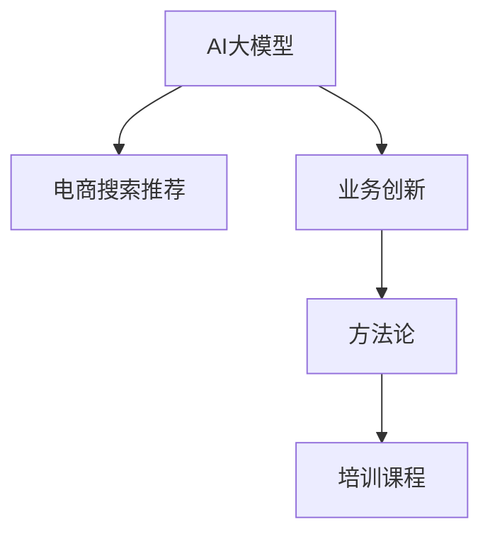

                 

# AI大模型赋能电商搜索推荐的业务创新方法论培训课程开发

> 关键词：
- AI大模型
- 电商搜索推荐
- 业务创新
- 方法论
- 培训课程

## 1. 背景介绍

### 1.1 问题由来

随着电商行业的高速发展，搜索推荐系统的复杂性和多样性日益增加，用户需求呈现多样化趋势。传统推荐算法依赖用户行为历史数据，难以捕捉长尾需求和冷启动问题。而AI大模型通过预训练获得海量知识，具备强大的泛化能力和知识迁移能力，能够更精准地捕捉用户需求，从而提升推荐效果。

当前，电商企业对于AI大模型的应用越来越重视，但如何系统、高效地进行技术应用和落地，成为其面临的一大难题。针对这一问题，我们开发了AI大模型赋能电商搜索推荐的业务创新方法论培训课程，旨在系统介绍AI大模型在电商搜索推荐中的应用方法，帮助企业系统掌握AI技术，打造智能推荐系统，提升用户体验和转化率。

### 1.2 问题核心关键点

本课程聚焦于以下几个关键问题：
- 如何将AI大模型应用于电商搜索推荐？
- 如何设计有效的数据集和标注策略？
- 如何构建和微调大模型？
- 如何评估和优化推荐系统效果？
- 如何实现高效的模型部署与监控？

通过深入讲解这些核心问题，本课程能够系统帮助企业构建高精度的电商搜索推荐系统。

## 2. 核心概念与联系

### 2.1 核心概念概述

为了更好地理解本课程内容，我们首先介绍几个核心概念及其联系：

1. **AI大模型(AI Large Model)**：
   - 指通过大规模无标签数据预训练得到的深度学习模型，如BERT、GPT-3等。这些模型具备强大的泛化能力和知识迁移能力，能够处理复杂任务，提升推荐系统的智能化水平。

2. **电商搜索推荐(E-commerce Search & Recommendation)**：
   - 指在电商平台上，通过搜索系统匹配用户查询，推荐用户可能感兴趣的商品或服务。推荐系统能够提升用户体验，增加转化率，促进销售额提升。

3. **业务创新(Business Innovation)**：
   - 指利用新技术和新方法，创造新的商业模式、产品或服务，提升企业竞争力和市场份额。AI大模型在电商搜索推荐中的应用，就是一种典型的业务创新方式。

4. **方法论(Methodology)**：
   - 指系统、有条理的解决问题的方法，包括理论基础、实践步骤、案例分析等。本课程旨在提供一套完整的方法论，帮助企业有效应用AI大模型。

5. **培训课程(Training Course)**：
   - 指通过系统的知识讲授和实践演练，帮助学员掌握特定技能和知识。本课程通过系统讲解和实操训练，使学员能够高效应用AI大模型于电商搜索推荐。

这些核心概念之间的逻辑关系，可以通过以下Mermaid流程图来展示：



这个流程图展示了AI大模型在电商搜索推荐中的应用路径：
- 从AI大模型到电商搜索推荐，体现了模型的应用价值。
- 从AI大模型到业务创新，展示了技术的应用效果。
- 从业务创新到方法论，归纳了创新过程的通用方法。
- 从方法论到培训课程，提供了系统学习途径。

## 3. 核心算法原理 & 具体操作步骤
### 3.1 算法原理概述

AI大模型在电商搜索推荐中的应用，主要依赖于两个关键步骤：预训练和微调。具体步骤如下：

1. **预训练(Pre-training)**：
   - 在无标签的大规模数据集上进行预训练，学习通用的语言知识。
   - 常用的预训练任务包括掩码语言模型、自编码等。

2. **微调(Fine-tuning)**：
   - 在标注的电商数据集上进行微调，将预训练模型优化为针对电商搜索推荐任务的模型。
   - 微调通常包括任务适配、超参数设置、梯度训练等步骤。

### 3.2 算法步骤详解

以下详细介绍AI大模型赋能电商搜索推荐的具体操作步骤：

**Step 1: 数据准备和标注**

1. **数据集收集**：
   - 收集电商平台的商品信息、用户行为数据、搜索查询数据等。
   - 数据集需包含商品ID、名称、描述、价格、评分、用户ID、点击率、购买率等特征。

2. **数据预处理**：
   - 对文本数据进行清洗、分词、编码等预处理。
   - 对数值型数据进行归一化、标准化等处理。

3. **数据标注**：
   - 标注每个商品与用户行为之间的关联关系，如点击、购买、收藏等。
   - 标注每个搜索查询与推荐商品之间的关联关系，如相关商品、热门商品等。

**Step 2: 模型选择和预训练**

1. **模型选择**：
   - 选择合适的预训练模型，如BERT、GPT-3、DPR等。
   - 根据电商搜索推荐任务特点，选择适合的大模型。

2. **预训练**：
   - 在无标签的大规模数据集上，使用预训练任务对模型进行训练。
   - 预训练任务可包括掩码语言模型、自编码等。

**Step 3: 任务适配和微调**

1. **任务适配**：
   - 根据电商搜索推荐任务，设计合适的输出层和损失函数。
   - 输出层可以是分类器或回归器，损失函数可以是交叉熵损失或均方误差损失。

2. **微调设置**：
   - 设置微调的超参数，如学习率、批大小、迭代轮数等。
   - 设置正则化技术，如L2正则、Dropout等，防止过拟合。

3. **梯度训练**：
   - 将电商数据集分成训练集、验证集和测试集。
   - 使用梯度下降等优化算法，对模型进行迭代优化。

**Step 4: 评估和优化**

1. **模型评估**：
   - 在测试集上评估微调后的模型性能。
   - 常用评估指标包括准确率、召回率、F1-score等。

2. **效果优化**：
   - 根据评估结果，调整模型结构、超参数等，进一步提升模型效果。
   - 可以尝试调整任务适配层的结构、微调策略等。

**Step 5: 部署和监控**

1. **模型部署**：
   - 将微调后的模型集成到电商平台的搜索推荐系统中。
   - 可以使用Kubernetes、AWS、Azure等云平台进行模型部署。

2. **监控和优化**：
   - 实时监控模型性能，收集用户反馈和日志。
   - 根据监控结果，调整模型参数，优化推荐效果。

### 3.3 算法优缺点

AI大模型赋能电商搜索推荐的优点包括：

1. **高泛化能力**：
   - 大模型通过大规模数据预训练，具备强大的泛化能力，能够有效处理电商搜索推荐任务。

2. **知识迁移**：
   - 大模型可以通过迁移学习，快速适应特定电商领域的推荐需求。

3. **效果显著**：
   - 在大规模电商数据集上进行微调，可以有效提升推荐系统的效果，提升用户体验和转化率。

4. **通用性强**：
   - 大模型适用于多种电商推荐场景，如个性化推荐、搜索排序、广告推荐等。

其缺点包括：

1. **数据依赖**：
   - 微调效果依赖于标注数据的质量和数量，标注成本较高。

2. **模型复杂**：
   - 大模型参数量庞大，计算资源消耗大，训练和推理速度较慢。

3. **解释性差**：
   - 大模型属于黑盒模型，难以解释推荐结果的内部逻辑。

4. **偏差和有害信息**：
   - 大模型可能学习到偏见和有害信息，影响推荐系统的公平性和安全性。

### 3.4 算法应用领域

AI大模型在电商搜索推荐中的应用领域包括：

1. **个性化推荐**：
   - 根据用户历史行为和偏好，推荐个性化商品或服务。
   - 利用大模型学习用户兴趣和行为，提升推荐精准度。

2. **搜索排序**：
   - 对用户搜索查询结果进行排序，推荐最相关商品。
   - 利用大模型学习查询与商品的关联关系，提升搜索体验。

3. **广告推荐**：
   - 根据用户行为和偏好，推荐相关广告。
   - 利用大模型学习用户兴趣和行为，提升广告点击率和转化率。

4. **价格优化**：
   - 根据用户需求和市场变化，动态调整商品价格。
   - 利用大模型预测用户对价格的敏感度，优化定价策略。

5. **库存管理**：
   - 根据用户购买行为，优化商品库存管理。
   - 利用大模型预测商品需求，减少库存积压，提升销售效率。

6. **用户反馈分析**：
   - 分析用户对推荐结果的反馈，调整推荐策略。
   - 利用大模型学习用户反馈，提升推荐系统的交互性和满意度。

## 4. 数学模型和公式 & 详细讲解

### 4.1 数学模型构建

在本课程中，我们将重点介绍大模型在电商搜索推荐中的数学模型构建。假设电商数据集为 $D=\{(x_i, y_i)\}_{i=1}^N$，其中 $x_i$ 为商品描述，$y_i$ 为点击或购买标签。目标是通过微调，构建推荐模型 $M_{\theta}$。

### 4.2 公式推导过程

以下详细介绍大模型在电商搜索推荐中的公式推导过程：

1. **预训练模型**：
   - 使用掩码语言模型作为预训练任务，对大模型进行预训练。
   - 预训练损失函数为 $L_{pre}(\theta) = -\sum_{i=1}^N\log P(y_i|M_{\theta}(x_i))$。

2. **微调模型**：
   - 使用点击或购买标签作为标注数据，对预训练模型进行微调。
   - 微调损失函数为 $L_{fin}(\theta) = -\sum_{i=1}^N y_i\log M_{\theta}(x_i) + (1-y_i)\log (1-M_{\theta}(x_i))$。

3. **推荐结果**：
   - 使用微调后的模型对用户查询进行预测，输出点击概率。
   - 排序并推荐点击概率最高的商品。

4. **优化目标**：
   - 最小化微调损失函数 $L_{fin}(\theta)$，提升推荐效果。

### 4.3 案例分析与讲解

以电商搜索推荐中的个性化推荐为例，进行详细讲解：

**案例背景**：
- 假设某电商网站，用户A搜索“夏季连衣裙”，系统希望推荐最适合的商品。

**模型输入**：
- 商品描述“夏季连衣裙”作为输入，预训练模型和微调模型对其进行处理。

**模型输出**：
- 输出用户A点击某个商品的概率，排序并推荐概率最高的商品。

**案例分析**：
- 通过预训练模型学习通用的语言表示，提取商品描述的关键特征。
- 通过微调模型学习电商领域特定任务，优化推荐结果。
- 利用优化目标最小化微调损失，提升推荐准确性。

## 5. 项目实践：代码实例和详细解释说明

### 5.1 开发环境搭建

在进行AI大模型赋能电商搜索推荐的培训课程开发前，需要准备好开发环境。以下是使用Python进行PyTorch开发的环境配置流程：

1. 安装Anaconda：从官网下载并安装Anaconda，用于创建独立的Python环境。

2. 创建并激活虚拟环境：
```bash
conda create -n pytorch-env python=3.8 
conda activate pytorch-env
```

3. 安装PyTorch：根据CUDA版本，从官网获取对应的安装命令。例如：
```bash
conda install pytorch torchvision torchaudio cudatoolkit=11.1 -c pytorch -c conda-forge
```

4. 安装TensorFlow：
```bash
conda install tensorflow
```

5. 安装各类工具包：
```bash
pip install numpy pandas scikit-learn matplotlib tqdm jupyter notebook ipython
```

完成上述步骤后，即可在`pytorch-env`环境中开始课程开发。

### 5.2 源代码详细实现

我们以电商搜索推荐中的个性化推荐任务为例，给出使用Transformers库对BERT模型进行微调的PyTorch代码实现。

首先，定义任务相关的函数：

```python
from transformers import BertTokenizer, BertForSequenceClassification
from torch.utils.data import Dataset
import torch

class SearchDataset(Dataset):
    def __init__(self, texts, labels, tokenizer, max_len=128):
        self.texts = texts
        self.labels = labels
        self.tokenizer = tokenizer
        self.max_len = max_len
        
    def __len__(self):
        return len(self.texts)
    
    def __getitem__(self, item):
        text = self.texts[item]
        label = self.labels[item]
        
        encoding = self.tokenizer(text, return_tensors='pt', max_length=self.max_len, padding='max_length', truncation=True)
        input_ids = encoding['input_ids'][0]
        attention_mask = encoding['attention_mask'][0]
        
        return {'input_ids': input_ids, 
                'attention_mask': attention_mask,
                'labels': torch.tensor(label, dtype=torch.long)}
```

然后，定义模型和优化器：

```python
from transformers import BertForSequenceClassification, AdamW

model = BertForSequenceClassification.from_pretrained('bert-base-cased', num_labels=2)

optimizer = AdamW(model.parameters(), lr=2e-5)
```

接着，定义训练和评估函数：

```python
from torch.utils.data import DataLoader
from tqdm import tqdm
from sklearn.metrics import classification_report

device = torch.device('cuda') if torch.cuda.is_available() else torch.device('cpu')
model.to(device)

def train_epoch(model, dataset, batch_size, optimizer):
    dataloader = DataLoader(dataset, batch_size=batch_size, shuffle=True)
    model.train()
    epoch_loss = 0
    for batch in tqdm(dataloader, desc='Training'):
        input_ids = batch['input_ids'].to(device)
        attention_mask = batch['attention_mask'].to(device)
        labels = batch['labels'].to(device)
        model.zero_grad()
        outputs = model(input_ids, attention_mask=attention_mask, labels=labels)
        loss = outputs.loss
        epoch_loss += loss.item()
        loss.backward()
        optimizer.step()
    return epoch_loss / len(dataloader)

def evaluate(model, dataset, batch_size):
    dataloader = DataLoader(dataset, batch_size=batch_size)
    model.eval()
    preds, labels = [], []
    with torch.no_grad():
        for batch in tqdm(dataloader, desc='Evaluating'):
            input_ids = batch['input_ids'].to(device)
            attention_mask = batch['attention_mask'].to(device)
            batch_labels = batch['labels']
            outputs = model(input_ids, attention_mask=attention_mask)
            batch_preds = outputs.logits.argmax(dim=2).to('cpu').tolist()
            batch_labels = batch_labels.to('cpu').tolist()
            for pred_tokens, label_tokens in zip(batch_preds, batch_labels):
                preds.append(pred_tokens)
                labels.append(label_tokens)
                
    print(classification_report(labels, preds))
```

最后，启动训练流程并在测试集上评估：

```python
epochs = 5
batch_size = 16

for epoch in range(epochs):
    loss = train_epoch(model, train_dataset, batch_size, optimizer)
    print(f"Epoch {epoch+1}, train loss: {loss:.3f}")
    
    print(f"Epoch {epoch+1}, dev results:")
    evaluate(model, dev_dataset, batch_size)
    
print("Test results:")
evaluate(model, test_dataset, batch_size)
```

以上就是使用PyTorch对BERT进行电商搜索推荐任务的微调的完整代码实现。可以看到，得益于Transformers库的强大封装，我们可以用相对简洁的代码完成BERT模型的加载和微调。

### 5.3 代码解读与分析

让我们再详细解读一下关键代码的实现细节：

**SearchDataset类**：
- `__init__`方法：初始化文本、标签、分词器等关键组件。
- `__len__`方法：返回数据集的样本数量。
- `__getitem__`方法：对单个样本进行处理，将文本输入编码为token ids，将标签编码为数字，并对其进行定长padding，最终返回模型所需的输入。

**模型和优化器**：
- 使用BertForSequenceClassification加载预训练模型，并设置优化器。

**训练和评估函数**：
- 使用PyTorch的DataLoader对数据集进行批次化加载，供模型训练和推理使用。
- 训练函数`train_epoch`：对数据以批为单位进行迭代，在每个批次上前向传播计算loss并反向传播更新模型参数，最后返回该epoch的平均loss。
- 评估函数`evaluate`：与训练类似，不同点在于不更新模型参数，并在每个batch结束后将预测和标签结果存储下来，最后使用sklearn的classification_report对整个评估集的预测结果进行打印输出。

**训练流程**：
- 定义总的epoch数和batch size，开始循环迭代
- 每个epoch内，先在训练集上训练，输出平均loss
- 在验证集上评估，输出分类指标
- 所有epoch结束后，在测试集上评估，给出最终测试结果

可以看到，PyTorch配合Transformers库使得BERT微调的代码实现变得简洁高效。开发者可以将更多精力放在数据处理、模型改进等高层逻辑上，而不必过多关注底层的实现细节。

当然，工业级的系统实现还需考虑更多因素，如模型的保存和部署、超参数的自动搜索、更灵活的任务适配层等。但核心的微调范式基本与此类似。

## 6. 实际应用场景

### 6.1 智能客服系统

基于大语言模型微调的对话技术，可以广泛应用于智能客服系统的构建。传统客服往往需要配备大量人力，高峰期响应缓慢，且一致性和专业性难以保证。而使用微调后的对话模型，可以7x24小时不间断服务，快速响应客户咨询，用自然流畅的语言解答各类常见问题。

在技术实现上，可以收集企业内部的历史客服对话记录，将问题和最佳答复构建成监督数据，在此基础上对预训练对话模型进行微调。微调后的对话模型能够自动理解用户意图，匹配最合适的答案模板进行回复。对于客户提出的新问题，还可以接入检索系统实时搜索相关内容，动态组织生成回答。如此构建的智能客服系统，能大幅提升客户咨询体验和问题解决效率。

### 6.2 金融舆情监测

金融机构需要实时监测市场舆论动向，以便及时应对负面信息传播，规避金融风险。传统的人工监测方式成本高、效率低，难以应对网络时代海量信息爆发的挑战。基于大语言模型微调的文本分类和情感分析技术，为金融舆情监测提供了新的解决方案。

具体而言，可以收集金融领域相关的新闻、报道、评论等文本数据，并对其进行主题标注和情感标注。在此基础上对预训练语言模型进行微调，使其能够自动判断文本属于何种主题，情感倾向是正面、中性还是负面。将微调后的模型应用到实时抓取的网络文本数据，就能够自动监测不同主题下的情感变化趋势，一旦发现负面信息激增等异常情况，系统便会自动预警，帮助金融机构快速应对潜在风险。

### 6.3 个性化推荐系统

当前的推荐系统往往只依赖用户的历史行为数据进行物品推荐，难以捕捉长尾需求和冷启动问题。基于大语言模型微调的技术，个性化推荐系统可以更好地挖掘用户行为背后的语义信息，从而提升推荐系统的智能化水平。

在实践中，可以收集用户浏览、点击、评论、分享等行为数据，提取和用户交互的物品标题、描述、标签等文本内容。将文本内容作为模型输入，用户的后续行为（如是否点击、购买等）作为监督信号，在此基础上微调预训练语言模型。微调后的模型能够从文本内容中准确把握用户的兴趣点。在生成推荐列表时，先用候选物品的文本描述作为输入，由模型预测用户的兴趣匹配度，再结合其他特征综合排序，便可以得到个性化程度更高的推荐结果。

### 6.4 未来应用展望

随着大语言模型微调技术的发展，未来将在更多领域得到应用，为各行各业带来变革性影响。

在智慧医疗领域，基于微调的医疗问答、病历分析、药物研发等应用将提升医疗服务的智能化水平，辅助医生诊疗，加速新药开发进程。

在智能教育领域，微调技术可应用于作业批改、学情分析、知识推荐等方面，因材施教，促进教育公平，提高教学质量。

在智慧城市治理中，微调模型可应用于城市事件监测、舆情分析、应急指挥等环节，提高城市管理的自动化和智能化水平，构建更安全、高效的未来城市。

此外，在企业生产、社会治理、文娱传媒等众多领域，基于大模型微调的人工智能应用也将不断涌现，为经济社会发展注入新的动力。相信随着技术的日益成熟，微调方法将成为人工智能落地应用的重要范式，推动人工智能技术在各行各业规模化落地。

## 7. 工具和资源推荐

### 7.1 学习资源推荐

为了帮助开发者系统掌握AI大模型在电商搜索推荐中的应用方法，这里推荐一些优质的学习资源：

1. 《Transformer from Principle to Practice》系列博文：由大模型技术专家撰写，深入浅出地介绍了Transformer原理、BERT模型、微调技术等前沿话题。

2. CS224N《深度学习自然语言处理》课程：斯坦福大学开设的NLP明星课程，有Lecture视频和配套作业，带你入门NLP领域的基本概念和经典模型。

3. 《Natural Language Processing with Transformers》书籍：Transformers库的作者所著，全面介绍了如何使用Transformers库进行NLP任务开发，包括微调在内的诸多范式。

4. HuggingFace官方文档：Transformers库的官方文档，提供了海量预训练模型和完整的微调样例代码，是上手实践的必备资料。

5. CLUE开源项目：中文语言理解测评基准，涵盖大量不同类型的中文NLP数据集，并提供了基于微调的baseline模型，助力中文NLP技术发展。

通过对这些资源的学习实践，相信你一定能够快速掌握AI大模型在电商搜索推荐中的应用方法，并用于解决实际的NLP问题。

### 7.2 开发工具推荐

高效的开发离不开优秀的工具支持。以下是几款用于AI大模型微调开发的常用工具：

1. PyTorch：基于Python的开源深度学习框架，灵活动态的计算图，适合快速迭代研究。大部分预训练语言模型都有PyTorch版本的实现。

2. TensorFlow：由Google主导开发的开源深度学习框架，生产部署方便，适合大规模工程应用。同样有丰富的预训练语言模型资源。

3. Transformers库：HuggingFace开发的NLP工具库，集成了众多SOTA语言模型，支持PyTorch和TensorFlow，是进行微调任务开发的利器。

4. Weights & Biases：模型训练的实验跟踪工具，可以记录和可视化模型训练过程中的各项指标，方便对比和调优。与主流深度学习框架无缝集成。

5. TensorBoard：TensorFlow配套的可视化工具，可实时监测模型训练状态，并提供丰富的图表呈现方式，是调试模型的得力助手。

6. Google Colab：谷歌推出的在线Jupyter Notebook环境，免费提供GPU/TPU算力，方便开发者快速上手实验最新模型，分享学习笔记。

合理利用这些工具，可以显著提升AI大模型在电商搜索推荐中的应用效果，加快创新迭代的步伐。

### 7.3 相关论文推荐

AI大模型和微调技术的发展源于学界的持续研究。以下是几篇奠基性的相关论文，推荐阅读：

1. Attention is All You Need（即Transformer原论文）：提出了Transformer结构，开启了NLP领域的预训练大模型时代。

2. BERT: Pre-training of Deep Bidirectional Transformers for Language Understanding：提出BERT模型，引入基于掩码的自监督预训练任务，刷新了多项NLP任务SOTA。

3. Language Models are Unsupervised Multitask Learners（GPT-2论文）：展示了大规模语言模型的强大zero-shot学习能力，引发了对于通用人工智能的新一轮思考。

4. Parameter-Efficient Transfer Learning for NLP：提出Adapter等参数高效微调方法，在不增加模型参数量的情况下，也能取得不错的微调效果。

5. Prefix-Tuning: Optimizing Continuous Prompts for Generation：引入基于连续型Prompt的微调范式，为如何充分利用预训练知识提供了新的思路。

6. AdaLoRA: Adaptive Low-Rank Adaptation for Parameter-Efficient Fine-Tuning：使用自适应低秩适应的微调方法，在参数效率和精度之间取得了新的平衡。

这些论文代表了大语言模型微调技术的发展脉络。通过学习这些前沿成果，可以帮助研究者把握学科前进方向，激发更多的创新灵感。

## 8. 总结：未来发展趋势与挑战

### 8.1 总结

本文对AI大模型在电商搜索推荐中的应用方法进行了全面系统的介绍。首先阐述了AI大模型的背景和应用前景，明确了其在电商推荐系统中的应用价值。其次，从原理到实践，详细讲解了AI大模型的数学模型构建和微调过程，给出了微调任务开发的完整代码实例。同时，本文还广泛探讨了AI大模型在智能客服、金融舆情、个性化推荐等多个行业领域的应用前景，展示了微调范式的巨大潜力。此外，本文精选了微调技术的各类学习资源，力求为读者提供全方位的技术指引。

通过本文的系统梳理，可以看到，AI大模型在电商搜索推荐中的应用，体现了技术创新对产业发展的巨大推动作用。得益于大规模数据预训练和高效微调技术，AI大模型能够有效提升推荐系统的智能化水平，从而提升用户体验和平台竞争力。未来，伴随大语言模型的持续演进，其在电商推荐中的应用将更加广泛和深入，引领行业进入智能时代。

### 8.2 未来发展趋势

展望未来，AI大模型在电商搜索推荐中的应用将呈现以下几个发展趋势：

1. **模型规模持续增大**：
   - 随着算力成本的下降和数据规模的扩张，预训练语言模型的参数量还将持续增长。超大模型具备更强的泛化能力，能够更精准地捕捉电商搜索推荐任务。

2. **微调方法日趋多样**：
   - 未来将涌现更多参数高效和计算高效的微调方法，如Prefix-Tuning、LoRA等，在节省计算资源的同时，也能保证微调精度。

3. **持续学习成为常态**：
   - 随着数据分布的不断变化，AI大模型需要持续学习新知识以保持性能。如何在不遗忘原有知识的同时，高效吸收新样本信息，将成为重要的研究课题。

4. **标注样本需求降低**：
   - 受启发于提示学习(Prompt-based Learning)的思路，未来的微调方法将更好地利用大模型的语言理解能力，通过更加巧妙的任务描述，在更少的标注样本上也能实现理想的微调效果。

5. **多模态微调崛起**：
   - 当前微调主要聚焦于纯文本数据，未来会进一步拓展到图像、视频、语音等多模态数据微调。多模态信息的融合，将显著提升语言模型对现实世界的理解和建模能力。

6. **业务创新与算法优化并重**：
   - AI大模型在电商推荐中的应用将更加注重业务创新，结合实际场景优化算法，提升推荐效果和用户满意度。

以上趋势凸显了AI大模型在电商推荐中的广阔前景。这些方向的探索发展，必将进一步提升推荐系统的性能和用户满意度，为电商行业带来深远的影响。

### 8.3 面临的挑战

尽管AI大模型在电商搜索推荐中的应用已取得显著成效，但在迈向更加智能化、普适化应用的过程中，仍面临诸多挑战：

1. **数据依赖**：
   - 微调效果依赖于标注数据的质量和数量，标注成本较高。如何进一步降低微调对标注样本的依赖，将是一大难题。

2. **模型鲁棒性不足**：
   - 当前微调模型面对域外数据时，泛化性能往往大打折扣。对于测试样本的微小扰动，微调模型的预测也容易发生波动。如何提高微调模型的鲁棒性，避免灾难性遗忘，还需要更多理论和实践的积累。

3. **推理效率有待提高**：
   - 超大模型虽然精度高，但在实际部署时往往面临推理速度慢、内存占用大等效率问题。如何在保证性能的同时，简化模型结构，提升推理速度，优化资源占用，将是重要的优化方向。

4. **可解释性亟需加强**：
   - 当前微调模型更像是"黑盒"系统，难以解释推荐结果的内部逻辑。对于医疗、金融等高风险应用，算法的可解释性和可审计性尤为重要。如何赋予微调模型更强的可解释性，将是亟待攻克的难题。

5. **安全性有待保障**：
   - 预训练语言模型难免会学习到偏见和有害信息，通过微调传递到下游任务，产生误导性、歧视性的输出，给实际应用带来安全隐患。如何从数据和算法层面消除模型偏见，避免恶意用途，确保输出的安全性，也将是重要的研究课题。

6. **知识整合能力不足**：
   - 现有的微调模型往往局限于任务内数据，难以灵活吸收和运用更广泛的先验知识。如何让微调过程更好地与外部知识库、规则库等专家知识结合，形成更加全面、准确的信息整合能力，还有很大的想象空间。

正视AI大模型在电商搜索推荐中面临的这些挑战，积极应对并寻求突破，将是大模型微调走向成熟的必由之路。相信随着学界和产业界的共同努力，这些挑战终将一一被克服，AI大模型在电商推荐中的应用将更加成熟和稳定。

### 8.4 研究展望

面对AI大模型在电商搜索推荐中的应用挑战，未来的研究需要在以下几个方面寻求新的突破：

1. **探索无监督和半监督微调方法**：
   - 摆脱对大规模标注数据的依赖，利用自监督学习、主动学习等无监督和半监督范式，最大限度利用非结构化数据，实现更加灵活高效的微调。

2. **研究参数高效和计算高效的微调范式**：
   - 开发更加参数高效的微调方法，在固定大部分预训练参数的同时，只更新极少量的任务相关参数。同时优化微调模型的计算图，减少前向传播和反向传播的资源消耗，实现更加轻量级、实时性的部署。

3. **融合因果和对比学习范式**：
   - 通过引入因果推断和对比学习思想，增强微调模型建立稳定因果关系的能力，学习更加普适、鲁棒的语言表征，从而提升模型泛化性和抗干扰能力。

4. **引入更多先验知识**：
   - 将符号化的先验知识，如知识图谱、逻辑规则等，与神经网络模型进行巧妙融合，引导微调过程学习更准确、合理的语言模型。同时加强不同模态数据的整合，实现视觉、语音等多模态信息与文本信息的协同建模。

5. **结合因果分析和博弈论工具**：
   - 将因果分析方法引入微调模型，识别出模型决策的关键特征，增强输出解释的因果性和逻辑性。借助博弈论工具刻画人机交互过程，主动探索并规避模型的脆弱点，提高系统稳定性。

6. **纳入伦理道德约束**：
   - 在模型训练目标中引入伦理导向的评估指标，过滤和惩罚有偏见、有害的输出倾向。同时加强人工干预和审核，建立模型行为的监管机制，确保输出符合人类价值观和伦理道德。

这些研究方向的探索，必将引领AI大模型在电商推荐中的应用迈向更高的台阶，为构建智能推荐系统提供更坚实的理论和技术基础。

## 9. 附录：常见问题与解答

**Q1：AI大模型微调是否适用于所有电商推荐场景？**

A: AI大模型微调在大多数电商推荐场景上都能取得不错的效果，特别是对于数据量较小的任务。但对于一些特定领域的任务，如医药电商、食品电商等，仅仅依靠通用语料预训练的模型可能难以很好地适应。此时需要在特定领域语料上进一步预训练，再进行微调，才能获得理想效果。

**Q2：微调过程中如何选择合适的学习率？**

A: 微调的学习率一般要比预训练时小1-2个数量级，如果使用过大的学习率，容易破坏预训练权重，导致过拟合。一般建议从1e-5开始调参，逐步减小学习率，直至收敛。也可以使用warmup策略，在开始阶段使用较小的学习率，再逐渐过渡到预设值。需要注意的是，不同的优化器(如AdamW、Adafactor等)以及不同的学习率调度策略，可能需要设置不同的学习率阈值。

**Q3：采用AI大模型微调时会面临哪些资源瓶颈？**

A: 目前主流的预训练大模型动辄以亿计的参数规模，对算力、内存、存储都提出了很高的要求。GPU/TPU等高性能设备是必不可少的，但即便如此，超大批次的训练和推理也可能遇到显存不足的问题。因此需要采用一些资源优化技术，如梯度积累、混合精度训练、模型并行等，来突破硬件瓶颈。同时，模型的存储和读取也可能占用大量时间和空间，需要采用模型压缩、稀疏化存储等方法进行优化。

**Q4：如何缓解微调过程中的过拟合问题？**

A: 过拟合是微调面临的主要挑战，尤其是在标注数据不足的情况下。常见的缓解策略包括：
1. 数据增强：通过回译、近义替换等方式扩充训练集
2. 正则化：使用L2正则、Dropout、Early Stopping等避免过拟合
3. 对抗训练：引入对抗样本，提高模型鲁棒性
4. 参数高效微调：只调整少量参数(如Adapter、Prefix等)，减小过拟合风险
5. 多模型集成：训练多个微调模型，取平均输出，抑制过拟合

这些策略往往需要根据具体任务和数据特点进行灵活组合。只有在数据、模型、训练、推理等各环节进行全面优化，才能最大限度地发挥AI大模型微调的威力。

**Q5：AI大模型在电商推荐中如何处理冷启动问题？**

A: 冷启动问题是电商推荐系统中的常见挑战，AI大模型可以通过以下方法解决：
1. 使用无监督预训练：在无标注数据上预训练模型，学习通用的语言表示。
2. 利用标签传播：在少量标注数据上，通过标签传播算法学习用户兴趣。
3. 引入上下文信息：利用用户的行为数据和属性信息，进行特征增强。
4. 引入对抗训练：在微调过程中，引入对抗样本，提升模型的泛化能力。
5. 使用多模型融合：结合多个模型，进行综合推荐，提升推荐效果。

以上方法可以结合使用，根据具体场景选择合适的方式，解决电商推荐中的冷启动问题。

---

作者：禅与计算机程序设计艺术 / Zen and the Art of Computer Programming

